# API Reference

<cite>
**Referenced Files in This Document**
- [Cargo.toml](file://Cargo.toml)
- [src/lib.rs](file://src/lib.rs)
- [src/main.rs](file://src/main.rs)
- [src/cmd.rs](file://src/cmd.rs)
- [src/lsp_data.rs](file://src/lsp_data.rs)
- [src/config.rs](file://src/config.rs)
- [src/span/mod.rs](file://src/span/mod.rs)
- [src/actions/mod.rs](file://src/actions/mod.rs)
- [src/server/mod.rs](file://src/server/mod.rs)
- [src/vfs/mod.rs](file://src/vfs/mod.rs)
- [src/analysis/mod.rs](file://src/analysis/mod.rs)
- [src/lint/mod.rs](file://src/lint/mod.rs)
- [python-port/dml_language_server/__init__.py](file://python-port/dml_language_server/__init__.py)
</cite>

## Table of Contents
1. [Introduction](#introduction)
2. [Project Structure](#project-structure)
3. [Core Components](#core-components)
4. [Architecture Overview](#architecture-overview)
5. [Detailed Component Analysis](#detailed-component-analysis)
6. [Dependency Analysis](#dependency-analysis)
7. [Performance Considerations](#performance-considerations)
8. [Troubleshooting Guide](#troubleshooting-guide)
9. [Conclusion](#conclusion)
10. [Appendices](#appendices)

## Introduction
This document provides a comprehensive API reference for the DML Language Server (DLS). It covers public interfaces, exported functions, LSP data types, span management utilities, command-line interface definitions, library API for external integration, error types, configuration options, and versioning policies. It is intended for developers integrating with the DLS, building clients, or extending its functionality.

## Project Structure
The DLS is implemented in Rust with a primary library crate and multiple binaries. The core runtime is exposed via a library module that exports the server runtime, configuration, and data types. A CLI binary provides a command-line interface to the server, and additional binaries support DFA and MCP features.

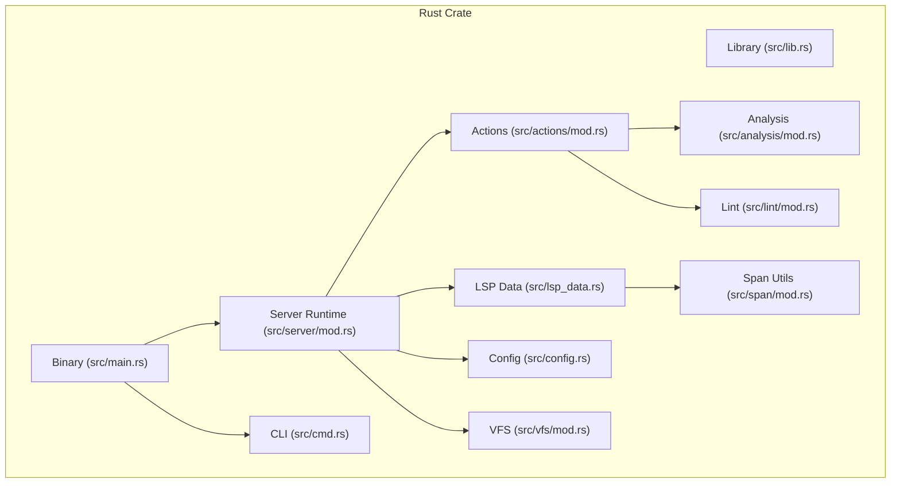

**Diagram sources**
- [src/lib.rs](file://src/lib.rs#L31-L49)
- [src/main.rs](file://src/main.rs#L15-L59)
- [src/cmd.rs](file://src/cmd.rs#L46-L140)
- [src/server/mod.rs](file://src/server/mod.rs#L68-L84)
- [src/lsp_data.rs](file://src/lsp_data.rs#L9-L21)
- [src/config.rs](file://src/config.rs#L123-L140)
- [src/span/mod.rs](file://src/span/mod.rs#L1-L120)
- [src/actions/mod.rs](file://src/actions/mod.rs#L97-L177)
- [src/vfs/mod.rs](file://src/vfs/mod.rs#L29-L184)
- [src/analysis/mod.rs](file://src/analysis/mod.rs#L1-L120)
- [src/lint/mod.rs](file://src/lint/mod.rs#L49-L76)

**Section sources**
- [Cargo.toml](file://Cargo.toml#L1-L62)
- [src/lib.rs](file://src/lib.rs#L31-L56)
- [src/main.rs](file://src/main.rs#L15-L59)

## Core Components
- Library entry points and exports:
  - Library module re-exports core subsystems and defines a convenience type alias for spans.
  - Public API surface includes server runtime, configuration, LSP data helpers, and span utilities.
- Command-line interface:
  - CLI entry point parses arguments and runs the server in CLI mode or starts the LSP server.
- Server runtime:
  - Implements the LSP server loop, request dispatching, and lifecycle management (initialize, shutdown, exit).
- LSP data helpers:
  - URI/path conversion, range/position translation, and configuration deserialization helpers.
- Configuration:
  - Structured configuration with serialization/deserialization, defaults, and update semantics.
- Span utilities:
  - Zero-indexed and one-indexed positions, ranges, and spans with efficient path storage and comparisons.
- Actions and analysis:
  - Request/notification handlers, analysis queues, diagnostics publishing, and device context management.
- Virtual File System:
  - In-memory text editing, line indexing, and change coalescing with robust error handling.
- Lint engine:
  - Style rule configuration, parsing, and application with annotation support.

**Section sources**
- [src/lib.rs](file://src/lib.rs#L31-L56)
- [src/cmd.rs](file://src/cmd.rs#L46-L140)
- [src/server/mod.rs](file://src/server/mod.rs#L68-L84)
- [src/lsp_data.rs](file://src/lsp_data.rs#L46-L107)
- [src/config.rs](file://src/config.rs#L123-L140)
- [src/span/mod.rs](file://src/span/mod.rs#L464-L579)
- [src/actions/mod.rs](file://src/actions/mod.rs#L97-L177)
- [src/vfs/mod.rs](file://src/vfs/mod.rs#L180-L288)
- [src/lint/mod.rs](file://src/lint/mod.rs#L49-L76)

## Architecture Overview
The DLS follows a layered architecture:
- CLI layer (optional) wraps the server and exposes simple commands.
- Server layer handles JSON-RPC/LSP messages, dispatches to actions, and manages state.
- Actions layer implements request/notification handlers, analysis orchestration, and diagnostics.
- Analysis layer performs parsing, symbol resolution, and device analysis.
- VFS layer provides in-memory text editing and file snapshots.
- LSP data layer bridges DLS types and LSP types, including URI/path conversions and configuration parsing.

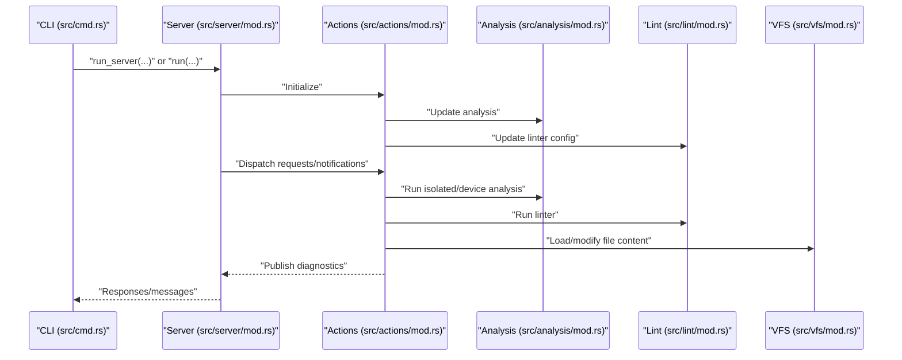

**Diagram sources**
- [src/cmd.rs](file://src/cmd.rs#L373-L402)
- [src/server/mod.rs](file://src/server/mod.rs#L322-L472)
- [src/actions/mod.rs](file://src/actions/mod.rs#L408-L501)
- [src/analysis/mod.rs](file://src/analysis/mod.rs#L246-L269)
- [src/lint/mod.rs](file://src/lint/mod.rs#L208-L243)
- [src/vfs/mod.rs](file://src/vfs/mod.rs#L457-L466)

## Detailed Component Analysis

### CLI Interface
The CLI provides a simple command-driven interface to the DLS server. It initializes the server, sends commands, and prints results.

- Entry point and argument parsing:
  - Defines a CLI mode flag and optional compile-info and lint configuration paths.
  - Starts the server in CLI mode or LSP mode depending on flags.
- Command set:
  - Definitions, workspace management, document symbols, open file, context mode, contexts, set-contexts, wait, help, quit.
- Helpers:
  - Initializes server, constructs requests/notifications, and prints responses.

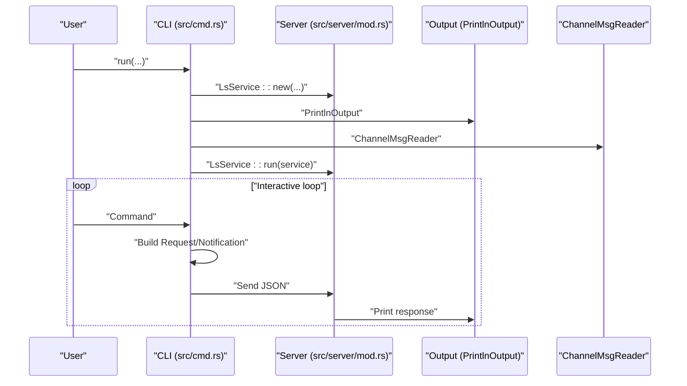

**Diagram sources**
- [src/cmd.rs](file://src/cmd.rs#L46-L140)
- [src/cmd.rs](file://src/cmd.rs#L373-L402)
- [src/server/mod.rs](file://src/server/mod.rs#L322-L367)

**Section sources**
- [src/main.rs](file://src/main.rs#L21-L59)
- [src/cmd.rs](file://src/cmd.rs#L46-L140)
- [src/cmd.rs](file://src/cmd.rs#L373-L402)

### Server Runtime
The server runtime implements the LSP server loop, request dispatching, and lifecycle management.

- Lifecycle:
  - run_server initializes VFS and configuration, constructs LsService, and runs the loop.
  - InitializeRequest sets up capabilities, resolves workspaces, and triggers builtin analysis.
  - ShutdownRequest transitions server into shutdown mode and cancels jobs.
- Dispatch:
  - Dispatches notifications, blocking requests, and regular requests to appropriate handlers.
- Capabilities:
  - Declares supported LSP features and experimental features.

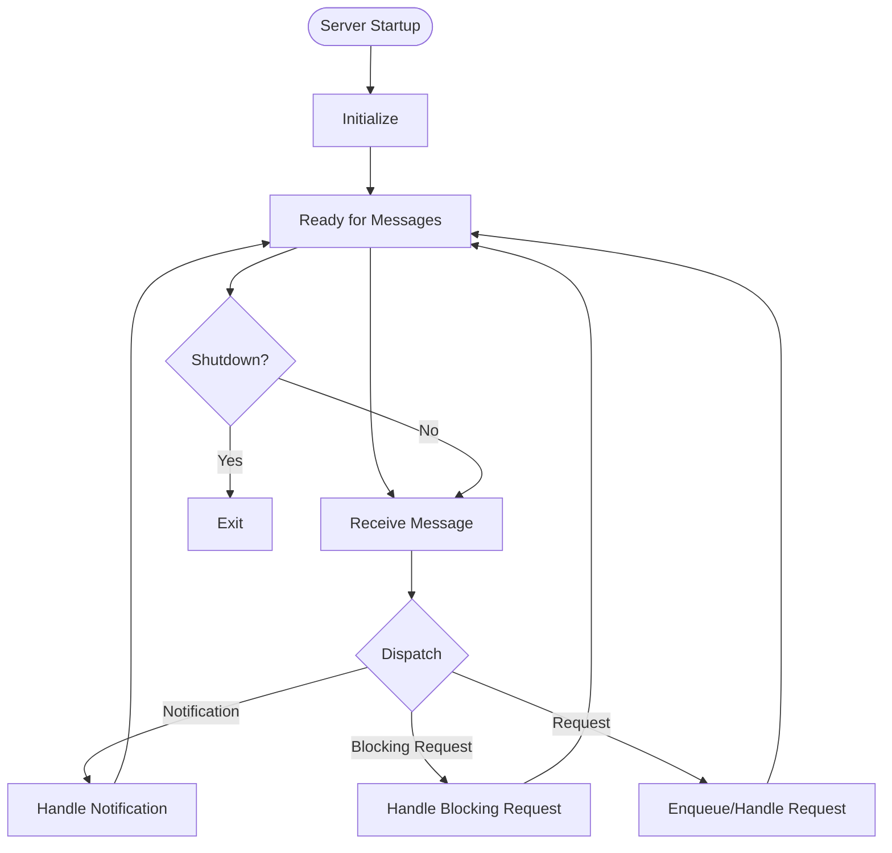

**Diagram sources**
- [src/server/mod.rs](file://src/server/mod.rs#L68-L84)
- [src/server/mod.rs](file://src/server/mod.rs#L207-L288)
- [src/server/mod.rs](file://src/server/mod.rs#L322-L472)

**Section sources**
- [src/server/mod.rs](file://src/server/mod.rs#L68-L84)
- [src/server/mod.rs](file://src/server/mod.rs#L207-L288)
- [src/server/mod.rs](file://src/server/mod.rs#L322-L472)

### LSP Data Types and Helpers
The LSP data module provides utilities for converting between DLS internal types and LSP types, and for parsing URIs and paths.

- URI/path conversion:
  - parse_file_path converts a URI to a PathBuf.
  - parse_uri converts a path string to a URI.
- Range/position/location conversions:
  - Conversions between LSP Range/Position and DLS Span/FilePosition/Location.
  - Helper to compute a Range spanning the entire file content.
- Configuration parsing:
  - InitializationOptions and ClientCapabilities wrappers.
  - ChangeConfigSettings for reading DLS-specific settings from JSON.

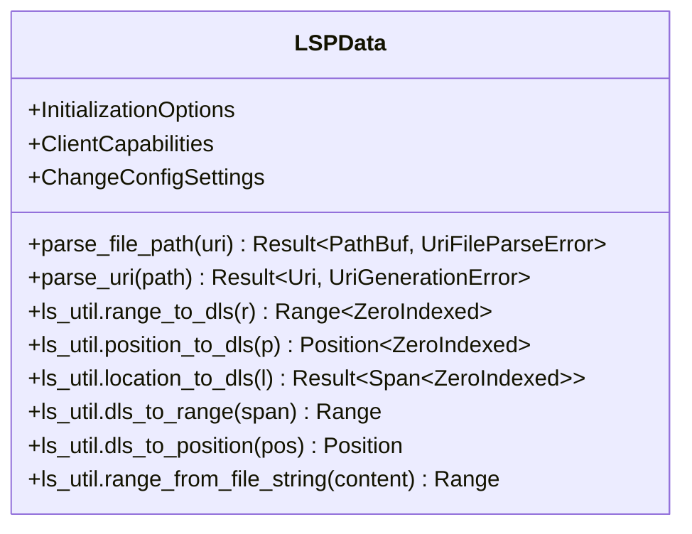

**Diagram sources**
- [src/lsp_data.rs](file://src/lsp_data.rs#L46-L107)
- [src/lsp_data.rs](file://src/lsp_data.rs#L127-L216)
- [src/lsp_data.rs](file://src/lsp_data.rs#L284-L335)

**Section sources**
- [src/lsp_data.rs](file://src/lsp_data.rs#L46-L107)
- [src/lsp_data.rs](file://src/lsp_data.rs#L127-L216)
- [src/lsp_data.rs](file://src/lsp_data.rs#L284-L335)

### Configuration API
The configuration module defines the server configuration structure, defaults, and deserialization logic.

- Config structure:
  - Fields include warning frequency, analysis-on-save, features, linting settings, debug level, compile info path, analysis retention, and device context mode.
- DeviceContextMode:
  - Enumerates modes for activating device contexts (Always, AnyNew, SameModule, First, Never).
- Deserialization:
  - try_deserialize and try_deserialize_vec parse JSON into Config, track unknown/duplicated/deprecated keys, and enforce minimum retention duration.
- Defaults:
  - Default values for all fields.

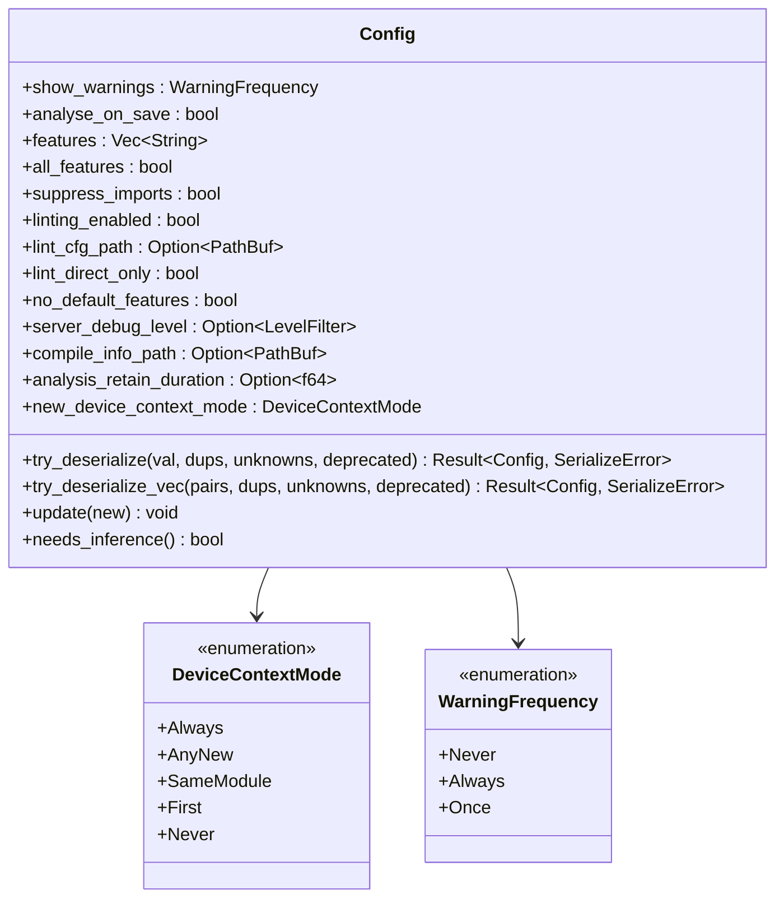

**Diagram sources**
- [src/config.rs](file://src/config.rs#L123-L140)
- [src/config.rs](file://src/config.rs#L101-L118)
- [src/config.rs](file://src/config.rs#L142-L147)
- [src/config.rs](file://src/config.rs#L234-L320)

**Section sources**
- [src/config.rs](file://src/config.rs#L123-L140)
- [src/config.rs](file://src/config.rs#L101-L118)
- [src/config.rs](file://src/config.rs#L234-L320)

### Span Management Utilities
The span module provides zero-indexed and one-indexed position/range/span abstractions with efficient path storage and comparison.

- Types:
  - Row, Column, Position, Range, Location, Span, FilePosition.
  - Indexed trait and ZeroIndexed/OneIndexed markers.
- Path storage:
  - Efficient storage of PathBuf via slotmap with shared indices.
- Operations:
  - Conversions between indexed forms, combining ranges/spans, containment and overlap checks, invalid sentinel values.

```mermaid
classDiagram
class Span~I : Indexed~ {
+file : PathBufKey
+range : Range~I~
+path() PathBuf
+new(row_start,row_end,col_start,col_end,file) Span~I~
+from_range(range,file) Span~I~
+from_positions(start,end,file) Span~I~
+combine(first,second) Span~I~
+start_position() FilePosition~I~
+end_position() FilePosition~I~
+contains_pos(pos) bool
+zero_indexed() Span~ZeroIndexed~
+one_indexed() Span~OneIndexed~
}
class Range~I : Indexed~ {
+row_start : Row~I~
+row_end : Row~I~
+col_start : Column~I~
+col_end : Column~I~
+new(rs,re,cs,ce) Range~I~
+from_positions(start,end) Range~I~
+start() Position~I~
+end() Position~I~
+combine(first,second) Range~I~
+contains(other) ContainsResult
+contains_pos(pos) bool
+overlaps(range) bool
+invalid() Range~I~
+zero_indexed() Range~ZeroIndexed~
+one_indexed() Range~OneIndexed~
}
class Position~I : Indexed~ {
+row : Row~I~
+col : Column~I~
+new(row,col) Position~I~
+zero_indexed() Position~ZeroIndexed~
+one_indexed() Position~OneIndexed~
}
class FilePosition~I : Indexed~ {
+file : PathBufKey
+position : Position~I~
+new(position,file) FilePosition~I~
+path() PathBuf
}
class Location~I : Indexed~ {
+file : PathBuf
+position : Position~I~
+new(row,col,file) Location~I~
+from_position(position,file) Location~I~
+zero_indexed() Location~ZeroIndexed~
+one_indexed() Location~OneIndexed~
}
Span~I|Range~I|Position~I|FilePosition~I|Location~I| --* Row~I|Column~I~ : composed of
```

**Diagram sources**
- [src/span/mod.rs](file://src/span/mod.rs#L464-L579)
- [src/span/mod.rs](file://src/span/mod.rs#L262-L368)
- [src/span/mod.rs](file://src/span/mod.rs#L161-L204)
- [src/span/mod.rs](file://src/span/mod.rs#L241-L261)
- [src/span/mod.rs](file://src/span/mod.rs#L430-L463)

**Section sources**
- [src/span/mod.rs](file://src/span/mod.rs#L464-L579)
- [src/span/mod.rs](file://src/span/mod.rs#L262-L368)
- [src/span/mod.rs](file://src/span/mod.rs#L161-L204)
- [src/span/mod.rs](file://src/span/mod.rs#L241-L261)
- [src/span/mod.rs](file://src/span/mod.rs#L430-L463)

### Actions and Request/Notification Handlers
The actions module orchestrates server-side behavior, including initialization, analysis updates, diagnostics publishing, and device context management.

- Context:
  - ActionContext encapsulates server state across requests/notifications.
  - InitActionContext and UninitActionContext manage initialized/uninitialized states.
- Initialization:
  - Initializes analysis storage, VFS, configuration, and client capabilities.
- Analysis:
  - Updates compilation info, linter config, and triggers analysis on workspace changes.
  - Reports errors via diagnostics and manages progress notifications.
- Device analysis:
  - Triggers device analysis for dependent files and manages device contexts.
- Lint:
  - Runs linter on demand and merges results with analysis.

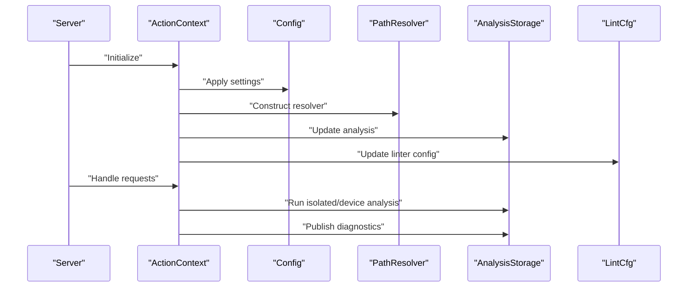

**Diagram sources**
- [src/actions/mod.rs](file://src/actions/mod.rs#L115-L177)
- [src/actions/mod.rs](file://src/actions/mod.rs#L417-L422)
- [src/actions/mod.rs](file://src/actions/mod.rs#L453-L501)

**Section sources**
- [src/actions/mod.rs](file://src/actions/mod.rs#L97-L177)
- [src/actions/mod.rs](file://src/actions/mod.rs#L417-L501)

### Virtual File System (VFS)
The VFS provides in-memory text editing, line indexing, and change coalescing with robust error handling.

- Core operations:
  - load_file, snapshot_file, load_line, load_lines, load_span, for_each_line.
  - on_changes, set_file, write_file, flush_file, file_saved, file_is_synced.
  - set_user_data, with_user_data, ensure_user_data.
- Change model:
  - Coalesces multiple changes per file and applies them atomically.
- Error model:
  - Comprehensive error enumeration covering out-of-sync, IO, bad locations, and internal errors.

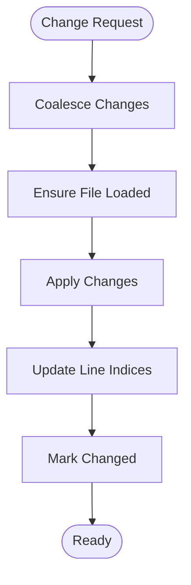

**Diagram sources**
- [src/vfs/mod.rs](file://src/vfs/mod.rs#L354-L379)
- [src/vfs/mod.rs](file://src/vfs/mod.rs#L468-L512)
- [src/vfs/mod.rs](file://src/vfs/mod.rs#L731-L777)

**Section sources**
- [src/vfs/mod.rs](file://src/vfs/mod.rs#L180-L288)
- [src/vfs/mod.rs](file://src/vfs/mod.rs#L354-L379)
- [src/vfs/mod.rs](file://src/vfs/mod.rs#L468-L512)
- [src/vfs/mod.rs](file://src/vfs/mod.rs#L731-L777)

### Analysis Engine
The analysis module provides parsing, symbol resolution, and device analysis.

- Data structures:
  - DMLError, LocalDMLError, IsolatedAnalysis, DeviceAnalysis, ReferenceMatches.
  - SymbolStorage, ReferenceStorage, RangeEntry.
- Features:
  - Error construction with severity and related spans.
  - Device context traversal and template matching.
  - Reference caching and scoping.

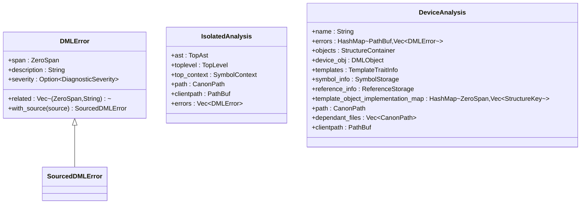

**Diagram sources**
- [src/analysis/mod.rs](file://src/analysis/mod.rs#L164-L194)
- [src/analysis/mod.rs](file://src/analysis/mod.rs#L246-L269)
- [src/analysis/mod.rs](file://src/analysis/mod.rs#L358-L374)

**Section sources**
- [src/analysis/mod.rs](file://src/analysis/mod.rs#L164-L194)
- [src/analysis/mod.rs](file://src/analysis/mod.rs#L246-L269)
- [src/analysis/mod.rs](file://src/analysis/mod.rs#L358-L374)

### Lint Engine
The lint module provides style rule configuration, parsing, and application with annotation support.

- Configuration:
  - LintCfg with numerous rule categories and defaults.
  - try_deserialize detects unknown fields and tracks warnings.
- Analysis:
  - LinterAnalysis produces DMLError entries from style violations.
  - begin_style_check applies rules and post-processes results.
- Annotations:
  - dml-lint annotations to allow/disallow specific rules per file/line.

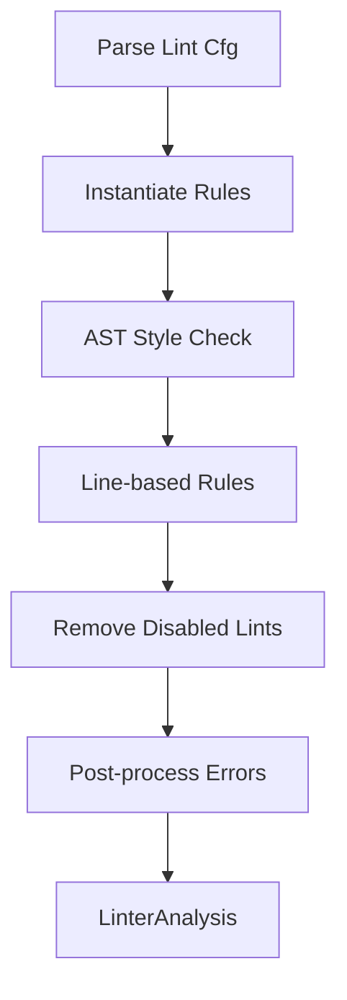

**Diagram sources**
- [src/lint/mod.rs](file://src/lint/mod.rs#L135-L183)
- [src/lint/mod.rs](file://src/lint/mod.rs#L208-L243)
- [src/lint/mod.rs](file://src/lint/mod.rs#L245-L265)
- [src/lint/mod.rs](file://src/lint/mod.rs#L288-L399)

**Section sources**
- [src/lint/mod.rs](file://src/lint/mod.rs#L49-L76)
- [src/lint/mod.rs](file://src/lint/mod.rs#L135-L183)
- [src/lint/mod.rs](file://src/lint/mod.rs#L208-L243)
- [src/lint/mod.rs](file://src/lint/mod.rs#L245-L265)
- [src/lint/mod.rs](file://src/lint/mod.rs#L288-L399)

### Library API for External Integration
The library exposes a minimal public API surface suitable for embedding or extending the server.

- Library exports:
  - Re-exports major modules and defines a type alias for Span.
  - Exposes version() function returning the package version.
- Integration patterns:
  - Embedding the server in another process by constructing LsService and running the loop.
  - Using LSP data helpers for URI/path conversions and configuration parsing.
  - Leveraging span utilities for precise diagnostics and edits.

**Section sources**
- [src/lib.rs](file://src/lib.rs#L31-L56)
- [src/server/mod.rs](file://src/server/mod.rs#L291-L320)

### Error Types and Handling
The DLS defines structured error types and error handling patterns across modules.

- LSP data errors:
  - UriFileParseError and UriGenerationError for URI/path conversion failures.
- VFS errors:
  - Comprehensive Error enumeration covering synchronization, IO, location, and internal errors.
- Lint errors:
  - Unknown fields detection and reporting via server notifications.
- Logging:
  - Centralized logging functions for info/warning/error messages.

**Section sources**
- [src/lsp_data.rs](file://src/lsp_data.rs#L22-L44)
- [src/lsp_data.rs](file://src/lsp_data.rs#L65-L77)
- [src/vfs/mod.rs](file://src/vfs/mod.rs#L109-L147)
- [src/server/mod.rs](file://src/server/mod.rs#L127-L147)

### Configuration Options
Key configuration options and their effects:

- General:
  - show_warnings: Controls warning emission frequency.
  - analyse_on_save: Analyze only on save.
  - features/all_features/no_default_features: Feature toggles.
  - suppress_imports: Suppress automatic analysis of imported files.
  - linting_enabled: Enable/disable linting.
  - lint_cfg_path: Path to lint configuration JSON.
  - lint_direct_only: Limit linting to directly opened files.
  - server_debug_level: Global log level override.
  - compile_info_path: Path to compilation info JSON.
  - analysis_retain_duration: Minimum retention for analysis results.
  - new_device_context_mode: Device context activation policy.

**Section sources**
- [src/config.rs](file://src/config.rs#L123-L140)
- [src/config.rs](file://src/config.rs#L234-L320)

### Versioning Scheme and Compatibility
- Version:
  - The package version is defined in Cargo.toml and exposed via the library’s version() function.
- Backward compatibility:
  - Configuration deserialization tolerates unknown fields and reports them as warnings.
  - Deprecated configuration keys are tracked and reported as warnings.
- Deprecation policy:
  - Deprecated options are recorded in a static map and surfaced to clients via warnings.

**Section sources**
- [Cargo.toml](file://Cargo.toml#L3-L3)
- [src/lib.rs](file://src/lib.rs#L53-L55)
- [src/config.rs](file://src/config.rs#L229-L232)
- [src/server/mod.rs](file://src/server/mod.rs#L149-L165)

### Examples of API Usage and Integration Patterns
- CLI usage:
  - Start the CLI with optional compile-info and lint configuration paths.
  - Issue commands like goto definition, workspace management, and context control.
- LSP client integration:
  - Initialize the server with capabilities and workspace folders.
  - Subscribe to diagnostics and handle progress notifications.
- Python integration (Python port):
  - Use version() to query the package version.
  - Use internal_error() to log internal errors consistently.

**Section sources**
- [src/cmd.rs](file://src/cmd.rs#L46-L140)
- [src/server/mod.rs](file://src/server/mod.rs#L207-L288)
- [python-port/dml_language_server/__init__.py](file://python-port/dml_language_server/__init__.py#L29-L40)

## Dependency Analysis
External dependencies and their roles:

- jsonrpc: JSON-RPC protocol support.
- lsp-types: LSP protocol types and capabilities.
- serde/serde_json: Serialization/deserialization for configuration and messages.
- log/env_logger: Logging infrastructure.
- crossbeam/crossbeam-deque: Multi-producer/consumer channels and work-stealing deque for concurrency.
- rayon: Parallel iterators for analysis.
- regex/logos: Regular expressions and lexical analysis.
- slotmap/store-interval-tree: Efficient storage and spatial indexing.
- urlencoding: URI decoding for file paths.
- tokio/async-trait: Async support for MCP features.

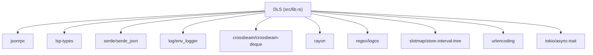

**Diagram sources**
- [Cargo.toml](file://Cargo.toml#L33-L62)

**Section sources**
- [Cargo.toml](file://Cargo.toml#L33-L62)

## Performance Considerations
- Concurrency:
  - Uses crossbeam channels and rayon for parallelism and efficient job distribution.
- Memory:
  - Efficient path storage via slotmap reduces memory overhead for repeated paths.
- Analysis retention:
  - Enforces a minimum retention duration to prevent premature discarding of dependent analyses.
- VFS:
  - Coalesces changes and maintains line indices for fast substring operations.

[No sources needed since this section provides general guidance]

## Troubleshooting Guide
- Unknown configuration keys:
  - Detected during configuration deserialization and reported as warnings to the client.
- Deprecated configuration keys:
  - Reported with optional notices indicating migration guidance.
- Lint configuration issues:
  - Unknown fields are detected and reported; annotations without effect are warned.
- VFS errors:
  - Out-of-sync, IO, and bad location errors are surfaced with descriptive messages.

**Section sources**
- [src/server/mod.rs](file://src/server/mod.rs#L109-L125)
- [src/server/mod.rs](file://src/server/mod.rs#L149-L165)
- [src/lint/mod.rs](file://src/lint/mod.rs#L63-L76)
- [src/vfs/mod.rs](file://src/vfs/mod.rs#L109-L147)

## Conclusion
The DML Language Server provides a robust, extensible foundation for DML development environments. Its modular design, strong LSP integration, and comprehensive configuration enable flexible client integrations and powerful analysis capabilities. The API reference documents the public interfaces, data structures, and operational patterns necessary for building clients and extending the server.

[No sources needed since this section summarizes without analyzing specific files]

## Appendices

### Appendix A: Public Functions and Exports
- Library:
  - version(): Returns the package version string.
  - Re-exported modules: actions, analysis, cmd, concurrency, config, dfa, file_management, lint, lsp_data, mcp, server, span, utility, vfs.
- CLI:
  - run(compile_info_path, linting_enabled, lint_cfg): Starts the CLI server and processes commands.
- Server:
  - run_server(vfs): Starts the LSP server loop.
  - LsService::new(...) and LsService::run(...): Construct and run the service.
- LSP Data:
  - parse_file_path, parse_uri, range conversions, InitializationOptions, ClientCapabilities, ChangeConfigSettings.
- Config:
  - Config::try_deserialize, Config::try_deserialize_vec, Config::update, DeviceContextMode, WarningFrequency.
- Span:
  - Span, Range, Position, FilePosition, Location, conversions and constructors.
- VFS:
  - Vfs::load_file, snapshot_file, load_line, load_lines, load_span, on_changes, set_file, write_file, flush_file, file_saved, file_is_synced, set_user_data, with_user_data, ensure_user_data.
- Analysis:
  - DMLError, IsolatedAnalysis, DeviceAnalysis, ReferenceMatches.
- Lint:
  - LintCfg, parse_lint_cfg, maybe_parse_lint_cfg, LinterAnalysis.

**Section sources**
- [src/lib.rs](file://src/lib.rs#L53-L55)
- [src/cmd.rs](file://src/cmd.rs#L46-L140)
- [src/server/mod.rs](file://src/server/mod.rs#L68-L84)
- [src/lsp_data.rs](file://src/lsp_data.rs#L46-L107)
- [src/config.rs](file://src/config.rs#L234-L320)
- [src/span/mod.rs](file://src/span/mod.rs#L464-L579)
- [src/vfs/mod.rs](file://src/vfs/mod.rs#L180-L288)
- [src/analysis/mod.rs](file://src/analysis/mod.rs#L164-L194)
- [src/lint/mod.rs](file://src/lint/mod.rs#L49-L76)