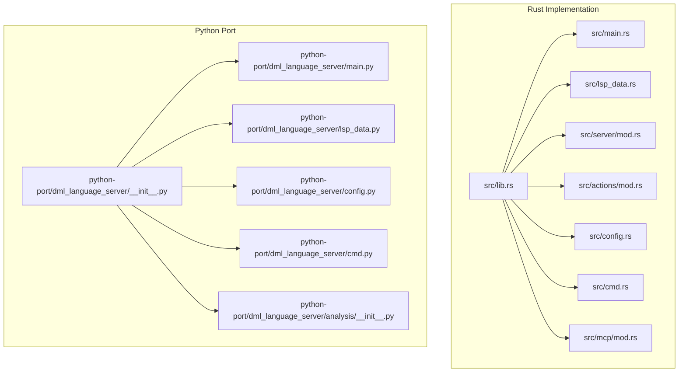
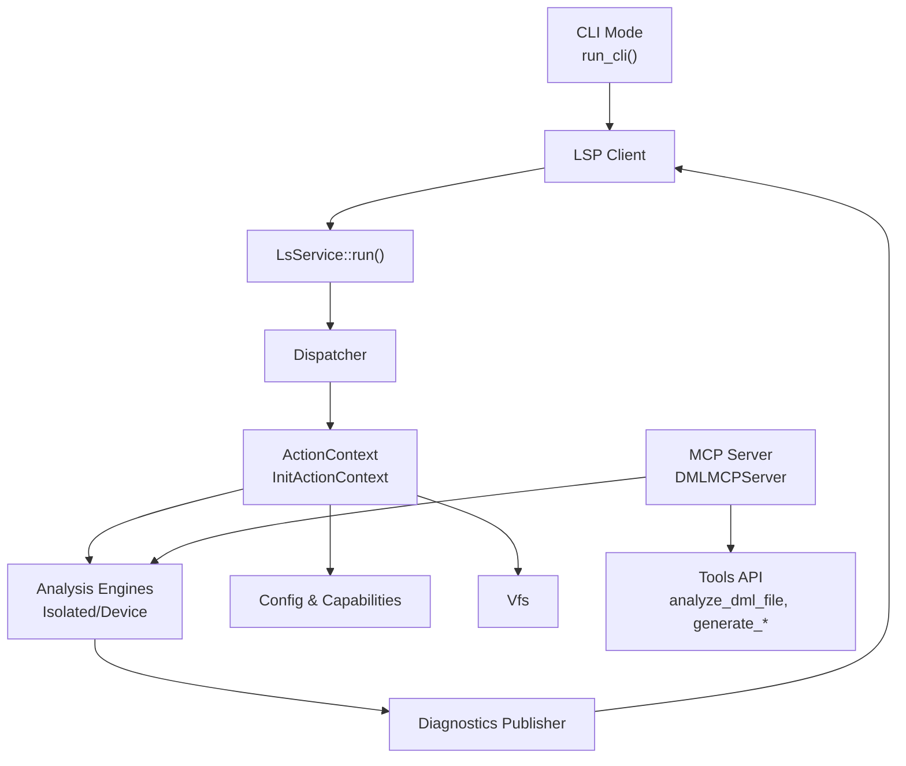
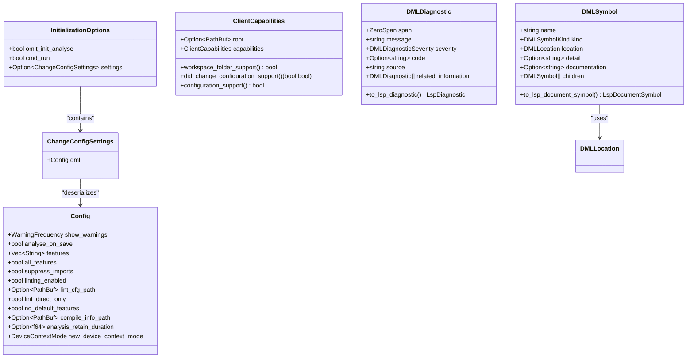
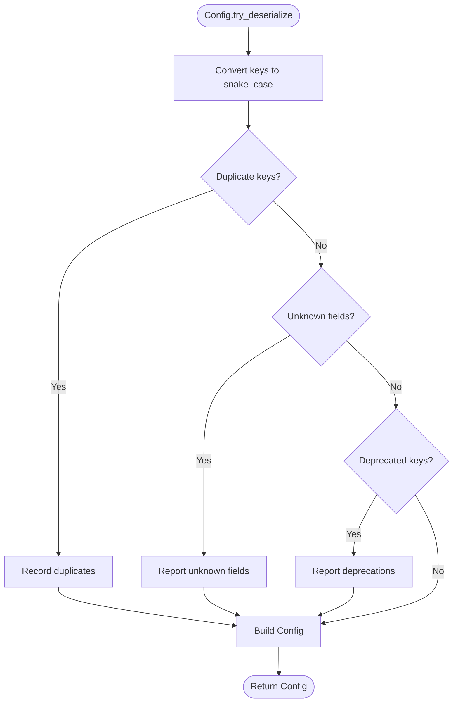
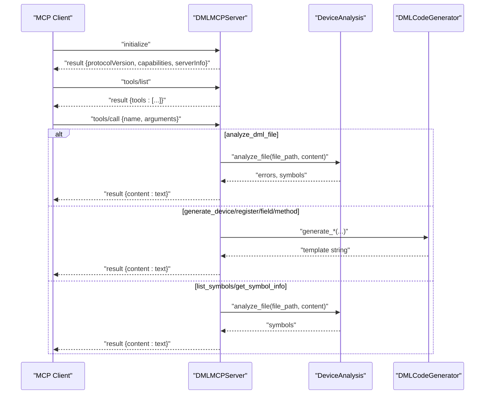
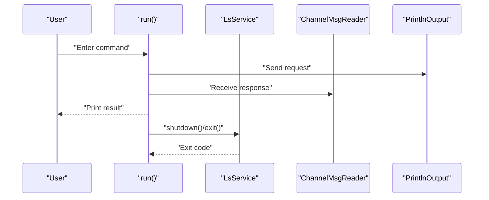
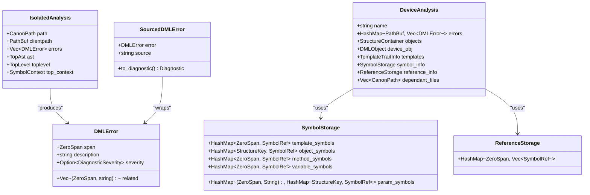
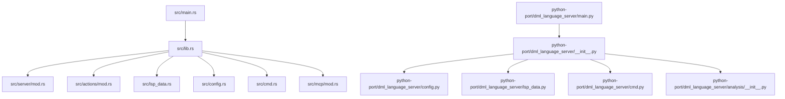

# API Reference

<cite>
**Referenced Files in This Document**
- [lib.rs](file://src/lib.rs)
- [main.rs](file://src/main.rs)
- [lsp_data.rs](file://src/lsp_data.rs)
- [server/mod.rs](file://src/server/mod.rs)
- [actions/mod.rs](file://src/actions/mod.rs)
- [config.rs](file://src/config.rs)
- [cmd.rs](file://src/cmd.rs)
- [mcp/mod.rs](file://src/mcp/mod.rs)
- [__init__.py](file://python-port/dml_language_server/__init__.py)
- [main.py](file://python-port/dml_language_server/main.py)
- [lsp_data.py](file://python-port/dml_language_server/lsp_data.py)
- [config.py](file://python-port/dml_language_server/config.py)
- [cmd.py](file://python-port/dml_language_server/cmd.py)
- [analysis/__init__.py](file://python-port/dml_language_server/analysis/__init__.py)
</cite>

## Table of Contents
1. [Introduction](#introduction)
2. [Project Structure](#project-structure)
3. [Core Components](#core-components)
4. [Architecture Overview](#architecture-overview)
5. [Detailed Component Analysis](#detailed-component-analysis)
6. [Dependency Analysis](#dependency-analysis)
7. [Performance Considerations](#performance-considerations)
8. [Troubleshooting Guide](#troubleshooting-guide)
9. [Conclusion](#conclusion)

## Introduction
This document provides a comprehensive API reference for the DML Language Server, covering both the Rust implementation and its Python port. It documents public interfaces, module-level APIs, function signatures, LSP request/response schemas, MCP protocol specifications, configuration APIs, error handling patterns, diagnostic reporting, examples, parameter validation rules, performance characteristics, backward compatibility guarantees, deprecation notices, migration paths, and internal extension APIs for custom analysis tools.

## Project Structure
The repository contains two primary implementations:
- Rust implementation under src/, providing the production language server with LSP and MCP support, configuration management, and analysis engines.
- Python port under python-port/, offering a compatible API surface mirroring the Rust implementation for environments requiring Python-based tooling.

**Diagram sources**
- [lib.rs](file://src/lib.rs#L31-L47)
- [main.rs](file://src/main.rs#L15-L59)
- [lsp_data.rs](file://src/lsp_data.rs#L9-L21)
- [server/mod.rs](file://src/server/mod.rs#L67-L84)
- [actions/mod.rs](file://src/actions/mod.rs#L70-L150)
- [config.rs](file://src/config.rs#L120-L139)
- [cmd.rs](file://src/cmd.rs#L46-L140)
- [mcp/mod.rs](file://src/mcp/mod.rs#L6-L14)
- [__init__.py](file://python-port/dml_language_server/__init__.py#L29-L48)
- [main.py](file://python-port/dml_language_server/main.py#L25-L106)
- [lsp_data.py](file://python-port/dml_language_server/lsp_data.py#L14-L32)
- [config.py](file://python-port/dml_language_server/config.py#L89-L130)
- [cmd.py](file://python-port/dml_language_server/cmd.py#L21-L115)
- [analysis/__init__.py](file://python-port/dml_language_server/analysis/__init__.py#L181-L370)

**Section sources**
- [lib.rs](file://src/lib.rs#L31-L47)
- [__init__.py](file://python-port/dml_language_server/__init__.py#L29-L48)

## Core Components
This section outlines the main exported APIs and module-level functions available to consumers and integrators.

- Rust Library Exports
  - Public modules: actions, analysis, cmd, concurrency, config, dfa, file_management, lint, lsp_data, mcp, server, span, utility, vfs.
  - Utility functions: version() -> String.
  - Internal macro: internal_error!.

- Python Port Exports
  - Functions: version() -> str, internal_error(message: str, *args) -> None.
  - Classes and dataclasses: Config, InitializationOptions, CompileInfo, LintConfig, DMLDiagnostic, DMLLocation, DMLTextEdit, DMLWorkspaceEdit, DMLSymbol, DMLSymbolKind, DMLCompletionItem, DMLHover, DMLCodeGenerator, DMLMCPServer, MCPRequest, MCPResponse, ToolInfo, ServerInfo, ServerCapabilities.
  - Constants: MCP_VERSION.

- Command-Line Interfaces
  - Rust CLI: run(compile_info_path: Option<PathBuf>, linting_enabled: Option<bool>, lint_cfg: Option<PathBuf>) -> void.
  - Python CLI: run_cli(compile_info_path: Optional[Path], linting_enabled: bool, lint_cfg_path: Optional[Path]) -> int, analyze_single_file(file_path: Path, config: Optional[Config] = None) -> int.

- LSP Integration
  - Server entry: run_server(vfs: Arc<Vfs>) -> i32.
  - Initialization options: InitializationOptions with fields for omit_init_analyse, cmd_run, settings.
  - Client capabilities wrapper: ClientCapabilities with convenience methods workspace_folder_support(), did_change_configuration_support(), configuration_support().
  - URI conversion utilities: parse_file_path(uri: &Uri) -> Result<PathBuf, UriFileParseError>, parse_uri(path: &str) -> Result<Uri, UriGenerationError>.

- Configuration Management
  - Rust Config: fields include show_warnings, analyse_on_save, features, all_features, suppress_imports, linting_enabled, lint_cfg_path, lint_direct_only, no_default_features, compile_info_path, analysis_retain_duration, new_device_context_mode.
  - Python Config: workspace_root, initialization_options, compile_commands, lint_config, include_paths, dmlc_flags; methods load_compile_commands(path), get_compile_info(file_path), get_include_paths_for_file(file_path), get_dmlc_flags_for_file(file_path), load_lint_config(path), is_linting_enabled(), get_max_diagnostics_per_file(), add_include_path(path), add_dmlc_flag(flag), get_all_device_files(), clear(), to_dict().

- MCP Protocol
  - Server capabilities: tools, resources, prompts, logging.
  - Server info: name, version.
  - Request/response envelopes: MCPRequest(method, params, id), MCPResponse(result, error, id).
  - Tools: analyze_dml_file, generate_device, generate_register, generate_field, generate_method, list_symbols, get_symbol_info.

- Analysis Engine
  - Rust: IsolatedAnalysis, DeviceAnalysis, SymbolStorage, ReferenceStorage, DMLError, SourcedDMLError, PathResolver, AnalysisStorage, AnalysisQueue, ProgressNotifiers.
  - Python: IsolatedAnalysis, DeviceAnalysis, AdvancedSymbolTable, SymbolScope, SymbolDefinition, TemplateSystem, EnhancedDMLParser, DMLError, DMLErrorKind, SymbolReference, NodeRef.

**Section sources**
- [lib.rs](file://src/lib.rs#L51-L53)
- [__init__.py](file://python-port/dml_language_server/__init__.py#L29-L48)
- [cmd.rs](file://src/cmd.rs#L46-L140)
- [cmd.py](file://python-port/dml_language_server/cmd.py#L21-L115)
- [server/mod.rs](file://src/server/mod.rs#L67-L84)
- [lsp_data.rs](file://src/lsp_data.rs#L282-L354)
- [config.rs](file://src/config.rs#L120-L139)
- [config.py](file://python-port/dml_language_server/config.py#L89-L130)
- [mcp/mod.rs](file://src/mcp/mod.rs#L17-L54)
- [analysis/__init__.py](file://python-port/dml_language_server/analysis/__init__.py#L181-L370)

## Architecture Overview
The DML Language Server follows a layered architecture:
- Entry points: CLI and LSP server modes.
- Protocol adapters: LSP and MCP request/response handling.
- Action pipeline: request/notification dispatch, analysis orchestration, diagnostics publishing.
- Analysis engines: isolated and device-level analysis with symbol resolution and reference tracking.
- Configuration and VFS: centralized configuration, workspace roots, include paths, and virtual file system.

**Diagram sources**
- [main.rs](file://src/main.rs#L44-L59)
- [server/mod.rs](file://src/server/mod.rs#L322-L470)
- [actions/mod.rs](file://src/actions/mod.rs#L70-L150)
- [cmd.py](file://python-port/dml_language_server/cmd.py#L21-L115)
- [mcp/mod.rs](file://src/mcp/mod.rs#L11-L14)

## Detailed Component Analysis

### LSP Request/Response Schema and Capabilities
- Initialization Options
  - Fields: omit_init_analyse: bool, cmd_run: bool, settings: Option<ChangeConfigSettings>.
  - Validation: camelCase deserialization; nested settings dml.Config is validated with duplicate detection, unknown fields reporting, and deprecation notices.
- Client Capabilities Wrapper
  - Methods: workspace_folder_support(), did_change_configuration_support(), configuration_support().
  - Behavior: extracts root workspace and capability flags from InitializeParams.
- URI Utilities
  - parse_file_path(uri): file scheme validation, URL decoding, platform-specific path normalization.
  - parse_uri(path): canonicalization, UNC path handling, Windows backslash normalization, file URI construction.
- Diagnostic and Symbol Types (Rust)
  - DLSLimitation, DMLError, SourcedDMLError, Diagnostic conversion helpers.
  - RangeExt trait for overlap checks.
- Diagnostic and Symbol Types (Python)
  - DMLDiagnostic, DMLLocation, DMLTextEdit, DMLWorkspaceEdit, DMLSymbol, DMLSymbolKind, DMLCompletionItem, DMLHover.
  - Conversion helpers to LSP types with zero/one indexing transformations.

**Diagram sources**
- [lsp_data.rs](file://src/lsp_data.rs#L282-L354)
- [lsp_data.rs](file://src/lsp_data.rs#L120-L214)
- [config.rs](file://src/config.rs#L120-L139)
- [lsp_data.py](file://python-port/dml_language_server/lsp_data.py#L42-L220)

**Section sources**
- [lsp_data.rs](file://src/lsp_data.rs#L282-L354)
- [lsp_data.rs](file://src/lsp_data.rs#L120-L214)
- [config.rs](file://src/config.rs#L120-L139)
- [lsp_data.py](file://python-port/dml_language_server/lsp_data.py#L42-L220)

### Configuration API Endpoints and Validation
- Rust Config
  - try_deserialize(val, dups, unknowns, deprecated) -> Result<Config, SerializeError>: snake_case conversion, duplicate detection, unknown field reporting, deprecation notices.
  - update(new_config): enforces minimum analysis_retain_duration threshold.
  - DeviceContextMode: Always, AnyNew, SameModule, First, Never.
- Python Config
  - InitializationOptions.from_dict(): converts log_level string to enum, validates presence of required fields.
  - load_compile_commands(path): parses JSON mapping device paths to include paths and dmlc flags; logs warnings for non-.dml entries.
  - get_compile_info(file_path), get_include_paths_for_file(file_path), get_dmlc_flags_for_file(file_path): resolves device-specific or parent-device includes.
  - load_lint_config(path): loads lint rules and configurations.
  - is_linting_enabled(), get_max_diagnostics_per_file(), add_include_path(), add_dmlc_flag(), get_all_device_files(), clear(), to_dict().

**Diagram sources**
- [config.rs](file://src/config.rs#L232-L296)

**Section sources**
- [config.rs](file://src/config.rs#L232-L296)
- [config.py](file://python-port/dml_language_server/config.py#L131-L224)

### MCP Protocol Specifications
- Server Information and Capabilities
  - ServerInfo: name, version.
  - ServerCapabilities: tools, resources, prompts, logging.
  - MCP_VERSION: protocol version string.
- Request/Response Envelopes
  - MCPRequest: method, params, id.
  - MCPResponse: result, error, id.
- Tools
  - analyze_dml_file(file_path): returns analysis summary.
  - generate_device(device_name, description): returns device template.
  - generate_register(register_name, address, size): returns register template.
  - generate_field(field_name, bits): returns field template.
  - generate_method(method_name, return_type, parameters): returns method template.
  - list_symbols(file_path): lists grouped symbols.
  - get_symbol_info(file_path, symbol_name): detailed symbol information with references.

**Diagram sources**
- [mcp/mod.rs](file://src/mcp/mod.rs#L17-L54)
- [__init__.py](file://python-port/dml_language_server/mcp/__init__.py#L162-L471)

**Section sources**
- [mcp/mod.rs](file://src/mcp/mod.rs#L17-L54)
- [__init__.py](file://python-port/dml_language_server/mcp/__init__.py#L162-L471)

### CLI API Endpoints
- Rust CLI
  - run(compile_info_path, linting_enabled, lint_cfg): initializes server, sets up channels, sends initialize, handles commands: def, symbol, document, open, workspace, context-mode, contexts, set-contexts, wait, help, quit.
  - Commands:
    - def file row col: textDocument/definition.
    - symbol query: workspace/symbol.
    - document file: textDocument/documentSymbol.
    - open file: didOpenTextDocument.
    - workspace dirs: didChangeWorkspaceFolders.
    - context-mode mode: updates DeviceContextMode via DidChangeConfiguration.
    - contexts paths: GetKnownContextsRequest.
    - set-contexts paths: ChangeActiveContexts notification.
    - wait ms: pause.
    - help: prints supported commands.
    - quit: shutdown and exit.
- Python CLI
  - run_cli(compile_info_path, linting_enabled, lint_cfg_path): discovers DML files, performs syntax analysis, optional linting, prints diagnostics, returns exit code.
  - analyze_single_file(file_path, config): validates file extension, performs analysis, prints results.

**Diagram sources**
- [cmd.rs](file://src/cmd.rs#L46-L140)
- [cmd.rs](file://src/cmd.rs#L330-L402)

**Section sources**
- [cmd.rs](file://src/cmd.rs#L46-L140)
- [cmd.rs](file://src/cmd.rs#L330-L402)
- [cmd.py](file://python-port/dml_language_server/cmd.py#L21-L115)

### Analysis Engine APIs
- Rust Analysis
  - IsolatedAnalysis: AST, toplevel, top_context, path, clientpath, errors.
  - DeviceAnalysis: name, errors, objects, device_obj, templates, symbol_info, reference_info, dependant_files, path, clientpath.
  - SymbolStorage: template_symbols, param_symbols, object_symbols, method_symbols, variable_symbols.
  - ReferenceStorage: HashMap<ZeroSpan, Vec<SymbolRef>>.
  - DMLError/SourcedDMLError: error spans, descriptions, severities, related information.
  - PathResolver: workspace roots, include paths, device-specific compilation info.
  - AnalysisStorage/AnalysisQueue: job coordination, progress notifiers, diagnostics publishing.
- Python Analysis
  - IsolatedAnalysis: enhanced parser, template system, symbol definitions, references, imports, dml_version, dependencies.
  - DeviceAnalysis: cross-file symbol resolution, dependency graph, global symbol table, diagnostics aggregation.
  - AdvancedSymbolTable: hierarchical symbol scopes, reference tracking, scope chain resolution.
  - TemplateSystem: template application, symbol extraction, error propagation.
  - EnhancedDMLParser: AST declarations, symbol extraction, import discovery, validation.

**Diagram sources**
- [analysis/mod.rs](file://src/analysis/mod.rs#L292-L410)
- [analysis/mod.rs](file://src/analysis/mod.rs#L210-L240)
- [analysis/mod.rs](file://src/analysis/mod.rs#L365-L387)

**Section sources**
- [analysis/mod.rs](file://src/analysis/mod.rs#L292-L410)
- [analysis/mod.rs](file://src/analysis/mod.rs#L210-L240)
- [analysis/mod.rs](file://src/analysis/mod.rs#L365-L387)
- [analysis/__init__.py](file://python-port/dml_language_server/analysis/__init__.py#L181-L370)

### Error Codes, Exception Handling, and Diagnostics
- Error Codes
  - NOT_INITIALIZED_CODE: -32002 for shutdown before initialize.
  - JSON-RPC StandardError codes used for parse errors and internal errors.
- Exception Handling Patterns
  - Rust: ResponseError variants, custom failure reporting, message notifications for warnings and errors, maybe_notify_* helpers for configuration issues.
  - Python: Logging-based error reporting, try/except around file operations and analysis steps, structured error messages for CLI failures.
- Diagnostics Reporting
  - Rust: AnalysisDiagnosticsNotifier publishes diagnostics per file; SourcedDMLError.to_diagnostic() converts to LSP Diagnostic.
  - Python: DMLDiagnostic.to_lsp_diagnostic() converts to LSP Diagnostic; DeviceAnalysis.get_diagnostics_for_file() aggregates.

**Section sources**
- [server/mod.rs](file://src/server/mod.rs#L63-L107)
- [server/mod.rs](file://src/server/mod.rs#L109-L205)
- [lsp_data.rs](file://src/lsp_data.rs#L230-L238)
- [lsp_data.py](file://python-port/dml_language_server/lsp_data.py#L42-L79)
- [analysis/__init__.py](file://python-port/dml_language_server/analysis/__init__.py#L520-L532)

### Parameter Validation Rules
- Initialization Options
  - camelCase deserialization; nested settings require "dml" key; snake_case conversion of keys; duplicate and unknown key detection; deprecation reporting.
- Config
  - try_deserialize_vec: filters duplicates, records unknowns, reports deprecations; minimum analysis_retain_duration enforcement.
- URI Conversion
  - parse_file_path: requires "file" scheme; URL decoding; platform-specific normalization.
  - parse_uri: canonicalization, UNC path handling, Windows backslash normalization.
- MCP Tools
  - Required parameters per tool: file_path for analyze_dml_file and list_symbols, device_name for generate_device, register_name/address for generate_register, field_name/bits for generate_field, method_name for generate_method.

**Section sources**
- [lsp_data.rs](file://src/lsp_data.rs#L240-L276)
- [config.rs](file://src/config.rs#L232-L296)
- [lsp_data.rs](file://src/lsp_data.rs#L46-L105)
- [mcp/mod.rs](file://src/mcp/mod.rs#L17-L54)

### Performance Characteristics
- Concurrency and Throttling
  - AnalysisQueue manages CPU-bound analysis jobs; AnalysisProgressNotifier coordinates progress reporting; concurrent job tracking prevents overuse.
- Parsing and Symbol Resolution
  - Enhanced Python parser and template system provide fallbacks; Rust uses parallelism via rayon in analysis.
- Diagnostics Publishing
  - Batched publishing via AnalysisDiagnosticsNotifier reduces LSP traffic; filtering by device contexts and lint settings minimizes noise.

**Section sources**
- [actions/mod.rs](file://src/actions/mod.rs#L21-L26)
- [actions/mod.rs](file://src/actions/mod.rs#L697-L726)
- [analysis/mod.rs](file://src/analysis/mod.rs#L27-L28)

### Backward Compatibility, Deprecations, and Migration
- Backward Compatibility
  - LSP initialization supports workspace_folders and root_uri; deprecated fields preserved for compatibility.
  - Python Config supports log_level string mapping to Python logging levels.
- Deprecations
  - Config.deprecated options tracked via DEPRECATED_OPTIONS; maybe_notify_deprecated_configs emits warnings with optional notices.
  - snake_case conversion normalizes configuration keys; duplicates recorded and reported.
- Migration Paths
  - Migrate camelCase configuration keys to snake_case equivalents; review deprecation notices and adjust usage accordingly.
  - For MCP, ensure tools list and call parameters align with documented schemas.

**Section sources**
- [server/mod.rs](file://src/server/mod.rs#L149-L165)
- [config.rs](file://src/config.rs#L227-L230)
- [lsp_data.rs](file://src/lsp_data.rs#L294-L311)

### Internal APIs for Extension and Integration
- ActionContext Lifecycle
  - UninitActionContext and InitActionContext manage server initialization, workspace roots, compilation info, lint configuration, device contexts, and job coordination.
- Analysis Orchestration
  - AnalysisStorage tracks isolated and device analyses; AnalysisQueue schedules work; PathResolver resolves imports and include paths.
- VFS Integration
  - Vfs provides virtualized file access; TextFile abstraction supports incremental updates.
- Extensibility Hooks
  - Dispatcher routes LSP requests; BlockingRequestAction and Notification handlers allow adding new request types; Output trait enables custom transports.

**Section sources**
- [actions/mod.rs](file://src/actions/mod.rs#L70-L150)
- [actions/mod.rs](file://src/actions/mod.rs#L224-L266)
- [server/mod.rs](file://src/server/mod.rs#L291-L321)
- [server/mod.rs](file://src/server/mod.rs#L562-L596)

## Dependency Analysis
The following diagram shows key dependencies among major components:

**Diagram sources**
- [main.rs](file://src/main.rs#L15-L59)
- [lib.rs](file://src/lib.rs#L31-L47)
- [__init__.py](file://python-port/dml_language_server/__init__.py#L29-L48)

**Section sources**
- [main.rs](file://src/main.rs#L15-L59)
- [lib.rs](file://src/lib.rs#L31-L47)
- [__init__.py](file://python-port/dml_language_server/__init__.py#L29-L48)

## Performance Considerations
- Analysis Queue and Concurrency
  - Use AnalysisQueue to limit concurrent analysis jobs and prevent CPU saturation.
  - Progress notifiers reduce UI churn by batching diagnostics and progress updates.
- URI and Path Handling
  - Canonicalization and UNC path normalization avoid redundant file reads and improve reliability.
- Lint Configuration
  - Conditional linting (lint_direct_only) reduces overhead by limiting lint scope to directly opened files.

[No sources needed since this section provides general guidance]

## Troubleshooting Guide
- Initialization Failures
  - Ensure initialize is called before other requests; NOT_INITIALIZED_CODE indicates missing initialize.
- Configuration Issues
  - Unknown configuration keys, duplicates, and deprecations are reported via notifications; check logs for detailed messages.
- MCP Tool Errors
  - Unknown method or tool returns standard JSON-RPC error codes; verify tool names and required parameters.
- CLI Analysis
  - Verify DML file extensions and existence; check logs for parse and analysis errors.

**Section sources**
- [server/mod.rs](file://src/server/mod.rs#L63-L107)
- [server/mod.rs](file://src/server/mod.rs#L109-L205)
- [mcp/mod.rs](file://src/mcp/mod.rs#L17-L54)

## Conclusion
This API reference documents the DML Language Server’s public interfaces across Rust and Python, including LSP and MCP protocols, configuration management, analysis engines, diagnostics, and CLI utilities. It provides guidance on error handling, performance characteristics, backward compatibility, and extension points for building custom analysis tools and integrating with external systems.