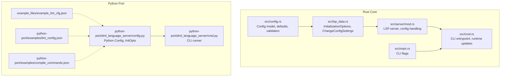
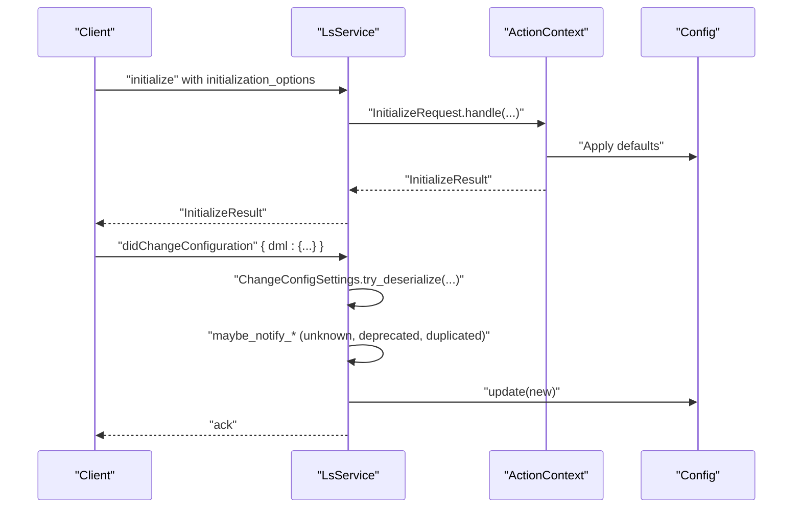
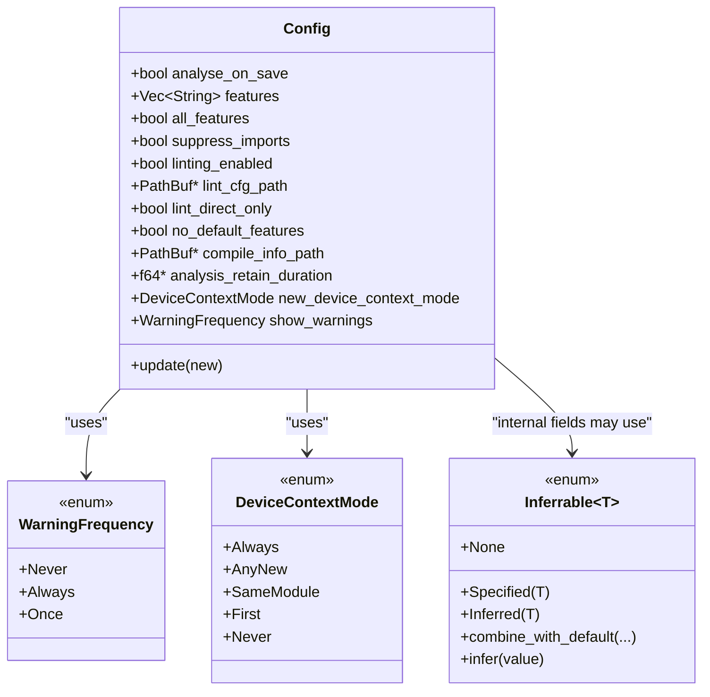
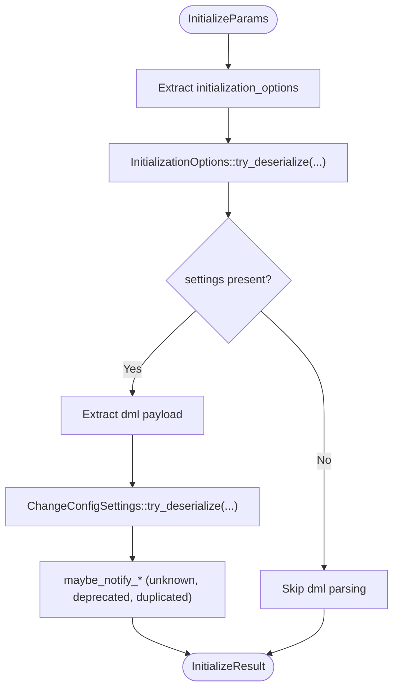
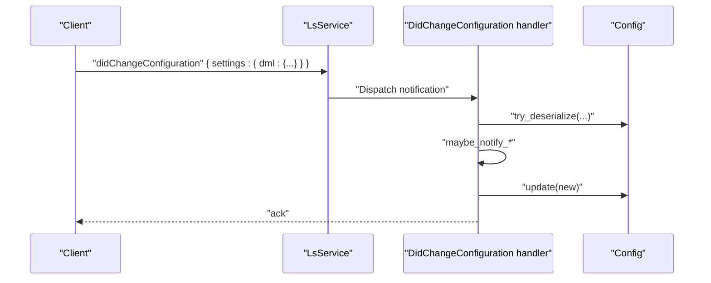
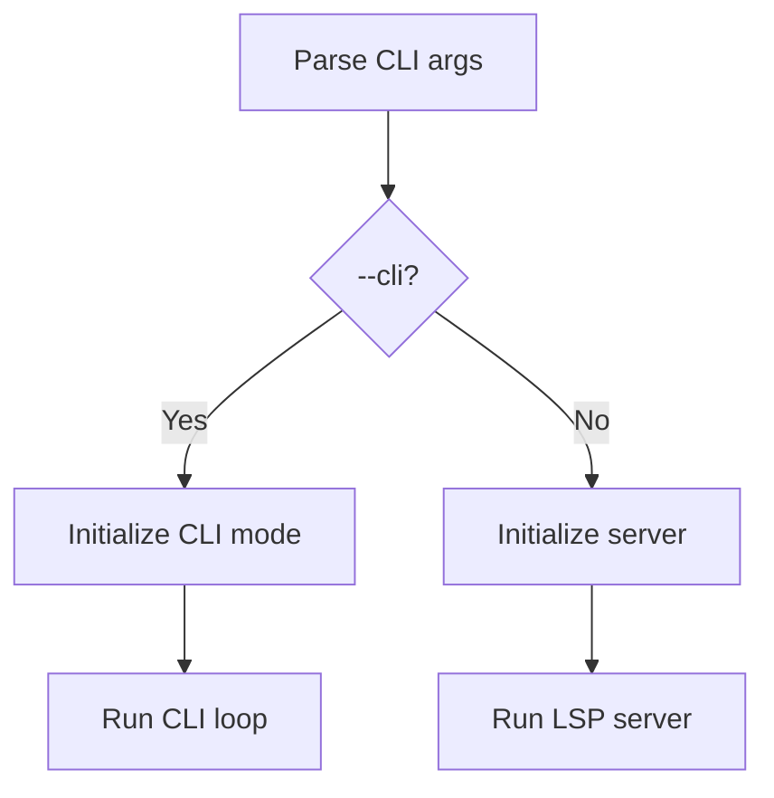
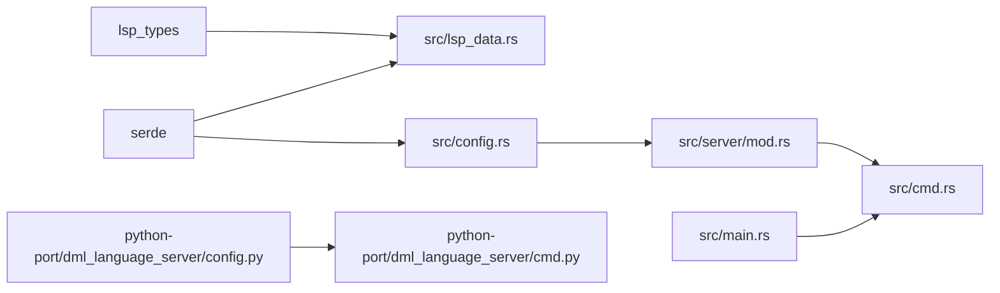

# Configuration API

<cite>
**Referenced Files in This Document**
- [src/config.rs](file://src/config.rs)
- [src/lsp_data.rs](file://src/lsp_data.rs)
- [src/cmd.rs](file://src/cmd.rs)
- [src/main.rs](file://src/main.rs)
- [src/server/mod.rs](file://src/server/mod.rs)
- [python-port/dml_language_server/config.py](file://python-port/dml_language_server/config.py)
- [python-port/dml_language_server/cmd.py](file://python-port/dml_language_server/cmd.py)
- [example_files/example_lint_cfg.json](file://example_files/example_lint_cfg.json)
- [python-port/examples/lint_config.json](file://python-port/examples/lint_config.json)
- [python-port/examples/compile_commands.json](file://python-port/examples/compile_commands.json)
- [README.md](file://README.md)
- [USAGE.md](file://USAGE.md)
</cite>

## Table of Contents
1. [Introduction](#introduction)
2. [Project Structure](#project-structure)
3. [Core Components](#core-components)
4. [Architecture Overview](#architecture-overview)
5. [Detailed Component Analysis](#detailed-component-analysis)
6. [Dependency Analysis](#dependency-analysis)
7. [Performance Considerations](#performance-considerations)
8. [Troubleshooting Guide](#troubleshooting-guide)
9. [Conclusion](#conclusion)
10. [Appendices](#appendices)

## Introduction
This document provides comprehensive documentation for the configuration management API of the DML Language Server (DLS). It covers:
- Configuration schema and defaults
- LSP initialization parameters
- Runtime configuration updates via DidChangeConfiguration
- Command-line interface options
- Validation rules, precedence, and error reporting
- Deprecated options handling and migration guidance
- Programmatic configuration access
- Best practices, performance tuning, and troubleshooting

## Project Structure
The configuration system spans both the Rust core (LSP server) and the Python port (CLI and auxiliary tools). The Rust side defines the canonical configuration model and LSP integration, while the Python side provides a CLI and complementary configuration utilities.

**Diagram sources**
- [src/config.rs](file://src/config.rs#L120-L225)
- [src/lsp_data.rs](file://src/lsp_data.rs#L240-L311)
- [src/server/mod.rs](file://src/server/mod.rs#L207-L289)
- [src/cmd.rs](file://src/cmd.rs#L46-L140)
- [src/main.rs](file://src/main.rs#L21-L60)
- [python-port/dml_language_server/config.py](file://python-port/dml_language_server/config.py#L89-L311)
- [python-port/dml_language_server/cmd.py](file://python-port/dml_language_server/cmd.py#L21-L162)
- [example_files/example_lint_cfg.json](file://example_files/example_lint_cfg.json#L1-L23)
- [python-port/examples/lint_config.json](file://python-port/examples/lint_config.json#L1-L25)
- [python-port/examples/compile_commands.json](file://python-port/examples/compile_commands.json#L1-L14)

**Section sources**
- [src/config.rs](file://src/config.rs#L120-L225)
- [src/lsp_data.rs](file://src/lsp_data.rs#L240-L311)
- [src/server/mod.rs](file://src/server/mod.rs#L207-L289)
- [src/cmd.rs](file://src/cmd.rs#L46-L140)
- [src/main.rs](file://src/main.rs#L21-L60)
- [python-port/dml_language_server/config.py](file://python-port/dml_language_server/config.py#L89-L311)
- [python-port/dml_language_server/cmd.py](file://python-port/dml_language_server/cmd.py#L21-L162)
- [example_files/example_lint_cfg.json](file://example_files/example_lint_cfg.json#L1-L23)
- [python-port/examples/lint_config.json](file://python-port/examples/lint_config.json#L1-L25)
- [python-port/examples/compile_commands.json](file://python-port/examples/compile_commands.json#L1-L14)

## Core Components
- Canonical configuration model and defaults are defined in the Rust core.
- LSP initialization options and runtime configuration payloads are defined alongside the configuration model.
- The CLI supports runtime configuration updates and command-line flags.
- The Python port provides a separate configuration model for its CLI and tools.

Key configuration areas:
- LSP initialization options (omit_init_analyse, cmd_run, settings)
- Runtime configuration payload (ChangeConfigSettings.dml)
- CLI flags (compile-info, linting, lint-cfg)
- Python-side initialization options (log level, linting enablement, diagnostics cap)

**Section sources**
- [src/config.rs](file://src/config.rs#L120-L225)
- [src/lsp_data.rs](file://src/lsp_data.rs#L240-L311)
- [src/cmd.rs](file://src/cmd.rs#L276-L297)
- [src/main.rs](file://src/main.rs#L21-L60)
- [python-port/dml_language_server/config.py](file://python-port/dml_language_server/config.py#L60-L86)
- [python-port/dml_language_server/cmd.py](file://python-port/dml_language_server/cmd.py#L21-L162)

## Architecture Overview
The configuration lifecycle:
- CLI startup parses flags and initializes a Config instance
- LSP initialize request carries initialization_options and optional upfront settings
- Runtime updates arrive via DidChangeConfiguration with a nested dml object
- Server validates, reports unknown/deprecated/duplicated keys, and applies updates
- Python CLI loads compile_commands and lint configs independently

**Diagram sources**
- [src/server/mod.rs](file://src/server/mod.rs#L207-L289)
- [src/lsp_data.rs](file://src/lsp_data.rs#L240-L311)
- [src/config.rs](file://src/config.rs#L280-L318)

## Detailed Component Analysis

### Configuration Schema and Defaults (Rust Core)
- Configuration fields and defaults are defined in the Config struct with serde defaults.
- WarningFrequency supports string and boolean deserialization with flexible mapping.
- DeviceContextMode enumerates context activation policies.
- Inferrable<T> supports three variants: Specified, Inferred, None, enabling safe merging and inference semantics.

Validation and precedence:
- Unknown keys are collected and reported as warnings.
- Duplicate keys (after snake_case normalization) are detected and warned.
- Deprecated keys are tracked centrally and reported as warnings.
- On update, analysis_retain_duration enforces a minimum threshold to avoid discarding analyses prematurely.

**Diagram sources**
- [src/config.rs](file://src/config.rs#L120-L225)
- [src/config.rs](file://src/config.rs#L141-L206)
- [src/config.rs](file://src/config.rs#L24-L94)

**Section sources**
- [src/config.rs](file://src/config.rs#L120-L225)
- [src/config.rs](file://src/config.rs#L141-L206)
- [src/config.rs](file://src/config.rs#L24-L94)
- [src/config.rs](file://src/config.rs#L280-L318)

### LSP Initialization Parameters
Initialization options are defined to support:
- omit_init_analyse: Defer initial analysis after initialize.
- cmd_run: Enable command-mode behavior.
- settings: Upfront configuration payload under a dml key.

Deserialization:
- InitializationOptions::try_deserialize handles camelCase conversion and extracts settings.
- Unknown keys are reported; duplicates are tracked.

**Diagram sources**
- [src/lsp_data.rs](file://src/lsp_data.rs#L282-L311)
- [src/lsp_data.rs](file://src/lsp_data.rs#L240-L276)
- [src/server/mod.rs](file://src/server/mod.rs#L207-L289)

**Section sources**
- [src/lsp_data.rs](file://src/lsp_data.rs#L282-L311)
- [src/lsp_data.rs](file://src/lsp_data.rs#L240-L276)
- [src/server/mod.rs](file://src/server/mod.rs#L207-L289)

### Runtime Configuration Updates (DidChangeConfiguration)
Runtime updates are accepted via DidChangeConfiguration with a settings payload containing a dml object. The server:
- Deserializes the payload using ChangeConfigSettings::try_deserialize
- Reports unknown, deprecated, and duplicated keys
- Applies the update using Config::update, with safeguards for analysis_retain_duration

**Diagram sources**
- [src/lsp_data.rs](file://src/lsp_data.rs#L240-L276)
- [src/config.rs](file://src/config.rs#L280-L318)
- [src/server/mod.rs](file://src/server/mod.rs#L109-L205)

**Section sources**
- [src/lsp_data.rs](file://src/lsp_data.rs#L240-L276)
- [src/config.rs](file://src/config.rs#L280-L318)
- [src/server/mod.rs](file://src/server/mod.rs#L109-L205)

### Command-Line Interface Options
CLI flags:
- --cli: Start in command-line mode
- --compile-info PATH: Path to compile-commands JSON
- -l/--linting BOOL: Enable/disable linting
- --lint-cfg PATH: Path to lint configuration JSON

Behavior:
- CLI mode initializes a Config with provided options and starts the server loop
- Runtime updates can change device context mode and other settings

**Diagram sources**
- [src/main.rs](file://src/main.rs#L21-L60)
- [src/cmd.rs](file://src/cmd.rs#L46-L140)

**Section sources**
- [src/main.rs](file://src/main.rs#L21-L60)
- [src/cmd.rs](file://src/cmd.rs#L46-L140)
- [src/cmd.rs](file://src/cmd.rs#L276-L297)

### Python Port Configuration Model
The Python port provides a separate configuration model for its CLI and tools:
- InitializationOptions: log_level, linting_enabled, max_diagnostics_per_file, compile_commands_dir/file, lint_config_file
- Config: manages compile_commands JSON, lint config, workspace root, include paths, DMLC flags
- CLI runner: discovers DML files, performs analysis, optionally linting

Notes:
- Python-side log level mapping converts TRACE to DEBUG
- Compile commands JSON format supports per-device includes and flags
- Lint configuration supports enabled/disabled rules and rule-specific configs

**Section sources**
- [python-port/dml_language_server/config.py](file://python-port/dml_language_server/config.py#L60-L86)
- [python-port/dml_language_server/config.py](file://python-port/dml_language_server/config.py#L89-L311)
- [python-port/dml_language_server/cmd.py](file://python-port/dml_language_server/cmd.py#L21-L162)
- [README.md](file://README.md#L36-L57)

## Dependency Analysis
- Rust core depends on lsp_types for LSP types and serde for configuration serialization/deserialization.
- Server module integrates configuration with initialization and runtime update flows.
- CLI module constructs and updates Config instances and emits DidChangeConfiguration notifications.
- Python port maintains its own configuration model and examples for compile_commands and lint configs.

**Diagram sources**
- [src/lsp_data.rs](file://src/lsp_data.rs#L14-L21)
- [src/config.rs](file://src/config.rs#L10-L11)
- [src/server/mod.rs](file://src/server/mod.rs#L7-L28)
- [src/cmd.rs](file://src/cmd.rs#L7-L42)
- [src/main.rs](file://src/main.rs#L11)
- [python-port/dml_language_server/config.py](file://python-port/dml_language_server/config.py#L8-L13)
- [python-port/dml_language_server/cmd.py](file://python-port/dml_language_server/cmd.py#L8-L16)

**Section sources**
- [src/lsp_data.rs](file://src/lsp_data.rs#L14-L21)
- [src/config.rs](file://src/config.rs#L10-L11)
- [src/server/mod.rs](file://src/server/mod.rs#L7-L28)
- [src/cmd.rs](file://src/cmd.rs#L7-L42)
- [src/main.rs](file://src/main.rs#L11)
- [python-port/dml_language_server/config.py](file://python-port/dml_language_server/config.py#L8-L13)
- [python-port/dml_language_server/cmd.py](file://python-port/dml_language_server/cmd.py#L8-L16)

## Performance Considerations
- analysis_retain_duration: Enforced minimum threshold prevents overly aggressive discarding of analysis results, reducing redundant recomputation.
- suppress_imports: Disabling automatic import analysis can reduce workload when analyzing large projects.
- linting_enabled and lint_direct_only: Control linting scope and cost.
- compile_info_path: Accurate per-device include/flags reduce expensive fallback resolution.

Best practices:
- Keep analysis_retain_duration above the recommended minimum to avoid premature discards.
- Use per-device compile_commands to minimize filesystem probing.
- Limit max diagnostics per file to keep client UI responsive.

**Section sources**
- [src/config.rs](file://src/config.rs#L298-L318)
- [src/config.rs](file://src/config.rs#L120-L139)
- [README.md](file://README.md#L36-L57)

## Troubleshooting Guide
Common configuration issues and remedies:
- Unknown configuration keys: Detected and logged as warnings; verify spelling and key names.
- Deprecated configuration keys: Logged as warnings with optional notices; migrate to new keys.
- Duplicated configuration keys: Detected after snake_case normalization; consolidate to a single key.
- Validation errors: Invalid values for enums or types will fail deserialization; correct values according to documented formats.
- Lint configuration errors: Unknown lint fields are reported as errors; remove unsupported fields.

Operational tips:
- Use the CLI’s help and wait commands to inspect server state and timing.
- For LSP clients, subscribe to workspace/configuration requests and provide accurate settings.
- For Python CLI, ensure compile_commands and lint configs are valid JSON and paths are correct.

**Section sources**
- [src/server/mod.rs](file://src/server/mod.rs#L109-L205)
- [src/lsp_data.rs](file://src/lsp_data.rs#L240-L276)
- [src/config.rs](file://src/config.rs#L280-L318)
- [python-port/dml_language_server/cmd.py](file://python-port/dml_language_server/cmd.py#L21-L162)

## Conclusion
The DLS configuration system provides a robust, validated, and extensible mechanism for both LSP initialization and runtime updates. It offers clear precedence rules, comprehensive error reporting, and practical performance controls. The Python port complements the Rust core with its own CLI-focused configuration model and examples.

## Appendices

### Configuration Schema Reference

- Config (Rust core)
  - Fields: show_warnings, analyse_on_save, features, all_features, suppress_imports, linting_enabled, lint_cfg_path, lint_direct_only, no_default_features, compile_info_path, analysis_retain_duration, new_device_context_mode
  - Defaults: see [Default implementation](file://src/config.rs#L208-L225)
  - Validation: snake_case normalization, unknown/deprecated/duplicated detection, minimum retention enforcement
  - Example payload shape: { dml: { ... } } for runtime updates

- InitializationOptions (LSP)
  - Keys: omit_init_analyse, cmd_run, settings
  - settings: { dml: Config }

- CLI Flags
  - --cli, --compile-info PATH, -l/--linting BOOL, --lint-cfg PATH

- Python Config (CLI)
  - InitializationOptions: log_level, linting_enabled, max_diagnostics_per_file, compile_commands_dir/file, lint_config_file
  - Config: compile_commands JSON loader, lint config loader, include paths, DMLC flags

**Section sources**
- [src/config.rs](file://src/config.rs#L120-L225)
- [src/lsp_data.rs](file://src/lsp_data.rs#L240-L311)
- [src/main.rs](file://src/main.rs#L21-L60)
- [python-port/dml_language_server/config.py](file://python-port/dml_language_server/config.py#L60-L86)
- [python-port/dml_language_server/config.py](file://python-port/dml_language_server/config.py#L89-L311)

### Examples and Templates

- Lint configuration (Rust core example)
  - [example_files/example_lint_cfg.json](file://example_files/example_lint_cfg.json#L1-L23)

- Lint configuration (Python port example)
  - [python-port/examples/lint_config.json](file://python-port/examples/lint_config.json#L1-L25)

- Compile commands (Python port example)
  - [python-port/examples/compile_commands.json](file://python-port/examples/compile_commands.json#L1-L14)

- README guidance on compile commands
  - [README.md](file://README.md#L36-L57)

**Section sources**
- [example_files/example_lint_cfg.json](file://example_files/example_lint_cfg.json#L1-L23)
- [python-port/examples/lint_config.json](file://python-port/examples/lint_config.json#L1-L25)
- [python-port/examples/compile_commands.json](file://python-port/examples/compile_commands.json#L1-L14)
- [README.md](file://README.md#L36-L57)