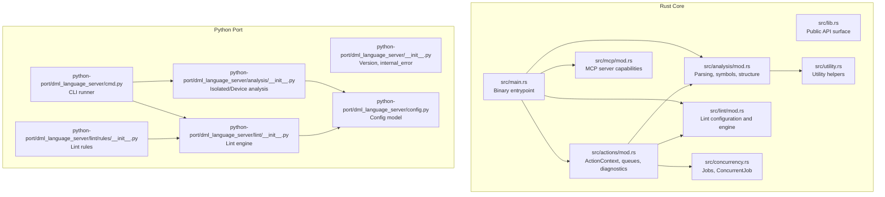
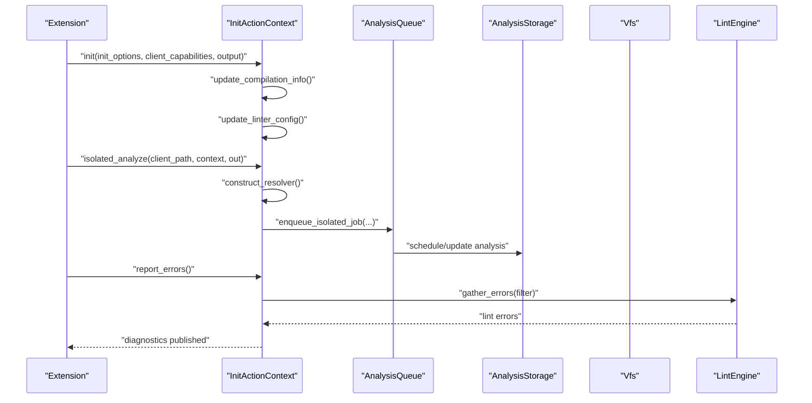
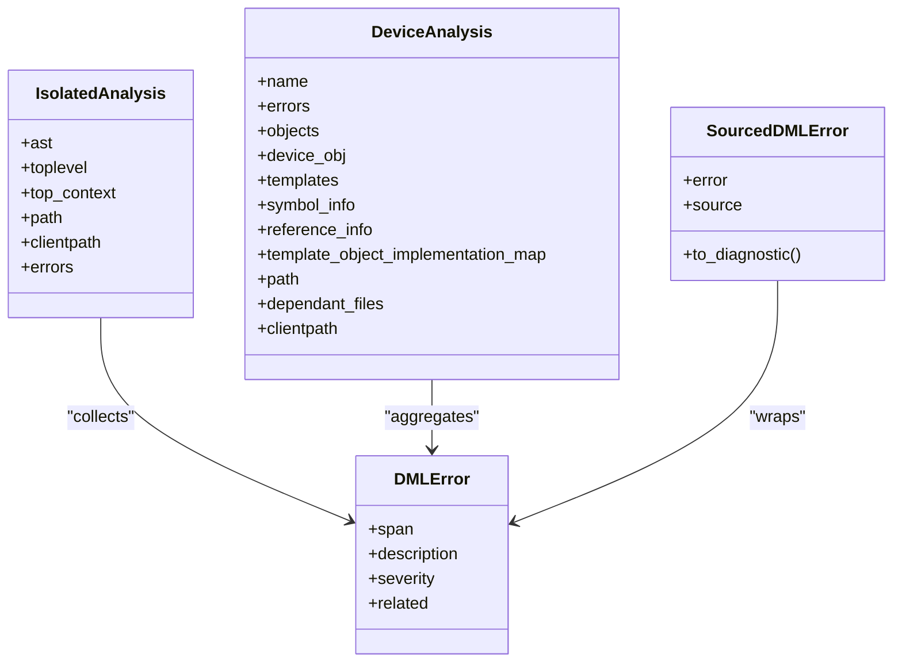
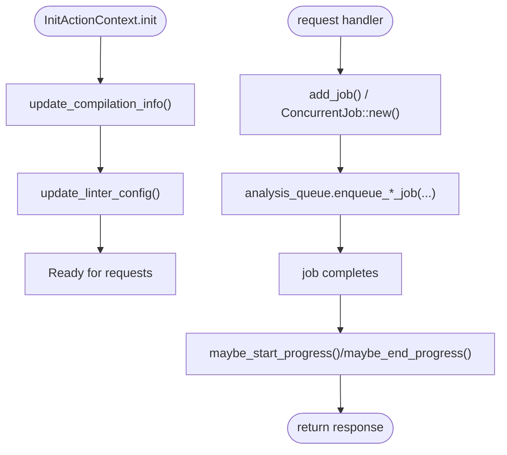
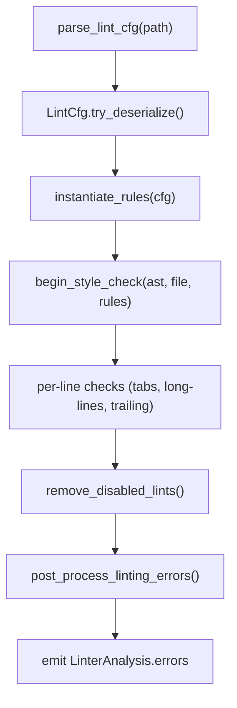
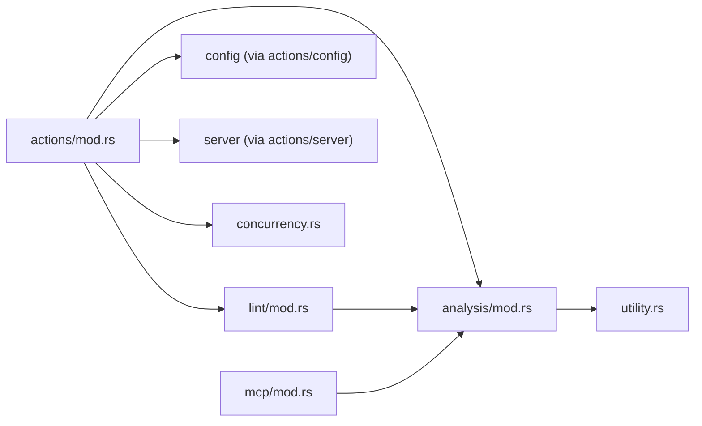

# Internal Extension API

<cite>
**Referenced Files in This Document**
- [lib.rs](file://src/lib.rs)
- [main.rs](file://src/main.rs)
- [mod.rs](file://src/analysis/mod.rs)
- [mod.rs](file://src/actions/mod.rs)
- [mod.rs](file://src/lint/mod.rs)
- [mod.rs](file://src/mcp/mod.rs)
- [concurrency.rs](file://src/concurrency.rs)
- [utility.rs](file://src/utility.rs)
- [__init__.py](file://python-port/dml_language_server/__init__.py)
- [cmd.py](file://python-port/dml_language_server/cmd.py)
- [config.py](file://python-port/dml_language_server/config.py)
- [__init__.py](file://python-port/dml_language_server/analysis/__init__.py)
- [__init__.py](file://python-port/dml_language_server/lint/__init__.py)
- [__init__.py](file://python-port/dml_language_server/lint/rules/__init__.py)
</cite>

## Table of Contents
1. [Introduction](#introduction)
2. [Project Structure](#project-structure)
3. [Core Components](#core-components)
4. [Architecture Overview](#architecture-overview)
5. [Detailed Component Analysis](#detailed-component-analysis)
6. [Dependency Analysis](#dependency-analysis)
7. [Performance Considerations](#performance-considerations)
8. [Troubleshooting Guide](#troubleshooting-guide)
9. [Conclusion](#conclusion)
10. [Appendices](#appendices)

## Introduction
This document describes the internal Extension API surface for building extensions, custom analyzers, and integrations for the DML Language Server. It focuses on:
- Analysis engine interfaces for parser and semantic analysis
- Action context APIs for orchestrating analysis, diagnostics, and progress
- Utility functions and concurrency primitives for plugin development
- Extension points for linting rules and custom analysis integration
- Thread-safety, memory management, and performance guidance
- API stability, versioning, and migration strategies

The goal is to enable extension authors to extend the parser, add custom linting rules, integrate external analysis tools, and build robust, performant plugins against the internal APIs.

## Project Structure
The repository provides both a native Rust implementation and a Python port of key components. The internal extension APIs are primarily exposed via:
- Rust modules for analysis, actions, linting, MCP, concurrency, and utilities
- Python modules mirroring analysis and linting capabilities for CLI and tooling

**Diagram sources**
- [lib.rs](file://src/lib.rs#L31-L47)
- [main.rs](file://src/main.rs#L15-L59)
- [mod.rs](file://src/analysis/mod.rs#L1-L100)
- [mod.rs](file://src/actions/mod.rs#L1-L100)
- [mod.rs](file://src/lint/mod.rs#L1-L120)
- [mod.rs](file://src/mcp/mod.rs#L1-L54)
- [concurrency.rs](file://src/concurrency.rs#L1-L103)
- [utility.rs](file://src/utility.rs#L1-L40)
- [__init__.py](file://python-port/dml_language_server/__init__.py#L1-L48)
- [cmd.py](file://python-port/dml_language_server/cmd.py#L21-L115)
- [config.py](file://python-port/dml_language_server/config.py#L89-L120)
- [__init__.py](file://python-port/dml_language_server/analysis/__init__.py#L181-L370)
- [__init__.py](file://python-port/dml_language_server/lint/__init__.py#L196-L288)
- [__init__.py](file://python-port/dml_language_server/lint/rules/__init__.py#L34-L231)

**Section sources**
- [lib.rs](file://src/lib.rs#L31-L47)
- [main.rs](file://src/main.rs#L15-L59)
- [__init__.py](file://python-port/dml_language_server/__init__.py#L29-L40)

## Core Components
This section outlines the primary internal APIs for extension development.

- Analysis Engine Interfaces
  - IsolatedAnalysis and DeviceAnalysis abstractions for file-level and device-level analysis
  - Parsing, symbol tables, references, and structural contexts
  - Error representation and diagnostic conversion

- Action Context APIs
  - ActionContext lifecycle: Uninit → Init
  - InitActionContext for managing analysis queues, diagnostics, workspace roots, compilation info, and linter configuration
  - Progress and diagnostics notifiers
  - Concurrency orchestration via Jobs and ConcurrentJob

- Linting Integration
  - LintCfg configuration model and parsing
  - LinterAnalysis and rule instantiation pipeline
  - Annotation-based rule disabling and post-processing

- MCP Integration
  - MCP server capabilities and versioning
  - Tooling and resource generation surfaces

- Utilities and Concurrency
  - Utility helpers for partial sorting
  - Jobs and ConcurrentJob for deterministic concurrency and testing

**Section sources**
- [mod.rs](file://src/analysis/mod.rs#L292-L410)
- [mod.rs](file://src/actions/mod.rs#L70-L150)
- [mod.rs](file://src/actions/mod.rs#L224-L266)
- [mod.rs](file://src/actions/mod.rs#L463-L518)
- [mod.rs](file://src/lint/mod.rs#L68-L157)
- [mod.rs](file://src/lint/mod.rs#L181-L207)
- [mod.rs](file://src/mcp/mod.rs#L17-L54)
- [concurrency.rs](file://src/concurrency.rs#L22-L86)
- [utility.rs](file://src/utility.rs#L8-L39)

## Architecture Overview
The internal extension architecture centers on ActionContext coordinating analysis, diagnostics, and progress. Extensions interact primarily through:
- ActionContext for lifecycle and configuration
- AnalysisStorage and AnalysisQueue for scheduling and caching
- Lint engine for style and policy enforcement
- MCP server for code generation and tooling

**Diagram sources**
- [mod.rs](file://src/actions/mod.rs#L100-L133)
- [mod.rs](file://src/actions/mod.rs#L417-L461)
- [mod.rs](file://src/actions/mod.rs#L761-L788)
- [mod.rs](file://src/actions/mod.rs#L463-L518)
- [mod.rs](file://src/lint/mod.rs#L37-L64)

## Detailed Component Analysis

### Analysis Engine Interfaces
- IsolatedAnalysis
  - Captures parsed AST, top-level structure, cached symbol context, file path, client path, and collected errors
  - Provides a stable interface for downstream consumers to query diagnostics and symbol information

- DeviceAnalysis
  - Aggregates per-file analysis into device-level structures
  - Manages symbol storage, reference mapping, template-object implementations, and dependent files
  - Supports context chaining and template matching for device composition

- Error Model
  - DMLError and LocalDMLError represent structured diagnostics with spans, severity, and related information
  - SourcedDMLError attaches a source label for routing diagnostics to appropriate channels

**Diagram sources**
- [mod.rs](file://src/analysis/mod.rs#L292-L315)
- [mod.rs](file://src/analysis/mod.rs#L394-L409)
- [mod.rs](file://src/analysis/mod.rs#L210-L240)
- [mod.rs](file://src/analysis/mod.rs#L310-L332)

**Section sources**
- [mod.rs](file://src/analysis/mod.rs#L292-L410)
- [mod.rs](file://src/analysis/mod.rs#L210-L240)
- [mod.rs](file://src/analysis/mod.rs#L310-L332)

### Action Context APIs
- ActionContext Lifecycle
  - UninitActionContext holds Vfs, Config, and AnalysisStorage prior to initialization
  - InitActionContext manages analysis queue, workspace roots, compilation info, linter config, and concurrency

- Diagnostics and Progress
  - AnalysisDiagnosticsNotifier and AnalysisProgressNotifier coordinate publishing and progress reporting
  - report_errors consolidates isolated, device, and lint errors into client diagnostics

- Concurrency and Jobs
  - ConcurrentJob and Jobs provide a mechanism to spawn background tasks and await completion deterministically

**Diagram sources**
- [mod.rs](file://src/actions/mod.rs#L88-L133)
- [mod.rs](file://src/actions/mod.rs#L386-L391)
- [mod.rs](file://src/actions/mod.rs#L463-L518)
- [concurrency.rs](file://src/concurrency.rs#L36-L64)

**Section sources**
- [mod.rs](file://src/actions/mod.rs#L70-L150)
- [mod.rs](file://src/actions/mod.rs#L224-L266)
- [mod.rs](file://src/actions/mod.rs#L463-L518)
- [concurrency.rs](file://src/concurrency.rs#L22-L86)

### Linting Integration
- LintCfg
  - Strongly-typed lint configuration with defaults and optional overrides
  - Deserialization with unknown field detection and client notification

- LinterAnalysis
  - Instantiates rules from configuration and applies style checks over AST and lines
  - Post-processing removes redundant errors and applies rule annotations

- Rule System
  - Rules module defines rule categories and options
  - Annotation parsing supports allow/allow-file directives and removal of disabled lints

**Diagram sources**
- [mod.rs](file://src/lint/mod.rs#L37-L64)
- [mod.rs](file://src/lint/mod.rs#L113-L126)
- [mod.rs](file://src/lint/mod.rs#L181-L229)
- [mod.rs](file://src/lint/mod.rs#L231-L392)

**Section sources**
- [mod.rs](file://src/lint/mod.rs#L68-L157)
- [mod.rs](file://src/lint/mod.rs#L181-L229)
- [mod.rs](file://src/lint/mod.rs#L231-L392)

### MCP Integration
- Capabilities and Versioning
  - MCP_VERSION and ServerCapabilities define supported features
  - ServerInfo exposes name and version derived from package metadata

- Extension Surface
  - DMLMCPServer and related modules expose tooling and generation capabilities
  - Integrators can leverage analysis results to power MCP tools

**Section sources**
- [mod.rs](file://src/mcp/mod.rs#L17-L54)

### Python Port for CLI and Tooling
- CLI Runner
  - run_cli discovers DML files, performs analysis, and optionally runs linting
  - analyze_single_file provides a focused analysis entrypoint

- Analysis and Linting
  - IsolatedAnalysis and DeviceAnalysis mirror Rust counterparts for Python tooling
  - LintEngine and rule registry enable configurable linting

- Configuration
  - Config encapsulates workspace roots, compile info, lint config, and initialization options

**Section sources**
- [cmd.py](file://python-port/dml_language_server/cmd.py#L21-L115)
- [cmd.py](file://python-port/dml_language_server/cmd.py#L117-L162)
- [__init__.py](file://python-port/dml_language_server/analysis/__init__.py#L181-L370)
- [__init__.py](file://python-port/dml_language_server/lint/__init__.py#L196-L288)
- [__init__.py](file://python-port/dml_language_server/lint/rules/__init__.py#L34-L231)
- [config.py](file://python-port/dml_language_server/config.py#L89-L120)

## Dependency Analysis
The internal APIs exhibit clear separation of concerns:
- actions depends on analysis, lint, config, and server components
- analysis provides parsing, symbols, structure, and templating
- lint consumes analysis artifacts and produces diagnostics
- concurrency utilities support deterministic job management
- MCP builds on analysis to provide code generation tools

**Diagram sources**
- [mod.rs](file://src/actions/mod.rs#L19-L38)
- [mod.rs](file://src/analysis/mod.rs#L1-L12)
- [mod.rs](file://src/lint/mod.rs#L1-L35)
- [concurrency.rs](file://src/concurrency.rs#L1-L20)
- [mod.rs](file://src/mcp/mod.rs#L6-L14)

**Section sources**
- [mod.rs](file://src/actions/mod.rs#L19-L38)
- [mod.rs](file://src/analysis/mod.rs#L1-L12)
- [mod.rs](file://src/lint/mod.rs#L1-L35)
- [concurrency.rs](file://src/concurrency.rs#L1-L20)
- [mod.rs](file://src/mcp/mod.rs#L6-L14)

## Performance Considerations
- Concurrency and Threading
  - Use ConcurrentJob and Jobs to manage background analysis tasks
  - Leverage AnalysisQueue to avoid overloading CPU and to batch updates
  - Prefer incremental analysis and caching via AnalysisStorage to minimize recomputation

- Memory Management
  - SymbolStorage and ReferenceStorage use Arc<Mutex<...>> to share immutable structures safely
  - Keep large data structures behind Arcs in InitActionContext to avoid cloning overhead

- I/O and VFS
  - Vfs-backed file access ensures consistent handling of file events and canonicalization
  - Use construct_resolver to efficiently resolve include paths and device contexts

- Linting Overhead
  - Defer lint analysis when linting is disabled or suppressed
  - Use per-line checks judiciously and avoid repeated passes over the same content

[No sources needed since this section provides general guidance]

## Troubleshooting Guide
- Internal Error Logging
  - Use internal_error macros/functions to log structured internal errors consistently
  - Ensure errors propagate as DMLError with accurate spans for precise client reporting

- Missing Built-ins Warning
  - The server warns when dml-builtins are missing, which affects semantic analysis
  - Verify include paths and workspace configuration to resolve built-in availability

- Diagnostics Reporting
  - Use AnalysisDiagnosticsNotifier to publish diagnostics in batches
  - Ensure severity and related information are populated for actionable feedback

- Concurrency Deadlocks
  - Avoid holding locks across async boundaries
  - Use Jobs.wait_for_all to synchronize completion in tests and controlled shutdowns

**Section sources**
- [lib.rs](file://src/lib.rs#L22-L29)
- [mod.rs](file://src/actions/mod.rs#L731-L743)
- [mod.rs](file://src/actions/mod.rs#L463-L518)
- [concurrency.rs](file://src/concurrency.rs#L42-L64)

## Conclusion
The internal Extension API provides a robust foundation for building parsers, analyzers, and integrations around the DML Language Server. By leveraging ActionContext for orchestration, AnalysisStorage for caching, and LintCfg for policy enforcement, extension authors can implement custom analysis, linting rules, and MCP tools with predictable performance and clear error reporting. Adhering to thread-safety and memory management patterns ensures reliable operation in production environments.

[No sources needed since this section summarizes without analyzing specific files]

## Appendices

### Extension Point Architecture
- Parser Extension
  - Extend parsing by contributing new grammar rules and AST nodes
  - Integrate with FileParser and TopAst to feed IsolatedAnalysis
  - Maintain span correctness to ensure accurate diagnostics

- Linting Rule Extension
  - Implement LintRule subclasses with configurable options
  - Register rules in the rule registry and wire into LintCfg
  - Use annotations to selectively disable rules per file or per line

- Custom Analysis Integration
  - Use InitActionContext to schedule analysis jobs and publish diagnostics
  - Integrate with Vfs and PathResolver to resolve dependencies and include paths
  - Employ MCP server to expose generated artifacts and tools

**Section sources**
- [mod.rs](file://src/analysis/mod.rs#L292-L315)
- [mod.rs](file://src/lint/mod.rs#L181-L229)
- [mod.rs](file://src/mcp/mod.rs#L17-L54)

### Hook Registration Mechanisms
- Lint Configuration Hooks
  - Load and parse lint configuration files
  - Detect unknown fields and notify clients
  - Apply rule-level overrides and severity adjustments

- Analysis Hooks
  - Update compilation info and linter config on configuration changes
  - Trigger device analysis when dependencies become stale
  - Manage workspace roots and direct opens for targeted diagnostics

**Section sources**
- [mod.rs](file://src/lint/mod.rs#L37-L64)
- [mod.rs](file://src/actions/mod.rs#L403-L415)
- [mod.rs](file://src/actions/mod.rs#L605-L695)

### API Stability, Version Compatibility, and Migration
- Versioning
  - ServerInfo and MCP_VERSION expose version metadata for compatibility checks
  - Use environment-provided version strings to align client expectations

- Migration Strategies
  - Gradually migrate from legacy configurations to new Config models
  - Maintain backward-compatible lint rule names and options where possible
  - Provide deprecation notices for removed features and guide users to new APIs

**Section sources**
- [mod.rs](file://src/mcp/mod.rs#L27-L34)
- [config.py](file://python-port/dml_language_server/config.py#L89-L120)