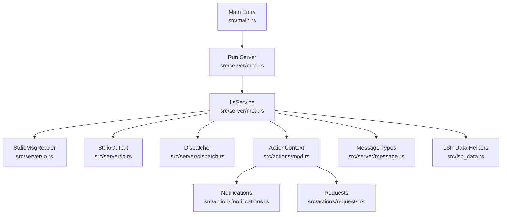
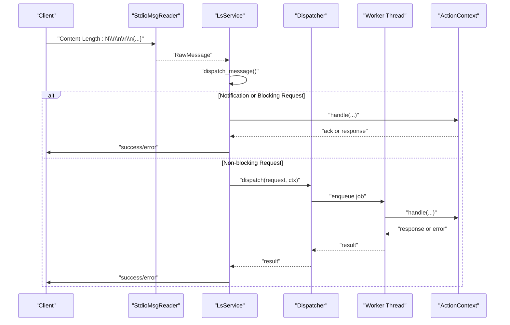
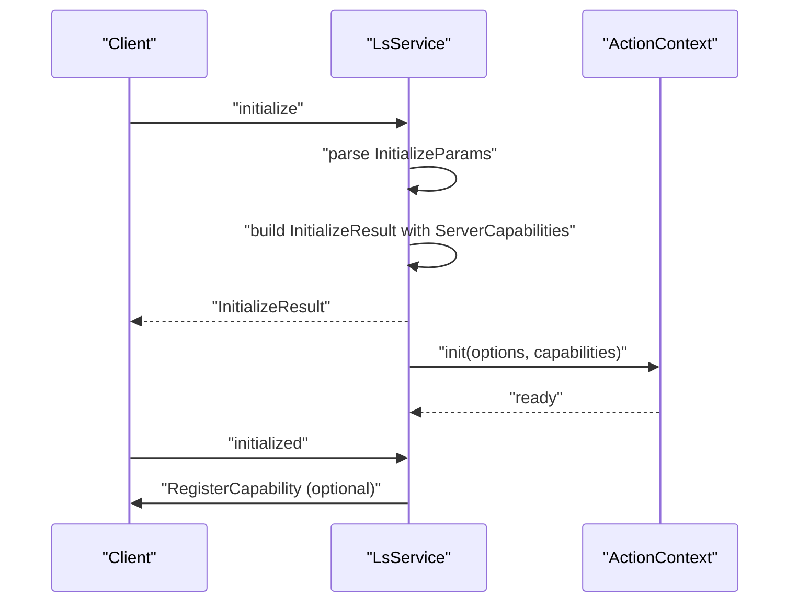
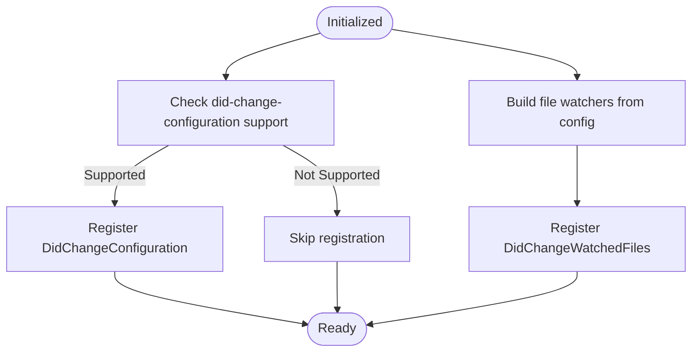
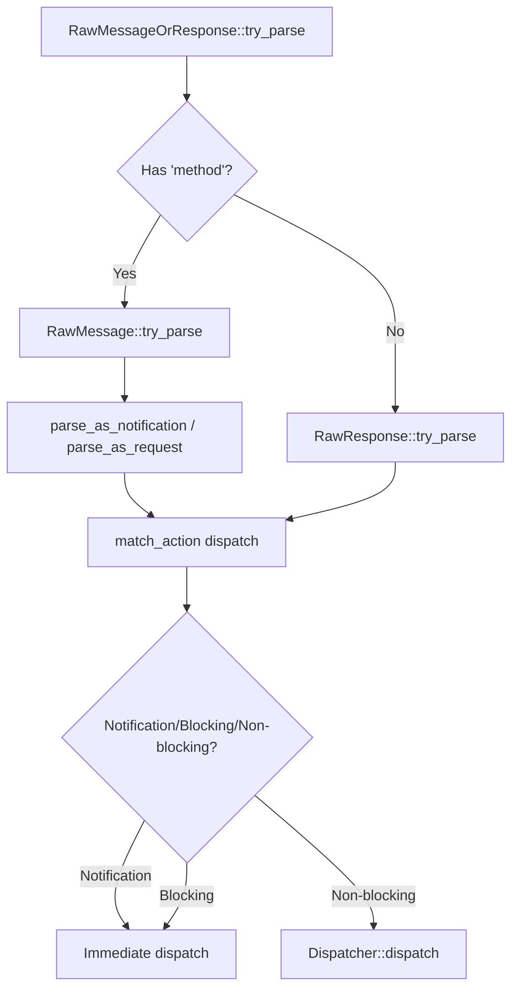
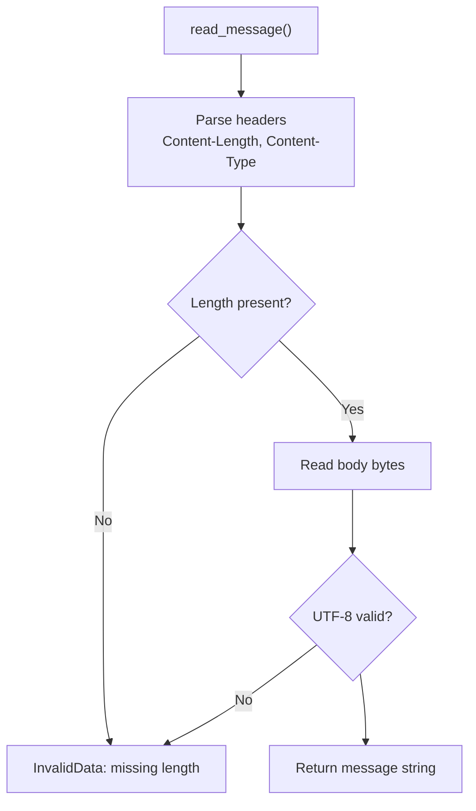
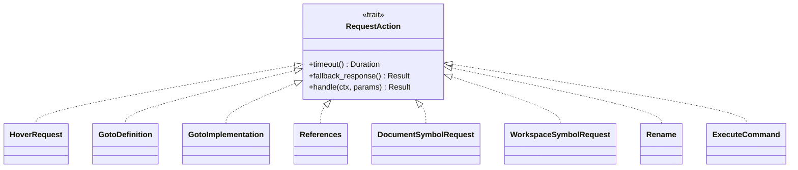
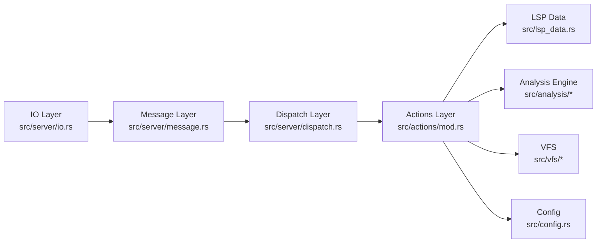

# Language Server Protocol API

<cite>
**Referenced Files in This Document**
- [src/main.rs](file://src/main.rs)
- [src/server/mod.rs](file://src/server/mod.rs)
- [src/server/io.rs](file://src/server/io.rs)
- [src/server/message.rs](file://src/server/message.rs)
- [src/server/dispatch.rs](file://src/server/dispatch.rs)
- [src/actions/mod.rs](file://src/actions/mod.rs)
- [src/actions/notifications.rs](file://src/actions/notifications.rs)
- [src/actions/requests.rs](file://src/actions/requests.rs)
- [src/lsp_data.rs](file://src/lsp_data.rs)
- [python-port/dml_language_server/lsp_data.py](file://python-port/dml_language_server/lsp_data.py)
- [README.md](file://README.md)
</cite>

## Table of Contents
1. [Introduction](#introduction)
2. [Project Structure](#project-structure)
3. [Core Components](#core-components)
4. [Architecture Overview](#architecture-overview)
5. [Detailed Component Analysis](#detailed-component-analysis)
6. [Dependency Analysis](#dependency-analysis)
7. [Performance Considerations](#performance-considerations)
8. [Troubleshooting Guide](#troubleshooting-guide)
9. [Conclusion](#conclusion)
10. [Appendices](#appendices)

## Introduction
This document provides comprehensive API documentation for the Language Server Protocol (LSP) implementation. It covers all LSP 3.0 endpoints including initialize, shutdown, textDocument/* requests, and window/* notifications. It details request/response schemas, parameter validation rules, error codes, response formats, client capability negotiation, dynamic registration mechanisms, and custom protocol extensions. It also documents the message dispatch system, IO handling over stdio, integration with the analysis engine, protocol compliance verification, debugging tools, and common implementation pitfalls.

## Project Structure
The LSP implementation is organized around a server loop that reads messages from stdio, parses them into typed LSP requests/notifications, dispatches them to handlers, and writes responses back to the client. Supporting modules handle IO, message parsing, dispatching to worker threads, and action contexts for stateful operations.

**Diagram sources**
- [src/main.rs](file://src/main.rs#L44-L59)
- [src/server/mod.rs](file://src/server/mod.rs#L68-L84)
- [src/server/io.rs](file://src/server/io.rs#L25-L40)
- [src/server/dispatch.rs](file://src/server/dispatch.rs#L113-L147)
- [src/actions/mod.rs](file://src/actions/mod.rs#L70-L150)
- [src/actions/notifications.rs](file://src/actions/notifications.rs#L32-L72)
- [src/actions/requests.rs](file://src/actions/requests.rs#L401-L424)
- [src/server/message.rs](file://src/server/message.rs#L185-L217)
- [src/lsp_data.rs](file://src/lsp_data.rs#L282-L311)

**Section sources**
- [src/main.rs](file://src/main.rs#L44-L59)
- [src/server/mod.rs](file://src/server/mod.rs#L68-L84)
- [src/server/io.rs](file://src/server/io.rs#L19-L40)
- [src/server/dispatch.rs](file://src/server/dispatch.rs#L113-L147)
- [src/actions/mod.rs](file://src/actions/mod.rs#L70-L150)
- [src/actions/notifications.rs](file://src/actions/notifications.rs#L32-L72)
- [src/actions/requests.rs](file://src/actions/requests.rs#L401-L424)
- [src/server/message.rs](file://src/server/message.rs#L185-L217)
- [src/lsp_data.rs](file://src/lsp_data.rs#L282-L311)

## Core Components
- Message parsing and serialization: RawMessage, Request, Notification, Response, and error wrappers.
- IO layer: StdioMsgReader and StdioOutput implement MessageReader and Output traits for stdio transport.
- Dispatch system: Dispatcher forwards non-blocking requests to worker threads with timeouts.
- Action context: ActionContext and InitActionContext manage server state, configuration, VFS, and analysis.
- LSP data helpers: URI/path conversion, range/position conversions, initialization options, and client capabilities.

Key responsibilities:
- Initialize/shutdown lifecycle and server capabilities negotiation.
- textDocument/* requests: hover, goto-definition, goto-implementation, references, document symbols, workspace symbols, rename, formatting, code actions, code lens, completion resolution, and execute-command.
- window/* notifications: show message and progress notifications.
- Dynamic registration: register capabilities for configuration and watched files.

**Section sources**
- [src/server/message.rs](file://src/server/message.rs#L25-L104)
- [src/server/io.rs](file://src/server/io.rs#L19-L40)
- [src/server/dispatch.rs](file://src/server/dispatch.rs#L113-L168)
- [src/actions/mod.rs](file://src/actions/mod.rs#L70-L150)
- [src/lsp_data.rs](file://src/lsp_data.rs#L282-L354)

## Architecture Overview
The server operates a main loop that:
- Reads messages from stdin using a dedicated reader.
- Parses messages into either requests or notifications.
- Dispatches notifications and blocking requests synchronously on the main thread.
- Dispatches non-blocking requests asynchronously to a worker pool with timeouts.
- Emits responses and notifications to stdout using a structured output writer.

**Diagram sources**
- [src/server/mod.rs](file://src/server/mod.rs#L322-L470)
- [src/server/dispatch.rs](file://src/server/dispatch.rs#L113-L147)
- [src/server/io.rs](file://src/server/io.rs#L191-L219)

**Section sources**
- [src/server/mod.rs](file://src/server/mod.rs#L322-L470)
- [src/server/dispatch.rs](file://src/server/dispatch.rs#L113-L147)
- [src/server/io.rs](file://src/server/io.rs#L191-L219)

## Detailed Component Analysis

### Initialize and Shutdown
- Initialize:
  - Validates initialization options and settings.
  - Negotiates server capabilities and responds with InitializeResult.
  - Initializes ActionContext with client capabilities and workspace roots.
  - Optionally triggers analysis of built-in files.
- Shutdown:
  - Waits for pending jobs, sets shutdown flag, and acknowledges.

**Diagram sources**
- [src/server/mod.rs](file://src/server/mod.rs#L207-L289)
- [src/server/mod.rs](file://src/server/mod.rs#L86-L107)

**Section sources**
- [src/server/mod.rs](file://src/server/mod.rs#L207-L289)
- [src/server/mod.rs](file://src/server/mod.rs#L86-L107)

### Client Capability Negotiation and Dynamic Registration
- ClientCapabilities extraction and feature checks (workspace folders, did-change-configuration, configuration).
- Dynamic registration of:
  - DidChangeConfiguration (pull-based configuration updates).
  - DidChangeWatchedFiles (file watcher registration).
- Server capabilities include textDocument sync options, provider flags, and experimental features.

**Diagram sources**
- [src/actions/notifications.rs](file://src/actions/notifications.rs#L32-L72)
- [src/lsp_data.rs](file://src/lsp_data.rs#L313-L354)
- [src/server/mod.rs](file://src/server/mod.rs#L677-L729)

**Section sources**
- [src/actions/notifications.rs](file://src/actions/notifications.rs#L32-L72)
- [src/lsp_data.rs](file://src/lsp_data.rs#L313-L354)
- [src/server/mod.rs](file://src/server/mod.rs#L677-L729)

### Message Parsing and Dispatch
- RawMessage parsing validates method, id, and params; supports missing params as null.
- Request/Notification wrappers carry typed parameters and method metadata.
- Dispatch routes to synchronous handlers for notifications/blocking requests and asynchronous handlers for non-blocking requests.

**Diagram sources**
- [src/server/message.rs](file://src/server/message.rs#L366-L396)
- [src/server/message.rs](file://src/server/message.rs#L318-L350)
- [src/server/message.rs](file://src/server/message.rs#L435-L476)
- [src/server/mod.rs](file://src/server/mod.rs#L472-L598)

**Section sources**
- [src/server/message.rs](file://src/server/message.rs#L366-L396)
- [src/server/message.rs](file://src/server/message.rs#L318-L350)
- [src/server/message.rs](file://src/server/message.rs#L435-L476)
- [src/server/mod.rs](file://src/server/mod.rs#L472-L598)

### IO Handling Over stdio
- Header parsing enforces Content-Length and Content-Type.
- UTF-8 validation and message framing.
- Output formatting includes Content-Length header and JSON-RPC 2.0 envelope.

**Diagram sources**
- [src/server/io.rs](file://src/server/io.rs#L46-L110)
- [src/server/io.rs](file://src/server/io.rs#L204-L219)

**Section sources**
- [src/server/io.rs](file://src/server/io.rs#L46-L110)
- [src/server/io.rs](file://src/server/io.rs#L204-L219)

### textDocument/* Requests
Implemented non-blocking requests include:
- Completion, ResolveCompletion
- HoverRequest
- GotoDefinition, GotoDeclaration, GotoImplementation
- References
- DocumentSymbolRequest, WorkspaceSymbolRequest
- DocumentHighlightRequest
- Rename
- CodeActionRequest, CodeLensRequest
- Formatting, RangeFormatting
- ExecuteCommand
- GetKnownContextsRequest

Timeouts and fallback responses are enforced; some requests (e.g., goto-implementation) have increased timeouts. Responses may include warnings for limitations.

**Diagram sources**
- [src/server/dispatch.rs](file://src/server/dispatch.rs#L149-L168)
- [src/actions/requests.rs](file://src/actions/requests.rs#L401-L424)
- [src/actions/requests.rs](file://src/actions/requests.rs#L460-L480)
- [src/actions/requests.rs](file://src/actions/requests.rs#L482-L544)
- [src/actions/requests.rs](file://src/actions/requests.rs#L604-L660)
- [src/actions/requests.rs](file://src/actions/requests.rs#L662-L717)
- [src/actions/requests.rs](file://src/actions/requests.rs#L426-L458)
- [src/actions/requests.rs](file://src/actions/requests.rs#L719-L733)
- [src/actions/requests.rs](file://src/actions/requests.rs#L751-L768)
- [src/actions/requests.rs](file://src/actions/requests.rs#L797-L800)

**Section sources**
- [src/server/dispatch.rs](file://src/server/dispatch.rs#L149-L168)
- [src/actions/requests.rs](file://src/actions/requests.rs#L401-L424)
- [src/actions/requests.rs](file://src/actions/requests.rs#L460-L480)
- [src/actions/requests.rs](file://src/actions/requests.rs#L482-L544)
- [src/actions/requests.rs](file://src/actions/requests.rs#L604-L660)
- [src/actions/requests.rs](file://src/actions/requests.rs#L662-L717)
- [src/actions/requests.rs](file://src/actions/requests.rs#L426-L458)
- [src/actions/requests.rs](file://src/actions/requests.rs#L719-L733)
- [src/actions/requests.rs](file://src/actions/requests.rs#L751-L768)
- [src/actions/requests.rs](file://src/actions/requests.rs#L797-L800)

### window/* Notifications and Custom Extensions
- Standard notifications: Initialized, DidOpenTextDocument, DidChangeTextDocument, DidCloseTextDocument, DidSaveTextDocument, DidChangeConfiguration, DidChangeWatchedFiles, DidChangeWorkspaceFolders, Cancel.
- Custom notification: ChangeActiveContexts for device context control.

Dynamic registration of configuration and watched files is performed upon initialization when supported by the client.

**Section sources**
- [src/actions/notifications.rs](file://src/actions/notifications.rs#L32-L72)
- [src/actions/notifications.rs](file://src/actions/notifications.rs#L74-L91)
- [src/actions/notifications.rs](file://src/actions/notifications.rs#L93-L105)
- [src/actions/notifications.rs](file://src/actions/notifications.rs#L107-L163)
- [src/actions/notifications.rs](file://src/actions/notifications.rs#L165-L174)
- [src/actions/notifications.rs](file://src/actions/notifications.rs#L176-L223)
- [src/actions/notifications.rs](file://src/actions/notifications.rs#L225-L241)
- [src/actions/notifications.rs](file://src/actions/notifications.rs#L243-L257)
- [src/actions/notifications.rs](file://src/actions/notifications.rs#L259-L271)
- [src/actions/notifications.rs](file://src/actions/notifications.rs#L308-L352)

### Custom Protocol Extensions
- InitializationOptions: omit_init_analyse, cmd_run, and upfront settings.
- ClientCapabilities wrapper to extract root and workspace folder support.
- Experimental features exposed via server capabilities.
- Python port utilities for diagnostics, locations, edits, symbols, and hover content conversion.

**Section sources**
- [src/lsp_data.rs](file://src/lsp_data.rs#L282-L311)
- [src/lsp_data.rs](file://src/lsp_data.rs#L313-L354)
- [src/server/mod.rs](file://src/server/mod.rs#L665-L675)
- [python-port/dml_language_server/lsp_data.py](file://python-port/dml_language_server/lsp_data.py#L42-L138)
- [python-port/dml_language_server/lsp_data.py](file://python-port/dml_language_server/lsp_data.py#L163-L298)

### Request/Response Schemas and Validation
- Request/Notification wrappers carry method and parameters; missing parameters are represented as null.
- ResponseError supports empty responses and custom error messages with numeric codes.
- JSON-RPC 2.0 compatibility enforced via explicit envelope fields.

Validation rules:
- Method must be a string; id must be string or number for requests; notifications omit id.
- Params must be array/object/null; unsupported types yield InvalidRequest.
- Parse errors return ParseError; invalid params return InvalidParams.

**Section sources**
- [src/server/message.rs](file://src/server/message.rs#L185-L217)
- [src/server/message.rs](file://src/server/message.rs#L318-L350)
- [src/server/message.rs](file://src/server/message.rs#L435-L476)
- [src/server/message.rs](file://src/server/message.rs#L506-L520)

### Error Codes and Handling Patterns
- Standard JSON-RPC error codes used for failures.
- Special handling for not-yet-initialized state during shutdown.
- Unknown/deprecated/duplicated configuration keys reported via window/showMessage.

Common patterns:
- Empty responses mapped to InternalError with explanatory messages.
- Numeric error codes for custom failures.
- Warnings for out-of-order changes and missing built-ins.

**Section sources**
- [src/server/mod.rs](file://src/server/mod.rs#L86-L107)
- [src/server/mod.rs](file://src/server/mod.rs#L109-L205)
- [src/actions/notifications.rs](file://src/actions/notifications.rs#L127-L132)

## Dependency Analysis
The server composes several layers:
- IO layer depends on std::io and jsonrpc for framing and error types.
- Message layer depends on lsp_types for method constants and serde for serialization.
- Dispatch layer depends on crossbeam channels and a work pool abstraction.
- Actions layer depends on analysis engine, VFS, configuration, and linter.

**Diagram sources**
- [src/server/io.rs](file://src/server/io.rs#L1-L319)
- [src/server/message.rs](file://src/server/message.rs#L1-L712)
- [src/server/dispatch.rs](file://src/server/dispatch.rs#L1-L206)
- [src/actions/mod.rs](file://src/actions/mod.rs#L1-L800)
- [src/lsp_data.rs](file://src/lsp_data.rs#L1-L419)

**Section sources**
- [src/server/io.rs](file://src/server/io.rs#L1-L319)
- [src/server/message.rs](file://src/server/message.rs#L1-L712)
- [src/server/dispatch.rs](file://src/server/dispatch.rs#L1-L206)
- [src/actions/mod.rs](file://src/actions/mod.rs#L1-L800)
- [src/lsp_data.rs](file://src/lsp_data.rs#L1-L419)

## Performance Considerations
- Non-blocking requests are dispatched to worker threads with timeouts to prevent starvation and ensure responsiveness.
- DEFAULT_REQUEST_TIMEOUT governs request processing latency; some requests override this (e.g., goto-implementation).
- Analysis queue limits CPU usage and defers expensive work until idle.
- Progress notifications are used to indicate ongoing analysis.
- Recommendations:
  - Tune DEFAULT_REQUEST_TIMEOUT for your environment.
  - Use incremental text document synchronization to minimize payload sizes.
  - Leverage workspace folders and watched files to reduce unnecessary polling.

[No sources needed since this section provides general guidance]

## Troubleshooting Guide
- Parse errors: Verify Content-Length and Content-Type headers; ensure UTF-8 encoding.
- Initialization errors: Confirm initialize is called once and capabilities are negotiated.
- Shutdown behavior: Ensure pending jobs are drained; exit only after shutdown.
- Configuration updates: Use dynamic registration when supported; otherwise fall back to pull-based configuration.
- Out-of-order changes: Server warns and ignores out-of-sequence edits.
- Missing built-ins: Server emits warnings when essential built-in files are not found.

**Section sources**
- [src/server/io.rs](file://src/server/io.rs#L46-L110)
- [src/server/mod.rs](file://src/server/mod.rs#L86-L107)
- [src/actions/notifications.rs](file://src/actions/notifications.rs#L127-L132)
- [src/actions/mod.rs](file://src/actions/mod.rs#L731-L743)

## Conclusion
The LSP implementation provides a robust foundation for DML language services with strong support for initialization, dynamic capability negotiation, and a scalable dispatch model. It integrates tightly with an analysis engine and VFS to deliver accurate diagnostics and symbol queries. Extensibility is achieved through custom notifications and initialization options, while strict JSON-RPC and LSP compliance ensures interoperability with standard clients.

[No sources needed since this section summarizes without analyzing specific files]

## Appendices

### API Reference: Endpoints and Capabilities
- Initialize: Negotiate capabilities, workspace roots, and server info.
- Shutdown: Drain jobs and acknowledge.
- textDocument/*:
  - hover, goto-definition, goto-implementation, references
  - document-symbol, workspace-symbol
  - rename, formatting, code-action, code-lens
  - completion, resolve-completion, execute-command
- window/*:
  - show-message (via notifications)
- Custom:
  - changeActiveContexts

**Section sources**
- [src/server/mod.rs](file://src/server/mod.rs#L207-L289)
- [src/server/mod.rs](file://src/server/mod.rs#L86-L107)
- [src/server/mod.rs](file://src/server/mod.rs#L677-L729)
- [src/actions/notifications.rs](file://src/actions/notifications.rs#L308-L352)
- [src/actions/requests.rs](file://src/actions/requests.rs#L401-L424)

### Example Message Exchanges
- Initialization sequence:
  - Client sends initialize with capabilities and optional initialization_options.
  - Server responds with InitializeResult and capabilities.
  - Client sends initialized; server registers capabilities if supported.
- Request/Response:
  - Client sends a request with method, id, and params.
  - Server parses, dispatches, and returns result or error.
- Notification:
  - Client sends notification without id; server handles immediately.

**Section sources**
- [src/server/mod.rs](file://src/server/mod.rs#L207-L289)
- [src/server/message.rs](file://src/server/message.rs#L366-L396)
- [src/server/message.rs](file://src/server/message.rs#L435-L476)

### Protocol Compliance and Debugging Tools
- Compliance:
  - JSON-RPC 2.0 envelope and method/id semantics.
  - LSP 3.0 textDocument/workspace specifications.
- Debugging:
  - Logging via env_logger.
  - Trace-level logs for message parsing and dispatch.
  - Error messages surfaced to client via window/showMessage.

**Section sources**
- [src/main.rs](file://src/main.rs#L15-L19)
- [src/server/mod.rs](file://src/server/mod.rs#L322-L470)
- [src/server/mod.rs](file://src/server/mod.rs#L128-L147)