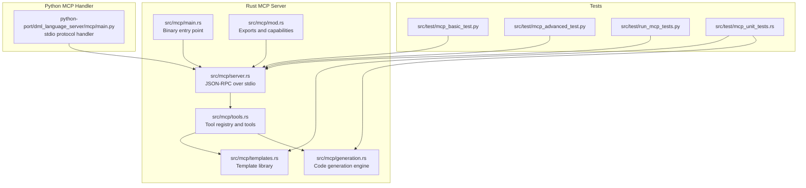
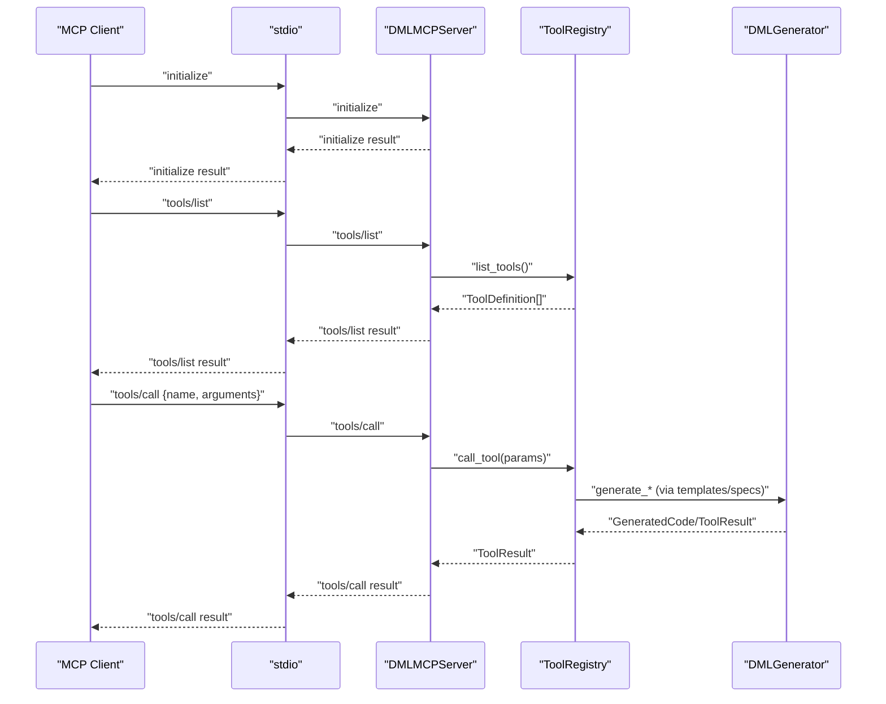
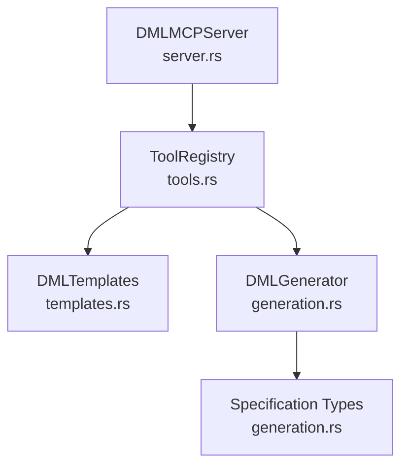

# Model Context Protocol API

<cite>
**Referenced Files in This Document**
- [MCP_SERVER_GUIDE.md](file://MCP_SERVER_GUIDE.md)
- [clients.md](file://clients.md)
- [src/mcp/mod.rs](file://src/mcp/mod.rs)
- [src/mcp/main.rs](file://src/mcp/main.rs)
- [src/mcp/server.rs](file://src/mcp/server.rs)
- [src/mcp/tools.rs](file://src/mcp/tools.rs)
- [src/mcp/templates.rs](file://src/mcp/templates.rs)
- [src/mcp/generation.rs](file://src/mcp/generation.rs)
- [src/test/mcp_basic_test.py](file://src/test/mcp_basic_test.py)
- [src/test/mcp_advanced_test.py](file://src/test/mcp_advanced_test.py)
- [src/test/run_mcp_tests.py](file://src/test/run_mcp_tests.py)
- [src/test/mcp_unit_tests.rs](file://src/test/mcp_unit_tests.rs)
- [python-port/dml_language_server/mcp/main.py](file://python-port/dml_language_server/mcp/main.py)
</cite>

## Table of Contents
1. [Introduction](#introduction)
2. [Project Structure](#project-structure)
3. [Core Components](#core-components)
4. [Architecture Overview](#architecture-overview)
5. [Detailed Component Analysis](#detailed-component-analysis)
6. [Dependency Analysis](#dependency-analysis)
7. [Performance Considerations](#performance-considerations)
8. [Troubleshooting Guide](#troubleshooting-guide)
9. [Conclusion](#conclusion)
10. [Appendices](#appendices)

## Introduction
This document provides comprehensive API documentation for the Model Context Protocol (MCP) implementation in the DML Language Server. It covers MCP server endpoints, tool registration mechanisms, template-based code generation APIs, tool interface specifications, parameter schemas, response formats, MCP message protocols, authentication and session management, server lifecycle, client connection patterns, error handling strategies, performance considerations, and debugging techniques for MCP integrations.

The MCP server exposes a JSON-RPC over stdio interface compliant with the MCP 2024-11-05 specification. It provides intelligent DML code generation tools and integrates with AI-assisted development workflows.

## Project Structure
The MCP implementation spans both Rust and Python ports:
- Rust MCP server binary and core modules under src/mcp
- Python MCP protocol handler and CLI under python-port/dml_language_server/mcp
- Test suites under src/test for integration and unit tests
- Client integration guidance under clients.md
- Complete implementation guide under MCP_SERVER_GUIDE.md

**Diagram sources**
- [src/mcp/main.rs](file://src/mcp/main.rs#L1-L23)
- [src/mcp/server.rs](file://src/mcp/server.rs#L1-L229)
- [src/mcp/tools.rs](file://src/mcp/tools.rs#L1-L399)
- [src/mcp/templates.rs](file://src/mcp/templates.rs#L1-L428)
- [src/mcp/generation.rs](file://src/mcp/generation.rs#L1-L411)
- [src/mcp/mod.rs](file://src/mcp/mod.rs#L1-L54)
- [python-port/dml_language_server/mcp/main.py](file://python-port/dml_language_server/mcp/main.py#L1-L166)
- [src/test/mcp_basic_test.py](file://src/test/mcp_basic_test.py#L1-L134)
- [src/test/mcp_advanced_test.py](file://src/test/mcp_advanced_test.py#L1-L184)
- [src/test/run_mcp_tests.py](file://src/test/run_mcp_tests.py#L1-L104)
- [src/test/mcp_unit_tests.rs](file://src/test/mcp_unit_tests.rs#L1-L406)

**Section sources**
- [MCP_SERVER_GUIDE.md](file://MCP_SERVER_GUIDE.md#L108-L118)
- [src/mcp/mod.rs](file://src/mcp/mod.rs#L1-L54)
- [src/mcp/main.rs](file://src/mcp/main.rs#L1-L23)
- [python-port/dml_language_server/mcp/main.py](file://python-port/dml_language_server/mcp/main.py#L1-L166)

## Core Components
- MCP Server: Implements JSON-RPC over stdio, handles initialize, tools/list, and tools/call methods.
- Tool Registry: Manages built-in tools and dynamic tool registration.
- Code Generation Engine: Generates DML code from specifications with configurable formatting and validation.
- Template Library: Provides pre-built device templates and design patterns.
- Python Protocol Handler: Alternative stdio-based MCP handler for Python environments.

Key capabilities and server info are defined centrally and exported for both Rust and Python implementations.

**Section sources**
- [src/mcp/server.rs](file://src/mcp/server.rs#L134-L206)
- [src/mcp/tools.rs](file://src/mcp/tools.rs#L46-L121)
- [src/mcp/generation.rs](file://src/mcp/generation.rs#L8-L50)
- [src/mcp/templates.rs](file://src/mcp/templates.rs#L11-L359)
- [src/mcp/mod.rs](file://src/mcp/mod.rs#L17-L54)
- [python-port/dml_language_server/mcp/main.py](file://python-port/dml_language_server/mcp/main.py#L22-L96)

## Architecture Overview
The MCP server follows a layered architecture:
- Transport: stdio JSON-RPC
- Protocol: MCP 2024-11-05
- Application: Tool registry and code generation pipeline
- Templates: Predefined device patterns and snippets

**Diagram sources**
- [src/mcp/server.rs](file://src/mcp/server.rs#L104-L132)
- [src/mcp/tools.rs](file://src/mcp/tools.rs#L101-L121)
- [src/mcp/generation.rs](file://src/mcp/generation.rs#L67-L111)
- [src/mcp/templates.rs](file://src/mcp/templates.rs#L328-L358)

**Section sources**
- [src/mcp/server.rs](file://src/mcp/server.rs#L57-L132)
- [src/mcp/tools.rs](file://src/mcp/tools.rs#L46-L121)
- [src/mcp/generation.rs](file://src/mcp/generation.rs#L52-L111)
- [src/mcp/templates.rs](file://src/mcp/templates.rs#L11-L359)

## Detailed Component Analysis

### MCP Server Endpoints
- initialize
  - Purpose: Establish protocol version, capabilities, and server info.
  - Request: JSON-RPC with method "initialize".
  - Response: Result includes protocolVersion, capabilities, serverInfo.
- tools/list
  - Purpose: Enumerate available tools with names and descriptions.
  - Request: JSON-RPC with method "tools/list".
  - Response: Result includes tools array of ToolDefinition entries.
- tools/call
  - Purpose: Execute a named tool with provided arguments.
  - Request: JSON-RPC with method "tools/call" and params containing name and arguments.
  - Response: Result includes ToolResult with content array and optional is_error flag.

Error handling:
- Unknown method: Returns JSON-RPC error -32601.
- Invalid params: Returns JSON-RPC error -32602.
- Internal errors: Returns JSON-RPC error -32603 with details.

**Section sources**
- [src/mcp/server.rs](file://src/mcp/server.rs#L104-L206)
- [src/mcp/mod.rs](file://src/mcp/mod.rs#L17-L54)

### Tool Registration Mechanisms
- ToolRegistry manages a HashMap of DMLTool implementations.
- Built-in tools registered at initialization:
  - generate_device
  - generate_register
  - generate_method (placeholder)
  - analyze_project (placeholder)
  - validate_code (placeholder)
  - generate_template (placeholder)
  - apply_pattern (placeholder)
- Tools expose:
  - name(): string identifier
  - description(): human-readable description
  - input_schema(): JSON Schema for arguments
  - execute(input): asynchronous execution returning ToolResult

ToolResult structure:
- content: array of ToolContent entries
  - type: content type (e.g., "text")
  - text: generated content
- is_error: optional boolean flag

**Section sources**
- [src/mcp/tools.rs](file://src/mcp/tools.rs#L46-L121)
- [src/mcp/tools.rs](file://src/mcp/tools.rs#L125-L325)

### Template-Based Code Generation APIs
- DMLTemplates provides predefined device templates and patterns:
  - basic_device
  - memory_mapped_device
  - interrupt_controller
  - cpu_device
  - memory_device
  - bus_interface_device
  - get_pattern_templates: returns a map of pattern names to factory closures
- DMLSnippets provides common method and field patterns for reuse.
- DMLGenerator constructs DML code from DeviceSpec/RegisterSpec/FieldSpec/MethodSpec with:
  - GenerationConfig controlling formatting and validation
  - GenerationContext for device metadata and imports

Template instantiation patterns:
- Pattern-based generation uses closures keyed by pattern names (e.g., "memory_mapped", "interrupt_controller").
- Each closure accepts a device name and configuration JSON, returning a DeviceSpec.

**Section sources**
- [src/mcp/templates.rs](file://src/mcp/templates.rs#L11-L359)
- [src/mcp/generation.rs](file://src/mcp/generation.rs#L8-L111)
- [src/mcp/generation.rs](file://src/mcp/generation.rs#L355-L411)

### Tool Interface Specification and Schemas
- ToolDefinition:
  - name: string
  - description: string
  - inputSchema: JSON Schema object
- DMLTool trait:
  - name(), description(), input_schema() -> Value
  - execute(input: Value) -> Result<ToolResult>
- ToolResult:
  - content: array of ToolContent
  - is_error: optional boolean

Built-in tool schemas:
- generate_device: requires device_name and device_type; optional registers, interfaces, template_base.
- generate_register: requires name and size; optional fields, documentation, offset.

**Section sources**
- [src/mcp/tools.rs](file://src/mcp/tools.rs#L27-L43)
- [src/mcp/tools.rs](file://src/mcp/tools.rs#L144-L181)
- [src/mcp/tools.rs](file://src/mcp/tools.rs#L224-L259)

### Response Formats for AI-Assisted Development
- ToolResult.content entries:
  - type: "text"
  - text: generated DML code
- is_error: present for placeholder tools indicating non-fatal placeholders
- Example usage patterns are demonstrated in integration tests for device and register generation.

**Section sources**
- [src/mcp/tools.rs](file://src/mcp/tools.rs#L12-L26)
- [src/test/mcp_basic_test.py](file://src/test/mcp_basic_test.py#L86-L115)
- [src/test/mcp_advanced_test.py](file://src/test/mcp_advanced_test.py#L54-L170)

### MCP Message Protocols, Authentication, and Session Management
- Protocol: JSON-RPC 2.0 over stdio, MCP 2024-11-05.
- Authentication: Not applicable; MCP server runs locally over stdio.
- Session management: Stateless JSON-RPC; server maintains no persistent session state between requests.

**Section sources**
- [src/mcp/server.rs](file://src/mcp/server.rs#L12-L26)
- [src/mcp/mod.rs](file://src/mcp/mod.rs#L17-L18)

### Server Lifecycle and Client Connections
- Rust binary entry point initializes logging and runs the server loop.
- Python handler reads from stdin and writes to stdout, handling JSON-RPC messages.
- Both implementations:
  - Parse JSON-RPC
  - Route to appropriate handler
  - Serialize responses
  - Handle EOF and errors gracefully

**Section sources**
- [src/mcp/main.rs](file://src/mcp/main.rs#L11-L22)
- [python-port/dml_language_server/mcp/main.py](file://python-port/dml_language_server/mcp/main.py#L29-L96)

### Integration with Analysis Engine
- The MCP server leverages existing DML analysis capabilities for code generation.
- Generation engine composes code from templates and specifications, with optional validation hooks.
- Templates encapsulate common device patterns and design idioms.

**Section sources**
- [MCP_SERVER_GUIDE.md](file://MCP_SERVER_GUIDE.md#L108-L143)
- [src/mcp/generation.rs](file://src/mcp/generation.rs#L52-L111)
- [src/mcp/templates.rs](file://src/mcp/templates.rs#L11-L359)

## Dependency Analysis

**Diagram sources**
- [src/mcp/server.rs](file://src/mcp/server.rs#L37-L54)
- [src/mcp/tools.rs](file://src/mcp/tools.rs#L46-L81)
- [src/mcp/templates.rs](file://src/mcp/templates.rs#L11-L359)
- [src/mcp/generation.rs](file://src/mcp/generation.rs#L52-L111)

**Section sources**
- [src/mcp/server.rs](file://src/mcp/server.rs#L37-L54)
- [src/mcp/tools.rs](file://src/mcp/tools.rs#L46-L81)
- [src/mcp/generation.rs](file://src/mcp/generation.rs#L52-L111)

## Performance Considerations
- Async I/O: Rust server uses Tokio for non-blocking stdio handling.
- Minimal overhead: Stateless JSON-RPC reduces server memory footprint.
- Configurable formatting: GenerationConfig allows tuning indentation and line endings.
- Validation hook: GenerationConfig.validate_output can be toggled; integration with parser planned.
- Scalability: Tools are dynamically registered; adding new tools does not require server restart.

[No sources needed since this section provides general guidance]

## Troubleshooting Guide
Common issues and resolutions:
- Protocol errors:
  - Parse error (-32700): Malformed JSON input; verify client sends proper JSON-RPC.
  - Method not found (-32601): Client invoked unknown method; confirm MCP version and method names.
  - Invalid params (-32602): Missing required fields in tools/call params.
  - Internal error (-32603): Tool execution failure; inspect ToolResult.is_error and logs.
- Logging:
  - Rust server logs via env_logger; adjust filter level via environment variable.
  - Python handler logs to stderr; ensure stdout remains reserved for JSON-RPC.
- Test harness:
  - Use provided Python tests to validate server behavior end-to-end.
  - Run Rust unit tests to verify generation and template logic.

Debugging techniques:
- Enable verbose logging for detailed request/response traces.
- Validate tool schemas against input arguments.
- Inspect ToolResult content for generated DML code previews.
- Use integration tests as working examples for client implementations.

**Section sources**
- [src/mcp/server.rs](file://src/mcp/server.rs#L108-L206)
- [src/test/mcp_basic_test.py](file://src/test/mcp_basic_test.py#L37-L131)
- [src/test/mcp_advanced_test.py](file://src/test/mcp_advanced_test.py#L33-L181)
- [src/test/run_mcp_tests.py](file://src/test/run_mcp_tests.py#L37-L101)

## Conclusion
The DML MCP Server delivers a standards-compliant, extensible platform for AI-assisted DML development. It provides robust tooling for device and register generation, a flexible template system, and a clean JSON-RPC interface over stdio. With comprehensive tests and clear integration guidelines, it is suitable for embedding in editors, AI assistants, and CI/CD pipelines.

[No sources needed since this section summarizes without analyzing specific files]

## Appendices

### API Reference Summary
- initialize
  - Request: JSON-RPC with method "initialize"
  - Response: Result with protocolVersion, capabilities, serverInfo
- tools/list
  - Request: JSON-RPC with method "tools/list"
  - Response: Result with tools array of ToolDefinition
- tools/call
  - Request: JSON-RPC with method "tools/call" and params { name, arguments }
  - Response: Result with ToolResult.content

**Section sources**
- [src/mcp/server.rs](file://src/mcp/server.rs#L104-L206)
- [src/mcp/mod.rs](file://src/mcp/mod.rs#L17-L54)

### Tool Implementations and Examples
- generate_device: Creates complete device models with registers, interfaces, and methods.
- generate_register: Builds registers with fields, bit ranges, and access controls.
- Placeholder tools: generate_method, analyze_project, validate_code, generate_template, apply_pattern.

Examples of usage and expected outputs are demonstrated in integration tests.

**Section sources**
- [src/mcp/tools.rs](file://src/mcp/tools.rs#L125-L325)
- [src/test/mcp_basic_test.py](file://src/test/mcp_basic_test.py#L86-L115)
- [src/test/mcp_advanced_test.py](file://src/test/mcp_advanced_test.py#L54-L170)

### Client Integration Notes
- Clients can integrate via stdio JSON-RPC.
- Guidance for implementing clients in editors is provided in clients.md.
- MCP server binaries are built via cargo and can be integrated into AI tools and IDEs.

**Section sources**
- [clients.md](file://clients.md#L1-L191)
- [MCP_SERVER_GUIDE.md](file://MCP_SERVER_GUIDE.md#L9-L33)