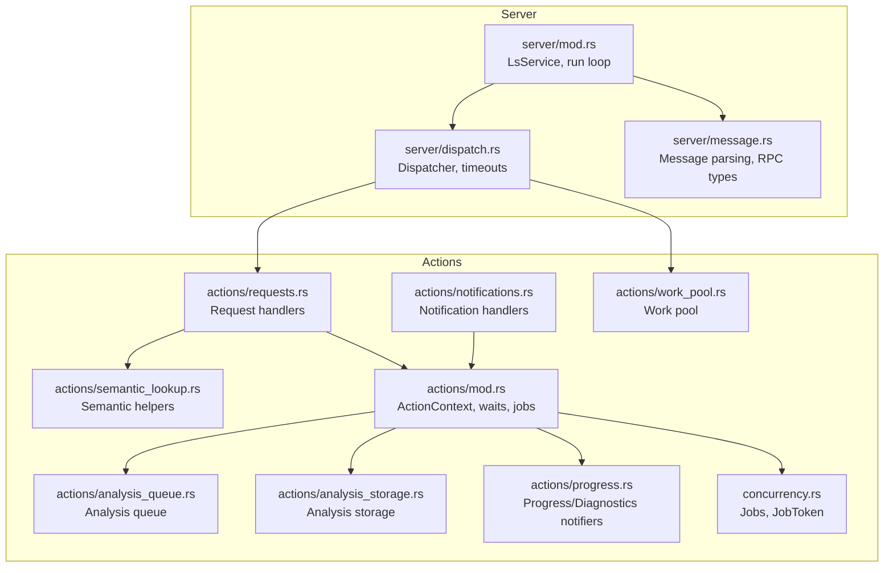
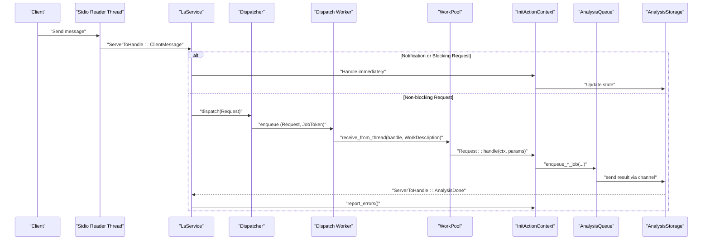
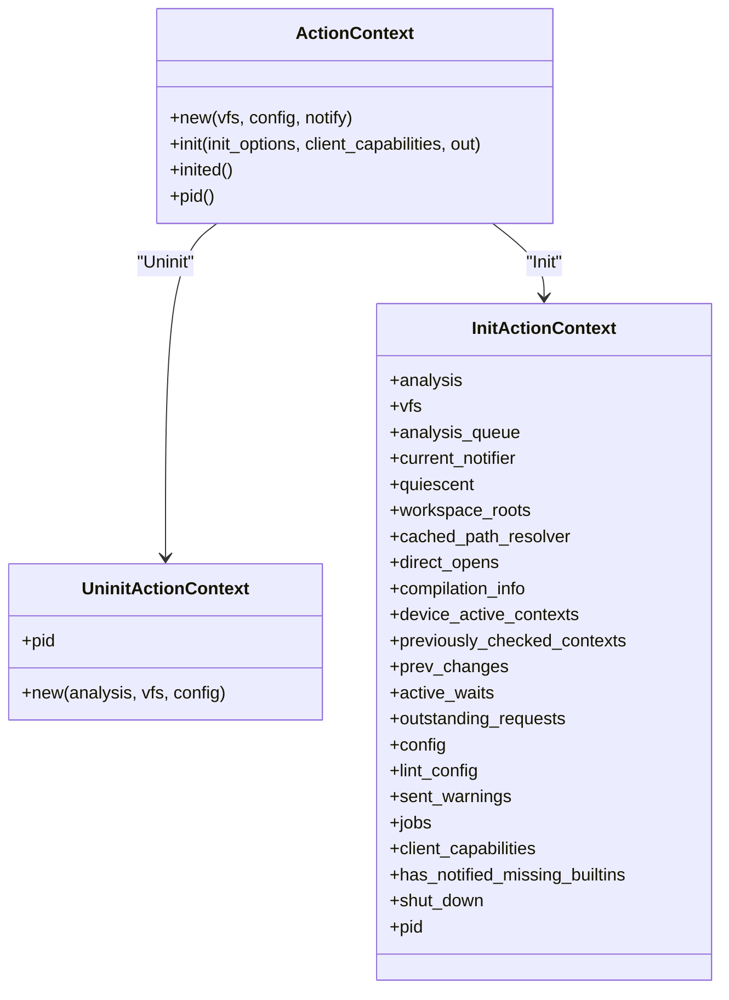
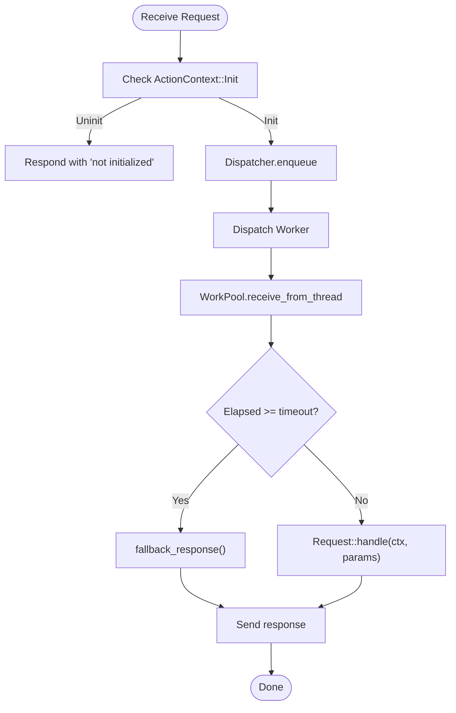
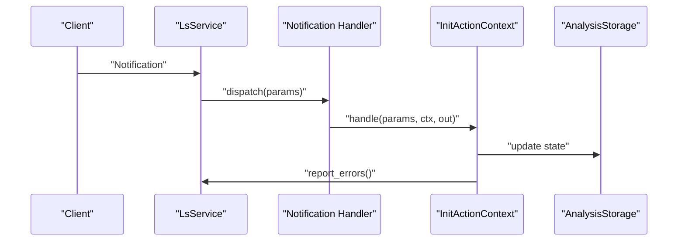
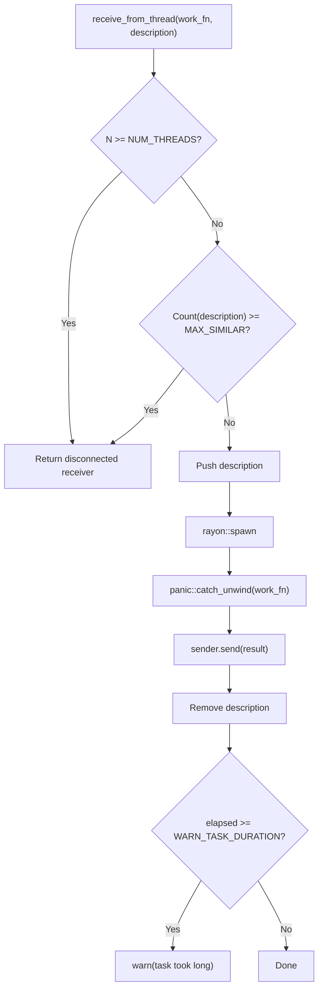
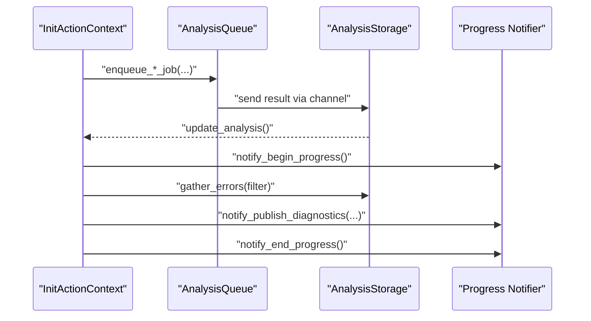
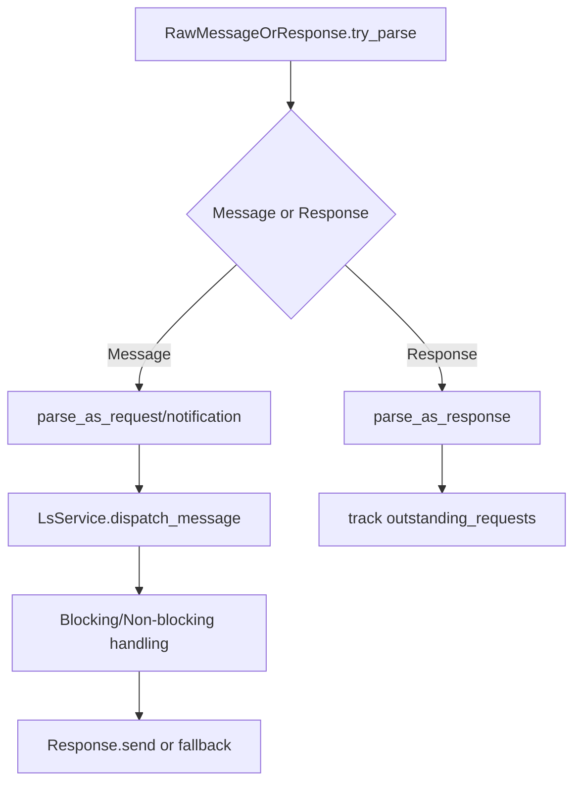
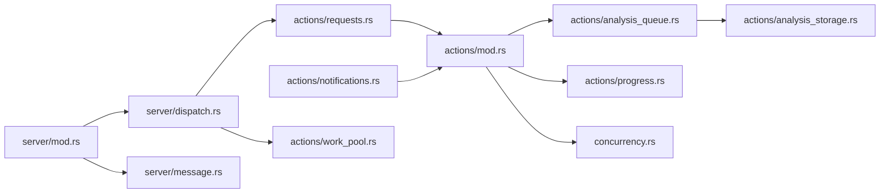

# Action Context and Request Handling

<cite>
**Referenced Files in This Document**
- [actions/mod.rs](file://src/actions/mod.rs)
- [actions/requests.rs](file://src/actions/requests.rs)
- [actions/notifications.rs](file://src/actions/notifications.rs)
- [actions/progress.rs](file://src/actions/progress.rs)
- [actions/work_pool.rs](file://src/actions/work_pool.rs)
- [actions/analysis_queue.rs](file://src/actions/analysis_queue.rs)
- [actions/analysis_storage.rs](file://src/actions/analysis_storage.rs)
- [actions/semantic_lookup.rs](file://src/actions/semantic_lookup.rs)
- [actions/hover.rs](file://src/actions/hover.rs)
- [server/mod.rs](file://src/server/mod.rs)
- [server/dispatch.rs](file://src/server/dispatch.rs)
- [server/message.rs](file://src/server/message.rs)
- [concurrency.rs](file://src/concurrency.rs)
</cite>

## Table of Contents
1. [Introduction](#introduction)
2. [Project Structure](#project-structure)
3. [Core Components](#core-components)
4. [Architecture Overview](#architecture-overview)
5. [Detailed Component Analysis](#detailed-component-analysis)
6. [Dependency Analysis](#dependency-analysis)
7. [Performance Considerations](#performance-considerations)
8. [Troubleshooting Guide](#troubleshooting-guide)
9. [Conclusion](#conclusion)
10. [Appendices](#appendices)

## Introduction
This document explains the action context and request handling subsystem of the DML Language Server. It covers how the server manages persistent action context, processes requests and notifications, coordinates analysis work, reports progress, and handles timeouts and errors. It also provides guidance for implementing new actions, managing concurrency, optimizing performance, and testing.

## Project Structure
The action context and request handling system spans several modules:
- Action context and orchestration: actions/mod.rs
- Request handlers: actions/requests.rs
- Notification handlers: actions/notifications.rs
- Progress and diagnostics reporting: actions/progress.rs
- Work pool and concurrency: actions/work_pool.rs, concurrency.rs
- Analysis pipeline: actions/analysis_queue.rs, actions/analysis_storage.rs
- Semantic lookup helpers: actions/semantic_lookup.rs
- Server loop and dispatch: server/mod.rs, server/dispatch.rs, server/message.rs

**Diagram sources**
- [server/mod.rs](file://src/server/mod.rs#L291-L472)
- [server/dispatch.rs](file://src/server/dispatch.rs#L118-L157)
- [server/message.rs](file://src/server/message.rs#L185-L396)
- [actions/mod.rs](file://src/actions/mod.rs#L97-L177)
- [actions/requests.rs](file://src/actions/requests.rs#L23-L56)
- [actions/notifications.rs](file://src/actions/notifications.rs#L23-L32)
- [actions/progress.rs](file://src/actions/progress.rs#L17-L45)
- [actions/work_pool.rs](file://src/actions/work_pool.rs#L22-L39)
- [concurrency.rs](file://src/concurrency.rs#L70-L122)
- [actions/analysis_queue.rs](file://src/actions/analysis_queue.rs#L39-L69)
- [actions/analysis_storage.rs](file://src/actions/analysis_storage.rs#L101-L128)
- [actions/semantic_lookup.rs](file://src/actions/semantic_lookup.rs#L75-L129)

**Section sources**
- [server/mod.rs](file://src/server/mod.rs#L291-L472)
- [server/dispatch.rs](file://src/server/dispatch.rs#L118-L157)
- [server/message.rs](file://src/server/message.rs#L185-L396)
- [actions/mod.rs](file://src/actions/mod.rs#L97-L177)
- [actions/requests.rs](file://src/actions/requests.rs#L23-L56)
- [actions/notifications.rs](file://src/actions/notifications.rs#L23-L32)
- [actions/progress.rs](file://src/actions/progress.rs#L17-L45)
- [actions/work_pool.rs](file://src/actions/work_pool.rs#L22-L39)
- [concurrency.rs](file://src/concurrency.rs#L70-L122)
- [actions/analysis_queue.rs](file://src/actions/analysis_queue.rs#L39-L69)
- [actions/analysis_storage.rs](file://src/actions/analysis_storage.rs#L101-L128)
- [actions/semantic_lookup.rs](file://src/actions/semantic_lookup.rs#L75-L129)

## Core Components
- ActionContext: Holds persistent state across requests and notifications. Two modes: Uninit and Init. Provides analysis queues, VFS, configuration, device contexts, and wait/wake mechanisms.
- InitActionContext: After initialization, manages analysis lifecycle, device context activation, progress reporting, request/response tracking, and job coordination.
- AnalysisQueue: Single-threaded worker that serializes analysis work, deduplicates jobs, tracks in-flight work, and triggers follow-up actions.
- AnalysisStorage: Central registry of analysis results, dependency maps, and device triggers; integrates with the worker to keep state consistent.
- Dispatcher: Routes non-blocking requests to a worker thread with timeout handling and fallback responses.
- WorkPool: Controlled thread pool for executing request work concurrently with capacity checks and warnings.
- Progress/Diagnostics Notifiers: Emit LSP progress and diagnostics notifications.
- Semantic Lookup: Helpers to resolve symbols/references across isolated/device analyses.

**Section sources**
- [actions/mod.rs](file://src/actions/mod.rs#L97-L177)
- [actions/mod.rs](file://src/actions/mod.rs#L248-L295)
- [actions/analysis_queue.rs](file://src/actions/analysis_queue.rs#L39-L69)
- [actions/analysis_storage.rs](file://src/actions/analysis_storage.rs#L101-L128)
- [server/dispatch.rs](file://src/server/dispatch.rs#L118-L157)
- [actions/work_pool.rs](file://src/actions/work_pool.rs#L22-L39)
- [actions/progress.rs](file://src/actions/progress.rs#L17-L45)
- [actions/semantic_lookup.rs](file://src/actions/semantic_lookup.rs#L75-L129)

## Architecture Overview
The server runs a main loop that reads client messages, dispatches notifications and blocking requests synchronously, and dispatches non-blocking requests asynchronously with timeouts. Analysis work is coordinated through a dedicated worker thread and a shared storage layer.

**Diagram sources**
- [server/mod.rs](file://src/server/mod.rs#L322-L472)
- [server/dispatch.rs](file://src/server/dispatch.rs#L126-L157)
- [actions/work_pool.rs](file://src/actions/work_pool.rs#L53-L103)
- [actions/analysis_queue.rs](file://src/actions/analysis_queue.rs#L174-L250)
- [actions/analysis_storage.rs](file://src/actions/analysis_storage.rs#L194-L211)

## Detailed Component Analysis

### ActionContext Management
- Uninit vs Init: Construction creates an Uninit context holding VFS, config, and an AnalysisStorage. Initialization wires client capabilities, workspace roots, and starts background analysis of implicit builtins.
- Persistent fields: AnalysisStorage, VFS, configuration, device contexts, outstanding requests, jobs, and progress notifiers.
- Lifecycle: Initialization sets up compilation info, linter config, and begins analysis of implicit imports.

**Diagram sources**
- [actions/mod.rs](file://src/actions/mod.rs#L97-L177)
- [actions/mod.rs](file://src/actions/mod.rs#L248-L295)
- [actions/mod.rs](file://src/actions/mod.rs#L297-L314)

**Section sources**
- [actions/mod.rs](file://src/actions/mod.rs#L97-L177)
- [server/mod.rs](file://src/server/mod.rs#L207-L289)

### Request Processing Pipeline
- Blocking vs Non-blocking: Notifications and blocking requests are handled synchronously on the main thread. Non-blocking requests are enqueued to a worker thread with a timeout.
- Timeout strategy: Each request type can override its timeout; the dispatcher checks elapsed time before starting work and falls back to a predefined response if expired.
- RequestAction trait: Defines timeout, identifier, fallback response, and handle method for each request.

**Diagram sources**
- [server/dispatch.rs](file://src/server/dispatch.rs#L60-L94)
- [server/dispatch.rs](file://src/server/dispatch.rs#L118-L157)
- [server/message.rs](file://src/server/message.rs#L185-L201)

**Section sources**
- [server/dispatch.rs](file://src/server/dispatch.rs#L118-L157)
- [server/message.rs](file://src/server/message.rs#L185-L201)
- [actions/requests.rs](file://src/actions/requests.rs#L276-L303)

### Notification Handling Mechanisms
- Immediate handling: Initialized, DidOpenTextDocument, DidCloseTextDocument, DidChangeTextDocument, DidSaveTextDocument, DidChangeConfiguration, DidChangeWatchedFiles, DidChangeWorkspaceFolders, Cancel, ChangeActiveContexts.
- Version ordering: Tracks document change versions to detect duplicates/out-of-order changes and warns the client.
- Context activation: ChangeActiveContexts updates active device contexts and re-reports diagnostics.

**Diagram sources**
- [server/mod.rs](file://src/server/mod.rs#L474-L599)
- [actions/notifications.rs](file://src/actions/notifications.rs#L33-L73)
- [actions/notifications.rs](file://src/actions/notifications.rs#L75-L92)
- [actions/notifications.rs](file://src/actions/notifications.rs#L94-L106)
- [actions/notifications.rs](file://src/actions/notifications.rs#L108-L164)
- [actions/notifications.rs](file://src/actions/notifications.rs#L244-L258)
- [actions/notifications.rs](file://src/actions/notifications.rs#L260-L272)
- [actions/notifications.rs](file://src/actions/notifications.rs#L314-L353)

**Section sources**
- [server/mod.rs](file://src/server/mod.rs#L474-L599)
- [actions/notifications.rs](file://src/actions/notifications.rs#L75-L106)
- [actions/notifications.rs](file://src/actions/notifications.rs#L108-L164)
- [actions/notifications.rs](file://src/actions/notifications.rs#L244-L258)
- [actions/notifications.rs](file://src/actions/notifications.rs#L260-L272)
- [actions/notifications.rs](file://src/actions/notifications.rs#L314-L353)

### Work Pool Architecture and Concurrency
- Controlled concurrency: WorkPool limits total in-flight tasks and caps similar work types to prevent saturation.
- Capacity checks: Before spawning, it checks current workload and work of the same type; otherwise returns a disconnected receiver.
- Warnings: Long-running tasks emit warnings after exceeding a threshold.
- Job tracking: Jobs table stores ConcurrentJob handles keyed by identifiers; supports kill-by-id and wait-for-all.

**Diagram sources**
- [actions/work_pool.rs](file://src/actions/work_pool.rs#L53-L103)
- [concurrency.rs](file://src/concurrency.rs#L70-L122)

**Section sources**
- [actions/work_pool.rs](file://src/actions/work_pool.rs#L22-L39)
- [actions/work_pool.rs](file://src/actions/work_pool.rs#L53-L103)
- [concurrency.rs](file://src/concurrency.rs#L70-L122)

### Analysis Coordination and Progress Reporting
- AnalysisQueue: Single-threaded worker that deduplicates jobs, tracks in-flight work, and spawns threads for heavy tasks. Emits notifications when analysis completes.
- AnalysisStorage: Receives results via channels, updates dependency maps, device triggers, and invalidators. Supports garbage collection of stale analysis.
- Progress: Uses AnalysisProgressNotifier and AnalysisDiagnosticsNotifier to publish LSP progress and diagnostics.

**Diagram sources**
- [actions/analysis_queue.rs](file://src/actions/analysis_queue.rs#L174-L250)
- [actions/analysis_storage.rs](file://src/actions/analysis_storage.rs#L467-L565)
- [actions/mod.rs](file://src/actions/mod.rs#L503-L557)
- [actions/progress.rs](file://src/actions/progress.rs#L47-L147)

**Section sources**
- [actions/analysis_queue.rs](file://src/actions/analysis_queue.rs#L39-L69)
- [actions/analysis_queue.rs](file://src/actions/analysis_queue.rs#L174-L250)
- [actions/analysis_storage.rs](file://src/actions/analysis_storage.rs#L101-L128)
- [actions/analysis_storage.rs](file://src/actions/analysis_storage.rs#L467-L565)
- [actions/mod.rs](file://src/actions/mod.rs#L503-L557)
- [actions/progress.rs](file://src/actions/progress.rs#L47-L147)

### Request/Response Lifecycle and Error Handling
- Parsing: RawMessageOrResponse distinguishes messages vs responses; Request/Notification encapsulate IDs and parameters.
- Responses: Response trait supports success, NoResponse, and ResponseWithMessage (with warnings/errors).
- Timeouts: DEFAULT_REQUEST_TIMEOUT governs non-blocking requests; each handler can override timeout and provide fallback.
- Shutdown: Initiates graceful shutdown, stops jobs, waits for completion, and exits.

**Diagram sources**
- [server/message.rs](file://src/server/message.rs#L366-L396)
- [server/message.rs](file://src/server/message.rs#L319-L350)
- [server/message.rs](file://src/server/message.rs#L435-L476)
- [server/mod.rs](file://src/server/mod.rs#L554-L636)
- [server/dispatch.rs](file://src/server/dispatch.rs#L161-L185)

**Section sources**
- [server/message.rs](file://src/server/message.rs#L319-L350)
- [server/message.rs](file://src/server/message.rs#L435-L476)
- [server/message.rs](file://src/server/message.rs#L185-L201)
- [server/dispatch.rs](file://src/server/dispatch.rs#L161-L185)
- [server/mod.rs](file://src/server/mod.rs#L86-L107)

### Implementing New Actions
- New request: Implement RequestAction for the LSP request type, define timeout, identifier, fallback, and handle method. Register it in the dispatcher enum and server dispatch mapping.
- New notification: Implement BlockingNotificationAction and add to the server’s dispatch list.
- Example patterns:
  - Requests: [actions/requests.rs](file://src/actions/requests.rs#L276-L303), [actions/requests.rs](file://src/actions/requests.rs#L354-L380)
  - Notifications: [actions/notifications.rs](file://src/actions/notifications.rs#L33-L73), [actions/notifications.rs](file://src/actions/notifications.rs#L75-L92)

**Section sources**
- [actions/requests.rs](file://src/actions/requests.rs#L276-L303)
- [actions/requests.rs](file://src/actions/requests.rs#L354-L380)
- [actions/notifications.rs](file://src/actions/notifications.rs#L33-L73)
- [actions/notifications.rs](file://src/actions/notifications.rs#L75-L92)
- [server/dispatch.rs](file://src/server/dispatch.rs#L98-L116)
- [server/mod.rs](file://src/server/mod.rs#L564-L599)

### Handling Concurrent Requests
- Non-blocking requests are dispatched to a worker thread with a JobToken; the Jobs table tracks them for coordinated shutdown and waiting.
- WorkPool enforces capacity limits and warns on long-running tasks.
- AnalysisQueue ensures serialized processing of analysis tasks with deduplication and in-flight tracking.

**Section sources**
- [server/dispatch.rs](file://src/server/dispatch.rs#L126-L157)
- [concurrency.rs](file://src/concurrency.rs#L70-L122)
- [actions/work_pool.rs](file://src/actions/work_pool.rs#L53-L103)
- [actions/analysis_queue.rs](file://src/actions/analysis_queue.rs#L159-L172)

### Optimizing Performance
- Tune work pool size and similar-work cap to balance throughput and responsiveness.
- Use AnalysisQueue’s deduplication to avoid redundant work.
- Leverage AnalysisStorage’s invalidation and garbage collection to limit memory footprint.
- Minimize blocking in request handlers; delegate heavy work to AnalysisQueue or WorkPool.

**Section sources**
- [actions/work_pool.rs](file://src/actions/work_pool.rs#L22-L39)
- [actions/analysis_queue.rs](file://src/actions/analysis_queue.rs#L159-L172)
- [actions/analysis_storage.rs](file://src/actions/analysis_storage.rs#L579-L590)

### Relationship to Broader Server Architecture
- LsService orchestrates message reading, dispatching, and analysis completion callbacks.
- Capabilities and initialization are handled before non-blocking requests are accepted.
- Shutdown transitions the server into a safe state, stopping jobs and waiting for completion.

**Section sources**
- [server/mod.rs](file://src/server/mod.rs#L291-L472)
- [server/mod.rs](file://src/server/mod.rs#L207-L289)
- [server/mod.rs](file://src/server/mod.rs#L86-L107)

### Resource Management and Scalability
- Resource usage: VFS snapshots, analysis results, and dependency maps are stored in AnalysisStorage; periodic cleanup discards stale analysis.
- Scalability: Single-threaded analysis worker prevents contention; WorkPool controls parallelism; Jobs enable deterministic teardown.

**Section sources**
- [actions/analysis_storage.rs](file://src/actions/analysis_storage.rs#L579-L590)
- [actions/analysis_queue.rs](file://src/actions/analysis_queue.rs#L174-L250)
- [concurrency.rs](file://src/concurrency.rs#L98-L122)

### Testing Framework and Debugging Techniques
- Tests exercise message parsing, request/response handling, and capability reporting.
- Logging: Extensive use of trace/debug/info/warn/error to diagnose issues.
- Debugging tips:
  - Verify request timeouts and fallback behavior.
  - Inspect AnalysisStorage state and device triggers.
  - Confirm progress notifications are emitted and ended appropriately.

**Section sources**
- [server/message.rs](file://src/server/message.rs#L522-L711)
- [server/mod.rs](file://src/server/mod.rs#L734-L800)

## Dependency Analysis
The following diagram highlights key dependencies among modules involved in action context and request handling.

**Diagram sources**
- [actions/requests.rs](file://src/actions/requests.rs#L23-L56)
- [actions/notifications.rs](file://src/actions/notifications.rs#L5-L7)
- [actions/mod.rs](file://src/actions/mod.rs#L97-L177)
- [actions/analysis_queue.rs](file://src/actions/analysis_queue.rs#L39-L69)
- [actions/analysis_storage.rs](file://src/actions/analysis_storage.rs#L101-L128)
- [actions/progress.rs](file://src/actions/progress.rs#L17-L45)
- [concurrency.rs](file://src/concurrency.rs#L70-L122)
- [server/dispatch.rs](file://src/server/dispatch.rs#L118-L157)
- [actions/work_pool.rs](file://src/actions/work_pool.rs#L22-L39)
- [server/mod.rs](file://src/server/mod.rs#L291-L472)
- [server/message.rs](file://src/server/message.rs#L185-L396)

**Section sources**
- [actions/requests.rs](file://src/actions/requests.rs#L23-L56)
- [actions/notifications.rs](file://src/actions/notifications.rs#L5-L7)
- [actions/mod.rs](file://src/actions/mod.rs#L97-L177)
- [actions/analysis_queue.rs](file://src/actions/analysis_queue.rs#L39-L69)
- [actions/analysis_storage.rs](file://src/actions/analysis_storage.rs#L101-L128)
- [actions/progress.rs](file://src/actions/progress.rs#L17-L45)
- [concurrency.rs](file://src/concurrency.rs#L70-L122)
- [server/dispatch.rs](file://src/server/dispatch.rs#L118-L157)
- [actions/work_pool.rs](file://src/actions/work_pool.rs#L22-L39)
- [server/mod.rs](file://src/server/mod.rs#L291-L472)
- [server/message.rs](file://src/server/message.rs#L185-L396)

## Performance Considerations
- Limit concurrent analysis work via AnalysisQueue and WorkPool to avoid CPU oversubscription.
- Use device context modes to minimize unnecessary device analysis.
- Enable periodic cleanup of stale analysis to control memory growth.
- Prefer incremental document updates and version ordering to reduce redundant work.

[No sources needed since this section provides general guidance]

## Troubleshooting Guide
- Not initialized errors: Ensure InitializeRequest is handled and capabilities are set before accepting non-blocking requests.
- Timeout issues: Adjust request-specific timeouts or improve handler performance; verify WorkPool capacity.
- Stalled analysis: Check AnalysisQueue in-flight trackers and ensure notifications are emitted on completion.
- Progress not ending: Verify maybe_end_progress is invoked and current notifier is cleared.

**Section sources**
- [server/mod.rs](file://src/server/mod.rs#L86-L107)
- [server/dispatch.rs](file://src/server/dispatch.rs#L161-L185)
- [actions/analysis_queue.rs](file://src/actions/analysis_queue.rs#L252-L290)
- [actions/mod.rs](file://src/actions/mod.rs#L742-L771)

## Conclusion
The action context and request handling system combines a robust server loop, controlled concurrency, and a dedicated analysis pipeline to deliver responsive and scalable language server features. Proper use of timeouts, progress reporting, and job tracking ensures reliability and maintainability.

[No sources needed since this section summarizes without analyzing specific files]

## Appendices

### Example: Implementing a New Request Action
- Define a new LSP request type and implement RequestAction with timeout, identifier, fallback, and handle.
- Register the request in the dispatcher enum and server dispatch mapping.
- Use InitActionContext to access analysis, VFS, and device contexts.

**Section sources**
- [actions/requests.rs](file://src/actions/requests.rs#L276-L303)
- [server/dispatch.rs](file://src/server/dispatch.rs#L98-L116)
- [server/mod.rs](file://src/server/mod.rs#L564-L599)

### Example: Implementing a New Notification Action
- Implement BlockingNotificationAction and add to the server’s dispatch list.
- Update ActionContext to react to the notification (e.g., update state, trigger analysis).

**Section sources**
- [actions/notifications.rs](file://src/actions/notifications.rs#L33-L73)
- [server/mod.rs](file://src/server/mod.rs#L564-L599)

### Example: Using Semantic Lookup
- Use SemanticLookup to resolve symbols and references across isolated and device analyses.
- Handle limitations and warnings for unsupported constructs.

**Section sources**
- [actions/semantic_lookup.rs](file://src/actions/semantic_lookup.rs#L88-L129)
- [actions/semantic_lookup.rs](file://src/actions/semantic_lookup.rs#L299-L317)