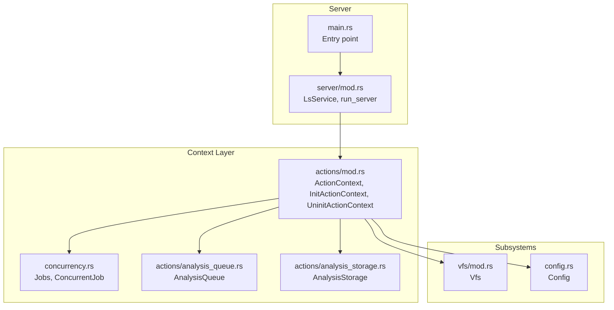
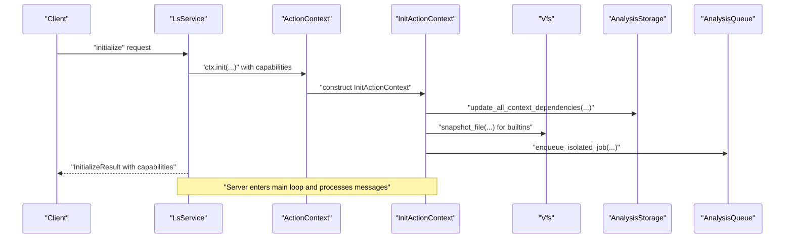
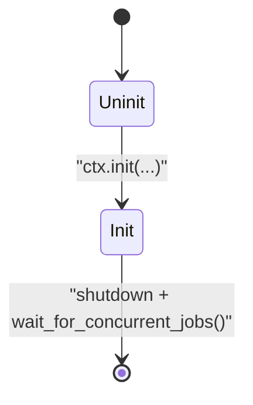
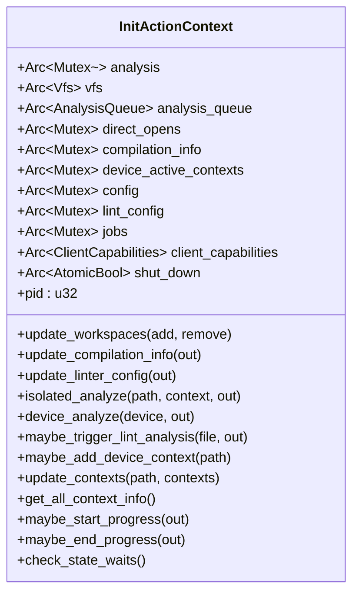
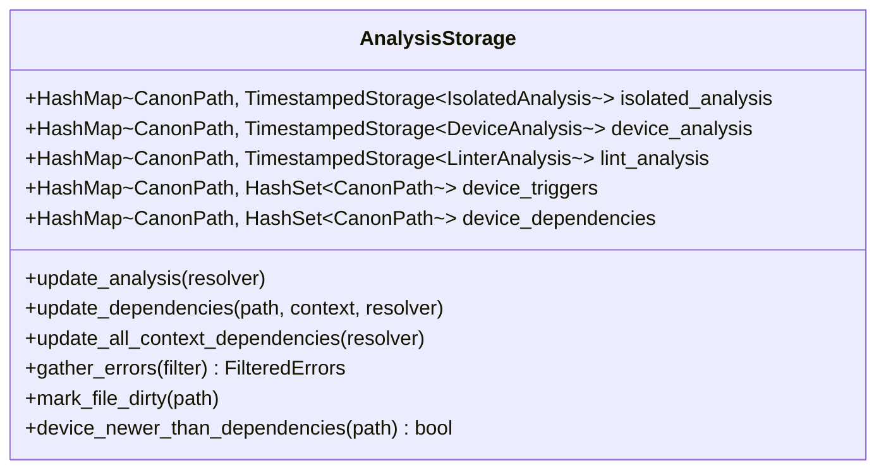
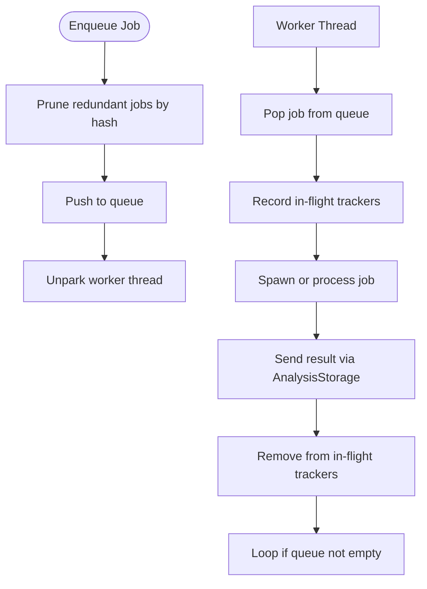
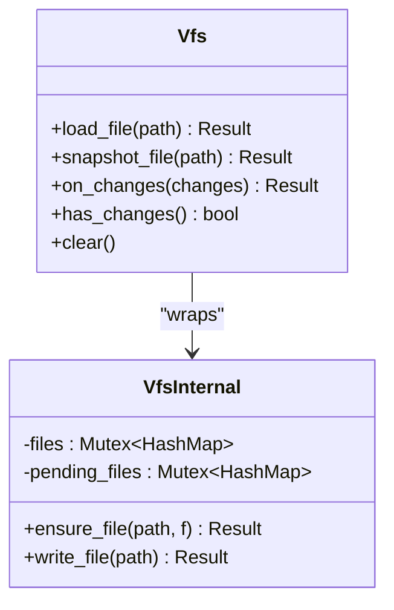
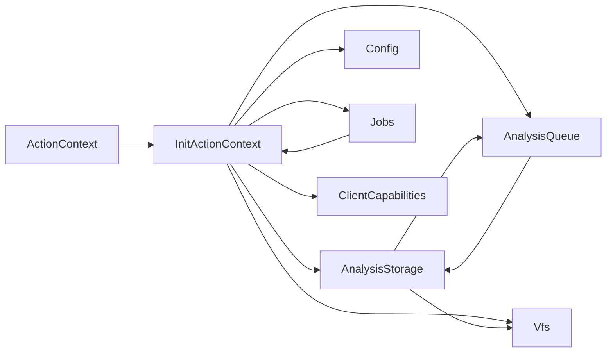

# Action Context Management

<cite>
**Referenced Files in This Document**
- [lib.rs](file://src/lib.rs)
- [main.rs](file://src/main.rs)
- [actions/mod.rs](file://src/actions/mod.rs)
- [actions/analysis_storage.rs](file://src/actions/analysis_storage.rs)
- [actions/analysis_queue.rs](file://src/actions/analysis_queue.rs)
- [vfs/mod.rs](file://src/vfs/mod.rs)
- [config.rs](file://src/config.rs)
- [concurrency.rs](file://src/concurrency.rs)
- [server/mod.rs](file://src/server/mod.rs)
</cite>

## Table of Contents
1. [Introduction](#introduction)
2. [Project Structure](#project-structure)
3. [Core Components](#core-components)
4. [Architecture Overview](#architecture-overview)
5. [Detailed Component Analysis](#detailed-component-analysis)
6. [Dependency Analysis](#dependency-analysis)
7. [Performance Considerations](#performance-considerations)
8. [Troubleshooting Guide](#troubleshooting-guide)
9. [Conclusion](#conclusion)

## Introduction
This document explains the action context management system that maintains server state across concurrent operations. It focuses on the ActionContext enum that encapsulates initialization states, the InitActionContext and UninitActionContext variants, and how the context coordinates analysis storage, virtual file system (VFS), configuration management, and job coordination. It also covers persistent state such as workspace roots, direct open files, compilation info, device active contexts, and how the server’s capabilities relate to context state. Practical guidance is provided for lifecycle management, thread-safe access patterns using Arc and Mutex, debugging approaches, and performance considerations for high-concurrency scenarios.

## Project Structure
The action context system is centered in the actions module and integrates with VFS, configuration, analysis storage, and the server loop. The server constructs the context, initializes it upon receiving the initialize request, and routes all LSP messages through the context.

**Diagram sources**
- [main.rs](file://src/main.rs#L44-L59)
- [server/mod.rs](file://src/server/mod.rs#L68-L84)
- [actions/mod.rs](file://src/actions/mod.rs#L70-L150)
- [actions/analysis_storage.rs](file://src/actions/analysis_storage.rs#L103-L129)
- [actions/analysis_queue.rs](file://src/actions/analysis_queue.rs#L38-L47)
- [vfs/mod.rs](file://src/vfs/mod.rs#L29-L297)
- [config.rs](file://src/config.rs#L123-L139)
- [concurrency.rs](file://src/concurrency.rs#L32-L34)

**Section sources**
- [lib.rs](file://src/lib.rs#L31-L47)
- [main.rs](file://src/main.rs#L44-L59)
- [server/mod.rs](file://src/server/mod.rs#L68-L84)

## Core Components
- ActionContext: An enum that represents the server’s initialization state. It holds either UninitActionContext (before initialization) or InitActionContext (after initialization).
- InitActionContext: The initialized context containing shared state and subsystem handles, including analysis storage, VFS, configuration, device active contexts, job coordination, and more.
- UninitActionContext: The uninitialized context holding VFS, configuration, and analysis storage before initialization.
- AnalysisStorage: Persistent store for analysis results and dependency metadata.
- AnalysisQueue: Single-threaded worker that executes analysis jobs and tracks in-flight work.
- Vfs: Virtual file system abstraction for file reads, snapshots, and change tracking.
- Config: Server configuration with defaults and update semantics.
- Jobs/ConcurrentJob: Lightweight concurrency coordination for tracking and waiting on background tasks.

**Section sources**
- [actions/mod.rs](file://src/actions/mod.rs#L70-L150)
- [actions/mod.rs](file://src/actions/mod.rs#L224-L266)
- [actions/mod.rs](file://src/actions/mod.rs#L268-L285)
- [actions/analysis_storage.rs](file://src/actions/analysis_storage.rs#L103-L129)
- [actions/analysis_queue.rs](file://src/actions/analysis_queue.rs#L38-L47)
- [vfs/mod.rs](file://src/vfs/mod.rs#L29-L297)
- [config.rs](file://src/config.rs#L123-L139)
- [concurrency.rs](file://src/concurrency.rs#L32-L34)

## Architecture Overview
The server creates an ActionContext::Uninit with VFS and Config, then initializes it on the initialize request. After initialization, InitActionContext coordinates:
- Analysis pipeline via AnalysisQueue and AnalysisStorage
- File content via Vfs
- Configuration updates via Config
- Device context activation and dependency tracking
- Job lifecycle via Jobs/ConcurrentJob
- LSP capability negotiation and diagnostics reporting

**Diagram sources**
- [server/mod.rs](file://src/server/mod.rs#L207-L289)
- [actions/mod.rs](file://src/actions/mod.rs#L101-L133)
- [actions/mod.rs](file://src/actions/mod.rs#L336-L370)
- [actions/analysis_storage.rs](file://src/actions/analysis_storage.rs#L466-L476)
- [actions/analysis_queue.rs](file://src/actions/analysis_queue.rs#L85-L109)

## Detailed Component Analysis

### ActionContext Enum and Lifecycle
- Uninitialized state: ActionContext::Uninit holds Vfs, Config, and AnalysisStorage. It is created by the server and used to prepare subsystems before initialization.
- Initialized state: ActionContext::Init holds InitActionContext, which is constructed during initialize and carries all persistent state and subsystem handles.
- Initialization process: The server calls ctx.init with initialization options and client capabilities, then sets server capabilities and workspace roots.

**Diagram sources**
- [actions/mod.rs](file://src/actions/mod.rs#L70-L150)
- [server/mod.rs](file://src/server/mod.rs#L86-L107)

**Section sources**
- [actions/mod.rs](file://src/actions/mod.rs#L70-L150)
- [server/mod.rs](file://src/server/mod.rs#L207-L289)

### InitActionContext: Persistent State and Subsystem Coordination
InitActionContext aggregates:
- AnalysisStorage: central store for isolated/device/linter results and dependency maps
- Vfs: file snapshotting and content access
- AnalysisQueue: single-threaded job execution with in-flight tracking
- Device active contexts: active device analysis contexts for reporting and dependency propagation
- Configuration and linter configuration: runtime-configurable behavior
- Outstanding requests and waits: request tracking and state waits
- Jobs: concurrent job tracking and waiting
- Client capabilities: negotiated server capabilities

Key operations:
- Workspace management: update_workspaces adds/removes workspace roots
- Compilation info: update_compilation_info parses compile_commands.json and updates include paths and dependencies
- Linter config: update_linter_config loads lint configuration from file or defaults
- Analysis orchestration: isolated_analyze, device_analyze, maybe_trigger_lint_analysis
- Device context management: maybe_add_device_context, update_contexts, get_all_context_info
- Progress reporting: maybe_start_progress/maybe_end_progress
- State waits: wait_for_state, check_state_waits

**Diagram sources**
- [actions/mod.rs](file://src/actions/mod.rs#L224-L266)
- [actions/mod.rs](file://src/actions/mod.rs#L393-L461)
- [actions/mod.rs](file://src/actions/mod.rs#L761-L804)
- [actions/mod.rs](file://src/actions/mod.rs#L936-L990)

**Section sources**
- [actions/mod.rs](file://src/actions/mod.rs#L224-L266)
- [actions/mod.rs](file://src/actions/mod.rs#L393-L461)
- [actions/mod.rs](file://src/actions/mod.rs#L761-L804)
- [actions/mod.rs](file://src/actions/mod.rs#L936-L990)

### AnalysisStorage: Persistent Results and Dependencies
AnalysisStorage maintains:
- Analysis results keyed by file and timestamp
- Dependency maps and import resolution maps
- Device triggers and dependencies for device analysis propagation
- Error aggregation and lookup helpers

It updates dependencies based on resolver and context, discards stale analysis, and gathers errors for diagnostics reporting.

**Diagram sources**
- [actions/analysis_storage.rs](file://src/actions/analysis_storage.rs#L103-L129)
- [actions/analysis_storage.rs](file://src/actions/analysis_storage.rs#L486-L584)
- [actions/analysis_storage.rs](file://src/actions/analysis_storage.rs#L700-L746)

**Section sources**
- [actions/analysis_storage.rs](file://src/actions/analysis_storage.rs#L103-L129)
- [actions/analysis_storage.rs](file://src/actions/analysis_storage.rs#L486-L584)
- [actions/analysis_storage.rs](file://src/actions/analysis_storage.rs#L700-L746)

### AnalysisQueue: Single-Threaded Execution and In-Flight Tracking
AnalysisQueue runs a dedicated worker thread that:
- Enqueues jobs (isolated, device, linter)
- Tracks in-flight jobs to avoid redundant work
- Executes jobs and reports results via AnalysisStorage channels
- Provides has_work, has_isolated_work, has_device_work, and path-specific checks

**Diagram sources**
- [actions/analysis_queue.rs](file://src/actions/analysis_queue.rs#L150-L163)
- [actions/analysis_queue.rs](file://src/actions/analysis_queue.rs#L165-L236)
- [actions/analysis_queue.rs](file://src/actions/analysis_queue.rs#L238-L337)

**Section sources**
- [actions/analysis_queue.rs](file://src/actions/analysis_queue.rs#L38-L47)
- [actions/analysis_queue.rs](file://src/actions/analysis_queue.rs#L150-L163)
- [actions/analysis_queue.rs](file://src/actions/analysis_queue.rs#L165-L236)
- [actions/analysis_queue.rs](file://src/actions/analysis_queue.rs#L238-L337)

### Vfs: Thread-Safe File Access and Change Tracking
Vfs provides:
- File snapshots for analysis
- Change coalescing and pending-file synchronization
- Line and span accessors
- User data association per file

It ensures thread-safe access to file contents and coordinates with AnalysisQueue to avoid races.

**Diagram sources**
- [vfs/mod.rs](file://src/vfs/mod.rs#L180-L288)
- [vfs/mod.rs](file://src/vfs/mod.rs#L293-L603)

**Section sources**
- [vfs/mod.rs](file://src/vfs/mod.rs#L180-L288)
- [vfs/mod.rs](file://src/vfs/mod.rs#L293-L603)

### Config: Runtime Behavior and Defaults
Config encapsulates:
- Linting toggles, lint configuration path, and lint-direct-only behavior
- Compilation info path and include paths
- Analysis retention duration and device context modes
- Update semantics and validation

InitActionContext uses Config to:
- Load and apply linter configuration
- Parse and apply compilation info
- Control device context activation policies

**Section sources**
- [config.rs](file://src/config.rs#L123-L139)
- [config.rs](file://src/config.rs#L208-L225)
- [config.rs](file://src/config.rs#L298-L312)
- [actions/mod.rs](file://src/actions/mod.rs#L403-L461)
- [actions/mod.rs](file://src/actions/mod.rs#L838-L930)

### Concurrency: Jobs and ConcurrentJob
Jobs/ConcurrentJob provides lightweight coordination:
- ConcurrentJob is created with a bounded channel; dropping the token signals completion
- Jobs tracks all jobs and wait_for_all blocks until all complete
- Used to coordinate background analysis and ensure determinism in tests

**Section sources**
- [concurrency.rs](file://src/concurrency.rs#L22-L29)
- [concurrency.rs](file://src/concurrency.rs#L32-L34)
- [concurrency.rs](file://src/concurrency.rs#L66-L77)
- [concurrency.rs](file://src/concurrency.rs#L88-L102)

### Server Capabilities and Context State
Server capabilities are negotiated based on context state and configuration. The server caps include experimental features and workspace folder support. The context state determines whether certain requests are processed and whether diagnostics are published.

**Section sources**
- [server/mod.rs](file://src/server/mod.rs#L677-L729)
- [server/mod.rs](file://src/server/mod.rs#L207-L289)

## Dependency Analysis
The context orchestrates interactions among subsystems. The following diagram shows key dependencies and control flows.

**Diagram sources**
- [actions/mod.rs](file://src/actions/mod.rs#L70-L150)
- [actions/mod.rs](file://src/actions/mod.rs#L224-L266)
- [actions/analysis_storage.rs](file://src/actions/analysis_storage.rs#L103-L129)
- [actions/analysis_queue.rs](file://src/actions/analysis_queue.rs#L38-L47)
- [vfs/mod.rs](file://src/vfs/mod.rs#L29-L297)
- [config.rs](file://src/config.rs#L123-L139)
- [concurrency.rs](file://src/concurrency.rs#L32-L34)

**Section sources**
- [actions/mod.rs](file://src/actions/mod.rs#L70-L150)
- [actions/mod.rs](file://src/actions/mod.rs#L224-L266)
- [actions/analysis_storage.rs](file://src/actions/analysis_storage.rs#L103-L129)
- [actions/analysis_queue.rs](file://src/actions/analysis_queue.rs#L38-L47)
- [vfs/mod.rs](file://src/vfs/mod.rs#L29-L297)
- [config.rs](file://src/config.rs#L123-L139)
- [concurrency.rs](file://src/concurrency.rs#L32-L34)

## Performance Considerations
- Single-threaded analysis queue: AnalysisQueue runs a single worker thread to simplify dependency handling and avoid redundant work. This reduces contention but may limit throughput for CPU-bound tasks.
- In-flight tracking: Device and isolated job trackers prevent redundant work and enable has_*_work checks for wait logic.
- Timestamp-based invalidation: AnalysisStorage uses timestamps to decide whether to accept new results and to prune stale analysis.
- Retention policy: InitActionContext can discard overly old analysis based on configured retention duration.
- Mutex granularity: Many fields in InitActionContext are protected by Arc<Mutex<...>>. Consider minimizing lock scope and avoiding nested locks to reduce contention.
- VFS change coalescing: Vfs merges multiple changes to reduce overhead and synchronize pending writes.

[No sources needed since this section provides general guidance]

## Troubleshooting Guide
Common issues and debugging approaches:
- Initialization failures: Ensure initialize is called once and ctx.init succeeds. Check that server caps are sent before other messages.
- Missing built-ins: InitActionContext may warn if required builtin files are not found; verify include paths and compilation info.
- Stalled analysis: Use wait_for_state and check_state_waits to diagnose waits. Verify has_work and path-specific checks in AnalysisQueue.
- Configuration drift: Use maybe_changed_config to re-evaluate linter and compilation settings after updates.
- Concurrency deadlocks: Ensure jobs are added via add_job and waited via wait_for_concurrent_jobs. Avoid holding locks across VFS or storage operations.
- Diagnostics not appearing: Confirm report_errors is invoked and diagnostics are published via the notifier.

**Section sources**
- [server/mod.rs](file://src/server/mod.rs#L207-L289)
- [actions/mod.rs](file://src/actions/mod.rs#L731-L743)
- [actions/mod.rs](file://src/actions/mod.rs#L1094-L1120)
- [actions/mod.rs](file://src/actions/mod.rs#L1237-L1247)
- [concurrency.rs](file://src/concurrency.rs#L42-L59)

## Conclusion
The action context management system provides a robust, thread-safe foundation for the DML language server. ActionContext separates initialization concerns, InitActionContext centralizes persistent state and subsystem coordination, and AnalysisQueue ensures deterministic, single-threaded execution of analysis tasks. With careful use of Arc and Mutex, and clear state transitions, the system supports high-concurrency scenarios while maintaining correctness and responsiveness. Proper configuration, diagnostics, and debugging practices help maintain reliability and performance.