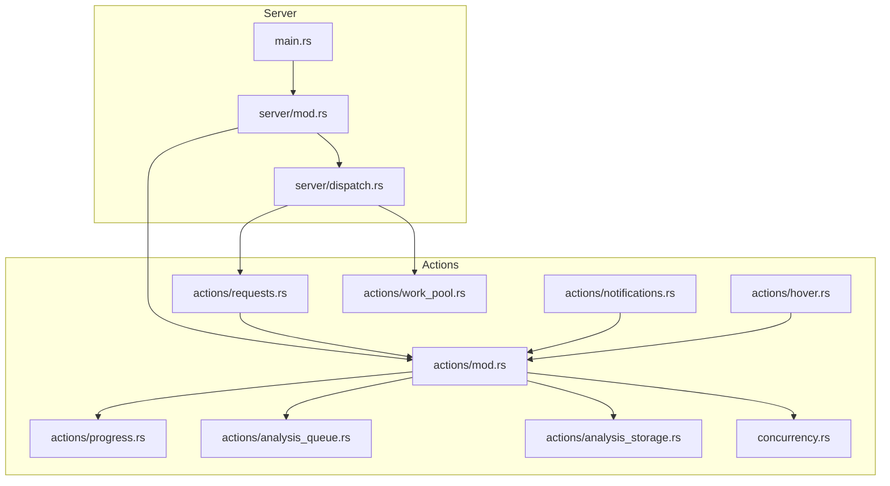
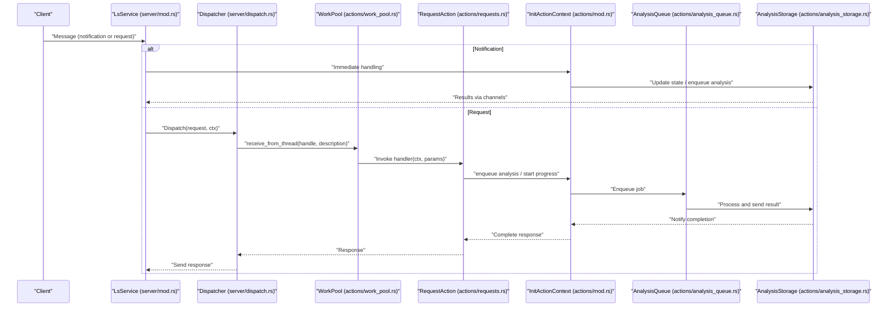
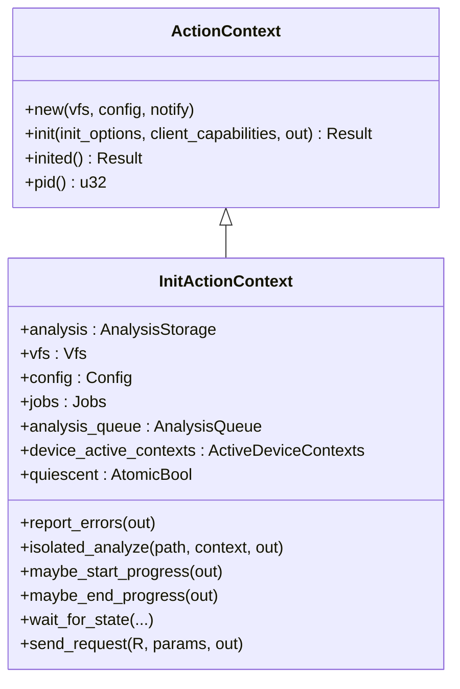
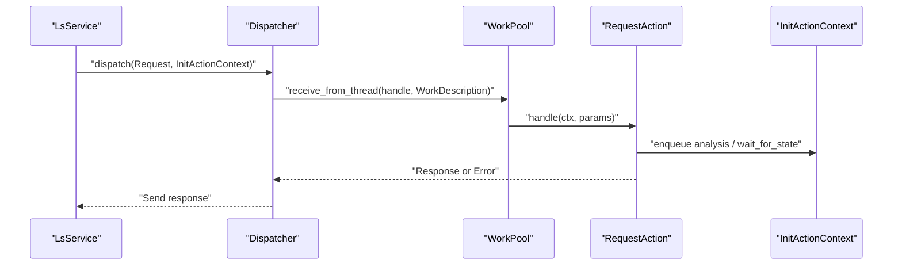
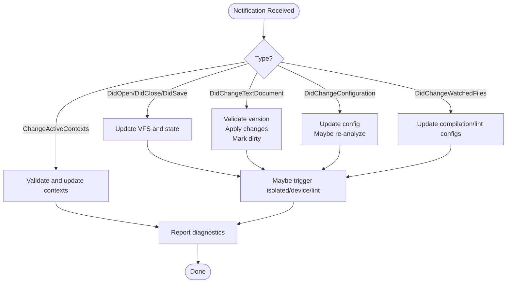
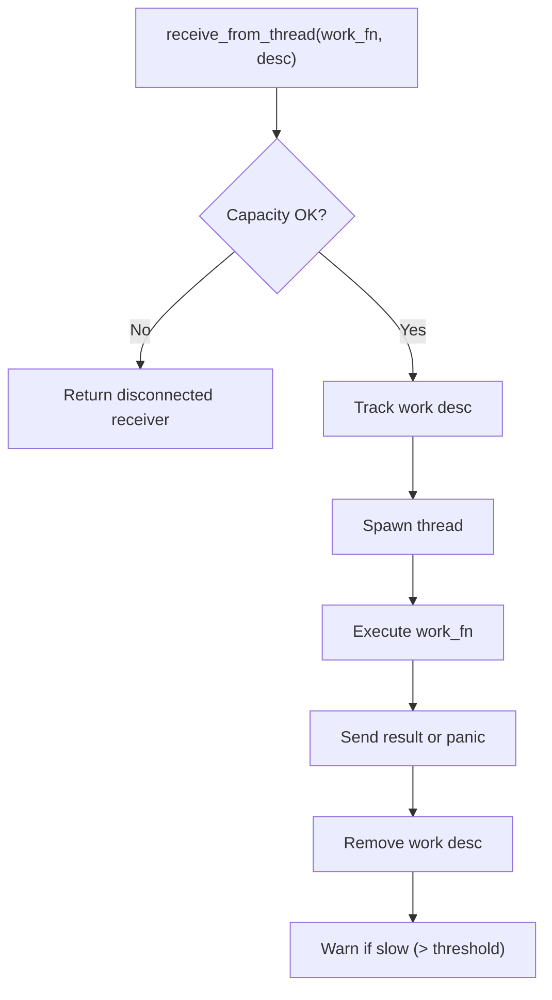
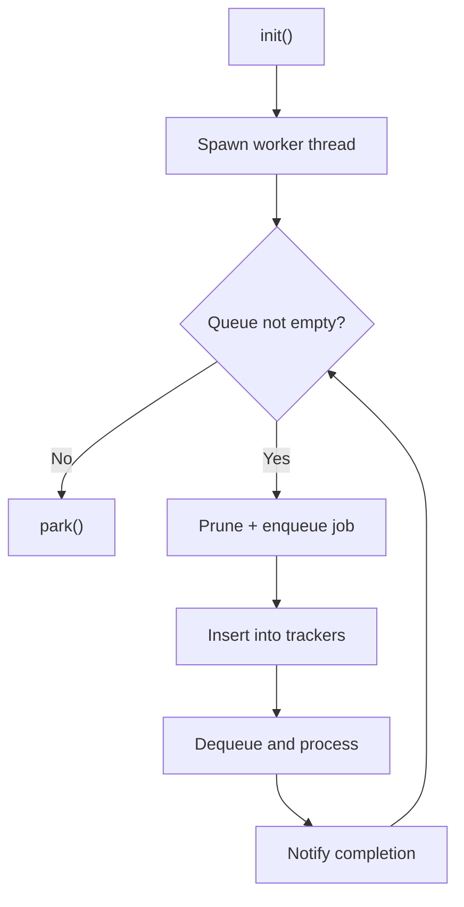
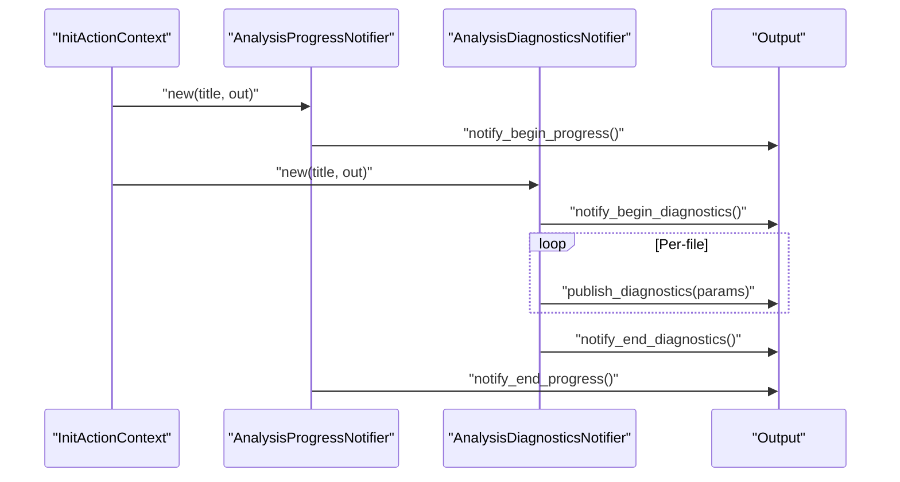
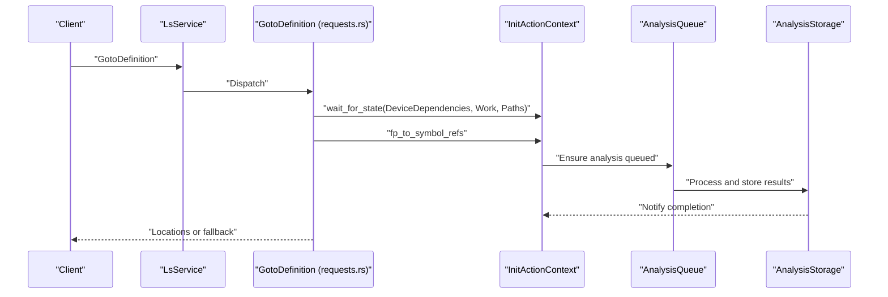
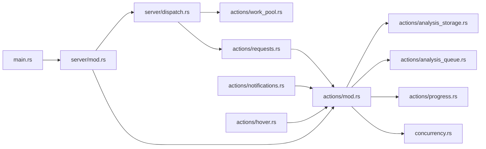

# Actions and Request Handling

<cite>
**Referenced Files in This Document**
- [src/actions/mod.rs](file://src/actions/mod.rs)
- [src/actions/requests.rs](file://src/actions/requests.rs)
- [src/actions/notifications.rs](file://src/actions/notifications.rs)
- [src/actions/progress.rs](file://src/actions/progress.rs)
- [src/actions/analysis_queue.rs](file://src/actions/analysis_queue.rs)
- [src/actions/analysis_storage.rs](file://src/actions/analysis_storage.rs)
- [src/actions/work_pool.rs](file://src/actions/work_pool.rs)
- [src/actions/hover.rs](file://src/actions/hover.rs)
- [src/concurrency.rs](file://src/concurrency.rs)
- [src/server/dispatch.rs](file://src/server/dispatch.rs)
- [src/server/mod.rs](file://src/server/mod.rs)
- [src/main.rs](file://src/main.rs)
</cite>

## Table of Contents
1. [Introduction](#introduction)
2. [Project Structure](#project-structure)
3. [Core Components](#core-components)
4. [Architecture Overview](#architecture-overview)
5. [Detailed Component Analysis](#detailed-component-analysis)
6. [Dependency Analysis](#dependency-analysis)
7. [Performance Considerations](#performance-considerations)
8. [Troubleshooting Guide](#troubleshooting-guide)
9. [Conclusion](#conclusion)

## Introduction
This document explains the action coordination and request handling system of the DML Language Server. It covers how the server maintains persistent state across concurrent operations, how requests and notifications are processed, how real-time updates are delivered, and how analysis tasks are coordinated. It also documents the work pool for parallel execution, progress reporting, request queuing, priority and cancellation semantics for long-running operations, error propagation, and scalability considerations.

## Project Structure
The action coordination system is centered around a shared context that holds server state and orchestrates analysis, notifications, and request handling. Supporting modules implement:
- Action context management and lifecycle
- Request dispatch and timeouts
- Notification handling for file events and configuration changes
- Analysis queueing and worker threads
- Progress and diagnostics reporting
- Work pool for parallel request execution
- Concurrency primitives for job tracking

**Diagram sources**
- [src/main.rs](file://src/main.rs#L1-L60)
- [src/server/mod.rs](file://src/server/mod.rs#L1-L200)
- [src/server/dispatch.rs](file://src/server/dispatch.rs#L1-L206)
- [src/actions/mod.rs](file://src/actions/mod.rs#L1-L1391)
- [src/actions/requests.rs](file://src/actions/requests.rs#L1-L1041)
- [src/actions/notifications.rs](file://src/actions/notifications.rs#L1-L375)
- [src/actions/progress.rs](file://src/actions/progress.rs#L1-L190)
- [src/actions/analysis_queue.rs](file://src/actions/analysis_queue.rs#L1-L599)
- [src/actions/analysis_storage.rs](file://src/actions/analysis_storage.rs#L1-L776)
- [src/actions/work_pool.rs](file://src/actions/work_pool.rs#L1-L104)
- [src/actions/hover.rs](file://src/actions/hover.rs#L1-L30)
- [src/concurrency.rs](file://src/concurrency.rs#L1-L103)

**Section sources**
- [src/main.rs](file://src/main.rs#L1-L60)
- [src/server/mod.rs](file://src/server/mod.rs#L1-L200)
- [src/actions/mod.rs](file://src/actions/mod.rs#L1-L120)

## Core Components
- ActionContext and InitActionContext: Persistent state shared across requests and notifications. It encapsulates VFS, configuration, analysis storage, device contexts, and concurrency handles.
- AnalysisStorage: Central store for analysis results, dependency graphs, and invalidation logic.
- AnalysisQueue: Single-threaded worker that serializes and executes analysis jobs (isolated, device, linter) while deduplicating redundant work.
- WorkPool: Controlled thread pool for executing request handlers with capacity and timeout enforcement.
- Dispatcher: Bridges stdin-non-blocking requests to the work pool with timeouts and fallback responses.
- Progress and Diagnostics Notifiers: LSP progress and diagnostics publishing utilities.
- Concurrency primitives: Jobs tracking and job tokens to coordinate long-running tasks.

**Section sources**
- [src/actions/mod.rs](file://src/actions/mod.rs#L70-L275)
- [src/actions/analysis_storage.rs](file://src/actions/analysis_storage.rs#L100-L130)
- [src/actions/analysis_queue.rs](file://src/actions/analysis_queue.rs#L33-L47)
- [src/actions/work_pool.rs](file://src/actions/work_pool.rs#L22-L39)
- [src/server/dispatch.rs](file://src/server/dispatch.rs#L109-L147)
- [src/actions/progress.rs](file://src/actions/progress.rs#L17-L45)
- [src/concurrency.rs](file://src/concurrency.rs#L22-L34)

## Architecture Overview
The server runs a main loop that reads messages from the client, dispatches notifications immediately, and forwards requests to a dispatcher. The dispatcher schedules request handlers onto a work pool with timeouts. Handlers use the InitActionContext to coordinate analysis, enqueue jobs into the AnalysisQueue, and publish progress and diagnostics. Analysis results are fed back into AnalysisStorage and trigger downstream actions (e.g., device analysis, linting, diagnostics publication).

**Diagram sources**
- [src/server/mod.rs](file://src/server/mod.rs#L322-L470)
- [src/server/dispatch.rs](file://src/server/dispatch.rs#L50-L84)
- [src/actions/work_pool.rs](file://src/actions/work_pool.rs#L53-L103)
- [src/actions/requests.rs](file://src/actions/requests.rs#L401-L458)
- [src/actions/mod.rs](file://src/actions/mod.rs#L761-L804)
- [src/actions/analysis_queue.rs](file://src/actions/analysis_queue.rs#L165-L236)
- [src/actions/analysis_storage.rs](file://src/actions/analysis_storage.rs#L486-L584)

## Detailed Component Analysis

### Action Context Management
- Lifecycle: Created uninitialized, initialized with client capabilities and settings, then transitions to initialized state where all handlers operate.
- Shared resources: VFS, configuration, analysis storage, device contexts, workspace roots, compilation info, linter config, and concurrency handles.
- State mutation: Mutations are guarded by locks; version ordering ensures correct sequencing of file change notifications; quiescent flag tracks whether mutating requests are allowed.
- Device context activation: Automatic activation policies based on configuration and dependency analysis; supports explicit updates via notifications.

**Diagram sources**
- [src/actions/mod.rs](file://src/actions/mod.rs#L70-L150)
- [src/actions/mod.rs](file://src/actions/mod.rs#L224-L266)
- [src/actions/mod.rs](file://src/actions/mod.rs#L336-L370)

**Section sources**
- [src/actions/mod.rs](file://src/actions/mod.rs#L88-L150)
- [src/actions/mod.rs](file://src/actions/mod.rs#L336-L370)
- [src/actions/mod.rs](file://src/actions/mod.rs#L1085-L1275)

### Request Processing Pipeline
- Immediate vs deferred: Notifications and blocking requests are handled synchronously on the main thread; non-blocking requests are dispatched asynchronously.
- Timeout handling: Each request type defines a timeout; the dispatcher checks remaining time before starting work and falls back to a predefined response if expired.
- Response routing: Responses are sent via the Output abstraction; custom failures and message-based responses are supported.

**Diagram sources**
- [src/server/dispatch.rs](file://src/server/dispatch.rs#L50-L84)
- [src/server/dispatch.rs](file://src/server/dispatch.rs#L113-L147)
- [src/actions/work_pool.rs](file://src/actions/work_pool.rs#L53-L103)
- [src/actions/requests.rs](file://src/actions/requests.rs#L401-L458)

**Section sources**
- [src/server/dispatch.rs](file://src/server/dispatch.rs#L1-L206)
- [src/server/mod.rs](file://src/server/mod.rs#L529-L596)

### Notification Handling for Real-Time Updates
- File lifecycle: Open/close/save, incremental text changes with version ordering, and watched file changes trigger analysis updates.
- Configuration changes: Dynamic reconfiguration of compilation info and linter settings; triggers re-analysis and diagnostics refresh.
- Context control: Clients can change active device contexts; server validates and updates active context sets and re-reports diagnostics.

**Diagram sources**
- [src/actions/notifications.rs](file://src/actions/notifications.rs#L74-L271)
- [src/actions/mod.rs](file://src/actions/mod.rs#L463-L518)
- [src/actions/mod.rs](file://src/actions/mod.rs#L697-L743)

**Section sources**
- [src/actions/notifications.rs](file://src/actions/notifications.rs#L74-L271)
- [src/actions/mod.rs](file://src/actions/mod.rs#L1023-L1053)

### Work Pool Coordination and Parallel Execution
- Controlled concurrency: Fixed-size thread pool with a global work tracker; prevents overload by refusing to start work when capacity is reached or when too many similar tasks are running.
- Timeouts: Tasks are checked for remaining time before execution; expired tasks receive fallback responses.
- Panic safety: Work is wrapped in catch_unwind; panics are logged and receivers receive disconnect errors.

**Diagram sources**
- [src/actions/work_pool.rs](file://src/actions/work_pool.rs#L53-L103)

**Section sources**
- [src/actions/work_pool.rs](file://src/actions/work_pool.rs#L22-L39)
- [src/actions/work_pool.rs](file://src/actions/work_pool.rs#L53-L103)

### Analysis Queue and Resource Allocation
- Single-threaded worker: Ensures deterministic ordering and avoids redundant work by pruning obsolete jobs and tracking in-flight jobs.
- Deduplication: Jobs are hashed by path(s); duplicates are removed from the queue before insertion.
- Resource allocation: Tracks isolated and device jobs separately; provides queries to detect ongoing work for given paths.

**Diagram sources**
- [src/actions/analysis_queue.rs](file://src/actions/analysis_queue.rs#L49-L67)
- [src/actions/analysis_queue.rs](file://src/actions/analysis_queue.rs#L150-L163)
- [src/actions/analysis_queue.rs](file://src/actions/analysis_queue.rs#L165-L236)

**Section sources**
- [src/actions/analysis_queue.rs](file://src/actions/analysis_queue.rs#L33-L47)
- [src/actions/analysis_queue.rs](file://src/actions/analysis_queue.rs#L150-L163)
- [src/actions/analysis_queue.rs](file://src/actions/analysis_queue.rs#L238-L337)

### Progress Reporting and Diagnostics
- Progress: Begin/end progress notifications with optional cancellable flag and percentage; used to indicate analysis start and completion.
- Diagnostics: Publish diagnostics per file; supports begin/end markers and error messages; integrates with configuration to suppress or include linting.

**Diagram sources**
- [src/actions/progress.rs](file://src/actions/progress.rs#L48-L122)
- [src/actions/progress.rs](file://src/actions/progress.rs#L149-L189)
- [src/actions/mod.rs](file://src/actions/mod.rs#L463-L518)

**Section sources**
- [src/actions/progress.rs](file://src/actions/progress.rs#L17-L45)
- [src/actions/progress.rs](file://src/actions/progress.rs#L48-L122)
- [src/actions/progress.rs](file://src/actions/progress.rs#L149-L189)

### Request Queuing, Priority, and Cancellation
- Queuing: Non-blocking requests are enqueued to a dispatcher; the dispatcher schedules them on the work pool with timeouts.
- Priority: No explicit priority queues; requests are processed in FIFO order on the dispatcher thread.
- Cancellation: Cancellation is signaled via job tokens; dropping tokens indicates completion. Long-running tasks can be interrupted by timeouts; there is no explicit request cancellation API in the codebase.

**Section sources**
- [src/server/dispatch.rs](file://src/server/dispatch.rs#L113-L147)
- [src/concurrency.rs](file://src/concurrency.rs#L22-L34)
- [src/concurrency.rs](file://src/concurrency.rs#L79-L86)

### Action Lifecycle Examples
- Hover tooltip construction: Converts position to span, builds tooltip content, and returns LSP hover response.
- Definition/Declaration/Implementation navigation: Waits for analysis state (isolated/device/device-dependencies), resolves symbols/references, and returns locations with limitation warnings.

**Diagram sources**
- [src/actions/requests.rs](file://src/actions/requests.rs#L604-L660)
- [src/actions/requests.rs](file://src/actions/requests.rs#L136-L219)
- [src/actions/mod.rs](file://src/actions/mod.rs#L1094-L1120)
- [src/actions/analysis_queue.rs](file://src/actions/analysis_queue.rs#L165-L236)
- [src/actions/analysis_storage.rs](file://src/actions/analysis_storage.rs#L486-L584)

**Section sources**
- [src/actions/hover.rs](file://src/actions/hover.rs#L18-L29)
- [src/actions/requests.rs](file://src/actions/requests.rs#L460-L480)
- [src/actions/requests.rs](file://src/actions/requests.rs#L604-L660)

### Error Propagation and Diagnostics
- Lookup errors: Structured errors for missing analyses; handlers return fallback responses with warnings.
- Diagnostics publication: Aggregates errors from isolated, device, and linter analyses; respects configuration for lint inclusion and direct-only mode.
- Unknown/deprecated/duplicated configuration keys: Emits warnings via LSP messages.

**Section sources**
- [src/actions/analysis_storage.rs](file://src/actions/analysis_storage.rs#L135-L154)
- [src/actions/requests.rs](file://src/actions/requests.rs#L58-L87)
- [src/actions/mod.rs](file://src/actions/mod.rs#L463-L518)
- [src/server/mod.rs](file://src/server/mod.rs#L109-L205)

## Dependency Analysis
The following diagram shows key dependencies among modules involved in action coordination and request handling.

**Diagram sources**
- [src/main.rs](file://src/main.rs#L44-L59)
- [src/server/mod.rs](file://src/server/mod.rs#L301-L320)
- [src/server/dispatch.rs](file://src/server/dispatch.rs#L109-L147)
- [src/actions/work_pool.rs](file://src/actions/work_pool.rs#L53-L103)
- [src/actions/requests.rs](file://src/actions/requests.rs#L401-L458)
- [src/actions/mod.rs](file://src/actions/mod.rs#L70-L150)
- [src/actions/analysis_storage.rs](file://src/actions/analysis_storage.rs#L100-L130)
- [src/actions/analysis_queue.rs](file://src/actions/analysis_queue.rs#L33-L47)
- [src/actions/progress.rs](file://src/actions/progress.rs#L17-L45)
- [src/concurrency.rs](file://src/concurrency.rs#L22-L34)
- [src/actions/notifications.rs](file://src/actions/notifications.rs#L74-L91)
- [src/actions/hover.rs](file://src/actions/hover.rs#L18-L29)

**Section sources**
- [src/server/mod.rs](file://src/server/mod.rs#L529-L596)
- [src/actions/mod.rs](file://src/actions/mod.rs#L1-L120)

## Performance Considerations
- Concurrency limits: WorkPool enforces a fixed thread count and caps similar work types to avoid saturation.
- Queueing strategy: AnalysisQueue serializes work on a single worker thread to reduce contention and redundant work; deduplication minimizes repeated analysis.
- Timeouts: Requests are checked for remaining time before execution; expired tasks return fallback responses promptly.
- Memory retention: AnalysisStorage discards overly old analysis results based on configuration to bound memory usage.
- Recommendations:
  - Tune thread pool size based on CPU cores and workload characteristics.
  - Monitor slow tasks via warnings and adjust timeout thresholds.
  - Use device context modes to limit unnecessary device analysis.
  - Enable suppression of imports selectively to reduce churn during editing.

[No sources needed since this section provides general guidance]

## Troubleshooting Guide
- Diagnosing timeouts: Verify request-specific timeouts and global defaults; inspect fallback responses and logs for expired tasks.
- Tracking orphaned jobs: Ensure all ConcurrentJob instances are added to Jobs and completed; drops with panics raise internal job errors.
- Verifying analysis state: Use wait_for_state to synchronize operations; check active waits and ping responses.
- Handling configuration changes: Unknown/deprecated/duplicated keys are reported via LSP messages; review logs for warnings.
- Debugging concurrent operations: Use job tracking and progress notifications to correlate request lifecycles with analysis completion.

**Section sources**
- [src/server/dispatch.rs](file://src/server/dispatch.rs#L22-L30)
- [src/concurrency.rs](file://src/concurrency.rs#L79-L86)
- [src/actions/mod.rs](file://src/actions/mod.rs#L1085-L1120)
- [src/server/mod.rs](file://src/server/mod.rs#L109-L205)

## Conclusion
The DML Language Server’s action coordination system combines a robust InitActionContext for persistent state, a single-threaded AnalysisQueue for deterministic and efficient analysis, and a controlled WorkPool for request execution with timeouts and capacity checks. Notifications are handled promptly to maintain responsiveness, while progress and diagnostics provide real-time feedback. The design balances correctness, concurrency safety, and performance, with clear pathways for debugging and scaling under load.