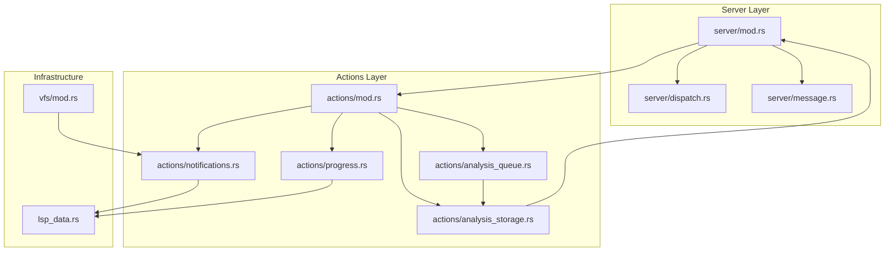
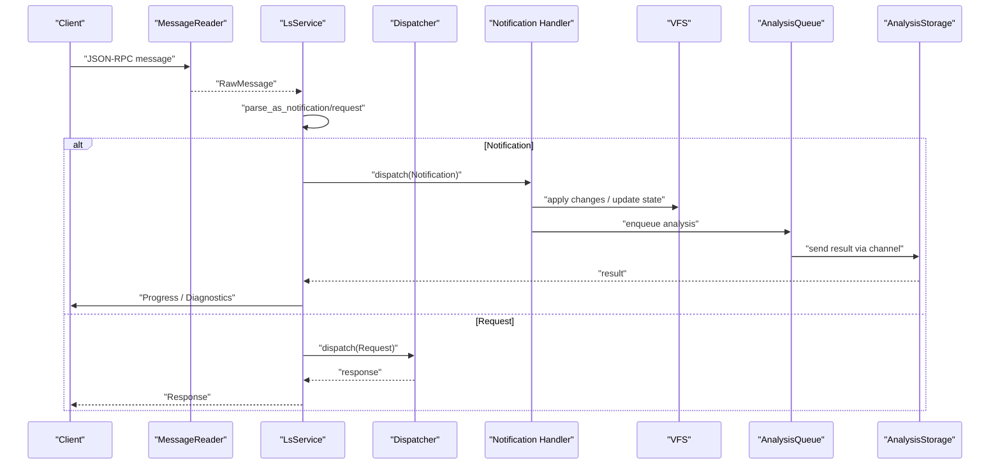
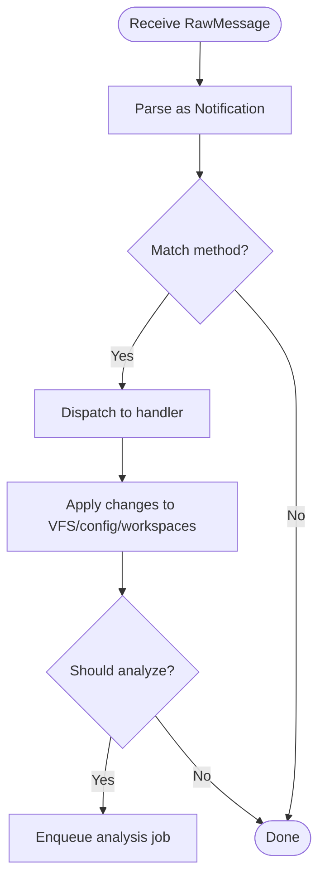
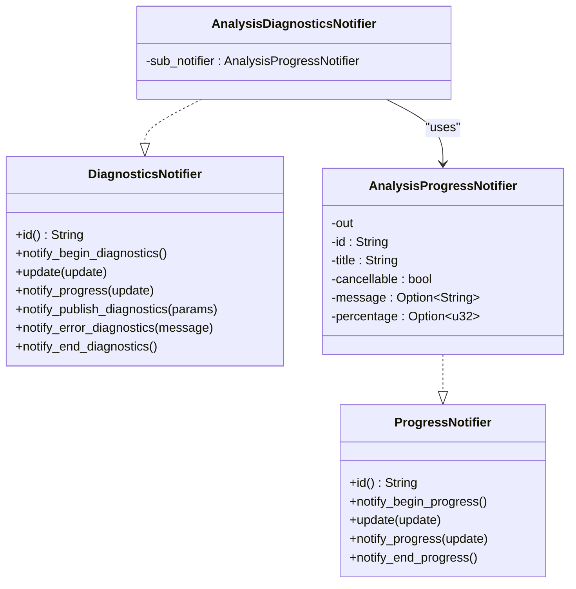
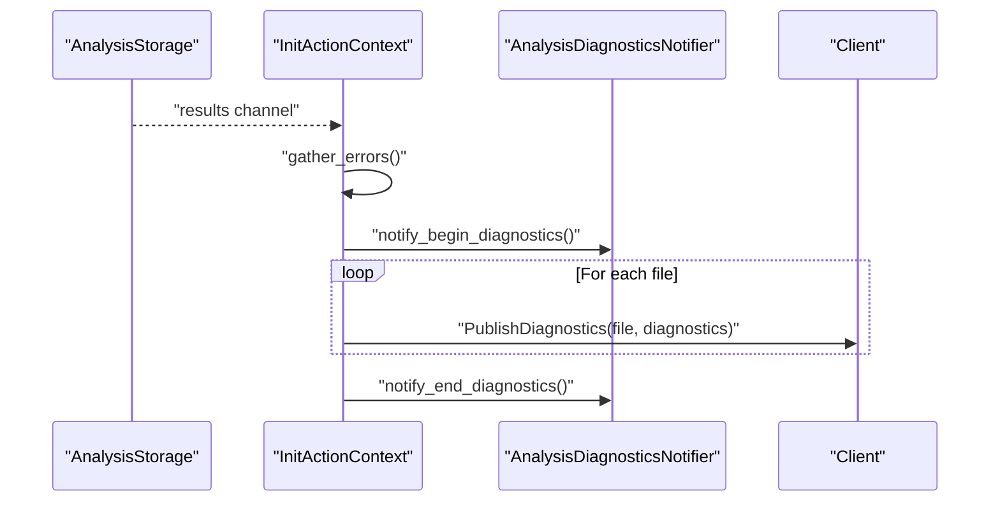
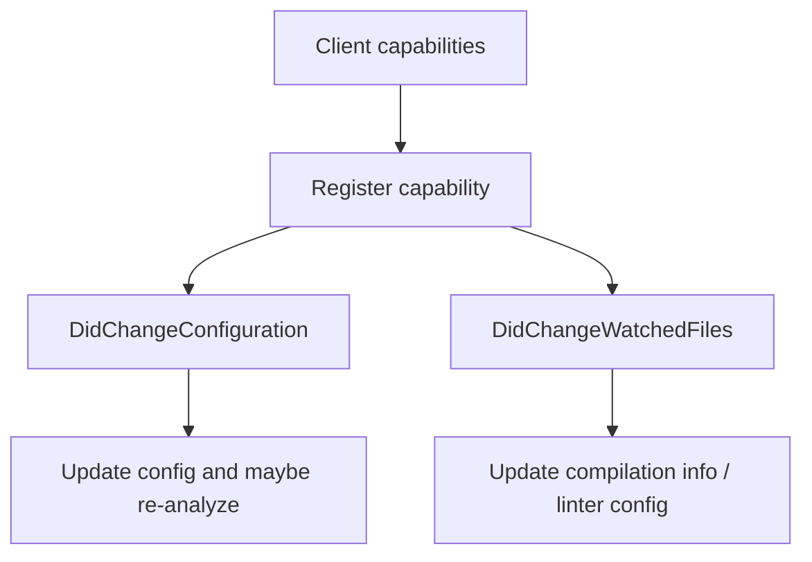
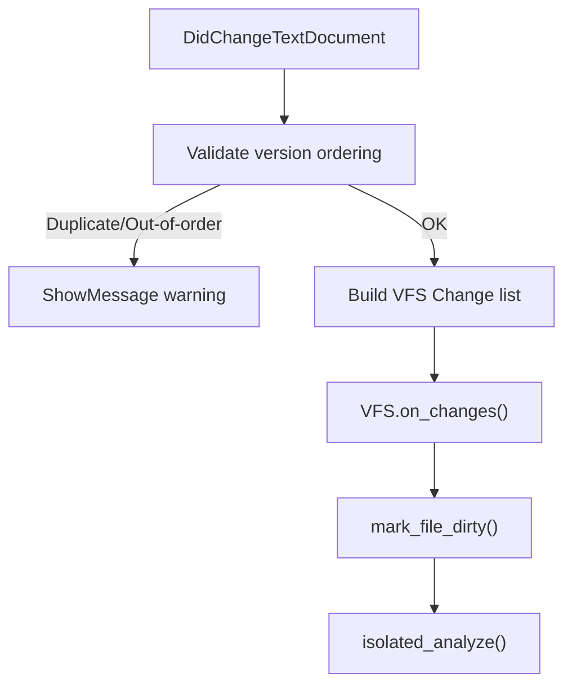
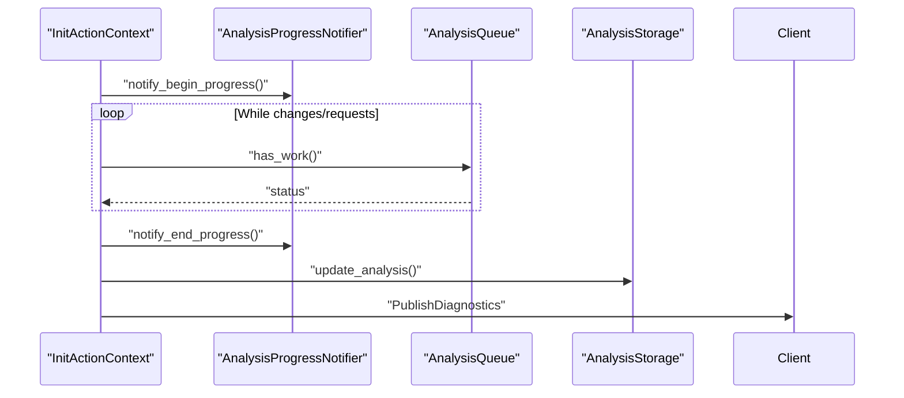
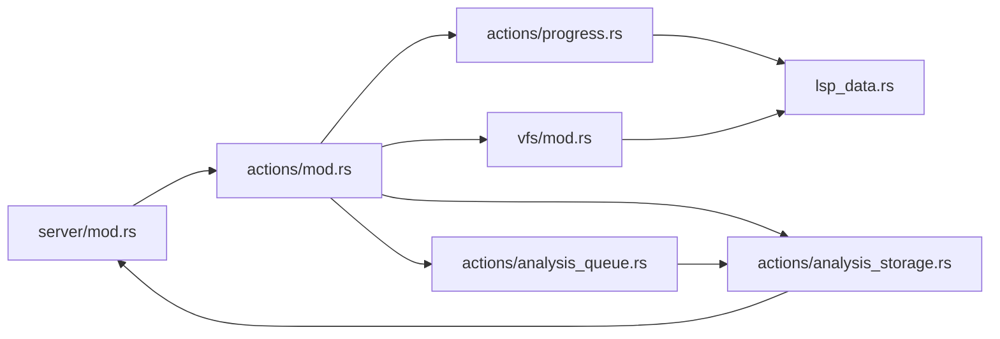

# Notification System

<cite>
**Referenced Files in This Document**
- [notifications.rs](file://src/actions/notifications.rs)
- [progress.rs](file://src/actions/progress.rs)
- [lsp_data.rs](file://src/lsp_data.rs)
- [dispatch.rs](file://src/server/dispatch.rs)
- [message.rs](file://src/server/message.rs)
- [server/mod.rs](file://src/server/mod.rs)
- [actions/mod.rs](file://src/actions/mod.rs)
- [analysis_queue.rs](file://src/actions/analysis_queue.rs)
- [analysis_storage.rs](file://src/actions/analysis_storage.rs)
- [vfs/mod.rs](file://src/vfs/mod.rs)
</cite>

## Table of Contents
1. [Introduction](#introduction)
2. [Project Structure](#project-structure)
3. [Core Components](#core-components)
4. [Architecture Overview](#architecture-overview)
5. [Detailed Component Analysis](#detailed-component-analysis)
6. [Dependency Analysis](#dependency-analysis)
7. [Performance Considerations](#performance-considerations)
8. [Troubleshooting Guide](#troubleshooting-guide)
9. [Conclusion](#conclusion)

## Introduction
This document explains the notification system that powers real-time updates and progress reporting in the DML Language Server. It covers how notifications are dispatched, how progress is tracked during analysis operations, and how diagnostic reports are published. It also documents the integration with the Language Server Protocol (LSP), real-time file change propagation, and the coordination between analysis progress and client updates. Practical guidance is provided for batching multiple notifications, performance tuning for high-frequency updates, memory management for notification queues, and debugging notification delivery issues.

## Project Structure
The notification system spans several modules:
- Actions: notification handlers and progress notifiers
- Server: message parsing, dispatching, and runtime loop
- VFS: in-memory file representation and change propagation
- Analysis: queuing and storage of analysis results and diagnostics

**Diagram sources**
- [server/mod.rs](file://src/server/mod.rs#L291-L643)
- [server/dispatch.rs](file://src/server/dispatch.rs#L113-L147)
- [server/message.rs](file://src/server/message.rs#L203-L275)
- [actions/mod.rs](file://src/actions/mod.rs#L70-L150)
- [actions/notifications.rs](file://src/actions/notifications.rs#L22-L72)
- [actions/progress.rs](file://src/actions/progress.rs#L17-L45)
- [actions/analysis_queue.rs](file://src/actions/analysis_queue.rs#L38-L67)
- [actions/analysis_storage.rs](file://src/actions/analysis_storage.rs#L102-L129)
- [lsp_data.rs](file://src/lsp_data.rs#L9-L21)
- [vfs/mod.rs](file://src/vfs/mod.rs#L29-L51)

**Section sources**
- [server/mod.rs](file://src/server/mod.rs#L291-L643)
- [actions/mod.rs](file://src/actions/mod.rs#L70-L150)

## Core Components
- Notification handlers: process LSP notifications (open/close/change/save, configuration, watched files, workspace folders, cancellation, and custom context activation).
- Progress notifiers: emit window/progress notifications and publish diagnostics.
- Server dispatch: routes messages to handlers and manages request/response lifecycles.
- VFS: tracks in-memory file changes and propagates them to analysis.
- Analysis queue and storage: manage analysis jobs, deduplicate work, and publish results back to the server loop.

Key responsibilities:
- Real-time file change propagation: incremental text document changes are transformed into VFS changes and trigger analysis.
- Progress reporting: begin/report/end progress notifications coordinated with analysis queue state.
- Diagnostics publishing: aggregated errors are published via PublishDiagnostics notifications.

**Section sources**
- [actions/notifications.rs](file://src/actions/notifications.rs#L22-L375)
- [actions/progress.rs](file://src/actions/progress.rs#L17-L190)
- [server/dispatch.rs](file://src/server/dispatch.rs#L31-L87)
- [vfs/mod.rs](file://src/vfs/mod.rs#L87-L107)
- [actions/analysis_queue.rs](file://src/actions/analysis_queue.rs#L38-L67)
- [actions/analysis_storage.rs](file://src/actions/analysis_storage.rs#L102-L129)

## Architecture Overview
The server loop reads messages, parses them into notifications or requests, and dispatches them accordingly. Notifications are handled synchronously on the main thread, while requests are dispatched to worker threads. Analysis results are published back to the server loop via channels, which then coordinates progress and diagnostics.

**Diagram sources**
- [server/mod.rs](file://src/server/mod.rs#L322-L470)
- [server/dispatch.rs](file://src/server/dispatch.rs#L113-L147)
- [server/message.rs](file://src/server/message.rs#L351-L364)
- [actions/notifications.rs](file://src/actions/notifications.rs#L107-L162)
- [actions/analysis_queue.rs](file://src/actions/analysis_queue.rs#L85-L148)
- [actions/analysis_storage.rs](file://src/actions/analysis_storage.rs#L486-L584)

## Detailed Component Analysis

### Notification Dispatch Mechanism
- LSP notifications are parsed and dispatched to specific handlers based on method names.
- Handlers update server state (VFS, configuration, workspaces) and may trigger analysis.
- Certain notifications (e.g., DidChangeTextDocument) validate change versions and can emit warnings for out-of-order changes.

**Diagram sources**
- [server/mod.rs](file://src/server/mod.rs#L472-L598)
- [server/message.rs](file://src/server/message.rs#L351-L364)
- [actions/notifications.rs](file://src/actions/notifications.rs#L107-L162)

**Section sources**
- [server/mod.rs](file://src/server/mod.rs#L472-L598)
- [server/message.rs](file://src/server/message.rs#L351-L364)
- [actions/notifications.rs](file://src/actions/notifications.rs#L107-L162)

### Progress Tracking for Analysis Operations
- Progress notifiers encapsulate begin/report/end progress notifications with a unique token.
- Progress updates carry message, percentage, and cancellability flags.
- The server coordinates progress visibility with analysis queue state and ends progress when the queue becomes idle.

**Diagram sources**
- [actions/progress.rs](file://src/actions/progress.rs#L17-L45)
- [actions/progress.rs](file://src/actions/progress.rs#L47-L81)
- [actions/progress.rs](file://src/actions/progress.rs#L149-L160)
- [actions/progress.rs](file://src/actions/progress.rs#L162-L189)

**Section sources**
- [actions/progress.rs](file://src/actions/progress.rs#L17-L190)
- [actions/mod.rs](file://src/actions/mod.rs#L697-L726)

### Diagnostic Publishing Workflows
- After analysis results arrive, the server aggregates errors from isolated, device, and linter analyses.
- Diagnostics are published via PublishDiagnostics notifications per file.
- Error messages are optionally surfaced via ShowMessage notifications.

**Diagram sources**
- [actions/analysis_storage.rs](file://src/actions/analysis_storage.rs#L700-L746)
- [actions/mod.rs](file://src/actions/mod.rs#L463-L518)
- [actions/progress.rs](file://src/actions/progress.rs#L162-L189)

**Section sources**
- [actions/analysis_storage.rs](file://src/actions/analysis_storage.rs#L700-L775)
- [actions/mod.rs](file://src/actions/mod.rs#L463-L518)
- [server/mod.rs](file://src/server/mod.rs#L109-L147)

### Integration with LSP Protocol Notifications
- The server registers for DidChangeConfiguration and DidChangeWatchedFiles dynamically based on client capabilities.
- It supports workspace folder change notifications and custom ChangeActiveContexts notification.
- File change propagation converts LSP UTF-16 offsets to internal spans and applies changes to VFS.

**Diagram sources**
- [actions/notifications.rs](file://src/actions/notifications.rs#L32-L72)
- [actions/notifications.rs](file://src/actions/notifications.rs#L243-L257)
- [lsp_data.rs](file://src/lsp_data.rs#L313-L354)

**Section sources**
- [actions/notifications.rs](file://src/actions/notifications.rs#L32-L72)
- [actions/notifications.rs](file://src/actions/notifications.rs#L243-L257)
- [lsp_data.rs](file://src/lsp_data.rs#L313-L354)

### Real-Time File Change Propagation
- DidChangeTextDocument transforms content changes into VFS Change objects, applying them incrementally.
- Version ordering is enforced to detect duplicates or out-of-order changes.
- After applying changes, the server may trigger isolated analysis and update diagnostics.

**Diagram sources**
- [actions/notifications.rs](file://src/actions/notifications.rs#L107-L162)
- [vfs/mod.rs](file://src/vfs/mod.rs#L354-L379)
- [actions/mod.rs](file://src/actions/mod.rs#L697-L726)

**Section sources**
- [actions/notifications.rs](file://src/actions/notifications.rs#L107-L162)
- [vfs/mod.rs](file://src/vfs/mod.rs#L354-L379)
- [actions/mod.rs](file://src/actions/mod.rs#L697-L726)

### Coordination Between Analysis Progress and Client Updates
- The server starts progress when analysis begins and ends it when the queue becomes idle.
- Progress notifiers are reused across related operations to maintain continuity.
- Diagnostics publishing occurs after analysis results are received and aggregated.

**Diagram sources**
- [actions/mod.rs](file://src/actions/mod.rs#L697-L726)
- [actions/analysis_queue.rs](file://src/actions/analysis_queue.rs#L238-L250)
- [actions/analysis_storage.rs](file://src/actions/analysis_storage.rs#L486-L584)

**Section sources**
- [actions/mod.rs](file://src/actions/mod.rs#L697-L726)
- [actions/analysis_queue.rs](file://src/actions/analysis_queue.rs#L238-L250)
- [actions/analysis_storage.rs](file://src/actions/analysis_storage.rs#L486-L584)

### Notification Lifecycle Examples
- Workspace change notification: Adding/removing workspace folders updates roots and may trigger re-analysis.
- Configuration change notification: Dynamic registration of DidChangeConfiguration and workspace configuration requests update server state.
- Context activation notification: ChangeActiveContexts updates active device contexts and re-reports diagnostics.

**Section sources**
- [actions/notifications.rs](file://src/actions/notifications.rs#L259-L271)
- [actions/notifications.rs](file://src/actions/notifications.rs#L176-L223)
- [actions/notifications.rs](file://src/actions/notifications.rs#L313-L352)

### Batching Strategies for Multiple Notifications
- Coalescing VFS changes: multiple content changes are grouped by file before applying to reduce overhead.
- Aggregated diagnostics: errors from multiple sources (isolated, device, linter) are combined and published per file.
- Progress consolidation: a single progress token is reused across related analysis operations to minimize noise.

**Section sources**
- [vfs/mod.rs](file://src/vfs/mod.rs#L605-L612)
- [actions/analysis_storage.rs](file://src/actions/analysis_storage.rs#L700-L746)
- [actions/progress.rs](file://src/actions/progress.rs#L49-L81)

### Relationship to Broader Server Architecture
- The server loop continuously checks for analysis results and triggers diagnostics publication.
- Notifications are integrated with the request/response pipeline; blocking notifications are handled synchronously, while requests are dispatched to worker threads.
- The VFS and analysis subsystems communicate via channels to decouple high-frequency updates from heavy computation.

**Section sources**
- [server/mod.rs](file://src/server/mod.rs#L370-L470)
- [server/dispatch.rs](file://src/server/dispatch.rs#L113-L147)
- [actions/analysis_queue.rs](file://src/actions/analysis_queue.rs#L165-L236)

## Dependency Analysis
The notification system exhibits clear module boundaries:
- Server depends on Actions for handling notifications and requests.
- Actions depend on VFS for file state and on AnalysisQueue/Storage for results.
- Progress notifiers depend on LSP types for progress and diagnostics publishing.

**Diagram sources**
- [server/mod.rs](file://src/server/mod.rs#L291-L643)
- [actions/mod.rs](file://src/actions/mod.rs#L70-L150)
- [actions/analysis_queue.rs](file://src/actions/analysis_queue.rs#L38-L67)
- [actions/analysis_storage.rs](file://src/actions/analysis_storage.rs#L102-L129)
- [actions/progress.rs](file://src/actions/progress.rs#L17-L45)
- [vfs/mod.rs](file://src/vfs/mod.rs#L29-L51)

**Section sources**
- [server/mod.rs](file://src/server/mod.rs#L291-L643)
- [actions/mod.rs](file://src/actions/mod.rs#L70-L150)

## Performance Considerations
- High-frequency notifications: throttle progress updates by batching percentage increments and consolidating messages.
- Memory management: rely on channels to decouple producers (analysis) from consumers (server loop); periodically discard overly old analysis to bound memory usage.
- Concurrency: keep notification handling synchronous for ordering guarantees; offload heavy work to worker threads and use channels for results.
- Deduplication: the analysis queue prunes redundant jobs and tracks in-flight work to avoid duplicate processing.

[No sources needed since this section provides general guidance]

## Troubleshooting Guide
Common issues and remedies:
- Out-of-order changes: the server warns and ignores out-of-order DidChangeTextDocument updates; ensure client sends changes in order.
- Missing diagnostics: verify that analysis results are flowing through the results channel and that gather_errors is invoked to publish diagnostics.
- Progress not ending: ensure the analysis queue becomes idle; the server ends progress when the queue has no work.
- Configuration updates: confirm dynamic registration of DidChangeConfiguration and that workspace configuration requests are issued when needed.

**Section sources**
- [actions/notifications.rs](file://src/actions/notifications.rs#L123-L133)
- [actions/analysis_storage.rs](file://src/actions/analysis_storage.rs#L486-L584)
- [actions/mod.rs](file://src/actions/mod.rs#L710-L726)
- [server/mod.rs](file://src/server/mod.rs#L109-L147)

## Conclusion
The notification system integrates LSP notifications, VFS updates, and analysis workflows to deliver real-time diagnostics and progress feedback. By coordinating progress notifiers, batching changes, and leveraging channels for asynchronous results, the system maintains responsiveness and accuracy. Following the recommended practices ensures reliable delivery and efficient resource usage even under high-frequency updates.