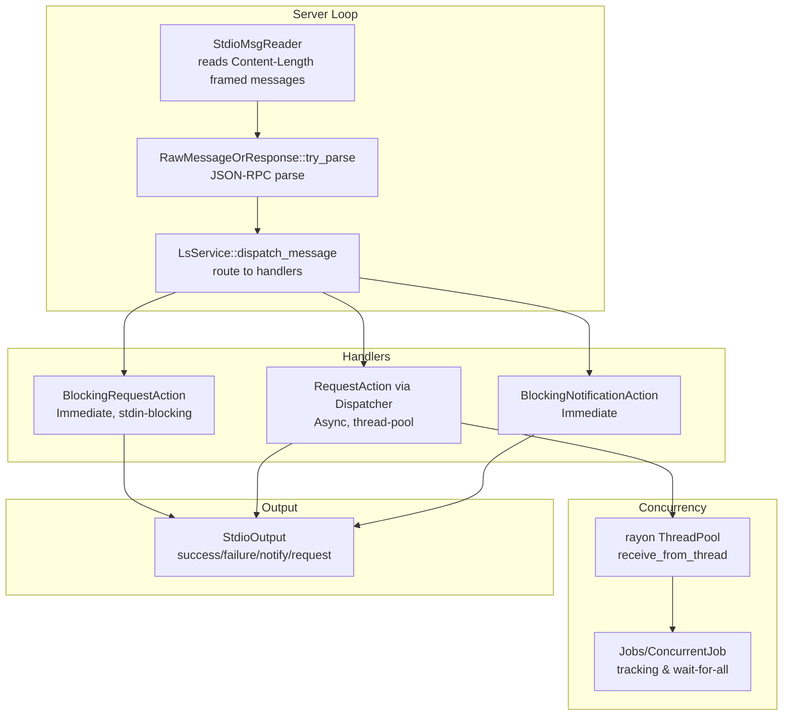
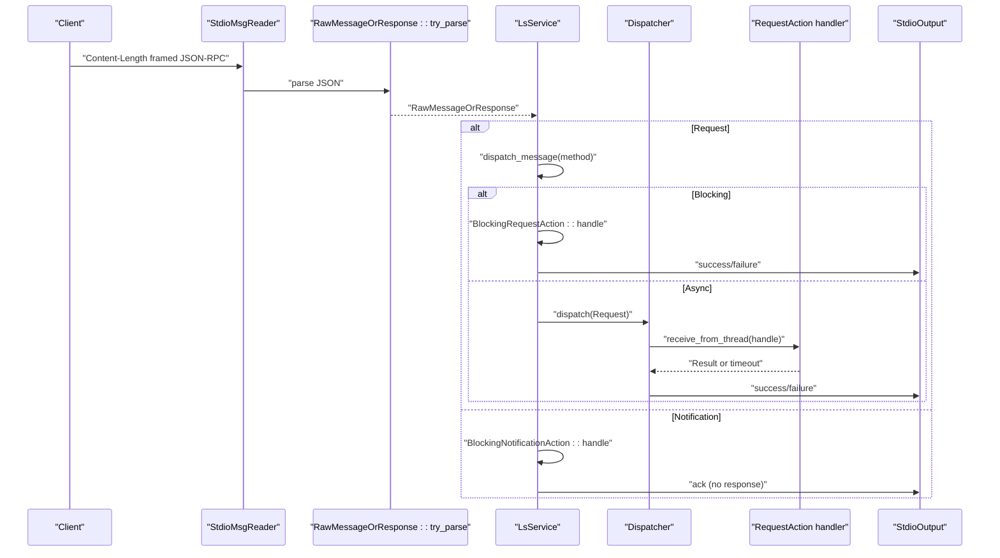
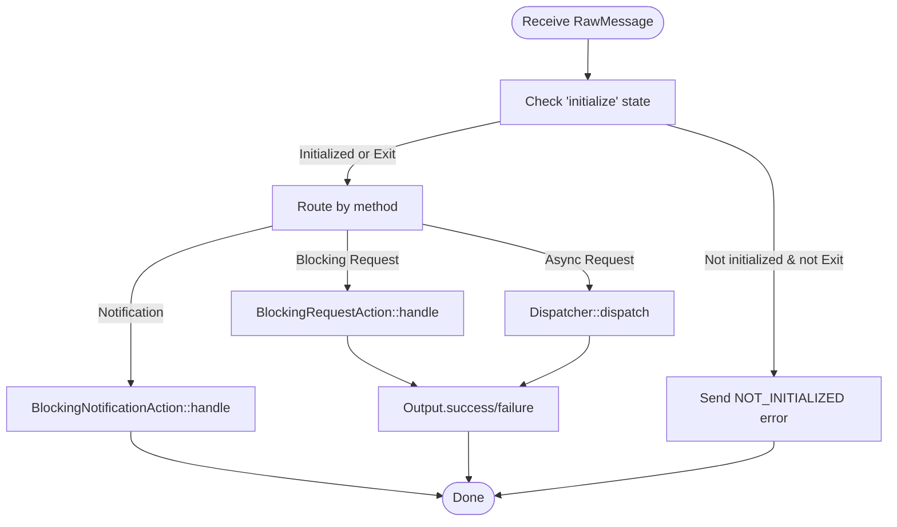
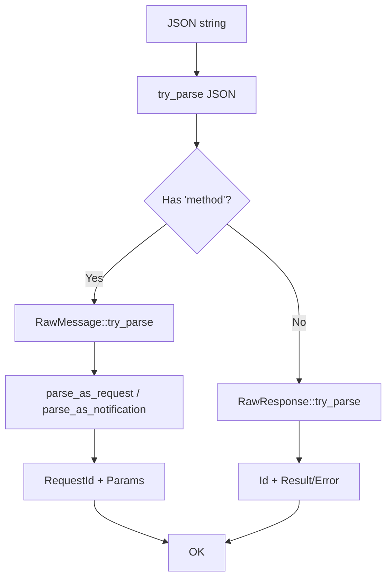
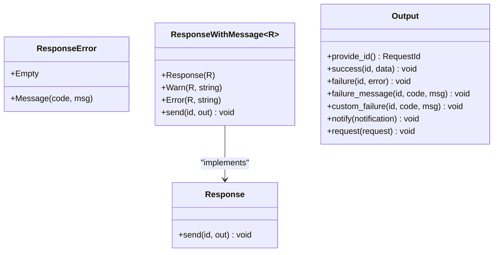
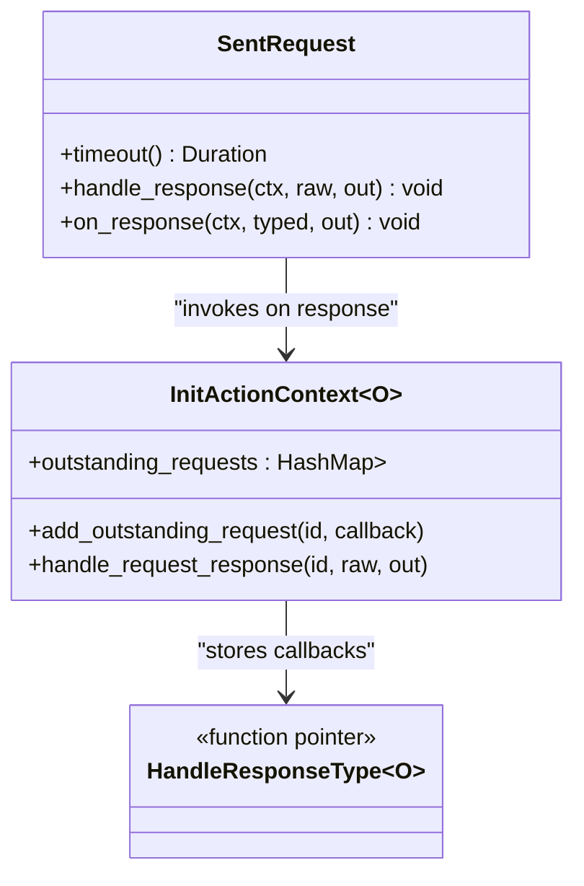
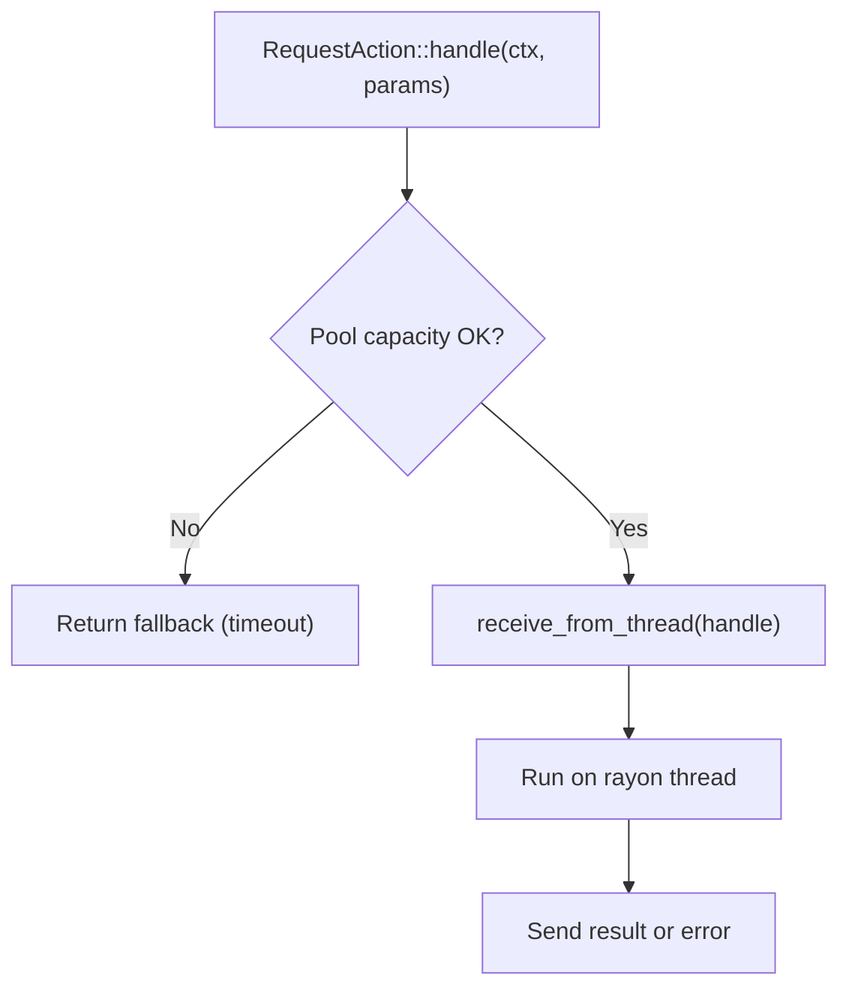
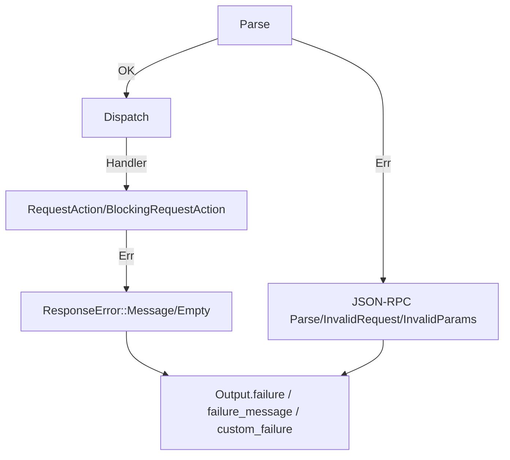
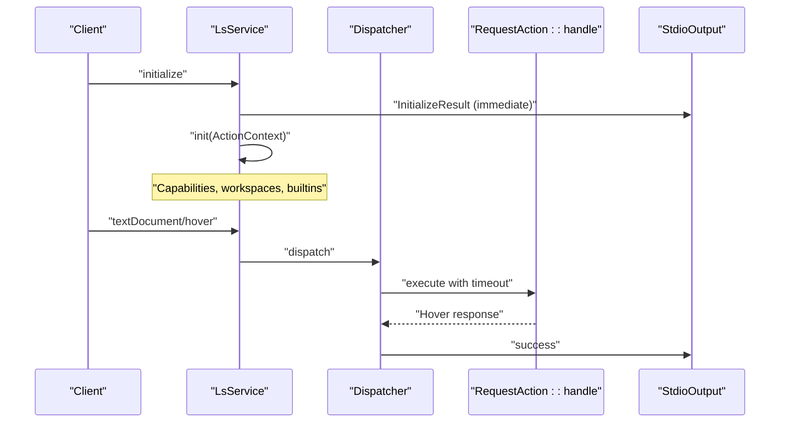
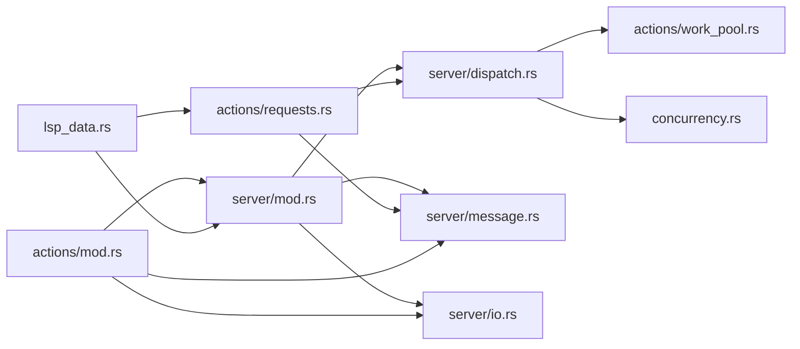

# Request Processing Pipeline

<cite>
**Referenced Files in This Document**
- [src/server/mod.rs](file://src/server/mod.rs)
- [src/server/dispatch.rs](file://src/server/dispatch.rs)
- [src/server/message.rs](file://src/server/message.rs)
- [src/server/io.rs](file://src/server/io.rs)
- [src/actions/requests.rs](file://src/actions/requests.rs)
- [src/actions/mod.rs](file://src/actions/mod.rs)
- [src/actions/work_pool.rs](file://src/actions/work_pool.rs)
- [src/concurrency.rs](file://src/concurrency.rs)
- [src/lsp_data.rs](file://src/lsp_data.rs)
</cite>

## Table of Contents
1. [Introduction](#introduction)
2. [Project Structure](#project-structure)
3. [Core Components](#core-components)
4. [Architecture Overview](#architecture-overview)
5. [Detailed Component Analysis](#detailed-component-analysis)
6. [Dependency Analysis](#dependency-analysis)
7. [Performance Considerations](#performance-considerations)
8. [Troubleshooting Guide](#troubleshooting-guide)
9. [Conclusion](#conclusion)

## Introduction
This document explains the request processing pipeline that handles Language Server Protocol (LSP) requests and responses in the DML Language Server. It covers:
- Request dispatching and routing
- Message parsing and validation
- Response generation and error propagation
- The HandleResponseType system for managing server-initiated client requests
- Request queuing, prioritization, and concurrency
- Timeout handling and cancellation
- Integration with the server’s message handling infrastructure
- Validation against client capabilities
- Coordination between synchronous and asynchronous request processing
- Examples of request lifecycles, performance optimizations, memory management, and debugging approaches

## Project Structure
The request processing pipeline spans several modules:
- Server entrypoint and loop: [src/server/mod.rs](file://src/server/mod.rs)
- Dispatch and concurrency: [src/server/dispatch.rs](file://src/server/dispatch.rs), [src/actions/work_pool.rs](file://src/actions/work_pool.rs), [src/concurrency.rs](file://src/concurrency.rs)
- Message parsing and serialization: [src/server/message.rs](file://src/server/message.rs), [src/server/io.rs](file://src/server/io.rs)
- Request handlers and response types: [src/actions/requests.rs](file://src/actions/requests.rs), [src/lsp_data.rs](file://src/lsp_data.rs)
- Shared context and state: [src/actions/mod.rs](file://src/actions/mod.rs)

**Diagram sources**
- [src/server/mod.rs](file://src/server/mod.rs#L322-L470)
- [src/server/message.rs](file://src/server/message.rs#L366-L520)
- [src/server/dispatch.rs](file://src/server/dispatch.rs#L113-L147)
- [src/actions/work_pool.rs](file://src/actions/work_pool.rs#L53-L103)
- [src/concurrency.rs](file://src/concurrency.rs#L22-L86)
- [src/server/io.rs](file://src/server/io.rs#L112-L189)

**Section sources**
- [src/server/mod.rs](file://src/server/mod.rs#L68-L84)
- [src/server/message.rs](file://src/server/message.rs#L366-L520)
- [src/server/dispatch.rs](file://src/server/dispatch.rs#L113-L147)
- [src/actions/work_pool.rs](file://src/actions/work_pool.rs#L22-L39)
- [src/concurrency.rs](file://src/concurrency.rs#L22-L86)
- [src/server/io.rs](file://src/server/io.rs#L112-L189)

## Core Components
- LsService: orchestrates message reading, dispatching, and state transitions; runs the main server loop.
- Dispatcher: routes asynchronous LSP requests to worker threads with timeouts and fallback responses.
- RequestAction/SentRequest: traits defining async request handling and server-to-client request response handling.
- Output: abstraction for sending responses, notifications, and one-shot requests to the client.
- Message parsing/validation: RawMessage/RawResponse parsing and validation with JSON-RPC semantics.
- ActionContext/InitActionContext: persistent context for initialized state, including outstanding server-initiated requests.

Key responsibilities:
- Parsing: parse incoming JSON-RPC messages and distinguish requests vs notifications.
- Dispatching: route to blocking vs async handlers; enforce initialization gating.
- Concurrency: schedule async work on a thread pool; track jobs; enforce limits.
- Responses: serialize success/error responses; handle server-to-client requests.
- Error propagation: map parsing/validation errors to JSON-RPC error codes; surface user-visible messages.

**Section sources**
- [src/server/mod.rs](file://src/server/mod.rs#L291-L470)
- [src/server/dispatch.rs](file://src/server/dispatch.rs#L113-L206)
- [src/server/message.rs](file://src/server/message.rs#L185-L275)
- [src/server/io.rs](file://src/server/io.rs#L112-L189)
- [src/actions/mod.rs](file://src/actions/mod.rs#L70-L150)

## Architecture Overview
The pipeline is structured around a main loop that reads framed messages from stdin, parses them, and dispatches to either:
- Immediate handlers (blocking requests/notifications)
- Worker-thread handlers (async requests) via a dispatcher

**Diagram sources**
- [src/server/mod.rs](file://src/server/mod.rs#L322-L470)
- [src/server/message.rs](file://src/server/message.rs#L366-L520)
- [src/server/dispatch.rs](file://src/server/dispatch.rs#L113-L147)
- [src/actions/work_pool.rs](file://src/actions/work_pool.rs#L53-L103)
- [src/server/io.rs](file://src/server/io.rs#L112-L189)

## Detailed Component Analysis

### Request Dispatching Mechanism
- LsService::dispatch_message routes messages by method to:
  - BlockingRequestAction (e.g., Initialize, Shutdown)
  - BlockingNotificationAction (e.g., DidOpenTextDocument, DidChangeConfiguration)
  - RequestAction via Dispatcher (e.g., Hover, GotoDefinition, References)
- Initialization gating: before “initialize”, only Exit is allowed; other requests receive a specific error code indicating not initialized.

**Diagram sources**
- [src/server/mod.rs](file://src/server/mod.rs#L500-L598)
- [src/server/mod.rs](file://src/server/mod.rs#L603-L635)

**Section sources**
- [src/server/mod.rs](file://src/server/mod.rs#L500-L598)
- [src/server/mod.rs](file://src/server/mod.rs#L603-L635)

### Message Parsing and Validation
- RawMessageOrResponse::try_parse distinguishes requests vs notifications and validates JSON-RPC fields.
- RawMessage::parse_as_request and parse_as_notification deserialize parameters with strict error handling:
  - InvalidParams for parameter deserialization failures
  - InvalidRequest for missing/invalid id or unsupported param types
- RawResponse::try_parse ensures exactly one of result or error is present.

**Diagram sources**
- [src/server/message.rs](file://src/server/message.rs#L366-L476)
- [src/server/message.rs](file://src/server/message.rs#L318-L396)

**Section sources**
- [src/server/message.rs](file://src/server/message.rs#L318-L396)
- [src/server/message.rs](file://src/server/message.rs#L435-L476)

### Response Generation Workflows
- Response trait: generic send(id, out) for serializing results.
- ResponseError: carries Empty or Message variants for client-facing errors.
- ResponseWithMessage: wraps a response with optional user-visible warnings or errors.
- Output::success/notify/request/custom_failure/failure_message encapsulate JSON-RPC response construction and framing.

**Diagram sources**
- [src/server/message.rs](file://src/server/message.rs#L33-L96)
- [src/server/io.rs](file://src/server/io.rs#L112-L189)

**Section sources**
- [src/server/message.rs](file://src/server/message.rs#L33-L96)
- [src/server/io.rs](file://src/server/io.rs#L112-L189)

### HandleResponseType System
- HandleResponseType is a function pointer type used to process server-initiated client requests’ responses.
- InitActionContext maintains outstanding_requests: a map from RequestId to HandleResponseType<O>, enabling response callbacks for server-originated requests.
- SentRequest defines handle_response and on_response hooks for server-to-client requests.

**Diagram sources**
- [src/actions/mod.rs](file://src/actions/mod.rs#L252-L254)
- [src/actions/mod.rs](file://src/actions/mod.rs#L1257-L1264)
- [src/server/dispatch.rs](file://src/server/dispatch.rs#L169-L206)

**Section sources**
- [src/actions/mod.rs](file://src/actions/mod.rs#L252-L254)
- [src/actions/mod.rs](file://src/actions/mod.rs#L1257-L1264)
- [src/server/dispatch.rs](file://src/server/dispatch.rs#L169-L206)

### Request Queuing and Prioritization
- Dispatcher schedules async requests onto a worker thread pool via receive_from_thread.
- WorkPool enforces:
  - Total concurrency cap (number of threads)
  - Per-kind concurrency cap (MAX_SIMILAR_CONCURRENT_WORK)
  - Warn threshold for long-running tasks
- ConcurrentJob/JobToken tracks outstanding jobs; Jobs.wait_for_all synchronously waits for completion.

**Diagram sources**
- [src/server/dispatch.rs](file://src/server/dispatch.rs#L58-L81)
- [src/actions/work_pool.rs](file://src/actions/work_pool.rs#L53-L103)
- [src/concurrency.rs](file://src/concurrency.rs#L22-L86)

**Section sources**
- [src/server/dispatch.rs](file://src/server/dispatch.rs#L58-L81)
- [src/actions/work_pool.rs](file://src/actions/work_pool.rs#L53-L103)
- [src/concurrency.rs](file://src/concurrency.rs#L22-L86)

### Error Propagation Through the Pipeline
- Parsing errors mapped to JSON-RPC InvalidRequest/InvalidParams/ParseError.
- Handler errors surfaced via ResponseError::Message or ResponseError::Empty; Output converts to JSON-RPC error responses.
- Special-case errors:
  - NOT_INITIALIZED_CODE returned when non-Exit requests arrive before initialize.
  - Custom failure helpers for standardized error formatting.

**Diagram sources**
- [src/server/message.rs](file://src/server/message.rs#L305-L309)
- [src/server/message.rs](file://src/server/message.rs#L51-L56)
- [src/server/io.rs](file://src/server/io.rs#L120-L154)
- [src/server/mod.rs](file://src/server/mod.rs#L510-L524)

**Section sources**
- [src/server/message.rs](file://src/server/message.rs#L305-L309)
- [src/server/message.rs](file://src/server/message.rs#L51-L56)
- [src/server/io.rs](file://src/server/io.rs#L120-L154)
- [src/server/mod.rs](file://src/server/mod.rs#L510-L524)

### Integration with Server Message Handling Infrastructure
- LsService::run spawns a reader thread that continuously reads framed messages, parses them, and forwards to the main loop via a channel.
- The main loop processes ServerToHandle events: client messages, client responses, exit codes, and analysis completion events.
- Output::request enables issuing server-to-client requests (e.g., workspace/configuration) and registers HandleResponseType callbacks.

**Section sources**
- [src/server/mod.rs](file://src/server/mod.rs#L322-L470)
- [src/server/io.rs](file://src/server/io.rs#L180-L188)
- [src/actions/mod.rs](file://src/actions/mod.rs#L1257-L1264)

### Request Validation Against Client Capabilities
- ClientCapabilities extracted from InitializeParams and stored in InitActionContext.
- Feature checks (e.g., workspaceFolders, didChangeConfiguration) influence behavior and messaging.
- Unknown/duplicated/deprecated configuration keys are reported via notifications.

**Section sources**
- [src/lsp_data.rs](file://src/lsp_data.rs#L313-L354)
- [src/server/mod.rs](file://src/server/mod.rs#L207-L289)

### Coordination Between Synchronous and Asynchronous Processing
- BlockingRequestAction and BlockingNotificationAction execute on the main thread, ensuring ordering and preventing race conditions with server state.
- RequestAction executes asynchronously on worker threads; timeouts are enforced before and during execution.
- ConcurrentJob/JobToken ensures completion signaling; Jobs.wait_for_all supports deterministic teardown.

**Section sources**
- [src/server/mod.rs](file://src/server/mod.rs#L500-L598)
- [src/server/dispatch.rs](file://src/server/dispatch.rs#L151-L168)
- [src/concurrency.rs](file://src/concurrency.rs#L22-L86)

### Examples of Request Lifecycle
- Initialize:
  - Client sends initialize; server responds with InitializeResult immediately, then initializes context and capabilities.
  - Unknown/deprecated/duplicated config keys are reported via notifications.
- Hover:
  - Async request parsed and dispatched; handler resolves position, waits for device state, constructs tooltip, and returns a response with optional limitations.
- GotoDefinition/References:
  - Similar async flow; handler resolves symbol/reference, aggregates locations, and returns a response with optional limitations.

**Diagram sources**
- [src/server/mod.rs](file://src/server/mod.rs#L207-L289)
- [src/actions/requests.rs](file://src/actions/requests.rs#L460-L480)
- [src/server/dispatch.rs](file://src/server/dispatch.rs#L58-L81)

**Section sources**
- [src/server/mod.rs](file://src/server/mod.rs#L207-L289)
- [src/actions/requests.rs](file://src/actions/requests.rs#L460-L480)
- [src/actions/requests.rs](file://src/actions/requests.rs#L604-L660)

### Timeout Handling and Cancellation
- DEFAULT_REQUEST_TIMEOUT governs async request timeouts.
- Before starting work, the worker checks elapsed time against timeout and returns fallback_response if expired.
- receive_from_thread enforces global and per-kind concurrency caps; if capacity is exceeded, the receiver is returned disconnected (immediate failure).
- Long-running tasks exceeding WARN_TASK_DURATION log warnings.

**Section sources**
- [src/server/dispatch.rs](file://src/server/dispatch.rs#L22-L29)
- [src/server/dispatch.rs](file://src/server/dispatch.rs#L63-L81)
- [src/actions/work_pool.rs](file://src/actions/work_pool.rs#L60-L101)

### Memory Management for Request Processing
- Minimal allocations in hot paths:
  - Request/Notification structures carry only id, params, and timing metadata.
  - RawMessage/RawResponse reuse serde_json::Value to avoid intermediate copies.
- Channels and Arc<Mutex<...>> protect shared state; avoid cloning large structures unnecessarily.
- Work descriptions and thread pool reuse minimize overhead.

**Section sources**
- [src/server/message.rs](file://src/server/message.rs#L185-L201)
- [src/actions/work_pool.rs](file://src/actions/work_pool.rs#L22-L39)

### Debugging Approaches for Request-Related Issues
- Logging:
  - Trace/Debug/Info/Warn/Error levels used throughout parsing, dispatching, and handler execution.
  - Raw message and response payloads logged for inspection.
- Output helpers:
  - failure_message/custom_failure for consistent error reporting.
  - notify for user-visible messages.
- Panic safety:
  - receive_from_thread uses catch_unwind to avoid panics propagating into channels.

**Section sources**
- [src/server/io.rs](file://src/server/io.rs#L120-L154)
- [src/actions/work_pool.rs](file://src/actions/work_pool.rs#L80-L101)

## Dependency Analysis

**Diagram sources**
- [src/server/mod.rs](file://src/server/mod.rs#L16-L28)
- [src/server/dispatch.rs](file://src/server/dispatch.rs#L1-L20)
- [src/actions/requests.rs](file://src/actions/requests.rs#L22-L56)
- [src/actions/mod.rs](file://src/actions/mod.rs#L34-L42)
- [src/lsp_data.rs](file://src/lsp_data.rs#L9-L12)

**Section sources**
- [src/server/mod.rs](file://src/server/mod.rs#L16-L28)
- [src/server/dispatch.rs](file://src/server/dispatch.rs#L1-L20)
- [src/actions/requests.rs](file://src/actions/requests.rs#L22-L56)
- [src/actions/mod.rs](file://src/actions/mod.rs#L34-L42)
- [src/lsp_data.rs](file://src/lsp_data.rs#L9-L12)

## Performance Considerations
- Prefer async handlers for heavy computations; keep the main thread responsive.
- Tune DEFAULT_REQUEST_TIMEOUT and MAX_SIMILAR_CONCURRENT_WORK to balance responsiveness and throughput.
- Use wait_for_state judiciously to avoid unnecessary blocking; leverage device context filtering to limit analysis scope.
- Avoid cloning large data structures; use Arc/Mutex where appropriate.
- Monitor long-running tasks and adjust WARN_TASK_DURATION thresholds.

## Troubleshooting Guide
- Parse errors:
  - Verify Content-Length framing and UTF-8 encoding.
  - Inspect InvalidRequest/InvalidParams messages for malformed ids or unsupported param types.
- Dispatch errors:
  - Ensure method names match LSPRequest::METHOD constants.
  - Confirm initialization before sending non-Exit requests.
- Timeout issues:
  - Increase timeout for heavy requests (e.g., GotoImplementation).
  - Reduce workload or increase thread pool size.
- Concurrency bottlenecks:
  - Check outstanding_requests and ensure callbacks are registered for server-initiated requests.
  - Use Jobs.wait_for_all to synchronize teardown.

**Section sources**
- [src/server/message.rs](file://src/server/message.rs#L366-L476)
- [src/server/mod.rs](file://src/server/mod.rs#L603-L635)
- [src/server/dispatch.rs](file://src/server/dispatch.rs#L151-L168)
- [src/actions/mod.rs](file://src/actions/mod.rs#L1257-L1264)

## Conclusion
The DML Language Server implements a robust, extensible request processing pipeline:
- Clear separation between immediate and asynchronous handlers
- Strong JSON-RPC parsing/validation and error mapping
- Concurrency controls with explicit timeouts and job tracking
- A flexible HandleResponseType system for server-to-client request/response coordination
- Practical mechanisms for debugging and performance tuning

This design ensures reliable, predictable behavior across diverse LSP workloads while maintaining a clean, maintainable architecture.