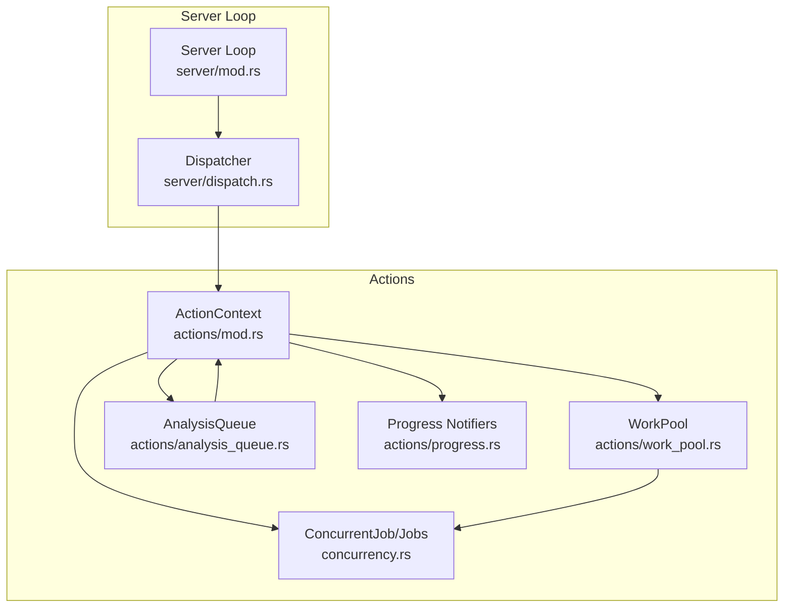
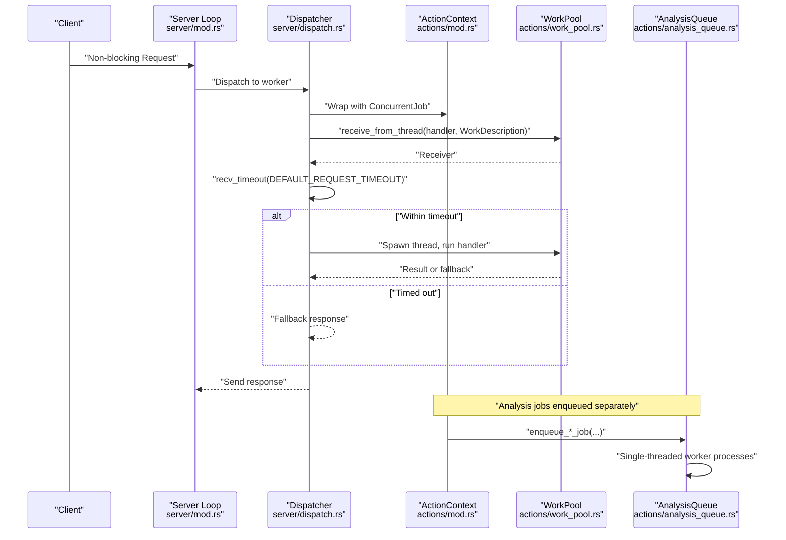
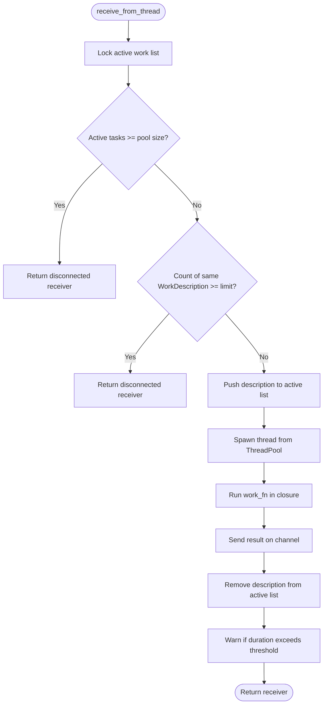
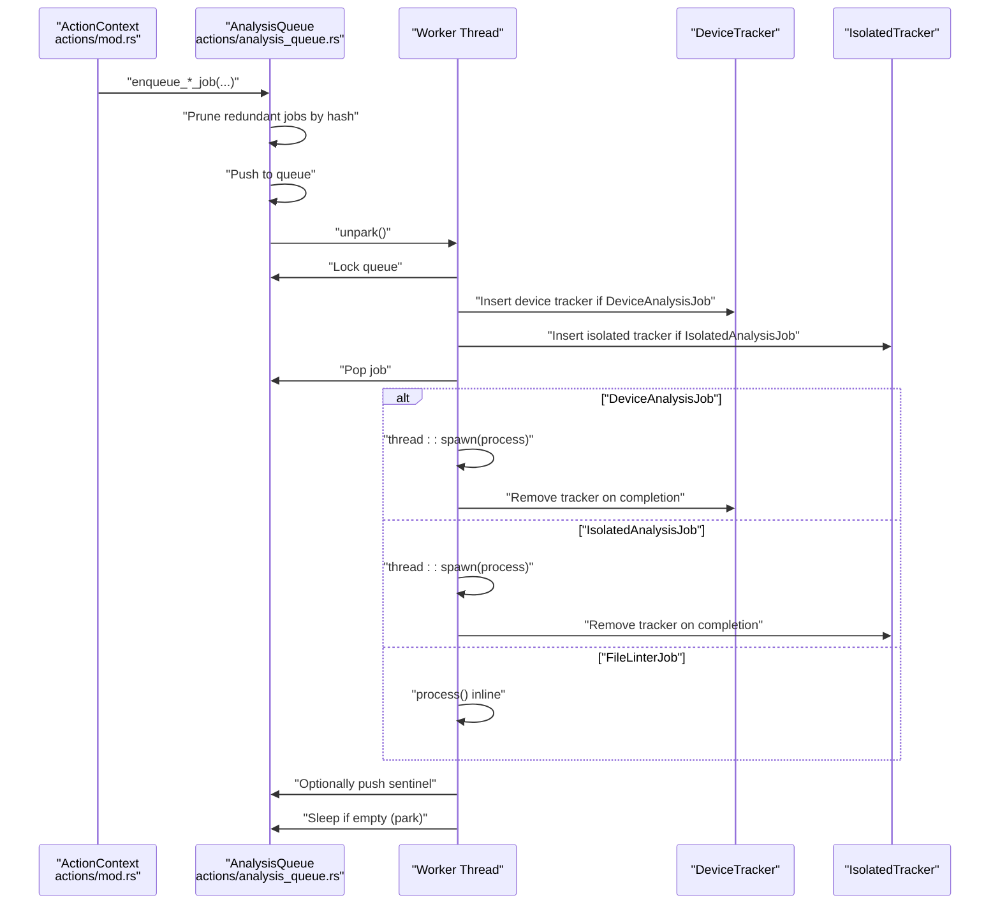
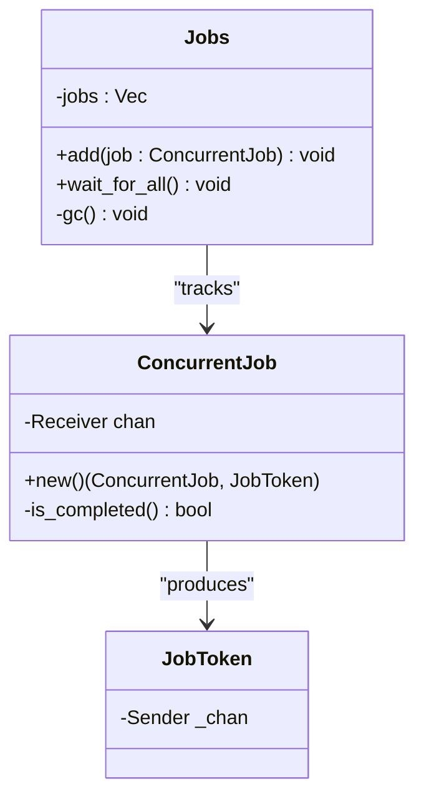
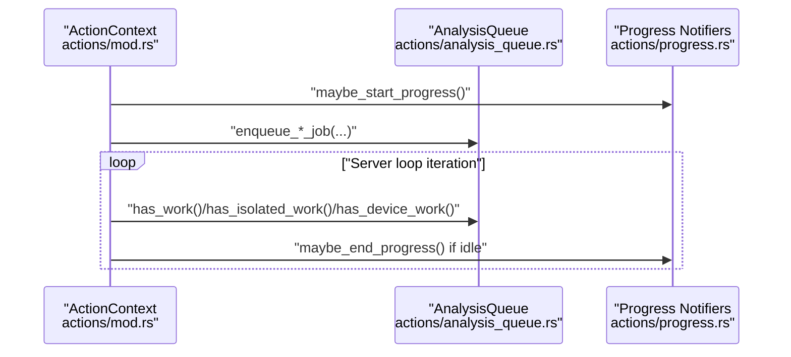
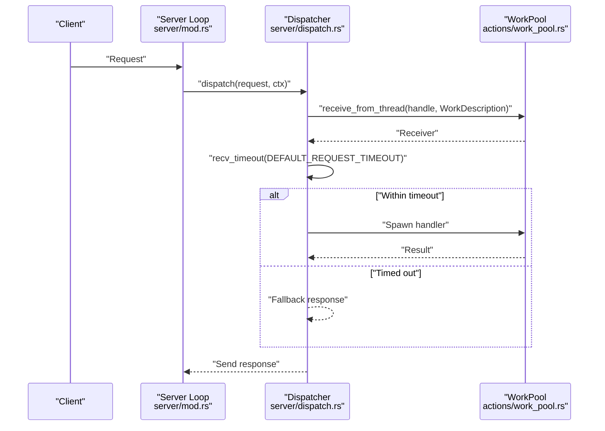
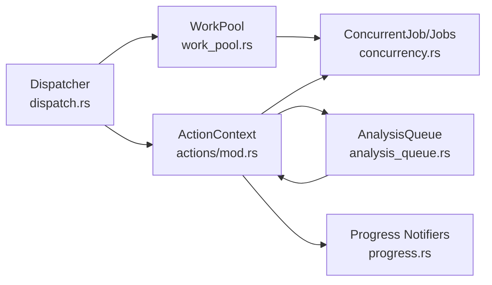

# Work Pool Coordination

<cite>
**Referenced Files in This Document**
- [work_pool.rs](file://src/actions/work_pool.rs)
- [analysis_queue.rs](file://src/actions/analysis_queue.rs)
- [concurrency.rs](file://src/concurrency.rs)
- [mod.rs](file://src/actions/mod.rs)
- [dispatch.rs](file://src/server/dispatch.rs)
- [progress.rs](file://src/actions/progress.rs)
- [server/mod.rs](file://src/server/mod.rs)
</cite>

## Table of Contents
1. [Introduction](#introduction)
2. [Project Structure](#project-structure)
3. [Core Components](#core-components)
4. [Architecture Overview](#architecture-overview)
5. [Detailed Component Analysis](#detailed-component-analysis)
6. [Dependency Analysis](#dependency-analysis)
7. [Performance Considerations](#performance-considerations)
8. [Troubleshooting Guide](#troubleshooting-guide)
9. [Conclusion](#conclusion)

## Introduction
This document explains the work pool coordination system that manages parallel analysis tasks and resource allocation in the DML language server. It covers concurrent job management, work queue prioritization, resource throttling, work pool sizing strategies, load balancing across analysis operations, integration with the analysis queue, progress tracking, cancellation mechanisms for long-running tasks, and practical guidance for performance optimization and debugging.

## Project Structure
The work pool coordination spans several modules:
- Work pool and thread scheduling: [work_pool.rs](file://src/actions/work_pool.rs)
- Analysis queue and worker thread: [analysis_queue.rs](file://src/actions/analysis_queue.rs)
- Concurrency primitives and job lifecycle: [concurrency.rs](file://src/concurrency.rs)
- Action context and orchestration: [mod.rs](file://src/actions/mod.rs)
- Request dispatch and timeouts: [dispatch.rs](file://src/server/dispatch.rs)
- Progress notifications: [progress.rs](file://src/actions/progress.rs)
- Server loop and lifecycle: [server/mod.rs](file://src/server/mod.rs)

**Diagram sources**
- [server/mod.rs](file://src/server/mod.rs#L322-L470)
- [dispatch.rs](file://src/server/dispatch.rs#L113-L147)
- [mod.rs](file://src/actions/mod.rs#L336-L370)
- [concurrency.rs](file://src/concurrency.rs#L31-L64)
- [work_pool.rs](file://src/actions/work_pool.rs#L22-L39)
- [analysis_queue.rs](file://src/actions/analysis_queue.rs#L38-L67)
- [progress.rs](file://src/actions/progress.rs#L48-L81)

**Section sources**
- [work_pool.rs](file://src/actions/work_pool.rs#L1-L104)
- [analysis_queue.rs](file://src/actions/analysis_queue.rs#L1-L337)
- [concurrency.rs](file://src/concurrency.rs#L1-L103)
- [mod.rs](file://src/actions/mod.rs#L71-L130)
- [dispatch.rs](file://src/server/dispatch.rs#L1-L206)
- [progress.rs](file://src/actions/progress.rs#L1-L190)
- [server/mod.rs](file://src/server/mod.rs#L67-L84)

## Core Components
- WorkPool: A global thread pool that executes work items with capacity checks and per-type throttling. It tracks active work types and enforces limits to prevent overload.
- AnalysisQueue: A single-threaded worker that serializes and executes analysis jobs (isolated, device, linter) while tracking in-flight work and pruning redundant entries.
- ConcurrentJob/Jobs: Lightweight concurrency handles that track outstanding jobs and enable deterministic waits and cleanup.
- ActionContext: Central runtime context that coordinates analysis, progress, waits, and job lifecycle across the server.
- Dispatcher: Routes non-blocking requests to a worker thread and integrates with the work pool for timeout-aware execution.
- Progress Notifiers: Client-visible progress reporting during analysis.

**Section sources**
- [work_pool.rs](file://src/actions/work_pool.rs#L22-L39)
- [analysis_queue.rs](file://src/actions/analysis_queue.rs#L38-L67)
- [concurrency.rs](file://src/concurrency.rs#L22-L77)
- [mod.rs](file://src/actions/mod.rs#L224-L266)
- [dispatch.rs](file://src/server/dispatch.rs#L113-L147)
- [progress.rs](file://src/actions/progress.rs#L48-L81)

## Architecture Overview
The system separates concerns:
- Request handling is offloaded to a dedicated worker thread with timeouts.
- Long-running analysis is queued and executed by a single-threaded worker to avoid contention and simplify dependency management.
- Work pool threads execute request handlers and other short-to-medium tasks with capacity and type-based throttling.
- Progress and wait mechanisms coordinate user feedback and synchronization across analysis states.

**Diagram sources**
- [dispatch.rs](file://src/server/dispatch.rs#L58-L81)
- [work_pool.rs](file://src/actions/work_pool.rs#L53-L103)
- [mod.rs](file://src/actions/mod.rs#L781-L804)
- [analysis_queue.rs](file://src/actions/analysis_queue.rs#L165-L236)

## Detailed Component Analysis

### WorkPool: Capacity Control and Type Throttling
- Global thread pool: Built with a fixed number of threads and named worker threads.
- Capacity enforcement: Prevents starting new work when the number of active tasks equals the pool size.
- Per-type throttling: Limits simultaneous instances of the same work type to a small constant to avoid saturation by repeated heavy tasks.
- Duration warnings: Logs long-running tasks exceeding a configurable threshold.
- Panic safety: Wraps work in catch-and-ignore to avoid panics propagating into channels.

**Diagram sources**
- [work_pool.rs](file://src/actions/work_pool.rs#L53-L103)

**Section sources**
- [work_pool.rs](file://src/actions/work_pool.rs#L22-L39)
- [work_pool.rs](file://src/actions/work_pool.rs#L41-L45)
- [work_pool.rs](file://src/actions/work_pool.rs#L53-L103)

### AnalysisQueue: Single-Threaded Execution and Redundancy Pruning
- Worker thread: Processes a queue of analysis jobs sequentially, waking on enqueue.
- Redundancy pruning: Removes jobs with identical hashes before enqueueing to avoid duplicate work.
- In-flight tracking: Maintains trackers for device and isolated jobs to prevent double-execution and enable accurate work detection.
- Job types:
  - IsolatedAnalysisJob: Parses and analyzes a single file snapshot.
  - DeviceAnalysisJob: Builds device-level analysis from isolated and dependency snapshots.
  - LinterJob: Runs linting against an isolated analysis.
- Sentinel mechanism: Ensures the worker thread does not starve by inserting a sentinel after certain job types.

**Diagram sources**
- [analysis_queue.rs](file://src/actions/analysis_queue.rs#L150-L163)
- [analysis_queue.rs](file://src/actions/analysis_queue.rs#L165-L236)
- [analysis_queue.rs](file://src/actions/analysis_queue.rs#L415-L442)
- [analysis_queue.rs](file://src/actions/analysis_queue.rs#L517-L538)
- [analysis_queue.rs](file://src/actions/analysis_queue.rs#L583-L597)

**Section sources**
- [analysis_queue.rs](file://src/actions/analysis_queue.rs#L38-L67)
- [analysis_queue.rs](file://src/actions/analysis_queue.rs#L150-L163)
- [analysis_queue.rs](file://src/actions/analysis_queue.rs#L165-L236)
- [analysis_queue.rs](file://src/actions/analysis_queue.rs#L415-L442)
- [analysis_queue.rs](file://src/actions/analysis_queue.rs#L517-L538)
- [analysis_queue.rs](file://src/actions/analysis_queue.rs#L583-L597)

### ConcurrentJob and Jobs: Deterministic Lifecycle Management
- ConcurrentJob: A handle backed by a zero-capacity channel; completion is detected by channel closure.
- JobToken: The producer-side token; dropping it signals completion.
- Jobs: A collection of ConcurrentJob handles that supports garbage collection and waiting for all jobs to finish.
- Integration: Every spawned concurrent activity (including analysis jobs) is wrapped in a ConcurrentJob to maintain visibility and determinism.

**Diagram sources**
- [concurrency.rs](file://src/concurrency.rs#L22-L77)
- [concurrency.rs](file://src/concurrency.rs#L31-L64)

**Section sources**
- [concurrency.rs](file://src/concurrency.rs#L22-L77)
- [concurrency.rs](file://src/concurrency.rs#L31-L64)

### ActionContext: Orchestration and Progress
- AnalysisQueue integration: Holds an Arc<AnalysisQueue> and exposes enqueue APIs for isolated/device/linter jobs.
- Progress tracking: Starts and ends progress notifications based on queue state.
- State waits: Implements wait-for-state logic that checks queue and analysis state to satisfy coverage and progress kinds.
- Job lifecycle: Adds ConcurrentJob handles and waits for them during shutdown.

**Diagram sources**
- [mod.rs](file://src/actions/mod.rs#L761-L788)
- [mod.rs](file://src/actions/mod.rs#L790-L804)
- [mod.rs](file://src/actions/mod.rs#L698-L726)
- [analysis_queue.rs](file://src/actions/analysis_queue.rs#L238-L276)
- [progress.rs](file://src/actions/progress.rs#L48-L81)

**Section sources**
- [mod.rs](file://src/actions/mod.rs#L224-L266)
- [mod.rs](file://src/actions/mod.rs#L698-L726)
- [mod.rs](file://src/actions/mod.rs#L761-L804)
- [mod.rs](file://src/actions/mod.rs#L1094-L1187)

### Dispatcher and Request Timeouts
- Non-blocking requests are dispatched to a worker thread.
- Each request handler runs inside the work pool with a per-request timeout.
- The dispatcher checks the request age before starting work to avoid unnecessary computation.

**Diagram sources**
- [dispatch.rs](file://src/server/dispatch.rs#L58-L81)
- [dispatch.rs](file://src/server/dispatch.rs#L113-L147)
- [work_pool.rs](file://src/actions/work_pool.rs#L53-L103)

**Section sources**
- [dispatch.rs](file://src/server/dispatch.rs#L58-L81)
- [dispatch.rs](file://src/server/dispatch.rs#L113-L147)

## Dependency Analysis
- WorkPool depends on:
  - Global thread pool builder and a shared work list guarded by a mutex.
  - WorkDescription for categorizing tasks.
- AnalysisQueue depends on:
  - Crossbeam channels for inter-thread communication.
  - In-flight trackers for device and isolated jobs.
  - ActionContext for enqueueing and progress signaling.
- ActionContext depends on:
  - AnalysisQueue for job execution.
  - Jobs for lifecycle management.
  - Progress notifiers for user feedback.
- Dispatcher depends on:
  - WorkPool for timeout-aware execution.
  - ActionContext for wrapping jobs.

**Diagram sources**
- [work_pool.rs](file://src/actions/work_pool.rs#L22-L39)
- [concurrency.rs](file://src/concurrency.rs#L31-L64)
- [mod.rs](file://src/actions/mod.rs#L224-L266)
- [analysis_queue.rs](file://src/actions/analysis_queue.rs#L38-L67)
- [dispatch.rs](file://src/server/dispatch.rs#L113-L147)

**Section sources**
- [work_pool.rs](file://src/actions/work_pool.rs#L22-L39)
- [analysis_queue.rs](file://src/actions/analysis_queue.rs#L38-L67)
- [concurrency.rs](file://src/concurrency.rs#L31-L64)
- [mod.rs](file://src/actions/mod.rs#L224-L266)
- [dispatch.rs](file://src/server/dispatch.rs#L113-L147)

## Performance Considerations
- Work pool sizing:
  - The pool size is a fixed constant. Increasing it may improve throughput for CPU-bound tasks but risks oversubscription and context switching overhead. Tune based on CPU cores and typical workload mix.
- Per-type throttling:
  - Limiting simultaneous instances of the same work type prevents hot-spot saturation and improves fairness across job categories.
- Queue serialization:
  - The AnalysisQueue’s single-threaded worker avoids race conditions and simplifies dependency resolution, but may serialize dependent jobs. Consider batching or prioritization if latency-sensitive.
- Timeout strategy:
  - Request timeouts prevent long-running tasks from blocking the main loop and reduce wasted work on stale requests.
- Progress and waits:
  - Use wait-for-state logic to avoid polling and to coordinate user-visible progress efficiently.

[No sources needed since this section provides general guidance]

## Troubleshooting Guide
- Deadlocks:
  - The AnalysisQueue uses a single-threaded worker and explicit trackers; deadlocks are unlikely. Verify that trackers are removed on completion and that jobs do not block indefinitely.
- Overload symptoms:
  - Excessive warnings about tasks exceeding the duration threshold indicate long-running work. Profile the workload and adjust pool size or job composition.
- Stalled progress:
  - If progress never ends, check queue state and ensure that job completion notifications are processed by the server loop.
- Orphaned jobs:
  - ConcurrentJob panics on drop if not completed. Ensure all jobs are properly wrapped and awaited during shutdown.

**Section sources**
- [work_pool.rs](file://src/actions/work_pool.rs#L95-L101)
- [server/mod.rs](file://src/server/mod.rs#L95-L106)
- [concurrency.rs](file://src/concurrency.rs#L79-L86)

## Conclusion
The work pool coordination system combines a global thread pool with a single-threaded analysis queue to balance parallelism and correctness. Capacity and type-based throttling, timeout-aware request handling, and robust job lifecycle management provide predictable performance and user experience. Integrations with progress tracking and state waits enable responsive feedback and synchronization across analysis operations.