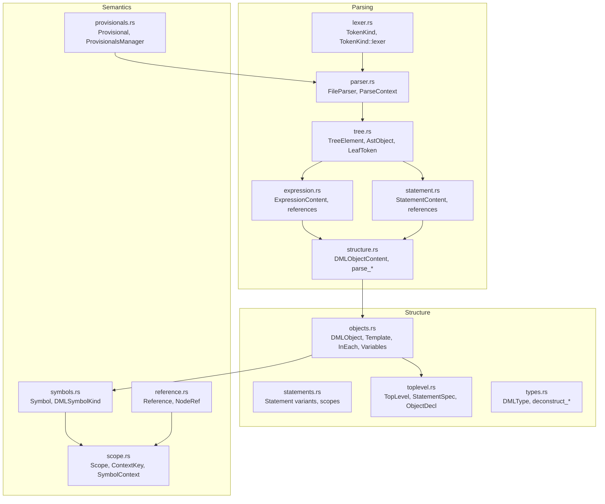
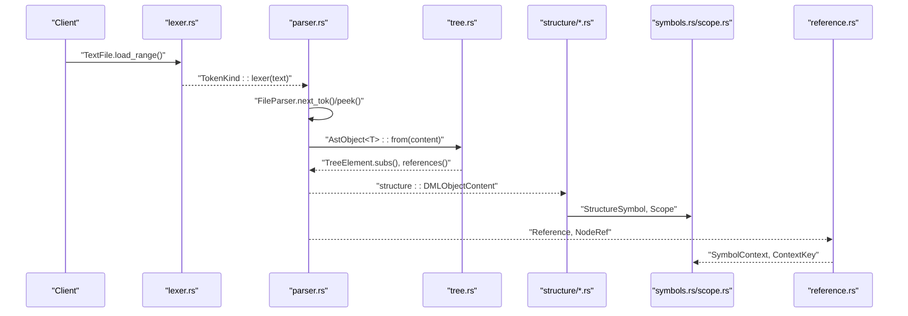
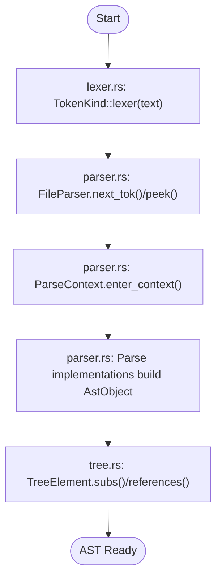
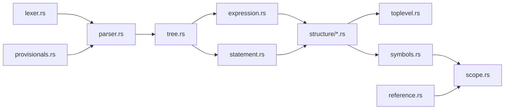

# Analysis Engine

<cite>
**Referenced Files in This Document**
- [mod.rs](file://src/analysis/mod.rs)
- [parsing/mod.rs](file://src/analysis/parsing/mod.rs)
- [parsing/parser.rs](file://src/analysis/parsing/parser.rs)
- [parsing/lexer.rs](file://src/analysis/parsing/lexer.rs)
- [parsing/tree.rs](file://src/analysis/parsing/tree.rs)
- [parsing/expression.rs](file://src/analysis/parsing/expression.rs)
- [parsing/statement.rs](file://src/analysis/parsing/statement.rs)
- [parsing/structure.rs](file://src/analysis/parsing/structure.rs)
- [structure/mod.rs](file://src/analysis/structure/mod.rs)
- [structure/objects.rs](file://src/analysis/structure/objects.rs)
- [structure/statements.rs](file://src/analysis/structure/statements.rs)
- [structure/toplevel.rs](file://src/analysis/structure/toplevel.rs)
- [structure/types.rs](file://src/analysis/structure/types.rs)
- [symbols.rs](file://src/analysis/symbols.rs)
- [scope.rs](file://src/analysis/scope.rs)
- [reference.rs](file://src/analysis/reference.rs)
- [provisionals.rs](file://src/analysis/provisionals.rs)
</cite>

## Table of Contents
1. [Introduction](#introduction)
2. [Project Structure](#project-structure)
3. [Core Components](#core-components)
4. [Architecture Overview](#architecture-overview)
5. [Detailed Component Analysis](#detailed-component-analysis)
6. [Dependency Analysis](#dependency-analysis)
7. [Performance Considerations](#performance-considerations)
8. [Troubleshooting Guide](#troubleshooting-guide)
9. [Conclusion](#conclusion)

## Introduction
This document describes the DML analysis engine subsystem, focusing on the multi-stage parsing architecture, syntax tree construction, and the semantic analysis pipeline. It explains how lexical analysis produces tokens, how recursive descent parsing recovers from errors, and how the AST is built and traversed. It documents the semantic phase covering symbol table construction, type handling, scope resolution, and cross-document reference tracking. It also includes concrete examples from the codebase, performance considerations for large codebases, and extensibility points for adding new analysis features.

## Project Structure
The analysis engine is organized into cohesive modules:
- Parsing: lexical analysis, recursive descent parsing, AST construction, and token collection
- Structure: semantic representation derived from the AST
- Symbols and Scopes: symbol table, scope contexts, and context-aware lookups
- References: reference modeling and tracking across files
- Provisionals: feature flags for experimental or provisional language features

**Diagram sources**
- [parsing/mod.rs](file://src/analysis/parsing/mod.rs#L1-L16)
- [parsing/lexer.rs](file://src/analysis/parsing/lexer.rs#L98-L426)
- [parsing/parser.rs](file://src/analysis/parsing/parser.rs#L322-L480)
- [parsing/tree.rs](file://src/analysis/parsing/tree.rs#L33-L120)
- [parsing/expression.rs](file://src/analysis/parsing/expression.rs#L700-L790)
- [parsing/statement.rs](file://src/analysis/parsing/statement.rs#L1-L80)
- [parsing/structure.rs](file://src/analysis/parsing/structure.rs#L1-L80)
- [structure/objects.rs](file://src/analysis/structure/objects.rs#L646-L726)
- [structure/statements.rs](file://src/analysis/structure/statements.rs#L1-L80)
- [structure/toplevel.rs](file://src/analysis/structure/toplevel.rs#L546-L625)
- [structure/types.rs](file://src/analysis/structure/types.rs#L1-L90)
- [symbols.rs](file://src/analysis/symbols.rs#L18-L192)
- [scope.rs](file://src/analysis/scope.rs#L13-L90)
- [reference.rs](file://src/analysis/reference.rs#L8-L95)
- [provisionals.rs](file://src/analysis/provisionals.rs#L13-L32)

**Section sources**
- [parsing/mod.rs](file://src/analysis/parsing/mod.rs#L1-L16)
- [structure/mod.rs](file://src/analysis/structure/mod.rs#L1-L8)

## Core Components
- Lexical analysis: TokenKind enumeration and logos-based lexer produce tokens with precise ranges and positions.
- Recursive descent parsing: FileParser and ParseContext manage lookahead, error recovery, and context-aware parsing.
- AST construction: TreeElement trait and AstObject encapsulate nodes, missing content, and leaf tokens.
- Semantic structure: Structure modules convert AST to semantic forms (objects, statements, toplevel).
- Symbol table and scopes: Symbol and SymbolContext define symbol kinds, locations, and hierarchical contexts.
- References: NodeRef and Reference model cross-document references and collect them during traversal.
- Provisionals: ProvisionalsManager tracks feature flags for experimental constructs.

**Section sources**
- [parsing/lexer.rs](file://src/analysis/parsing/lexer.rs#L98-L426)
- [parsing/parser.rs](file://src/analysis/parsing/parser.rs#L48-L320)
- [parsing/tree.rs](file://src/analysis/parsing/tree.rs#L33-L120)
- [structure/objects.rs](file://src/analysis/structure/objects.rs#L646-L726)
- [structure/toplevel.rs](file://src/analysis/structure/toplevel.rs#L546-L625)
- [symbols.rs](file://src/analysis/symbols.rs#L18-L192)
- [scope.rs](file://src/analysis/scope.rs#L13-L90)
- [reference.rs](file://src/analysis/reference.rs#L8-L95)
- [provisionals.rs](file://src/analysis/provisionals.rs#L13-L32)

## Architecture Overview
The analysis engine follows a layered pipeline:
1. Lexical analysis: TokenKind recognizes keywords, operators, literals, comments, and C blocks.
2. Parsing: FileParser reads tokens, ParseContext controls lookahead and recovery, and Parse implementations build AST nodes.
3. AST traversal: TreeElement.walk and TreeElement.references collect diagnostics and references.
4. Semantic conversion: Structure modules transform AST into semantic objects and statements.
5. Symbol and scope building: Symbols and scopes aggregate definitions and enable context-aware lookups.
6. Cross-file reference tracking: References are normalized and cached for fast lookups.

**Diagram sources**
- [parsing/lexer.rs](file://src/analysis/parsing/lexer.rs#L98-L426)
- [parsing/parser.rs](file://src/analysis/parsing/parser.rs#L322-L480)
- [parsing/tree.rs](file://src/analysis/parsing/tree.rs#L33-L120)
- [structure/objects.rs](file://src/analysis/structure/objects.rs#L646-L726)
- [structure/statements.rs](file://src/analysis/structure/statements.rs#L1-L80)
- [structure/toplevel.rs](file://src/analysis/structure/toplevel.rs#L546-L625)
- [symbols.rs](file://src/analysis/symbols.rs#L18-L192)
- [scope.rs](file://src/analysis/scope.rs#L13-L90)
- [reference.rs](file://src/analysis/reference.rs#L8-L95)

## Detailed Component Analysis

### Multi-stage Parsing Architecture
- Lexical analysis: TokenKind enumerates all terminal tokens and uses logos to recognize identifiers, keywords, operators, literals, comments, and C blocks. The lexer advances through tokens while tracking line/column positions and skipping whitespace/comments.
- Recursive descent parsing: FileParser maintains a buffered next token and supports peeking, consuming, and skipping. ParseContext manages nested contexts with understanders to recover from unexpected tokens. The handle_missing macro converts missing tokens into MissingContent nodes.
- AST construction: TreeElement trait provides range containment, subtree iteration, reference collection, and missing content reporting. AstObject<T> boxes content and preserves range metadata.

**Diagram sources**
- [parsing/lexer.rs](file://src/analysis/parsing/lexer.rs#L98-L426)
- [parsing/parser.rs](file://src/analysis/parsing/parser.rs#L322-L480)
- [parsing/tree.rs](file://src/analysis/parsing/tree.rs#L33-L120)

**Section sources**
- [parsing/lexer.rs](file://src/analysis/parsing/lexer.rs#L98-L426)
- [parsing/parser.rs](file://src/analysis/parsing/parser.rs#L48-L320)
- [parsing/tree.rs](file://src/analysis/parsing/tree.rs#L33-L120)

### Syntax Tree Construction and Traversal
- TreeElement defines range, containment, subtree traversal, missing content reporting, and default reference collection. Implementations for tuples, vectors, and optional items unify traversal patterns.
- ExpressionContent and StatementContent implement TreeElement and define how references are collected (e.g., member literals, function calls, identifiers).
- MissingToken and MissingContent represent missing terminals and are surfaced via report_missing.

Concrete examples from the codebase:
- ExpressionContent references collection via MaybeIsNodeRef and Reference::from_noderef.
- StatementContent references for foreach identifiers and variable declarations.
- TreeElement.post_parse_sanity_walk aggregates diagnostics across subtrees.

**Section sources**
- [parsing/tree.rs](file://src/analysis/parsing/tree.rs#L33-L120)
- [parsing/expression.rs](file://src/analysis/parsing/expression.rs#L116-L140)
- [parsing/expression.rs](file://src/analysis/parsing/expression.rs#L768-L788)
- [parsing/statement.rs](file://src/analysis/parsing/statement.rs#L36-L80)

### Semantic Analysis Pipeline
- Structure conversion: structure::DMLObjectContent and related modules convert AST nodes into semantic objects (Template, Method, Variable, etc.), collecting references and validating constraints.
- Symbol table: Symbol stores definitions, declarations, references, implementations, and typed information. SimpleSymbol provides lightweight symbol creation.
- Scope resolution: Scope and SymbolContext define hierarchical contexts keyed by Structure, Method, Template, or AllWithTemplate. ContextKey carries the context kind and location.
- Top-level assembly: TopLevel aggregates version, device, bitorder, loggroups, cblocks, externs, typedefs, templates, and references. StatementSpec organizes objects by category and flattens hashif branches.

Concrete examples from the codebase:
- Template scope and references collection.
- Variable and parameter semantic conversion with type extraction helpers.
- ExistCondition and StatementContext for conditional existence tracking.

**Section sources**
- [structure/objects.rs](file://src/analysis/structure/objects.rs#L646-L726)
- [structure/objects.rs](file://src/analysis/structure/objects.rs#L1-L80)
- [structure/statements.rs](file://src/analysis/structure/statements.rs#L1-L80)
- [structure/toplevel.rs](file://src/analysis/structure/toplevel.rs#L546-L625)
- [structure/toplevel.rs](file://src/analysis/structure/toplevel.rs#L316-L544)
- [symbols.rs](file://src/analysis/symbols.rs#L18-L192)
- [scope.rs](file://src/analysis/scope.rs#L13-L90)

### Symbol Resolution System
- Context-aware lookups: SymbolContext.lookup_symbol traverses nested contexts and accumulates context keys for precise resolution.
- Reference tracking: NodeRef and Reference normalize cross-document references. ReferenceContainer collects references during traversal.
- Cross-document references: ReferenceCache normalizes references by context keys and reference path to support fast matching and caching.

Concrete examples from the codebase:
- DeviceAnalysis.contexts_to_objs resolves context chains across composite objects.
- SymbolStorage maps definitions to SymbolRef for quick retrieval.
- ReferenceCache.convert_to_key flattens references and contexts for caching.

**Section sources**
- [scope.rs](file://src/analysis/scope.rs#L219-L246)
- [reference.rs](file://src/analysis/reference.rs#L8-L95)
- [mod.rs](file://src/analysis/mod.rs#L436-L483)

### Provisional Features
- Provisional flags enable experimental language features. ProvisionalsManager parses and validates provisionals, tracking duplicates and invalid entries.
- Provisionals influence parsing behavior (e.g., explicit parameter declarations).

**Section sources**
- [provisionals.rs](file://src/analysis/provisionals.rs#L13-L32)
- [parsing/parser.rs](file://src/analysis/parsing/parser.rs#L483-L486)

## Dependency Analysis
The analysis engine exhibits strong cohesion within modules and clear boundaries:
- Parsing depends on TreeElement and Reference for AST construction and reference collection.
- Structure modules depend on parsing outputs and convert them into semantic forms.
- Symbols and Scopes depend on StructureSymbol and Scope to aggregate definitions and resolve references.
- TopLevel orchestrates structure assembly and maintains references.

**Diagram sources**
- [parsing/lexer.rs](file://src/analysis/parsing/lexer.rs#L98-L426)
- [parsing/parser.rs](file://src/analysis/parsing/parser.rs#L322-L480)
- [parsing/tree.rs](file://src/analysis/parsing/tree.rs#L33-L120)
- [parsing/expression.rs](file://src/analysis/parsing/expression.rs#L700-L790)
- [parsing/statement.rs](file://src/analysis/parsing/statement.rs#L1-L80)
- [structure/objects.rs](file://src/analysis/structure/objects.rs#L646-L726)
- [structure/toplevel.rs](file://src/analysis/structure/toplevel.rs#L546-L625)
- [symbols.rs](file://src/analysis/symbols.rs#L18-L192)
- [scope.rs](file://src/analysis/scope.rs#L13-L90)
- [reference.rs](file://src/analysis/reference.rs#L8-L95)
- [provisionals.rs](file://src/analysis/provisionals.rs#L13-L32)

**Section sources**
- [parsing/mod.rs](file://src/analysis/parsing/mod.rs#L1-L16)
- [structure/mod.rs](file://src/analysis/structure/mod.rs#L1-L8)

## Performance Considerations
- Tokenization: logos-based lexer is efficient; ensure minimal allocations by reusing slices and avoiding unnecessary copies.
- Parsing: ParseContext nesting and lookahead reduce backtracking; use understands_token filters to constrain recovery.
- AST traversal: TreeElement.subs and post_parse_sanity_walk traverse subtrees efficiently; avoid redundant recomputation by caching ranges and spans.
- Symbol storage: SymbolStorage maps definitions to SymbolRef; consider spatial indexing (interval/segment tree) for large symbol sets as hinted in RangeEntry.
- Parallelism: The codebase imports rayon; consider parallelizing independent file analyses where safe.

[No sources needed since this section provides general guidance]

## Troubleshooting Guide
- Missing tokens: MissingToken and MissingContent are surfaced via report_missing; use LocalDMLError conversions for diagnostics.
- Skipped tokens: FileParser reports skipped tokens with expected descriptions; inspect skipped_tokens for recovery insights.
- Post-parse sanity checks: TreeElement.post_parse_sanity and structure-level post_parse_sanity validate constraints and report errors.
- Provisional validation: ProvisionalsManager tracks duplicates and invalid provisionals; ensure provisionals are parsed before use.

Concrete examples from the codebase:
- LocalDMLError from MissingToken and MissingContent.
- FileParser.report_skips for unexpected tokens.
- Structure-level post_parse_sanity for semantic constraints.

**Section sources**
- [parsing/tree.rs](file://src/analysis/parsing/tree.rs#L234-L297)
- [parsing/parser.rs](file://src/analysis/parsing/parser.rs#L472-L479)
- [structure/objects.rs](file://src/analysis/structure/objects.rs#L125-L234)
- [structure/statements.rs](file://src/analysis/structure/statements.rs#L38-L73)
- [provisionals.rs](file://src/analysis/provisionals.rs#L34-L63)

## Conclusion
The DML analysis engine combines a robust lexer and recursive descent parser with a structured semantic layer and a powerful symbol and scope system. The AST-centric design enables efficient traversal, reference collection, and diagnostic reporting. The modular architecture supports incremental improvements, cross-document reference tracking, and extensibility for new analysis features.

[No sources needed since this section summarizes without analyzing specific files]