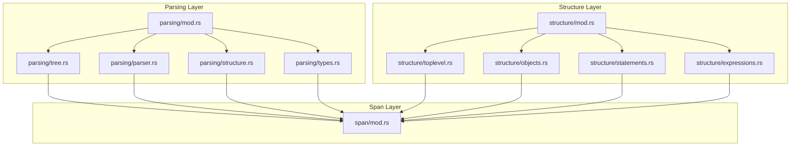
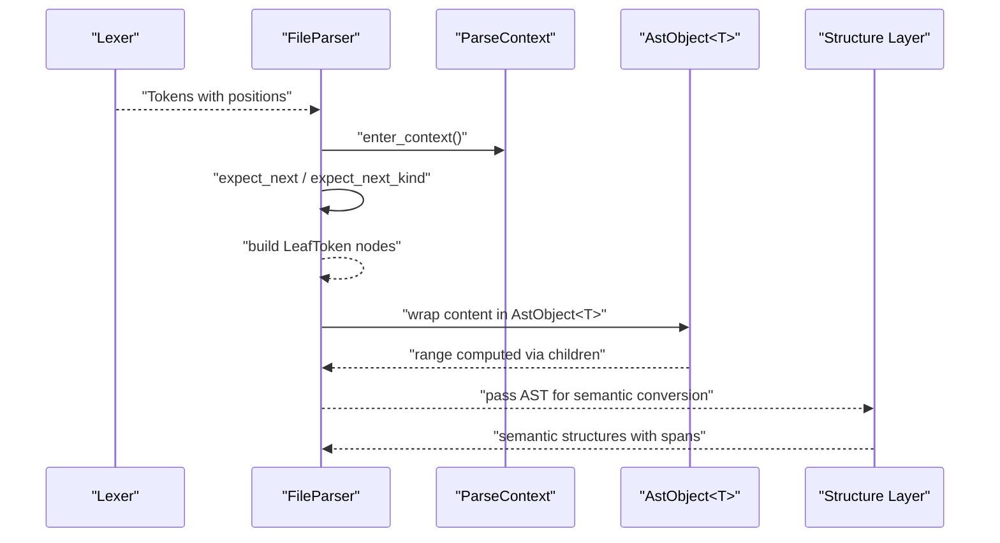
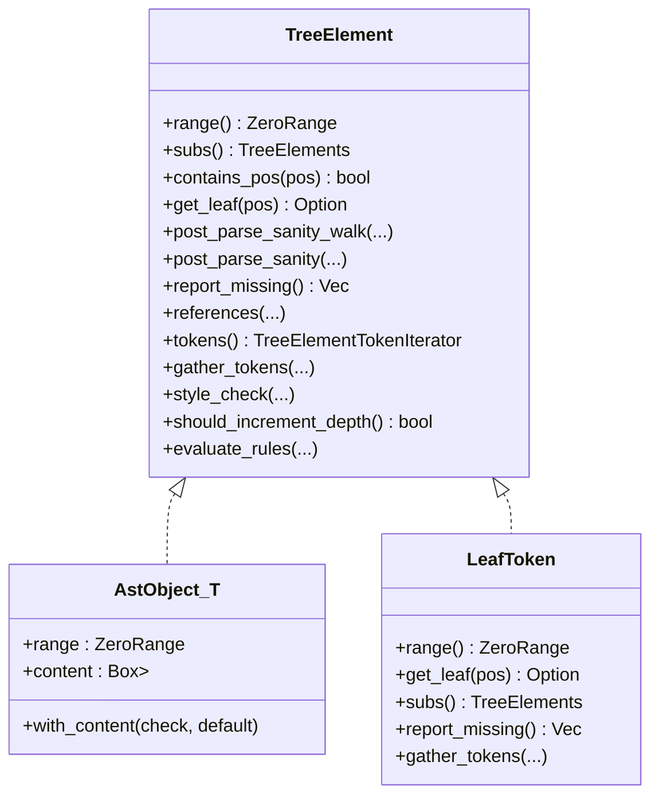
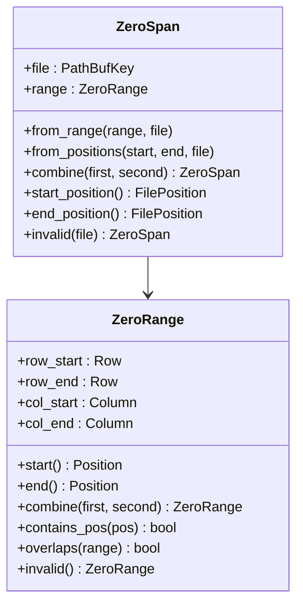
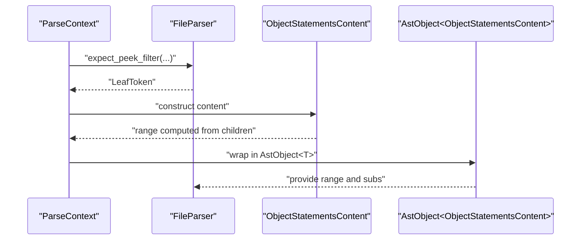
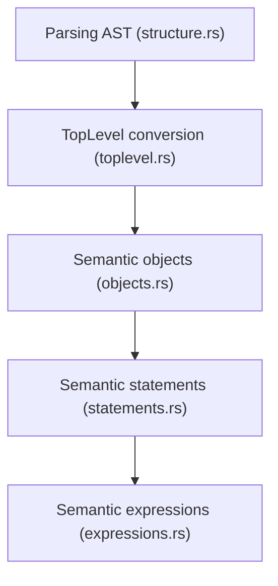
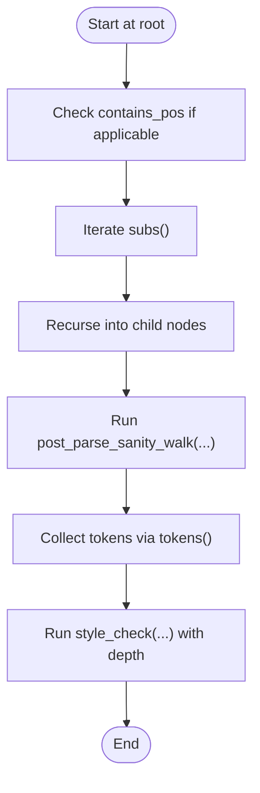
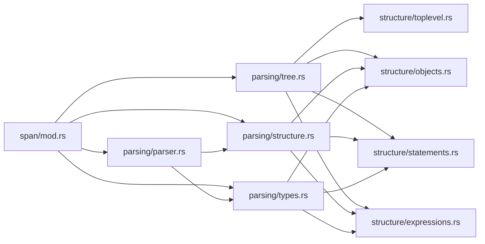

# Abstract Syntax Tree

<cite>
**Referenced Files in This Document**
- [tree.rs](file://src/analysis/parsing/tree.rs)
- [mod.rs](file://src/analysis/parsing/mod.rs)
- [parser.rs](file://src/analysis/parsing/parser.rs)
- [structure.rs](file://src/analysis/parsing/structure.rs)
- [types.rs](file://src/analysis/parsing/types.rs)
- [mod.rs](file://src/analysis/structure/mod.rs)
- [toplevel.rs](file://src/analysis/structure/toplevel.rs)
- [objects.rs](file://src/analysis/structure/objects.rs)
- [statements.rs](file://src/analysis/structure/statements.rs)
- [expressions.rs](file://src/analysis/structure/expressions.rs)
- [mod.rs](file://src/span/mod.rs)
</cite>

## Table of Contents
1. [Introduction](#introduction)
2. [Project Structure](#project-structure)
3. [Core Components](#core-components)
4. [Architecture Overview](#architecture-overview)
5. [Detailed Component Analysis](#detailed-component-analysis)
6. [Dependency Analysis](#dependency-analysis)
7. [Performance Considerations](#performance-considerations)
8. [Troubleshooting Guide](#troubleshooting-guide)
9. [Conclusion](#conclusion)

## Introduction
This document describes the Abstract Syntax Tree (AST) construction and management system used by the DML language server. It explains how the parser builds the AST, how nodes are structured and related, how source locations are tracked using ZeroSpan and ZeroRange, and how the AST integrates with semantic analysis and transformations. It also covers traversal patterns, visitor-style walks, and practical guidance for memory management and performance when working with large syntax trees.

## Project Structure
The AST system is implemented across several modules:
- Parsing layer: constructs the raw AST nodes and tracks source spans.
- Structure layer: transforms the parsing-layer AST into a higher-level semantic structure suitable for analysis.
- Span layer: provides precise, index-aware position and range types.

**Diagram sources**
- [mod.rs](file://src/analysis/parsing/mod.rs#L3-L15)
- [mod.rs](file://src/analysis/structure/mod.rs#L1-L8)
- [mod.rs](file://src/span/mod.rs#L1-L751)

**Section sources**
- [mod.rs](file://src/analysis/parsing/mod.rs#L3-L15)
- [mod.rs](file://src/analysis/structure/mod.rs#L1-L8)

## Core Components
- TreeElement trait: the core interface for all AST nodes. It defines range retrieval, subtree iteration, post-parse sanity checks, missing content reporting, reference collection, token enumeration, and style checks.
- ZeroSpan and ZeroRange: strongly indexed span and range types used to track source locations precisely.
- AstObject<T>: a container that wraps content with a full range, boxing the content to avoid recursive type issues elsewhere.
- LeafToken: a thin wrapper around a parsed token carrying its range and allowing missing tokens to propagate through the tree.
- Parser and ParseContext: drive AST construction, manage lookahead/skip behavior, and produce LeafToken nodes that carry precise spans.

Key responsibilities:
- TreeElement ensures uniform traversal and inspection across all node types.
- AstObject<T> centralizes range computation and missing content handling.
- ZeroSpan/ZeroRange provide robust, index-aware location tracking for diagnostics and navigation.
- Parser and ParseContext ensure robustness against missing tokens and malformed input.

**Section sources**
- [tree.rs](file://src/analysis/parsing/tree.rs#L14-L120)
- [tree.rs](file://src/analysis/parsing/tree.rs#L333-L397)
- [tree.rs](file://src/analysis/parsing/tree.rs#L242-L306)
- [parser.rs](file://src/analysis/parsing/parser.rs#L15-L40)
- [parser.rs](file://src/analysis/parsing/parser.rs#L48-L320)

## Architecture Overview
The AST pipeline proceeds as follows:
1. Lexing produces tokens with precise positions.
2. Parsing constructs LeafToken nodes and higher-level AST nodes, combining ranges to compute spans.
3. AstObject<T> boxes parsed content and computes a unified range for the node.
4. The structure layer converts the parsing AST into semantic structures for analysis.
5. The span layer provides ZeroSpan and ZeroRange for precise location tracking.

**Diagram sources**
- [parser.rs](file://src/analysis/parsing/parser.rs#L322-L400)
- [parser.rs](file://src/analysis/parsing/parser.rs#L48-L320)
- [tree.rs](file://src/analysis/parsing/tree.rs#L320-L397)
- [structure.rs](file://src/analysis/parsing/structure.rs#L788-L821)

## Detailed Component Analysis

### TreeElement and Node Relationships
TreeElement defines a uniform contract for all AST nodes:
- range(): returns the ZeroRange covering the node’s content.
- subs(): returns an iterator over child nodes for traversal.
- post_parse_sanity(): default no-op; overridden to validate node-specific constraints.
- report_missing(): collects missing content errors from descendants.
- references(): collects references for later resolution.
- tokens(): flattens tokens under the node.
- style_check(): runs style checks with depth tracking.

Generic implementations support Vec<T>, Option<T>, tuples, and boxed nodes, enabling flexible composition of AST structures.

**Diagram sources**
- [tree.rs](file://src/analysis/parsing/tree.rs#L33-L120)
- [tree.rs](file://src/analysis/parsing/tree.rs#L320-L397)
- [tree.rs](file://src/analysis/parsing/tree.rs#L242-L306)

**Section sources**
- [tree.rs](file://src/analysis/parsing/tree.rs#L33-L120)
- [tree.rs](file://src/analysis/parsing/tree.rs#L130-L232)
- [tree.rs](file://src/analysis/parsing/tree.rs#L320-L397)

### Position Tracking with ZeroSpan and ZeroRange
ZeroSpan and ZeroRange encapsulate source locations:
- ZeroRange represents a rectangular region with row_start, row_end, col_start, col_end.
- ZeroSpan represents a file-scoped span with a path key and a ZeroRange.
- Position and FilePosition track absolute coordinates; conversions between one-indexed and zero-indexed variants are supported.

These types are used pervasively to annotate AST nodes with precise spans for diagnostics, navigation, and style checks.

**Diagram sources**
- [mod.rs](file://src/span/mod.rs#L262-L368)
- [mod.rs](file://src/span/mod.rs#L464-L533)

**Section sources**
- [mod.rs](file://src/span/mod.rs#L262-L368)
- [mod.rs](file://src/span/mod.rs#L464-L533)

### AST Construction During Parsing
The parser constructs AST nodes by:
- Using ParseContext to control lookahead and error recovery.
- Building LeafToken nodes that capture token kinds and ranges.
- Composing higher-level structures (e.g., ObjectStatements, MethodContent) that implement TreeElement.
- Wrapping content in AstObject<T> to compute unified ranges and handle missing content.

Examples of constructed nodes include:
- Object statements lists and blocks.
- Method definitions with modifiers, arguments, and bodies.
- Composite object declarations with optional instantiations and documentation.
- Type declarations and complex type constructs.

**Diagram sources**
- [parser.rs](file://src/analysis/parsing/parser.rs#L48-L320)
- [structure.rs](file://src/analysis/parsing/structure.rs#L788-L821)
- [tree.rs](file://src/analysis/parsing/tree.rs#L320-L397)

**Section sources**
- [parser.rs](file://src/analysis/parsing/parser.rs#L48-L320)
- [structure.rs](file://src/analysis/parsing/structure.rs#L788-L821)
- [tree.rs](file://src/analysis/parsing/tree.rs#L320-L397)

### Semantic Structure Conversion
The structure layer transforms the parsing AST into semantic forms:
- Top-level conversion builds a TopLevel structure from the parsing AST, collecting version, device, bitorder, templates, and statements.
- Object-level conversions transform parsing nodes (e.g., MethodContent, ParameterContent, VariableContent) into semantic objects with spans and symbol/reference information.
- Statement-level conversions build semantic statements and expressions with spans and symbol containers.

**Diagram sources**
- [toplevel.rs](file://src/analysis/structure/toplevel.rs#L627-L844)
- [objects.rs](file://src/analysis/structure/objects.rs#L65-L106)
- [statements.rs](file://src/analysis/structure/statements.rs#L97-L120)
- [expressions.rs](file://src/analysis/structure/expressions.rs#L742-L798)

**Section sources**
- [toplevel.rs](file://src/analysis/structure/toplevel.rs#L627-L844)
- [objects.rs](file://src/analysis/structure/objects.rs#L65-L106)
- [statements.rs](file://src/analysis/structure/statements.rs#L97-L120)
- [expressions.rs](file://src/analysis/structure/expressions.rs#L742-L798)

### Traversal Patterns and Visitor Implementations
Traversal is implemented via TreeElement:
- subs(): iterate over child nodes.
- post_parse_sanity_walk(): recursively collect post-parse validations.
- tokens(): enumerate tokens under a node.
- style_check(): traverse with depth tracking for style rules.

These patterns enable:
- Walking the entire tree to collect references and symbols.
- Running style checks with nested depth awareness.
- Reporting missing content by walking subtrees.

**Diagram sources**
- [tree.rs](file://src/analysis/parsing/tree.rs#L33-L120)

**Section sources**
- [tree.rs](file://src/analysis/parsing/tree.rs#L33-L120)

### Examples of AST Representations for DML Constructs
Below are representative node types and their roles in the AST. These are conceptual examples to illustrate structure and relationships; exact shapes are defined in the referenced files.

- MethodContent: method signature, modifiers, arguments, returns, throws, default, and statements.
- ParameterContent: parameter declaration with optional typing and default/auto initialization.
- VariableContent: session/saved/extern declarations with initializers.
- CompositeObjectContent: object declarations with optional dimension brackets, instantiation, documentation, and statements.
- TemplateContent: template definitions with optional instantiation and statements.
- HashIfContent: conditional compilation blocks with true/false branches.
- ExportContent: export directives with target and name expressions.
- CBlockContent: header/footer opaque C blocks.
- HookContent: hook declarations with argument types and identifiers.
- LoggroupContent: named logging groups.
- TypedefContent: type aliases with optional extern.

These nodes implement TreeElement, ensuring consistent range computation, subtree iteration, and missing-content reporting.

**Section sources**
- [structure.rs](file://src/analysis/parsing/structure.rs#L78-L120)
- [structure.rs](file://src/analysis/parsing/structure.rs#L352-L424)
- [structure.rs](file://src/analysis/parsing/structure.rs#L477-L530)
- [structure.rs](file://src/analysis/parsing/structure.rs#L823-L858)
- [structure.rs](file://src/analysis/parsing/structure.rs#L982-L1031)
- [structure.rs](file://src/analysis/parsing/structure.rs#L1344-L1414)
- [structure.rs](file://src/analysis/parsing/structure.rs#L1416-L1450)
- [structure.rs](file://src/analysis/parsing/structure.rs#L1452-L1489)
- [structure.rs](file://src/analysis/parsing/structure.rs#L1491-L1541)
- [structure.rs](file://src/analysis/parsing/structure.rs#L1543-L1571)
- [structure.rs](file://src/analysis/parsing/structure.rs#L1573-L1596)

### Memory Management Strategies and Performance Optimizations
- Boxing content in AstObject<T>: reduces recursion and simplifies type definitions by boxing the actual content.
- Range caching: range() is computed once per node and reused; combine operations minimize recomputation.
- Minimal cloning: TreeElement methods operate on references and iterators to avoid unnecessary allocations.
- Efficient token enumeration: tokens() and gather_tokens() traverse subtrees once to collect tokens.
- Path key reuse: PathBufKey and global path storage reduce duplication of file paths.

Practical tips:
- Prefer TreeElement::subs() for traversal to avoid repeated recomputation.
- Use ZeroRange::combine() judiciously; cache intermediate ranges when building large trees.
- Avoid deep nesting of AstObject<T> wrappers; flatten where appropriate to reduce indirection.

**Section sources**
- [tree.rs](file://src/analysis/parsing/tree.rs#L320-L397)
- [mod.rs](file://src/span/mod.rs#L217-L240)

### Tree Manipulation Operations and Transformation Utilities
Transformation utilities are primarily implemented in the structure layer:
- make_statements(): converts parsing-level object lists into semantic statements.
- to_structure() implementations on semantic types convert parsing nodes into semantic forms with spans and symbol/reference information.
- flatten_hashif_branch(): flattens nested #if/#else blocks into a normalized statement specification.

These utilities preserve spans and ensure missing content is represented consistently for downstream analysis.

**Section sources**
- [objects.rs](file://src/analysis/structure/objects.rs#L566-L587)
- [objects.rs](file://src/analysis/structure/objects.rs#L686-L726)
- [toplevel.rs](file://src/analysis/structure/toplevel.rs#L316-L544)

## Dependency Analysis
The AST system exhibits clear layering:
- Parsing layer depends on the span layer for precise positions.
- Structure layer depends on parsing and span layers to construct semantic forms with spans.
- TreeElement and AstObject<T> provide a common abstraction across layers.

**Diagram sources**
- [mod.rs](file://src/analysis/parsing/mod.rs#L3-L15)
- [mod.rs](file://src/analysis/structure/mod.rs#L1-L8)
- [mod.rs](file://src/span/mod.rs#L1-L751)

**Section sources**
- [mod.rs](file://src/analysis/parsing/mod.rs#L3-L15)
- [mod.rs](file://src/analysis/structure/mod.rs#L1-L8)
- [mod.rs](file://src/span/mod.rs#L1-L751)

## Performance Considerations
- Prefer lazy evaluation of expensive computations (e.g., style checks) only when needed.
- Cache computed ranges and spans to avoid repeated traversal.
- Use efficient iterators (subs(), tokens()) to minimize allocations.
- Keep AST node sizes reasonable; avoid deeply nested wrappers where possible.
- Leverage PathBufKey to avoid duplicating file paths across nodes.

## Troubleshooting Guide
Common issues and remedies:
- Missing tokens: LeafToken::Missing is propagated through the tree; use report_missing() to surface diagnostics.
- Incorrect spans: Verify that range() is computed from children using Range::combine; ensure parent nodes aggregate child ranges correctly.
- Post-parse validation failures: Implement post_parse_sanity() on nodes that require semantic checks; use post_parse_sanity_walk() to collect errors.
- Reference resolution: Implement references() to collect references; ensure subtrees do not leak references unintentionally.

**Section sources**
- [tree.rs](file://src/analysis/parsing/tree.rs#L234-L284)
- [tree.rs](file://src/analysis/parsing/tree.rs#L54-L76)
- [structure.rs](file://src/analysis/parsing/structure.rs#L125-L234)

## Conclusion
The AST system combines precise position tracking with a flexible, traversable node model. TreeElement provides a uniform interface across all node types, while AstObject<T> centralizes range computation and missing-content handling. The structure layer transforms the parsing AST into semantic forms, preserving spans and enabling robust analysis. With careful use of traversal patterns, caching, and transformation utilities, the system scales effectively for large DML files.