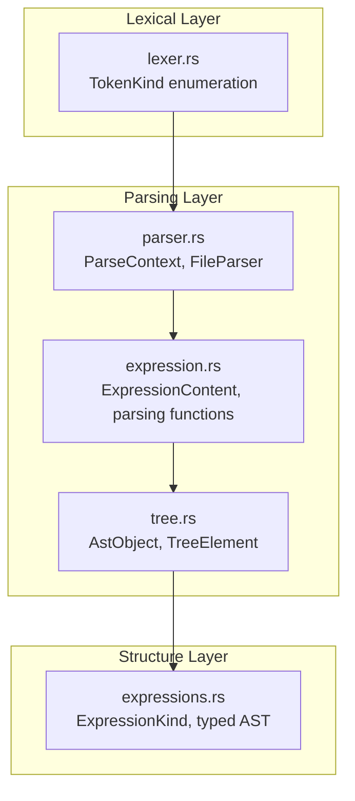
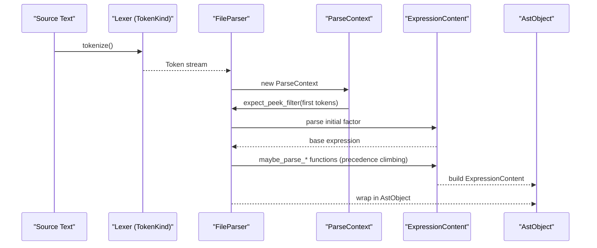
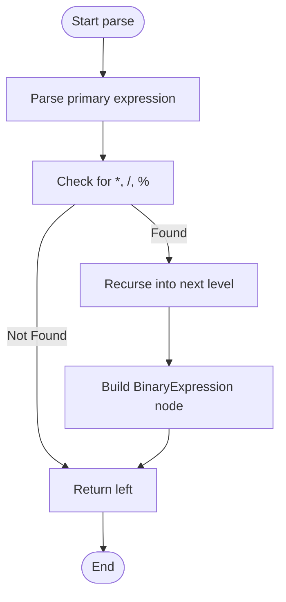
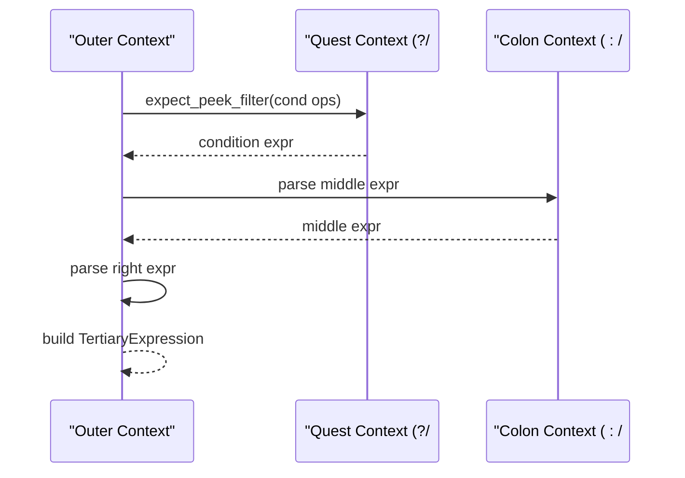

# Expression Parsing

<cite>
**Referenced Files in This Document**
- [expression.rs](file://src/analysis/parsing/expression.rs)
- [parser.rs](file://src/analysis/parsing/parser.rs)
- [lexer.rs](file://src/analysis/parsing/lexer.rs)
- [expressions.rs](file://src/analysis/structure/expressions.rs)
- [mod.rs](file://src/analysis/parsing/mod.rs)
- [tree.rs](file://src/analysis/parsing/tree.rs)
- [test.rs](file://src/test/mod.rs)
</cite>

## Table of Contents
1. [Introduction](#introduction)
2. [Project Structure](#project-structure)
3. [Core Components](#core-components)
4. [Architecture Overview](#architecture-overview)
5. [Detailed Component Analysis](#detailed-component-analysis)
6. [Dependency Analysis](#dependency-analysis)
7. [Performance Considerations](#performance-considerations)
8. [Troubleshooting Guide](#troubleshooting-guide)
9. [Conclusion](#conclusion)

## Introduction
This document explains the expression parsing capabilities within the DML parser. It covers the expression grammar rules, operator precedence handling, associativity resolution, and recursive descent parsing for nested expressions. It documents support for arithmetic, logical, comparison, and function call expressions, along with parenthesized expressions and unary/binary operators. It also describes how the parser constructs expression ASTs, evaluates precedence, handles malformed expressions, and integrates with type checking and semantic analysis phases.

## Project Structure
The expression parsing pipeline spans several modules:
- Lexical analysis: tokenization of DML source into tokens
- Parsing: recursive descent parser that builds expression ASTs
- Structure conversion: transforms parsed expressions into typed ASTs for semantic analysis
- Tree infrastructure: shared AST node and leaf token abstractions

**Diagram sources**
- [lexer.rs](file://src/analysis/parsing/lexer.rs#L98-L426)
- [parser.rs](file://src/analysis/parsing/parser.rs#L48-L320)
- [expression.rs](file://src/analysis/parsing/expression.rs#L700-L790)
- [tree.rs](file://src/analysis/parsing/tree.rs#L1-L120)
- [expressions.rs](file://src/analysis/structure/expressions.rs#L538-L798)

**Section sources**
- [lexer.rs](file://src/analysis/parsing/lexer.rs#L98-L426)
- [parser.rs](file://src/analysis/parsing/parser.rs#L48-L320)
- [expression.rs](file://src/analysis/parsing/expression.rs#L700-L790)
- [expressions.rs](file://src/analysis/structure/expressions.rs#L538-L798)

## Core Components
- TokenKind: Defines all terminal tokens (operators, literals, keywords) used by the expression parser
- ParseContext and FileParser: Provide lookahead, context-aware parsing, and error recovery
- ExpressionContent: Enumerates expression variants (binary, unary, function call, member access, etc.)
- ExpressionKind: Typed AST used by semantic analysis and type checking
- TreeElement: Base trait for AST nodes with range computation and subtree traversal

Key responsibilities:
- TokenKind drives operator recognition and literal classification
- ParseContext controls lookahead and termination conditions for sub-expressions
- ExpressionContent captures untyped AST nodes during parsing
- ExpressionKind captures typed AST nodes for downstream analysis

**Section sources**
- [lexer.rs](file://src/analysis/parsing/lexer.rs#L98-L426)
- [parser.rs](file://src/analysis/parsing/parser.rs#L48-L320)
- [expression.rs](file://src/analysis/parsing/expression.rs#L700-L790)
- [expressions.rs](file://src/analysis/structure/expressions.rs#L538-L798)

## Architecture Overview
The expression parser uses a classic recursive descent approach with explicit precedence rules. Each precedence level is handled by a dedicated function that recognizes operators at that level and recursively parses higher-precedence subexpressions.

**Diagram sources**
- [lexer.rs](file://src/analysis/parsing/lexer.rs#L98-L426)
- [parser.rs](file://src/analysis/parsing/parser.rs#L58-L320)
- [expression.rs](file://src/analysis/parsing/expression.rs#L1109-L1176)

## Detailed Component Analysis

### Expression Grammar Rules and Precedence
The parser defines a hierarchy of precedence levels, each implemented by a dedicated function. The order ensures proper precedence and associativity:
- Primary constructs: literals, identifiers, parentheses, brackets, unary ops, new, sizeof, sizeoftype, cast, each-in
- Postfix: function call, member access, indexing/slicing
- Unary: prefix increment/decrement, address-of, dereference, logical/bitwise/not, prefix increment/decrement
- Multiplication/Division/Modulo
- Addition/Subtraction
- Left/Right shifts
- Comparison (<, >, <=, >=)
- Equality (==, !=)
- Bitwise AND (&)
- Bitwise XOR (^)
- Bitwise OR (|)
- Logical AND (&&)
- Logical OR (||)
- Conditional (?:)
- Assignment (=, +=, etc.)

Associativity:
- Left-to-right for arithmetic, comparison, equality, bitwise ops, logical ops, assignment
- Right-to-left for unary and ternary (conditional)

Precedence enforcement is achieved by:
- Each level’s function recognizes only operators at its level or lower
- Recursive calls to the next level parse higher-precedence subexpressions
- Continuation parsing after primary constructs handles postfix operators

Examples of precedence handling:
- maybe_parse_muldivmod_expression recognizes *, /, % and recurses into extended expressions for right-hand sides
- maybe_parse_addsub_expression recognizes +, - and recurses into mul/div/mod
- maybe_parse_shift_expression recognizes <<, >> and recurses into add/sub
- maybe_parse_comparison_expression recognizes relational operators and recurses into shifts
- maybe_parse_equality_expression recognizes ==, != and recurses into comparisons
- maybe_parse_binary_calc_expression recognizes &, ^, | and recurses into equality
- maybe_parse_logic_and_expression recognizes && and recurses into binaries
- maybe_parse_logic_or_expression recognizes || and recurses into logic-and
- maybe_parse_tertiary_expression recognizes ? and : and recurses into logic-or

**Section sources**
- [expression.rs](file://src/analysis/parsing/expression.rs#L850-L1107)

### Recursive Descent Parsing for Nested Expressions
The parser uses a layered approach:
- parse_expression_inner handles the first token and dispatches to constructors for literals, identifiers, parentheses, unary ops, special keywords, etc.
- maybe_parse_extended_expression handles postfix continuations (function call, member access, indexing/slicing, postfix inc/dec)
- Higher-level functions (addition, shift, comparison, equality, bitwise, logic) progressively build the AST

Continuation parsing:
- After consuming a primary expression, the parser checks for continuation tokens (LParen, LBracket, Dot, Arrow, PlusPlus, MinusMinus)
- Each continuation consumes the operator and appends the appropriate ExpressionContent variant

**Section sources**
- [expression.rs](file://src/analysis/parsing/expression.rs#L809-L849)
- [expression.rs](file://src/analysis/parsing/expression.rs#L1109-L1159)

### Operator Precedence and Associativity Resolution
Precedence is encoded in the function chain:
- Lower-precedence functions call higher-precedence ones to consume right-hand sides
- Higher-precedence functions do not call lower-precedence ones, ensuring correct binding
- Continuation parsing after primary expressions ensures postfix operators bind tightly

Associativity is enforced by:
- Left-associative operators recurse with None to force left grouping
- Right-associative operators (unary, ternary) recurse with the same level to force right grouping

**Section sources**
- [expression.rs](file://src/analysis/parsing/expression.rs#L850-L1107)

### Supported Expression Types
- Arithmetic: +, -, *, /, %, <<, >>
- Logical: &&, ||
- Bitwise: &, ^, |
- Comparison: ==, !=, <, >, <=, >=
- Assignment: =, +=, -=, *=, /=, %=, <<=, >>=, &=, ^=, |=
- Unary: -, !, ~, ++ (prefix/postfix), -- (prefix/postfix), & (address-of), * (dereference), defined
- Function call: identifier(...) with argument lists
- Member access: expr.identifier and expr->identifier
- Indexing/Slicing: expr[expr], expr[expr], expr[expr: expr], expr[expr, bitorder], expr[expr: expr, bitorder]
- Parenthesized: (expr)
- Cast: cast(expr, type)
- New: new type, new type[expr]
- Sizeof: sizeof expr
- Sizeoftype: sizeoftype(type)
- Each-in: each identifier in (expr)
- Literals: integers, floats, strings, chars
- Identifiers and undefined

**Section sources**
- [lexer.rs](file://src/analysis/parsing/lexer.rs#L100-L191)
- [expression.rs](file://src/analysis/parsing/expression.rs#L202-L594)
- [expression.rs](file://src/analysis/parsing/expression.rs#L700-L790)

### Expression AST Construction and Typed Conversion
During parsing, ExpressionContent nodes capture the untyped AST. Later, the structure layer converts to ExpressionKind for semantic analysis:
- BinaryExpression maps operator tokens to BinOp variants
- UnaryExpression maps operator tokens to UnaryOp variants
- MemberLiteral maps dot/arrow to MemberOp
- TertiaryExpression maps ?/: to TertiaryOp
- FunctionCall, Index, Slice, Cast, New, SizeOf, SizeOfType, ConstantList, EachIn are constructed accordingly
- Literals are converted to typed values with spans

This separation enables robust error reporting and type checking while preserving precise source locations.

**Section sources**
- [expressions.rs](file://src/analysis/structure/expressions.rs#L76-L124)
- [expressions.rs](file://src/analysis/structure/expressions.rs#L140-L216)
- [expressions.rs](file://src/analysis/structure/expressions.rs#L232-L262)
- [expressions.rs](file://src/analysis/structure/expressions.rs#L327-L340)
- [expressions.rs](file://src/analysis/structure/expressions.rs#L356-L375)
- [expressions.rs](file://src/analysis/structure/expressions.rs#L384-L403)
- [expressions.rs](file://src/analysis/structure/expressions.rs#L412-L430)
- [expressions.rs](file://src/analysis/structure/expressions.rs#L438-L448)
- [expressions.rs](file://src/analysis/structure/expressions.rs#L462-L476)
- [expressions.rs](file://src/analysis/structure/expressions.rs#L489-L502)
- [expressions.rs](file://src/analysis/structure/expressions.rs#L517-L528)
- [expressions.rs](file://src/analysis/structure/expressions.rs#L742-L798)

### Error Handling for Malformed Expressions
The parser employs several mechanisms:
- ParseContext tracks when a sub-context ends due to encountering a token outside its understanding, returning a MissingToken leaf
- FileParser skips unexpected tokens and records them for diagnostics
- dmlexpression_first_token_matcher restricts initial tokens to valid expression starters
- ensure_string_concatenation validates string literal composition rules
- Tests demonstrate expected behavior for missing tokens and invalid sequences

These mechanisms ensure graceful handling of malformed expressions and provide actionable diagnostics.

**Section sources**
- [parser.rs](file://src/analysis/parsing/parser.rs#L58-L320)
- [parser.rs](file://src/analysis/parsing/parser.rs#L461-L480)
- [expression.rs](file://src/analysis/parsing/expression.rs#L793-L807)
- [expression.rs](file://src/analysis/parsing/expression.rs#L1178-L1221)
- [test.rs](file://src/test/mod.rs#L55-L70)

### Integration with Type Checking and Semantic Analysis
Typed AST construction occurs after parsing:
- ExpressionKind.to_expression converts ExpressionContent to typed nodes
- Operators are mapped to typed enums (BinOp, UnaryOp, etc.)
- Spans are preserved for error reporting and IDE features
- References and symbol resolution are attached via TreeElement implementations

This integration ensures that semantic analysis and type checking operate on a well-structured, typed representation of expressions.

**Section sources**
- [expressions.rs](file://src/analysis/structure/expressions.rs#L742-L798)

### Example Workflows

#### Binary Expression Precedence Evaluation

**Diagram sources**
- [expression.rs](file://src/analysis/parsing/expression.rs#L850-L875)

#### Tertiary (Conditional) Expression Parsing

**Diagram sources**
- [expression.rs](file://src/analysis/parsing/expression.rs#L1058-L1107)

## Dependency Analysis
The expression parsing system exhibits clear layering:
- lexer.rs provides TokenKind for operator and literal recognition
- parser.rs supplies ParseContext and FileParser for lookahead and error recovery
- expression.rs implements the precedence-driven recursive descent parser
- tree.rs provides the generic AST node abstraction
- expressions.rs converts to typed AST for semantic analysis

**Diagram sources**
- [lexer.rs](file://src/analysis/parsing/lexer.rs#L98-L426)
- [parser.rs](file://src/analysis/parsing/parser.rs#L48-L320)
- [expression.rs](file://src/analysis/parsing/expression.rs#L700-L790)
- [tree.rs](file://src/analysis/parsing/tree.rs#L1-L120)
- [expressions.rs](file://src/analysis/structure/expressions.rs#L538-L798)

**Section sources**
- [lexer.rs](file://src/analysis/parsing/lexer.rs#L98-L426)
- [parser.rs](file://src/analysis/parsing/parser.rs#L48-L320)
- [expression.rs](file://src/analysis/parsing/expression.rs#L700-L790)
- [tree.rs](file://src/analysis/parsing/tree.rs#L1-L120)
- [expressions.rs](file://src/analysis/structure/expressions.rs#L538-L798)

## Performance Considerations
- Recursive descent with explicit precedence avoids backtracking and maintains linear-time parsing
- ParseContext limits lookahead to necessary tokens, reducing unnecessary consumption
- TreeElement implementations minimize allocations by reusing spans and avoiding deep cloning
- Early termination on missing tokens prevents excessive recursion into malformed inputs

## Troubleshooting Guide
Common issues and resolutions:
- Unexpected token errors: Inspect skipped tokens reported by FileParser and adjust grammar expectations
- Missing closing delimiters: ParseContext returns MissingToken; ensure proper delimiter handling in parsers
- Ambiguous operator sequences: Verify operator precedence functions are ordered correctly
- String concatenation validation: ensure only '+' is used for string literal composition

Diagnostic aids:
- Use test utilities to compare expected ASTs against actual results
- Leverage span information for precise error messages

**Section sources**
- [parser.rs](file://src/analysis/parsing/parser.rs#L461-L480)
- [test.rs](file://src/test/mod.rs#L55-L70)

## Conclusion
The DML expression parser implements a robust, precedence-driven recursive descent system. It supports a comprehensive set of expression types, enforces operator precedence and associativity, and integrates seamlessly with type checking and semantic analysis. The design balances performance, maintainability, and diagnostic quality, enabling reliable parsing of complex DML expressions.