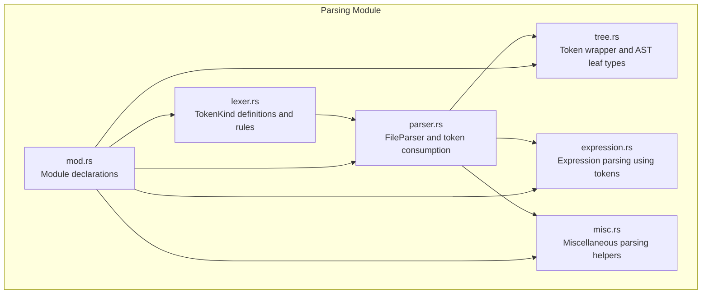
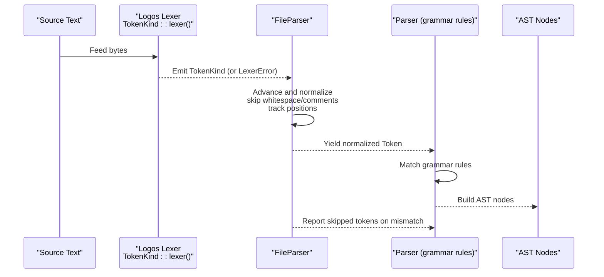
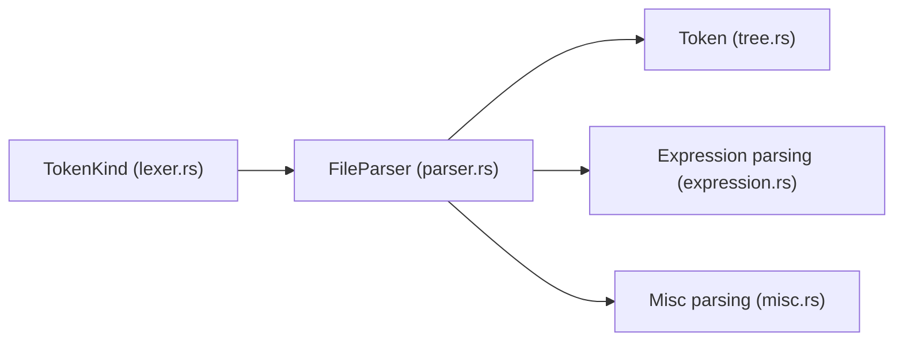

# Lexical Analysis

<cite>
**Referenced Files in This Document**
- [lexer.rs](file://src/analysis/parsing/lexer.rs)
- [parser.rs](file://src/analysis/parsing/parser.rs)
- [mod.rs](file://src/analysis/parsing/mod.rs)
- [tree.rs](file://src/analysis/parsing/tree.rs)
- [expression.rs](file://src/analysis/parsing/expression.rs)
- [misc.rs](file://src/analysis/parsing/misc.rs)
- [watchdog_timer.dml](file://example_files/watchdog_timer.dml)
</cite>

## Table of Contents
1. [Introduction](#introduction)
2. [Project Structure](#project-structure)
3. [Core Components](#core-components)
4. [Architecture Overview](#architecture-overview)
5. [Detailed Component Analysis](#detailed-component-analysis)
6. [Dependency Analysis](#dependency-analysis)
7. [Performance Considerations](#performance-considerations)
8. [Troubleshooting Guide](#troubleshooting-guide)
9. [Conclusion](#conclusion)

## Introduction
This document describes the lexical analysis phase of the DML parser, focusing on the custom lexer built on top of the Logos crate. It explains tokenization rules for DML language constructs, the token classification system, the lexer state machine, multi-character operator handling, string literal processing with escape sequences, numeric literal recognition, error handling, and integration with the parsing phase. It also outlines how tokens flow from the lexer into the syntax analyzer and provides examples of token streams for typical DML constructs.

## Project Structure
The lexical analysis is implemented in a dedicated module under the parsing subsystem. The key files are:
- lexer.rs: Defines the token kinds and tokenizer rules using Logos.
- parser.rs: Implements the FileParser that consumes tokens from the lexer, advances through whitespace and comments, tracks positions, and feeds the syntax analyzer.
- tree.rs: Provides the Token wrapper and related AST leaf types used by the parser.
- expression.rs and misc.rs: Demonstrate how tokens are consumed during parsing of expressions and declarations.
- mod.rs: Declares the parsing module layout.
- example_files/watchdog_timer.dml: A real DML file used to illustrate tokenization in practice.

**Diagram sources**
- [lexer.rs](file://src/analysis/parsing/lexer.rs#L98-L426)
- [parser.rs](file://src/analysis/parsing/parser.rs#L16-L480)
- [tree.rs](file://src/analysis/parsing/tree.rs#L14-L120)
- [expression.rs](file://src/analysis/parsing/expression.rs#L1-L200)
- [misc.rs](file://src/analysis/parsing/misc.rs#L640-L663)
- [mod.rs](file://src/analysis/parsing/mod.rs#L1-L16)

**Section sources**
- [mod.rs](file://src/analysis/parsing/mod.rs#L1-L16)

## Core Components
- TokenKind (lexer): Enumerates all token categories recognized by the lexer, including operators, keywords, literals, identifiers, and special symbols. It leverages Logos attributes to define matching rules and uses callbacks for reserved identifier checks and multi-character constructs.
- FileParser (parser): Wraps a Logos lexer, advances through whitespace and comments, tracks line/column positions, and yields tokens to the parser. It also handles skipping unexpected tokens and reporting skipped items.
- Token (tree): A wrapper around TokenKind with positional metadata (prefix range and token range) enabling precise diagnostics and AST construction.

Key responsibilities:
- TokenKind defines the complete token vocabulary and matching rules for DML.
- FileParser normalizes the token stream by skipping whitespace and comments, updating position state, and surfacing LexerError when the underlying lexer fails to recognize a token.
- Token carries range information for diagnostics and AST nodes.

**Section sources**
- [lexer.rs](file://src/analysis/parsing/lexer.rs#L98-L426)
- [parser.rs](file://src/analysis/parsing/parser.rs#L16-L480)
- [tree.rs](file://src/analysis/parsing/tree.rs#L14-L40)

## Architecture Overview
The lexical analysis pipeline integrates the Logos-generated lexer with a thin wrapper that normalizes tokens for the parser. The parser maintains a cursor over the token stream, skips whitespace/comments, and reports diagnostics for unexpected tokens.

**Diagram sources**
- [lexer.rs](file://src/analysis/parsing/lexer.rs#L98-L426)
- [parser.rs](file://src/analysis/parsing/parser.rs#L322-L480)

## Detailed Component Analysis

### Token Classification System
The lexer categorizes input into the following groups:

- Operators and punctuation
  - Single-character operators: plus, minus, multiply, divide, modulo, bitwise AND/OR/XOR, bitwise NOT, assignment, increments/decrements, arrow, ternary op, colon, semicolon, dot, comma, parentheses, brackets, braces, ellipsis, at-sign, hash-prefixed directives.
  - Multi-character operators: comparisons (equals, greater-than/less-than, not-equals), shifts (left/right), logical ops (AND/OR), compound assignments (arithmetic/bitwise shift), pre/post increments/decrements, arrow operator, ternary op, colon variants, and directive forms.

- Keywords
  - Extensive keyword set covering DML language constructs (e.g., device, bank, connect, method, field, register, event, group, header/footer, etc.), plus reserved words from C/C++ families. A helper callback filters reserved identifiers to prevent misclassification as generic identifiers.

- Literals
  - Integer constants: decimal with underscores, binary constants prefixed with 0b, hexadecimal constants prefixed with 0x.
  - Floating-point constants: decimal with optional fractional part and scientific notation.
  - Character constants: single-quoted with escapes.
  - String constants: double-quoted with a comprehensive escape set and UTF-8 TODO note.

- Identifiers
  - Alphanumeric and underscore, starting with letter or underscore. Reserved identifier filtering ensures keywords are not treated as identifiers.

- Special symbols and blocks
  - Line comments (// ... newline).
  - Block comments (/* ... */), with a custom handler to traverse content and update positions.
  - C block insertion (%{ ... %}), with a custom handler to track positions.
  - Whitespace and newline tokens are recognized but skipped by the parser.

- Error token
  - LexerError is emitted when the underlying lexer cannot match any rule, allowing the parser to detect unrecognized input.

Examples of token streams (descriptive):
- Arithmetic and assignment: "5 + 5 = 10" → IntConstant, Plus, IntConstant, Assign, IntConstant.
- Numeric variants: "0xF00_420 0b0011100 987654321" → HexConstant, Whitespace, BinaryConstant, Whitespace, IntConstant.
- Strings: "\"string\" \"another\"" → StringConstant, Whitespace, StringConstant.
- Whitespace and newlines: "method foo()   {\n\treturn 5;\n}" → Method, Whitespace, Identifier, LParen, RParen, Whitespace, LBrace, Newline, Whitespace, Return, Whitespace, IntConstant, SemiColon, Newline, RBrace.
- Comments: "foo //comment\n bar" → Identifier, Identifier; "foo /*comment*/ bar" → Identifier, Identifier; "foo /*comment\n*/ bar" → Identifier, Identifier.
- Reserved keywords: "char double float int long short signed unsigned void register" → Char, Double, Float, Int, Long, Short, Signed, Unsigned, Void, Register.

**Section sources**
- [lexer.rs](file://src/analysis/parsing/lexer.rs#L5-L426)
- [parser.rs](file://src/analysis/parsing/parser.rs#L596-L741)

### Lexer State Machine and Normalization
The FileParser advances the Logos lexer and normalizes tokens:
- Skips whitespace and newline tokens, updating column/line counts.
- Recognizes and advances through single-line and multi-line comments, updating positions accordingly.
- Handles C block insertion tokens (%{ ... %}) with a dedicated handler to compute ranges.
- Emits LexerError when the underlying lexer fails to match a token.
- Maintains a buffer for peeking and a cursor for sequential consumption.

Position tracking:
- Tracks current and previous line/column positions.
- Computes token ranges using the lexer’s slice length and current/previous positions.
- Supports reporting skipped tokens with expected descriptions for diagnostics.

**Section sources**
- [parser.rs](file://src/analysis/parsing/parser.rs#L322-L480)

### Multi-Character Operator Handling
The lexer uses Logos attributes to define operator precedence and disambiguation:
- Two-character operators (e.g., comparison, shift, logical) are matched first to avoid greedy single-character matches.
- Compound assignment operators are defined alongside their base operators.
- Care is taken to ensure regular expressions are unambiguous with lookahead 1 or use specialized callbacks where necessary.

This guarantees deterministic tokenization for operators like "||", "&&", "<<", ">>", "!=", "==", "+=", "-=", etc.

**Section sources**
- [lexer.rs](file://src/analysis/parsing/lexer.rs#L100-L206)

### String Literal Processing with Escape Sequences
String constants are defined with a regular expression that:
- Allows most printable characters except control characters and specific delimiters.
- Supports a wide set of escape sequences for common characters and hex/octal forms.
- Includes a TODO noting potential UTF-8 validation concerns.

The parser recognizes StringConstant tokens and uses their ranges to read original text via the VFS layer.

**Section sources**
- [lexer.rs](file://src/analysis/parsing/lexer.rs#L42-L50)
- [lexer.rs](file://src/analysis/parsing/lexer.rs#L412-L414)
- [parser.rs](file://src/analysis/parsing/parser.rs#L36-L40)

### Numeric Literal Recognition
Numeric recognition covers:
- Decimal integers with optional underscores.
- Binary literals with 0b prefix.
- Hexadecimal literals with 0x prefix.
- Floating-point literals with optional fractional parts and scientific notation.

These are defined as regular expressions and emitted as distinct token kinds for downstream parsing.

**Section sources**
- [lexer.rs](file://src/analysis/parsing/lexer.rs#L404-L411)

### Reserved Identifier Filtering
A helper callback filters reserved identifiers to prevent misclassification as generic identifiers. This ensures keywords are not treated as user-defined names.

**Section sources**
- [lexer.rs](file://src/analysis/parsing/lexer.rs#L16-L40)

### Error Handling for Invalid Characters
When the Logos lexer cannot match any rule, the parser receives a LexerError token. The FileParser sets the next token to TokenKind::LexerError and continues advancing. The parser can then:
- Skip unexpected tokens and continue parsing.
- Record skipped tokens with expected descriptions for diagnostics.
- End contexts early when encountering tokens understood by higher contexts.

This robustness enables incremental recovery and better user feedback.

**Section sources**
- [lexer.rs](file://src/analysis/parsing/lexer.rs#L424-L436)
- [parser.rs](file://src/analysis/parsing/parser.rs#L434-L436)
- [parser.rs](file://src/analysis/parsing/parser.rs#L461-L480)

### Integration with the Parsing Phase
Tokens flow from the lexer into the parser as follows:
- The parser constructs a FileParser from a Logos lexer.
- next_tok yields normalized tokens, skipping whitespace and comments, and updating positions.
- The parser consumes tokens using context-aware methods (expect_next, expect_next_kind, expect_next_filter) to drive grammar rules.
- Tokens carry range information enabling precise diagnostics and AST construction.

Examples of integration:
- Expression parsing uses tokens to build unary/binary/tertiary/parenthesized expressions.
- Declaration parsing relies on identifier filters and token expectations.

**Section sources**
- [parser.rs](file://src/analysis/parsing/parser.rs#L322-L480)
- [expression.rs](file://src/analysis/parsing/expression.rs#L49-L63)
- [misc.rs](file://src/analysis/parsing/misc.rs#L640-L663)

### Examples of Token Streams for DML Constructs
- Simple arithmetic: "5+5=10" emits IntConstant, Plus, IntConstant, Assign, IntConstant.
- Numeric variants: "0xF00_420 0b0011100 987654321" emits HexConstant, Whitespace, BinaryConstant, Whitespace, IntConstant.
- Strings: "\"string\" \"another\"" emits StringConstant, Whitespace, StringConstant.
- Whitespace and newlines: "method foo()   {\n\treturn 5;\n}" emits Method, Whitespace, Identifier, LParen, RParen, Whitespace, LBrace, Newline, Whitespace, Return, Whitespace, IntConstant, SemiColon, Newline, RBrace.
- Comments: "foo //comment\n bar" emits Identifier, Identifier; "foo /*comment*/ bar" emits Identifier, Identifier; "foo /*comment\n*/ bar" emits Identifier, Identifier.
- Reserved keywords: "char double float int long short signed unsigned void register" emits Char, Double, Float, Int, Long, Short, Signed, Unsigned, Void, Register.

These examples are derived from unit tests and demonstrate how the lexer and parser collaborate to tokenize and consume DML constructs.

**Section sources**
- [lexer.rs](file://src/analysis/parsing/lexer.rs#L596-L656)
- [parser.rs](file://src/analysis/parsing/parser.rs#L519-L741)

## Dependency Analysis
The lexer and parser form a tight integration:
- TokenKind is the central enumeration used by both the lexer and parser.
- FileParser depends on TokenKind and the Logos lexer to produce normalized tokens.
- The parser uses Token wrappers to carry ranges for diagnostics and AST construction.
- Expression and miscellaneous parsers consume tokens produced by FileParser.

**Diagram sources**
- [lexer.rs](file://src/analysis/parsing/lexer.rs#L98-L426)
- [parser.rs](file://src/analysis/parsing/parser.rs#L16-L480)
- [tree.rs](file://src/analysis/parsing/tree.rs#L14-L40)
- [expression.rs](file://src/analysis/parsing/expression.rs#L1-L200)
- [misc.rs](file://src/analysis/parsing/misc.rs#L640-L663)

**Section sources**
- [lexer.rs](file://src/analysis/parsing/lexer.rs#L98-L426)
- [parser.rs](file://src/analysis/parsing/parser.rs#L16-L480)
- [tree.rs](file://src/analysis/parsing/tree.rs#L14-L40)
- [expression.rs](file://src/analysis/parsing/expression.rs#L1-L200)
- [misc.rs](file://src/analysis/parsing/misc.rs#L640-L663)

## Performance Considerations
- Regular expression design: The lexer’s regexes are tuned to be unambiguous with lookahead 1 where possible, reducing backtracking and ambiguity resolution overhead.
- Callbacks for complex constructs: Multi-character operators and special blocks use callbacks to avoid expensive regex alternations.
- Position tracking: The parser updates line/column counts efficiently by inspecting slice lengths and scanning content for newlines in comments and C blocks.
- Skipping tokens: The parser can skip unexpected tokens and record them for later diagnostics, minimizing catastrophic backtracking in the grammar.
- UTF-8 handling: String and character literal validation is noted as a TODO; ensuring proper UTF-8 checks can prevent costly error recovery later.

[No sources needed since this section provides general guidance]

## Troubleshooting Guide
Common issues and remedies:
- Unexpected token errors: The parser records skipped tokens with expected descriptions. Review skipped_tokens to identify where parsing diverged from expectations.
- LexerError tokens: Indicates unrecognized input; verify that the source text conforms to supported tokens and that escape sequences in strings are valid.
- Comment and C block handling: Ensure balanced delimiters for /* ... */ and %{ ... %}. The parser computes positions based on content; malformed blocks can cause incorrect range reporting.
- Reserved identifiers: If a keyword is misclassified as an identifier, confirm that the reserved filter is applied consistently.

Diagnostic utilities:
- Token.read_token reads the original text for a token using file ranges.
- FileParser.report_skips aggregates LocalDMLError entries for skipped tokens.

**Section sources**
- [parser.rs](file://src/analysis/parsing/parser.rs#L472-L480)
- [parser.rs](file://src/analysis/parsing/parser.rs#L36-L40)

## Conclusion
The lexical analysis phase of the DML parser is built on a robust Logos-based lexer with carefully designed token rules, comprehensive support for DML constructs, and a parser that normalizes tokens, tracks positions, and integrates seamlessly with the syntax analyzer. The system handles multi-character operators, string literals with extensive escape sequences, numeric variants, reserved identifiers, and comments while providing strong diagnostics for invalid input. The described architecture and examples offer a clear foundation for extending or maintaining the lexer and parser components.