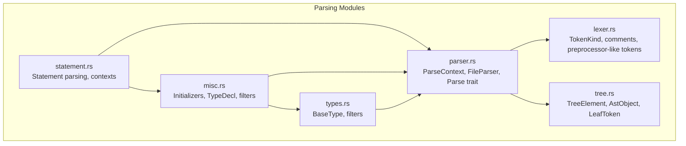
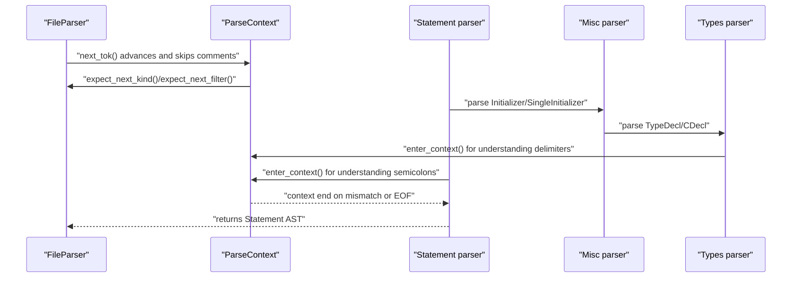
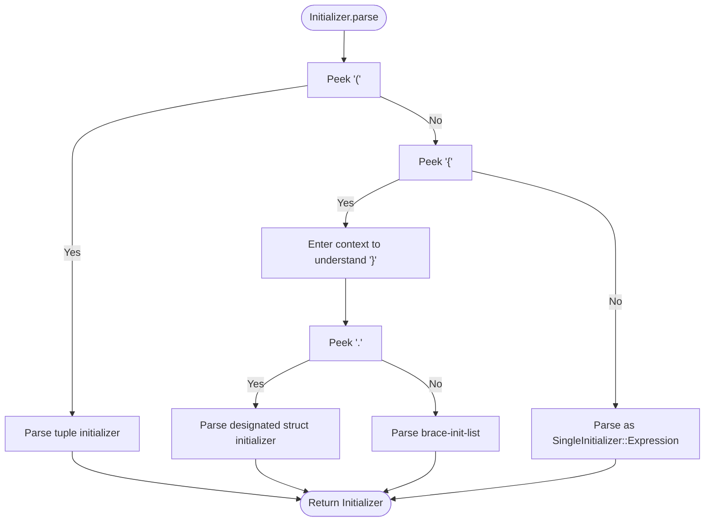
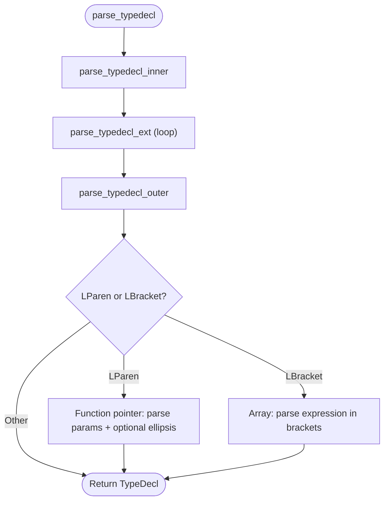
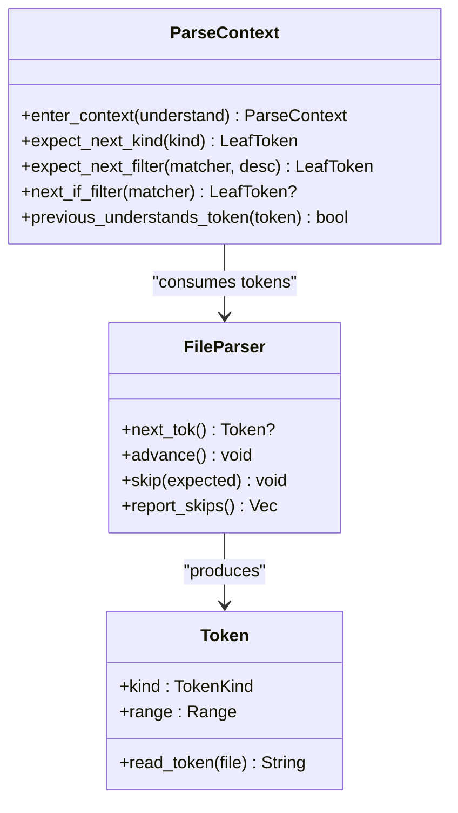
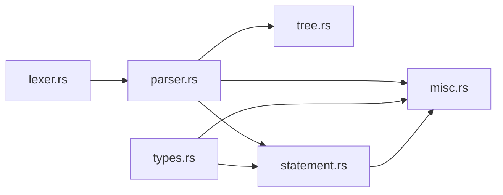

# Miscellaneous Parsing

<cite>
**Referenced Files in This Document**
- [misc.rs](file://src/analysis/parsing/misc.rs)
- [parser.rs](file://src/analysis/parsing/parser.rs)
- [lexer.rs](file://src/analysis/parsing/lexer.rs)
- [tree.rs](file://src/analysis/parsing/tree.rs)
- [types.rs](file://src/analysis/parsing/types.rs)
- [statement.rs](file://src/analysis/parsing/statement.rs)
- [mod.rs](file://src/analysis/parsing/mod.rs)
</cite>

## Table of Contents
1. [Introduction](#introduction)
2. [Project Structure](#project-structure)
3. [Core Components](#core-components)
4. [Architecture Overview](#architecture-overview)
5. [Detailed Component Analysis](#detailed-component-analysis)
6. [Dependency Analysis](#dependency-analysis)
7. [Performance Considerations](#performance-considerations)
8. [Troubleshooting Guide](#troubleshooting-guide)
9. [Conclusion](#conclusion)

## Introduction
This document describes the miscellaneous parsing utilities that support the main parsing phases in the DML language server. It focuses on helper parsing functions, utility methods, and common parsing patterns used across language constructs such as initializers, type declarations, and identifier filters. It also explains how these utilities integrate with the main parsing pipeline, manage shared parsing state, and participate in error handling and style checks.

## Project Structure
The parsing subsystem is organized into focused modules:
- parser: Core parsing primitives, contexts, and token handling
- lexer: Tokenization and comment handling
- tree: AST node abstractions and tree traversal utilities
- types: Basic type parsing and filters
- statement: Statement parsing with context management
- misc: Miscellaneous constructs like initializers, type declarations, and filters

**Diagram sources**
- [parser.rs](file://src/analysis/parsing/parser.rs#L1-L742)
- [lexer.rs](file://src/analysis/parsing/lexer.rs#L1-L657)
- [tree.rs](file://src/analysis/parsing/tree.rs#L1-L398)
- [types.rs](file://src/analysis/parsing/types.rs#L1-L726)
- [statement.rs](file://src/analysis/parsing/statement.rs#L1-L2773)
- [misc.rs](file://src/analysis/parsing/misc.rs#L1-L1120)

**Section sources**
- [mod.rs](file://src/analysis/parsing/mod.rs#L1-L16)

## Core Components
This section highlights the key miscellaneous parsing utilities and their roles.

- Initializer and SingleInitializer
  - Support both brace-init-lists and brace-init-structs, including designated initializers and ellipsis
  - Distinguish between list and structure forms and handle trailing commas consistently
  - Convert parenthesized expressions into initializer form when applicable

- TypeDecl and CDecl
  - Parse C-style declarators with arrays, function pointers, and parentheses
  - Support const/volatile-like modifiers and nested declarators
  - Provide name extraction and sanity checks for declarations

- Identifier Filters
  - ident_filter and objident_filter define valid identifiers for general and object contexts
  - Used broadly across statements, types, and misc parsing to constrain token acceptance

- Utility Functions
  - parse_decl_opt_ellipsis_aux: parse function parameter lists with optional ellipsis
  - parse_typedecl_*: recursive helpers to parse chained declarators and modifiers
  - parse_modified_typedecl: collect pointer/volatile-like modifiers before a type

These utilities are integrated into the main parsing pipeline via ParseContext and FileParser, ensuring robust error handling and context-aware parsing.

**Section sources**
- [misc.rs](file://src/analysis/parsing/misc.rs#L1-L1120)
- [types.rs](file://src/analysis/parsing/types.rs#L21-L30)
- [statement.rs](file://src/analysis/parsing/statement.rs#L1-L2773)

## Architecture Overview
The miscellaneous parsing utilities rely on a layered architecture:
- Lexer produces tokens, including comments and preprocessor-like tokens
- Parser manages contexts and token consumption, skipping whitespace/comments and handling unexpected tokens
- Tree module provides AST node abstractions and traversal
- Types and Misc modules build upon parser primitives to parse higher-level constructs
- Statement module orchestrates top-level statements and uses misc constructs

**Diagram sources**
- [parser.rs](file://src/analysis/parsing/parser.rs#L322-L480)
- [statement.rs](file://src/analysis/parsing/statement.rs#L36-L45)
- [misc.rs](file://src/analysis/parsing/misc.rs#L201-L283)
- [types.rs](file://src/analysis/parsing/types.rs#L527-L559)

## Detailed Component Analysis

### Initializer and SingleInitializer
Initializer supports:
- Brace-init-list: sequences of initializers separated by commas
- Brace-init-struct: designated initializers with dot-qualified fields and optional ellipsis
- Tuple initializer: parenthesized list of initializers
- Expression fallback: when ambiguity resolves to expression

Key behaviors:
- Uses nested contexts to distinguish brace-init-list vs brace-init-struct
- Handles trailing commas and ensures non-empty lists/structs
- Converts parenthesized expressions into initializer form when unambiguous

**Diagram sources**
- [misc.rs](file://src/analysis/parsing/misc.rs#L201-L283)

**Section sources**
- [misc.rs](file://src/analysis/parsing/misc.rs#L1-L283)

### TypeDecl and CDecl
TypeDecl parses C-style declarators:
- Base identifier or empty (None)
- Arrays: brackets with expressions
- Function pointers: parentheses with parameter lists and optional ellipsis
- Parentheses: grouping with modifiers

CDecl composes:
- Optional const
- BaseType
- Modifiers (pointers/volatiles)
- Declarator (TypeDecl)

Utility functions:
- parse_typedecl_inner/outer/ext: recursively parse chained declarators
- parse_modified_typedecl: collect modifiers before a type
- parse_decl_opt_ellipsis_aux: parse function parameter lists with optional ellipsis
- TypeDecl.get_name: extract identifier from nested declarators

**Diagram sources**
- [misc.rs](file://src/analysis/parsing/misc.rs#L469-L557)

**Section sources**
- [misc.rs](file://src/analysis/parsing/misc.rs#L285-L646)
- [types.rs](file://src/analysis/parsing/types.rs#L527-L559)

### Identifier Filters and Context Management
- ident_filter: accepts identifiers and a broad set of keywords treated as identifiers
- objident_filter: extends ident_filter to include register
- typeident_filter: accepts basic types plus identifiers

Context management:
- ParseContext.enter_context: create sub-contexts with custom token understanding
- ParseContext.expect_next_kind/expect_next_filter: consume tokens with robust error handling
- FileParser.advance: advances lexer, skipping whitespace and comments, tracking positions

**Diagram sources**
- [parser.rs](file://src/analysis/parsing/parser.rs#L48-L320)
- [parser.rs](file://src/analysis/parsing/parser.rs#L322-L480)
- [lexer.rs](file://src/analysis/parsing/lexer.rs#L98-L426)

**Section sources**
- [misc.rs](file://src/analysis/parsing/misc.rs#L647-L662)
- [types.rs](file://src/analysis/parsing/types.rs#L21-L30)
- [parser.rs](file://src/analysis/parsing/parser.rs#L48-L320)
- [parser.rs](file://src/analysis/parsing/parser.rs#L322-L480)

### Integration with Main Parsing Pipeline
- Statements use statement_contexts to create outer/inner contexts for semicolon understanding and expression parsing
- Initializers and type declarations are embedded within statements and expressions
- Style checks and post-parse sanity checks traverse the AST via TreeElement methods

Common patterns:
- Nested contexts to disambiguate constructs (e.g., brace-init-list vs struct)
- Robust token consumption with missing-token reporting
- Consistent handling of optional constructs and trailing commas

**Section sources**
- [statement.rs](file://src/analysis/parsing/statement.rs#L36-L45)
- [statement.rs](file://src/analysis/parsing/statement.rs#L1924-L1984)
- [tree.rs](file://src/analysis/parsing/tree.rs#L33-L120)

## Dependency Analysis
The miscellaneous parsing utilities depend on:
- parser.rs for token consumption and context management
- lexer.rs for token kinds and comment handling
- tree.rs for AST node abstractions and traversal
- types.rs for basic type parsing and filters

**Diagram sources**
- [lexer.rs](file://src/analysis/parsing/lexer.rs#L1-L657)
- [parser.rs](file://src/analysis/parsing/parser.rs#L1-L742)
- [tree.rs](file://src/analysis/parsing/tree.rs#L1-L398)
- [types.rs](file://src/analysis/parsing/types.rs#L1-L726)
- [statement.rs](file://src/analysis/parsing/statement.rs#L1-L2773)
- [misc.rs](file://src/analysis/parsing/misc.rs#L1-L1120)

**Section sources**
- [mod.rs](file://src/analysis/parsing/mod.rs#L1-L16)

## Performance Considerations
- Context nesting adds minimal overhead; use only when necessary to resolve ambiguity
- Token skipping is bounded and logged for diagnostics
- AST construction boxes content to avoid recursive type issues; this trades stack space for heap allocations
- Identifier filters are simple boolean checks; keep them fast and avoid heavy computations inside parsers

## Troubleshooting Guide
Common issues and resolutions:
- Unexpected token handling
  - Use ParseContext.expect_next_kind_custom to capture the reason for missing tokens
  - FileParser.skip logs skipped tokens for diagnostics
- Ambiguous constructs
  - Enter sub-contexts with understands_* predicates to guide parsing decisions
  - Prefer explicit context transitions for delimiters (e.g., semicolons, braces, parentheses)
- Missing identifiers
  - Apply ident_filter or objident_filter to constrain acceptable tokens
  - Ensure TypeDecl.get_name traverses nested declarators correctly

Diagnostic utilities:
- ParseContext.report_missing and TreeElement.report_missing propagate missing constructs
- FileParser.report_skips enumerates skipped tokens with expected descriptions

**Section sources**
- [parser.rs](file://src/analysis/parsing/parser.rs#L126-L207)
- [parser.rs](file://src/analysis/parsing/parser.rs#L461-L480)
- [tree.rs](file://src/analysis/parsing/tree.rs#L69-L76)
- [tree.rs](file://src/analysis/parsing/tree.rs#L273-L278)

## Conclusion
The miscellaneous parsing utilities provide essential building blocks for the DML language server’s parser. They encapsulate common patterns for initializers, type declarations, and identifier filtering, integrating seamlessly with the main parsing pipeline through robust context management and error handling. Their design emphasizes clarity, maintainability, and consistent behavior across diverse language constructs.