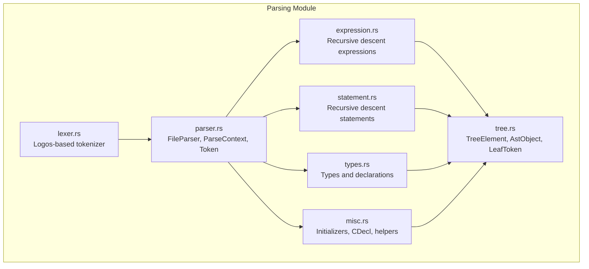
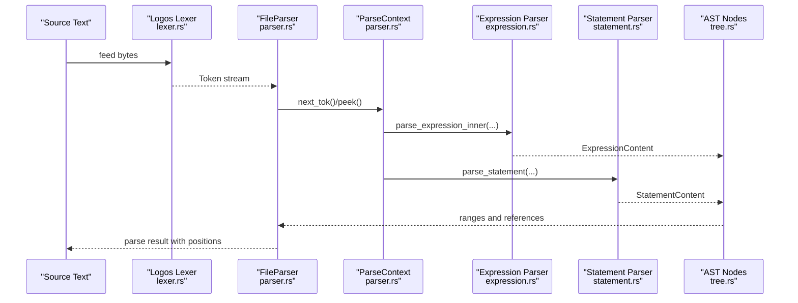
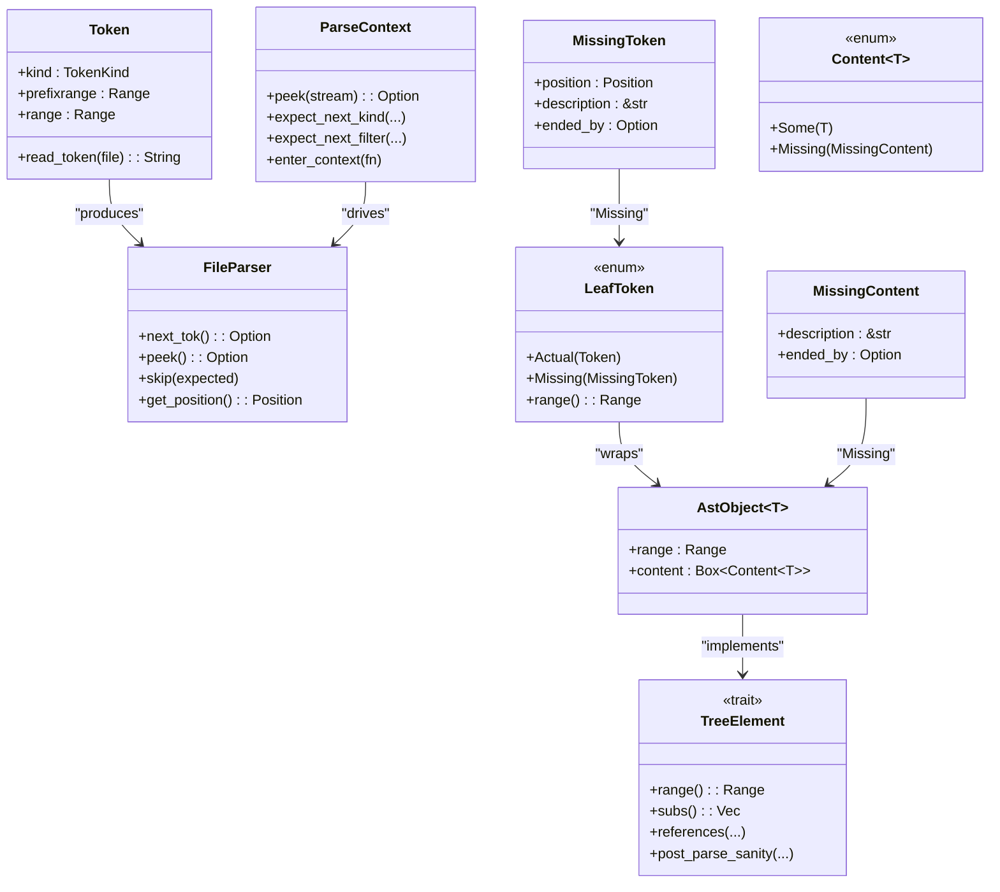
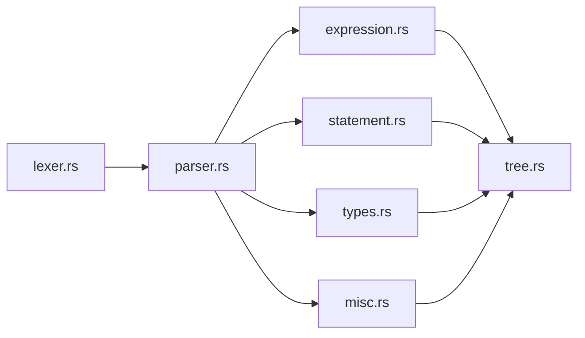

# Parsing System

<cite>
**Referenced Files in This Document**
- [lexer.rs](file://src/analysis/parsing/lexer.rs)
- [parser.rs](file://src/analysis/parsing/parser.rs)
- [tree.rs](file://src/analysis/parsing/tree.rs)
- [expression.rs](file://src/analysis/parsing/expression.rs)
- [statement.rs](file://src/analysis/parsing/statement.rs)
- [types.rs](file://src/analysis/parsing/types.rs)
- [misc.rs](file://src/analysis/parsing/misc.rs)
- [mod.rs](file://src/analysis/parsing/mod.rs)
</cite>

## Table of Contents
1. [Introduction](#introduction)
2. [Project Structure](#project-structure)
3. [Core Components](#core-components)
4. [Architecture Overview](#architecture-overview)
5. [Detailed Component Analysis](#detailed-component-analysis)
6. [Dependency Analysis](#dependency-analysis)
7. [Performance Considerations](#performance-considerations)
8. [Troubleshooting Guide](#troubleshooting-guide)
9. [Conclusion](#conclusion)

## Introduction
This document describes the DML parsing system, focusing on the lexical analysis and recursive descent parsing phases. It explains how the custom lexer built with the Logos crate tokenizes DML input, how lookahead-driven parsing constructs an Abstract Syntax Tree (AST), and how error recovery preserves usability for large files. It also documents AST node types, the tree element hierarchy, and position tracking, and provides concrete examples of token streams and parse trees.

## Project Structure
The parsing subsystem resides under src/analysis/parsing and exposes a cohesive pipeline:
- Lexical analysis: tokenization rules and reserved word handling
- Parsing: recursive descent with lookahead and context-aware recovery
- AST construction: strongly typed nodes with position metadata
- Grammar coverage: expressions, statements, declarations, and types

**Diagram sources**
- [lexer.rs](file://src/analysis/parsing/lexer.rs#L98-L426)
- [parser.rs](file://src/analysis/parsing/parser.rs#L16-L480)
- [tree.rs](file://src/analysis/parsing/tree.rs#L14-L398)
- [expression.rs](file://src/analysis/parsing/expression.rs#L1-L2186)
- [statement.rs](file://src/analysis/parsing/statement.rs#L1-L2773)
- [types.rs](file://src/analysis/parsing/types.rs#L1-L726)
- [misc.rs](file://src/analysis/parsing/misc.rs#L1-L1120)

**Section sources**
- [mod.rs](file://src/analysis/parsing/mod.rs#L1-L16)

## Core Components
- TokenKind and lexer rules define DML’s terminal vocabulary, including operators, literals, keywords, and special constructs.
- FileParser wraps a Logos lexer, tracks positions, advances across whitespace/comments, and yields Tokens with precise ranges.
- ParseContext manages lookahead, context-aware understanding of tokens, and controlled error recovery.
- TreeElement and AstObject form the AST, carrying ranges and references, enabling post-parse sanity checks and style rules.

Key responsibilities:
- Tokenization: [lexer.rs](file://src/analysis/parsing/lexer.rs#L98-L426)
- Streaming and positioning: [parser.rs](file://src/analysis/parsing/parser.rs#L322-L480)
- AST nodes and ranges: [tree.rs](file://src/analysis/parsing/tree.rs#L14-L398)
- Recursive descent: [expression.rs](file://src/analysis/parsing/expression.rs#L1109-L1176), [statement.rs](file://src/analysis/parsing/statement.rs#L1-L2773)

**Section sources**
- [lexer.rs](file://src/analysis/parsing/lexer.rs#L98-L426)
- [parser.rs](file://src/analysis/parsing/parser.rs#L16-L480)
- [tree.rs](file://src/analysis/parsing/tree.rs#L14-L398)

## Architecture Overview
The pipeline proceeds from tokenization to parsing to AST construction, with robust error recovery and position tracking.

**Diagram sources**
- [lexer.rs](file://src/analysis/parsing/lexer.rs#L98-L426)
- [parser.rs](file://src/analysis/parsing/parser.rs#L322-L480)
- [expression.rs](file://src/analysis/parsing/expression.rs#L1109-L1176)
- [statement.rs](file://src/analysis/parsing/statement.rs#L1-L2773)
- [tree.rs](file://src/analysis/parsing/tree.rs#L14-L398)

## Detailed Component Analysis

### Lexical Analysis Phase
- TokenKind enumerates terminals, including operators, punctuation, keywords, and literals.
- Reserved word filtering ensures identifiers conform to DML’s reserved sets.
- Special handlers:
  - Multiline comments and C blocks advance the lexer while updating line/column.
  - Whitespace and newline handling updates position tracking.
- Token classification:
  - Keywords: DML-specific and C/C++ reserved words.
  - Operators: arithmetic, bitwise, logical, assignment, ternary, and punctuators.
  - Literals: integers, floats, hex/binary, strings, and characters.
  - Identifiers: validated via reserved filter.

Concrete examples:
- Token stream for “5+5=10”:
  - IntConstant, Plus, IntConstant, Assign, IntConstant
- Token stream for “method foo() { ... }”:
  - Method keyword, whitespace, Identifier, LParen, RParen, whitespace, LBrace, newline, …, RBrace
- Multiline comment handling:
  - “/* ** **/” and “/* \n* / * \n */” are recognized as a single MultilineComment token.

**Section sources**
- [lexer.rs](file://src/analysis/parsing/lexer.rs#L5-L426)

### Recursive Descent Parsing Algorithm
- FileParser advances tokens, skipping whitespace and comments, and maintains precise positions.
- ParseContext supports:
  - Peek and lookahead filters
  - Expect-next semantics with descriptions
  - Context-aware recovery: skips unexpected tokens if no higher context understands them; otherwise ends current context and records MissingToken.
- Expression grammar:
  - Precedence-driven descent: extended, mul/div/mod, add/sub, shift, comparison, equality, bitwise, logic-and, logic-or, ternary.
  - Continuation parsing for postfix/post-unary, indexing/slicing, member access, and function calls.
- Statement grammar:
  - Control flow, compound blocks, variable declarations, assignments, and special forms (assert, error, throw, hash-if).
  - For loops support complex pre/post elements and tuple-like constructs.

Concrete examples:
- Expression “a+(5-4)+3” builds nested BinaryExpression and ParenExpression nodes.
- Function call “foo(5, a)” produces FunctionCall with arguments.
- Cast “cast(5, uint64)” produces Cast node with from/to typed expressions.
- Index chaining “foo[2+3][11]” produces chained Index nodes.
- Slices “a[4:5]”, “a[4:5, be]”, “a[4, le]” produce Slice nodes with optional right slice and bitorder.

**Section sources**
- [parser.rs](file://src/analysis/parsing/parser.rs#L322-L480)
- [expression.rs](file://src/analysis/parsing/expression.rs#L809-L1176)
- [statement.rs](file://src/analysis/parsing/statement.rs#L1-L2773)

### AST Node Types and Tree Element Hierarchy
- Token carries kind, prefixrange, and range.
- LeafToken wraps either an Actual(Token) or Missing(MissingToken) with position and reason.
- AstObject<T> boxes Content<T> with range and missing handling.
- TreeElement defines range(), subs(), references(), and post-parse walks for sanity checks and style rules.
- ExpressionContent, StatementContent, Type/Decl content types implement TreeElement and define subs() and evaluation hooks.

**Diagram sources**
- [parser.rs](file://src/analysis/parsing/parser.rs#L16-L480)
- [tree.rs](file://src/analysis/parsing/tree.rs#L234-L398)

**Section sources**
- [tree.rs](file://src/analysis/parsing/tree.rs#L14-L398)

### Position Tracking System
- FileParser tracks current_line/current_column and previous_line/previous_column.
- Advance logic handles newline, whitespace, multiline comments, and C blocks, updating positions accordingly.
- Token stores both prefixrange (from previous end) and range (inclusive of token text), enabling precise spans.

Examples:
- Comments across lines update current_line and compute end column.
- C blocks preserve accurate start/end positions across multi-line content.

**Section sources**
- [parser.rs](file://src/analysis/parsing/parser.rs#L352-L480)

### Error Recovery Mechanisms
- ParseContext.end_context records the position and token where a context ended, producing MissingToken.
- If a lower-level context understands the token, the current context ends; otherwise, FileParser.skip logs the skipped token with expected description.
- Skipped tokens are retrievable via FileParser.report_skips for diagnostics.

Concrete example:
- In a scoped context expecting “}”, encountering “;” causes end_context and MissingToken creation; subsequent tokens are skipped until a higher context can consume them.

**Section sources**
- [parser.rs](file://src/analysis/parsing/parser.rs#L48-L320)

### Relationship Between Lexical and Syntactic Phases
- The lexer emits TokenKind tokens; FileParser consumes them and updates positions.
- ParseContext uses TokenKind filters to guide lookahead and recovery.
- AST nodes carry ranges derived from Token ranges, preserving source fidelity.

**Section sources**
- [lexer.rs](file://src/analysis/parsing/lexer.rs#L98-L426)
- [parser.rs](file://src/analysis/parsing/parser.rs#L322-L480)
- [tree.rs](file://src/analysis/parsing/tree.rs#L14-L398)

### Performance Optimizations for Large Files
- Logos-based lexer is efficient and integrates seamlessly with FileParser.
- Position tracking avoids expensive recomputation by advancing counters per token slice.
- Recursive descent uses lookahead and context gating to minimize backtracking.
- AST nodes box content to avoid deep recursion overhead in type definitions.

[No sources needed since this section provides general guidance]

### Extensibility Points for New Language Constructs
- Add new TokenKind variants in TokenKind and refine TokenKind::description for diagnostics.
- Extend Parse implementations for new AST node types; implement TreeElement to integrate with references and style checks.
- Add new precedence levels by introducing new maybe_parse_*_expression functions and wiring them into the chain.
- Use ParseContext.enter_context to gate lookahead and recover gracefully when encountering unexpected tokens.

**Section sources**
- [lexer.rs](file://src/analysis/parsing/lexer.rs#L98-L426)
- [expression.rs](file://src/analysis/parsing/expression.rs#L809-L1176)
- [tree.rs](file://src/analysis/parsing/tree.rs#L14-L398)

## Dependency Analysis
The parsing module composes tightly around a small set of core abstractions.

**Diagram sources**
- [lexer.rs](file://src/analysis/parsing/lexer.rs#L98-L426)
- [parser.rs](file://src/analysis/parsing/parser.rs#L16-L480)
- [expression.rs](file://src/analysis/parsing/expression.rs#L1-L2186)
- [statement.rs](file://src/analysis/parsing/statement.rs#L1-L2773)
- [types.rs](file://src/analysis/parsing/types.rs#L1-L726)
- [misc.rs](file://src/analysis/parsing/misc.rs#L1-L1120)
- [tree.rs](file://src/analysis/parsing/tree.rs#L14-L398)

**Section sources**
- [mod.rs](file://src/analysis/parsing/mod.rs#L1-L16)

## Performance Considerations
- Prefer lookahead-based decisions to reduce backtracking.
- Keep token regexes unambiguous with single-token lookahead where possible; use custom handlers sparingly.
- Avoid excessive boxing; use tuples and Vecs judiciously in AST nodes.
- Leverage FileParser’s buffered next_token to minimize repeated lexer calls.

[No sources needed since this section provides general guidance]

## Troubleshooting Guide
Common issues and resolutions:
- Unexpected token errors:
  - Inspect FileParser.report_skips for logged skipped tokens and expected descriptions.
  - Review ParseContext.end_context logs to locate where contexts ended.
- Missing tokens:
  - Check MissingToken fields (position, description, ended_by) to understand recovery points.
- Position mismatches:
  - Verify newline and comment handling in FileParser.advance; ensure regex captures for multiline constructs are correct.

**Section sources**
- [parser.rs](file://src/analysis/parsing/parser.rs#L472-L480)
- [parser.rs](file://src/analysis/parsing/parser.rs#L126-L150)

## Conclusion
The DML parsing system combines a robust Logos-based lexer with a context-aware recursive descent parser and a strongly typed AST. It provides precise position tracking, comprehensive error recovery, and extensible grammar coverage suitable for large-scale DML files. The modular design enables straightforward additions of new constructs while maintaining performance and reliability.