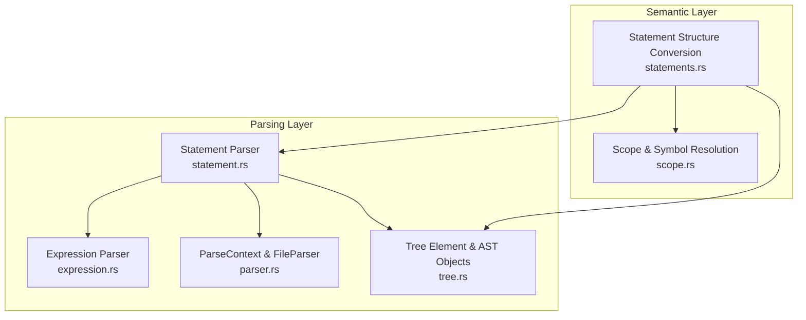
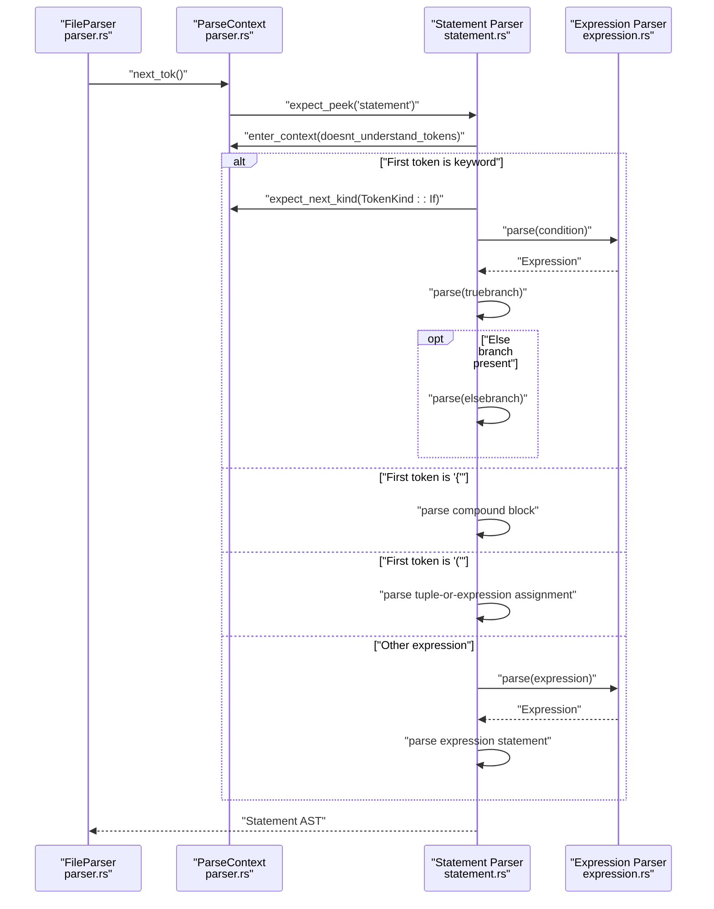
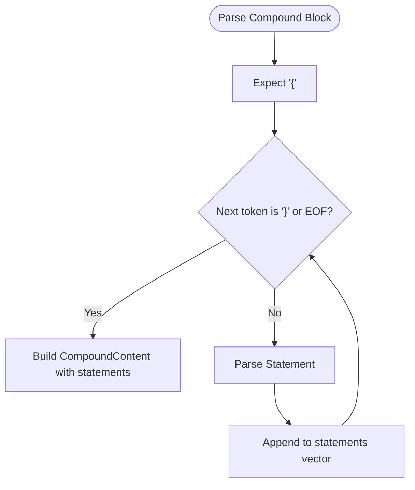
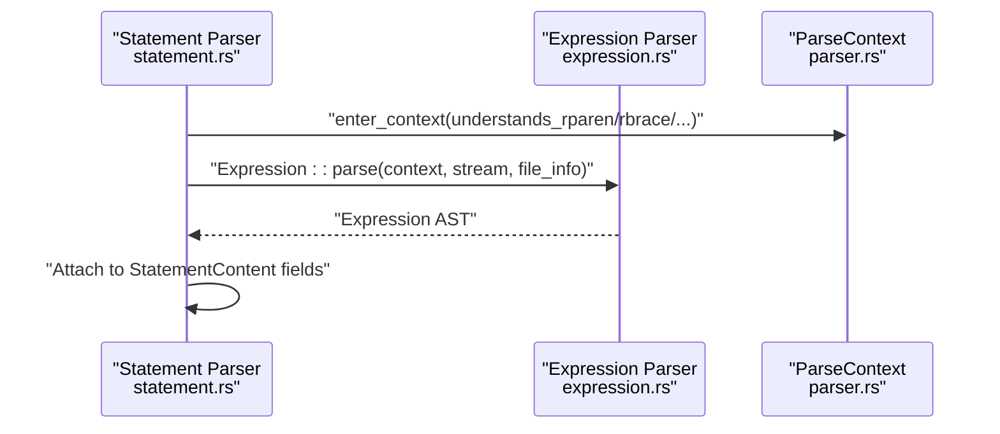
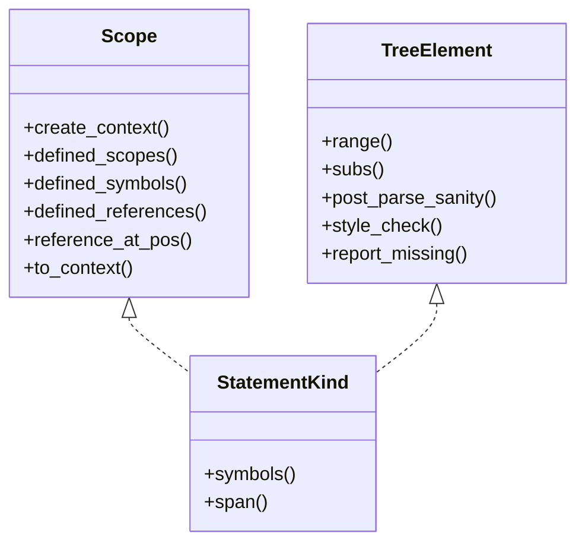
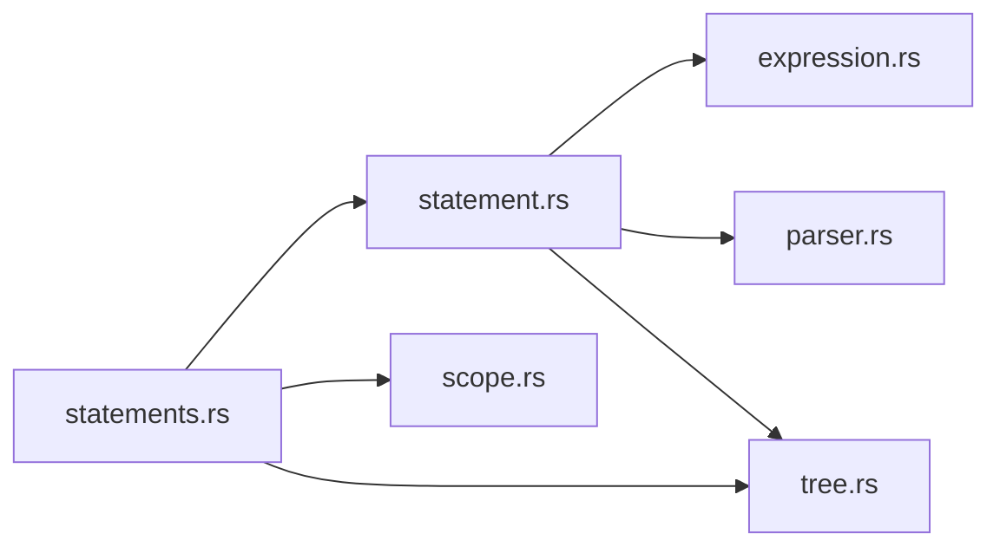

```mermaid
classDiagram
class StatementContent {
+range()
+subs()
+post_parse_sanity()
+style_check()
}
class VariableDeclContent
class AssignContent
class AssignOpContent
class IfContent
class WhileContent
class DoContent
class ForContent
class SwitchContent
class TryContent
class AfterContent
class LogContent
class HashSelectContent
class ForeachContent
class ThrowContent
class ContinueContent
class BreakContent
class ReturnContent
class ExpressionStmtContent
class AssertContent
class DeleteContent
class ErrorContent
class CompoundContent
StatementContent <|-- VariableDeclContent
StatementContent <|-- AssignContent
StatementContent <|-- AssignOpContent
StatementContent <|-- IfContent
StatementContent <|-- WhileContent
StatementContent <|-- DoContent
StatementContent <|-- ForContent
StatementContent <|-- SwitchContent
StatementContent <|-- TryContent
StatementContent <|-- AfterContent
StatementContent <|-- LogContent
StatementContent <|-- HashSelectContent
StatementContent <|-- ForeachContent
StatementContent <|-- ThrowContent
StatementContent <|-- ContinueContent
StatementContent <|-- BreakContent
StatementContent <|-- ReturnContent
StatementContent <|-- ExpressionStmtContent
StatementContent <|-- AssertContent
StatementContent <|-- DeleteContent
StatementContent <|-- ErrorContent
StatementContent <|-- CompoundContent
```

# Statement Parsing

<cite>
**Referenced Files in This Document**
- [statement.rs](file://src/analysis/parsing/statement.rs)
- [parser.rs](file://src/analysis/parsing/parser.rs)
- [tree.rs](file://src/analysis/parsing/tree.rs)
- [statements.rs](file://src/analysis/structure/statements.rs)
- [expression.rs](file://src/analysis/parsing/expression.rs)
- [scope.rs](file://src/analysis/scope.rs)
</cite>

## Table of Contents
1. [Introduction](#introduction)
2. [Project Structure](#project-structure)
3. [Core Components](#core-components)
4. [Architecture Overview](#architecture-overview)
5. [Detailed Component Analysis](#detailed-component-analysis)
6. [Dependency Analysis](#dependency-analysis)
7. [Performance Considerations](#performance-considerations)
8. [Troubleshooting Guide](#troubleshooting-guide)
9. [Conclusion](#conclusion)

## Introduction
This document explains statement parsing in the DML language, focusing on how statements are recognized, parsed, validated, and transformed into an abstract syntax tree (AST). It covers supported statement categories (variable declarations, assignments, control flow, function calls, compound blocks), block handling, statement sequencing, integration with expression parsing, scope handling, validation rules, error recovery, and the relationship to subsequent semantic analysis. Special DML constructs such as after statements, logging, switch-case, foreach, and hash-select are documented alongside their unique parsing requirements.

## Project Structure
Statement parsing is implemented in the parsing layer and integrates with expression parsing and AST structure conversion for semantic analysis. The key modules involved are:
- Statement parsing and AST node definitions
- Parser context and token consumption utilities
- AST tree element interface and missing token reporting
- Statement-to-structure conversion for semantic analysis
- Expression parsing integration and operator precedence handling
- Scope handling for symbol resolution and scoping rules

**Diagram sources**
- [statement.rs](file://src/analysis/parsing/statement.rs#L1766-L1852)
- [parser.rs](file://src/analysis/parsing/parser.rs#L48-L320)
- [tree.rs](file://src/analysis/parsing/tree.rs#L33-L120)
- [statements.rs](file://src/analysis/structure/statements.rs#L1110-L1245)
- [scope.rs](file://src/analysis/scope.rs#L13-L62)

**Section sources**
- [statement.rs](file://src/analysis/parsing/statement.rs#L1766-L1852)
- [parser.rs](file://src/analysis/parsing/parser.rs#L48-L320)
- [tree.rs](file://src/analysis/parsing/tree.rs#L33-L120)
- [statements.rs](file://src/analysis/structure/statements.rs#L1110-L1245)
- [scope.rs](file://src/analysis/scope.rs#L13-L62)

## Core Components
- Statement AST nodes: A discriminated union enumerates all statement forms (compound blocks, variable declarations, assignments, control flow, function calls, after/log, switch/hash-if/hash-select/foreach, throw/break/continue/return, error/assert/delete, and expression statements).
- Parser context: A context-aware token consumer that tracks boundaries and handles missing tokens gracefully, enabling robust error recovery.
- Tree element interface: Provides range computation, subtree traversal, missing token reporting, style checks, and reference collection.
- Statement-to-structure conversion: Translates parsed statements into semantic structures for downstream analysis (scopes, symbols, type checking).

Key responsibilities:
- Recognize first-token matchers for statements and expressions
- Delegate to expression parser for operands and sub-expressions
- Enforce validation rules and post-parse sanity checks
- Convert to semantic structures for symbol and scope analysis

**Section sources**
- [statement.rs](file://src/analysis/parsing/statement.rs#L1766-L1852)
- [parser.rs](file://src/analysis/parsing/parser.rs#L48-L320)
- [tree.rs](file://src/analysis/parsing/tree.rs#L33-L120)
- [statements.rs](file://src/analysis/structure/statements.rs#L1110-L1245)

## Architecture Overview
The statement parser composes with the expression parser and uses context-aware token consumption to parse statements and their subcomponents. Each statement node implements the tree element interface for range calculation, missing token reporting, and style checks. The semantic layer converts the parsed AST into structures suitable for symbol and scope analysis.

**Diagram sources**
- [parser.rs](file://src/analysis/parsing/parser.rs#L58-L320)
- [statement.rs](file://src/analysis/parsing/statement.rs#L1924-L1984)
- [expression.rs](file://src/analysis/parsing/expression.rs#L183-L200)

## Detailed Component Analysis

### Statement Categories and Parsing Logic
- Variable declarations: Parses local/session/saved declarations with optional initializers and enforces named declarations.
- Assignments: Supports single and chained assignments, tuple-target assignments, and assignment operators (+=, -=, etc.).
- Control flow: if/else, while, do-while, for, switch/hash-if/hash-select/foreach, try-catch, continue/break/return.
- Function calls and expressions: Expression statements and after/log statements integrate with expression parsing.
- Special statements: assert, throw, delete, error.

**Diagram sources**
- [statement.rs](file://src/analysis/parsing/statement.rs#L1766-L1852)

**Section sources**
- [statement.rs](file://src/analysis/parsing/statement.rs#L187-L230)
- [statement.rs](file://src/analysis/parsing/statement.rs#L232-L294)
- [statement.rs](file://src/analysis/parsing/statement.rs#L296-L408)
- [statement.rs](file://src/analysis/parsing/statement.rs#L410-L469)
- [statement.rs](file://src/analysis/parsing/statement.rs#L529-L575)
- [statement.rs](file://src/analysis/parsing/statement.rs#L577-L632)
- [statement.rs](file://src/analysis/parsing/statement.rs#L838-L911)
- [statement.rs](file://src/analysis/parsing/statement.rs#L1091-L1159)
- [statement.rs](file://src/analysis/parsing/statement.rs#L1161-L1199)
- [statement.rs](file://src/analysis/parsing/statement.rs#L1297-L1400)
- [statement.rs](file://src/analysis/parsing/statement.rs#L1459-L1506)
- [statement.rs](file://src/analysis/parsing/statement.rs#L1549-L1589)
- [statement.rs](file://src/analysis/parsing/statement.rs#L1625-L1650)
- [statement.rs](file://src/analysis/parsing/statement.rs#L1652-L1743)
- [statement.rs](file://src/analysis/parsing/statement.rs#L1745-L1791)

### Block Handling and Statement Sequencing
- Compound blocks: Enclosed by braces, sequences statements until a closing brace is encountered. The block’s range spans opening and closing braces.
- Statement sequencing: Statements are parsed in sequence within blocks or control-flow bodies. The parser uses context-aware token understanding to detect terminators and boundaries.

**Diagram sources**
- [statement.rs](file://src/analysis/parsing/statement.rs#L134-L185)

**Section sources**
- [statement.rs](file://src/analysis/parsing/statement.rs#L134-L185)

### Integration with Expression Parsing
- Expression operands: All statements embed expressions for conditions, assignments, function calls, and log messages. The expression parser is invoked within statement parsers to construct operand subtrees.
- Operator precedence: Expression parsing resolves precedence and associativity; statement parsers delegate to it for operands.
- Parentheses and tuples: Special handling for parentheses and tuple expressions enables tuple-target assignments.

**Diagram sources**
- [statement.rs](file://src/analysis/parsing/statement.rs#L454-L456)
- [statement.rs](file://src/analysis/parsing/statement.rs#L822-L828)
- [statement.rs](file://src/analysis/parsing/statement.rs#L1892-L1900)
- [expression.rs](file://src/analysis/parsing/expression.rs#L183-L200)

**Section sources**
- [statement.rs](file://src/analysis/parsing/statement.rs#L454-L456)
- [statement.rs](file://src/analysis/parsing/statement.rs#L822-L828)
- [statement.rs](file://src/analysis/parsing/statement.rs#L1892-L1900)
- [expression.rs](file://src/analysis/parsing/expression.rs#L183-L200)

### Scope Handling and Statement Validation
- Scope creation: Semantic structures expose defined scopes and symbols for nested contexts. Scopes are used during symbol resolution and reference matching.
- Validation rules: Tree elements implement post-parse sanity checks and style checks to enforce language rules (spacing, indentation, reserved word usage).
- Missing tokens: The tree element interface reports missing tokens and aggregates diagnostics for downstream linting and error reporting.

**Diagram sources**
- [scope.rs](file://src/analysis/scope.rs#L13-L62)
- [statements.rs](file://src/analysis/structure/statements.rs#L1110-L1186)
- [tree.rs](file://src/analysis/parsing/tree.rs#L33-L120)

**Section sources**
- [scope.rs](file://src/analysis/scope.rs#L13-L62)
- [statements.rs](file://src/analysis/structure/statements.rs#L1110-L1186)
- [tree.rs](file://src/analysis/parsing/tree.rs#L33-L120)

### Statement AST Construction Examples
- Expression statement: An expression followed by a semicolon becomes an expression statement.
- Assignment: Supports single target, tuple target, and chained assignments.
- Control flow: if/else, while, do-while, for, switch/hash-if/hash-select/foreach.
- Special statements: assert, throw, delete, error.

Examples are validated via unit tests that construct expected ASTs and compare ranges and node structures.

**Section sources**
- [statement.rs](file://src/analysis/parsing/statement.rs#L1854-L1908)
- [statement.rs](file://src/analysis/parsing/statement.rs#L1924-L1984)
- [statement.rs](file://src/analysis/parsing/statement.rs#L2016-L2191)
- [statement.rs](file://src/analysis/parsing/statement.rs#L2194-L2257)
- [statement.rs](file://src/analysis/parsing/statement.rs#L2391-L2454)

### Error Recovery for Malformed Statements
- Missing tokens: When a required token is absent, the parser records a missing token with a description and the token that ended the context.
- Skipped tokens: Unknown tokens are skipped and tracked for diagnostics.
- Graceful degradation: Missing subtrees are represented as missing content, preserving overall AST structure for further analysis.

**Section sources**
- [parser.rs](file://src/analysis/parsing/parser.rs#L126-L150)
- [parser.rs](file://src/analysis/parsing/parser.rs#L170-L207)
- [parser.rs](file://src/analysis/parsing/parser.rs#L257-L292)
- [tree.rs](file://src/analysis/parsing/tree.rs#L314-L376)

### Relationship to Semantic Analysis
- Conversion to structures: Parsed statements are converted into semantic structures (e.g., If, While, For, Switch, Assign, etc.) for symbol and scope analysis.
- Symbol containers: Structures implement symbol containers to expose identifiers and nested scopes.
- Post-parse sanity: Semantic structures perform validation and sanity checks aligned with language semantics.

**Section sources**
- [statements.rs](file://src/analysis/structure/statements.rs#L815-L847)
- [statements.rs](file://src/analysis/structure/statements.rs#L888-L907)
- [statements.rs](file://src/analysis/structure/statements.rs#L956-L975)
- [statements.rs](file://src/analysis/structure/statements.rs#L1017-L1041)
- [statements.rs](file://src/analysis/structure/statements.rs#L1061-L1074)
- [statements.rs](file://src/analysis/structure/statements.rs#L1088-L1100)
- [statements.rs](file://src/analysis/structure/statements.rs#L1188-L1245)

## Dependency Analysis
Statement parsing depends on:
- Parser context and token consumption utilities for robust parsing and error recovery
- Expression parsing for operands and sub-expressions
- Tree element interface for AST structure, missing token reporting, and style checks
- Semantic conversion for transforming parsed statements into structures for analysis

**Diagram sources**
- [statement.rs](file://src/analysis/parsing/statement.rs#L1-L50)
- [parser.rs](file://src/analysis/parsing/parser.rs#L48-L320)
- [tree.rs](file://src/analysis/parsing/tree.rs#L33-L120)
- [statements.rs](file://src/analysis/structure/statements.rs#L1-L30)
- [scope.rs](file://src/analysis/scope.rs#L13-L62)

**Section sources**
- [statement.rs](file://src/analysis/parsing/statement.rs#L1-L50)
- [parser.rs](file://src/analysis/parsing/parser.rs#L48-L320)
- [tree.rs](file://src/analysis/parsing/tree.rs#L33-L120)
- [statements.rs](file://src/analysis/structure/statements.rs#L1-L30)
- [scope.rs](file://src/analysis/scope.rs#L13-L62)

## Performance Considerations
- Context-aware parsing minimizes backtracking by limiting lookahead to specific token sets.
- Early termination on encountering end-of-context tokens reduces unnecessary parsing.
- Expression parsing leverages precedence-driven recursion to avoid redundant checks.
- Missing token reporting avoids full AST reconstruction overhead by marking missing subtrees succinctly.

## Troubleshooting Guide
Common issues and remedies:
- Unexpected token errors: Inspect skipped tokens and missing token diagnostics reported by the parser and tree element interface.
- Missing semicolons or braces: Verify context understanding functions and ensure proper termination detection.
- Ambiguous parentheses: Distinguish between parenthesized expressions and tuple-target assignments; ensure correct handling of comma-separated lists.
- Style violations: Review style checks applied during tree element evaluation and adjust spacing/indentation accordingly.

**Section sources**
- [parser.rs](file://src/analysis/parsing/parser.rs#L461-L480)
- [tree.rs](file://src/analysis/parsing/tree.rs#L69-L76)
- [statement.rs](file://src/analysis/parsing/statement.rs#L1892-L1900)

## Conclusion
Statement parsing in DML integrates tightly with expression parsing and provides robust error recovery through context-aware token consumption and missing token reporting. The AST supports comprehensive statement coverage, including control flow, assignments, function calls, and specialized constructs. Conversion to semantic structures enables symbol and scope analysis, ensuring accurate downstream processing. The modular design allows for incremental enhancements and precise diagnostics.