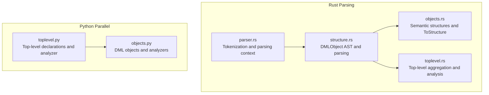
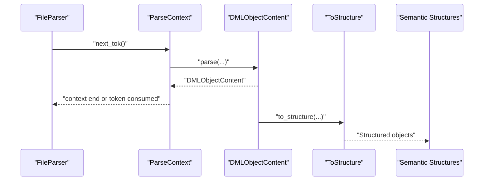
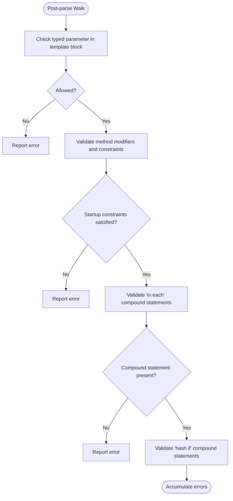
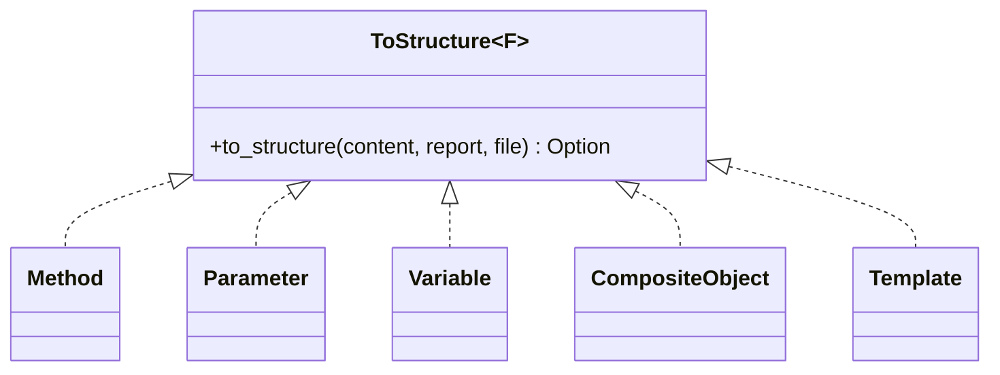
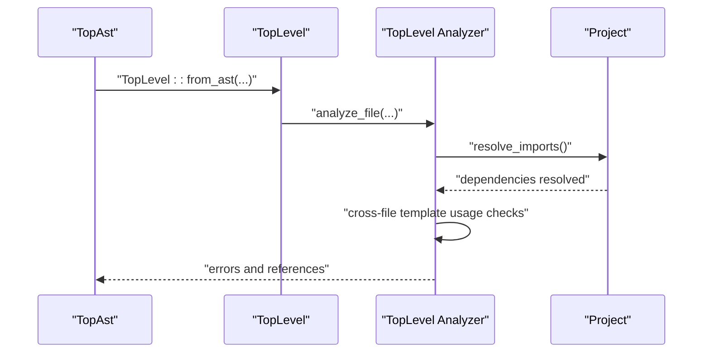
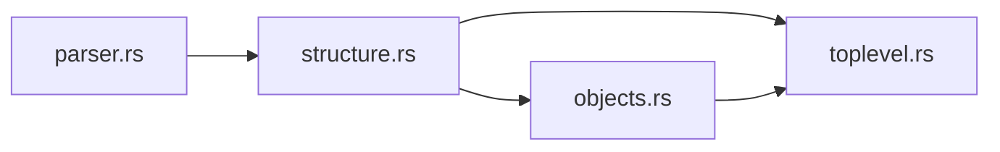

# Structure Parsing

<cite>
**Referenced Files in This Document**
- [structure.rs](file://src/analysis/parsing/structure.rs)
- [parser.rs](file://src/analysis/parsing/parser.rs)
- [objects.rs](file://src/analysis/structure/objects.rs)
- [toplevel.rs](file://src/analysis/structure/toplevel.rs)
- [toplevel.py](file://python-port/dml_language_server/analysis/structure/toplevel.py)
- [objects.py](file://python-port/dml_language_server/analysis/structure/objects.py)
</cite>

## Table of Contents
1. [Introduction](#introduction)
2. [Project Structure](#project-structure)
3. [Core Components](#core-components)
4. [Architecture Overview](#architecture-overview)
5. [Detailed Component Analysis](#detailed-component-analysis)
6. [Dependency Analysis](#dependency-analysis)
7. [Performance Considerations](#performance-considerations)
8. [Troubleshooting Guide](#troubleshooting-guide)
9. [Conclusion](#conclusion)

## Introduction
This document explains the DML structure parsing subsystem, focusing on how top-level constructs, object declarations, inheritance relationships, and structural elements are parsed and validated. It covers the parsing pipeline integration, structural type checking, and error handling for malformed structures. It also demonstrates how structure parsing integrates with semantic analysis for type checking and symbol resolution.

## Project Structure
The structure parsing system spans both Rust and Python implementations:
- Rust: Core parsing and semantic analysis live under src/analysis/parsing and src/analysis/structure.
- Python: Parallel structure analysis resides under python-port/dml_language_server/analysis/structure.

Key areas:
- Parsing pipeline: Tokenization, context-aware parsing, and AST construction.
- Structure conversion: Transformation from parse-time AST nodes to semantic structures.
- Top-level orchestration: Aggregation of top-level declarations and cross-file analysis.

**Diagram sources**
- [parser.rs](file://src/analysis/parsing/parser.rs#L1-L120)
- [structure.rs](file://src/analysis/parsing/structure.rs#L1935-L2066)
- [objects.rs](file://src/analysis/structure/objects.rs#L1-L120)
- [toplevel.rs](file://src/analysis/structure/toplevel.rs#L546-L625)
- [toplevel.py](file://python-port/dml_language_server/analysis/structure/toplevel.py#L156-L208)
- [objects.py](file://python-port/dml_language_server/analysis/structure/objects.py#L67-L113)

**Section sources**
- [parser.rs](file://src/analysis/parsing/parser.rs#L1-L120)
- [structure.rs](file://src/analysis/parsing/structure.rs#L1935-L2066)
- [objects.rs](file://src/analysis/structure/objects.rs#L1-L120)
- [toplevel.rs](file://src/analysis/structure/toplevel.rs#L546-L625)
- [toplevel.py](file://python-port/dml_language_server/analysis/structure/toplevel.py#L156-L208)
- [objects.py](file://python-port/dml_language_server/analysis/structure/objects.py#L67-L113)

## Core Components
- ParseContext and FileParser: Provide token-level parsing with context-aware lookahead and error recovery.
- DMLObjectContent and DMLObject: Define the AST for DML structures (objects, methods, parameters, variables, etc.).
- ToStructure trait: Converts parse-time AST nodes into semantic structures for downstream analysis.
- Top-level aggregator: Transforms raw AST into a structured TopLevel view for symbol and scope analysis.

Key capabilities:
- Robust token skipping and context termination to recover from malformed input.
- Strict validation rules embedded in AST nodes via post-parse sanity checks.
- Semantic conversion with type reconstruction and symbol/scope creation.

**Section sources**
- [parser.rs](file://src/analysis/parsing/parser.rs#L48-L320)
- [structure.rs](file://src/analysis/parsing/structure.rs#L1818-L1951)
- [objects.rs](file://src/analysis/structure/objects.rs#L32-L39)

## Architecture Overview
The parsing pipeline proceeds as follows:
1. Tokenization and streaming via FileParser.
2. Context-driven parsing using ParseContext to recognize boundaries and recover gracefully.
3. Construction of DMLObjectContent AST nodes for each top-level construct.
4. Post-parse sanity checks to enforce structural constraints.
5. Conversion to semantic structures via ToStructure implementations.
6. Top-level aggregation and cross-file analysis.

**Diagram sources**
- [parser.rs](file://src/analysis/parsing/parser.rs#L322-L480)
- [structure.rs](file://src/analysis/parsing/structure.rs#L1953-L2066)
- [objects.rs](file://src/analysis/structure/objects.rs#L32-L39)

## Detailed Component Analysis

### DMLObject AST and Parsing
DMLObjectContent enumerates all top-level constructs: composite objects (registers, fields, banks, groups, etc.), methods, parameters, variables (session/saved/extern), constants, typedefs, hooks, imports, exports, headers/footers, errors, and more. Each variant encapsulates the parsed tokens and expressions required to reconstruct semantic structures later.

Parsing logic:
- A top-level dispatcher recognizes the first token and delegates to the appropriate content parser.
- Context-aware parsing ensures correct handling of nested constructs and recovery from unexpected tokens.

Validation:
- Many content types embed post-parse sanity checks to enforce structural rules (e.g., typed parameters only in template blocks, startup method constraints).

```mermaid
classDiagram
class DMLObjectContent {
+range() ZeroRange
+subs() TreeElements
}
class CompositeObjectContent
class MethodContent
class ParameterContent
class VariableContent
class ConstantContent
class TemplateContent
class FieldContent
class RegisterContent
class HashIfContent
class InEachContent
class ExportContent
class ImportContent
class LoggroupContent
class HookContent
class TypedefContent
class InstantiationContent
class ErrorObjectContent
class DMLVersionContent
class BitorderContent
class CBlockContent
DMLObjectContent <|-- CompositeObjectContent
DMLObjectContent <|-- MethodContent
DMLObjectContent <|-- ParameterContent
DMLObjectContent <|-- VariableContent
DMLObjectContent <|-- ConstantContent
DMLObjectContent <|-- TemplateContent
DMLObjectContent <|-- FieldContent
DMLObjectContent <|-- RegisterContent
DMLObjectContent <|-- HashIfContent
DMLObjectContent <|-- InEachContent
DMLObjectContent <|-- ExportContent
DMLObjectContent <|-- ImportContent
DMLObjectContent <|-- LoggroupContent
DMLObjectContent <|-- HookContent
DMLObjectContent <|-- TypedefContent
DMLObjectContent <|-- InstantiationContent
DMLObjectContent <|-- ErrorObjectContent
DMLObjectContent <|-- DMLVersionContent
DMLObjectContent <|-- BitorderContent
DMLObjectContent <|-- CBlockContent
```

**Diagram sources**
- [structure.rs](file://src/analysis/parsing/structure.rs#L1818-L1951)

**Section sources**
- [structure.rs](file://src/analysis/parsing/structure.rs#L1818-L1951)
- [structure.rs](file://src/analysis/parsing/structure.rs#L1953-L2066)

### Structural Validation and Error Handling
Post-parse sanity checks enforce structural rules:
- Template-only constructs: Typed parameters and shared methods are restricted to template blocks.
- Method constraints: Startup methods must be independent and memoized; memoized implies throws or returns; default disallowed on startup; inline requires inline arguments.
- InEach and HashIf: Enforce compound statement requirements and template-only restrictions.
- Bitorder and version: Validate allowed values and positions.

Errors are accumulated and surfaced during top-level post-parse walks.

**Diagram sources**
- [structure.rs](file://src/analysis/parsing/structure.rs#L734-L780)
- [structure.rs](file://src/analysis/parsing/structure.rs#L124-L241)
- [structure.rs](file://src/analysis/parsing/structure.rs#L1664-L1682)

**Section sources**
- [structure.rs](file://src/analysis/parsing/structure.rs#L734-L780)
- [structure.rs](file://src/analysis/parsing/structure.rs#L124-L241)
- [structure.rs](file://src/analysis/parsing/structure.rs#L1664-L1682)

### Semantic Conversion and Symbol Resolution
ToStructure converts parse-time AST nodes into semantic structures:
- Methods: Arguments typed and validated; modifiers mapped; body converted to statements.
- Parameters: Default/auto values and optional typing recorded.
- Variables: Declarations flattened into typed VariableDecl entries; initializers converted to typed Initializer trees.
- Templates: Statements analyzed and references collected; template instantiations recorded.
- Composite objects: Kind, dimensions, documentation, and statements converted; array dimensions captured as symbols.

These semantic structures implement SymbolContainer and Scope interfaces, enabling downstream symbol and scope analysis.

**Diagram sources**
- [objects.rs](file://src/analysis/structure/objects.rs#L32-L39)
- [objects.rs](file://src/analysis/structure/objects.rs#L1034-L1097)
- [objects.rs](file://src/analysis/structure/objects.rs#L1131-L1163)
- [objects.rs](file://src/analysis/structure/objects.rs#L1348-L1406)
- [objects.rs](file://src/analysis/structure/objects.rs#L1492-L1561)

**Section sources**
- [objects.rs](file://src/analysis/structure/objects.rs#L1034-L1097)
- [objects.rs](file://src/analysis/structure/objects.rs#L1131-L1163)
- [objects.rs](file://src/analysis/structure/objects.rs#L1348-L1406)
- [objects.rs](file://src/analysis/structure/objects.rs#L1492-L1561)

### Top-Level Orchestration and Cross-File Analysis
TopLevel aggregates:
- Version, device, bitorder, externs, typedefs, templates, and top-level statements.
- Flattened statement specs with existence conditions for hash-if branches.
- Scopes and symbols for templates and nested objects.

Top-level analyzer (Rust) and TopLevelAnalyzer (Python) coordinate:
- Version validation and import resolution.
- Template usage validation and cross-file symbol references.
- Duplicate detection and circular dependency checks.

**Diagram sources**
- [toplevel.rs](file://src/analysis/structure/toplevel.rs#L628-L632)
- [toplevel.rs](file://src/analysis/structure/toplevel.rs#L627-L800)
- [toplevel.py](file://python-port/dml_language_server/analysis/structure/toplevel.py#L362-L426)

**Section sources**
- [toplevel.rs](file://src/analysis/structure/toplevel.rs#L627-L800)
- [toplevel.py](file://python-port/dml_language_server/analysis/structure/toplevel.py#L362-L426)

### Python Parallel Implementation
The Python implementation mirrors the Rust design:
- Top-level declarations and categorization.
- Object hierarchy modeling with scopes and analyzers.
- Template application and reference collection.

This enables cross-language parity for structural analysis and provides a reference for semantic transformations.

**Section sources**
- [toplevel.py](file://python-port/dml_language_server/analysis/structure/toplevel.py#L156-L208)
- [objects.py](file://python-port/dml_language_server/analysis/structure/objects.py#L412-L631)

## Dependency Analysis
Coupling and relationships:
- structure.rs depends on parser.rs for token streaming and context management.
- objects.rs depends on structure.rs for AST-to-semantic conversions and on types/expression modules for type reconstruction.
- toplevel.rs orchestrates TopLevel aggregation and integrates with symbol and scope containers.

Potential circular dependencies:
- None observed among the focused modules; ToStructure implementations are decoupled from parsing internals.

External integrations:
- Lint rules invoked during tree element evaluation.
- VFS and file span utilities for precise error reporting.

**Diagram sources**
- [parser.rs](file://src/analysis/parsing/parser.rs#L1-L120)
- [structure.rs](file://src/analysis/parsing/structure.rs#L1-L40)
- [objects.rs](file://src/analysis/structure/objects.rs#L1-L25)
- [toplevel.rs](file://src/analysis/structure/toplevel.rs#L1-L30)

**Section sources**
- [parser.rs](file://src/analysis/parsing/parser.rs#L1-L120)
- [structure.rs](file://src/analysis/parsing/structure.rs#L1-L40)
- [objects.rs](file://src/analysis/structure/objects.rs#L1-L25)
- [toplevel.rs](file://src/analysis/structure/toplevel.rs#L1-L30)

## Performance Considerations
- Context-aware parsing minimizes backtracking and improves robustness.
- TreeElement implementations compute ranges and subtree references efficiently.
- Semantic conversion defers heavy type resolution to later phases, keeping parsing lightweight.
- Post-parse sanity checks are localized to problematic constructs to reduce overhead.

## Troubleshooting Guide
Common issues and resolutions:
- Unexpected token errors: Inspect ParseContext end markers and skipped tokens; ensure contexts close at expected boundaries.
- Method modifier conflicts: Startup/memoized/throws/returns constraints must be satisfied; inline requires inline arguments.
- Template-only constructs: Typed parameters and shared methods must appear in template blocks.
- InEach/HashIf compound statements: Ensure braces enclose valid statements; otherwise, errors are reported.

Diagnostic aids:
- MissingToken reporting with end position and reason.
- Accumulated LocalDMLError vectors for comprehensive error reporting.

**Section sources**
- [parser.rs](file://src/analysis/parsing/parser.rs#L126-L168)
- [parser.rs](file://src/analysis/parsing/parser.rs#L472-L480)
- [structure.rs](file://src/analysis/parsing/structure.rs#L124-L241)
- [structure.rs](file://src/analysis/parsing/structure.rs#L1664-L1682)

## Conclusion
The DML structure parsing system combines robust token-level parsing with strict structural validation and seamless semantic conversion. It integrates tightly with top-level analysis for cross-file symbol resolution and type checking, ensuring reliable handling of complex object hierarchies and structural constructs.