# Syntax Parsing

<cite>
**Referenced Files in This Document**
- [parser.rs](file://src/analysis/parsing/parser.rs)
- [lexer.rs](file://src/analysis/parsing/lexer.rs)
- [tree.rs](file://src/analysis/parsing/tree.rs)
- [expression.rs](file://src/analysis/parsing/expression.rs)
- [statement.rs](file://src/analysis/parsing/statement.rs)
- [structure.rs](file://src/analysis/parsing/structure.rs)
- [types.rs](file://src/analysis/parsing/types.rs)
- [misc.rs](file://src/analysis/parsing/misc.rs)
- [mod.rs](file://src/analysis/parsing/mod.rs)
</cite>

## Table of Contents
1. [Introduction](#introduction)
2. [Project Structure](#project-structure)
3. [Core Components](#core-components)
4. [Architecture Overview](#architecture-overview)
5. [Detailed Component Analysis](#detailed-component-analysis)
6. [Dependency Analysis](#dependency-analysis)
7. [Performance Considerations](#performance-considerations)
8. [Troubleshooting Guide](#troubleshooting-guide)
9. [Conclusion](#conclusion)

## Introduction
This document explains the recursive descent parsing algorithm used by the DML parser. It covers the grammar rules, lookahead mechanisms, parsing strategy for DML constructs, parser state management, error recovery, integration with the lexer, method organization, and recursive descent patterns. It also describes how the parser handles ambiguous grammars, presents examples of parsing various constructs, outlines error scenarios and recovery strategies, and discusses performance considerations for complex syntax trees. Finally, it connects parsing to subsequent semantic analysis.

## Project Structure
The parsing subsystem is organized into cohesive modules:
- lexer: tokenization with Logos and token classification
- parser: recursive descent infrastructure, lookahead, context management, and error recovery
- tree: AST node types, missing token/content modeling, and traversal helpers
- expression: expression grammar and precedence-driven parsing
- statement: statement grammar and control flow constructs
- structure: top-level DML object declarations (methods, parameters, variables, etc.)
- types: type system constructs (base types, pointers, arrays, function types)
- misc: initializers, declarators, and helper filters

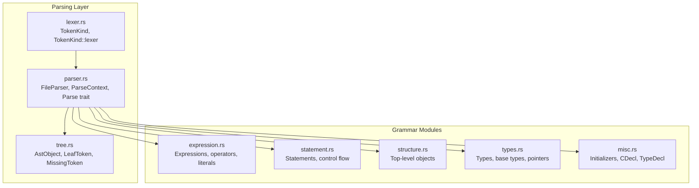

**Diagram sources**
- [lexer.rs](file://src/analysis/parsing/lexer.rs#L98-L426)
- [parser.rs](file://src/analysis/parsing/parser.rs#L322-L480)
- [tree.rs](file://src/analysis/parsing/tree.rs#L14-L398)
- [expression.rs](file://src/analysis/parsing/expression.rs#L700-L790)
- [statement.rs](file://src/analysis/parsing/statement.rs#L1-L120)
- [structure.rs](file://src/analysis/parsing/structure.rs#L1-L80)
- [types.rs](file://src/analysis/parsing/types.rs#L527-L569)
- [misc.rs](file://src/analysis/parsing/misc.rs#L624-L646)

**Section sources**
- [mod.rs](file://src/analysis/parsing/mod.rs#L1-L16)

## Core Components
- Token and TokenKind: Lexical units produced by the lexer and categorized for parsing decisions.
- FileParser: Wraps the lexer, tracks position, supports peek and consume, advances across whitespace/comments, and records skipped tokens for diagnostics.
- ParseContext: Manages lookahead, lookahead filtering, and context-aware recovery. Provides methods to peek, consume, expect kinds, and skip unexpected tokens intelligently.
- Parse trait and AstObject: Defines the parsing interface and AST node wrapper that carries ranges and missing content.
- LeafToken and MissingToken: Represent present or missing terminal tokens with diagnostic metadata.

Key responsibilities:
- Lexer ensures tokens are recognized with proper lookahead constraints.
- Parser composes recursive descent parsers for grammar categories and manages recovery.
- Tree module models AST nodes and missing constructs for robust diagnostics.

**Section sources**
- [lexer.rs](file://src/analysis/parsing/lexer.rs#L98-L426)
- [parser.rs](file://src/analysis/parsing/parser.rs#L15-L480)
- [tree.rs](file://src/analysis/parsing/tree.rs#L234-L398)

## Architecture Overview
The parser follows a classic recursive descent architecture:
- The lexer produces tokens with lookahead 1 and handles comments/newlines.
- The parser maintains a FileParser that exposes next_tok and peek.
- ParseContext controls lookahead and recovery, enabling context-sensitive parsing and skipping of unexpected tokens.
- Each grammar category (expressions, statements, structures, types, initializers) defines its own parser with dedicated context and lookahead filters.
- The Parse trait unifies parsing across all constructs, returning AstObject<T> with range and content.

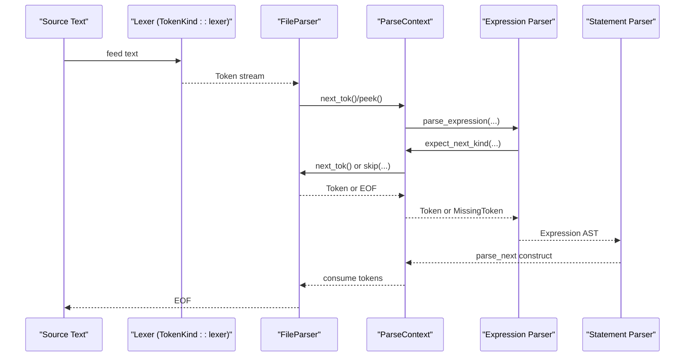

**Diagram sources**
- [lexer.rs](file://src/analysis/parsing/lexer.rs#L98-L426)
- [parser.rs](file://src/analysis/parsing/parser.rs#L322-L480)
- [expression.rs](file://src/analysis/parsing/expression.rs#L700-L790)
- [statement.rs](file://src/analysis/parsing/statement.rs#L1-L120)

## Detailed Component Analysis

### Lexer and Token Recognition
- TokenKind enumerates terminals and reserved identifiers, with explicit regexes and callbacks for complex tokens (strings, comments, C blocks).
- The lexer uses Logos with lookahead 1 for most tokens; special handlers manage multi-line comments and C-blocks.
- Comments and whitespace are consumed during token advancement, updating line/column positions.

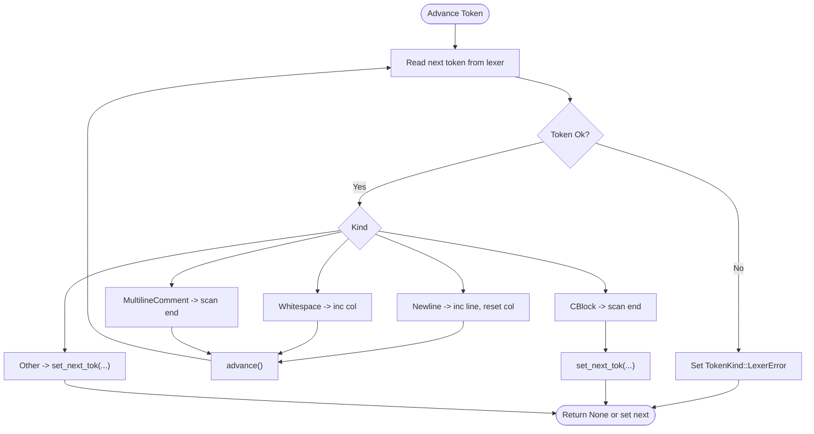

**Diagram sources**
- [lexer.rs](file://src/analysis/parsing/lexer.rs#L55-L96)
- [parser.rs](file://src/analysis/parsing/parser.rs#L352-L459)

**Section sources**
- [lexer.rs](file://src/analysis/parsing/lexer.rs#L98-L426)
- [parser.rs](file://src/analysis/parsing/parser.rs#L352-L459)

### Parser Infrastructure: FileParser and ParseContext
- FileParser encapsulates the lexer, current/previous positions, and a buffered next token for peeking. It advances across whitespace/comments and sets tokens with accurate ranges.
- ParseContext provides:
  - Peek and next operations with end-position gating
  - Expect methods that return MissingToken when encountering end-of-scope or EOF
  - Filtering helpers to accept only tokens understood by the current context
  - Skipping mechanism to recover from unexpected tokens, recording skipped diagnostics
  - Nested contexts via enter_context to manage lookahead and recovery boundaries

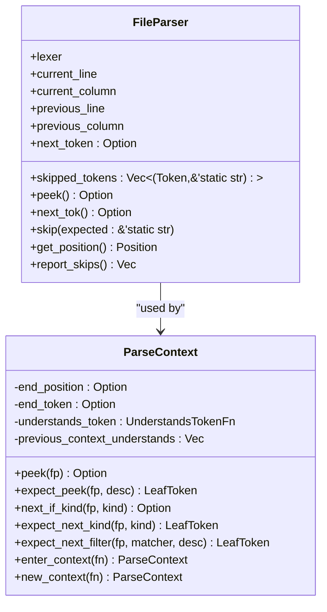

**Diagram sources**
- [parser.rs](file://src/analysis/parsing/parser.rs#L322-L480)
- [parser.rs](file://src/analysis/parsing/parser.rs#L48-L320)

**Section sources**
- [parser.rs](file://src/analysis/parsing/parser.rs#L322-L480)
- [parser.rs](file://src/analysis/parsing/parser.rs#L48-L320)

### Expression Parsing and Precedence
- Expression parsing is driven by a precedence ladder and recursive descent. The grammar recognizes:
  - Literals and identifiers
  - Prefix/postfix unary operators
  - Multiplicative, additive, shift, comparison, equality, logical-and, logical-or, and ternary operators
  - Member access, function calls, indexing/slicing, parentheses, casts, new allocations, and list literals
- The parser uses nested ParseContext instances to constrain lookahead for delimiters (e.g., matching closing parentheses/brackets/braces) and to recover gracefully when encountering mismatched tokens.
- Ambiguities are resolved by:
  - Using precedence to choose operator associations
  - Distinguishing constructs via lookahead (e.g., function call vs. parenthesized expression)
  - Employing context-aware expectations and skipping to maintain forward progress

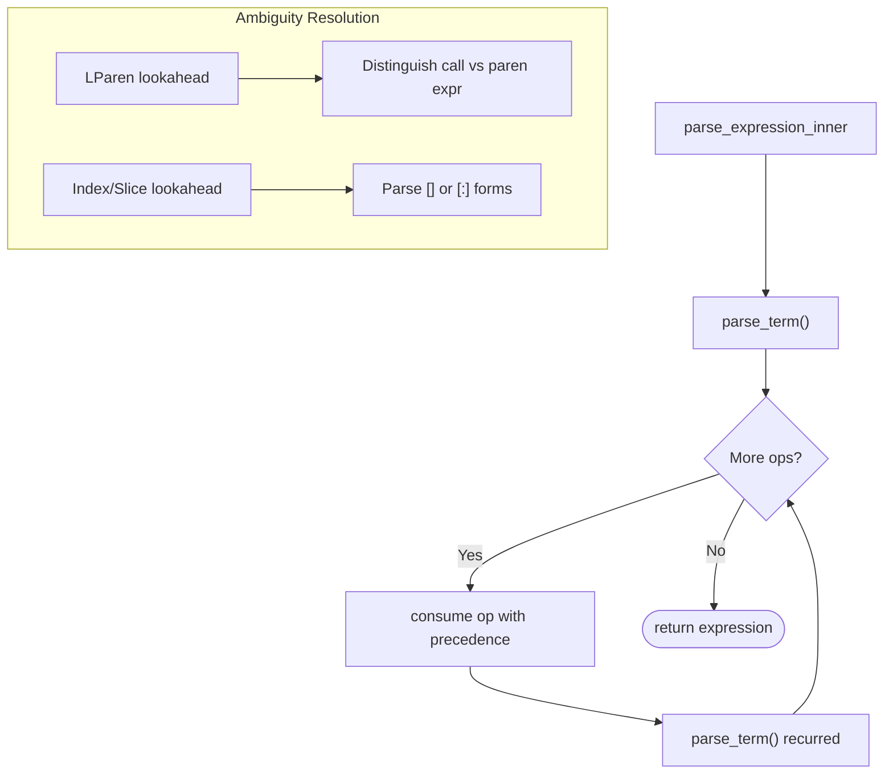

**Diagram sources**
- [expression.rs](file://src/analysis/parsing/expression.rs#L700-L790)
- [expression.rs](file://src/analysis/parsing/expression.rs#L475-L536)

**Section sources**
- [expression.rs](file://src/analysis/parsing/expression.rs#L700-L790)
- [expression.rs](file://src/analysis/parsing/expression.rs#L475-L536)

### Statement Parsing and Control Flow
- Statements include compound blocks, variable declarations, assignments, control flow (if/else, while, do/while, for), error/assert/throw, and hash-if directives.
- Each statement parser establishes appropriate contexts to:
  - Recognize terminating semicolons
  - Constrain lookahead for delimiters (e.g., matching closing braces/parentheses)
  - Recover from unexpected tokens and report missing terminators
- For loops and for-init, the parser distinguishes between declarations and expressions, and supports assignment chains and post-increments.

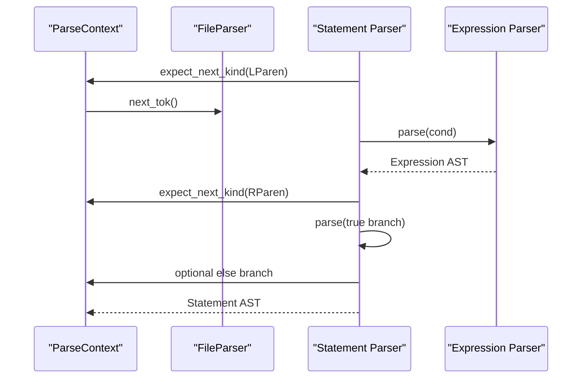

**Diagram sources**
- [statement.rs](file://src/analysis/parsing/statement.rs#L445-L468)
- [statement.rs](file://src/analysis/parsing/statement.rs#L559-L574)

**Section sources**
- [statement.rs](file://src/analysis/parsing/statement.rs#L134-L185)
- [statement.rs](file://src/analysis/parsing/statement.rs#L410-L469)
- [statement.rs](file://src/analysis/parsing/statement.rs#L559-L574)

### Structure-Level Declarations
- Top-level DML constructs include methods, parameters, variables (session/saved), constants, instantiations, and object statements.
- Method parsing enforces semantic constraints (e.g., startup/memoized/independent combinations) and collects diagnostics.
- Variable and parameter parsing validates naming and typing constraints.
- Object statements support empty or brace-delimited lists with depth-aware style checks.

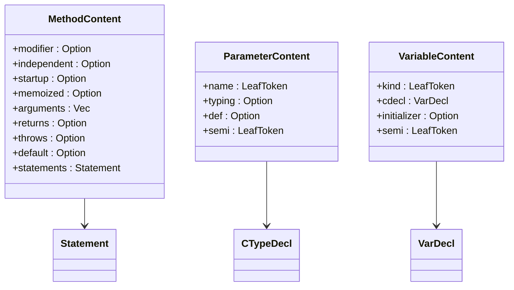

**Diagram sources**
- [structure.rs](file://src/analysis/parsing/structure.rs#L79-L118)
- [structure.rs](file://src/analysis/parsing/structure.rs#L352-L375)
- [structure.rs](file://src/analysis/parsing/structure.rs#L478-L501)

**Section sources**
- [structure.rs](file://src/analysis/parsing/structure.rs#L79-L118)
- [structure.rs](file://src/analysis/parsing/structure.rs#L352-L375)
- [structure.rs](file://src/analysis/parsing/structure.rs#L478-L501)

### Type System Constructs
- Base types include identifiers, struct layouts, bitfields, typeof, sequence, and hook types.
- Pointer/array/function-like declarators are modeled with TypeDecl and CTypeDecl, supporting nested modifiers and parentheses.
- The parser enforces modifier ordering and detects misplaced qualifiers.

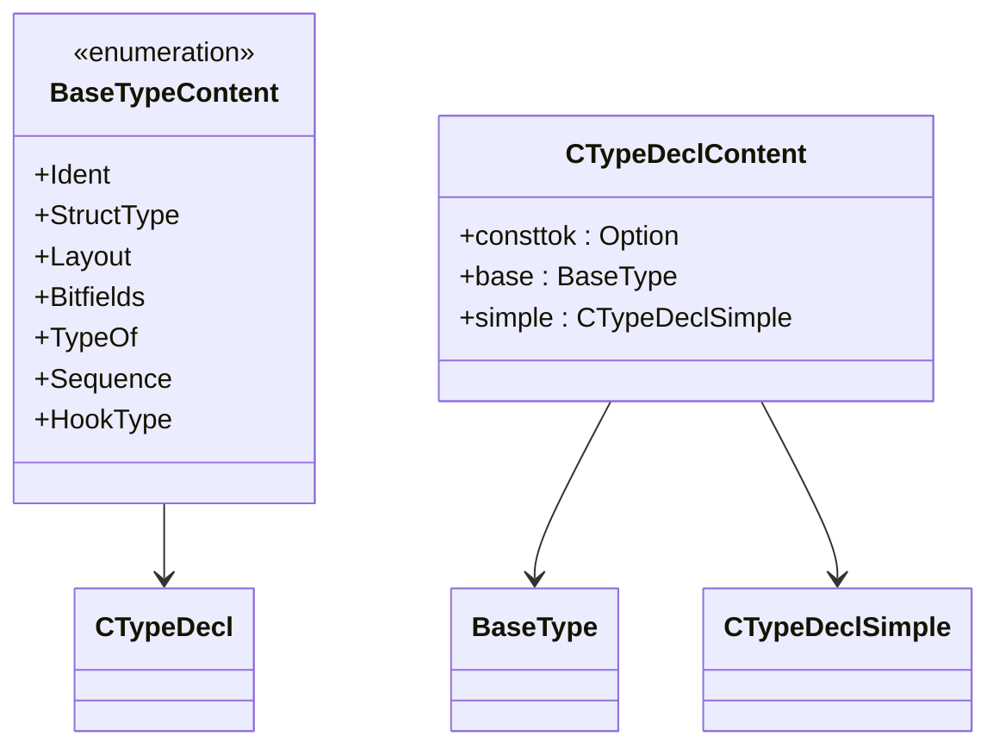

**Diagram sources**
- [types.rs](file://src/analysis/parsing/types.rs#L477-L523)
- [types.rs](file://src/analysis/parsing/types.rs#L650-L666)

**Section sources**
- [types.rs](file://src/analysis/parsing/types.rs#L477-L523)
- [types.rs](file://src/analysis/parsing/types.rs#L650-L666)

### Initializers and Declarators
- SingleInitializer supports expressions, brace-lists, and designated structure initializers.
- Initializer extends SingleInitializer to include tuple-like initializers and resolves ambiguities with parenthesized expressions.
- CDecl composes base types with modifiers and TypeDecl, enforcing naming and pointer modifier rules.

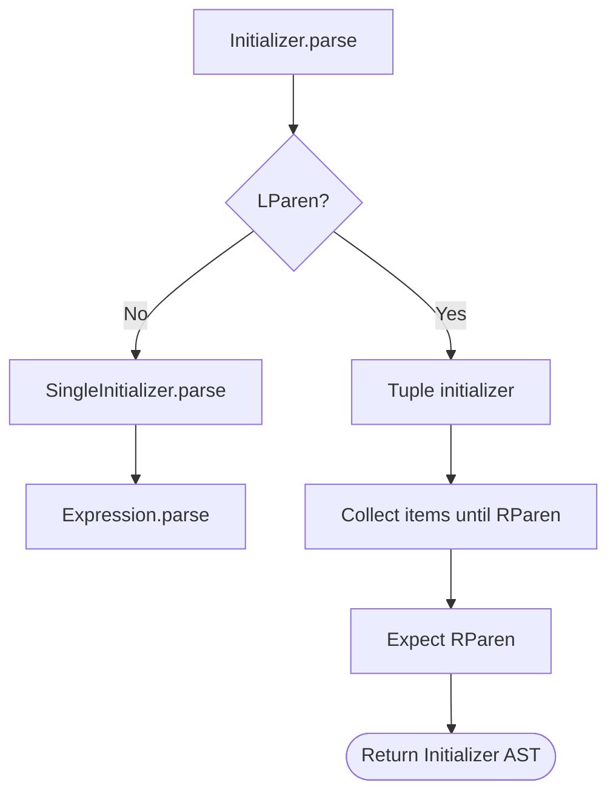

**Diagram sources**
- [misc.rs](file://src/analysis/parsing/misc.rs#L201-L283)
- [misc.rs](file://src/analysis/parsing/misc.rs#L68-L174)

**Section sources**
- [misc.rs](file://src/analysis/parsing/misc.rs#L201-L283)
- [misc.rs](file://src/analysis/parsing/misc.rs#L68-L174)

### Grammar Rules, Lookahead, and Recursive Descent Patterns
- Lookahead mechanisms:
  - ParseContext.peek_kind and expect_peek to inspect upcoming tokens without consuming
  - expect_next_kind and expect_next_filter to enforce terminal expectations and skip incompatible tokens
  - enter_context with tailored UnderstandsTokenFn to constrain lookahead for delimiters
- Recursive descent patterns:
  - Each grammar category (expression, statement, structure, type, initializer) defines a parse function that consumes tokens and returns an AstObject<T>
  - Nested contexts isolate sub-parsers (e.g., parenthesized expressions, list parsing) and prevent cross-contamination of lookahead
- Ambiguity handling:
  - Operator precedence determines association order
  - Construct-specific lookahead disambiguates function calls vs. parenthesized expressions and index vs. slice
  - Missing constructs are represented as MissingToken/MissingContent with precise diagnostics

**Section sources**
- [parser.rs](file://src/analysis/parsing/parser.rs#L48-L320)
- [expression.rs](file://src/analysis/parsing/expression.rs#L700-L790)
- [statement.rs](file://src/analysis/parsing/statement.rs#L410-L469)
- [structure.rs](file://src/analysis/parsing/structure.rs#L243-L328)
- [types.rs](file://src/analysis/parsing/types.rs#L527-L559)
- [misc.rs](file://src/analysis/parsing/misc.rs#L201-L283)

### Examples of Parsing Different DML Constructs
- Method definition with modifiers, parameters, returns, throws, and body
  - See [structure.rs](file://src/analysis/parsing/structure.rs#L243-L328)
- For loop with declaration or expression pre/post conditions
  - See [statement.rs](file://src/analysis/parsing/statement.rs#L665-L787)
- Function call with argument list and nested expressions
  - See [expression.rs](file://src/analysis/parsing/expression.rs#L233-L269)
- Indexing and slicing with optional bitorder
  - See [expression.rs](file://src/analysis/parsing/expression.rs#L475-L536)
- Struct layout with field declarations
  - See [types.rs](file://src/analysis/parsing/types.rs#L67-L100)
- Designated structure initializer
  - See [misc.rs](file://src/analysis/parsing/misc.rs#L68-L174)

**Section sources**
- [structure.rs](file://src/analysis/parsing/structure.rs#L243-L328)
- [statement.rs](file://src/analysis/parsing/statement.rs#L665-L787)
- [expression.rs](file://src/analysis/parsing/expression.rs#L233-L269)
- [expression.rs](file://src/analysis/parsing/expression.rs#L475-L536)
- [types.rs](file://src/analysis/parsing/types.rs#L67-L100)
- [misc.rs](file://src/analysis/parsing/misc.rs#L68-L174)

### Error Scenarios and Recovery Strategies
- Unexpected tokens:
  - ParseContext.skip records skipped tokens with expected descriptions
  - FileParser.report_skips aggregates diagnostics for later reporting
- Missing terminators:
  - end_context marks where a context ended, capturing the offending token and position
  - MissingToken and MissingContent propagate missing constructs with descriptions
- Scope-based recovery:
  - enter_context prevents lower contexts from reviving parsing when higher contexts end
  - previous_understands_token decides whether to end current context or skip the token

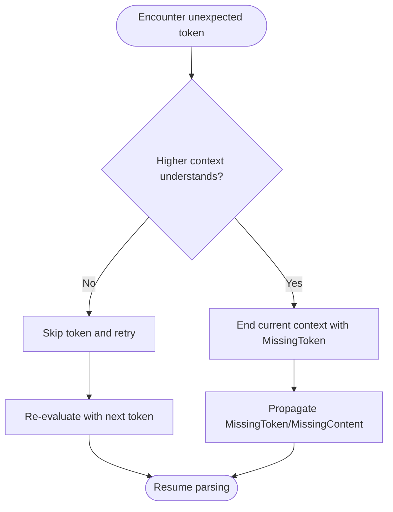

**Diagram sources**
- [parser.rs](file://src/analysis/parsing/parser.rs#L126-L207)
- [parser.rs](file://src/analysis/parsing/parser.rs#L461-L480)

**Section sources**
- [parser.rs](file://src/analysis/parsing/parser.rs#L126-L207)
- [parser.rs](file://src/analysis/parsing/parser.rs#L461-L480)

### Relationship Between Parsing Phases and Semantic Analysis
- Parsing produces a complete AST with ranges and missing content markers.
- TreeElement.walk and post_parse_sanity enable semantic checks and diagnostics across the tree.
- References and symbol resolution are integrated via TreeElement references and ReferenceContainer.
- Style checks and lint rules are applied during tree traversal.

**Section sources**
- [tree.rs](file://src/analysis/parsing/tree.rs#L31-L120)
- [structure.rs](file://src/analysis/parsing/structure.rs#L120-L241)

## Dependency Analysis
The parsing modules depend on each other in a layered manner:
- lexer.rs provides TokenKind and TokenKind::lexer
- parser.rs depends on lexer.rs and tree.rs to build FileParser and ParseContext
- expression.rs, statement.rs, structure.rs, types.rs, and misc.rs all depend on parser.rs and tree.rs
- mod.rs orchestrates module loading and exports top-level parse functions

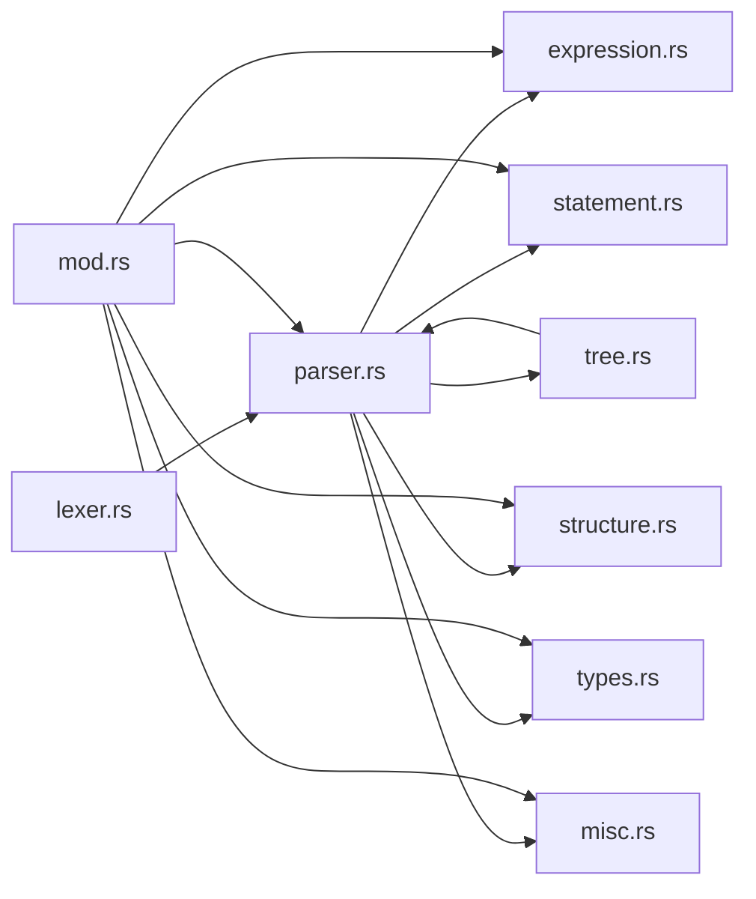

**Diagram sources**
- [lexer.rs](file://src/analysis/parsing/lexer.rs#L98-L426)
- [parser.rs](file://src/analysis/parsing/parser.rs#L322-L480)
- [tree.rs](file://src/analysis/parsing/tree.rs#L14-L398)
- [mod.rs](file://src/analysis/parsing/mod.rs#L1-L16)

**Section sources**
- [mod.rs](file://src/analysis/parsing/mod.rs#L1-L16)

## Performance Considerations
- Tokenization cost: The lexer uses Logos with lookahead 1 for most tokens; special handlers for multi-line constructs add overhead proportional to content length. This is amortized across the token stream.
- AST construction: Boxing content in AstObject reduces recursion overhead and simplifies polymorphism. Missing content is represented compactly with minimal allocations.
- Parsing complexity: Recursive descent with bounded lookahead yields linear-time parsing for DML constructs. Operator precedence parsing avoids exponential blowups by delegating to a precedence ladder.
- Memory footprint: Vec-based collections for lists (arguments, fields, initializers) grow as needed; consider pre-sizing for very large inputs if profiling indicates hotspots.
- Error recovery: Skipping tokens and context gating minimize cascading errors and reduce backtracking costs.

[No sources needed since this section provides general guidance]

## Troubleshooting Guide
Common issues and remedies:
- Unexpected token errors:
  - Inspect skipped_tokens recorded by FileParser and use report_skips to surface diagnostics
  - Adjust expectations in ParseContext to align with grammar boundaries
- Missing terminators:
  - Review end_context usage and MissingToken positions to locate where parsing ended prematurely
- Ambiguous constructs:
  - Verify precedence and lookahead logic in expression parsing
  - Ensure context-aware expectations (e.g., closing delimiter contexts) are correctly established
- Multi-line constructs:
  - Confirm comment/C-block scanning updates line/column positions accurately

**Section sources**
- [parser.rs](file://src/analysis/parsing/parser.rs#L461-L480)
- [parser.rs](file://src/analysis/parsing/parser.rs#L126-L207)

## Conclusion
The DML parser employs a robust recursive descent architecture with strong lookahead and context management. It integrates tightly with the lexer to tokenize input, models missing constructs for resilient diagnostics, and cleanly separates grammar modules for maintainability. Error recovery strategies preserve forward progress while surfacing actionable diagnostics. Together with tree traversal and semantic checks, the parser lays a solid foundation for subsequent analysis phases.