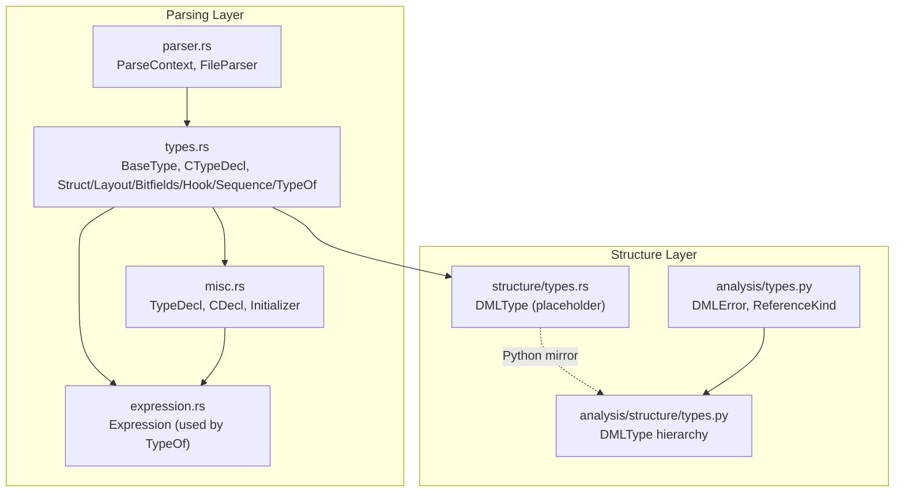
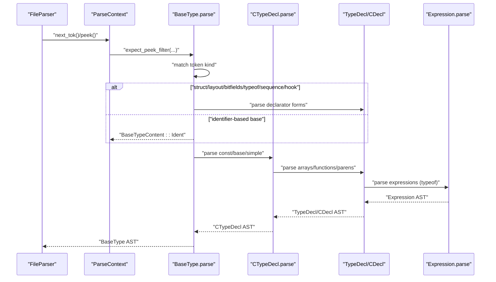
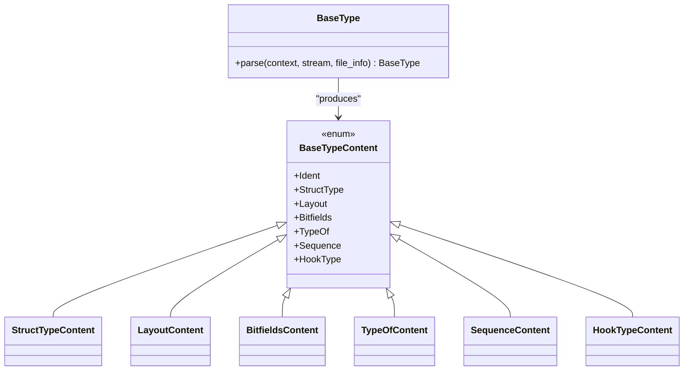
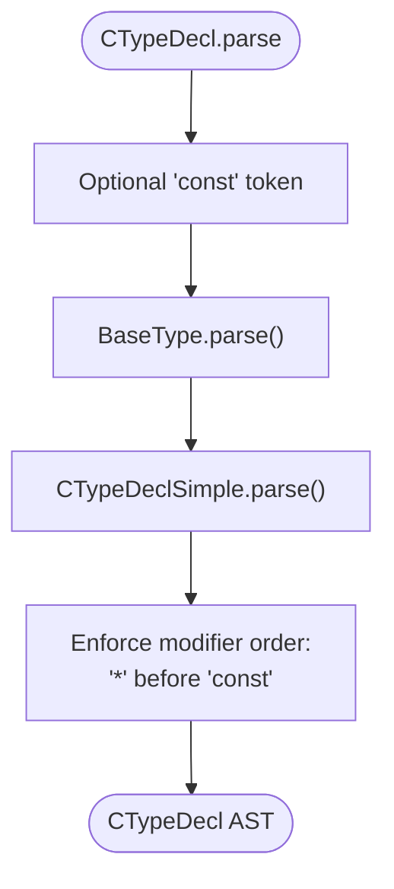
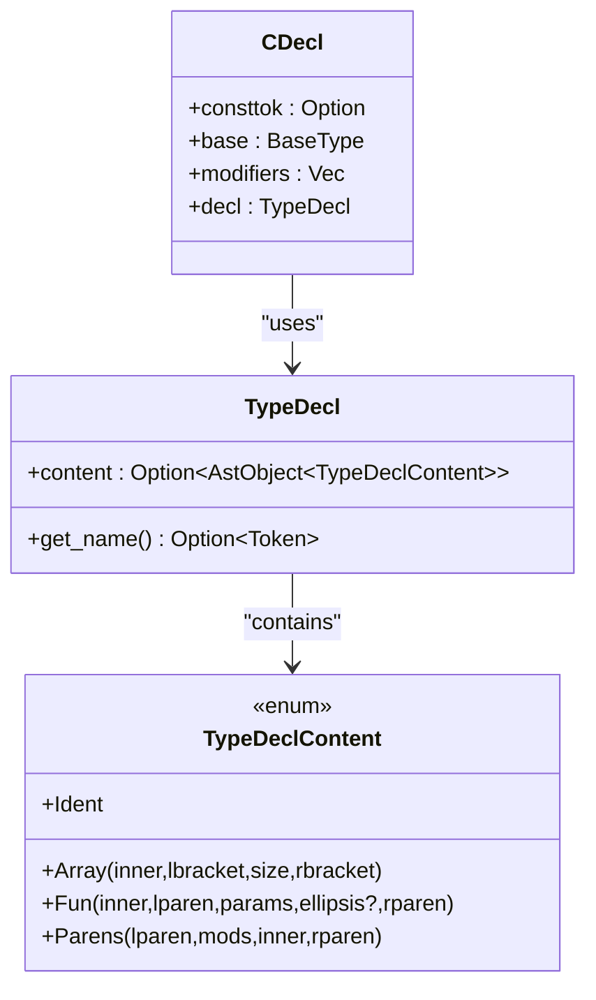
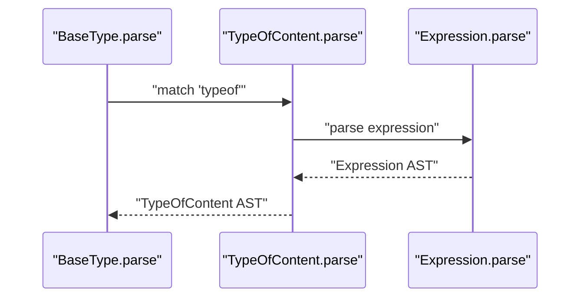
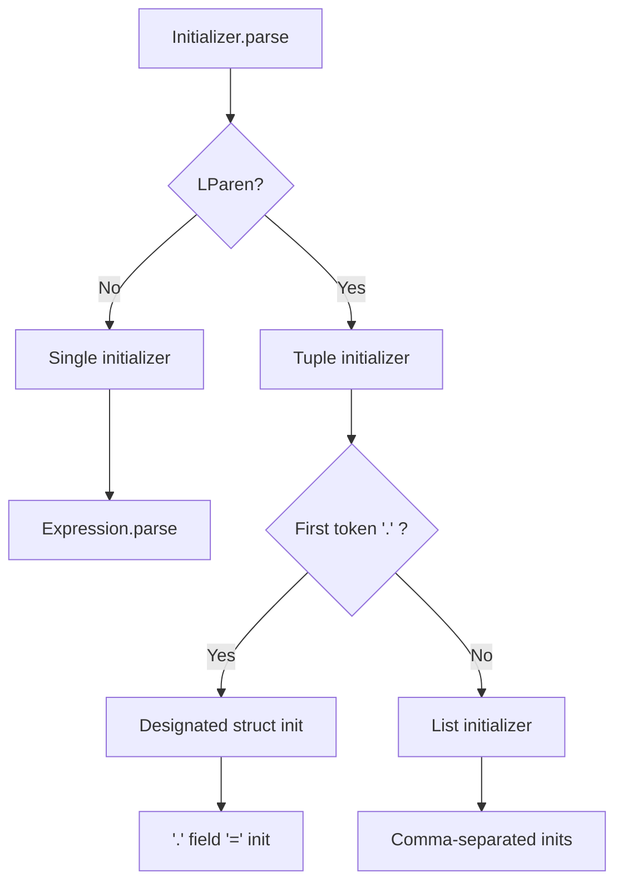
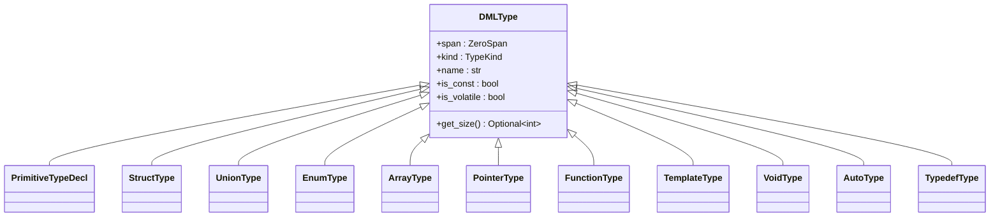
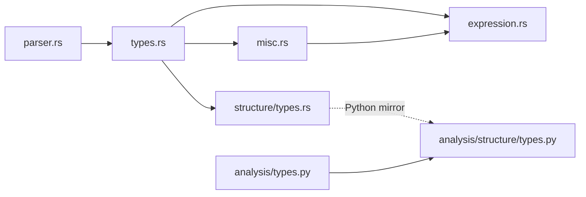

# Type System Parsing

<cite>
**Referenced Files in This Document**
- [types.rs](file://src/analysis/parsing/types.rs)
- [misc.rs](file://src/analysis/parsing/misc.rs)
- [parser.rs](file://src/analysis/parsing/parser.rs)
- [expression.rs](file://src/analysis/parsing/expression.rs)
- [types.rs](file://src/analysis/structure/types.rs)
- [types.py](file://python-port/dml_language_server/analysis/structure/types.py)
- [types.py](file://python-port/dml_language_server/analysis/types.py)
</cite>

## Table of Contents
1. [Introduction](#introduction)
2. [Project Structure](#project-structure)
3. [Core Components](#core-components)
4. [Architecture Overview](#architecture-overview)
5. [Detailed Component Analysis](#detailed-component-analysis)
6. [Dependency Analysis](#dependency-analysis)
7. [Performance Considerations](#performance-considerations)
8. [Troubleshooting Guide](#troubleshooting-guide)
9. [Conclusion](#conclusion)

## Introduction
This document explains the type system parsing within the DML language, focusing on how type declarations, type modifiers, generic type parameters, and type constraints are parsed and integrated with expression and statement parsing. It also covers type annotation handling, type inference support, function signature parsing (including parameter and return types), and exception types. Finally, it documents how type parsing connects to semantic analysis for type checking and compatibility verification.

## Project Structure
The type system spans two layers:
- Parsing layer: constructs type AST nodes from tokens and integrates with expression/statement parsing.
- Structure layer: represents types semantically for analysis and compatibility checks.

**Diagram sources**
- [parser.rs](file://src/analysis/parsing/parser.rs#L48-L170)
- [types.rs](file://src/analysis/parsing/types.rs#L527-L559)
- [misc.rs](file://src/analysis/parsing/misc.rs#L287-L360)
- [expression.rs](file://src/analysis/parsing/expression.rs#L1-L200)
- [types.rs](file://src/analysis/structure/types.rs#L9-L20)
- [types.py](file://python-port/dml_language_server/analysis/structure/types.py#L55-L344)
- [types.py](file://python-port/dml_language_server/analysis/types.py#L16-L84)

**Section sources**
- [parser.rs](file://src/analysis/parsing/parser.rs#L48-L170)
- [types.rs](file://src/analysis/parsing/types.rs#L527-L559)
- [misc.rs](file://src/analysis/parsing/misc.rs#L287-L360)
- [expression.rs](file://src/analysis/parsing/expression.rs#L1-L200)
- [types.rs](file://src/analysis/structure/types.rs#L9-L20)
- [types.py](file://python-port/dml_language_server/analysis/structure/types.py#L55-L344)
- [types.py](file://python-port/dml_language_server/analysis/types.py#L16-L84)

## Core Components
- BaseType: top-level type forms including identifiers, structs, layouts, bitfields, typeof, sequence, hook, and parentheses.
- CTypeDecl: a C-style type declaration combining optional const, a base type, and simple modifiers (pointers and cv-qualifiers).
- TypeDecl and CDecl: describe declarators and declarator-chains (arrays, functions, parenthesized forms).
- Expression integration: typeof uses Expression parsing to compute types from expressions.
- Placeholder DMLType: current structure layer uses a zero-span placeholder; Python counterpart defines a rich type hierarchy.

Key parsing entry points:
- BaseType::parse selects among struct, layout, bitfields, typeof, sequence, hook, or identifier-based base types.
- CTypeDecl::parse composes const, base type, and simple modifiers.
- TypeDecl and CDecl define arrays, function signatures, and parenthesized forms.

Validation and sanity checks:
- StructTypeContent enforces named members.
- LayoutContent validates byte-order string constants.
- BitfieldsContent enforces unique field names.
- CTypeDeclSimple enforces modifier ordering (cv-qualifiers after pointer stars).
- Initializer parsing supports designated struct initializers and list forms.

**Section sources**
- [types.rs](file://src/analysis/parsing/types.rs#L527-L559)
- [types.rs](file://src/analysis/parsing/types.rs#L670-L687)
- [misc.rs](file://src/analysis/parsing/misc.rs#L287-L360)
- [misc.rs](file://src/analysis/parsing/misc.rs#L574-L623)
- [expression.rs](file://src/analysis/parsing/expression.rs#L357-L383)
- [types.rs](file://src/analysis/structure/types.rs#L9-L20)
- [types.py](file://python-port/dml_language_server/analysis/structure/types.py#L55-L344)

## Architecture Overview
The type parsing pipeline integrates with the broader parser via ParseContext and FileParser. It leverages expression parsing for typeof and supports initializer parsing for struct/union initialization.

**Diagram sources**
- [parser.rs](file://src/analysis/parsing/parser.rs#L48-L170)
- [types.rs](file://src/analysis/parsing/types.rs#L527-L559)
- [types.rs](file://src/analysis/parsing/types.rs#L670-L687)
- [misc.rs](file://src/analysis/parsing/misc.rs#L287-L360)
- [expression.rs](file://src/analysis/parsing/expression.rs#L357-L383)

## Detailed Component Analysis

### BaseType and Base Type Forms
BaseType parses the outermost type form. It delegates to specialized content types:
- StructTypeContent: struct keyword, brace-delimited member list, each member declared via CDecl.
- LayoutContent: layout keyword, string constant for byte order, brace-delimited fields.
- BitfieldsContent: bitfields keyword, integer constant size, brace-delimited fields with bit ranges.
- TypeOfContent: typeof keyword followed by an expression.
- SequenceContent: sequence keyword followed by a parenthesized identifier.
- HookTypeContent: hook keyword followed by a parenthesized parameter list of CDecl entries.
- Ident: basic identifier-based types.

Validation highlights:
- StructTypeContent ensures each member is named.
- LayoutContent restricts byte order to specific quoted constants.
- BitfieldsContent enforces unique field names.

**Diagram sources**
- [types.rs](file://src/analysis/parsing/types.rs#L527-L559)
- [types.rs](file://src/analysis/parsing/types.rs#L32-L101)
- [types.rs](file://src/analysis/parsing/types.rs#L103-L183)
- [types.rs](file://src/analysis/parsing/types.rs#L185-L355)
- [types.rs](file://src/analysis/parsing/types.rs#L357-L421)
- [types.rs](file://src/analysis/parsing/types.rs#L423-L475)

**Section sources**
- [types.rs](file://src/analysis/parsing/types.rs#L527-L559)
- [types.rs](file://src/analysis/parsing/types.rs#L32-L101)
- [types.rs](file://src/analysis/parsing/types.rs#L103-L183)
- [types.rs](file://src/analysis/parsing/types.rs#L185-L355)
- [types.rs](file://src/analysis/parsing/types.rs#L357-L421)
- [types.rs](file://src/analysis/parsing/types.rs#L423-L475)

### CTypeDecl and Modifiers
CTypeDecl combines:
- Optional const qualifier.
- A base type (BaseType).
- Simple modifiers (CTypeDeclSimple): sequences of pointer stars and cv-qualifiers, with strict ordering enforcement.

Modifier ordering validation:
- Pointers (*) must precede cv-qualifiers (const).
- Errors are reported when const appears before *.

**Diagram sources**
- [types.rs](file://src/analysis/parsing/types.rs#L670-L687)
- [types.rs](file://src/analysis/parsing/types.rs#L615-L648)
- [types.rs](file://src/analysis/parsing/types.rs#L584-L611)

**Section sources**
- [types.rs](file://src/analysis/parsing/types.rs#L670-L687)
- [types.rs](file://src/analysis/parsing/types.rs#L615-L648)
- [types.rs](file://src/analysis/parsing/types.rs#L584-L611)

### Declarators: TypeDecl and CDecl
TypeDecl describes declarator forms:
- Ident: simple identifier.
- Array: declarator, brackets, expression (size), closing bracket.
- Fun: declarator, opening paren, parameter list of CDecl entries, optional ellipsis, closing paren.
- Parens: grouping with optional modifiers.

CDecl augments a base type with:
- Optional const.
- Base type (BaseType).
- Declarator chain (TypeDecl).
- Additional pointer/cv modifiers inline.

Integration with expressions:
- typeof uses Expression parsing to derive a type from an expression.

**Diagram sources**
- [misc.rs](file://src/analysis/parsing/misc.rs#L287-L360)
- [misc.rs](file://src/analysis/parsing/misc.rs#L574-L623)

**Section sources**
- [misc.rs](file://src/analysis/parsing/misc.rs#L287-L360)
- [misc.rs](file://src/analysis/parsing/misc.rs#L574-L623)
- [expression.rs](file://src/analysis/parsing/expression.rs#L357-L383)

### typeof and Expression Integration
TypeOfContent captures typeof followed by an expression. The expression parser is reused to resolve the operand expression, enabling typeof to compute a type from a DML expression.

**Diagram sources**
- [types.rs](file://src/analysis/parsing/types.rs#L372-L383)
- [expression.rs](file://src/analysis/parsing/expression.rs#L357-L383)

**Section sources**
- [types.rs](file://src/analysis/parsing/types.rs#L372-L383)
- [expression.rs](file://src/analysis/parsing/expression.rs#L357-L383)

### Initializer Parsing and Struct/Union Fields
Initializer parsing supports:
- Single expressions.
- Brace-list initializers.
- Designated struct initializers with periods and ellipsis.

These constructs are used to initialize struct/union fields and integrate with type parsing for field-level type resolution.

**Diagram sources**
- [misc.rs](file://src/analysis/parsing/misc.rs#L200-L283)
- [misc.rs](file://src/analysis/parsing/misc.rs#L68-L174)

**Section sources**
- [misc.rs](file://src/analysis/parsing/misc.rs#L200-L283)
- [misc.rs](file://src/analysis/parsing/misc.rs#L68-L174)

### Semantic Types and Compatibility
The structure layer currently uses a placeholder DMLType (zero-span) for type identity. The Python counterpart defines a comprehensive type hierarchy:
- PrimitiveType, StructType, UnionType, EnumType, ArrayType, PointerType, FunctionType, TemplateType, VoidType, AutoType, TypedefType.
- TypeRegistry manages built-in and user-defined types.
- TypeAnalyzer performs semantic checks (existence, duplicates, sizes).

**Diagram sources**
- [types.rs](file://src/analysis/structure/types.rs#L9-L20)
- [types.py](file://python-port/dml_language_server/analysis/structure/types.py#L55-L344)

**Section sources**
- [types.rs](file://src/analysis/structure/types.rs#L9-L20)
- [types.py](file://python-port/dml_language_server/analysis/structure/types.py#L55-L344)

## Dependency Analysis
- Parser primitives: ParseContext and FileParser provide token consumption and context-aware parsing.
- BaseType depends on Expression for typeof and on CDecl for declarator forms.
- CTypeDecl depends on BaseType and enforces modifier ordering.
- TypeDecl and CDecl depend on Expression for typeof and on Initializer for struct/union initialization.
- Structure layer types are placeholders in Rust; Python types provide a full semantic model.

**Diagram sources**
- [parser.rs](file://src/analysis/parsing/parser.rs#L48-L170)
- [types.rs](file://src/analysis/parsing/types.rs#L527-L559)
- [misc.rs](file://src/analysis/parsing/misc.rs#L287-L360)
- [expression.rs](file://src/analysis/parsing/expression.rs#L1-L200)
- [types.rs](file://src/analysis/structure/types.rs#L9-L20)
- [types.py](file://python-port/dml_language_server/analysis/structure/types.py#L55-L344)
- [types.py](file://python-port/dml_language_server/analysis/types.py#L16-L84)

**Section sources**
- [parser.rs](file://src/analysis/parsing/parser.rs#L48-L170)
- [types.rs](file://src/analysis/parsing/types.rs#L527-L559)
- [misc.rs](file://src/analysis/parsing/misc.rs#L287-L360)
- [expression.rs](file://src/analysis/parsing/expression.rs#L1-L200)
- [types.rs](file://src/analysis/structure/types.rs#L9-L20)
- [types.py](file://python-port/dml_language_server/analysis/structure/types.py#L55-L344)
- [types.py](file://python-port/dml_language_server/analysis/types.py#L16-L84)

## Performance Considerations
- Early termination contexts: specialized understands_token predicates minimize lookahead and reduce backtracking.
- Reuse of Expression parser for typeof avoids duplicating expression parsing logic.
- Modifier ordering validation occurs during parsing to fail fast on malformed declarations.
- Placeholder DMLType in Rust avoids heavy semantic computations until later analysis phases.

[No sources needed since this section provides general guidance]

## Troubleshooting Guide
Common type parsing issues and their origins:
- Missing or invalid struct/union field names: validated by StructTypeContent and BitfieldsContent.
- Invalid layout byte order: validated by LayoutContent against allowed quoted constants.
- Duplicate field names in bitfields: enforced by BitfieldsContent.
- Incorrect modifier order (const before *) in CTypeDeclSimple: reported by CTypeDeclSimple sanity checks.
- Unexpected EOF or mismatched delimiters in declarators: handled by ParseContext end_context logic.

**Section sources**
- [types.rs](file://src/analysis/parsing/types.rs#L50-L65)
- [types.rs](file://src/analysis/parsing/types.rs#L123-L139)
- [types.rs](file://src/analysis/parsing/types.rs#L292-L316)
- [types.rs](file://src/analysis/parsing/types.rs#L584-L611)
- [parser.rs](file://src/analysis/parsing/parser.rs#L126-L150)

## Conclusion
The DML type system parsing integrates tightly with expression and declarator parsing. BaseType and CTypeDecl capture the core type forms and modifiers, while TypeDecl and CDecl handle arrays, functions, and parenthesized forms. typeof leverages expression parsing for dynamic type computation. The structure layer currently uses placeholders; the Python types module provides a robust semantic model for type checking and compatibility verification. Validation rules embedded in content parsers ensure early detection of malformed types, supporting reliable downstream semantic analysis.