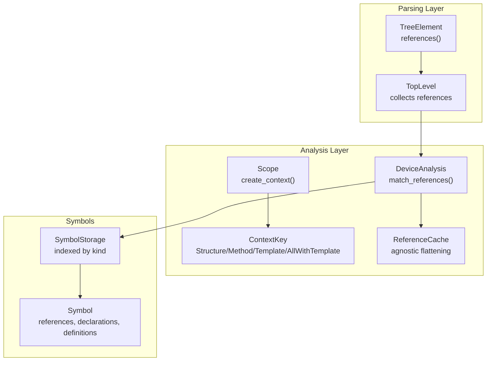
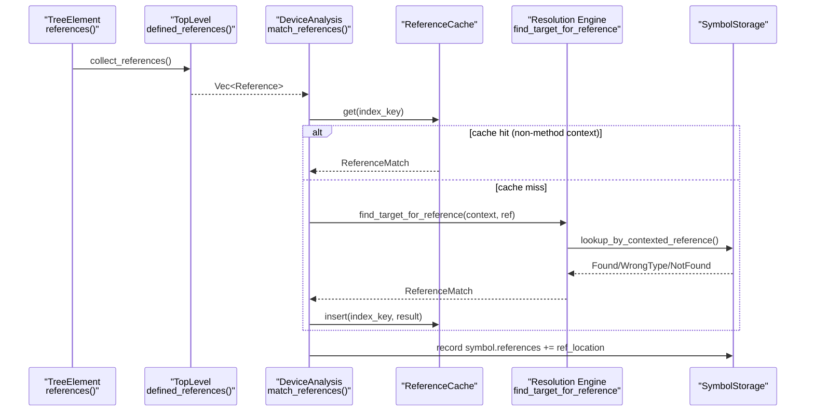
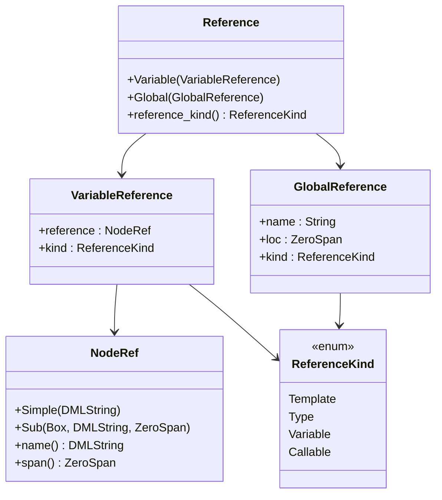
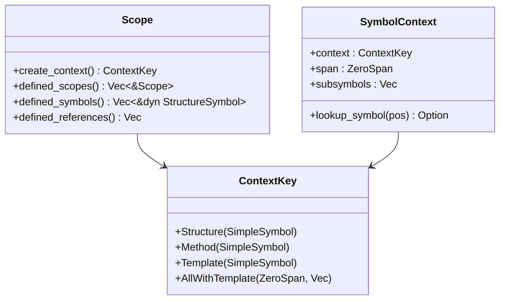
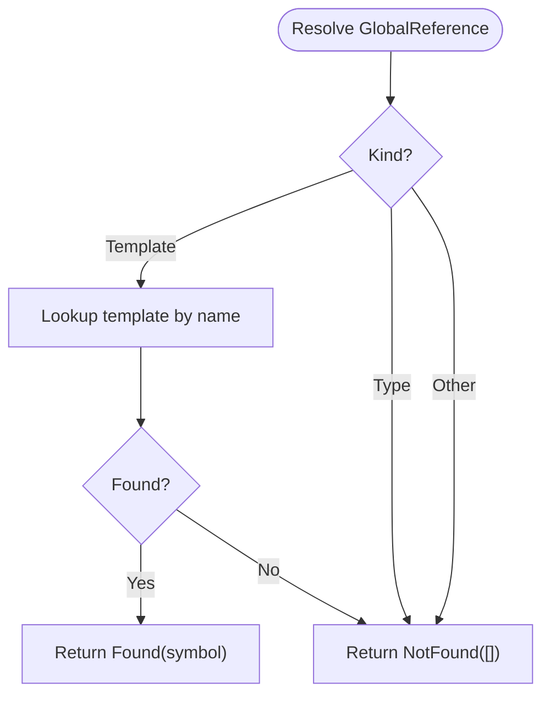
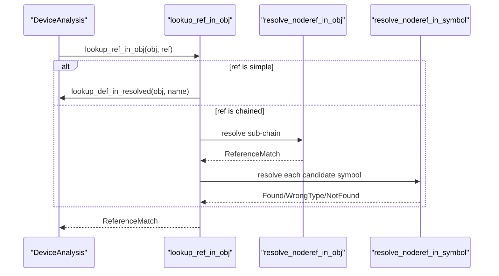
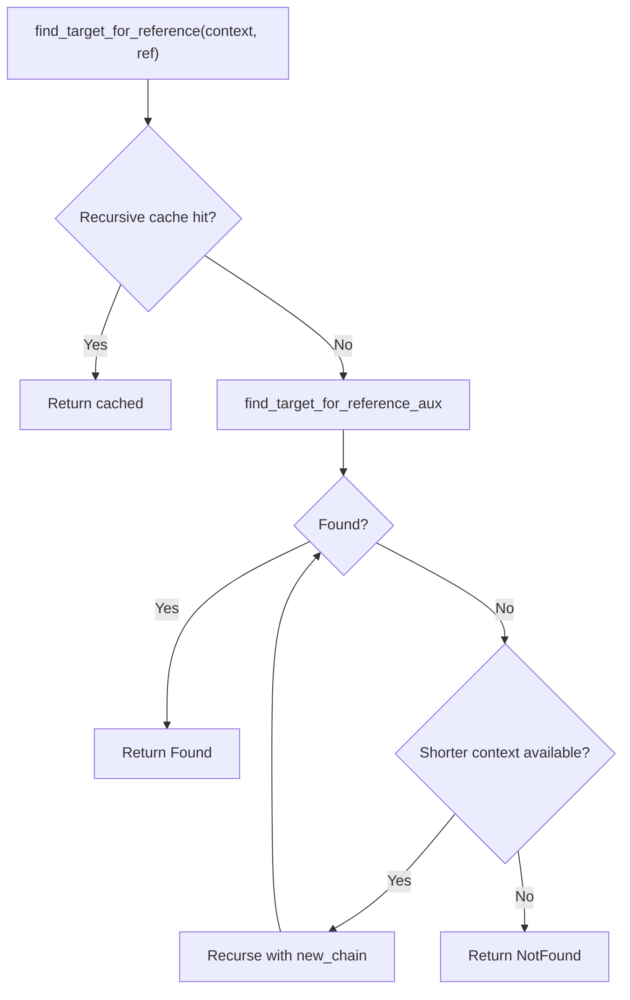
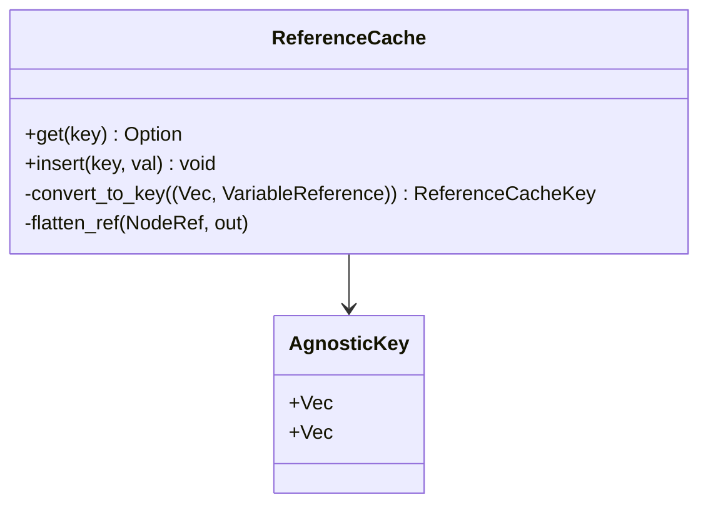
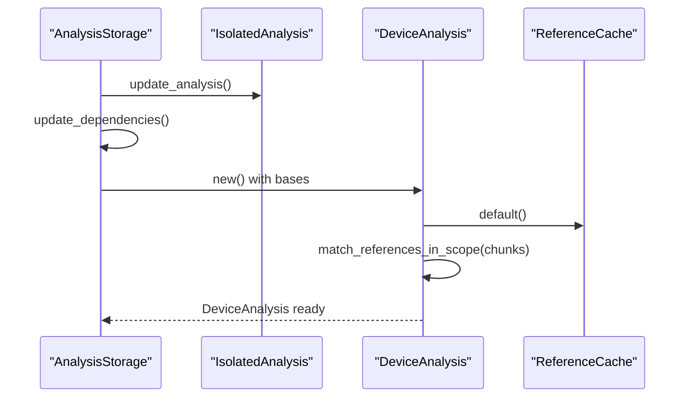
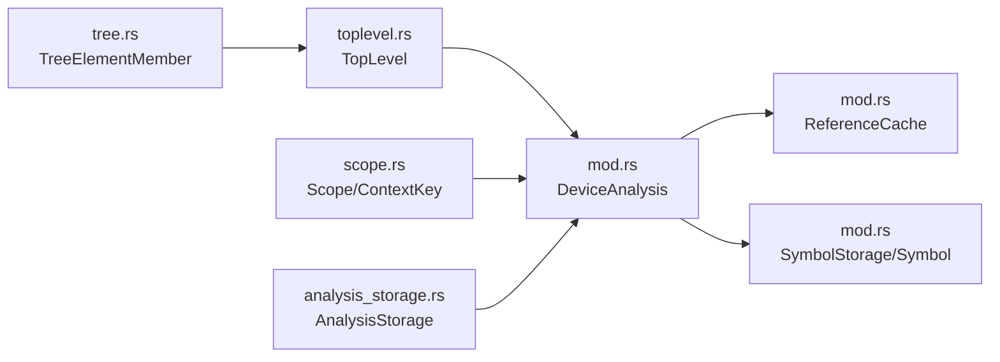

# Reference Tracking

<cite>
**Referenced Files in This Document**
- [reference.rs](file://src/analysis/reference.rs)
- [mod.rs](file://src/analysis/mod.rs)
- [scope.rs](file://src/analysis/scope.rs)
- [toplevel.rs](file://src/analysis/structure/toplevel.rs)
- [tree.rs](file://src/analysis/parsing/tree.rs)
- [analysis_storage.rs](file://src/actions/analysis_storage.rs)
</cite>

## Table of Contents
1. [Introduction](#introduction)
2. [Project Structure](#project-structure)
3. [Core Components](#core-components)
4. [Architecture Overview](#architecture-overview)
5. [Detailed Component Analysis](#detailed-component-analysis)
6. [Dependency Analysis](#dependency-analysis)
7. [Performance Considerations](#performance-considerations)
8. [Troubleshooting Guide](#troubleshooting-guide)
9. [Conclusion](#conclusion)

## Introduction
This document explains the cross-document reference tracking system used by the DML language server. It covers the reference model, global and local resolution strategies, inter-file symbol relationships, reference matching algorithms, caching mechanisms, incremental updates, forward reference handling, circular dependency detection, and validation. It also provides concrete workflows, cache operations, and debugging techniques for diagnosing reference-related issues in large projects.

## Project Structure
The reference tracking system is implemented across several modules:
- Reference model and containers: [reference.rs](file://src/analysis/reference.rs)
- Resolution engine and caches: [mod.rs](file://src/analysis/mod.rs)
- Scoping and context keys: [scope.rs](file://src/analysis/scope.rs)
- Top-level structure and reference collection: [toplevel.rs](file://src/analysis/structure/toplevel.rs)
- AST and token-level helpers: [tree.rs](file://src/analysis/parsing/tree.rs)
- Storage and incremental updates: [analysis_storage.rs](file://src/actions/analysis_storage.rs)

**Diagram sources**
- [tree.rs](file://src/analysis/parsing/tree.rs#L83-L93)
- [toplevel.rs](file://src/analysis/structure/toplevel.rs#L591-L593)
- [scope.rs](file://src/analysis/scope.rs#L13-L23)
- [scope.rs](file://src/analysis/scope.rs#L98-L104)
- [mod.rs](file://src/analysis/mod.rs#L2061-L2073)
- [mod.rs](file://src/analysis/mod.rs#L435-L483)
- [mod.rs](file://src/analysis/mod.rs#L367-L387)
- [mod.rs](file://src/analysis/mod.rs#L1606-L1626)

**Section sources**
- [reference.rs](file://src/analysis/reference.rs#L1-L200)
- [mod.rs](file://src/analysis/mod.rs#L1-L2313)
- [scope.rs](file://src/analysis/scope.rs#L1-L257)
- [toplevel.rs](file://src/analysis/structure/toplevel.rs#L1-L844)
- [tree.rs](file://src/analysis/parsing/tree.rs#L1-L398)
- [analysis_storage.rs](file://src/actions/analysis_storage.rs#L1-L776)

## Core Components
- Reference model
  - NodeRef: hierarchical dotted identifiers (simple or chained subexpressions).
  - VariableReference and GlobalReference: typed wrappers for local and global references.
  - Reference: discriminated union of the above.
- Resolution engine
  - DeviceAnalysis: orchestrates symbol and reference creation, then resolves references across scopes and files.
  - ReferenceMatch: result type for resolution (Found, WrongType, NotFound).
  - ReferenceCache: agnostic caching keyed by context and flattened reference path.
- Scoping and context
  - Scope and ContextKey: define the device/object/method/template context chain.
  - SymbolContext: hierarchical symbol tree for quick context symbol lookup.
- Symbols and storage
  - Symbol: per-symbol metadata including references, declarations, definitions, implementations, and default mappings.
  - SymbolStorage: indexed maps for fast symbol retrieval by kind and location.

**Section sources**
- [reference.rs](file://src/analysis/reference.rs#L8-L183)
- [mod.rs](file://src/analysis/mod.rs#L412-L416)
- [mod.rs](file://src/analysis/mod.rs#L435-L483)
- [scope.rs](file://src/analysis/scope.rs#L13-L104)
- [mod.rs](file://src/analysis/mod.rs#L367-L387)
- [mod.rs](file://src/analysis/mod.rs#L1606-L1626)

## Architecture Overview
The system collects references from the AST, builds symbols and contexts, then resolves references globally and locally across files. It uses a scoped lookup with a cache to avoid recomputation and prevent infinite recursion.

**Diagram sources**
- [tree.rs](file://src/analysis/parsing/tree.rs#L83-L93)
- [toplevel.rs](file://src/analysis/structure/toplevel.rs#L591-L593)
- [mod.rs](file://src/analysis/mod.rs#L2061-L2073)
- [mod.rs](file://src/analysis/mod.rs#L1236-L1322)
- [mod.rs](file://src/analysis/mod.rs#L435-L483)
- [mod.rs](file://src/analysis/mod.rs#L367-L387)

## Detailed Component Analysis

### Reference Model and Containers
- NodeRef
  - Simple(name): single identifier.
  - Sub(sub, name, ZeroSpan): chained dotted access.
  - Implements DMLNamed and DeclarationSpan via the underlying DMLString.
- VariableReference and GlobalReference
  - Attach a ReferenceKind (Template, Type, Variable, Callable) and location spans.
- Reference
  - Discriminated union of Variable and Global.
  - Provides helpers to extract kinds and construct from tokens/nodes.
- ReferenceContainer and MaybeIsNodeRef
  - TreeElementMember implements ReferenceContainer to traverse AST and collect references.
  - MaybeIsNodeRef allows tokens to be treated as NodeRef when appropriate.

**Diagram sources**
- [reference.rs](file://src/analysis/reference.rs#L8-L183)

**Section sources**
- [reference.rs](file://src/analysis/reference.rs#L8-L183)
- [tree.rs](file://src/analysis/parsing/tree.rs#L248-L252)

### Scoping and Context Keys
- Scope
  - create_context(): produces a ContextKey representing the current scope’s symbol.
  - defined_references(): returns references defined within the scope.
- ContextKey
  - Structure(SimpleSymbol), Method(SimpleSymbol), Template(SimpleSymbol), AllWithTemplate(ZeroSpan, Vec<String>).
  - Used to build context chains for cross-object and template-based lookups.
- SymbolContext
  - Hierarchical representation of symbols and nested scopes for efficient position-based symbol lookup.

**Diagram sources**
- [scope.rs](file://src/analysis/scope.rs#L13-L23)
- [scope.rs](file://src/analysis/scope.rs#L98-L104)
- [scope.rs](file://src/analysis/scope.rs#L165-L187)

**Section sources**
- [scope.rs](file://src/analysis/scope.rs#L13-L104)
- [scope.rs](file://src/analysis/scope.rs#L165-L187)

### Global Reference Resolution
- GlobalReference resolution
  - lookup_global_from_ref(GlobalReference) handles Template and Type kinds.
  - lookup_global_from_noderef(NodeRef) resolves simple template names.
- Template and type handling
  - Templates are looked up in TemplateTraitInfo and mapped to template symbols.
  - Types and externs are stubbed for future extension.

**Diagram sources**
- [mod.rs](file://src/analysis/mod.rs#L900-L928)
- [mod.rs](file://src/analysis/mod.rs#L873-L898)

**Section sources**
- [mod.rs](file://src/analysis/mod.rs#L900-L928)
- [mod.rs](file://src/analysis/mod.rs#L873-L898)

### Local and Cross-File Reference Resolution
- Contexted lookup
  - lookup_symbols_by_contexted_reference builds a context chain and resolves references within device objects.
  - lookup_ref_in_obj delegates to resolve_noderef_in_obj, which recursively resolves chained NodeRef.
- Method-local lookups
  - resolve_simple_noderef_in_method handles “this” and “default” special cases within method bodies.
- Forward references and in-each
  - contexts_to_objs supports AllWithTemplate and template implementations to resolve references across objects that implement a given template.

**Diagram sources**
- [mod.rs](file://src/analysis/mod.rs#L1180-L1196)
- [mod.rs](file://src/analysis/mod.rs#L1122-L1178)
- [mod.rs](file://src/analysis/mod.rs#L1033-L1060)

**Section sources**
- [mod.rs](file://src/analysis/mod.rs#L1180-L1196)
- [mod.rs](file://src/analysis/mod.rs#L1122-L1178)
- [mod.rs](file://src/analysis/mod.rs#L1033-L1060)

### Reference Matching Algorithms
- find_target_for_reference
  - Uses a recursive cache to prevent repeated computation of identical lookups.
  - Falls back to shorter context chains when initial attempts fail.
- collapse_referencematch
  - Merges multiple ReferenceMatch results, preferring Found over NotFound/WrongType.

**Diagram sources**
- [mod.rs](file://src/analysis/mod.rs#L1236-L1288)
- [mod.rs](file://src/analysis/mod.rs#L104-L123)

**Section sources**
- [mod.rs](file://src/analysis/mod.rs#L1236-L1288)
- [mod.rs](file://src/analysis/mod.rs#L104-L123)

### Reference Cache Mechanisms
- ReferenceCache
  - Converts a (Vec<ContextKey>, VariableReference) into an agnostic key (Vec<AgnConKey>, AgnRef) by flattening NodeRef and normalizing context keys.
  - Stores ReferenceMatch results keyed by this agnostic key.
- Caching policy
  - Cache is not used for method-body references to avoid incorrect scoping assumptions.
  - Insertion occurs after resolution completes.

**Diagram sources**
- [mod.rs](file://src/analysis/mod.rs#L435-L483)

**Section sources**
- [mod.rs](file://src/analysis/mod.rs#L435-L483)

### Incremental Update Strategies
- AnalysisStorage
  - Tracks isolated/device/linter analyses with timestamps and invalidators.
  - Supports dependency updates across contexts and device triggers.
  - Discards dependent device analyses when upstream files change.
- DeviceAnalysis::match_references
  - Iterates over all scope chains and matches references in chunks for parallelism.
  - Uses a shared ReferenceCache per DeviceAnalysis to amortize repeated lookups.

**Diagram sources**
- [analysis_storage.rs](file://src/actions/analysis_storage.rs#L486-L584)
- [analysis_storage.rs](file://src/actions/analysis_storage.rs#L294-L381)
- [mod.rs](file://src/analysis/mod.rs#L2061-L2073)
- [mod.rs](file://src/analysis/mod.rs#L1325-L1392)

**Section sources**
- [analysis_storage.rs](file://src/actions/analysis_storage.rs#L486-L584)
- [analysis_storage.rs](file://src/actions/analysis_storage.rs#L294-L381)
- [mod.rs](file://src/analysis/mod.rs#L2061-L2073)
- [mod.rs](file://src/analysis/mod.rs#L1325-L1392)

### Forward References and Circular Dependencies
- Forward references
  - Resolved via context chains and template implementation maps; AllWithTemplate enables forward resolution across objects implementing a template.
- Circular dependencies
  - Recursive cache prevents infinite recursion on identical lookups.
  - Limitations recorded for unsupported template contexts (e.g., isolated template evaluation).

**Section sources**
- [mod.rs](file://src/analysis/mod.rs#L1243-L1288)
- [mod.rs](file://src/analysis/mod.rs#L509-L513)

### Inter-File Symbol Relationships
- TopLevel and Scope
  - TopLevel implements Scope and aggregates references from its statements.
  - Scopes define context chains that propagate into DeviceAnalysis for cross-file resolution.
- SymbolStorage
  - Indexed by kind and location to quickly locate symbols for references.

**Section sources**
- [toplevel.rs](file://src/analysis/structure/toplevel.rs#L586-L604)
- [scope.rs](file://src/analysis/scope.rs#L13-L23)
- [mod.rs](file://src/analysis/mod.rs#L367-L387)

### Reference Validation and Error Reporting
- Unresolved references
  - During match_references_in_scope, ReferenceMatch::NotFound is observed; comments indicate where diagnostics could be emitted.
- Type mismatches
  - ReferenceMatch::WrongType is returned and can be used to report mismatches.
- Diagnostics aggregation
  - AnalysisStorage gathers errors from isolated, device, and linter analyses for reporting.

**Section sources**
- [mod.rs](file://src/analysis/mod.rs#L1340-L1392)
- [analysis_storage.rs](file://src/actions/analysis_storage.rs#L700-L775)

## Dependency Analysis
The following diagram shows how modules depend on each other in the reference tracking pipeline.

**Diagram sources**
- [tree.rs](file://src/analysis/parsing/tree.rs#L83-L93)
- [toplevel.rs](file://src/analysis/structure/toplevel.rs#L591-L593)
- [scope.rs](file://src/analysis/scope.rs#L13-L23)
- [mod.rs](file://src/analysis/mod.rs#L2061-L2073)
- [mod.rs](file://src/analysis/mod.rs#L435-L483)
- [mod.rs](file://src/analysis/mod.rs#L367-L387)
- [analysis_storage.rs](file://src/actions/analysis_storage.rs#L486-L584)

**Section sources**
- [tree.rs](file://src/analysis/parsing/tree.rs#L83-L93)
- [toplevel.rs](file://src/analysis/structure/toplevel.rs#L591-L593)
- [scope.rs](file://src/analysis/scope.rs#L13-L23)
- [mod.rs](file://src/analysis/mod.rs#L2061-L2073)
- [mod.rs](file://src/analysis/mod.rs#L435-L483)
- [mod.rs](file://src/analysis/mod.rs#L367-L387)
- [analysis_storage.rs](file://src/actions/analysis_storage.rs#L486-L584)

## Performance Considerations
- Parallelization
  - match_references_in_scope processes references in chunks to leverage parallelism.
- Caching
  - ReferenceCache avoids recomputation for identical context/ref pairs; disabled for method-body contexts to preserve correctness.
- Spatial indexing
  - RangeEntry uses nested maps to accelerate local symbol lookups within method bodies.
- Memory layout
  - SymbolStorage organizes symbols by kind and location for fast access.

[No sources needed since this section provides general guidance]

## Troubleshooting Guide
- Unresolved references
  - Confirm the reference kind matches the expected symbol kind.
  - Verify the context chain is correct and includes the device object.
  - Check AllWithTemplate usage for template-based forward references.
- Type mismatches
  - Inspect ReferenceMatch::WrongType and adjust the reference kind accordingly.
- Circular dependencies
  - Recursive cache prevents infinite loops; if a lookup appears stuck, inspect the context chain and NodeRef structure.
- Diagnostics
  - Use AnalysisStorage.gather_errors to collect and report errors from isolated, device, and linter analyses.

**Section sources**
- [mod.rs](file://src/analysis/mod.rs#L1340-L1392)
- [analysis_storage.rs](file://src/actions/analysis_storage.rs#L700-L775)

## Conclusion
The reference tracking system integrates AST-level reference collection, hierarchical scoping, and a robust resolution engine with caching and incremental updates. It supports forward references via template implementations, guards against circular dependencies, and scales to large projects through parallel processing and spatial indexing. Proper use of context keys, symbol storage, and caches ensures accurate and efficient cross-document reference resolution.