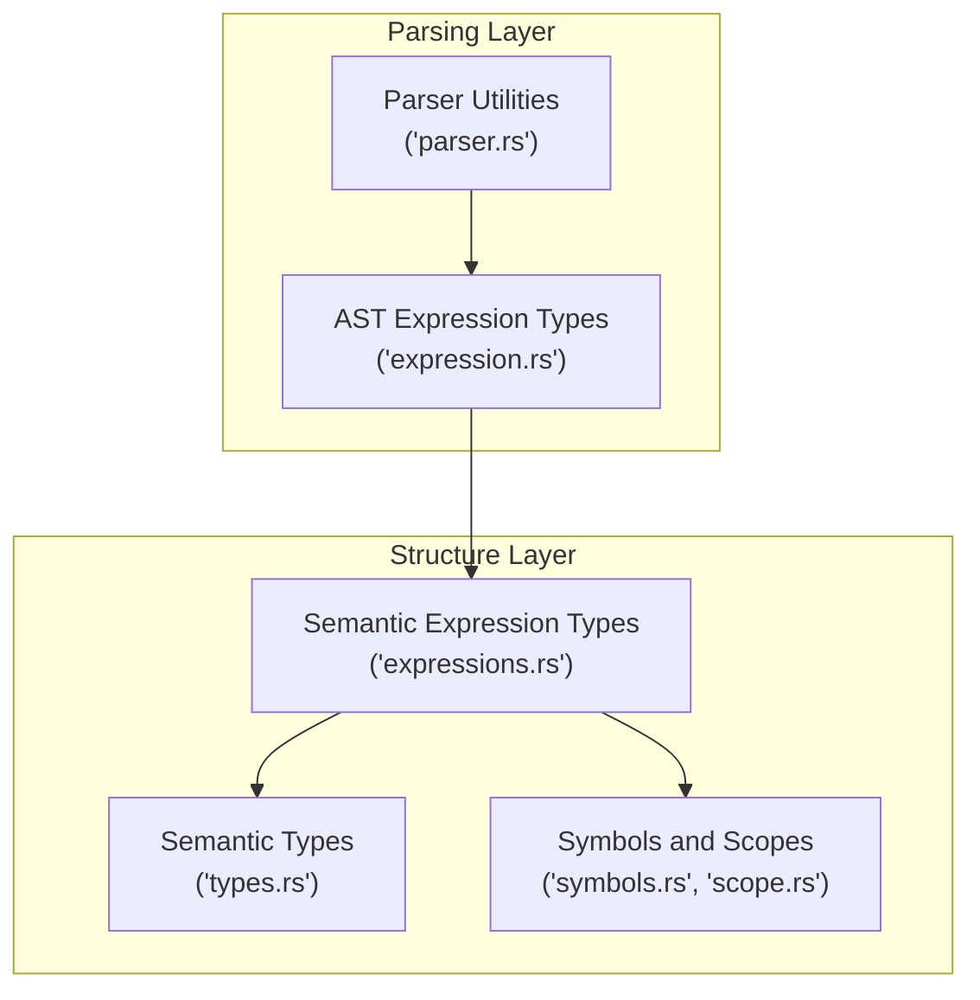
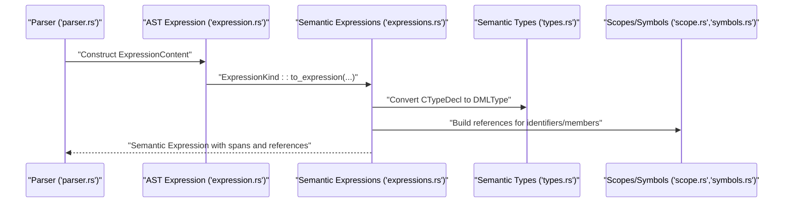
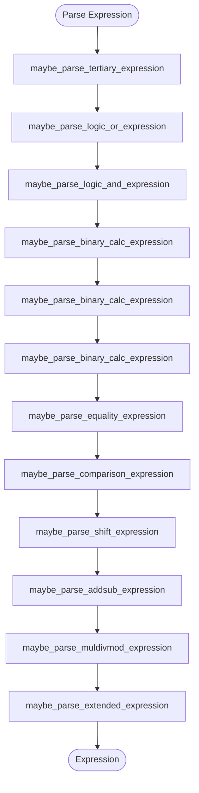
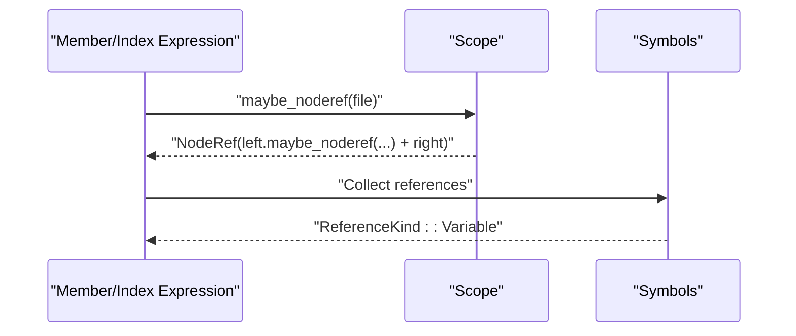
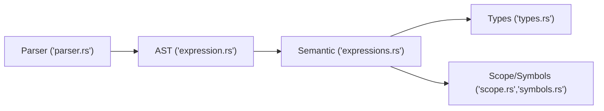

# Expression Analysis

<cite>
**Referenced Files in This Document**
- [expressions.rs](file://src/analysis/structure/expressions.rs)
- [types.rs](file://src/analysis/structure/types.rs)
- [expression.rs](file://src/analysis/parsing/expression.rs)
- [parser.rs](file://src/analysis/parsing/parser.rs)
- [scope.rs](file://src/analysis/scope.rs)
- [symbols.rs](file://src/analysis/symbols.rs)
</cite>

## Table of Contents
1. [Introduction](#introduction)
2. [Project Structure](#project-structure)
3. [Core Components](#core-components)
4. [Architecture Overview](#architecture-overview)
5. [Detailed Component Analysis](#detailed-component-analysis)
6. [Dependency Analysis](#dependency-analysis)
7. [Performance Considerations](#performance-considerations)
8. [Troubleshooting Guide](#troubleshooting-guide)
9. [Conclusion](#conclusion)

## Introduction
This document explains the semantic analysis of DML expressions in the language server. It focuses on how parsed AST expressions are transformed into semantic expression nodes, how operators and precedence are handled, and how type information is represented and propagated. It also covers variable resolution, constant folding considerations, and error handling for malformed expressions.

## Project Structure
The expression analysis spans two layers:
- Parsing layer: constructs the raw AST expression nodes with token-level details.
- Structure layer: transforms the AST into semantic nodes enriched with spans, types, and contextual metadata.

**Diagram sources**
- [expression.rs](file://src/analysis/parsing/expression.rs#L700-L720)
- [expressions.rs](file://src/analysis/structure/expressions.rs#L556-L587)
- [types.rs](file://src/analysis/structure/types.rs#L1-L11)
- [parser.rs](file://src/analysis/parsing/parser.rs#L490-L495)
- [symbols.rs](file://src/analysis/symbols.rs#L18-L37)
- [scope.rs](file://src/analysis/scope.rs#L13-L25)

**Section sources**
- [expression.rs](file://src/analysis/parsing/expression.rs#L700-L720)
- [expressions.rs](file://src/analysis/structure/expressions.rs#L556-L587)
- [types.rs](file://src/analysis/structure/types.rs#L1-L11)
- [parser.rs](file://src/analysis/parsing/parser.rs#L490-L495)
- [symbols.rs](file://src/analysis/symbols.rs#L18-L37)
- [scope.rs](file://src/analysis/scope.rs#L13-L25)

## Core Components
- Semantic expression kinds: Binary, Unary, Member, Tertiary, Index, Slice, Function call, Cast, New, SizeOf, SizeOfType, Constant list, EachIn, literals, identifiers, and special markers for undefined/unknown.
- Operator sets: Arithmetic (add, subtract, multiply, divide, modulo), bitwise (OR, AND, XOR, shifts), comparisons, logic (AND, OR), and ternary variants.
- Semantic types: Represented as spans for now, with helpers to convert parsed type declarations into semantic type references.
- Variable resolution: Implemented via node references and symbol contexts; identifiers and member expressions can produce references resolved against the current scope.

**Section sources**
- [expressions.rs](file://src/analysis/structure/expressions.rs#L35-L74)
- [expressions.rs](file://src/analysis/structure/expressions.rs#L556-L587)
- [types.rs](file://src/analysis/structure/types.rs#L1-L11)
- [expression.rs](file://src/analysis/parsing/expression.rs#L103-L140)
- [expression.rs](file://src/analysis/parsing/expression.rs#L142-L162)
- [expression.rs](file://src/analysis/parsing/expression.rs#L164-L181)
- [expression.rs](file://src/analysis/parsing/expression.rs#L201-L231)
- [expression.rs](file://src/analysis/parsing/expression.rs#L271-L322)
- [expression.rs](file://src/analysis/parsing/expression.rs#L324-L365)
- [expression.rs](file://src/analysis/parsing/expression.rs#L367-L423)
- [expression.rs](file://src/analysis/parsing/expression.rs#L425-L536)
- [expression.rs](file://src/analysis/parsing/expression.rs#L538-L594)
- [expression.rs](file://src/analysis/parsing/expression.rs#L596-L621)
- [expression.rs](file://src/analysis/parsing/expression.rs#L623-L687)

## Architecture Overview
The semantic analyzer converts parsed expressions into semantic nodes while preserving source spans and building references. Operators are handled via precedence-driven parsing, and type information is attached where applicable.

**Diagram sources**
- [parser.rs](file://src/analysis/parsing/parser.rs#L490-L495)
- [expression.rs](file://src/analysis/parsing/expression.rs#L700-L720)
- [expressions.rs](file://src/analysis/structure/expressions.rs#L742-L798)
- [types.rs](file://src/analysis/structure/types.rs#L82-L89)
- [expression.rs](file://src/analysis/parsing/expression.rs#L116-L140)

## Detailed Component Analysis

### Semantic Expression Kinds and Transformation
- BinaryExpression: Converts parsed binary operations into semantic nodes with operator enums and recursively processed children.
- UnaryExpression: Handles prefix/postfix unary operators and wraps operands into semantic nodes.
- MemberLiteral: Builds member access expressions with dot/arrow operators and identifier right-hand sides.
- TertiaryExpression: Supports conditional operators and ensures matching pairs of operators.
- IndexExpression and Slice: Indexes arrays/vectors; slices support optional right bound and bit-order markers.
- FunctionCall: Wraps function expressions and argument initializers into semantic nodes.
- CastExpression: Converts cast expressions with parsed target type to semantic type.
- NewExpression: Handles allocation with optional array sizing.
- SizeOf and SizeOfType: Capture sizeof expressions and type-size expressions.
- ConstantList and EachIn: Lists of expressions and iteration constructs.
- Literals: Integer, float, char, string, and undefined/unknown markers.
- Identifiers: Converted to semantic identifiers with spans.

Transformation pipeline:
- Each semantic variant provides a constructor that reads from the corresponding parsed content, recurses into child expressions, and attaches source spans.

**Section sources**
- [expressions.rs](file://src/analysis/structure/expressions.rs#L76-L124)
- [expressions.rs](file://src/analysis/structure/expressions.rs#L220-L262)
- [expressions.rs](file://src/analysis/structure/expressions.rs#L132-L169)
- [expressions.rs](file://src/analysis/structure/expressions.rs#L171-L217)
- [expressions.rs](file://src/analysis/structure/expressions.rs#L264-L293)
- [expressions.rs](file://src/analysis/structure/expressions.rs#L320-L347)
- [expressions.rs](file://src/analysis/structure/expressions.rs#L349-L375)
- [expressions.rs](file://src/analysis/structure/expressions.rs#L377-L403)
- [expressions.rs](file://src/analysis/structure/expressions.rs#L405-L430)
- [expressions.rs](file://src/analysis/structure/expressions.rs#L432-L454)
- [expressions.rs](file://src/analysis/structure/expressions.rs#L456-L482)
- [expressions.rs](file://src/analysis/structure/expressions.rs#L484-L508)
- [expressions.rs](file://src/analysis/structure/expressions.rs#L510-L534)
- [expressions.rs](file://src/analysis/structure/expressions.rs#L540-L587)
- [expressions.rs](file://src/analysis/structure/expressions.rs#L650-L740)
- [expressions.rs](file://src/analysis/structure/expressions.rs#L742-L798)

### Operator Precedence and Associativity
Precedence is encoded in the parsing hierarchy:
- Tertiary (conditional) forms the top level.
- Logical OR forms the next level.
- Logical AND forms the next level.
- Bitwise OR forms the next level.
- Bitwise XOR forms the next level.
- Bitwise AND forms the next level.
- Equality comparisons form the next level.
- Comparison operators form the next level.
- Shift operators form the next level.
- Add/subtract form the next level.
- Mul/div/mod form the next level.
- Extended expression continuations (call, index, member) form the bottom level.

Associativity:
- Left-associative operators are implemented by recursive descent that continues parsing further right-hand sides.
- Tertiary is left-associative in the parser’s construction.

**Diagram sources**
- [expression.rs](file://src/analysis/parsing/expression.rs#L1058-L1107)
- [expression.rs](file://src/analysis/parsing/expression.rs#L1033-L1056)
- [expression.rs](file://src/analysis/parsing/expression.rs#L1007-L1031)
- [expression.rs](file://src/analysis/parsing/expression.rs#L981-L1005)
- [expression.rs](file://src/analysis/parsing/expression.rs#L953-L977)
- [expression.rs](file://src/analysis/parsing/expression.rs#L927-L951)
- [expression.rs](file://src/analysis/parsing/expression.rs#L902-L925)
- [expression.rs](file://src/analysis/parsing/expression.rs#L877-L900)
- [expression.rs](file://src/analysis/parsing/expression.rs#L851-L875)
- [expression.rs](file://src/analysis/parsing/expression.rs#L809-L849)

**Section sources**
- [expression.rs](file://src/analysis/parsing/expression.rs#L809-L849)
- [expression.rs](file://src/analysis/parsing/expression.rs#L851-L875)
- [expression.rs](file://src/analysis/parsing/expression.rs#L877-L900)
- [expression.rs](file://src/analysis/parsing/expression.rs#L902-L925)
- [expression.rs](file://src/analysis/parsing/expression.rs#L927-L951)
- [expression.rs](file://src/analysis/parsing/expression.rs#L953-L977)
- [expression.rs](file://src/analysis/parsing/expression.rs#L981-L1005)
- [expression.rs](file://src/analysis/parsing/expression.rs#L1007-L1031)
- [expression.rs](file://src/analysis/parsing/expression.rs#L1033-L1056)
- [expression.rs](file://src/analysis/parsing/expression.rs#L1058-L1107)

### Expression Evaluation Contexts and Variable Resolution
- Identifiers and member expressions can produce references that are resolved against the current scope.
- Node references are constructed for member access and indexing, enabling downstream symbol resolution.
- Scopes maintain defined symbols and nested scopes; lookups traverse containment and context keys.

**Diagram sources**
- [expression.rs](file://src/analysis/parsing/expression.rs#L128-L140)
- [expression.rs](file://src/analysis/parsing/expression.rs#L445-L449)
- [scope.rs](file://src/analysis/scope.rs#L13-L25)
- [symbols.rs](file://src/analysis/symbols.rs#L35-L37)

**Section sources**
- [expression.rs](file://src/analysis/parsing/expression.rs#L128-L140)
- [expression.rs](file://src/analysis/parsing/expression.rs#L445-L449)
- [scope.rs](file://src/analysis/scope.rs#L13-L25)
- [symbols.rs](file://src/analysis/symbols.rs#L35-L37)

### Type Representation and Inference
- Semantic types are represented as spans for now; conversion helpers transform parsed type declarations into semantic type references.
- CastExpression carries a semantic type alongside the source expression.
- SizeOfType captures a semantic type derived from parsed CTypeDecl.

Note: Full type inference is not implemented in the referenced files; type information is currently a placeholder.

**Section sources**
- [types.rs](file://src/analysis/structure/types.rs#L1-L11)
- [types.rs](file://src/analysis/structure/types.rs#L82-L89)
- [expressions.rs](file://src/analysis/structure/expressions.rs#L349-L375)
- [expressions.rs](file://src/analysis/structure/expressions.rs#L456-L482)

### Constant Folding Optimizations
- The structure layer includes a placeholder for float storage and integer literal parsing with overflow reporting.
- No explicit constant folding is implemented in the analyzed files; arithmetic on literals is deferred to semantic nodes.

**Section sources**
- [expressions.rs](file://src/analysis/structure/expressions.rs#L569-L571)
- [expressions.rs](file://src/analysis/structure/expressions.rs#L649-L740)

### Error Handling for Malformed Expressions
- Parser utilities provide mechanisms to skip unexpected tokens and record missing tokens with descriptive reasons.
- Expression transformations log unexpected token kinds and return None to propagate errors upward.
- Integer literal parsing reports overflow conditions as diagnostics.

**Section sources**
- [parser.rs](file://src/analysis/parsing/parser.rs#L170-L214)
- [parser.rs](file://src/analysis/parsing/parser.rs#L472-L479)
- [expressions.rs](file://src/analysis/structure/expressions.rs#L110-L114)
- [expressions.rs](file://src/analysis/structure/expressions.rs#L249-L254)
- [expressions.rs](file://src/analysis/structure/expressions.rs#L623-L647)

## Dependency Analysis
- Parsing layer defines AST node types and precedence-driven parsing.
- Structure layer consumes AST nodes and produces semantic nodes with spans and references.
- Type conversion helpers bridge parsed types to semantic types.
- Scope and symbol systems enable variable resolution and reference collection.

**Diagram sources**
- [parser.rs](file://src/analysis/parsing/parser.rs#L490-L495)
- [expression.rs](file://src/analysis/parsing/expression.rs#L700-L720)
- [expressions.rs](file://src/analysis/structure/expressions.rs#L742-L798)
- [types.rs](file://src/analysis/structure/types.rs#L82-L89)
- [scope.rs](file://src/analysis/scope.rs#L13-L25)
- [symbols.rs](file://src/analysis/symbols.rs#L35-L37)

**Section sources**
- [parser.rs](file://src/analysis/parsing/parser.rs#L490-L495)
- [expression.rs](file://src/analysis/parsing/expression.rs#L700-L720)
- [expressions.rs](file://src/analysis/structure/expressions.rs#L742-L798)
- [types.rs](file://src/analysis/structure/types.rs#L82-L89)
- [scope.rs](file://src/analysis/scope.rs#L13-L25)
- [symbols.rs](file://src/analysis/symbols.rs#L35-L37)

## Performance Considerations
- Precedence parsing uses recursive descent; depth is bounded by expression complexity.
- Spans are combined via range operations; ensure minimal allocations by reusing ranges.
- Reference collection is incremental per node; avoid redundant traversals by leveraging node-local helpers.

## Troubleshooting Guide
Common issues and remedies:
- Unexpected operator tokens in binary/unary/tertiary parsing: Check token kind handling and ensure parser contexts are correctly configured.
- Integer overflow in literals: Diagnostics are emitted for positive/negative overflow; adjust numeric literals accordingly.
- Missing parentheses or brackets: Parser utilities record missing tokens; fix syntax or rely on recovery.
- Variable resolution failures: Verify scope containment and node reference construction for member/index expressions.

**Section sources**
- [expressions.rs](file://src/analysis/structure/expressions.rs#L110-L114)
- [expressions.rs](file://src/analysis/structure/expressions.rs#L249-L254)
- [expressions.rs](file://src/analysis/structure/expressions.rs#L623-L647)
- [parser.rs](file://src/analysis/parsing/parser.rs#L170-L214)
- [parser.rs](file://src/analysis/parsing/parser.rs#L472-L479)

## Conclusion
The expression analysis pipeline converts parsed AST expressions into rich semantic nodes with precise spans, operator precedence encoded in parsing order, and references for variable resolution. While full type inference is not present, semantic types and conversions provide a foundation for future enhancements. The design cleanly separates parsing concerns from semantic enrichment, enabling robust error handling and extensibility.