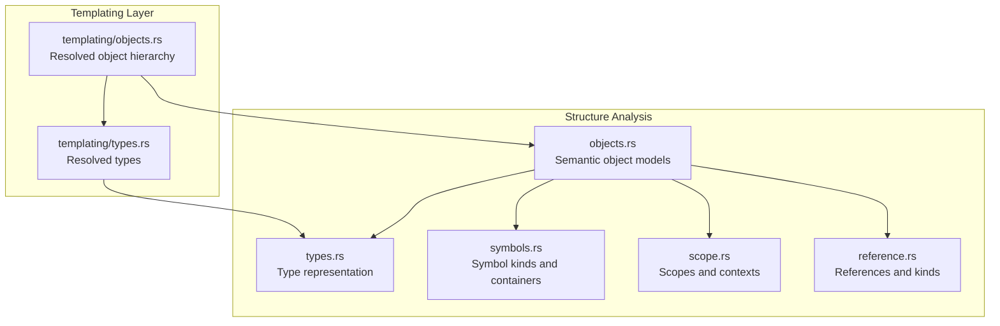
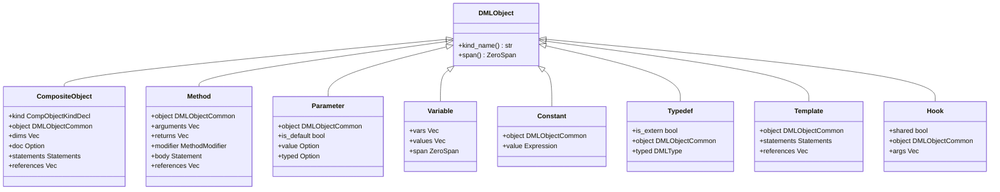
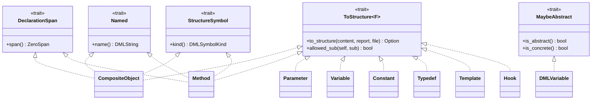
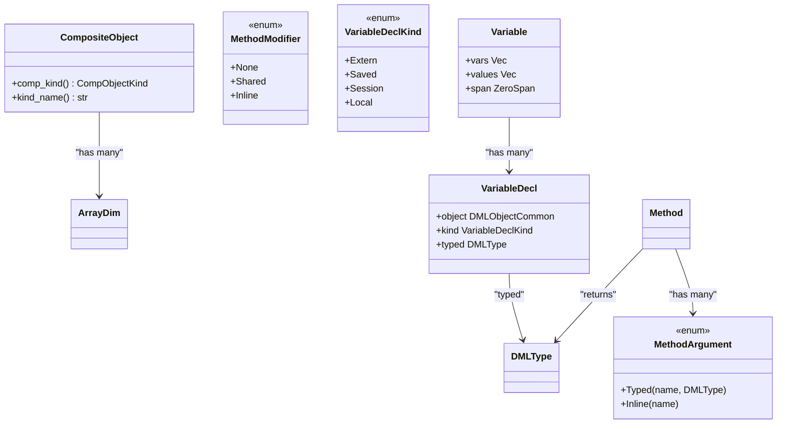
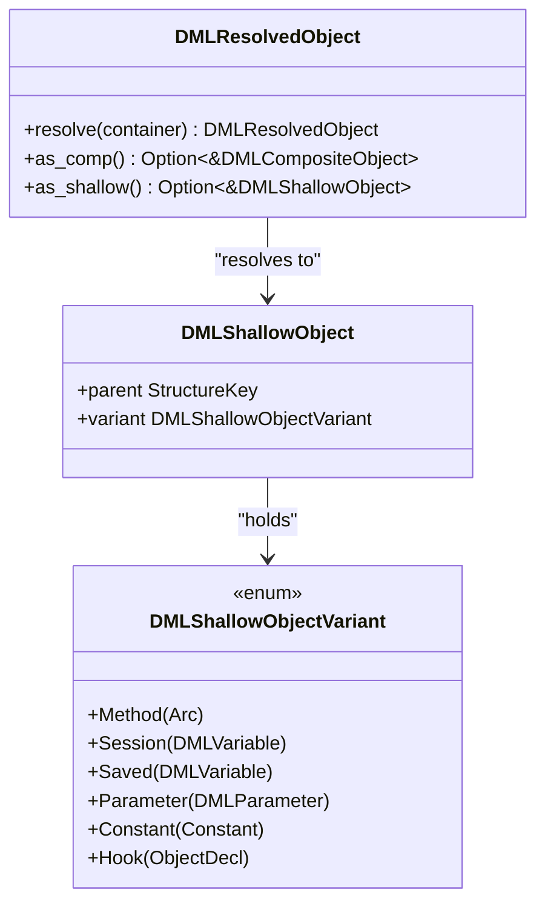
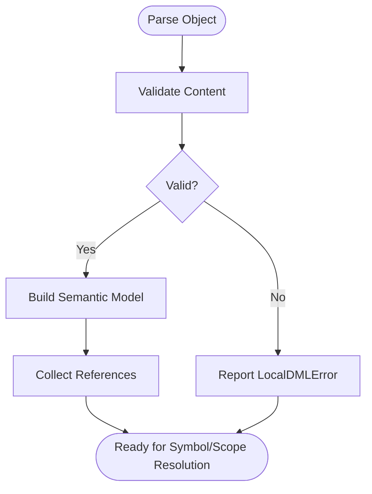
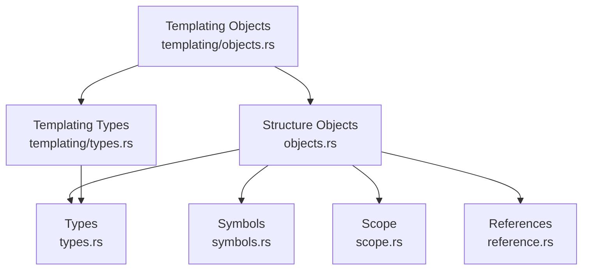

# Object Structure Analysis

<cite>
**Referenced Files in This Document**
- [objects.rs](file://src/analysis/structure/objects.rs)
- [types.rs](file://src/analysis/structure/types.rs)
- [symbols.rs](file://src/analysis/symbols.rs)
- [scope.rs](file://src/analysis/scope.rs)
- [reference.rs](file://src/analysis/reference.rs)
- [objects.rs](file://src/analysis/templating/objects.rs)
- [types.rs](file://src/analysis/templating/types.rs)
</cite>

## Table of Contents
1. [Introduction](#introduction)
2. [Project Structure](#project-structure)
3. [Core Components](#core-components)
4. [Architecture Overview](#architecture-overview)
5. [Detailed Component Analysis](#detailed-component-analysis)
6. [Dependency Analysis](#dependency-analysis)
7. [Performance Considerations](#performance-considerations)
8. [Troubleshooting Guide](#troubleshooting-guide)
9. [Conclusion](#conclusion)

## Introduction
This document explains the semantic phase’s object structure analysis for DML (Device Modeling Language). It focuses on how parsed object declarations are transformed into semantic models, how object hierarchies are represented, and how polymorphism and inheritance are modeled. It also covers member analysis, visibility rules, lifecycle management, type compatibility checks, and error reporting for invalid object definitions. The goal is to help both developers and advanced users understand how DML constructs are represented and validated in the semantic model.

## Project Structure
The semantic object structure resides primarily under the structure analysis module, with supporting infrastructure for symbols, scoping, references, and templating-driven object resolution.

**Diagram sources**
- [objects.rs](file://src/analysis/structure/objects.rs#L1-L1891)
- [types.rs](file://src/analysis/structure/types.rs#L1-L90)
- [symbols.rs](file://src/analysis/symbols.rs#L1-L192)
- [scope.rs](file://src/analysis/scope.rs#L1-L257)
- [reference.rs](file://src/analysis/reference.rs#L1-L200)
- [objects.rs](file://src/analysis/templating/objects.rs#L1-L800)
- [types.rs](file://src/analysis/templating/types.rs#L1-L93)

**Section sources**
- [objects.rs](file://src/analysis/structure/objects.rs#L1-L1891)
- [types.rs](file://src/analysis/structure/types.rs#L1-L90)
- [symbols.rs](file://src/analysis/symbols.rs#L1-L192)
- [scope.rs](file://src/analysis/scope.rs#L1-L257)
- [reference.rs](file://src/analysis/reference.rs#L1-L200)
- [objects.rs](file://src/analysis/templating/objects.rs#L1-L800)
- [types.rs](file://src/analysis/templating/types.rs#L1-L93)

## Core Components
- Semantic object models: Composite objects, methods, parameters, variables, constants, typedefs, templates, hooks, and more are represented as strongly typed structs with spans and optional typed members.
- Symbol system: Each object exposes a kind and location, enabling cross-references and diagnostics.
- Scoping: Each object declares its defined symbols and nested scopes, enabling local and hierarchical lookups.
- References: Variables and global references are tracked with kinds (template, type, variable, callable) to support resolution and diagnostics.
- Templating: Resolved objects form a hierarchy with shallow variants for methods, parameters, constants, session/saved variables, and hooks, enabling polymorphic behavior and inheritance-like composition.

**Section sources**
- [objects.rs](file://src/analysis/structure/objects.rs#L1492-L1561)
- [symbols.rs](file://src/analysis/symbols.rs#L18-L37)
- [scope.rs](file://src/analysis/scope.rs#L13-L62)
- [reference.rs](file://src/analysis/reference.rs#L96-L132)
- [objects.rs](file://src/analysis/templating/objects.rs#L340-L518)

## Architecture Overview
The semantic phase transforms parsed DML into a structured object model with explicit relationships and symbol tables. The templating layer resolves templates and instantiations into concrete object hierarchies, enabling polymorphism and inheritance-like behavior.

**Diagram sources**
- [objects.rs](file://src/analysis/structure/objects.rs#L896-L1511)

**Section sources**
- [objects.rs](file://src/analysis/structure/objects.rs#L896-L1511)

## Detailed Component Analysis

### Semantic Object Model and Interfaces
- ToStructure trait: Converts parsed content into semantic structures, reporting errors via a mutable vector of local errors.
- MaybeAbstract trait: Encodes abstract/concrete classification for objects like variables.
- DeclarationSpan and Named: Provide span and name accessors for diagnostics and symbol tables.
- StructureSymbol: Associates each object with a symbol kind for indexing and lookup.

**Diagram sources**
- [objects.rs](file://src/analysis/structure/objects.rs#L32-L46)
- [objects.rs](file://src/analysis/structure/objects.rs#L796-L812)
- [objects.rs](file://src/analysis/structure/objects.rs#L1330-L1346)
- [symbols.rs](file://src/analysis/symbols.rs#L18-L37)

**Section sources**
- [objects.rs](file://src/analysis/structure/objects.rs#L32-L46)
- [objects.rs](file://src/analysis/structure/objects.rs#L796-L812)
- [objects.rs](file://src/analysis/structure/objects.rs#L1330-L1346)
- [symbols.rs](file://src/analysis/symbols.rs#L18-L37)

### Object Members and Hierarchies
- CompositeObject: Represents device-level constructs (e.g., registers, fields, banks) with dimensions, documentation, nested statements, and references.
- Method: Encapsulates arguments, return types, modifiers, body, and references. Supports shared, inline, and memoized variants.
- Parameter: Stores default flags, optional typed value, and optional type hint.
- Variable: Declared variables with typed declarations and optional initializers; supports extern, saved, session, and local kinds.
- Constant and Typedef: Constants with expression values and typedefs with optional extern flag and type.
- Template: Defines a template with statements and references, enabling instantiation and polymorphism.
- Hook: Represents callable hooks with optional shared flag and typed argument lists.

**Diagram sources**
- [objects.rs](file://src/analysis/structure/objects.rs#L896-L947)
- [objects.rs](file://src/analysis/structure/objects.rs#L984-L1032)
- [objects.rs](file://src/analysis/structure/objects.rs#L1034-L1097)
- [objects.rs](file://src/analysis/structure/objects.rs#L1106-L1163)
- [objects.rs](file://src/analysis/structure/objects.rs#L1278-L1327)
- [objects.rs](file://src/analysis/structure/objects.rs#L1330-L1406)

**Section sources**
- [objects.rs](file://src/analysis/structure/objects.rs#L896-L947)
- [objects.rs](file://src/analysis/structure/objects.rs#L984-L1032)
- [objects.rs](file://src/analysis/structure/objects.rs#L1034-L1097)
- [objects.rs](file://src/analysis/structure/objects.rs#L1106-L1163)
- [objects.rs](file://src/analysis/structure/objects.rs#L1278-L1327)
- [objects.rs](file://src/analysis/structure/objects.rs#L1330-L1406)

### Inheritance Resolution and Polymorphism
- Templating layer builds a resolved object hierarchy with shallow variants for methods, parameters, constants, and hooks. This enables polymorphic behavior and inheritance-like composition.
- DMLResolvedObject resolves either a composite object or a shallow object, exposing identity, kind, and parent relationships.
- DMLShallowObjectVariant encapsulates method references, session/saved variables, parameters, constants, and hooks, allowing polymorphic dispatch.

**Diagram sources**
- [objects.rs](file://src/analysis/templating/objects.rs#L434-L495)
- [objects.rs](file://src/analysis/templating/objects.rs#L521-L566)
- [objects.rs](file://src/analysis/templating/objects.rs#L569-L626)

**Section sources**
- [objects.rs](file://src/analysis/templating/objects.rs#L434-L495)
- [objects.rs](file://src/analysis/templating/objects.rs#L521-L566)
- [objects.rs](file://src/analysis/templating/objects.rs#L569-L626)

### Semantic Validation and Error Reporting
- Version parsing reports invalid major/minor versions as local errors.
- Provisional declarations trigger a specific error if not placed immediately after the version declaration.
- Variable initialization arity mismatch triggers an error when the number of initializers does not match the number of declarations (with exceptions for single-function initializer).
- Composite object creation collects references for dimensions, instantiations, and statements to support diagnostics and navigation.

**Diagram sources**
- [objects.rs](file://src/analysis/structure/objects.rs#L127-L177)
- [objects.rs](file://src/analysis/structure/objects.rs#L1656-L1666)
- [objects.rs](file://src/analysis/structure/objects.rs#L1372-L1395)
- [objects.rs](file://src/analysis/structure/objects.rs#L1770-L1787)

**Section sources**
- [objects.rs](file://src/analysis/structure/objects.rs#L127-L177)
- [objects.rs](file://src/analysis/structure/objects.rs#L1656-L1666)
- [objects.rs](file://src/analysis/structure/objects.rs#L1372-L1395)
- [objects.rs](file://src/analysis/structure/objects.rs#L1770-L1787)

### Member Visibility Rules and Lifecycle Management
- Visibility is not modeled as a dedicated field in the semantic objects; however, symbol kinds distinguish between extern, saved, session, and local variables, which implies distinct visibility and lifetime characteristics.
- Lifecycle is managed through scoping: each object declares defined symbols and nested scopes, enabling local lookups and reference resolution.
- References are collected during construction to support diagnostics and navigation.

**Section sources**
- [objects.rs](file://src/analysis/structure/objects.rs#L1299-L1308)
- [scope.rs](file://src/analysis/scope.rs#L13-L62)
- [reference.rs](file://src/analysis/reference.rs#L96-L132)

### Type Compatibility Checking for Object Hierarchies
- Types are represented as spans initially; concrete type evaluation occurs in the templating layer.
- Resolved types support equivalence checks for compatibility, enabling method override validation without strict type equality.

**Section sources**
- [types.rs](file://src/analysis/structure/types.rs#L9-L11)
- [types.rs](file://src/analysis/structure/types.rs#L82-L89)
- [types.rs](file://src/analysis/templating/types.rs#L46-L72)

## Dependency Analysis
The semantic object model relies on a layered design:
- Structure layer: Defines semantic objects and their relationships.
- Symbols layer: Provides symbol kinds and containers for indexing.
- Scope layer: Enables hierarchical symbol and scope traversal.
- Reference layer: Tracks variable and global references with kinds.
- Templating layer: Resolves templates and instantiations into concrete object hierarchies.

**Diagram sources**
- [objects.rs](file://src/analysis/structure/objects.rs#L1-L1891)
- [types.rs](file://src/analysis/structure/types.rs#L1-L90)
- [symbols.rs](file://src/analysis/symbols.rs#L1-L192)
- [scope.rs](file://src/analysis/scope.rs#L1-L257)
- [reference.rs](file://src/analysis/reference.rs#L1-L200)
- [objects.rs](file://src/analysis/templating/objects.rs#L1-L800)
- [types.rs](file://src/analysis/templating/types.rs#L1-L93)

**Section sources**
- [objects.rs](file://src/analysis/structure/objects.rs#L1-L1891)
- [types.rs](file://src/analysis/structure/types.rs#L1-L90)
- [symbols.rs](file://src/analysis/symbols.rs#L1-L192)
- [scope.rs](file://src/analysis/scope.rs#L1-L257)
- [reference.rs](file://src/analysis/reference.rs#L1-L200)
- [objects.rs](file://src/analysis/templating/objects.rs#L1-L800)
- [types.rs](file://src/analysis/templating/types.rs#L1-L93)

## Performance Considerations
- Lazy type evaluation: Types are represented as spans initially and evaluated only when needed in the templating layer.
- Reference collection: References are accumulated during object construction to minimize repeated scans.
- Scope traversal: Hierarchical scope traversal is optimized through context keys and precomputed symbol sets.

## Troubleshooting Guide
- Invalid version format: Errors are reported for malformed major/minor versions.
- Provisional placement: Errors are raised if provisional declarations are not placed immediately after the version declaration.
- Variable initializer mismatch: Errors are reported when the number of initializers does not match declarations (with allowances for single-function initializers).
- Missing object names: Many constructors discard incomplete constructs when names are missing, preventing partial models from leaking into diagnostics.

**Section sources**
- [objects.rs](file://src/analysis/structure/objects.rs#L127-L177)
- [objects.rs](file://src/analysis/structure/objects.rs#L1656-L1666)
- [objects.rs](file://src/analysis/structure/objects.rs#L1372-L1395)

## Conclusion
The semantic phase transforms parsed DML into a robust object model with explicit relationships, symbol tables, and references. The templating layer resolves templates and instantiations into a concrete hierarchy, enabling polymorphism and inheritance-like behavior. Validation ensures correctness of object definitions, while scoping and reference tracking support accurate diagnostics and navigation. Together, these components provide a solid foundation for higher-level analysis and code generation.