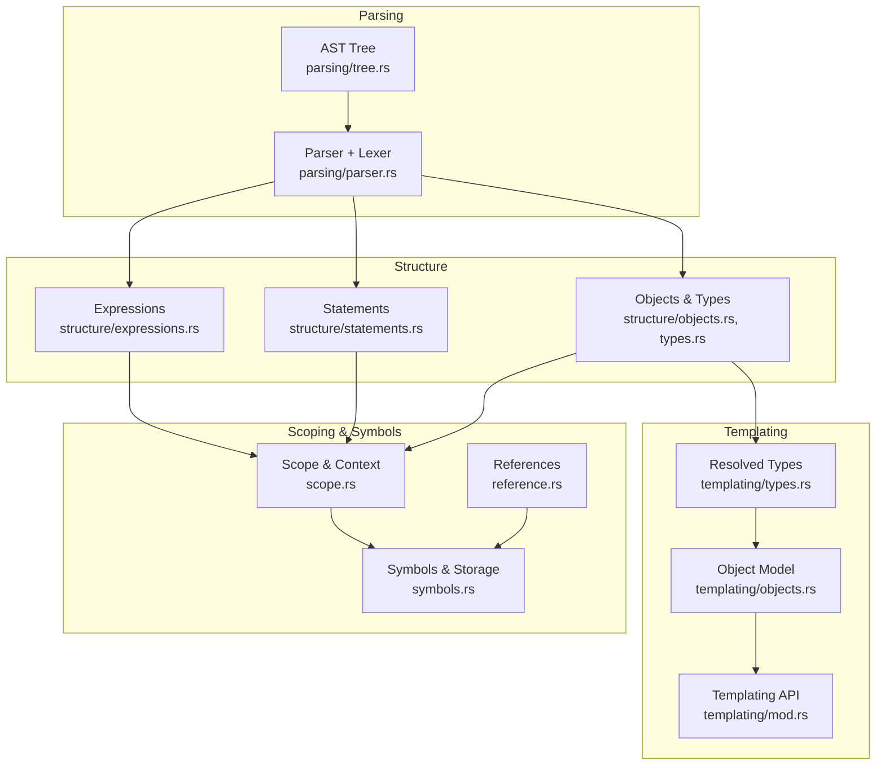
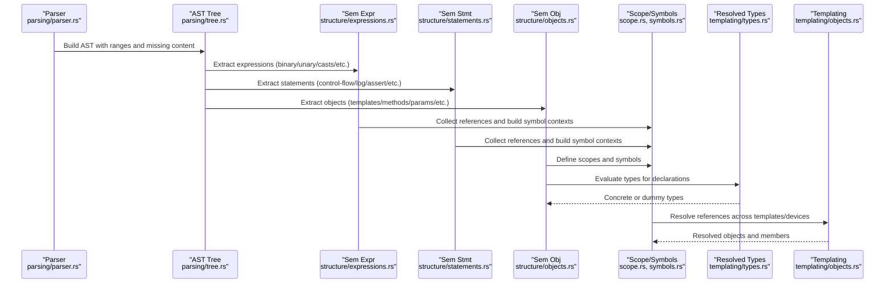
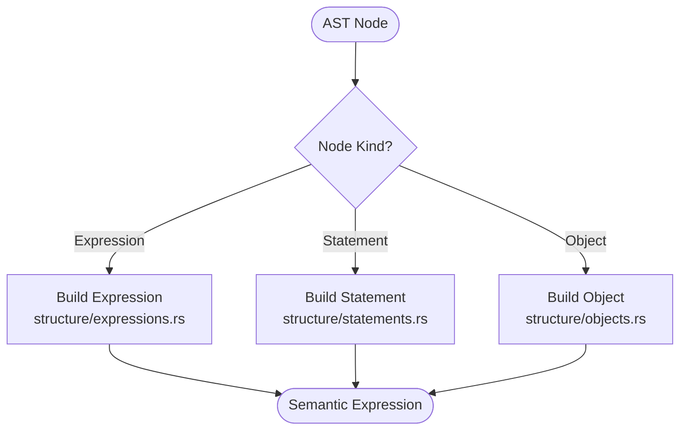
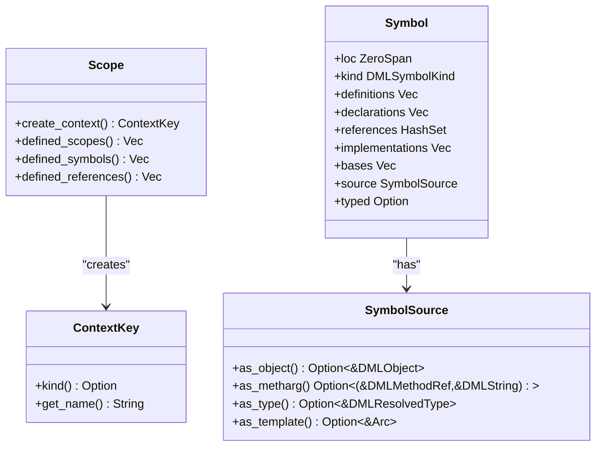
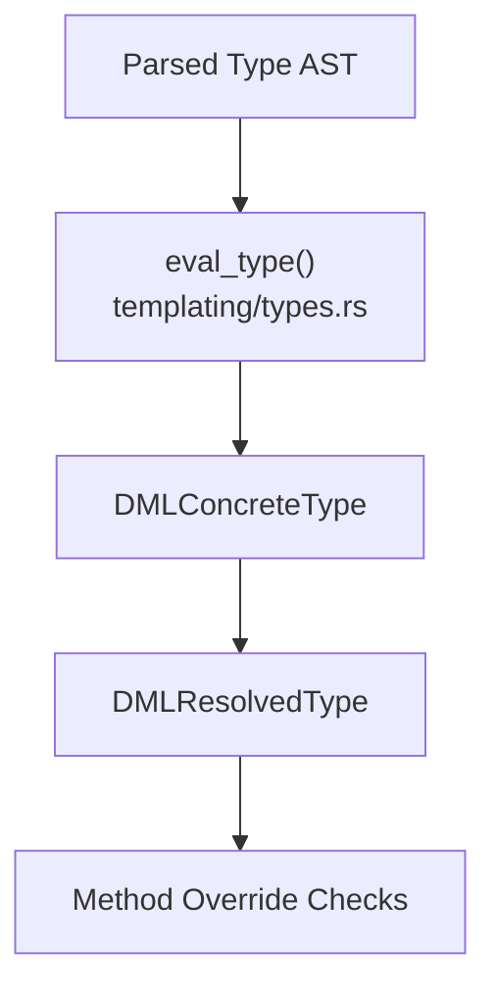
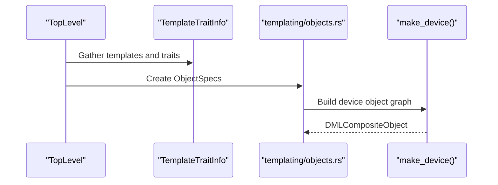
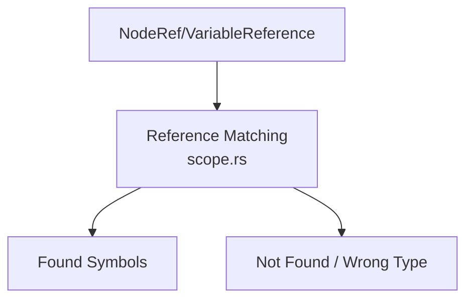
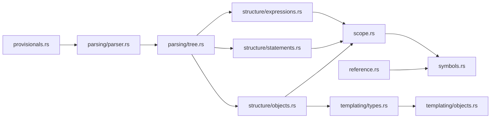

# Semantic Analysis

<cite>
**Referenced Files in This Document**
- [mod.rs](file://src/analysis/mod.rs)
- [scope.rs](file://src/analysis/scope.rs)
- [symbols.rs](file://src/analysis/symbols.rs)
- [provisionals.rs](file://src/analysis/provisionals.rs)
- [reference.rs](file://src/analysis/reference.rs)
- [types.rs](file://src/analysis/structure/types.rs)
- [expressions.rs](file://src/analysis/structure/expressions.rs)
- [statements.rs](file://src/analysis/structure/statements.rs)
- [objects.rs](file://src/analysis/structure/objects.rs)
- [templating/mod.rs](file://src/analysis/templating/mod.rs)
- [templating/types.rs](file://src/analysis/templating/types.rs)
- [templating/objects.rs](file://src/analysis/templating/objects.rs)
- [parsing/mod.rs](file://src/analysis/parsing/mod.rs)
- [parsing/parser.rs](file://src/analysis/parsing/parser.rs)
- [parsing/tree.rs](file://src/analysis/parsing/tree.rs)
</cite>

## Table of Contents
1. [Introduction](#introduction)
2. [Project Structure](#project-structure)
3. [Core Components](#core-components)
4. [Architecture Overview](#architecture-overview)
5. [Detailed Component Analysis](#detailed-component-analysis)
6. [Dependency Analysis](#dependency-analysis)
7. [Performance Considerations](#performance-considerations)
8. [Troubleshooting Guide](#troubleshooting-guide)
9. [Conclusion](#conclusion)

## Introduction
This document explains the semantic analysis phase of the DML analysis engine. It focuses on how the AST is transformed into a semantic representation, how symbols and scopes are built, how type information is modeled and resolved, and how references are resolved across templates and devices. It also documents error reporting during semantic analysis and offers performance guidance for large codebases.

## Project Structure
The semantic analysis pipeline is organized around:
- Parsing: produces an AST with positions and missing constructs.
- Structure: transforms AST nodes into semantic structures (expressions, statements, objects, types).
- Scoping and Symbols: builds symbol tables and context-aware lookups.
- Templating: resolves types, templates, and object hierarchies for device instantiation.
- Provisionals and References: support optional features and cross-file references.

**Diagram sources**
- [parsing/tree.rs](file://src/analysis/parsing/tree.rs#L33-L120)
- [parsing/parser.rs](file://src/analysis/parsing/parser.rs#L483-L496)
- [expressions.rs](file://src/analysis/structure/expressions.rs#L556-L621)
- [statements.rs](file://src/analysis/structure/statements.rs#L1-L120)
- [objects.rs](file://src/analysis/structure/objects.rs#L1-L120)
- [scope.rs](file://src/analysis/scope.rs#L13-L62)
- [symbols.rs](file://src/analysis/symbols.rs#L35-L95)
- [reference.rs](file://src/analysis/reference.rs#L8-L69)
- [templating/types.rs](file://src/analysis/templating/types.rs#L46-L93)
- [templating/objects.rs](file://src/analysis/templating/objects.rs#L46-L106)
- [templating/mod.rs](file://src/analysis/templating/mod.rs#L14-L31)

**Section sources**
- [parsing/mod.rs](file://src/analysis/parsing/mod.rs#L1-L16)
- [parsing/tree.rs](file://src/analysis/parsing/tree.rs#L33-L120)
- [parsing/parser.rs](file://src/analysis/parsing/parser.rs#L483-L496)
- [scope.rs](file://src/analysis/scope.rs#L13-L62)
- [symbols.rs](file://src/analysis/symbols.rs#L35-L95)
- [reference.rs](file://src/analysis/reference.rs#L8-L69)
- [expressions.rs](file://src/analysis/structure/expressions.rs#L556-L621)
- [statements.rs](file://src/analysis/structure/statements.rs#L1-L120)
- [objects.rs](file://src/analysis/structure/objects.rs#L1-L120)
- [templating/types.rs](file://src/analysis/templating/types.rs#L46-L93)
- [templating/objects.rs](file://src/analysis/templating/objects.rs#L46-L106)
- [templating/mod.rs](file://src/analysis/templating/mod.rs#L14-L31)

## Core Components
- AST and Tree Elements: The AST is composed of tree elements with ranges, positions, and missing content markers. It supports traversal, reference collection, and sanity checks.
- Semantic Expressions: Binary, unary, cast, indexing, slicing, function calls, and literals are represented as structured expressions with spans.
- Statements: Control-flow constructs (if/hash-if/switch/for/while/do-while), try/catch/throw, logging/assert/delete/error, and after-timing calls are captured as structured statements.
- Objects and Declarations: Templates, methods, parameters, constants, sessions, saveds, hooks, imports, and in-each blocks are modeled as semantic objects with scopes and references.
- Types: A lightweight type representation is used during semantic analysis, with a resolver that evaluates types and returns concrete types or placeholders.
- Scopes and Symbols: Context keys, symbol containers, and scoped symbol lookups enable robust name resolution across nested constructs.
- References: NodeRef and VariableReference capture dotted names and their kinds (template/type/variable/callable), enabling cross-scope resolution.
- Provisionals: Optional feature flags are parsed and tracked to conditionally enable diagnostics or behaviors.

**Section sources**
- [parsing/tree.rs](file://src/analysis/parsing/tree.rs#L33-L120)
- [expressions.rs](file://src/analysis/structure/expressions.rs#L556-L621)
- [statements.rs](file://src/analysis/structure/statements.rs#L1-L120)
- [objects.rs](file://src/analysis/structure/objects.rs#L647-L726)
- [types.rs](file://src/analysis/structure/types.rs#L9-L20)
- [scope.rs](file://src/analysis/scope.rs#L98-L138)
- [symbols.rs](file://src/analysis/symbols.rs#L35-L95)
- [reference.rs](file://src/analysis/reference.rs#L8-L69)
- [provisionals.rs](file://src/analysis/provisionals.rs#L13-L32)

## Architecture Overview
The semantic analysis transforms parsed AST nodes into semantic structures and resolves references and types across scopes and templates. The process is driven by:
- Tree walking and content extraction from the AST.
- Construction of semantic expressions and statements.
- Building symbol tables and scopes.
- Resolving types via a type evaluator.
- Tracking references and resolving them against symbols.

**Diagram sources**
- [parsing/parser.rs](file://src/analysis/parsing/parser.rs#L483-L496)
- [parsing/tree.rs](file://src/analysis/parsing/tree.rs#L33-L120)
- [expressions.rs](file://src/analysis/structure/expressions.rs#L742-L799)
- [statements.rs](file://src/analysis/structure/statements.rs#L589-L787)
- [objects.rs](file://src/analysis/structure/objects.rs#L686-L726)
- [scope.rs](file://src/analysis/scope.rs#L47-L62)
- [symbols.rs](file://src/analysis/symbols.rs#L35-L95)
- [templating/types.rs](file://src/analysis/templating/types.rs#L80-L93)
- [templating/objects.rs](file://src/analysis/templating/objects.rs#L46-L106)

## Detailed Component Analysis

### Semantic Structure Extraction from AST Nodes
- Expressions: Binary, unary, member, tertiary, cast, index/slice, function call, new/sizeof/typeof, constant lists, and each-in constructs are mapped to structured expression forms with spans and typed operands.
- Statements: Control-flow, try/catch/throw, logging, assertions, deletes, after timing, and return statements are captured with their substructures and symbol scopes.
- Objects: Templates, methods, parameters, constants, sessions, saveds, hooks, imports, and in-each blocks define scopes and symbols. They also collect references for later resolution.

**Diagram sources**
- [expressions.rs](file://src/analysis/structure/expressions.rs#L742-L799)
- [statements.rs](file://src/analysis/structure/statements.rs#L589-L787)
- [objects.rs](file://src/analysis/structure/objects.rs#L686-L726)

**Section sources**
- [expressions.rs](file://src/analysis/structure/expressions.rs#L556-L621)
- [statements.rs](file://src/analysis/structure/statements.rs#L1-L120)
- [objects.rs](file://src/analysis/structure/objects.rs#L647-L726)

### Symbol Table Construction and Scope Resolution
- Scope: Each construct that introduces a scope exposes defined scopes, symbols, and references. Context keys represent the current scope kind (structure/method/template/all-with-template).
- Symbol: Symbols track definitions, declarations, references, implementations, and typed information. SymbolSource ties symbols to their origins (object, method arg/local, type, template).
- Lookup: Scopes and contexts support hierarchical lookup and reference matching, with position-aware resolution to avoid forward references.

**Diagram sources**
- [scope.rs](file://src/analysis/scope.rs#L98-L138)
- [symbols.rs](file://src/analysis/symbols.rs#L111-L155)

**Section sources**
- [scope.rs](file://src/analysis/scope.rs#L13-L62)
- [symbols.rs](file://src/analysis/symbols.rs#L35-L95)

### Type System Implementation and Resolution
- DMLType: A lightweight type placeholder backed by a source span.
- DMLResolvedType: Concrete or dummy resolved types; evaluation yields concrete types and structural types.
- Evaluation: The type evaluator converts parsed type ASTs into resolved types, supporting method override compatibility checks via equivalence.

**Diagram sources**
- [types.rs](file://src/analysis/structure/types.rs#L9-L20)
- [templating/types.rs](file://src/analysis/templating/types.rs#L80-L93)

**Section sources**
- [types.rs](file://src/analysis/structure/types.rs#L9-L20)
- [templating/types.rs](file://src/analysis/templating/types.rs#L46-L93)

### Template Instantiation and Object Resolution
- ObjectSpec: Captures existence conditions, ranks, subobjects, instantiations, imports, in-each specs, and member lists.
- make_device: Builds a device object graph from toplevel specs, imports, and template instantiations.
- DMLObject/DMLResolvedObject: Unified representation for composite and shallow objects, enabling cross-resolution and hierarchy navigation.

**Diagram sources**
- [templating/objects.rs](file://src/analysis/templating/objects.rs#L273-L338)
- [templating/mod.rs](file://src/analysis/templating/mod.rs#L14-L31)

**Section sources**
- [templating/objects.rs](file://src/analysis/templating/objects.rs#L46-L106)
- [templating/objects.rs](file://src/analysis/templating/objects.rs#L273-L338)
- [templating/mod.rs](file://src/analysis/templating/mod.rs#L14-L31)

### Reference Resolution and Cross-File Support
- NodeRef and VariableReference: Represent dotted identifiers and their kinds, enabling resolution against symbol tables.
- ReferenceKind: Distinguishes templates, types, variables, and callable references.
- ReferenceMatching: Scopes and contexts support hierarchical matching and suggestion of candidates.

**Diagram sources**
- [reference.rs](file://src/analysis/reference.rs#L8-L69)
- [scope.rs](file://src/analysis/scope.rs#L248-L257)

**Section sources**
- [reference.rs](file://src/analysis/reference.rs#L8-L69)
- [scope.rs](file://src/analysis/scope.rs#L248-L257)

### Provisionals and Optional Features
- Provisionals: Optional feature flags are parsed and tracked to conditionally enable diagnostics or behaviors.
- Validation: Duplicate and invalid provisionals are recorded for reporting.

**Section sources**
- [provisionals.rs](file://src/analysis/provisionals.rs#L13-L32)

## Dependency Analysis
The semantic analysis layer composes several modules with clear boundaries:
- Parsing provides the AST and missing content.
- Structure consumes AST to produce semantic expressions, statements, and objects.
- Scoping and symbols provide name resolution and context-aware lookups.
- Templating resolves types and instantiates templates into device object graphs.
- Provisionals and references integrate optional features and cross-file references.

**Diagram sources**
- [parsing/parser.rs](file://src/analysis/parsing/parser.rs#L483-L496)
- [parsing/tree.rs](file://src/analysis/parsing/tree.rs#L33-L120)
- [expressions.rs](file://src/analysis/structure/expressions.rs#L556-L621)
- [statements.rs](file://src/analysis/structure/statements.rs#L1-L120)
- [objects.rs](file://src/analysis/structure/objects.rs#L647-L726)
- [scope.rs](file://src/analysis/scope.rs#L13-L62)
- [symbols.rs](file://src/analysis/symbols.rs#L35-L95)
- [reference.rs](file://src/analysis/reference.rs#L8-L69)
- [templating/types.rs](file://src/analysis/templating/types.rs#L46-L93)
- [templating/objects.rs](file://src/analysis/templating/objects.rs#L46-L106)
- [provisionals.rs](file://src/analysis/provisionals.rs#L13-L32)

**Section sources**
- [parsing/mod.rs](file://src/analysis/parsing/mod.rs#L1-L16)
- [scope.rs](file://src/analysis/scope.rs#L13-L62)
- [symbols.rs](file://src/analysis/symbols.rs#L35-L95)
- [reference.rs](file://src/analysis/reference.rs#L8-L69)
- [expressions.rs](file://src/analysis/structure/expressions.rs#L556-L621)
- [statements.rs](file://src/analysis/structure/statements.rs#L1-L120)
- [objects.rs](file://src/analysis/structure/objects.rs#L647-L726)
- [templating/types.rs](file://src/analysis/templating/types.rs#L46-L93)
- [templating/objects.rs](file://src/analysis/templating/objects.rs#L46-L106)
- [provisionals.rs](file://src/analysis/provisionals.rs#L13-L32)

## Performance Considerations
- Incremental symbol resolution: Reference caches and context keys reduce repeated lookups across large files and templates.
- Spatial indexing: RangeEntry uses nested intervals to quickly narrow symbol candidates by position.
- Parallelization: The engine leverages parallelism for large-scale analysis tasks.
- Lazy type evaluation: DMLResolvedType supports dummy types to avoid aborting analysis on unresolved constructs.
- Early pruning: Missing content and missing tokens are captured early to minimize downstream recomputation.

[No sources needed since this section provides general guidance]

## Troubleshooting Guide
- Missing tokens and content: The AST reports missing tokens and content with precise ranges and reasons, aiding targeted diagnostics.
- Local and global errors: LocalDMLError and DMLError unify error reporting with severity and related spans.
- Provisional diagnostics: Invalid or duplicated provisionals are tracked and surfaced as warnings or errors depending on context.
- Reference resolution failures: ReferenceMatch distinguishes not-found, wrong-type, and found cases to guide suggestions.

**Section sources**
- [parsing/tree.rs](file://src/analysis/parsing/tree.rs#L234-L284)
- [mod.rs](file://src/analysis/mod.rs#L210-L265)
- [provisionals.rs](file://src/analysis/provisionals.rs#L34-L63)
- [scope.rs](file://src/analysis/scope.rs#L248-L257)

## Conclusion
The semantic analysis phase of the DML analysis engine transforms parsed AST nodes into rich semantic structures, constructs symbol tables and scopes, resolves types and references, and integrates optional features and cross-file references. The modular design enables scalable analysis of large DML codebases while maintaining precise diagnostics and robust template-driven object resolution.