# Statement Processing

<cite>
**Referenced Files in This Document**
- [statement.rs](file://src/analysis/parsing/statement.rs)
- [statements.rs](file://src/analysis/structure/statements.rs)
- [scope.rs](file://src/analysis/scope.rs)
- [parser.rs](file://src/analysis/parsing/parser.rs)
- [mod.rs](file://src/analysis/mod.rs)
- [expressions.py](file://python-port/dml_language_server/analysis/structure/expressions.py)
- [statements.py](file://python-port/dml_language_server/analysis/structure/statements.py)
</cite>

## Table of Contents
1. [Introduction](#introduction)
2. [Project Structure](#project-structure)
3. [Core Components](#core-components)
4. [Architecture Overview](#architecture-overview)
5. [Detailed Component Analysis](#detailed-component-analysis)
6. [Dependency Analysis](#dependency-analysis)
7. [Performance Considerations](#performance-considerations)
8. [Troubleshooting Guide](#troubleshooting-guide)
9. [Conclusion](#conclusion)

## Introduction
This document describes the semantic analysis phase for DML statement processing. It explains how control flow statements (if/else, loops, switches), declaration statements, and compound statements are parsed and transformed into a structured representation suitable for downstream analysis. It also documents statement scoping rules, variable lifetime analysis, control flow graph construction, semantic validation of statement sequences, break/continue statement resolution, and return statement type checking. The document includes examples of statement analysis workflows, scope management during statement processing, and error detection for unreachable code and invalid statement combinations.

## Project Structure
The statement processing pipeline consists of:
- Parsing layer: constructs concrete syntax tree nodes for statements
- Structure layer: transforms parsed statements into a semantic representation
- Scope management: tracks symbol definitions and references across nested scopes
- Validation and diagnostics: performs semantic checks and reports errors

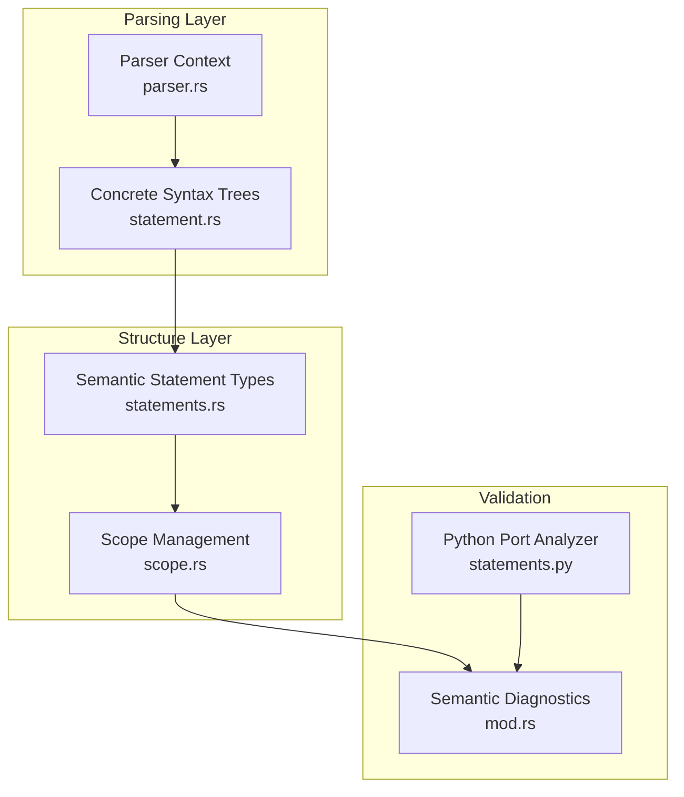

**Diagram sources**
- [statement.rs](file://src/analysis/parsing/statement.rs#L1-L200)
- [statements.rs](file://src/analysis/structure/statements.rs#L1108-L1252)
- [scope.rs](file://src/analysis/scope.rs#L13-L62)
- [parser.rs](file://src/analysis/parsing/parser.rs#L48-L120)
- [mod.rs](file://src/analysis/mod.rs#L292-L316)
- [statements.py](file://python-port/dml_language_server/analysis/structure/statements.py#L410-L730)

**Section sources**
- [statement.rs](file://src/analysis/parsing/statement.rs#L1-L200)
- [statements.rs](file://src/analysis/structure/statements.rs#L1108-L1252)
- [scope.rs](file://src/analysis/scope.rs#L13-L62)
- [parser.rs](file://src/analysis/parsing/parser.rs#L48-L120)
- [mod.rs](file://src/analysis/mod.rs#L292-L316)
- [statements.py](file://python-port/dml_language_server/analysis/structure/statements.py#L410-L730)

## Core Components
- Statement parsing constructs concrete syntax tree nodes for all statement forms (control flow, declarations, assignments, etc.).
- Statement structure conversion builds semantic statement types with spans and symbol containers.
- Scope management provides hierarchical symbol and reference tracking.
- Validation collects semantic diagnostics and enforces rules like break/continue placement and return type checking.

Key responsibilities:
- Control flow statements: If/Else, While, Do/While, For, ForEach, Switch, HashIf, HashSelect
- Declaration statements: Variable declarations with local/saved/session kinds
- Compound statements: Blocks containing multiple statements
- Special statements: Return, Break, Continue, Throw, Try/Catch, Log, Assert, After, Delete, Error

**Section sources**
- [statement.rs](file://src/analysis/parsing/statement.rs#L134-L185)
- [statements.rs](file://src/analysis/structure/statements.rs#L1110-L1136)
- [scope.rs](file://src/analysis/scope.rs#L13-L62)

## Architecture Overview
The semantic analysis pipeline converts parsed statements into structured semantic forms and validates them against scoping and control-flow rules.

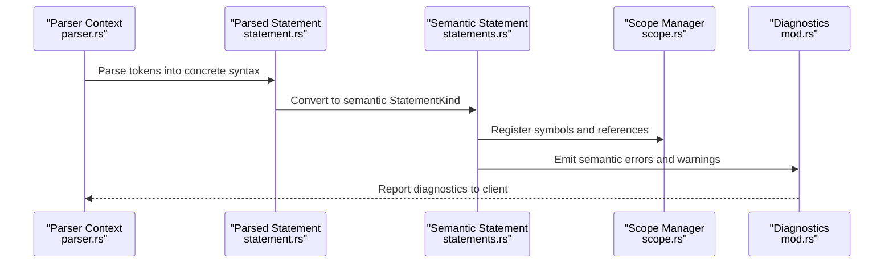

**Diagram sources**
- [parser.rs](file://src/analysis/parsing/parser.rs#L48-L120)
- [statement.rs](file://src/analysis/parsing/statement.rs#L134-L185)
- [statements.rs](file://src/analysis/structure/statements.rs#L1188-L1245)
- [scope.rs](file://src/analysis/scope.rs#L13-L62)
- [mod.rs](file://src/analysis/mod.rs#L210-L265)

## Detailed Component Analysis

### Control Flow Statements
Control flow statements define branching and looping behavior. The parser recognizes keywords and constructs specialized AST nodes; the structure layer converts them into semantic forms with typed bodies and conditions.

- If/Else: Conditional branches with optional else body
- While/Do/While: Loop constructs with condition and body
- For/For/Each: Iterative constructs with pre/post expressions and body
- Switch: Multi-way branch with cases and defaults
- HashIf/HashSelect: Preprocessor-style conditional selection

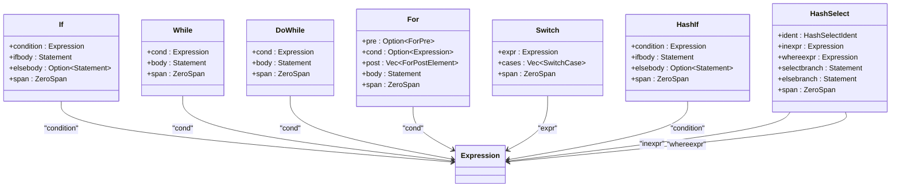

**Diagram sources**
- [statements.rs](file://src/analysis/structure/statements.rs#L82-L160)
- [statements.rs](file://src/analysis/structure/statements.rs#L288-L352)
- [statements.rs](file://src/analysis/structure/statements.rs#L321-L352)
- [statements.rs](file://src/analysis/structure/statements.rs#L376-L451)
- [statements.rs](file://src/analysis/structure/statements.rs#L255-L286)
- [statements.rs](file://src/analysis/structure/statements.rs#L122-L160)
- [statements.rs](file://src/analysis/structure/statements.rs#L1017-L1041)

**Section sources**
- [statement.rs](file://src/analysis/parsing/statement.rs#L410-L469)
- [statement.rs](file://src/analysis/parsing/statement.rs#L529-L575)
- [statement.rs](file://src/analysis/parsing/statement.rs#L577-L632)
- [statement.rs](file://src/analysis/parsing/statement.rs#L838-L911)
- [statement.rs](file://src/analysis/parsing/statement.rs#L1091-L1159)
- [statement.rs](file://src/analysis/parsing/statement.rs#L471-L527)
- [statement.rs](file://src/analysis/parsing/statement.rs#L1508-L1589)
- [statements.rs](file://src/analysis/structure/statements.rs#L81-L160)
- [statements.rs](file://src/analysis/structure/statements.rs#L288-L352)
- [statements.rs](file://src/analysis/structure/statements.rs#L321-L352)
- [statements.rs](file://src/analysis/structure/statements.rs#L376-L451)
- [statements.rs](file://src/analysis/structure/statements.rs#L255-L286)
- [statements.rs](file://src/analysis/structure/statements.rs#L122-L160)
- [statements.rs](file://src/analysis/structure/statements.rs#L1017-L1041)

### Declaration Statements
Variable declarations support local, saved, and session kinds. The parser validates declaration syntax and ensures identifiers are named. The structure layer converts declarations into semantic forms with typed initializers.

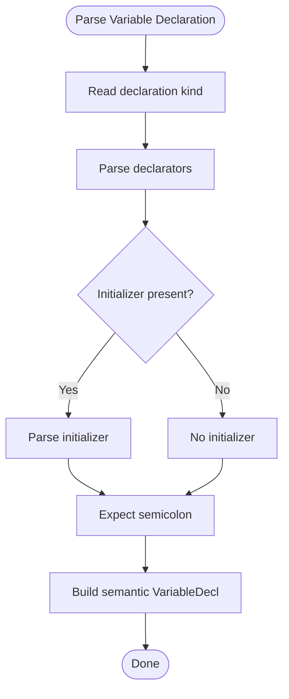

**Diagram sources**
- [statement.rs](file://src/analysis/parsing/statement.rs#L187-L230)
- [statements.rs](file://src/analysis/structure/statements.rs#L838-L847)

**Section sources**
- [statement.rs](file://src/analysis/parsing/statement.rs#L187-L230)
- [statements.rs](file://src/analysis/structure/statements.rs#L838-L847)

### Compound Statements
Compound statements group multiple statements into a block. They introduce a new scope for symbols and references.

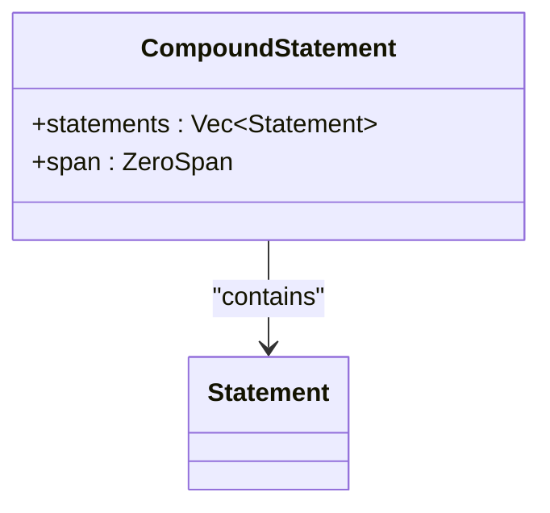

**Diagram sources**
- [statements.rs](file://src/analysis/structure/statements.rs#L1049-L1080)
- [statement.rs](file://src/analysis/parsing/statement.rs#L134-L185)

**Section sources**
- [statements.rs](file://src/analysis/structure/statements.rs#L1049-L1080)
- [statement.rs](file://src/analysis/parsing/statement.rs#L134-L185)

### Assignment and Expression Statements
Assignment statements support single and multiple targets with initializer chains or chained assignments. Expression statements wrap expressions that are evaluated for side effects.

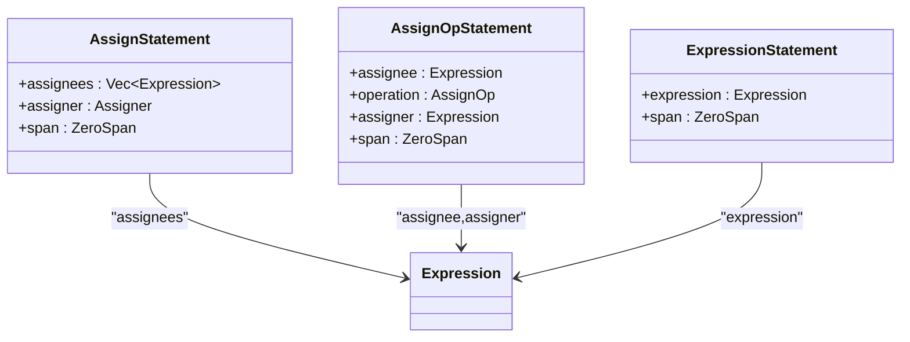

**Diagram sources**
- [statements.rs](file://src/analysis/structure/statements.rs#L909-L981)
- [statements.rs](file://src/analysis/structure/statements.rs#L850-L907)
- [statements.rs](file://src/analysis/structure/statements.rs#L1082-L1106)

**Section sources**
- [statements.rs](file://src/analysis/structure/statements.rs#L909-L981)
- [statements.rs](file://src/analysis/structure/statements.rs#L850-L907)
- [statements.rs](file://src/analysis/structure/statements.rs#L1082-L1106)

### Special Statements
Special statements include return, break, continue, throw, try/catch, log, assert, after, delete, and error.

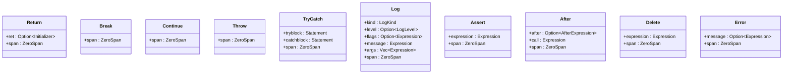

**Diagram sources**
- [statements.rs](file://src/analysis/structure/statements.rs#L518-L541)
- [statements.rs](file://src/analysis/structure/statements.rs#L566-L587)
- [statements.rs](file://src/analysis/structure/statements.rs#L543-L564)
- [statements.rs](file://src/analysis/structure/statements.rs#L625-L646)
- [statements.rs](file://src/analysis/structure/statements.rs#L589-L623)
- [statements.rs](file://src/analysis/structure/statements.rs#L648-L734)
- [statements.rs](file://src/analysis/structure/statements.rs#L736-L760)
- [statements.rs](file://src/analysis/structure/statements.rs#L762-L786)
- [statements.rs](file://src/analysis/structure/statements.rs#L788-L813)
- [statements.rs](file://src/analysis/structure/statements.rs#L468-L516)

**Section sources**
- [statements.rs](file://src/analysis/structure/statements.rs#L518-L541)
- [statements.rs](file://src/analysis/structure/statements.rs#L566-L587)
- [statements.rs](file://src/analysis/structure/statements.rs#L543-L564)
- [statements.rs](file://src/analysis/structure/statements.rs#L625-L646)
- [statements.rs](file://src/analysis/structure/statements.rs#L589-L623)
- [statements.rs](file://src/analysis/structure/statements.rs#L648-L734)
- [statements.rs](file://src/analysis/structure/statements.rs#L736-L760)
- [statements.rs](file://src/analysis/structure/statements.rs#L762-L786)
- [statements.rs](file://src/analysis/structure/statements.rs#L788-L813)
- [statements.rs](file://src/analysis/structure/statements.rs#L468-L516)

### Statement Scoping Rules and Variable Lifetime
Scopes are hierarchical and define symbol visibility and lifetime. The scope manager tracks defined symbols and references, enabling accurate symbol resolution across nested constructs.

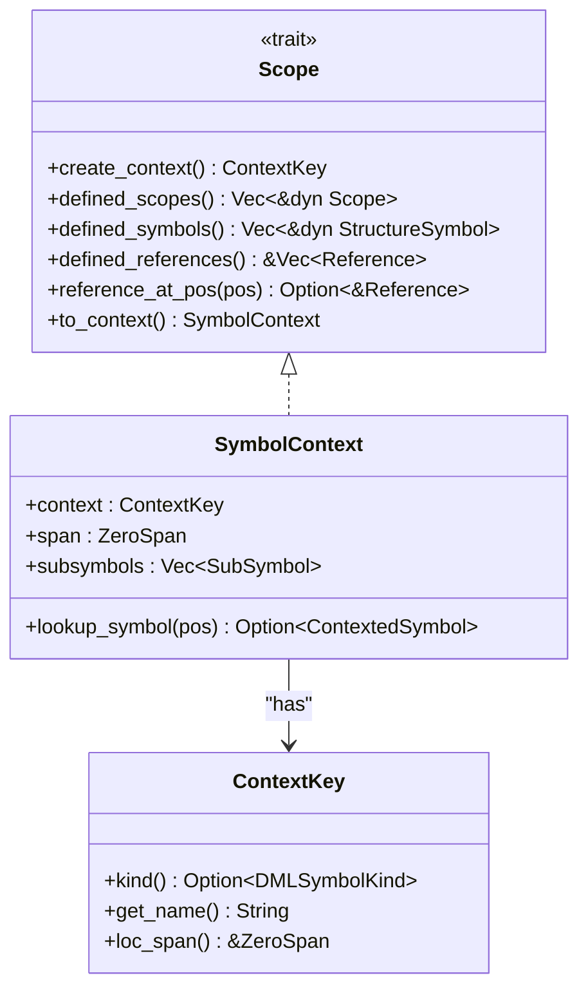

**Diagram sources**
- [scope.rs](file://src/analysis/scope.rs#L13-L62)
- [scope.rs](file://src/analysis/scope.rs#L164-L187)
- [scope.rs](file://src/analysis/scope.rs#L98-L115)

**Section sources**
- [scope.rs](file://src/analysis/scope.rs#L13-L62)
- [scope.rs](file://src/analysis/scope.rs#L164-L187)
- [scope.rs](file://src/analysis/scope.rs#L98-L115)

### Control Flow Graph Construction
Control flow graphs represent program flow across statements. The structure layer builds semantic forms that capture control flow edges implicitly through nesting and explicit control flow statements.

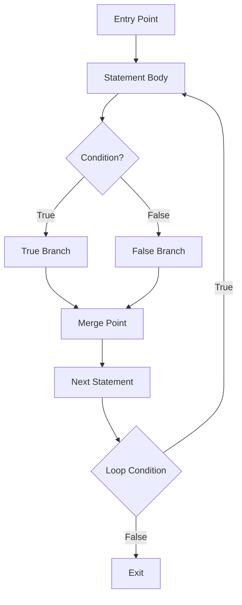

[No sources needed since this diagram shows conceptual control flow, not actual code structure]

### Semantic Validation of Statement Sequences
Validation ensures statements are well-formed and semantically correct. It includes:
- Unreachable code detection: statements after unconditional control transfers
- Invalid statement combinations: break/continue outside loops or switch
- Return type checking: return expressions must match function signature
- Scope violations: references to undefined or out-of-scope symbols

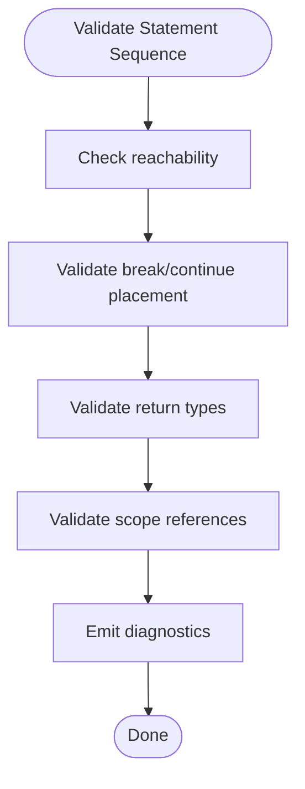

[No sources needed since this diagram shows conceptual validation flow]

### Break/Continue Resolution and Return Type Checking
- Break/Continue: Enforced by depth counters for loops and switches
- Return: Validates presence of expression against function signature

The Python port analyzer demonstrates these validations conceptually.

**Section sources**
- [statements.py](file://python-port/dml_language_server/analysis/structure/statements.py#L571-L596)
- [statements.py](file://python-port/dml_language_server/analysis/structure/statements.py#L591-L596)

### Examples of Statement Analysis Workflows
- If statement: Parse condition, then body, else body (if present); build semantic If with spans and symbol containers
- For loop: Parse pre/post expressions and body; build semantic For with optional initializer and condition
- Compound block: Collect statements; build semantic CompoundStatement with aggregated symbols
- Return statement: Optionally parse expression; build semantic Return with span

**Section sources**
- [statement.rs](file://src/analysis/parsing/statement.rs#L410-L469)
- [statement.rs](file://src/analysis/parsing/statement.rs#L838-L911)
- [statement.rs](file://src/analysis/parsing/statement.rs#L134-L185)
- [statement.rs](file://src/analysis/parsing/statement.rs#L1224-L1242)
- [statements.rs](file://src/analysis/structure/statements.rs#L81-L160)
- [statements.rs](file://src/analysis/structure/statements.rs#L376-L451)
- [statements.rs](file://src/analysis/structure/statements.rs#L1049-L1080)
- [statements.rs](file://src/analysis/structure/statements.rs#L518-L541)

## Dependency Analysis
Statement processing depends on:
- Parser context for token consumption and error signaling
- Concrete syntax nodes for statement forms
- Semantic statement types for downstream analysis
- Scope management for symbol resolution
- Diagnostics for error reporting

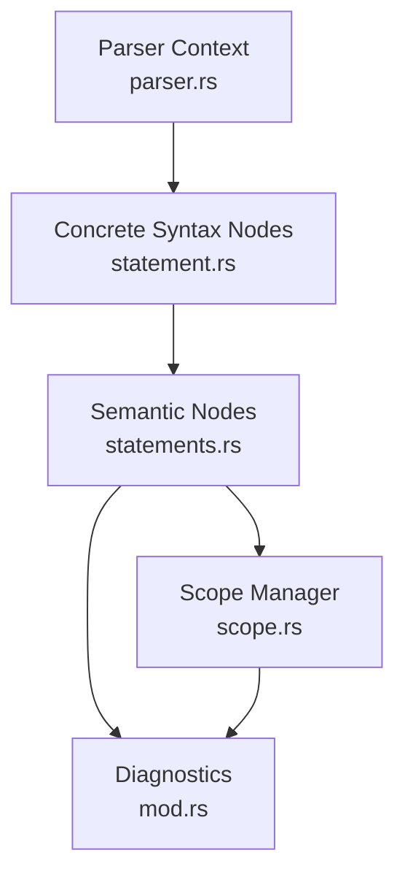

**Diagram sources**
- [parser.rs](file://src/analysis/parsing/parser.rs#L48-L120)
- [statement.rs](file://src/analysis/parsing/statement.rs#L134-L185)
- [statements.rs](file://src/analysis/structure/statements.rs#L1188-L1245)
- [scope.rs](file://src/analysis/scope.rs#L13-L62)
- [mod.rs](file://src/analysis/mod.rs#L210-L265)

**Section sources**
- [parser.rs](file://src/analysis/parsing/parser.rs#L48-L120)
- [statement.rs](file://src/analysis/parsing/statement.rs#L134-L185)
- [statements.rs](file://src/analysis/structure/statements.rs#L1188-L1245)
- [scope.rs](file://src/analysis/scope.rs#L13-L62)
- [mod.rs](file://src/analysis/mod.rs#L210-L265)

## Performance Considerations
- Parsing contexts minimize lookahead and backtracking by restricting token understanding to specific boundaries
- Semantic conversion avoids redundant allocations by operating on references to parsed content
- Scope lookups leverage hierarchical containment to reduce search space
- Diagnostics aggregation reduces repeated computation across passes

[No sources needed since this section provides general guidance]

## Troubleshooting Guide
Common issues and resolutions:
- Unrecognized statement tokens: Parser context ends early and emits missing token diagnostics
- Invalid control flow: break/continue outside loops or switch; return without expression in void functions
- Scope errors: References to undefined or out-of-scope symbols; ensure proper nesting and declaration order
- Unreachable code: Statements after unconditional control transfers; mark as unreachable in diagnostics

**Section sources**
- [parser.rs](file://src/analysis/parsing/parser.rs#L126-L168)
- [statements.py](file://python-port/dml_language_server/analysis/structure/statements.py#L571-L596)
- [mod.rs](file://src/analysis/mod.rs#L210-L265)

## Conclusion
The DML statement processing pipeline integrates parsing, semantic conversion, scope management, and validation to produce a robust foundation for downstream analysis. Control flow statements, declarations, and compound statements are represented consistently, with scoping rules enforced and diagnostics emitted for semantic errors. The architecture supports extensibility for future statement types and enhanced validation rules.