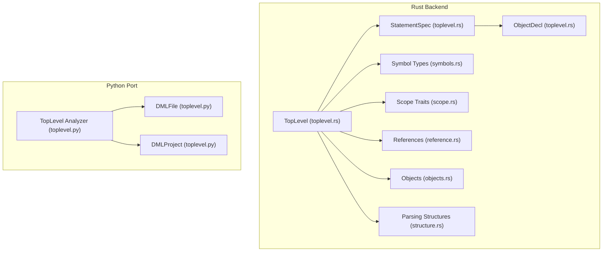
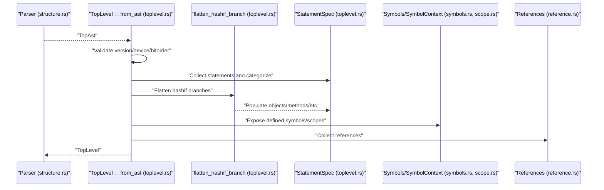
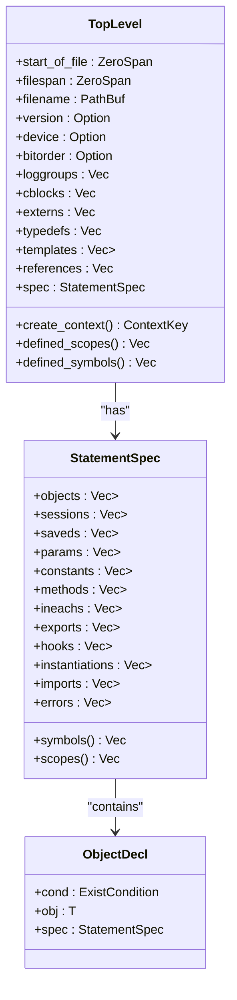
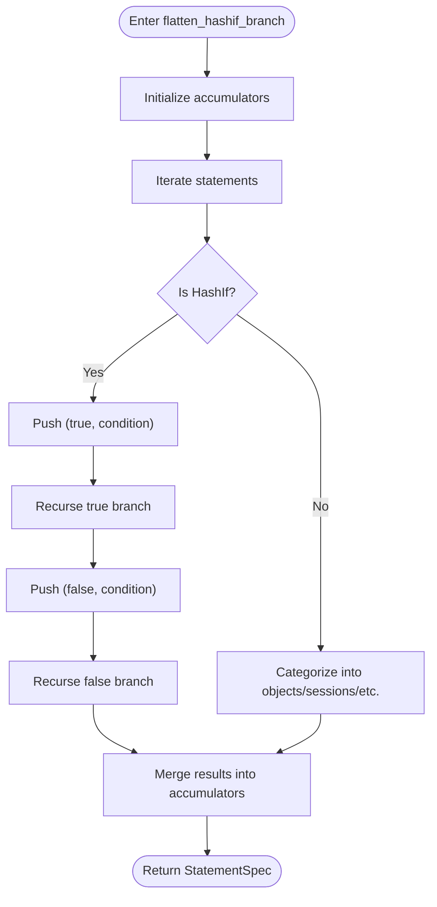
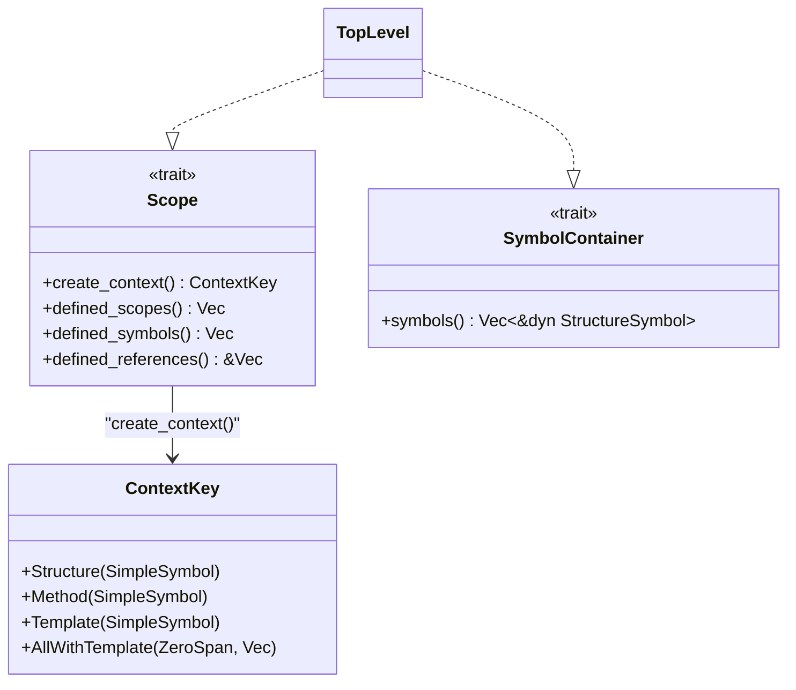
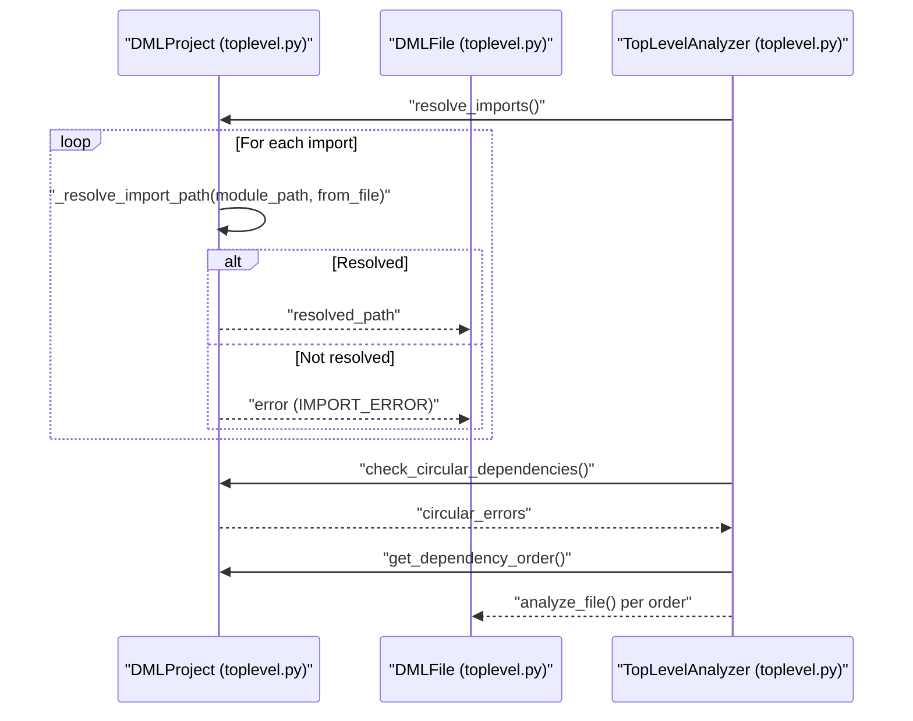
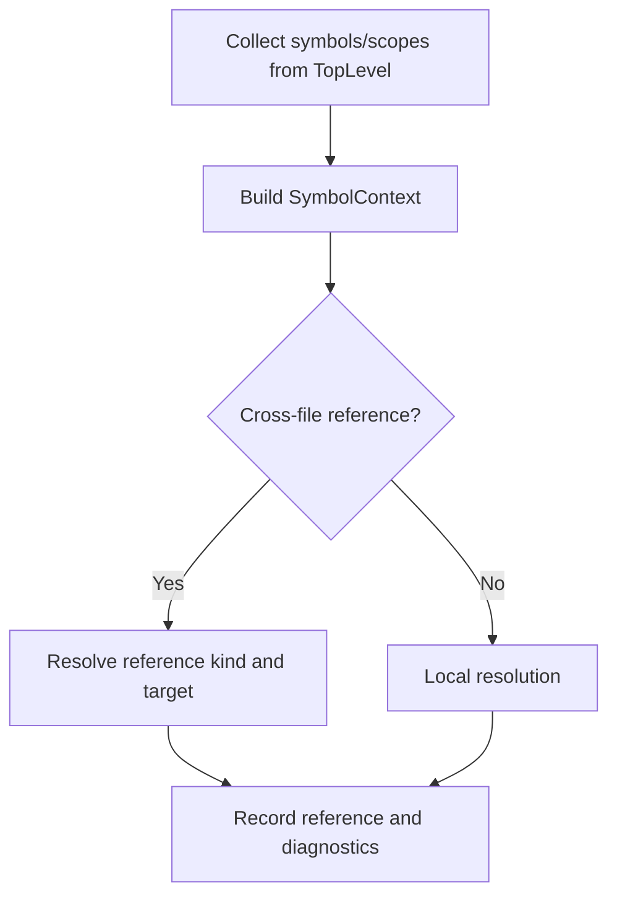
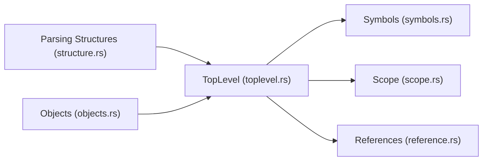

# Top-level Structures

<cite>
**Referenced Files in This Document**
- [toplevel.rs](file://src/analysis/structure/toplevel.rs)
- [symbols.rs](file://src/analysis/symbols.rs)
- [scope.rs](file://src/analysis/scope.rs)
- [reference.rs](file://src/analysis/reference.rs)
- [objects.rs](file://src/analysis/structure/objects.rs)
- [structure.rs](file://src/analysis/parsing/structure.rs)
- [toplevel.py](file://python-port/dml_language_server/analysis/structure/toplevel.py)
- [__init__.py](file://python-port/dml_language_server/analysis/structure/__init__.py)
</cite>

## Table of Contents
1. [Introduction](#introduction)
2. [Project Structure](#project-structure)
3. [Core Components](#core-components)
4. [Architecture Overview](#architecture-overview)
5. [Detailed Component Analysis](#detailed-component-analysis)
6. [Dependency Analysis](#dependency-analysis)
7. [Performance Considerations](#performance-considerations)
8. [Troubleshooting Guide](#troubleshooting-guide)
9. [Conclusion](#conclusion)

## Introduction
This document explains the top-level DML structure analysis, focusing on how global declarations, namespaces, and module-level constructs are represented and validated. It covers semantic analysis of global variables, functions, and import statements; namespace resolution and symbol visibility across files; module dependency management; and the integration between top-level analysis and the overall symbol table construction. The content is grounded in the Rust implementation under src/analysis/structure/toplevel.rs and related modules, with cross-references to the Python port’s top-level analyzer for complementary insights.

## Project Structure
The top-level analysis is implemented in the Rust backend under src/analysis/structure/toplevel.rs and integrates with symbol and scope infrastructure. The Python port mirrors the concept with a separate module for top-level structure analysis.

**Diagram sources**
- [toplevel.rs](file://src/analysis/structure/toplevel.rs#L546-L625)
- [symbols.rs](file://src/analysis/symbols.rs#L18-L37)
- [scope.rs](file://src/analysis/scope.rs#L13-L62)
- [reference.rs](file://src/analysis/reference.rs#L8-L44)
- [objects.rs](file://src/analysis/structure/objects.rs#L32-L39)
- [structure.rs](file://src/analysis/parsing/structure.rs#L38-L58)
- [toplevel.py](file://python-port/dml_language_server/analysis/structure/toplevel.py#L362-L500)
- [__init__.py](file://python-port/dml_language_server/analysis/structure/__init__.py#L48-L53)

**Section sources**
- [toplevel.rs](file://src/analysis/structure/toplevel.rs#L546-L625)
- [toplevel.py](file://python-port/dml_language_server/analysis/structure/toplevel.py#L362-L500)
- [__init__.py](file://python-port/dml_language_server/analysis/structure/__init__.py#L48-L53)

## Core Components
- TopLevel: Encapsulates a file’s top-level structure, including version, device, bitorder, loggroups, C blocks, externs, typedefs, templates, and a StatementSpec containing categorized declarations. It acts as a Scope and SymbolContainer for global-level constructs.
- StatementSpec: Aggregates lists of top-level declarations by category (objects, sessions, saveds, parameters, constants, methods, in-eachs, exports, hooks, instantiations, imports, errors).
- ObjectDecl: Wraps a declaration with existence conditions (always or conditional via hashif) and a nested StatementSpec for composite objects.
- Symbol and Scope Infrastructure: Provides symbol kinds, containers, and scope contexts used by TopLevel to expose defined symbols and nested scopes.
- References: Captures global and variable references for cross-file resolution and diagnostics.

Key responsibilities:
- Validate top-level ordering constraints (e.g., version first, device second, bitorder after device).
- Flatten hashif branches into conditional existence conditions.
- Build symbol and scope sets for global visibility.
- Collect references for later resolution.

**Section sources**
- [toplevel.rs](file://src/analysis/structure/toplevel.rs#L546-L625)
- [toplevel.rs](file://src/analysis/structure/toplevel.rs#L232-L314)
- [toplevel.rs](file://src/analysis/structure/toplevel.rs#L90-L193)
- [symbols.rs](file://src/analysis/symbols.rs#L18-L37)
- [scope.rs](file://src/analysis/scope.rs#L13-L62)
- [reference.rs](file://src/analysis/reference.rs#L8-L44)

## Architecture Overview
The top-level analysis pipeline transforms a parsed AST into a structured TopLevel representation, validates ordering and allowed constructs, flattens conditional branches, and builds symbol and scope contexts.

**Diagram sources**
- [structure.rs](file://src/analysis/parsing/structure.rs#L38-L58)
- [toplevel.rs](file://src/analysis/structure/toplevel.rs#L627-L844)
- [toplevel.rs](file://src/analysis/structure/toplevel.rs#L316-L544)
- [symbols.rs](file://src/analysis/symbols.rs#L35-L57)
- [scope.rs](file://src/analysis/scope.rs#L47-L61)
- [reference.rs](file://src/analysis/reference.rs#L185-L200)

## Detailed Component Analysis

### TopLevel Representation and Validation
TopLevel captures:
- File-level metadata (version, device, bitorder, loggroups, C blocks, externs, typedefs).
- Templates with nested specs.
- A StatementSpec aggregating categorized declarations.
- Defined symbols and scopes for global visibility.
- A list of collected references for later resolution.

Validation highlights:
- Enforces ordering constraints for version, device, and bitorder.
- Reports disallowed constructs in non-object contexts (e.g., constant, extern, template, header/footer, loggroup, typedef).
- Adjusts shared method semantics outside template context.

**Diagram sources**
- [toplevel.rs](file://src/analysis/structure/toplevel.rs#L546-L625)
- [toplevel.rs](file://src/analysis/structure/toplevel.rs#L232-L314)
- [toplevel.rs](file://src/analysis/structure/toplevel.rs#L90-L193)

**Section sources**
- [toplevel.rs](file://src/analysis/structure/toplevel.rs#L546-L625)
- [toplevel.rs](file://src/analysis/structure/toplevel.rs#L627-L844)

### ExistCondition and Conditional Branching
ExistCondition tracks whether a declaration exists always or conditionally within nested hashif branches. The flattening routine propagates condition tuples to ObjectDecl, enabling downstream logic to handle conditional instantiation and visibility.

**Diagram sources**
- [toplevel.rs](file://src/analysis/structure/toplevel.rs#L316-L544)

**Section sources**
- [toplevel.rs](file://src/analysis/structure/toplevel.rs#L316-L544)

### Symbol Visibility and Scope Management
TopLevel implements Scope and SymbolContainer to expose:
- Defined symbols (from StatementSpec and templates).
- Nested scopes (methods, objects, in-eachs).
- Context keys for symbol context creation.

This enables downstream consumers to build SymbolContext trees and resolve references within the global scope.

**Diagram sources**
- [scope.rs](file://src/analysis/scope.rs#L13-L62)
- [scope.rs](file://src/analysis/scope.rs#L98-L115)
- [symbols.rs](file://src/analysis/symbols.rs#L35-L57)

**Section sources**
- [scope.rs](file://src/analysis/scope.rs#L13-L62)
- [scope.rs](file://src/analysis/scope.rs#L47-L61)
- [symbols.rs](file://src/analysis/symbols.rs#L35-L57)

### Import Resolution and Module Dependencies
The Rust implementation collects import declarations and references during TopLevel construction. While the exact resolution algorithm resides in higher-level orchestration, the top-level structure supports:
- Storing import ObjectDecls.
- Collecting references for cross-file resolution.

The Python port provides a concrete import resolution algorithm:
- Resolves import paths relative to the current file, project root, or as absolute paths.
- Detects circular dependencies via topological traversal.
- Produces dependency order for analysis.

**Diagram sources**
- [toplevel.py](file://python-port/dml_language_server/analysis/structure/toplevel.py#L236-L345)
- [toplevel.py](file://python-port/dml_language_server/analysis/structure/toplevel.py#L408-L426)

**Section sources**
- [toplevel.rs](file://src/analysis/structure/toplevel.rs#L817-L842)
- [toplevel.py](file://python-port/dml_language_server/analysis/structure/toplevel.py#L236-L345)

### Namespace Collision Handling and Cross-file Symbol Resolution
- TopLevel aggregates symbols and scopes globally, enabling symbol table construction across files.
- The Python port demonstrates cross-file template usage validation and duplicate device detection, surfacing collisions as errors.
- Reference kinds (template, type, variable, callable) support targeted resolution.

**Diagram sources**
- [scope.rs](file://src/analysis/scope.rs#L47-L61)
- [reference.rs](file://src/analysis/reference.rs#L96-L102)
- [toplevel.py](file://python-port/dml_language_server/analysis/structure/toplevel.py#L438-L488)

**Section sources**
- [scope.rs](file://src/analysis/scope.rs#L47-L61)
- [reference.rs](file://src/analysis/reference.rs#L96-L102)
- [toplevel.py](file://python-port/dml_language_server/analysis/structure/toplevel.py#L438-L488)

## Dependency Analysis
Top-level analysis depends on:
- Parsing structures for AST content.
- Object definitions for semantic validation and symbol kinds.
- Symbol and scope traits for visibility and context.
- Reference collection for cross-file resolution.

**Diagram sources**
- [structure.rs](file://src/analysis/parsing/structure.rs#L38-L58)
- [objects.rs](file://src/analysis/structure/objects.rs#L32-L39)
- [toplevel.rs](file://src/analysis/structure/toplevel.rs#L546-L625)
- [symbols.rs](file://src/analysis/symbols.rs#L18-L37)
- [scope.rs](file://src/analysis/scope.rs#L13-L62)
- [reference.rs](file://src/analysis/reference.rs#L8-L44)

**Section sources**
- [structure.rs](file://src/analysis/parsing/structure.rs#L38-L58)
- [objects.rs](file://src/analysis/structure/objects.rs#L32-L39)
- [toplevel.rs](file://src/analysis/structure/toplevel.rs#L546-L625)
- [symbols.rs](file://src/analysis/symbols.rs#L18-L37)
- [scope.rs](file://src/analysis/scope.rs#L13-L62)
- [reference.rs](file://src/analysis/reference.rs#L8-L44)

## Performance Considerations
- ExistCondition propagation avoids redundant re-analysis of identical hashif branches.
- StatementSpec aggregation minimizes repeated traversals by grouping declarations by category.
- Symbol and scope containers use flat mapping to reduce nesting overhead.
- Reference collection is deferred until after structure building to decouple parsing and analysis costs.

## Troubleshooting Guide
Common issues and diagnostics:
- Ordering violations: Version must be first; device must be second; bitorder must follow device.
- Disallowed constructs in non-object contexts: constant, extern, template, header/footer, loggroup, typedef.
- Shared method adjustments: Outside template context, shared methods are treated as non-shared for analysis.
- Import resolution failures: Unresolvable imports produce errors; circular dependencies are detected and reported.

Resolution tips:
- Ensure top-level statements appear in the correct order.
- Limit top-level constructs to allowed categories per context.
- Use the Python port’s dependency order to analyze files in a safe sequence.
- Inspect collected references to identify unresolved identifiers.

**Section sources**
- [toplevel.rs](file://src/analysis/structure/toplevel.rs#L360-L433)
- [toplevel.rs](file://src/analysis/structure/toplevel.rs#L458-L476)
- [toplevel.py](file://python-port/dml_language_server/analysis/structure/toplevel.py#L236-L345)

## Conclusion
Top-level DML structure analysis establishes the foundation for global symbol visibility, conditional declaration handling, and module-level construct validation. By encapsulating top-level constructs in TopLevel and StatementSpec, and integrating with symbol and scope infrastructure, the system supports robust cross-file resolution and diagnostics. The Python port complements this with practical import resolution and dependency management, offering a complete picture of top-level analysis across the codebase.