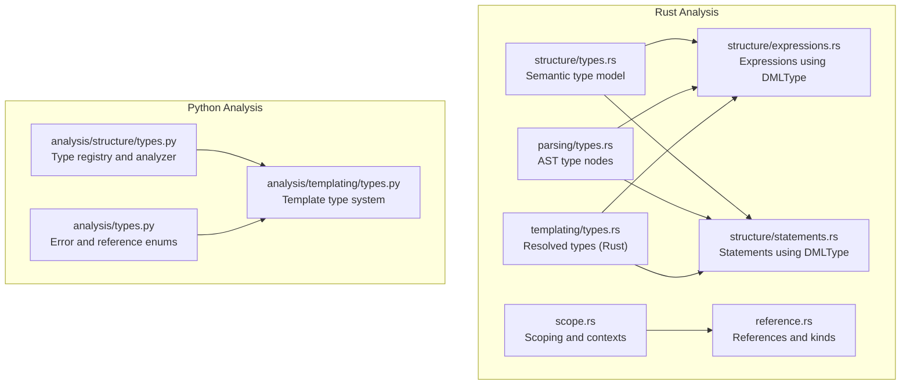
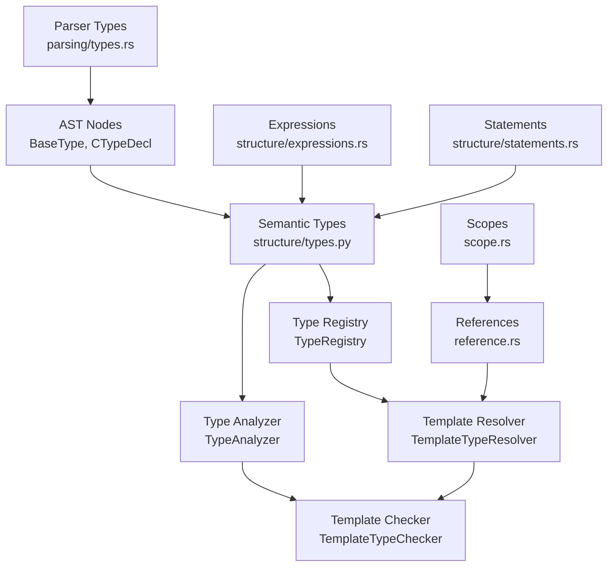
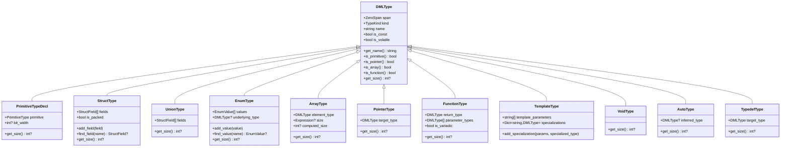
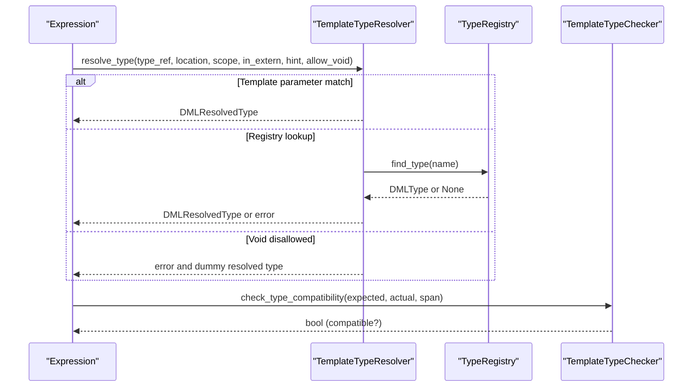
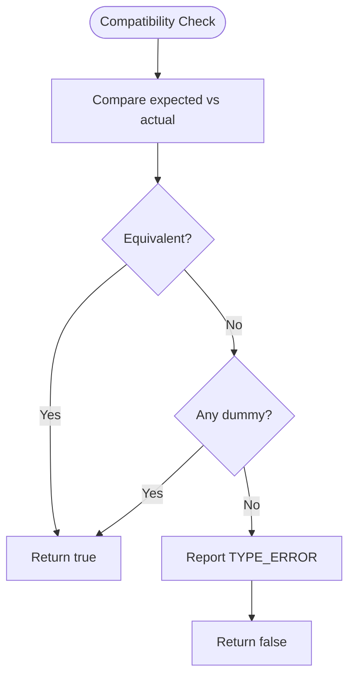
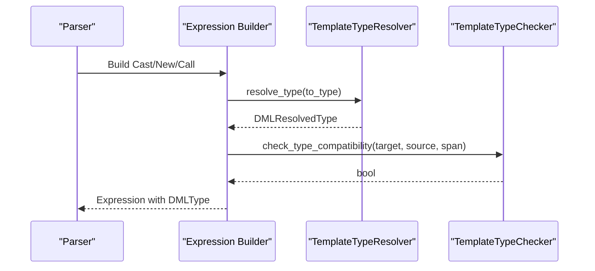
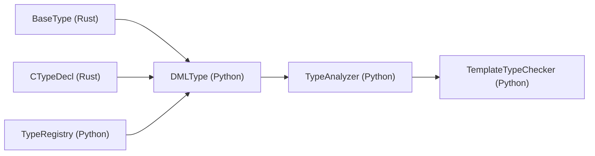
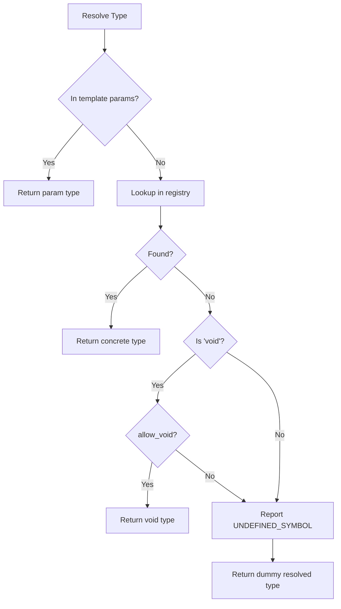
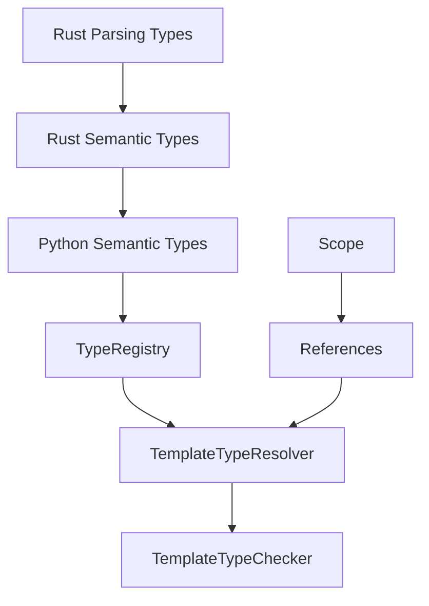

# Type System and Checking

<cite>
**Referenced Files in This Document**
- [types.rs](file://src/analysis/structure/types.rs)
- [types.rs](file://src/analysis/parsing/types.rs)
- [types.rs](file://src/analysis/templating/types.rs)
- [types.py](file://python-port/dml_language_server/analysis/structure/types.py)
- [types.py](file://python-port/dml_language_server/analysis/templating/types.py)
- [types.py](file://python-port/dml_language_server/analysis/types.py)
- [expressions.rs](file://src/analysis/structure/expressions.rs)
- [statements.rs](file://src/analysis/structure/statements.rs)
- [scope.rs](file://src/analysis/scope.rs)
- [reference.rs](file://src/analysis/reference.rs)
</cite>

## Table of Contents
1. [Introduction](#introduction)
2. [Project Structure](#project-structure)
3. [Core Components](#core-components)
4. [Architecture Overview](#architecture-overview)
5. [Detailed Component Analysis](#detailed-component-analysis)
6. [Dependency Analysis](#dependency-analysis)
7. [Performance Considerations](#performance-considerations)
8. [Troubleshooting Guide](#troubleshooting-guide)
9. [Conclusion](#conclusion)

## Introduction
This document describes the DML type system and semantic analysis implementation. It explains the type hierarchy, primitive and composite types, generic/template handling, type inference, compatibility and coercion, and type checking for expressions, assignments, and function calls. It also documents the relationship between type definitions and semantic representations, type parameter resolution, and type safety guarantees.

## Project Structure
The type system spans both Rust and Python ports:
- Rust core: parsing/type definitions, semantic structure, and template type evaluation live under src/analysis.
- Python port: shared type abstractions, template type system, and type registry live under python-port/dml_language_server/analysis.

**Diagram sources**
- [types.rs](file://src/analysis/structure/types.rs#L1-L90)
- [types.rs](file://src/analysis/parsing/types.rs#L477-L525)
- [types.rs](file://src/analysis/templating/types.rs#L1-L93)
- [expressions.rs](file://src/analysis/structure/expressions.rs#L1-L800)
- [statements.rs](file://src/analysis/structure/statements.rs#L1-L800)
- [scope.rs](file://src/analysis/scope.rs#L1-L257)
- [reference.rs](file://src/analysis/reference.rs#L1-L200)
- [types.py](file://python-port/dml_language_server/analysis/structure/types.py#L1-L571)
- [types.py](file://python-port/dml_language_server/analysis/templating/types.py#L1-L357)
- [types.py](file://python-port/dml_language_server/analysis/types.py#L1-L84)

**Section sources**
- [types.rs](file://src/analysis/structure/types.rs#L1-L90)
- [types.rs](file://src/analysis/parsing/types.rs#L477-L525)
- [types.rs](file://src/analysis/templating/types.rs#L1-L93)
- [types.py](file://python-port/dml_language_server/analysis/structure/types.py#L1-L571)
- [types.py](file://python-port/dml_language_server/analysis/templating/types.py#L1-L357)
- [types.py](file://python-port/dml_language_server/analysis/types.py#L1-L84)

## Core Components
- Semantic type model (Python): Provides a rich type hierarchy with primitives, structs, unions, enums, arrays, pointers, functions, templates, void, auto, and typedefs. Includes a type registry and analyzer.
- Parsing type model (Rust): Defines AST nodes for basic types (struct, layout, bitfields, typeof, sequence, hook) and composite type declarations.
- Template type system (Python/Rust): Resolves template parameters and concrete types, performs compatibility checks, and reports type errors.
- Expressions and statements (Rust): Use DMLType in constructs like casts, new expressions, sizeof, and function calls.

Key capabilities:
- Primitive types: signed/unsigned integers, floats, chars, booleans, and sized variants.
- Composite types: structs, unions, enums, arrays, pointers, functions.
- Generic/template types: template types with parameters and specializations.
- Type resolution: from identifiers to concrete types via registries and template resolvers.
- Compatibility checks: structural equivalence and parameter compatibility for function calls.

**Section sources**
- [types.py](file://python-port/dml_language_server/analysis/structure/types.py#L22-L35)
- [types.py](file://python-port/dml_language_server/analysis/structure/types.py#L37-L53)
- [types.py](file://python-port/dml_language_server/analysis/structure/types.py#L547-L571)
- [types.rs](file://src/analysis/parsing/types.rs#L477-L486)
- [types.rs](file://src/analysis/templating/types.rs#L8-L51)
- [expressions.rs](file://src/analysis/structure/expressions.rs#L350-L430)

## Architecture Overview
The type system integrates parsing, semantic modeling, and template resolution:

**Diagram sources**
- [types.rs](file://src/analysis/parsing/types.rs#L477-L525)
- [types.py](file://python-port/dml_language_server/analysis/structure/types.py#L346-L434)
- [types.py](file://python-port/dml_language_server/analysis/templating/types.py#L150-L242)
- [expressions.rs](file://src/analysis/structure/expressions.rs#L350-L430)
- [statements.rs](file://src/analysis/structure/statements.rs#L1-L800)
- [scope.rs](file://src/analysis/scope.rs#L1-L257)
- [reference.rs](file://src/analysis/reference.rs#L96-L102)

## Detailed Component Analysis

### Type Hierarchy and Definitions
- Primitive types: Enumerated in Python with explicit sizes; Rust parsing supports identifiers and keywords for basic types.
- Struct/Union/Enum: Defined in Python with field validation and size computation helpers.
- Arrays and Pointers: Constructed from element/target types with computed sizes.
- Functions: Return type plus parameter list; name synthesized from parameters.
- Templates: Parameter lists and specializations; resolution produces concrete types.
- Void/Auto/Typedef: Special forms for void, inference, and aliasing.

**Diagram sources**
- [types.py](file://python-port/dml_language_server/analysis/structure/types.py#L56-L344)

**Section sources**
- [types.py](file://python-port/dml_language_server/analysis/structure/types.py#L22-L35)
- [types.py](file://python-port/dml_language_server/analysis/structure/types.py#L37-L53)
- [types.py](file://python-port/dml_language_server/analysis/structure/types.py#L547-L571)

### Generic and Template Type Handling
- Template types carry parameter lists and specializations.
- TemplateTypeResolver resolves identifiers against:
  - Provided template parameters
  - Global type registry
  - Built-in void handling with allow flag
- TemplateTypeChecker validates:
  - Type compatibility (structural equivalence)
  - Assignment compatibility
  - Parameter counts and compatibility for function calls

**Diagram sources**
- [types.py](file://python-port/dml_language_server/analysis/templating/types.py#L150-L242)
- [types.py](file://python-port/dml_language_server/analysis/structure/types.py#L346-L434)
- [types.py](file://python-port/dml_language_server/analysis/templating/types.py#L244-L298)

**Section sources**
- [types.py](file://python-port/dml_language_server/analysis/templating/types.py#L21-L29)
- [types.py](file://python-port/dml_language_server/analysis/templating/types.py#L150-L242)
- [types.py](file://python-port/dml_language_server/analysis/templating/types.py#L244-L298)

### Type Inference and Compatibility
- Auto types represent inferred types; size depends on inferred type when available.
- Compatibility checks:
  - Structural equivalence for resolved types
  - Dummy types allowed to match for error recovery
  - Argument count and per-parameter compatibility for function calls
- Coercion: No explicit coercion logic is present; compatibility relies on structural equivalence and void allowance flags.

**Diagram sources**
- [types.py](file://python-port/dml_language_server/analysis/templating/types.py#L251-L268)

**Section sources**
- [types.py](file://python-port/dml_language_server/analysis/structure/types.py#L318-L331)
- [types.py](file://python-port/dml_language_server/analysis/templating/types.py#L251-L268)

### Type Checking for Expressions, Assignments, and Function Calls
- CastExpression carries a DMLType target and an expression source; resolution occurs during expression construction.
- NewExpression uses a DMLType for allocation and optional size expression.
- FunctionCall stores a function expression and a vector of initializers; compatibility checked by TemplateTypeChecker.
- Assignment compatibility mirrors general compatibility checks.

**Diagram sources**
- [expressions.rs](file://src/analysis/structure/expressions.rs#L350-L430)
- [types.py](file://python-port/dml_language_server/analysis/templating/types.py#L150-L242)
- [types.py](file://python-port/dml_language_server/analysis/templating/types.py#L251-L298)

**Section sources**
- [expressions.rs](file://src/analysis/structure/expressions.rs#L350-L430)
- [expressions.rs](file://src/analysis/structure/expressions.rs#L320-L347)
- [expressions.rs](file://src/analysis/structure/expressions.rs#L406-L430)
- [types.py](file://python-port/dml_language_server/analysis/templating/types.py#L251-L298)

### Relationship Between Type Definitions and Semantic Representations
- Rust parsing types (BaseType, CTypeDecl) define AST nodes for type constructs.
- Python semantic types provide runtime type objects with rich metadata and analysis helpers.
- Template resolvers bridge AST identifiers to semantic types and produce resolved types for checking.

**Diagram sources**
- [types.rs](file://src/analysis/parsing/types.rs#L477-L525)
- [types.py](file://python-port/dml_language_server/analysis/structure/types.py#L547-L571)
- [types.py](file://python-port/dml_language_server/analysis/structure/types.py#L346-L434)
- [types.py](file://python-port/dml_language_server/analysis/templating/types.py#L244-L298)

**Section sources**
- [types.rs](file://src/analysis/parsing/types.rs#L477-L525)
- [types.py](file://python-port/dml_language_server/analysis/structure/types.py#L346-L434)
- [types.py](file://python-port/dml_language_server/analysis/templating/types.py#L244-L298)

### Type Parameter Resolution and Safety Guarantees
- Template parameters override registry lookups during resolution.
- Errors are accumulated and surfaced as diagnostics; void is only allowed when explicitly permitted.
- Dummy resolved types prevent cascading failures and maintain forward progress.

**Diagram sources**
- [types.py](file://python-port/dml_language_server/analysis/templating/types.py#L162-L221)

**Section sources**
- [types.py](file://python-port/dml_language_server/analysis/templating/types.py#L162-L221)

## Dependency Analysis
- Rust parsing types feed into semantic types and expressions.
- Template resolvers depend on the type registry and produce resolved types consumed by the checker.
- Scopes and references connect type usage sites to definitions.

**Diagram sources**
- [types.rs](file://src/analysis/parsing/types.rs#L477-L525)
- [types.rs](file://src/analysis/structure/types.rs#L1-L90)
- [types.py](file://python-port/dml_language_server/analysis/structure/types.py#L346-L434)
- [types.py](file://python-port/dml_language_server/analysis/templating/types.py#L150-L242)
- [reference.rs](file://src/analysis/reference.rs#L96-L102)
- [scope.rs](file://src/analysis/scope.rs#L1-L257)

**Section sources**
- [types.rs](file://src/analysis/parsing/types.rs#L477-L525)
- [types.rs](file://src/analysis/structure/types.rs#L1-L90)
- [types.py](file://python-port/dml_language_server/analysis/structure/types.py#L346-L434)
- [types.py](file://python-port/dml_language_server/analysis/templating/types.py#L150-L242)
- [reference.rs](file://src/analysis/reference.rs#L96-L102)
- [scope.rs](file://src/analysis/scope.rs#L1-L257)

## Performance Considerations
- Type resolution uses dictionary lookups keyed by type names; ensure minimal redundant lookups by caching resolved types per scope.
- Size computations for aggregates are linear in field count; avoid repeated traversal by memoizing computed sizes.
- Template parameter resolution short-circuits registry lookups, reducing overhead for generic code paths.

## Troubleshooting Guide
Common issues and resolutions:
- Unknown type: Occurs when a type name is not found in the registry. Verify spelling and registration.
- Void used in disallowed context: Ensure allow_void flag is set appropriately for extern or specific constructs.
- Duplicate type/field names: Registering duplicates triggers duplicate symbol errors; rename or remove duplicates.
- Mismatched argument counts or types: TemplateTypeChecker reports argument count and per-parameter mismatches; align function signatures.

**Section sources**
- [types.py](file://python-port/dml_language_server/analysis/templating/types.py#L205-L221)
- [types.py](file://python-port/dml_language_server/analysis/templating/types.py#L276-L293)
- [types.py](file://python-port/dml_language_server/analysis/structure/types.py#L372-L383)
- [types.py](file://python-port/dml_language_server/analysis/structure/types.py#L458-L475)

## Conclusion
The DML type system combines robust Rust parsing types with a rich Python semantic model and template-driven resolution. It supports a comprehensive type hierarchy, template parameterization, and compatibility checking. While explicit coercion is not implemented, structural equivalence and careful error handling provide strong type safety guarantees across expressions, assignments, and function calls.