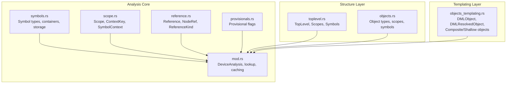
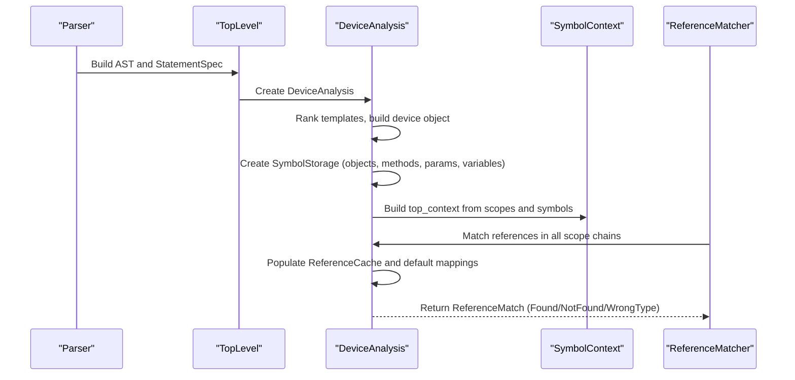
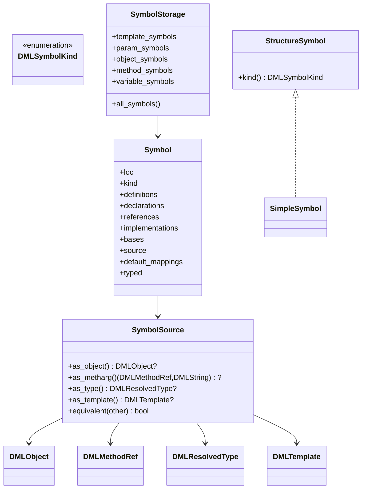
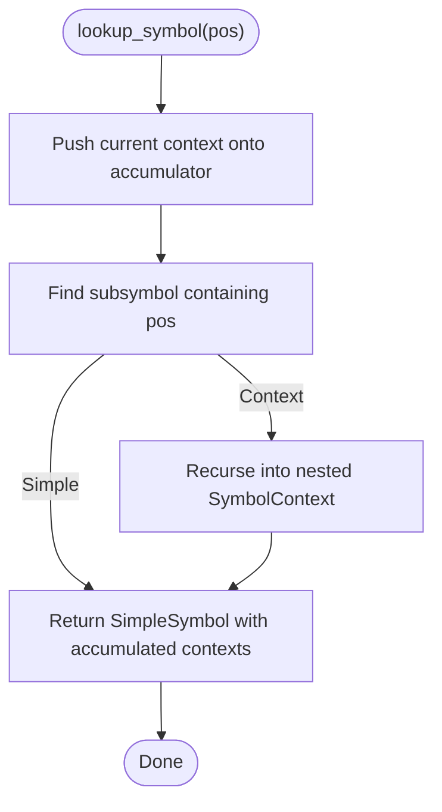
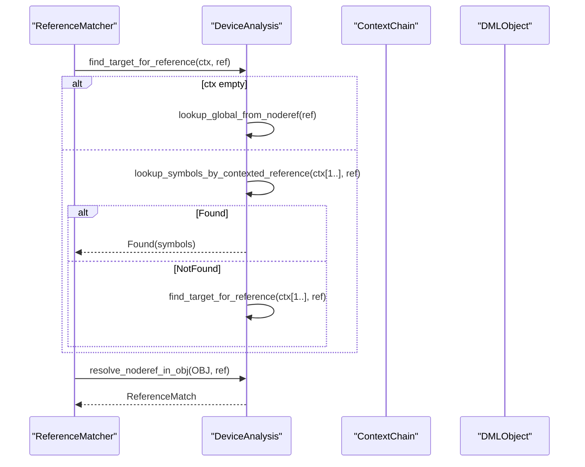
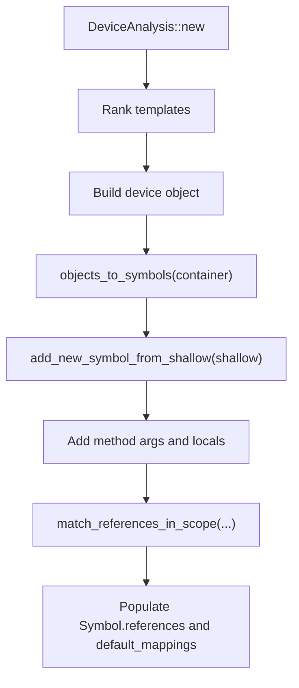
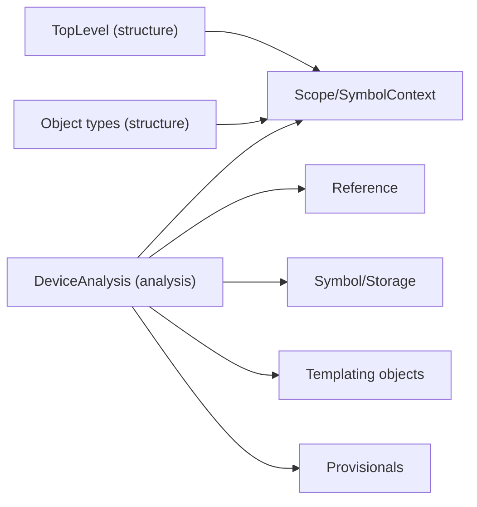

# Symbol Resolution System

<cite>
**Referenced Files in This Document**
- [symbols.rs](file://src/analysis/symbols.rs)
- [scope.rs](file://src/analysis/scope.rs)
- [reference.rs](file://src/analysis/reference.rs)
- [mod.rs](file://src/analysis/mod.rs)
- [toplevel.rs](file://src/analysis/structure/toplevel.rs)
- [objects.rs](file://src/analysis/structure/objects.rs)
- [objects_templating.rs](file://src/analysis/templating/objects.rs)
- [provisionals.rs](file://src/analysis/provisionals.rs)
</cite>

## Table of Contents
1. [Introduction](#introduction)
2. [Project Structure](#project-structure)
3. [Core Components](#core-components)
4. [Architecture Overview](#architecture-overview)
5. [Detailed Component Analysis](#detailed-component-analysis)
6. [Dependency Analysis](#dependency-analysis)
7. [Performance Considerations](#performance-considerations)
8. [Troubleshooting Guide](#troubleshooting-guide)
9. [Conclusion](#conclusion)

## Introduction
This document explains the symbol resolution and scoping system used by the DML language server. It covers the symbol table architecture, context-aware symbol lookup algorithms, scope chain management, symbol types and containers, lifecycle management, and the provisional analysis system for forward references, circular dependency detection, and deferred resolution. It also includes concrete examples of symbol table operations, scope traversal, and reference resolution scenarios, along with performance optimizations and extensibility points.

## Project Structure
The symbol resolution system is implemented across several modules:
- Analysis core: symbol definitions, scope and context handling, reference representation, and device-wide analysis orchestration
- Structure layer: AST nodes that act as symbol sources and scopes
- Templating layer: runtime object model and object resolution for composite and shallow objects

**Diagram sources**
- [symbols.rs](file://src/analysis/symbols.rs#L1-L192)
- [scope.rs](file://src/analysis/scope.rs#L1-L257)
- [reference.rs](file://src/analysis/reference.rs#L1-L200)
- [mod.rs](file://src/analysis/mod.rs#L1-L800)
- [toplevel.rs](file://src/analysis/structure/toplevel.rs#L546-L625)
- [objects.rs](file://src/analysis/structure/objects.rs#L646-L726)
- [objects_templating.rs](file://src/analysis/templating/objects.rs#L373-L518)
- [provisionals.rs](file://src/analysis/provisionals.rs#L1-L79)

**Section sources**
- [mod.rs](file://src/analysis/mod.rs#L1-L200)
- [toplevel.rs](file://src/analysis/structure/toplevel.rs#L546-L625)
- [objects.rs](file://src/analysis/structure/objects.rs#L646-L726)
- [objects_templating.rs](file://src/analysis/templating/objects.rs#L373-L518)

## Core Components
- Symbol types and containers
  - DMLSymbolKind enumerates symbol kinds (objects, parameters, constants, externs, hooks, locals, loggroups, methods, method args, saved/session, templates, typedefs)
  - StructureSymbol trait unifies symbol sources with name and location
  - SymbolSource ties symbols to concrete runtime objects/methods/types/templates
  - Symbol stores definitions, declarations, references, implementations, bases, and optional typed info
- Scope and context
  - Scope trait exposes defined_scopes, defined_symbols, defined_references, and position-aware reference lookup
  - ContextKey identifies the current context (Structure, Method, Template, or AllWithTemplate)
  - SymbolContext builds a hierarchical symbol tree for fast position-based lookups
- References
  - ReferenceKind distinguishes Template, Type, Variable, Callable
  - NodeRef models dotted identifiers; VariableReference and GlobalReference represent references
- Device analysis
  - DeviceAnalysis orchestrates template ranking, object construction, symbol creation, and cross-file reference matching
  - ReferenceCache caches lookups keyed by context chain and reference path

**Section sources**
- [symbols.rs](file://src/analysis/symbols.rs#L18-L192)
- [scope.rs](file://src/analysis/scope.rs#L13-L257)
- [reference.rs](file://src/analysis/reference.rs#L8-L183)
- [mod.rs](file://src/analysis/mod.rs#L364-L483)

## Architecture Overview
The system builds a symbol graph from the AST and resolves references across scopes and files. It supports:
- Hierarchical symbol contexts via SymbolContext
- Position-aware scope traversal
- Cross-device and cross-template symbol resolution
- Deferred resolution via method-local scope indexing
- Provisional feature toggles affecting symbol availability

**Diagram sources**
- [mod.rs](file://src/analysis/mod.rs#L2103-L2250)
- [toplevel.rs](file://src/analysis/structure/toplevel.rs#L586-L604)
- [scope.rs](file://src/analysis/scope.rs#L47-L61)
- [mod.rs](file://src/analysis/mod.rs#L1236-L1323)

## Detailed Component Analysis

### Symbol Types and Containers
- DMLSymbolKind
  - Covers composite objects, parameters, constants, externs, hooks, locals, loggroups, methods, method args, saved/session, templates, typedefs
- StructureSymbol and SymbolSource
  - StructureSymbol attaches kind to named locations
  - SymbolSource binds symbols to runtime constructs (DMLObject, MethodArg/Local, DMLResolvedType, DMLTemplate)
- Symbol
  - Stores loc, kind, definitions, declarations, references, implementations, bases, source, default_mappings, typed
- SymbolStorage
  - Central registry for template, parameter, object, method, and variable symbols
  - Provides all_symbols iterator for reverse lookups

**Diagram sources**
- [symbols.rs](file://src/analysis/symbols.rs#L18-L192)

**Section sources**
- [symbols.rs](file://src/analysis/symbols.rs#L18-L192)
- [mod.rs](file://src/analysis/mod.rs#L364-L387)

### Scope Chain Management and Context Keys
- Scope trait
  - defined_scopes, defined_symbols, defined_references
  - reference_at_pos traverses nested scopes and returns the matching Reference
  - to_context builds a SymbolContext with SubSymbol entries
- ContextKey
  - Structure(SimpleSymbol), Method(SimpleSymbol), Template(SimpleSymbol), AllWithTemplate(ZeroSpan, Vec<String>)
  - Named and LocationSpan implementations enable display and location queries
- SymbolContext
  - lookup_symbol traverses subsymbols and accumulates context chain
  - ContextedSymbol wraps SimpleSymbol with its context chain

**Diagram sources**
- [scope.rs](file://src/analysis/scope.rs#L219-L246)

**Section sources**
- [scope.rs](file://src/analysis/scope.rs#L13-L257)

### Reference Representation and Resolution
- ReferenceKind
  - Template, Type, Variable, Callable
- NodeRef
  - Simple(name) or Sub(parent, name, span)
- VariableReference and GlobalReference
  - Encapsulate node paths and global names with kind and spans
- DeviceAnalysis reference resolution
  - find_target_for_reference drives resolution across context chains and caches results
  - lookup_symbols_by_contexted_reference resolves within device tree
  - lookup_ref_in_obj handles chained lookups (e.g., a.b.c)
  - resolve_noderef_in_symbol delegates to object-specific resolution
  - ReferenceCache stores (context_chain, reference) -> ReferenceMatch

**Diagram sources**
- [mod.rs](file://src/analysis/mod.rs#L1290-L1323)
- [mod.rs](file://src/analysis/mod.rs#L1180-L1196)
- [mod.rs](file://src/analysis/mod.rs#L1122-L1178)

**Section sources**
- [reference.rs](file://src/analysis/reference.rs#L8-L183)
- [mod.rs](file://src/analysis/mod.rs#L1180-L1323)

### Symbol Creation and Lifecycle
- DeviceAnalysis::new
  - Ranks templates, creates device object, builds SymbolStorage
  - Creates symbols for objects, methods, parameters, variables
  - Adds method-scoped locals via RangeEntry
- objects_to_symbols
  - Iterates StructureContainer and creates SymbolRefs for composite objects
- add_new_symbol_from_shallow
  - Creates symbols for method args, constants, sessions, saveds, hooks, parameters
  - Logs overwrite conflicts via log_non_same_insert
- add_method_scope_symbols
  - Builds RangeEntry per method to support local symbol lookup
- Lifecycle
  - Symbols are created once and referenced by multiple spans
  - References are recorded in Symbol.references and mapped via ReferenceStorage
  - Default mappings are populated for method “default” references

**Diagram sources**
- [mod.rs](file://src/analysis/mod.rs#L2200-L2250)
- [mod.rs](file://src/analysis/mod.rs#L1606-L1626)
- [mod.rs](file://src/analysis/mod.rs#L1727-L1806)
- [mod.rs](file://src/analysis/mod.rs#L1808-L1858)

**Section sources**
- [mod.rs](file://src/analysis/mod.rs#L1606-L1858)

### Provisional Analysis and Deferred Resolution
- Provisional flags
  - Provisional enumeration and ProvisionalsManager manage active, duplicated, and invalid provisionals
- Deferred resolution
  - ReferenceCache avoids recomputation and guards against recursive lookups
  - Method-local scope indexing via RangeEntry enables scoped lookups within method bodies

**Section sources**
- [provisionals.rs](file://src/analysis/provisionals.rs#L13-L63)
- [mod.rs](file://src/analysis/mod.rs#L435-L483)
- [mod.rs](file://src/analysis/mod.rs#L1236-L1288)

### Relationship Between Symbols and AST Nodes
- TopLevel implements Scope and aggregates defined_scopes, defined_symbols, and references
- Templates, Methods, and Composite Objects implement Scope and produce ContextKey
- ObjectDecl<T> forwards scope and symbol queries to underlying objects
- DMLObject and DMLResolvedObject unify composite and shallow object views for resolution

**Section sources**
- [toplevel.rs](file://src/analysis/structure/toplevel.rs#L586-L604)
- [objects.rs](file://src/analysis/structure/objects.rs#L646-L726)
- [objects_templating.rs](file://src/analysis/templating/objects.rs#L373-L518)

## Dependency Analysis
The symbol resolution system depends on:
- Structure layer for AST nodes implementing Scope and StructureSymbol
- Templating layer for runtime object resolution
- Reference and Scope modules for context and lookup
- Provisionals for feature gating

**Diagram sources**
- [toplevel.rs](file://src/analysis/structure/toplevel.rs#L546-L604)
- [objects.rs](file://src/analysis/structure/objects.rs#L646-L726)
- [scope.rs](file://src/analysis/scope.rs#L13-L61)
- [reference.rs](file://src/analysis/reference.rs#L8-L183)
- [mod.rs](file://src/analysis/mod.rs#L1-L200)
- [objects_templating.rs](file://src/analysis/templating/objects.rs#L373-L518)
- [provisionals.rs](file://src/analysis/provisionals.rs#L13-L63)

**Section sources**
- [mod.rs](file://src/analysis/mod.rs#L1-L200)

## Performance Considerations
- Spatial indexing
  - RangeEntry uses nested ranges and symbol maps to quickly locate symbols near a position
- Caching
  - ReferenceCache stores (context_chain, reference) -> ReferenceMatch to avoid repeated computation
  - ReferenceStorage maps ZeroSpan to Vec<SymbolRef> for reverse lookups
- Parallelization
  - Scope reference matching uses par_chunks to process references concurrently
- Early exits
  - WrongType short-circuits resolution to avoid unnecessary work
- Scope pruning
  - ExistCondition and template/object matching limit search space

[No sources needed since this section provides general guidance]

## Troubleshooting Guide
- Unknown reference
  - ReferenceMatch::NotFound indicates unresolved symbol; suggestions may be provided
- Wrong type
  - ReferenceMatch::WrongType signals incompatible symbol kind
- Recursive reference lookup
  - Detected via recursive_cache; logs internal error and returns NotFound
- Duplicate or invalid provisionals
  - Reported as errors; invalid provisionals are ignored, duplicates recorded

**Section sources**
- [mod.rs](file://src/analysis/mod.rs#L1236-L1288)
- [mod.rs](file://src/analysis/mod.rs#L1350-L1390)
- [provisionals.rs](file://src/analysis/provisionals.rs#L13-L63)

## Conclusion
The DML language server’s symbol resolution system combines a robust symbol table, hierarchical scoping, and context-aware lookups to support accurate reference resolution across templates, methods, and device trees. Provisional flags and caching improve correctness and performance, while deferred resolution and method-local indexing address complex scoping scenarios. Extensibility is achieved by adding new DMLSymbolKind variants and extending Scope implementations in AST nodes.