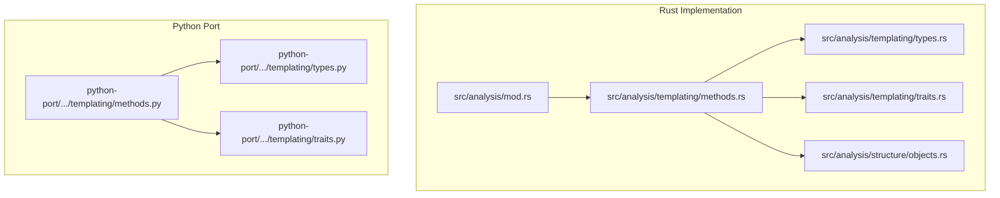
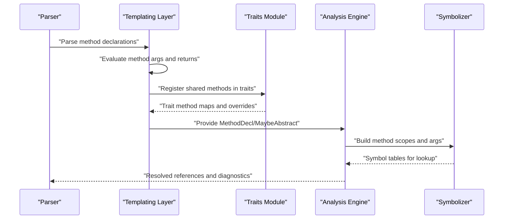
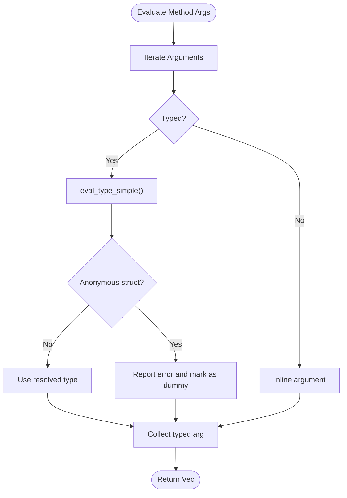
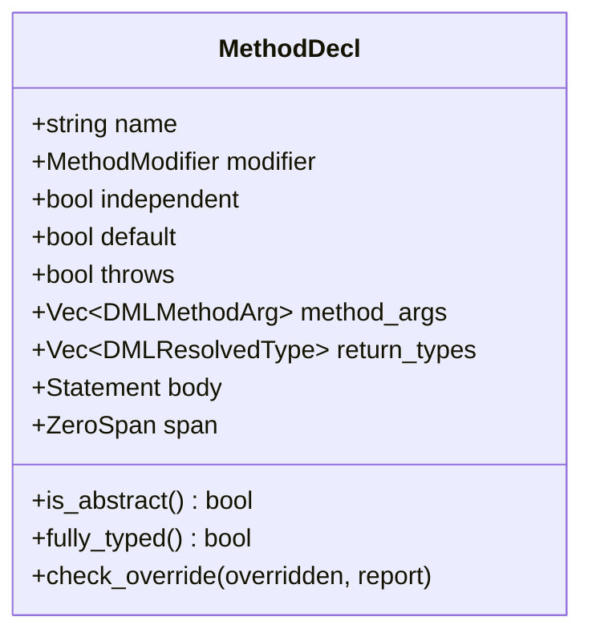
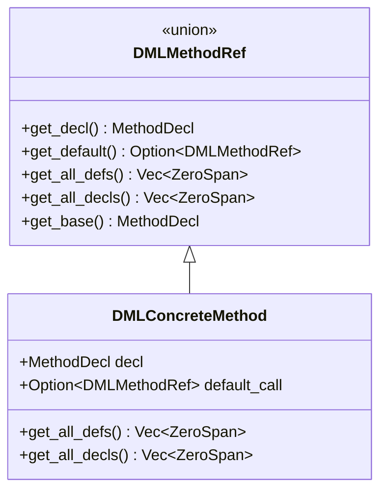
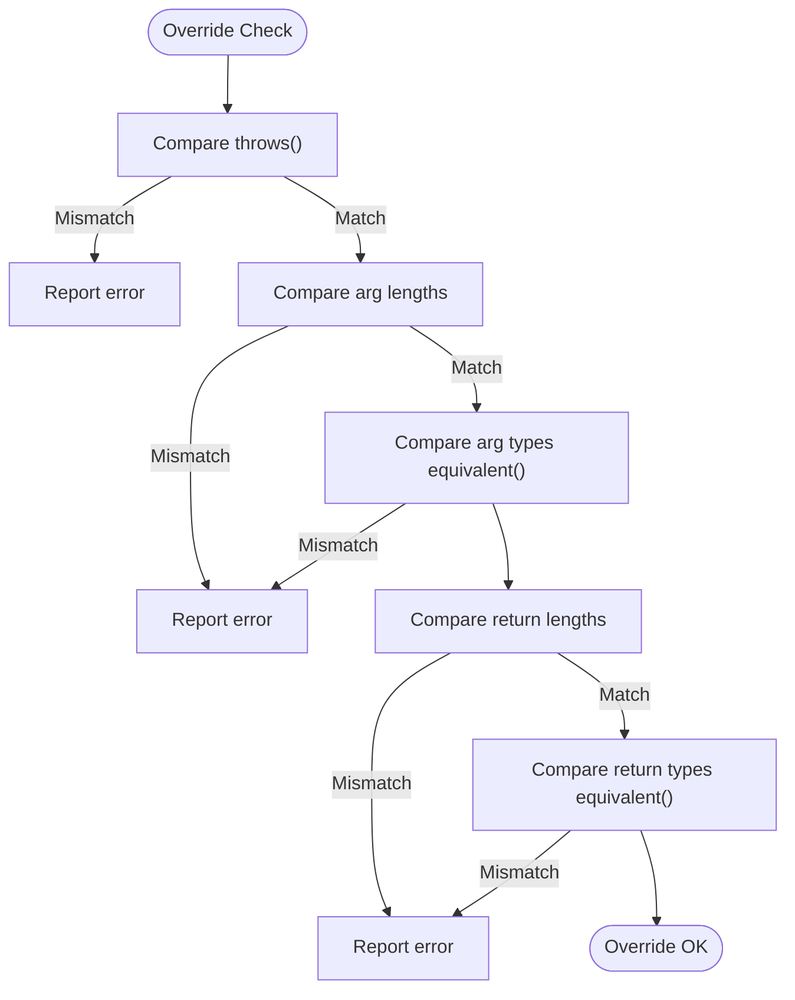
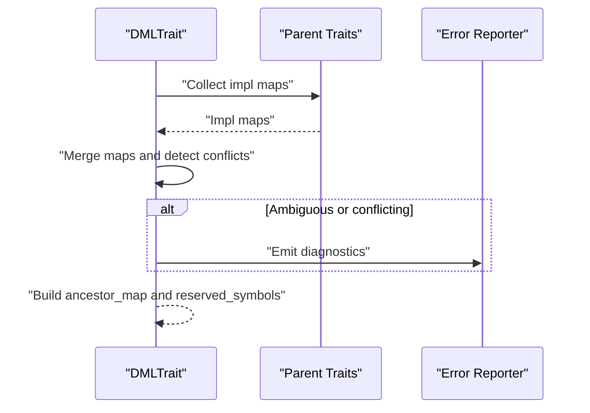
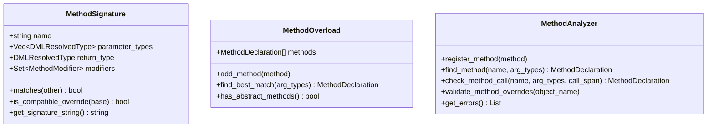
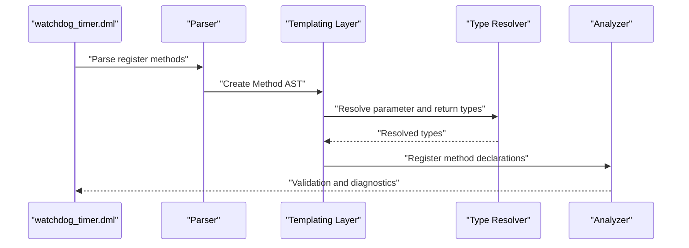
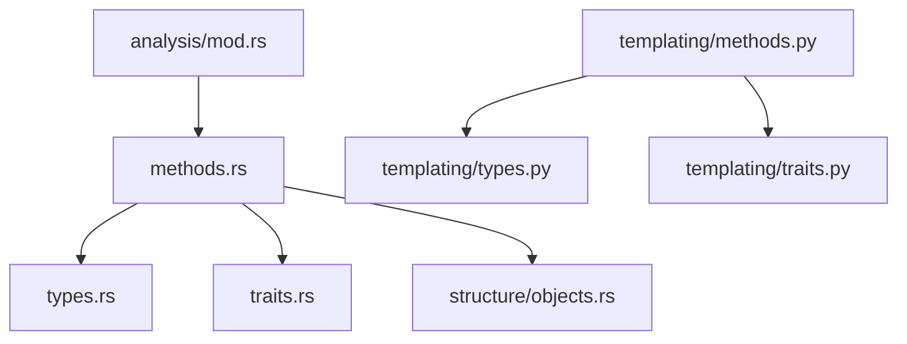

# Template Methods

<cite>
**Referenced Files in This Document**
- [methods.rs](file://src/analysis/templating/methods.rs)
- [mod.rs](file://src/analysis/templating/mod.rs)
- [types.rs](file://src/analysis/templating/types.rs)
- [traits.rs](file://src/analysis/templating/traits.rs)
- [objects.rs](file://src/analysis/structure/objects.rs)
- [mod.rs](file://src/analysis/mod.rs)
- [methods.py](file://python-port/dml_language_server/analysis/templating/methods.py)
- [types.py](file://python-port/dml_language_server/analysis/templating/types.py)
- [traits.py](file://python-port/dml_language_server/analysis/templating/traits.py)
- [watchdog_timer.dml](file://example_files/watchdog_timer.dml)
</cite>

## Table of Contents
1. [Introduction](#introduction)
2. [Project Structure](#project-structure)
3. [Core Components](#core-components)
4. [Architecture Overview](#architecture-overview)
5. [Detailed Component Analysis](#detailed-component-analysis)
6. [Dependency Analysis](#dependency-analysis)
7. [Performance Considerations](#performance-considerations)
8. [Troubleshooting Guide](#troubleshooting-guide)
9. [Conclusion](#conclusion)

## Introduction
This document explains how template method handling is implemented in the DML template processing system. It covers method resolution algorithms, parameter binding for templated methods, inheritance and override mechanisms, signature validation, overload resolution, and virtual method dispatch for templated constructs. It also provides concrete examples of method instantiation workflows, parameter substitution, and method resolution order, along with performance considerations and debugging techniques.

## Project Structure
The template method system spans both the Rust implementation under src/analysis/templating and a Python port under python-port/dml_language_server/analysis/templating. The Rust side focuses on type resolution, method declarations, and trait integration, while the Python port mirrors the core concepts for testing and prototyping.

**Diagram sources**
- [methods.rs](file://src/analysis/templating/methods.rs#L1-L491)
- [types.rs](file://src/analysis/templating/types.rs#L1-L93)
- [traits.rs](file://src/analysis/templating/traits.rs#L1-L677)
- [objects.rs](file://src/analysis/structure/objects.rs#L1-L800)
- [mod.rs](file://src/analysis/mod.rs#L1060-L1259)
- [methods.py](file://python-port/dml_language_server/analysis/templating/methods.py#L1-L423)
- [types.py](file://python-port/dml_language_server/analysis/templating/types.py#L1-L357)
- [traits.py](file://python-port/dml_language_server/analysis/templating/traits.py#L1-L372)

**Section sources**
- [methods.rs](file://src/analysis/templating/methods.rs#L1-L491)
- [mod.rs](file://src/analysis/templating/mod.rs#L1-L31)
- [types.rs](file://src/analysis/templating/types.rs#L1-L93)
- [traits.rs](file://src/analysis/templating/traits.rs#L1-L677)
- [objects.rs](file://src/analysis/structure/objects.rs#L1-L800)
- [mod.rs](file://src/analysis/mod.rs#L1060-L1259)
- [methods.py](file://python-port/dml_language_server/analysis/templating/methods.py#L1-L423)
- [types.py](file://python-port/dml_language_server/analysis/templating/types.py#L1-L357)
- [traits.py](file://python-port/dml_language_server/analysis/templating/traits.py#L1-L372)

## Core Components
- Method argument representation and equivalence
- Method declaration model with abstract/concrete distinction
- Method reference union supporting trait methods and concrete methods
- Concrete method wrapper with default-call chaining
- Signature validation and override checking
- Trait-based method resolution and inheritance
- Type resolution for method parameters and return types

Key responsibilities:
- Normalize method argument types and detect inline vs typed arguments
- Build method signatures and enforce override compatibility
- Track method definitions and declarations across inheritance
- Integrate with traits for shared method resolution
- Provide type-safe evaluation of method return types

**Section sources**
- [methods.rs](file://src/analysis/templating/methods.rs#L20-L115)
- [methods.rs](file://src/analysis/templating/methods.rs#L117-L163)
- [methods.rs](file://src/analysis/templating/methods.rs#L290-L346)
- [methods.rs](file://src/analysis/templating/methods.rs#L420-L491)
- [types.rs](file://src/analysis/templating/types.rs#L46-L72)

## Architecture Overview
Template method handling integrates with the broader analysis pipeline. Method declarations are evaluated during template processing, validated against trait constraints, and symbolized for lookup. The analysis module resolves references within method scopes and supports “default” dispatch for method chaining.

**Diagram sources**
- [methods.rs](file://src/analysis/templating/methods.rs#L62-L115)
- [traits.rs](file://src/analysis/templating/traits.rs#L378-L496)
- [mod.rs](file://src/analysis/mod.rs#L1675-L1874)

## Detailed Component Analysis

### Method Argument and Return Evaluation
- Method arguments are normalized into typed or inline forms. Typed arguments are resolved via type evaluation, with checks against anonymous struct types.
- Return types are evaluated similarly, generating resolved types or dummy placeholders for error recovery.

**Diagram sources**
- [methods.rs](file://src/analysis/templating/methods.rs#L62-L93)
- [types.rs](file://src/analysis/templating/types.rs#L80-L92)

**Section sources**
- [methods.rs](file://src/analysis/templating/methods.rs#L62-L115)
- [types.rs](file://src/analysis/templating/types.rs#L80-L92)

### Method Declaration Model and Abstractness
- MethodDecl encapsulates name, modifiers, independence, default flag, throws, arguments, returns, body, and span.
- Abstractness is derived from whether the body is empty; concrete methods carry executable bodies.

**Diagram sources**
- [methods.rs](file://src/analysis/templating/methods.rs#L117-L163)
- [methods.rs](file://src/analysis/templating/methods.rs#L137-L142)

**Section sources**
- [methods.rs](file://src/analysis/templating/methods.rs#L117-L163)
- [methods.rs](file://src/analysis/templating/methods.rs#L137-L142)

### Method Reference and Dispatch
- DMLMethodRef unions trait methods and concrete methods, enabling polymorphic dispatch.
- Concrete methods can chain to default calls, supporting “default” keyword resolution within method bodies.

**Diagram sources**
- [methods.rs](file://src/analysis/templating/methods.rs#L290-L346)
- [methods.rs](file://src/analysis/templating/methods.rs#L420-L491)

**Section sources**
- [methods.rs](file://src/analysis/templating/methods.rs#L290-L346)
- [methods.rs](file://src/analysis/templating/methods.rs#L420-L491)
- [mod.rs](file://src/analysis/mod.rs#L1060-L1120)

### Override Validation and Compatibility
- Overriding enforces throws compatibility, argument count/type parity, and return type compatibility.
- Equivalent argument and return types are checked using structural equivalence.

**Diagram sources**
- [methods.rs](file://src/analysis/templating/methods.rs#L178-L252)

**Section sources**
- [methods.rs](file://src/analysis/templating/methods.rs#L178-L252)

### Trait-Based Method Resolution and Inheritance
- Traits aggregate shared method declarations and enforce override soundness across ancestors.
- Merging implementation maps detects ambiguous or conflicting definitions and reports diagnostics.

**Diagram sources**
- [traits.rs](file://src/analysis/templating/traits.rs#L500-L624)

**Section sources**
- [traits.rs](file://src/analysis/templating/traits.rs#L500-L624)

### Python Port: Method Signatures and Overload Resolution
- The Python port models method signatures with name, parameter types, return type, and modifiers.
- Overload resolution selects best match by exact or compatible parameter type matching.

**Diagram sources**
- [methods.py](file://python-port/dml_language_server/analysis/templating/methods.py#L37-L85)
- [methods.py](file://python-port/dml_language_server/analysis/templating/methods.py#L113-L162)
- [methods.py](file://python-port/dml_language_server/analysis/templating/methods.py#L242-L374)

**Section sources**
- [methods.py](file://python-port/dml_language_server/analysis/templating/methods.py#L37-L85)
- [methods.py](file://python-port/dml_language_server/analysis/templating/methods.py#L113-L162)
- [methods.py](file://python-port/dml_language_server/analysis/templating/methods.py#L242-L374)

### Example: Method Instantiation Workflow in DML
- Example device file demonstrates method declarations inside registers, including typed parameters and return types.
- The analysis pipeline evaluates these methods during template processing and symbolization.

**Diagram sources**
- [watchdog_timer.dml](file://example_files/watchdog_timer.dml#L79-L92)

**Section sources**
- [watchdog_timer.dml](file://example_files/watchdog_timer.dml#L79-L92)

## Dependency Analysis
- Method evaluation depends on type resolution for arguments and returns.
- Method references depend on trait definitions for shared methods and on concrete method wrappers for default dispatch.
- The analysis module depends on method references for symbolization and scope resolution.

**Diagram sources**
- [methods.rs](file://src/analysis/templating/methods.rs#L1-L491)
- [types.rs](file://src/analysis/templating/types.rs#L1-L93)
- [traits.rs](file://src/analysis/templating/traits.rs#L1-L677)
- [objects.rs](file://src/analysis/structure/objects.rs#L1-L800)
- [mod.rs](file://src/analysis/mod.rs#L1060-L1259)
- [methods.py](file://python-port/dml_language_server/analysis/templating/methods.py#L1-L423)
- [types.py](file://python-port/dml_language_server/analysis/templating/types.py#L1-L357)
- [traits.py](file://python-port/dml_language_server/analysis/templating/traits.py#L1-L372)

**Section sources**
- [methods.rs](file://src/analysis/templating/methods.rs#L1-L491)
- [types.rs](file://src/analysis/templating/types.rs#L1-L93)
- [traits.rs](file://src/analysis/templating/traits.rs#L1-L677)
- [objects.rs](file://src/analysis/structure/objects.rs#L1-L800)
- [mod.rs](file://src/analysis/mod.rs#L1060-L1259)
- [methods.py](file://python-port/dml_language_server/analysis/templating/methods.py#L1-L423)
- [types.py](file://python-port/dml_language_server/analysis/templating/types.py#L1-L357)
- [traits.py](file://python-port/dml_language_server/analysis/templating/traits.py#L1-L372)

## Performance Considerations
- Method signature matching: Linear scan over overload sets; consider indexing by name and arity for large overload sets.
- Type equivalence: Current implementation uses a conservative equivalence that avoids false negatives; refine to precise structural equality to reduce ambiguity.
- Trait merging: O(P) per trait for P parents; cache merged maps to avoid recomputation.
- Symbolization: Method scope creation and argument symbolization occur per method; batch operations where possible.
- Dummy types: Used for error recovery; minimize unnecessary dummy allocations and comparisons.

[No sources needed since this section provides general guidance]

## Troubleshooting Guide
Common issues and resolutions:
- Anonymous struct in argument or return type: Detected during type evaluation; fix by using named types or removing anonymous structs.
- Override mismatch: Throws compatibility, argument count/type, or return type mismatches trigger errors; align signatures with base.
- Conflicting trait definitions: Ambiguous or conflicting method definitions reported with related spans; choose appropriate inheritance order or remove duplicates.
- “default” keyword resolution: Ensure a default call exists; otherwise “default” references are unresolved.
- Missing method signatures in Python port: Overload resolution prefers exact matches; ensure argument counts and types match exactly.

**Section sources**
- [methods.rs](file://src/analysis/templating/methods.rs#L62-L115)
- [methods.rs](file://src/analysis/templating/methods.rs#L178-L252)
- [traits.rs](file://src/analysis/templating/traits.rs#L580-L621)
- [mod.rs](file://src/analysis/mod.rs#L1060-L1120)
- [methods.py](file://python-port/dml_language_server/analysis/templating/methods.py#L121-L157)

## Conclusion
The DML template method system provides robust support for method declaration, parameter binding, override validation, and trait-based inheritance. The Rust implementation offers precise type resolution and symbolization, while the Python port mirrors core concepts for development and testing. By leveraging method references, trait maps, and strict override checks, the system ensures reliable method resolution and dispatch across templated constructs.