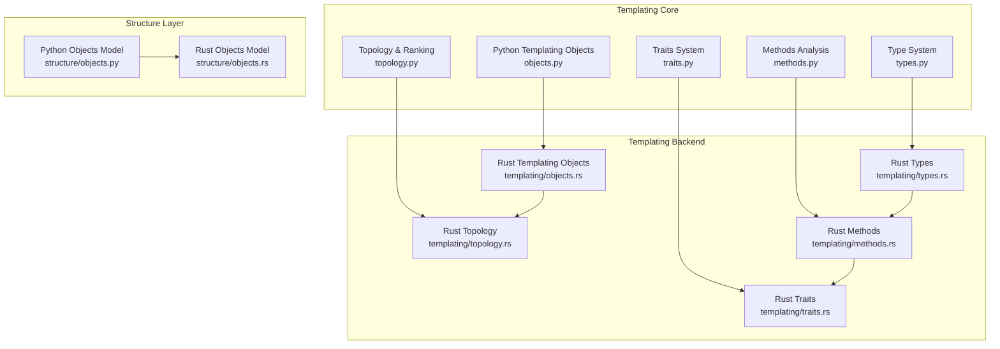
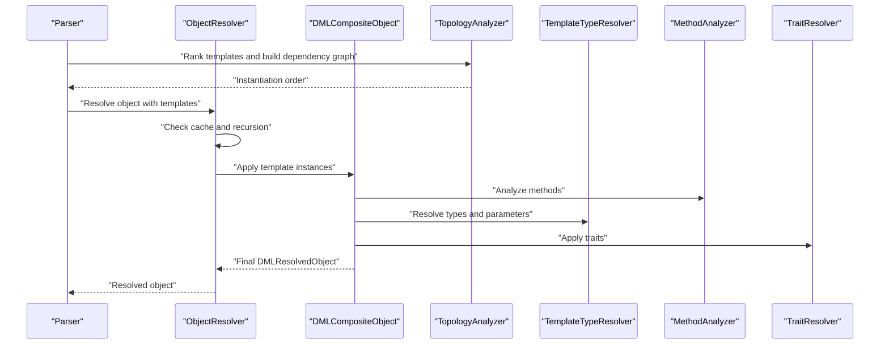
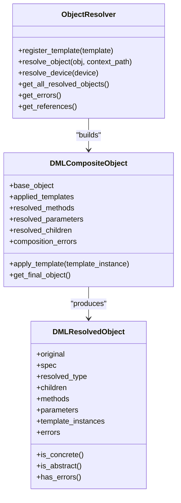
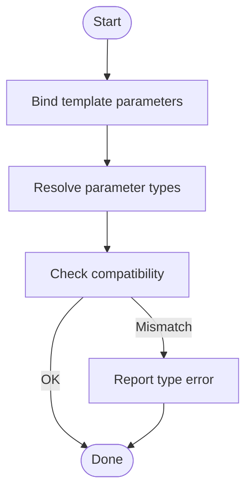
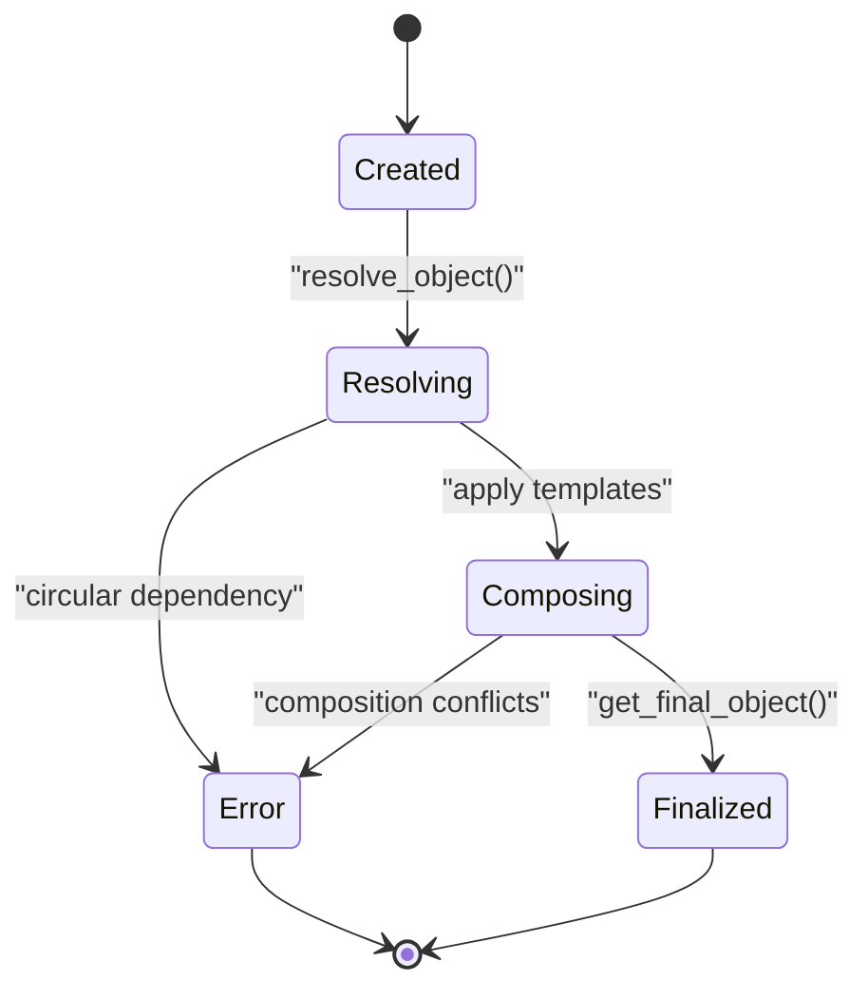
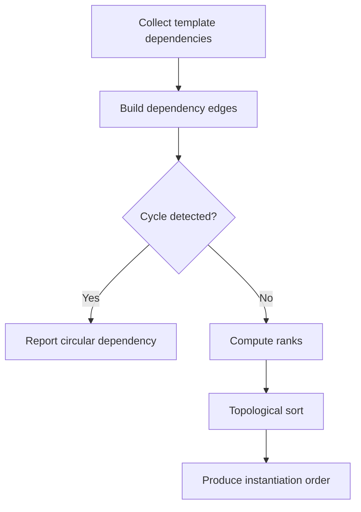
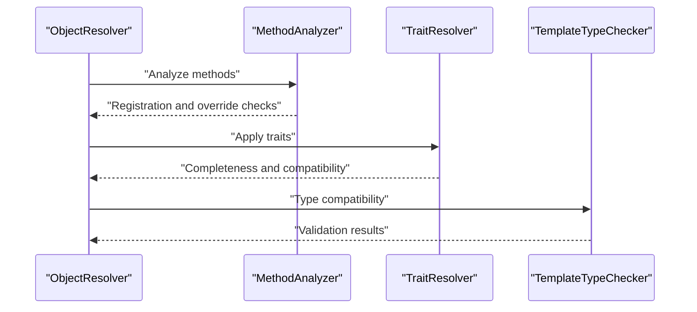
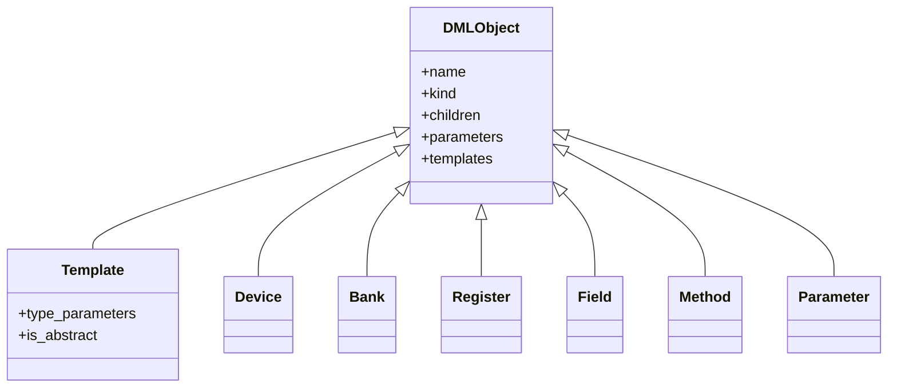
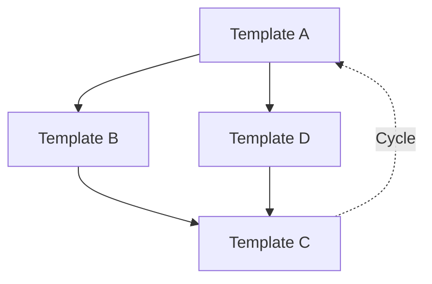

# Template Objects

<cite>
**Referenced Files in This Document**
- [objects.py](file://python-port/dml_language_server/analysis/templating/objects.py)
- [objects.rs](file://src/analysis/templating/objects.rs)
- [topology.py](file://python-port/dml_language_server/analysis/templating/topology.py)
- [topology.rs](file://src/analysis/templating/topology.rs)
- [types.py](file://python-port/dml_language_server/analysis/templating/types.py)
- [types.rs](file://src/analysis/templating/types.rs)
- [methods.py](file://python-port/dml_language_server/analysis/templating/methods.py)
- [methods.rs](file://src/analysis/templating/methods.rs)
- [traits.py](file://python-port/dml_language_server/analysis/templating/traits.py)
- [traits.rs](file://src/analysis/templating/traits.rs)
- [objects.py](file://python-port/dml_language_server/analysis/structure/objects.py)
- [objects.rs](file://src/analysis/structure/objects.rs)
</cite>

## Table of Contents
1. [Introduction](#introduction)
2. [Project Structure](#project-structure)
3. [Core Components](#core-components)
4. [Architecture Overview](#architecture-overview)
5. [Detailed Component Analysis](#detailed-component-analysis)
6. [Dependency Analysis](#dependency-analysis)
7. [Performance Considerations](#performance-considerations)
8. [Troubleshooting Guide](#troubleshooting-guide)
9. [Conclusion](#conclusion)

## Introduction
This document explains how template objects are instantiated, composed, and managed in the DML language server. It covers:
- Object hierarchy construction for templated objects
- Parameter binding during instantiation
- Object lifecycle management
- Template creation algorithms and inheritance chains
- Validation processes and error reporting
- Practical workflows for template object instantiation and debugging

The content is grounded in the Python port and Rust implementations of the templating subsystem, ensuring accuracy across both language variants.

## Project Structure
The templating subsystem spans three primary areas:
- Object model and resolution: Python port’s templating objects and Rust’s composite object system
- Topology and ranking: Dependency graph construction and instantiation ordering
- Types, methods, and traits: Type resolution, method analysis, and trait-based composition

**Diagram sources**
- [objects.py](file://python-port/dml_language_server/analysis/templating/objects.py#L217-L375)
- [topology.py](file://python-port/dml_language_server/analysis/templating/topology.py#L270-L398)
- [types.py](file://python-port/dml_language_server/analysis/templating/types.py#L150-L242)
- [methods.py](file://python-port/dml_language_server/analysis/templating/methods.py#L242-L374)
- [traits.py](file://python-port/dml_language_server/analysis/templating/traits.py#L180-L335)
- [objects.rs](file://src/analysis/templating/objects.rs#L372-L518)
- [topology.rs](file://src/analysis/templating/topology.rs#L472-L730)
- [types.rs](file://src/analysis/templating/types.rs#L1-L93)
- [methods.rs](file://src/analysis/templating/methods.rs#L117-L288)
- [traits.rs](file://src/analysis/templating/traits.rs#L29-L148)

**Section sources**
- [objects.py](file://python-port/dml_language_server/analysis/templating/objects.py#L1-L407)
- [objects.rs](file://src/analysis/templating/objects.rs#L1-L800)
- [topology.py](file://python-port/dml_language_server/analysis/templating/topology.py#L1-L450)
- [topology.rs](file://src/analysis/templating/topology.rs#L1-L800)
- [types.py](file://python-port/dml_language_server/analysis/templating/types.py#L1-L357)
- [types.rs](file://src/analysis/templating/types.rs#L1-L93)
- [methods.py](file://python-port/dml_language_server/analysis/templating/methods.py#L1-L423)
- [methods.rs](file://src/analysis/templating/methods.rs#L1-L491)
- [traits.py](file://python-port/dml_language_server/analysis/templating/traits.py#L1-L372)
- [traits.rs](file://src/analysis/templating/traits.rs#L1-L677)
- [objects.py](file://python-port/dml_language_server/analysis/structure/objects.py#L1-L672)
- [objects.rs](file://src/analysis/structure/objects.rs#L647-L726)

## Core Components
This section outlines the principal building blocks for template object instantiation and management.

- ObjectResolver and DMLCompositeObject
  - Resolves a DML object with template applications, merges methods and child objects from templates, and tracks composition errors.
  - Provides caching, recursion detection, and final object composition into a DMLResolvedObject.

- TemplateInstance
  - Captures a single template application, including parameter bindings, instantiated methods, and instantiated child objects.

- DMLResolvedObject
  - Final resolved representation of an object with template composition, including children, methods, parameters, and resolution kind.

- TopologyAnalyzer and TemplateGraph
  - Builds a dependency graph among templates, detects cycles, computes ranks, and produces an instantiation order.

- TemplateTypeResolver and TemplateTypeChecker
  - Resolve types in template contexts, handle template parameters, and check type compatibility.

- MethodAnalyzer and MethodRegistry
  - Analyze method signatures, manage overloads, enforce override compatibility, and validate abstract method implementations.

- TraitResolver and TraitInstance
  - Apply traits to objects, check completeness, and validate trait constraints.

**Section sources**
- [objects.py](file://python-port/dml_language_server/analysis/templating/objects.py#L217-L375)
- [objects.py](file://python-port/dml_language_server/analysis/templating/objects.py#L98-L215)
- [objects.py](file://python-port/dml_language_server/analysis/templating/objects.py#L303-L322)
- [topology.py](file://python-port/dml_language_server/analysis/templating/topology.py#L78-L268)
- [types.py](file://python-port/dml_language_server/analysis/templating/types.py#L150-L242)
- [methods.py](file://python-port/dml_language_server/analysis/templating/methods.py#L242-L374)
- [traits.py](file://python-port/dml_language_server/analysis/templating/traits.py#L180-L335)

## Architecture Overview
The template object lifecycle integrates parsing, topology ranking, type resolution, method analysis, and trait application into a cohesive pipeline.

**Diagram sources**
- [topology.py](file://python-port/dml_language_server/analysis/templating/topology.py#L318-L398)
- [objects.py](file://python-port/dml_language_server/analysis/templating/objects.py#L233-L301)
- [types.py](file://python-port/dml_language_server/analysis/templating/types.py#L150-L242)
- [methods.py](file://python-port/dml_language_server/analysis/templating/methods.py#L242-L314)
- [traits.py](file://python-port/dml_language_server/analysis/templating/traits.py#L203-L242)

## Detailed Component Analysis

### Object Hierarchy Construction for Templated Objects
- DMLCompositeObject merges methods and child objects from applied templates, tracking composition errors and abstract method presence.
- ObjectResolver orchestrates resolution, caches results, and prevents circular dependencies via a resolution stack.
- DMLResolvedObject encapsulates the final state, including children, methods, parameters, and resolution kind.

**Diagram sources**
- [objects.py](file://python-port/dml_language_server/analysis/templating/objects.py#L217-L375)
- [objects.py](file://python-port/dml_language_server/analysis/templating/objects.py#L151-L215)

**Section sources**
- [objects.py](file://python-port/dml_language_server/analysis/templating/objects.py#L151-L215)
- [objects.py](file://python-port/dml_language_server/analysis/templating/objects.py#L217-L301)

### Parameter Binding During Instantiation
- TemplateTypeResolver binds template parameters to concrete types and resolves parameter references.
- TemplateTypeChecker validates type compatibility and reports mismatches.
- TemplateInstance stores parameter bindings for each applied template.

**Diagram sources**
- [types.py](file://python-port/dml_language_server/analysis/templating/types.py#L150-L242)
- [objects.py](file://python-port/dml_language_server/analysis/templating/objects.py#L98-L110)

**Section sources**
- [types.py](file://python-port/dml_language_server/analysis/templating/types.py#L150-L242)
- [objects.py](file://python-port/dml_language_server/analysis/templating/objects.py#L98-L110)

### Object Lifecycle Management
- Creation: ObjectSpec and ObjectSpec-like structures capture object definitions, template instantiations, imports, and in-each specifications.
- Resolution: ObjectResolver caches and resolves objects, preventing cycles and aggregating errors.
- Composition: DMLCompositeObject merges template contributions and records composition errors.
- Finalization: DMLResolvedObject captures the final state and classification (concrete, abstract, error).

**Diagram sources**
- [objects.py](file://python-port/dml_language_server/analysis/templating/objects.py#L233-L301)
- [objects.py](file://python-port/dml_language_server/analysis/templating/objects.py#L151-L215)

**Section sources**
- [objects.py](file://python-port/dml_language_server/analysis/templating/objects.py#L233-L301)
- [objects.py](file://python-port/dml_language_server/analysis/templating/objects.py#L151-L215)

### Template Object Creation Algorithms and Inheritance Chains
- TemplateGraph builds a dependency graph among templates, detecting cycles and computing ranks.
- TopologyAnalyzer computes instantiation order using topological sorting and rank-based prioritization.
- Inheritance chains are enforced via method override checks and trait implementation validation.

**Diagram sources**
- [topology.py](file://python-port/dml_language_server/analysis/templating/topology.py#L78-L268)
- [topology.py](file://python-port/dml_language_server/analysis/templating/topology.py#L224-L251)

**Section sources**
- [topology.py](file://python-port/dml_language_server/analysis/templating/topology.py#L78-L268)
- [topology.py](file://python-port/dml_language_server/analysis/templating/topology.py#L224-L251)

### Object Validation Processes
- MethodAnalyzer enforces override compatibility and abstract method requirements.
- TraitResolver validates completeness of trait implementations and checks trait compatibility.
- TypeChecker ensures type compatibility and reports mismatches.

**Diagram sources**
- [methods.py](file://python-port/dml_language_server/analysis/templating/methods.py#L242-L374)
- [traits.py](file://python-port/dml_language_server/analysis/templating/traits.py#L180-L335)
- [types.py](file://python-port/dml_language_server/analysis/templating/types.py#L244-L298)

**Section sources**
- [methods.py](file://python-port/dml_language_server/analysis/templating/methods.py#L242-L374)
- [traits.py](file://python-port/dml_language_server/analysis/templating/traits.py#L180-L335)
- [types.py](file://python-port/dml_language_server/analysis/templating/types.py#L244-L298)

### Relationship Between Template Objects and Regular Objects
- Template objects define reusable compositions and constraints.
- Regular objects instantiate templates and inherit their methods and child objects.
- The structure layer models both templated and concrete object kinds uniformly.

**Diagram sources**
- [objects.py](file://python-port/dml_language_server/analysis/structure/objects.py#L68-L420)
- [objects.rs](file://src/analysis/structure/objects.rs#L647-L726)

**Section sources**
- [objects.py](file://python-port/dml_language_server/analysis/structure/objects.py#L68-L420)
- [objects.rs](file://src/analysis/structure/objects.rs#L647-L726)

### Memory Management Considerations
- Python port uses dataclasses and lists for composition; caching via object_cache minimizes recomputation.
- Rust port employs Arc and SlotMap for shared ownership and efficient storage of composite objects.
- Avoid deep copying where possible; reuse resolved types and method declarations.

[No sources needed since this section provides general guidance]

### Debugging Techniques for Template Object Issues
- Enable detailed logging for resolution steps and dependency analysis.
- Inspect ObjectResolver errors, composition errors, and method registry errors.
- Validate template compatibility and trait completeness before runtime usage.
- Use TopologyAnalyzer to detect circular dependencies and incorrect instantiation orders.

**Section sources**
- [objects.py](file://python-port/dml_language_server/analysis/templating/objects.py#L362-L375)
- [methods.py](file://python-port/dml_language_server/analysis/templating/methods.py#L355-L374)
- [traits.py](file://python-port/dml_language_server/analysis/templating/traits.py#L284-L335)
- [topology.py](file://python-port/dml_language_server/analysis/templating/topology.py#L140-L183)

## Dependency Analysis
Template dependencies form a directed acyclic graph. The system:
- Detects cycles and reports them as errors
- Computes ranks based on dependencies and characteristics
- Produces a topological order for safe instantiation

**Diagram sources**
- [topology.py](file://python-port/dml_language_server/analysis/templating/topology.py#L140-L183)
- [topology.py](file://python-port/dml_language_server/analysis/templating/topology.py#L224-L251)

**Section sources**
- [topology.py](file://python-port/dml_language_server/analysis/templating/topology.py#L140-L183)
- [topology.py](file://python-port/dml_language_server/analysis/templating/topology.py#L224-L251)

## Performance Considerations
- Cache resolved objects to avoid repeated computation.
- Use topological sorting to minimize redundant validations.
- Limit deep recursion by tracking resolution stacks and detecting cycles early.
- Prefer lightweight type representations and defer heavy computations until needed.

[No sources needed since this section provides general guidance]

## Troubleshooting Guide
Common issues and resolutions:
- Circular dependencies: Detected by TopologyAnalyzer; fix by restructuring template dependencies.
- Type mismatches: Reported by TemplateTypeChecker; align parameter types with template definitions.
- Abstract method errors: Reported by MethodAnalyzer; ensure all abstract methods are implemented.
- Trait completeness: Checked by TraitResolver; ensure all required methods and parameters are provided.

**Section sources**
- [topology.py](file://python-port/dml_language_server/analysis/templating/topology.py#L140-L183)
- [types.py](file://python-port/dml_language_server/analysis/templating/types.py#L244-L298)
- [methods.py](file://python-port/dml_language_server/analysis/templating/methods.py#L355-L374)
- [traits.py](file://python-port/dml_language_server/analysis/templating/traits.py#L157-L177)

## Conclusion
Template object instantiation and management in the DML language server is a multi-stage process involving topology ranking, type resolution, method analysis, and trait application. The Python port and Rust implementations provide complementary views of the same system, enabling robust composition, validation, and lifecycle management of templated objects.