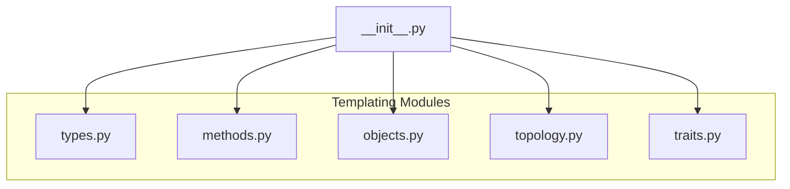
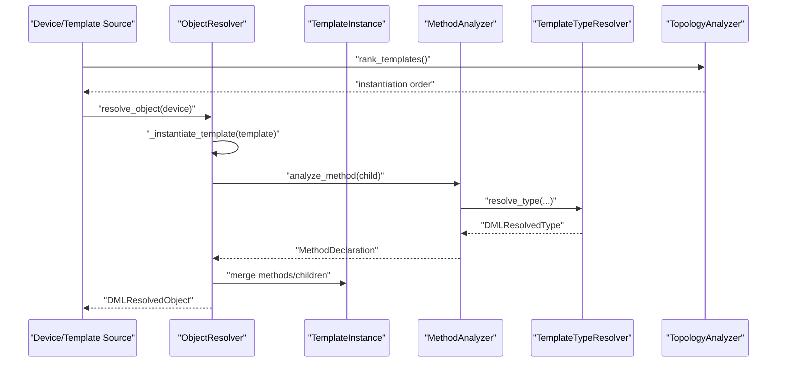
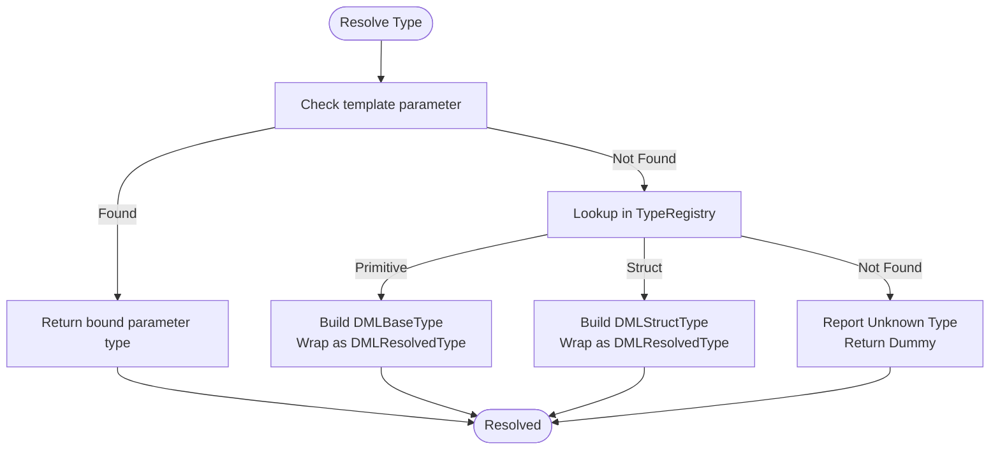
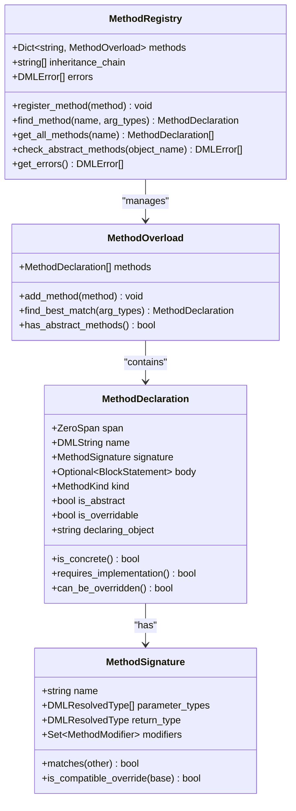
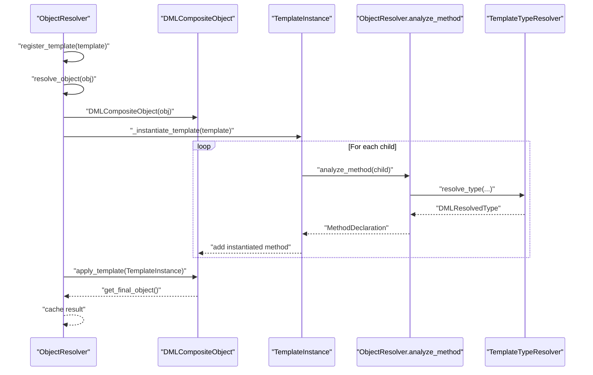
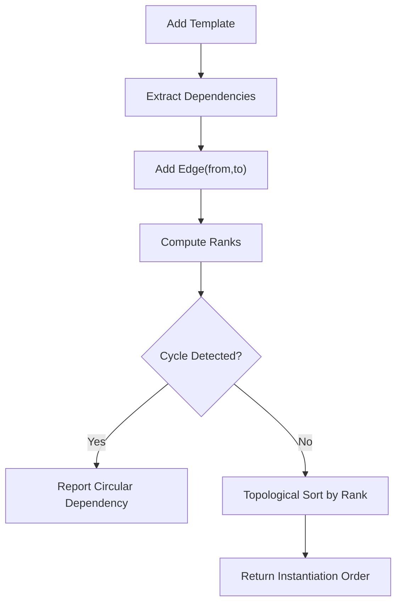
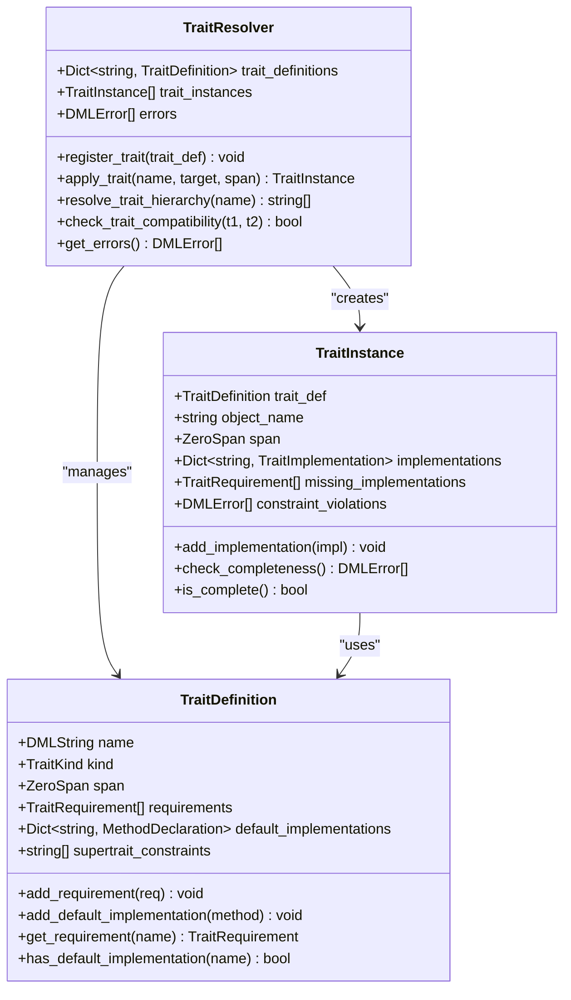
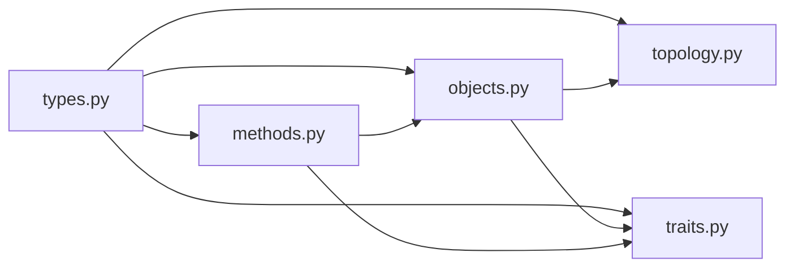
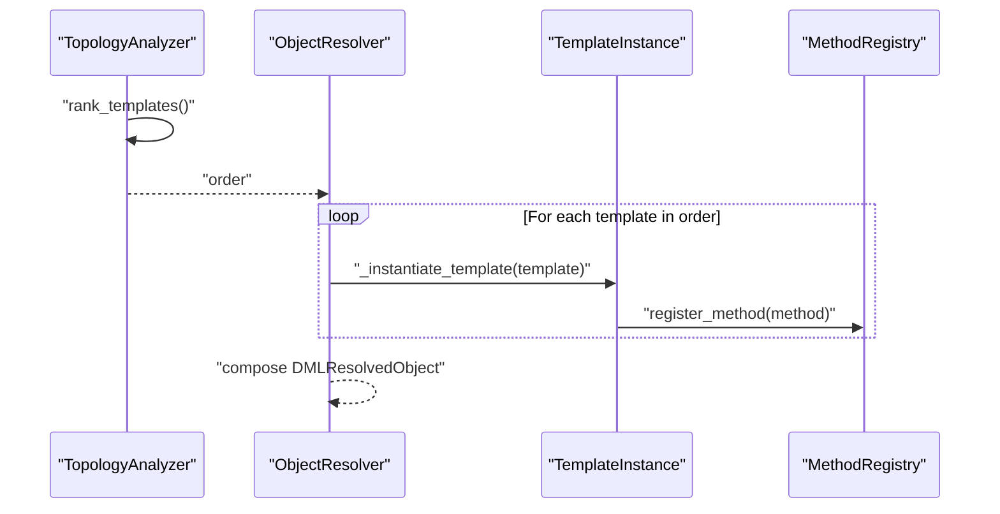
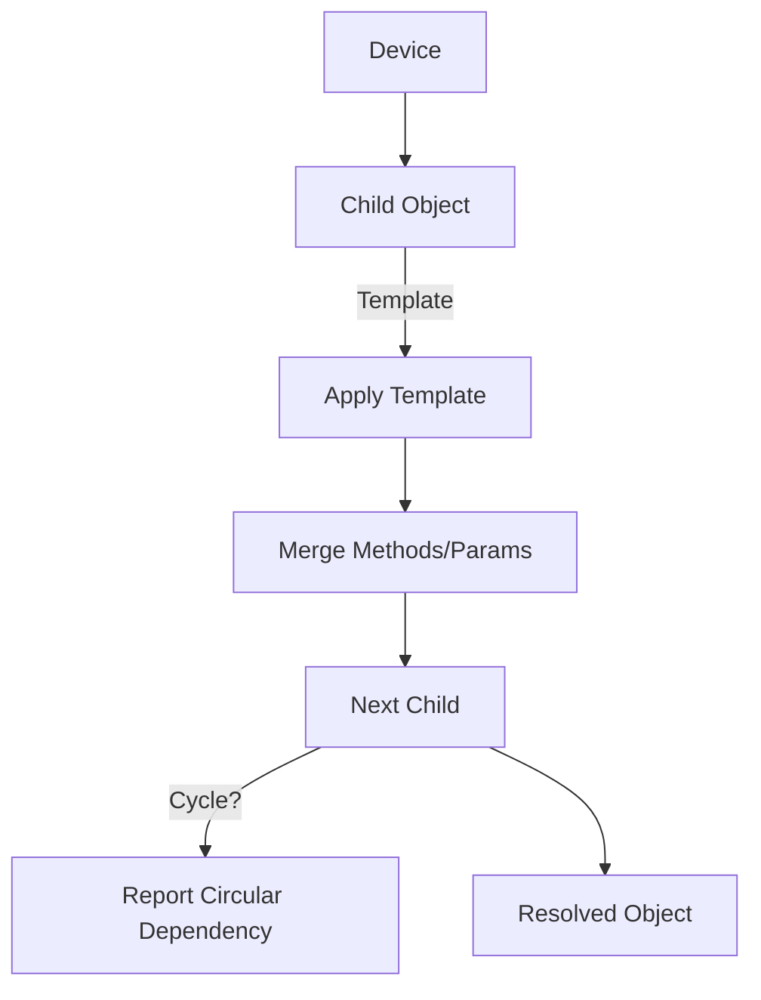

# Template Processing

<cite>
**Referenced Files in This Document**
- [python-port/dml_language_server/analysis/templating/__init__.py](file://python-port/dml_language_server/analysis/templating/__init__.py)
- [python-port/dml_language_server/analysis/templating/methods.py](file://python-port/dml_language_server/analysis/templating/methods.py)
- [python-port/dml_language_server/analysis/templating/objects.py](file://python-port/dml_language_server/analysis/templating/objects.py)
- [python-port/dml_language_server/analysis/templating/topology.py](file://python-port/dml_language_server/analysis/templating/topology.py)
- [python-port/dml_language_server/analysis/templating/traits.py](file://python-port/dml_language_server/analysis/templating/traits.py)
- [python-port/dml_language_server/analysis/templating/types.py](file://python-port/dml_language_server/analysis/templating/types.py)
- [src/analysis/templating/mod.rs](file://src/analysis/templating/mod.rs)
- [src/analysis/templating/methods.rs](file://src/analysis/templating/methods.rs)
- [src/analysis/templating/objects.rs](file://src/analysis/templating/objects.rs)
- [src/analysis/templating/topology.rs](file://src/analysis/templating/topology.rs)
- [src/analysis/templating/traits.rs](file://src/analysis/templating/traits.rs)
- [src/analysis/templating/types.rs](file://src/analysis/templating/types.rs)
- [example_files/watchdog_timer.dml](file://example_files/watchdog_timer.dml)
- [python-port/examples/sample_device.dml](file://python-port/examples/sample_device.dml)
- [python-port/examples/utility.dml](file://python-port/examples/utility.dml)
</cite>

## Table of Contents
1. [Introduction](#introduction)
2. [Project Structure](#project-structure)
3. [Core Components](#core-components)
4. [Architecture Overview](#architecture-overview)
5. [Detailed Component Analysis](#detailed-component-analysis)
6. [Dependency Analysis](#dependency-analysis)
7. [Performance Considerations](#performance-considerations)
8. [Troubleshooting Guide](#troubleshooting-guide)
9. [Conclusion](#conclusion)
10. [Appendices](#appendices)

## Introduction
This document explains the DML template processing system implemented in the repository. It covers template instantiation algorithms, object hierarchy construction, template trait resolution, method handling, topology analysis, and type resolution for templated constructs. It also documents template object creation, parameter binding, inheritance mechanisms, and practical examples for validation and debugging.

## Project Structure
The template processing system is implemented in both Python and Rust. The Python port mirrors the Rust implementation and exposes a templating API for analysis and validation. Key modules include:
- Types: type resolution and evaluation
- Methods: method analysis, overloading, and inheritance
- Objects: template application, composition, and object resolution
- Topology: dependency ranking and instantiation ordering
- Traits: trait definitions, implementations, and constraint checking
- Init: module re-exports and public API surface

**Diagram sources**
- [python-port/dml_language_server/analysis/templating/__init__.py](file://python-port/dml_language_server/analysis/templating/__init__.py#L1-L61)
- [python-port/dml_language_server/analysis/templating/types.py](file://python-port/dml_language_server/analysis/templating/types.py#L1-L357)
- [python-port/dml_language_server/analysis/templating/methods.py](file://python-port/dml_language_server/analysis/templating/methods.py#L1-L423)
- [python-port/dml_language_server/analysis/templating/objects.py](file://python-port/dml_language_server/analysis/templating/objects.py#L1-L407)
- [python-port/dml_language_server/analysis/templating/topology.py](file://python-port/dml_language_server/analysis/templating/topology.py#L1-L450)
- [python-port/dml_language_server/analysis/templating/traits.py](file://python-port/dml_language_server/analysis/templating/traits.py#L1-L372)

**Section sources**
- [python-port/dml_language_server/analysis/templating/__init__.py](file://python-port/dml_language_server/analysis/templating/__init__.py#L1-L61)

## Core Components
- TemplateTypeResolver and TemplateTypeChecker: resolve and validate types in template contexts, including parameter binding and compatibility checks.
- MethodAnalyzer and MethodRegistry: analyze method signatures, manage overloads, enforce override compatibility, and detect missing implementations.
- ObjectResolver and DMLCompositeObject: instantiate templates, compose objects, merge methods and parameters, and build resolved object trees.
- TopologyAnalyzer and TemplateGraph: extract dependencies, compute ranks, detect cycles, and produce instantiation order.
- TraitResolver and TraitInstance: define traits, check completeness, validate constraints, and manage trait hierarchies.

**Section sources**
- [python-port/dml_language_server/analysis/templating/types.py](file://python-port/dml_language_server/analysis/templating/types.py#L150-L298)
- [python-port/dml_language_server/analysis/templating/methods.py](file://python-port/dml_language_server/analysis/templating/methods.py#L242-L374)
- [python-port/dml_language_server/analysis/templating/objects.py](file://python-port/dml_language_server/analysis/templating/objects.py#L217-L375)
- [python-port/dml_language_server/analysis/templating/topology.py](file://python-port/dml_language_server/analysis/templating/topology.py#L270-L398)
- [python-port/dml_language_server/analysis/templating/traits.py](file://python-port/dml_language_server/analysis/templating/traits.py#L180-L335)

## Architecture Overview
The system orchestrates template processing through a pipeline:
- Type resolution validates and binds template parameters.
- Method analysis ensures signature compatibility and detects missing implementations.
- Object resolution composes templates into concrete objects.
- Topology analysis orders template instantiation and prevents cycles.
- Trait resolution enforces trait constraints and completeness.

**Diagram sources**
- [python-port/dml_language_server/analysis/templating/topology.py](file://python-port/dml_language_server/analysis/templating/topology.py#L400-L444)
- [python-port/dml_language_server/analysis/templating/objects.py](file://python-port/dml_language_server/analysis/templating/objects.py#L303-L322)
- [python-port/dml_language_server/analysis/templating/methods.py](file://python-port/dml_language_server/analysis/templating/methods.py#L242-L314)
- [python-port/dml_language_server/analysis/templating/types.py](file://python-port/dml_language_server/analysis/templating/types.py#L150-L225)

## Detailed Component Analysis

### Template Type Resolution
- Purpose: Bind template parameters, resolve primitive and struct types, and produce DMLResolvedType.
- Key behaviors:
  - Parameter lookup via template_parameters dictionary.
  - Registry-based type discovery and conversion to concrete types.
  - Dummy fallback for unknown or void types depending on context.
  - Compatibility checks for assignments and parameter lists.

**Diagram sources**
- [python-port/dml_language_server/analysis/templating/types.py](file://python-port/dml_language_server/analysis/templating/types.py#L150-L225)

**Section sources**
- [python-port/dml_language_server/analysis/templating/types.py](file://python-port/dml_language_server/analysis/templating/types.py#L150-L298)

### Method Handling and Overload Resolution
- Purpose: Analyze method signatures, manage overloads, enforce override compatibility, and detect missing implementations.
- Key behaviors:
  - Signature matching and compatibility checks for overrides.
  - Overload selection by exact or compatible matches.
  - Registration of method conflicts and abstract method validation.
  - Call-site resolution and reference tracking.

**Diagram sources**
- [python-port/dml_language_server/analysis/templating/methods.py](file://python-port/dml_language_server/analysis/templating/methods.py#L25-L162)
- [python-port/dml_language_server/analysis/templating/methods.py](file://python-port/dml_language_server/analysis/templating/methods.py#L164-L240)

**Section sources**
- [python-port/dml_language_server/analysis/templating/methods.py](file://python-port/dml_language_server/analysis/templating/methods.py#L242-L374)

### Object Resolution and Template Composition
- Purpose: Instantiate templates, merge methods and parameters, compose child objects, and produce resolved objects.
- Key behaviors:
  - Template application and method/object instantiation.
  - Override compatibility checks and composition errors.
  - Caching and circular dependency detection.
  - Final object assembly with resolution kind (concrete/abstract/error).

**Diagram sources**
- [python-port/dml_language_server/analysis/templating/objects.py](file://python-port/dml_language_server/analysis/templating/objects.py#L217-L322)
- [python-port/dml_language_server/analysis/templating/methods.py](file://python-port/dml_language_server/analysis/templating/methods.py#L242-L314)
- [python-port/dml_language_server/analysis/templating/types.py](file://python-port/dml_language_server/analysis/templating/types.py#L150-L225)

**Section sources**
- [python-port/dml_language_server/analysis/templating/objects.py](file://python-port/dml_language_server/analysis/templating/objects.py#L217-L375)

### Topology Analysis and Instantiation Ordering
- Purpose: Extract template dependencies, compute ranks, detect cycles, and produce a safe instantiation order.
- Key behaviors:
  - Graph construction with nodes and edges.
  - Depth-first traversal for cycle detection.
  - Topological sorting with rank-based priority.
  - Dependency extraction from template and child object applications.

**Diagram sources**
- [python-port/dml_language_server/analysis/templating/topology.py](file://python-port/dml_language_server/analysis/templating/topology.py#L78-L251)

**Section sources**
- [python-port/dml_language_server/analysis/templating/topology.py](file://python-port/dml_language_server/analysis/templating/topology.py#L270-L398)

### Trait Resolution and Constraint Checking
- Purpose: Define traits, check completeness, validate constraints, and manage trait hierarchies.
- Key behaviors:
  - Trait definition with requirements and default implementations.
  - Instance completeness checks and missing implementation reporting.
  - Supertrait hierarchy resolution and compatibility checks.
  - Constraint expression evaluation placeholders.

**Diagram sources**
- [python-port/dml_language_server/analysis/templating/traits.py](file://python-port/dml_language_server/analysis/templating/traits.py#L67-L178)
- [python-port/dml_language_server/analysis/templating/traits.py](file://python-port/dml_language_server/analysis/templating/traits.py#L180-L335)

**Section sources**
- [python-port/dml_language_server/analysis/templating/traits.py](file://python-port/dml_language_server/analysis/templating/traits.py#L180-L335)

### Relationship Between Templates and Regular Objects
- Templates are specialized objects that can be instantiated into concrete objects.
- Regular objects are composed of child objects and methods, while templates define reusable structures and behaviors.
- Template application merges methods and parameters, potentially overriding or extending base definitions.

**Section sources**
- [python-port/dml_language_server/analysis/templating/objects.py](file://python-port/dml_language_server/analysis/templating/objects.py#L151-L214)

## Dependency Analysis
The templating modules depend on shared structures and types. The Python port re-exports core types and analyzers, while the Rust implementation provides a canonical reference for semantics and behavior.

**Diagram sources**
- [python-port/dml_language_server/analysis/templating/__init__.py](file://python-port/dml_language_server/analysis/templating/__init__.py#L12-L16)
- [python-port/dml_language_server/analysis/templating/types.py](file://python-port/dml_language_server/analysis/templating/types.py#L1-L357)
- [python-port/dml_language_server/analysis/templating/methods.py](file://python-port/dml_language_server/analysis/templating/methods.py#L1-L423)
- [python-port/dml_language_server/analysis/templating/objects.py](file://python-port/dml_language_server/analysis/templating/objects.py#L1-L407)
- [python-port/dml_language_server/analysis/templating/topology.py](file://python-port/dml_language_server/analysis/templating/topology.py#L1-L450)
- [python-port/dml_language_server/analysis/templating/traits.py](file://python-port/dml_language_server/analysis/templating/traits.py#L1-L372)

**Section sources**
- [python-port/dml_language_server/analysis/templating/__init__.py](file://python-port/dml_language_server/analysis/templating/__init__.py#L18-L61)

## Performance Considerations
- Caching: ObjectResolver caches resolved objects to avoid recomputation and reduce stack depth.
- Topological sorting: Using priority queues keyed by computed ranks minimizes repeated traversals.
- Early termination: Type resolution returns dummy types to prevent cascading errors and speed up analysis.
- Complexity notes:
  - Topology ranking and cycle detection operate near linear in the number of templates and dependencies.
  - Method overload resolution scans overloads per call site; keep overload sets bounded.
  - Trait merging and conflict detection scale with the number of inherited members.

[No sources needed since this section provides general guidance]

## Troubleshooting Guide
Common issues and diagnostics:
- Circular dependencies: Detected by topology analyzer; reported with spans indicating the cycle path.
- Unknown or missing template: Reported during object resolution; verify template availability and import paths.
- Method override conflicts: Detected by method registry; ensure signatures match and overrides are allowed.
- Trait completeness violations: Reported by trait resolver; ensure all required members are implemented or defaulted.
- Type mismatches: Reported by type checker; confirm parameter and return types align with expectations.

**Section sources**
- [python-port/dml_language_server/analysis/templating/topology.py](file://python-port/dml_language_server/analysis/templating/topology.py#L140-L183)
- [python-port/dml_language_server/analysis/templating/objects.py](file://python-port/dml_language_server/analysis/templating/objects.py#L237-L246)
- [python-port/dml_language_server/analysis/templating/methods.py](file://python-port/dml_language_server/analysis/templating/methods.py#L181-L201)
- [python-port/dml_language_server/analysis/templating/traits.py](file://python-port/dml_language_server/analysis/templating/traits.py#L157-L173)

## Conclusion
The DML template processing system integrates type resolution, method analysis, object composition, topology ordering, and trait enforcement into a cohesive pipeline. The Python port faithfully mirrors the Rust implementation, enabling robust template validation and instantiation. By leveraging caching, topological ordering, and structured error reporting, the system scales to complex template hierarchies while maintaining clarity for debugging and maintenance.

[No sources needed since this section summarizes without analyzing specific files]

## Appendices

### Example Workflows

#### Template Instantiation Workflow
- Rank templates to determine safe instantiation order.
- Instantiate each template, resolving types and analyzing methods.
- Compose objects by merging methods and parameters.
- Validate abstract methods and trait completeness.

**Diagram sources**
- [python-port/dml_language_server/analysis/templating/topology.py](file://python-port/dml_language_server/analysis/templating/topology.py#L400-L444)
- [python-port/dml_language_server/analysis/templating/objects.py](file://python-port/dml_language_server/analysis/templating/objects.py#L303-L322)
- [python-port/dml_language_server/analysis/templating/methods.py](file://python-port/dml_language_server/analysis/templating/methods.py#L164-L203)

#### Object Hierarchy Building
- Start from a device and recursively resolve child objects.
- Apply templates and merge their methods and parameters.
- Detect and report circular dependencies and resolution errors.

**Diagram sources**
- [python-port/dml_language_server/analysis/templating/objects.py](file://python-port/dml_language_server/analysis/templating/objects.py#L233-L301)

#### Template Validation Scenarios
- Verify method signatures match across template hierarchies.
- Ensure trait requirements are satisfied and defaults are used appropriately.
- Confirm type compatibility for parameters and return values.

**Section sources**
- [python-port/dml_language_server/analysis/templating/methods.py](file://python-port/dml_language_server/analysis/templating/methods.py#L355-L374)
- [python-port/dml_language_server/analysis/templating/traits.py](file://python-port/dml_language_server/analysis/templating/traits.py#L203-L242)
- [python-port/dml_language_server/analysis/templating/types.py](file://python-port/dml_language_server/analysis/templating/types.py#L244-L298)

### Practical Examples
- Utility templates: reusable field and register templates with common behaviors.
- Sample device: demonstrates template application in a device with banks, registers, and methods.
- Watchdog timer: showcases register banks, fields, and method implementations.

**Section sources**
- [python-port/examples/utility.dml](file://python-port/examples/utility.dml#L11-L77)
- [python-port/examples/sample_device.dml](file://python-port/examples/sample_device.dml#L12-L188)
- [example_files/watchdog_timer.dml](file://example_files/watchdog_timer.dml#L35-L146)