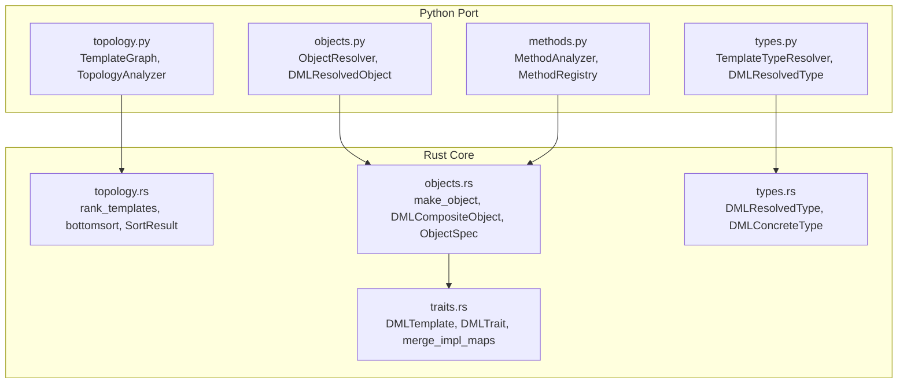
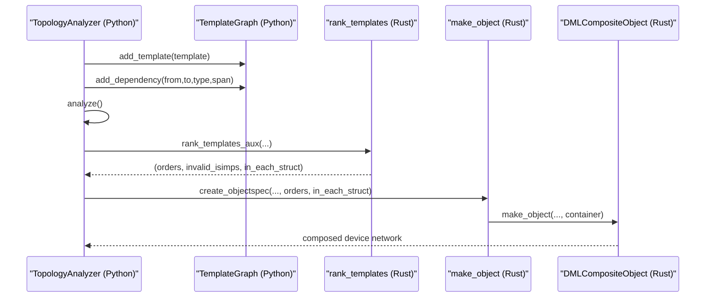
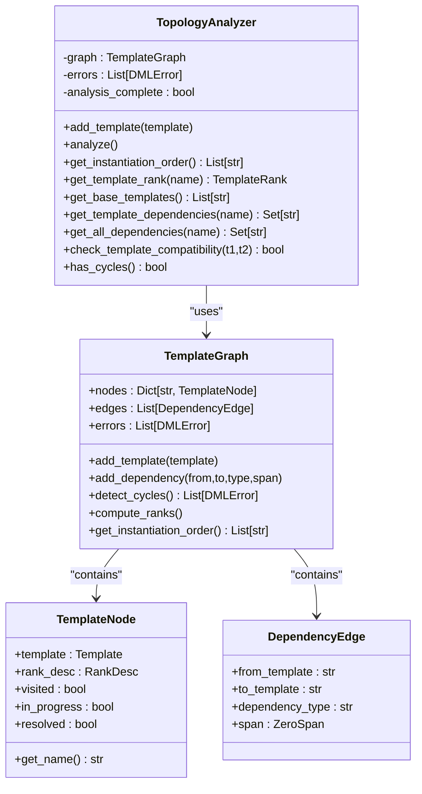
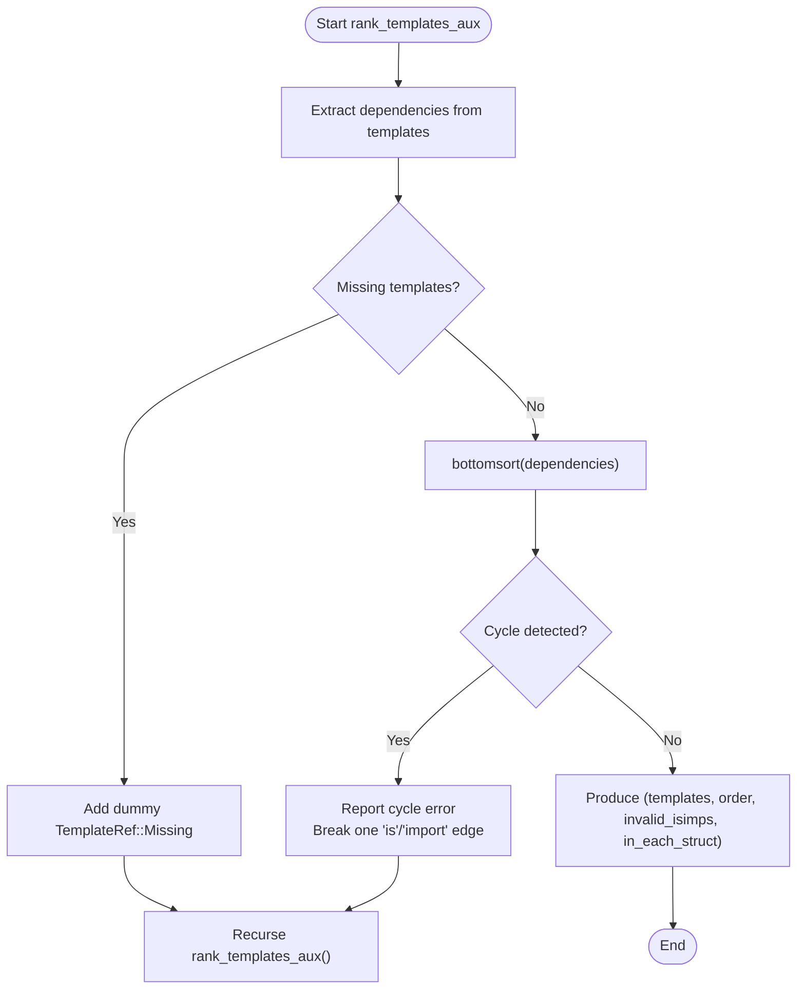
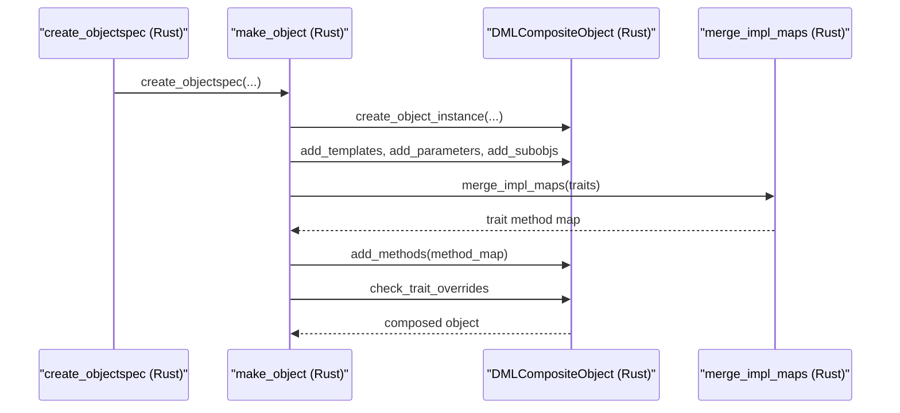
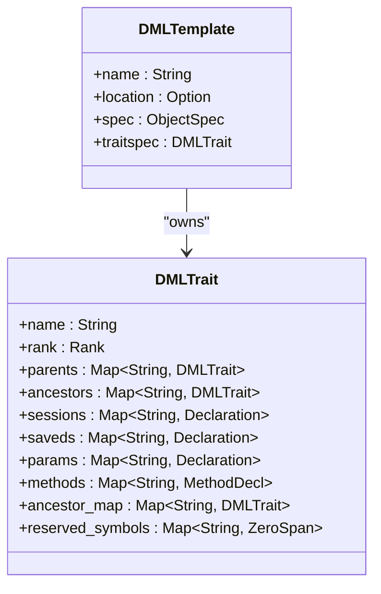
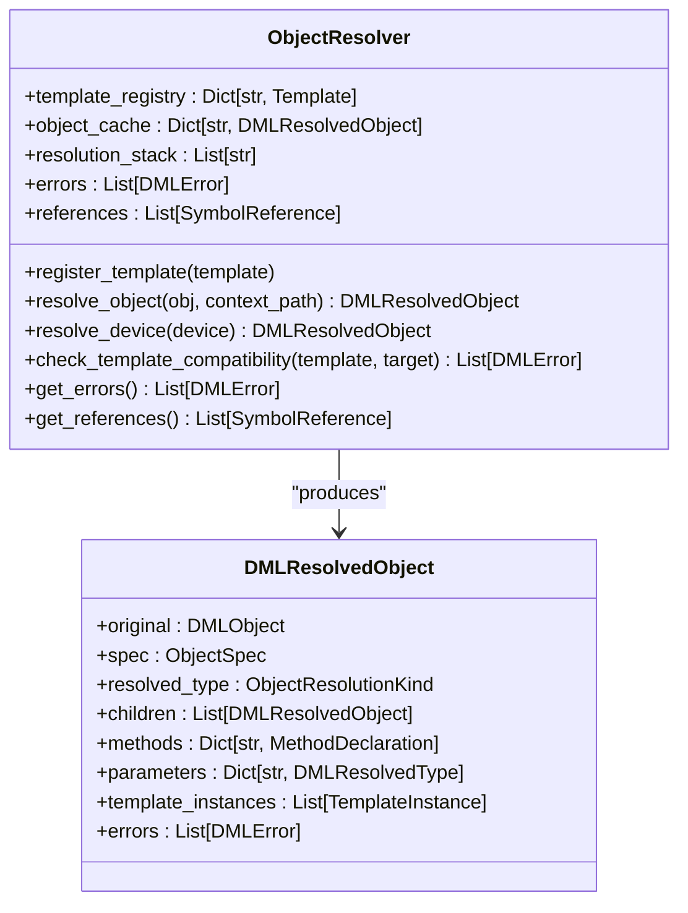
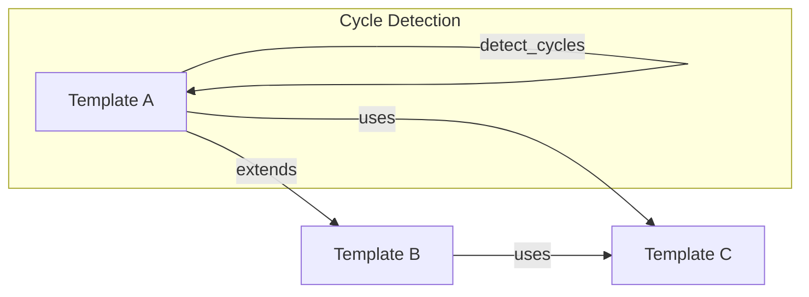

# Template Topology

<cite>
**Referenced Files in This Document**
- [topology.py](file://python-port/dml_language_server/analysis/templating/topology.py)
- [topology.rs](file://src/analysis/templating/topology.rs)
- [objects.rs](file://src/analysis/templating/objects.rs)
- [traits.rs](file://src/analysis/templating/traits.rs)
- [types.rs](file://src/analysis/templating/types.rs)
- [objects.py](file://python-port/dml_language_server/analysis/templating/objects.py)
- [methods.py](file://python-port/dml_language_server/analysis/templating/methods.py)
- [types.py](file://python-port/dml_language_server/analysis/templating/types.py)
- [mod.rs](file://src/analysis/templating/mod.rs)
- [__init__.py](file://python-port/dml_language_server/analysis/templating/__init__.py)
</cite>

## Table of Contents
1. [Introduction](#introduction)
2. [Project Structure](#project-structure)
3. [Core Components](#core-components)
4. [Architecture Overview](#architecture-overview)
5. [Detailed Component Analysis](#detailed-component-analysis)
6. [Dependency Analysis](#dependency-analysis)
7. [Performance Considerations](#performance-considerations)
8. [Troubleshooting Guide](#troubleshooting-guide)
9. [Conclusion](#conclusion)

## Introduction
This document explains template topology analysis and device network construction in the DML language server. It covers:
- Topology resolution algorithms for template hierarchies
- Device interconnection analysis and hierarchical network building
- Topology validation, dependency resolution, and circular dependency detection
- Examples of topology instantiation workflows and device connection analysis
- Relationship between template topology and device networks
- Performance considerations and debugging techniques

## Project Structure
The template topology system spans both Python and Rust implementations. The Python port mirrors the Rust core and provides a high-level interface for analysis and validation.

**Diagram sources**
- [topology.py](file://python-port/dml_language_server/analysis/templating/topology.py#L78-L268)
- [topology.rs](file://src/analysis/templating/topology.rs#L472-L730)
- [objects.py](file://python-port/dml_language_server/analysis/templating/objects.py#L217-L375)
- [objects.rs](file://src/analysis/templating/objects.rs#L2174-L2245)
- [traits.rs](file://src/analysis/templating/traits.rs#L626-L677)
- [types.py](file://python-port/dml_language_server/analysis/templating/types.py#L150-L242)
- [types.rs](file://src/analysis/templating/types.rs#L45-L93)

**Section sources**
- [mod.rs](file://src/analysis/templating/mod.rs#L1-L31)
- [__init__.py](file://python-port/dml_language_server/analysis/templating/__init__.py#L1-L61)

## Core Components
- TemplateGraph and TopologyAnalyzer (Python): Build a dependency graph from template applications and extract edges, compute ranks, and produce instantiation order. Detects cycles and reports errors.
- rank_templates and bottomsort (Rust): Performs dependency extraction, missing template handling, cycle detection, and produces a sorted order for template instantiation.
- ObjectSpec and DMLCompositeObject (Rust): Represent the structured device network built from templates, including parameters, methods, constants, sessions/saveds, and subobjects.
- DMLTemplate/DMLTrait (Rust): Encapsulate template specifications and trait implementations, enabling method override resolution and trait merging.
- ObjectResolver (Python): Resolves DML objects with template applications, detects circular dependencies, and merges template contributions.

**Section sources**
- [topology.py](file://python-port/dml_language_server/analysis/templating/topology.py#L78-L268)
- [topology.rs](file://src/analysis/templating/topology.rs#L472-L730)
- [objects.rs](file://src/analysis/templating/objects.rs#L46-L106)
- [traits.rs](file://src/analysis/templating/traits.rs#L626-L677)
- [objects.py](file://python-port/dml_language_server/analysis/templating/objects.py#L217-L375)

## Architecture Overview
The system orchestrates topology analysis and device network construction as follows:
- Topology analysis extracts template dependencies and validates acyclicity.
- Templates are ranked and ordered for instantiation.
- ObjectSpec is constructed from template instantiations and imports, aggregating parameters, methods, constants, sessions/saveds, and subobjects.
- DMLCompositeObject composes the device network, applying templates and resolving trait overrides.
- Validation checks name collisions, parameter assignments, and trait method requirements.

**Diagram sources**
- [topology.py](file://python-port/dml_language_server/analysis/templating/topology.py#L270-L398)
- [topology.rs](file://src/analysis/templating/topology.rs#L542-L730)
- [objects.rs](file://src/analysis/templating/objects.rs#L228-L271)
- [objects.rs](file://src/analysis/templating/objects.rs#L2174-L2245)

## Detailed Component Analysis

### Template Topology Resolution (Python)
- TemplateGraph maintains nodes (TemplateNode), edges (DependencyEdge), and collects errors.
- TopologyAnalyzer extracts dependencies from template applications and child objects, computes ranks, and provides instantiation order.
- Circular dependency detection uses DFS with visited/in-progress states.

**Diagram sources**
- [topology.py](file://python-port/dml_language_server/analysis/templating/topology.py#L78-L268)
- [topology.py](file://python-port/dml_language_server/analysis/templating/topology.py#L270-L398)

**Section sources**
- [topology.py](file://python-port/dml_language_server/analysis/templating/topology.py#L78-L268)
- [topology.py](file://python-port/dml_language_server/analysis/templating/topology.py#L270-L398)

### Template Ranking and Instantiation Order (Rust)
- rank_templates and rank_templates_aux build dependency maps, handle missing templates, and detect cycles.
- bottomsort performs topological sorting and returns either a sorted order or a cycle.
- create_objectspec constructs ObjectSpec with ranks derived from template dependencies and in_each structures.

**Diagram sources**
- [topology.rs](file://src/analysis/templating/topology.rs#L542-L730)
- [topology.rs](file://src/analysis/templating/topology.rs#L777-L793)

**Section sources**
- [topology.rs](file://src/analysis/templating/topology.rs#L472-L730)
- [topology.rs](file://src/analysis/templating/topology.rs#L777-L793)

### Device Network Construction (Rust)
- ObjectSpec aggregates template instantiations, imports, parameters, constants, methods, hooks, and subobjects.
- make_object composes DMLCompositeObject, merges parameters and subobjects, adds templates, sessions/saveds, constants, and methods, resolves trait overrides, and enforces invariants.

**Diagram sources**
- [objects.rs](file://src/analysis/templating/objects.rs#L228-L271)
- [objects.rs](file://src/analysis/templating/objects.rs#L2174-L2245)
- [traits.rs](file://src/analysis/templating/traits.rs#L500-L624)

**Section sources**
- [objects.rs](file://src/analysis/templating/objects.rs#L46-L106)
- [objects.rs](file://src/analysis/templating/objects.rs#L2174-L2245)
- [traits.rs](file://src/analysis/templating/traits.rs#L500-L624)

### Template and Trait Integration (Rust)
- DMLTemplate encapsulates ObjectSpec and DMLTrait, enabling method override resolution and trait merging.
- DMLTrait stores parent/ancestor relationships, method/session/saved/param sets, and reserved symbols.

**Diagram sources**
- [traits.rs](file://src/analysis/templating/traits.rs#L626-L677)
- [traits.rs](file://src/analysis/templating/traits.rs#L29-L61)

**Section sources**
- [traits.rs](file://src/analysis/templating/traits.rs#L626-L677)
- [traits.rs](file://src/analysis/templating/traits.rs#L29-L61)

### Object Resolution and Device Building (Python)
- ObjectResolver registers templates, resolves objects with template applications, detects circular dependencies, and merges template contributions into DMLResolvedObject.
- Provides helpers to create device specifications and resolved objects.

**Diagram sources**
- [objects.py](file://python-port/dml_language_server/analysis/templating/objects.py#L217-L375)

**Section sources**
- [objects.py](file://python-port/dml_language_server/analysis/templating/objects.py#L217-L375)

### Method and Type Systems (Python)
- MethodAnalyzer and MethodRegistry manage method signatures, overloads, and compatibility checks.
- TemplateTypeResolver and TemplateTypeChecker handle type resolution and compatibility.

**Section sources**
- [methods.py](file://python-port/dml_language_server/analysis/templating/methods.py#L242-L375)
- [types.py](file://python-port/dml_language_server/analysis/templating/types.py#L150-L242)

## Dependency Analysis
- TemplateGraph edges represent template dependencies (extends/uses). Cycles are detected via DFS traversal.
- rank_templates builds a dependency map from template instantiations and imports, handling missing templates and breaking cycles by ignoring selected is/import edges.
- ObjectSpec aggregation ensures that template instantiations and imports contribute to the final device network.

**Diagram sources**
- [topology.py](file://python-port/dml_language_server/analysis/templating/topology.py#L140-L183)
- [topology.rs](file://src/analysis/templating/topology.rs#L621-L684)

**Section sources**
- [topology.py](file://python-port/dml_language_server/analysis/templating/topology.py#L140-L183)
- [topology.rs](file://src/analysis/templating/topology.rs#L621-L684)

## Performance Considerations
- Topological sorting and cycle detection operate on the template dependency graph. For large template hierarchies, prefer Kahn’s algorithm with priority queues to minimize repeated traversals.
- ObjectSpec construction and DMLCompositeObject composition scale with the number of templates and subobjects. Cache intermediate results (e.g., template specs) to avoid recomputation.
- Trait merging and method override resolution can be expensive; maintain efficient maps and avoid redundant checks.

[No sources needed since this section provides general guidance]

## Troubleshooting Guide
Common issues and resolutions:
- Duplicate template names: Reported as duplicate symbol errors during graph construction.
- Unknown template dependencies: Errors recorded when adding dependencies to non-existent templates.
- Circular dependencies: Detected via DFS; the system reports the cycle and breaks one dependency edge to continue analysis.
- Missing template definitions: rank_templates adds dummy entries for missing templates and recurses until all dependencies are satisfied or cycles are confirmed.
- Name collisions and parameter conflicts: Reported during symbol collection and parameter resolution in make_object.
- Trait method overrides: Conflicting or invalid overrides are reported with related spans pointing to conflicting declarations.

**Section sources**
- [topology.py](file://python-port/dml_language_server/analysis/templating/topology.py#L91-L122)
- [topology.rs](file://src/analysis/templating/topology.rs#L570-L614)
- [objects.rs](file://src/analysis/templating/objects.rs#L1615-L1627)
- [objects.rs](file://src/analysis/templating/objects.rs#L1212-L1316)

## Conclusion
The template topology system provides robust dependency analysis, cycle detection, and hierarchical instantiation for DML template-driven device networks. The Python port mirrors the Rust core, enabling high-level analysis and validation, while the Rust implementation delivers efficient construction of ObjectSpec and DMLCompositeObject. Together, they ensure accurate topology validation, reliable device interconnection, and scalable performance for large template hierarchies.