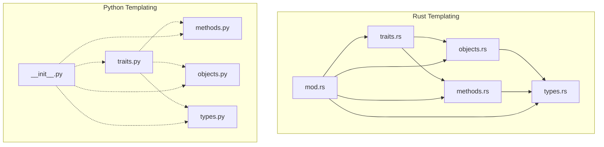
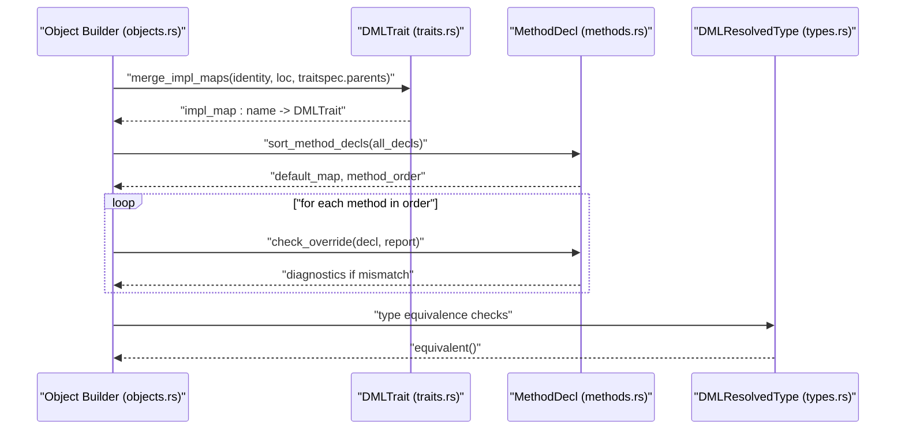
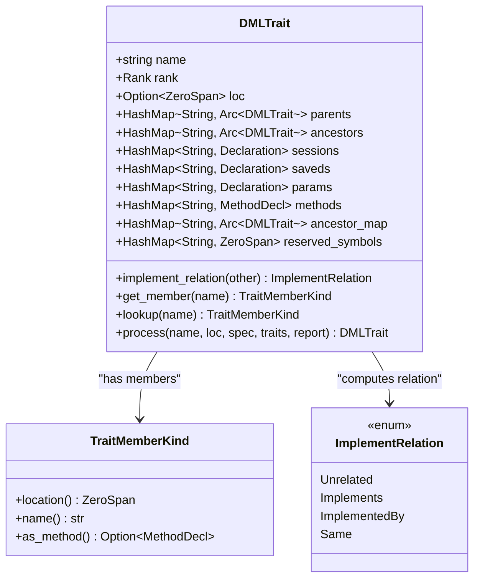
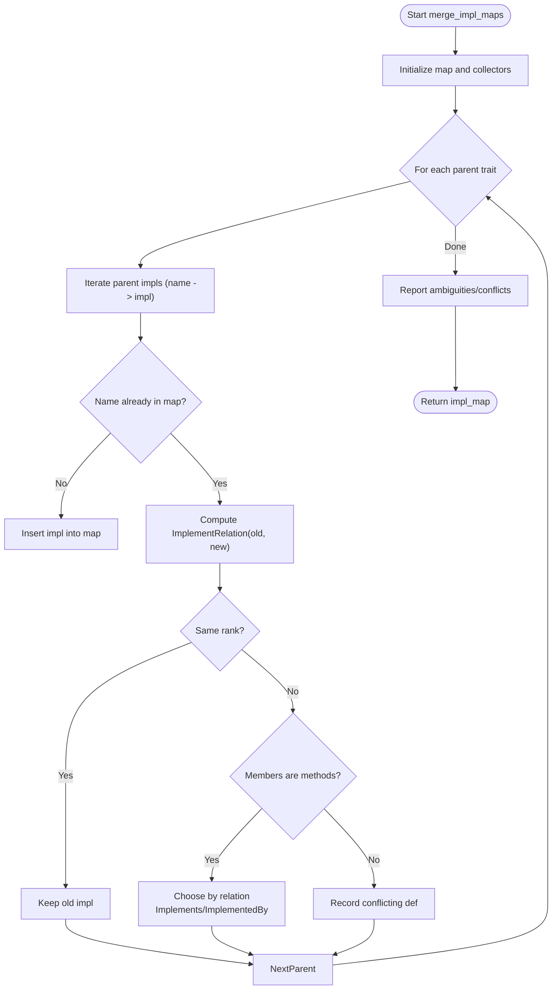
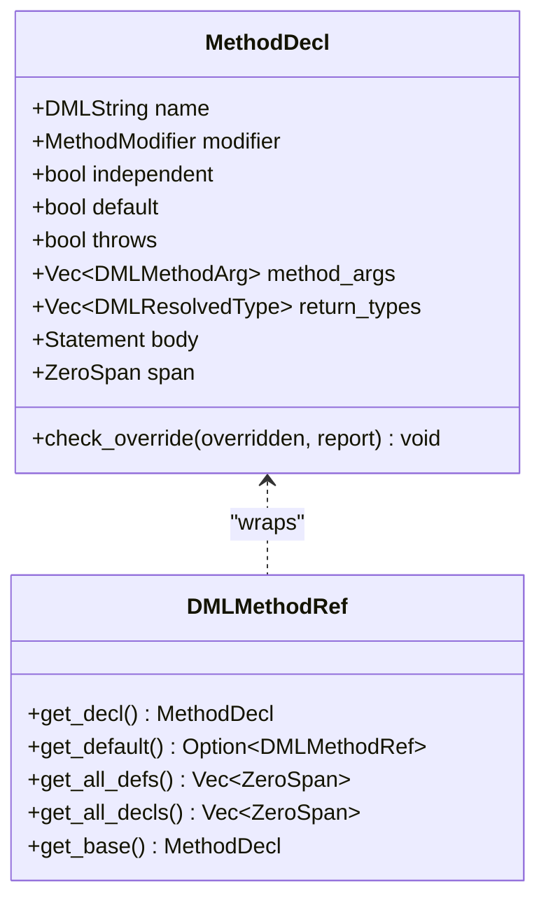
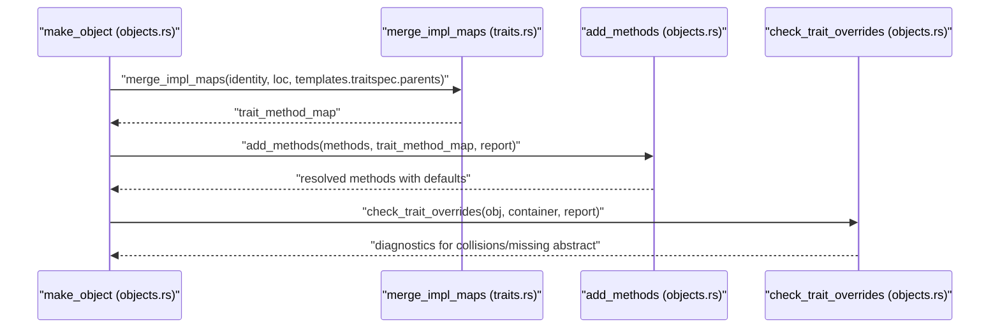
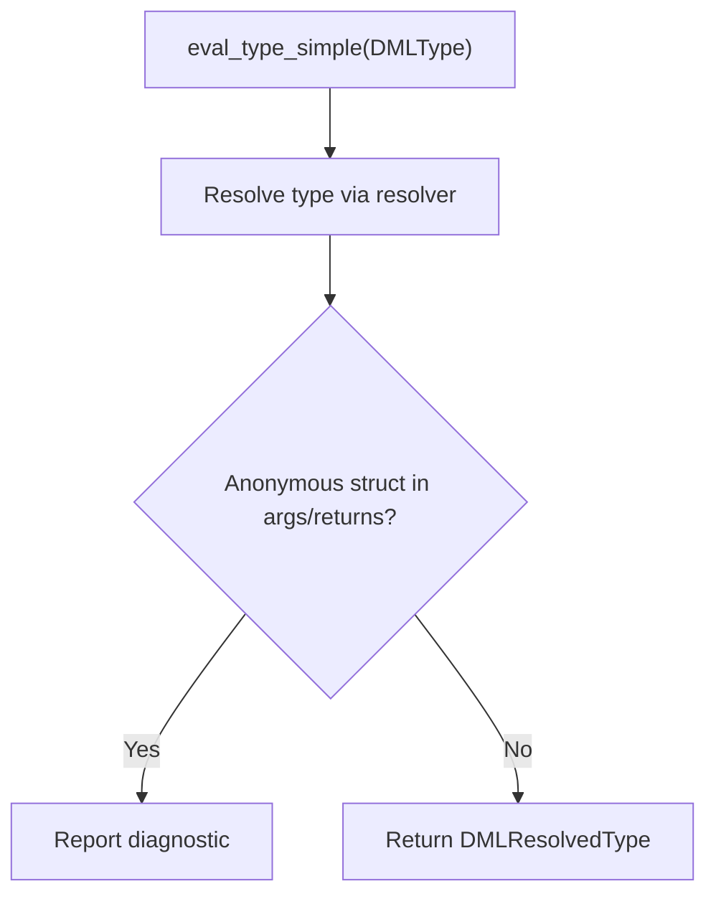
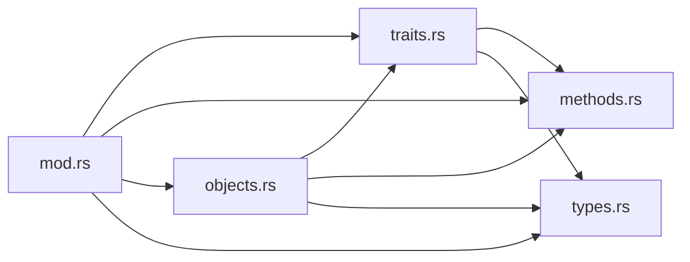

# Template Traits

<cite>
**Referenced Files in This Document**
- [traits.rs](file://src/analysis/templating/traits.rs)
- [methods.rs](file://src/analysis/templating/methods.rs)
- [objects.rs](file://src/analysis/templating/objects.rs)
- [types.rs](file://src/analysis/templating/types.rs)
- [mod.rs](file://src/analysis/templating/mod.rs)
- [traits.py](file://python-port/dml_language_server/analysis/templating/traits.py)
- [methods.py](file://python-port/dml_language_server/analysis/templating/methods.py)
- [objects.py](file://python-port/dml_language_server/analysis/templating/objects.py)
- [types.py](file://python-port/dml_language_server/analysis/templating/types.py)
- [__init__.py](file://python-port/dml_language_server/analysis/templating/__init__.py)
</cite>

## Table of Contents
1. [Introduction](#introduction)
2. [Project Structure](#project-structure)
3. [Core Components](#core-components)
4. [Architecture Overview](#architecture-overview)
5. [Detailed Component Analysis](#detailed-component-analysis)
6. [Dependency Analysis](#dependency-analysis)
7. [Performance Considerations](#performance-considerations)
8. [Troubleshooting Guide](#troubleshooting-guide)
9. [Conclusion](#conclusion)

## Introduction
This document explains template trait resolution and implementation analysis in the DML language server. It covers how traits are modeled, how template constraints are enforced, how trait inheritance and method overrides are validated, and how conflicts are resolved. It also compares the Rust and Python implementations and provides debugging techniques and performance considerations.

## Project Structure
The template trait system spans both the Rust backend and a Python port. The Rust implementation resides under src/analysis/templating and includes modules for traits, methods, objects, and types. The Python port mirrors the Rust semantics under python-port/dml_language_server/analysis/templating.

**Diagram sources**
- [traits.rs](file://src/analysis/templating/traits.rs#L1-L677)
- [methods.rs](file://src/analysis/templating/methods.rs#L1-L491)
- [objects.rs](file://src/analysis/templating/objects.rs#L1-L2246)
- [types.rs](file://src/analysis/templating/types.rs#L1-L93)
- [mod.rs](file://src/analysis/templating/mod.rs#L1-L31)
- [traits.py](file://python-port/dml_language_server/analysis/templating/traits.py#L1-L372)
- [methods.py](file://python-port/dml_language_server/analysis/templating/methods.py#L1-L423)
- [objects.py](file://python-port/dml_language_server/analysis/templating/objects.py#L1-L407)
- [types.py](file://python-port/dml_language_server/analysis/templating/types.py#L1-L357)
- [__init__.py](file://python-port/dml_language_server/analysis/templating/__init__.py#L1-L61)

**Section sources**
- [traits.rs](file://src/analysis/templating/traits.rs#L1-L677)
- [methods.rs](file://src/analysis/templating/methods.rs#L1-L491)
- [objects.rs](file://src/analysis/templating/objects.rs#L1-L2246)
- [types.rs](file://src/analysis/templating/types.rs#L1-L93)
- [mod.rs](file://src/analysis/templating/mod.rs#L1-L31)
- [traits.py](file://python-port/dml_language_server/analysis/templating/traits.py#L1-L372)
- [methods.py](file://python-port/dml_language_server/analysis/templating/methods.py#L1-L423)
- [objects.py](file://python-port/dml_language_server/analysis/templating/objects.py#L1-L407)
- [types.py](file://python-port/dml_language_server/analysis/templating/types.py#L1-L357)
- [__init__.py](file://python-port/dml_language_server/analysis/templating/__init__.py#L1-L61)

## Core Components
- DMLTrait: Defines a trait’s name, rank, inheritance (parents/ancestors), and member maps (sessions, saveds, params, methods). It exposes lookups for members and trait relations.
- DMLTemplate: Associates a template name, location, ObjectSpec, and its computed DMLTrait.
- TemplateTraitInfo: Aggregates template and trait registries for cross-references.
- TraitMemberKind: Discriminates between session, saved, parameter, and method members for unified handling.
- MethodDecl and DMLMethodRef: Represent method declarations and references, including shared methods and concrete overrides.
- DMLResolvedType and type evaluation: Provides type resolution and equivalence checks used in trait and method validation.

Key behaviors:
- Trait merging and conflict detection via merge_impl_maps.
- Trait inheritance and relation computation (Implements/ImplementedBy/Same/Unrelated).
- Method override validation and shared method handling.
- Reserved symbol tracking for template-defined symbols not present in the trait.

**Section sources**
- [traits.rs](file://src/analysis/templating/traits.rs#L29-L148)
- [traits.rs](file://src/analysis/templating/traits.rs#L150-L498)
- [traits.rs](file://src/analysis/templating/traits.rs#L500-L624)
- [methods.rs](file://src/analysis/templating/methods.rs#L117-L288)
- [methods.rs](file://src/analysis/templating/methods.rs#L289-L491)
- [types.rs](file://src/analysis/templating/types.rs#L46-L93)
- [mod.rs](file://src/analysis/templating/mod.rs#L14-L31)

## Architecture Overview
The template trait system integrates trait modeling with object composition and method resolution. At object construction time, templates are applied, and their traits are merged to compute a trait method map. Method overrides are validated, and trait constraints are enforced.

**Diagram sources**
- [objects.rs](file://src/analysis/templating/objects.rs#L2234-L2242)
- [traits.rs](file://src/analysis/templating/traits.rs#L500-L624)
- [methods.rs](file://src/analysis/templating/methods.rs#L178-L252)
- [types.rs](file://src/analysis/templating/types.rs#L61-L72)

## Detailed Component Analysis

### Trait Model and Inheritance
- DMLTrait stores:
  - name, rank, optional location
  - parents and ancestors maps
  - member maps: sessions, saveds, params, methods
  - ancestor_map: maps symbol names to the ancestor that defines them
  - reserved_symbols: symbols defined in the template but not in the trait
- TraitMemberKind unifies member accessors and kinds.
- ImplementRelation determines trait hierarchy relationships.

Trait processing:
- Parents and ancestors are derived from ObjectSpec instantiations.
- Implementation maps are merged across parents to detect ambiguities and conflicts.
- Overrides are validated against ancestor definitions.

**Diagram sources**
- [traits.rs](file://src/analysis/templating/traits.rs#L29-L148)
- [traits.rs](file://src/analysis/templating/traits.rs#L150-L227)

**Section sources**
- [traits.rs](file://src/analysis/templating/traits.rs#L29-L148)
- [traits.rs](file://src/analysis/templating/traits.rs#L150-L227)

### Trait Merging and Conflict Resolution
merge_impl_maps computes a single implementation map from parents:
- Iterates over parent implementations and inserts/updates entries.
- Uses ImplementRelation to decide precedence or mark ambiguous/conflicting names.
- Reports diagnostics for ambiguous methods and conflicting non-method members.

**Diagram sources**
- [traits.rs](file://src/analysis/templating/traits.rs#L500-L624)

**Section sources**
- [traits.rs](file://src/analysis/templating/traits.rs#L500-L624)

### Method Resolution and Override Validation
MethodDecl encapsulates method metadata and provides check_override to validate:
- Throws compatibility
- Argument count/type compatibility
- Return type compatibility

DMLMethodRef bridges shared trait methods and concrete methods, enabling default chaining and abstract/override checks.

**Diagram sources**
- [methods.rs](file://src/analysis/templating/methods.rs#L117-L288)
- [methods.rs](file://src/analysis/templating/methods.rs#L289-L491)

**Section sources**
- [methods.rs](file://src/analysis/templating/methods.rs#L117-L288)
- [methods.rs](file://src/analysis/templating/methods.rs#L289-L491)

### Object Composition and Trait Application
During object construction:
- Templates are gathered and their traits merged to form a trait method map.
- Methods are sorted by rank and default relationships, then validated for overrides.
- Trait constraints are checked: name collisions, kind mismatches, and abstract method requirements.

**Diagram sources**
- [objects.rs](file://src/analysis/templating/objects.rs#L2234-L2242)
- [traits.rs](file://src/analysis/templating/traits.rs#L500-L624)
- [objects.rs](file://src/analysis/templating/objects.rs#L1834-L1941)
- [objects.rs](file://src/analysis/templating/objects.rs#L1943-L2042)

**Section sources**
- [objects.rs](file://src/analysis/templating/objects.rs#L2234-L2242)
- [objects.rs](file://src/analysis/templating/objects.rs#L1834-L1941)
- [objects.rs](file://src/analysis/templating/objects.rs#L1943-L2042)

### Template Constraints and Type Checking
- DMLResolvedType supports equivalence checks used in method override validation.
- eval_type_simple resolves types from DMLType, reporting diagnostics for anonymous struct types in arguments/returns.

**Diagram sources**
- [types.rs](file://src/analysis/templating/types.rs#L89-L93)
- [methods.rs](file://src/analysis/templating/methods.rs#L62-L115)

**Section sources**
- [types.rs](file://src/analysis/templating/types.rs#L46-L93)
- [methods.rs](file://src/analysis/templating/methods.rs#L62-L115)

### Relationship Between Template Traits and Regular Traits (Python Port)
The Python port models traits conceptually with TraitDefinition, TraitRequirement, TraitImplementation, and TraitResolver. It includes:
- Trait kinds (interface, mixin, constraint, protocol)
- Requirement matching and completeness checks
- Supertrait hierarchy resolution
- Trait compatibility checks

While the Rust implementation focuses on template-driven trait merging and method override resolution, the Python port emphasizes trait definition and application to objects.

**Section sources**
- [traits.py](file://python-port/dml_language_server/analysis/templating/traits.py#L25-L95)
- [traits.py](file://python-port/dml_language_server/analysis/templating/traits.py#L180-L335)

## Dependency Analysis
- traits.rs depends on methods.rs for MethodDecl and on types.rs for DMLResolvedType.
- objects.rs orchestrates trait merging and method addition, linking to traits.rs and methods.rs.
- mod.rs re-exports core templating types and declarations.

**Diagram sources**
- [traits.rs](file://src/analysis/templating/traits.rs#L1-L677)
- [methods.rs](file://src/analysis/templating/methods.rs#L1-L491)
- [objects.rs](file://src/analysis/templating/objects.rs#L1-L2246)
- [types.rs](file://src/analysis/templating/types.rs#L1-L93)
- [mod.rs](file://src/analysis/templating/mod.rs#L1-L31)

**Section sources**
- [traits.rs](file://src/analysis/templating/traits.rs#L1-L677)
- [methods.rs](file://src/analysis/templating/methods.rs#L1-L491)
- [objects.rs](file://src/analysis/templating/objects.rs#L1-L2246)
- [types.rs](file://src/analysis/templating/types.rs#L1-L93)
- [mod.rs](file://src/analysis/templating/mod.rs#L1-L31)

## Performance Considerations
- Trait merging complexity scales with the number of parents and members; prefer minimizing redundant trait instantiations.
- Method sorting and default resolution rely on topological sorting over method ranks; keep template hierarchies shallow to reduce overhead.
- Type equivalence checks are used broadly; caching resolved types can reduce repeated evaluations.
- Diagnostic reporting can be expensive; batch diagnostics and avoid redundant checks where possible.

## Troubleshooting Guide
Common issues and resolutions:
- Ambiguous method definitions across traits: The merger reports diagnostics indicating conflicting definitions and suggests uncertain inheritance order. Review trait hierarchy and remove duplicates or clarify precedence.
- Name collisions on sessions/saveds/parameters: Diagnostics indicate previous definitions; rename or reconcile definitions.
- Abstract method not implemented: When instantiating a template, missing abstract methods trigger errors; implement the required methods or mark them as concrete.
- Override compatibility failures: check_override reports mismatches in throws, argument counts/types, or return types; align signatures with the overridden method.
- Anonymous struct types in method arguments/returns: Diagnostics are raised; refactor to named types or adjust method signatures.

Debugging tips:
- Enable trace logs to inspect trait merging and method sorting steps.
- Verify trait relations (Implements/ImplementedBy/Same/Unrelated) to confirm inheritance correctness.
- Validate type equivalence checks for method signatures and return types.

**Section sources**
- [traits.rs](file://src/analysis/templating/traits.rs#L581-L621)
- [traits.rs](file://src/analysis/templating/traits.rs#L603-L621)
- [objects.rs](file://src/analysis/templating/objects.rs#L1949-L2042)
- [methods.rs](file://src/analysis/templating/methods.rs#L178-L252)

## Conclusion
The template trait system combines trait modeling, inheritance, and method override validation with robust conflict detection. The Rust implementation provides precise trait merging and method resolution, while the Python port offers complementary trait definition and application semantics. Together, they support reliable template-driven trait resolution, constraint enforcement, and trait inheritance validation.