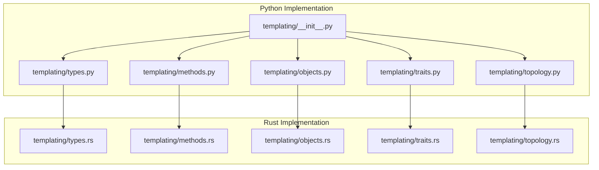
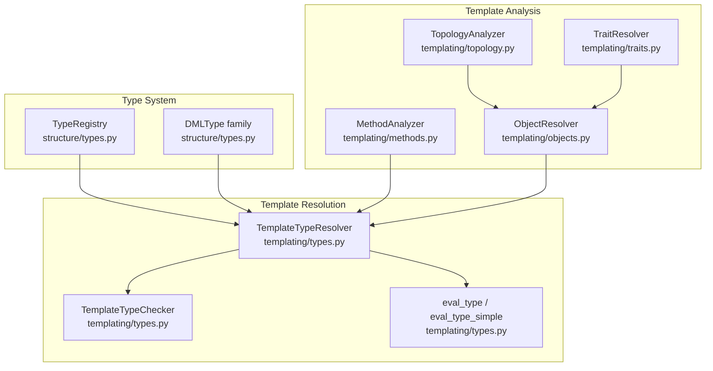
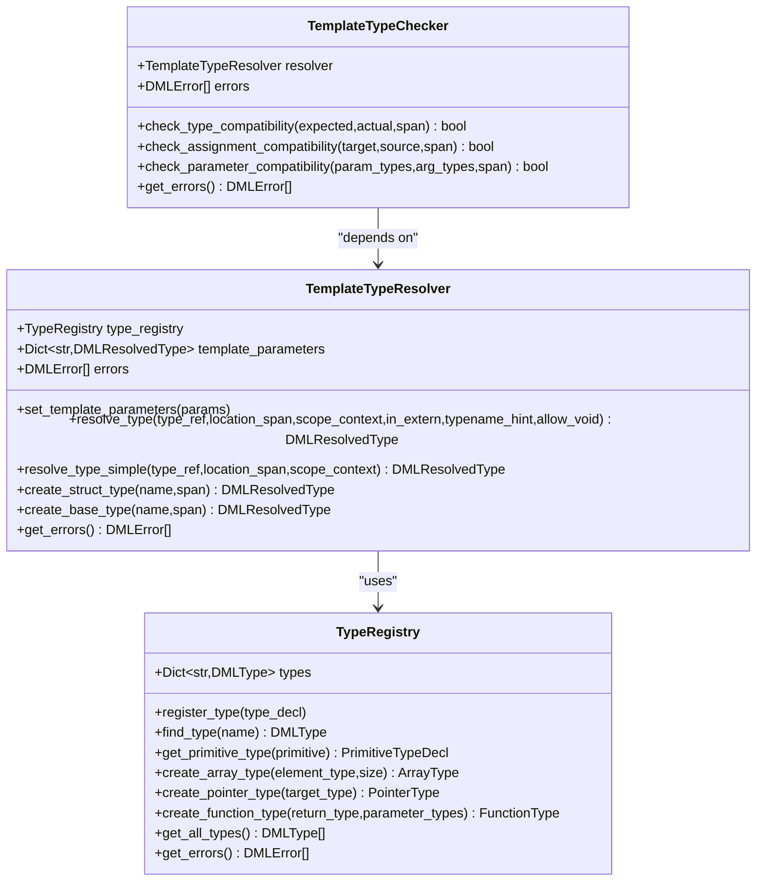
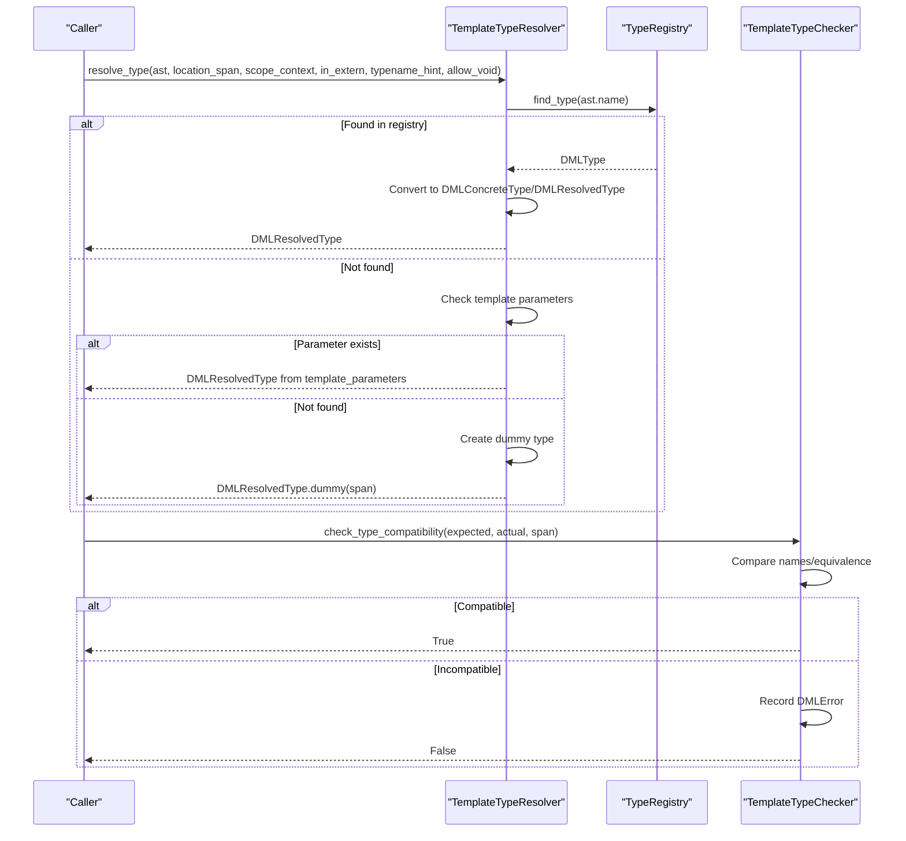
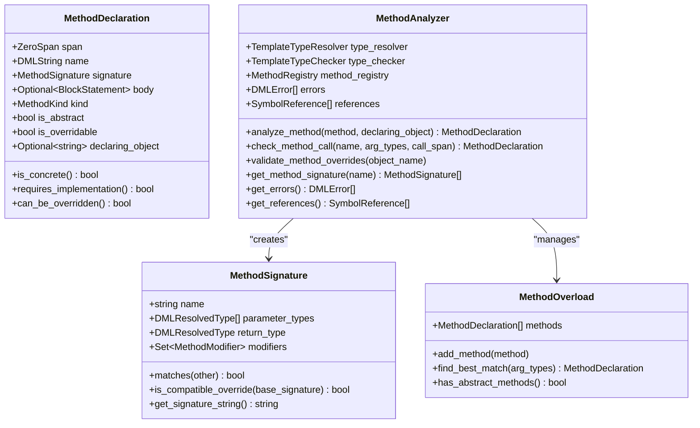
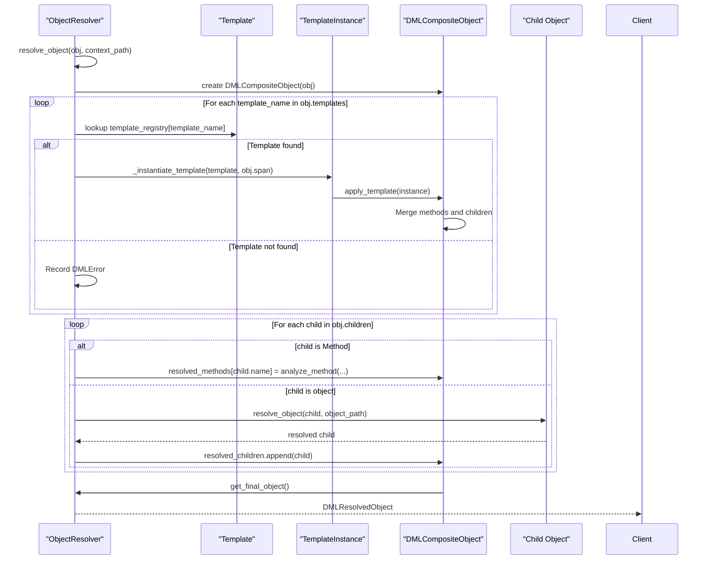
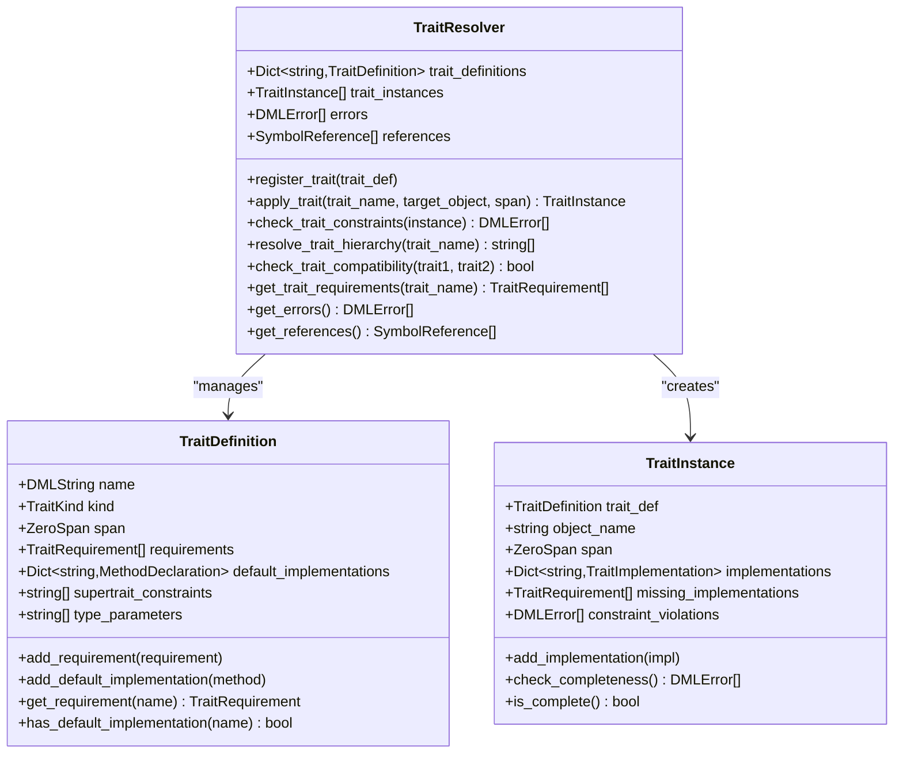
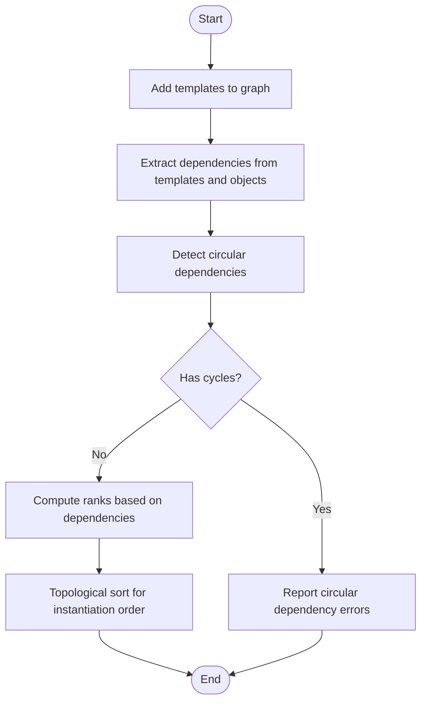
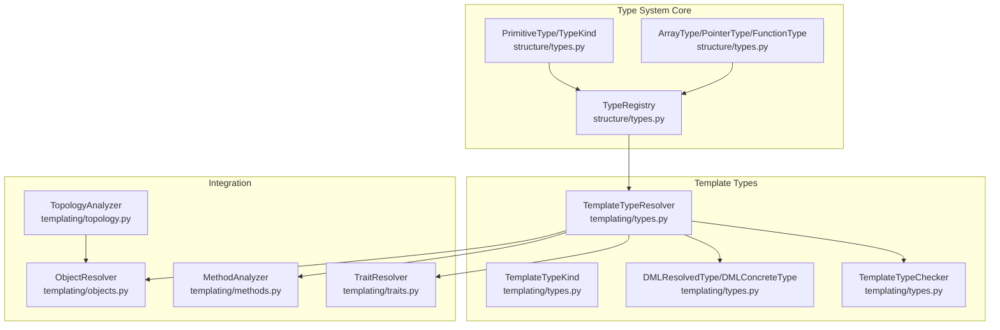

# Template Types

<cite>
**Referenced Files in This Document**
- [types.py](file://python-port/dml_language_server/analysis/templating/types.py)
- [types.rs](file://src/analysis/templating/types.rs)
- [types.py](file://python-port/dml_language_server/analysis/structure/types.py)
- [types.rs](file://src/analysis/structure/types.rs)
- [methods.py](file://python-port/dml_language_server/analysis/templating/methods.py)
- [methods.rs](file://src/analysis/templating/methods.rs)
- [objects.py](file://python-port/dml_language_server/analysis/templating/objects.py)
- [objects.rs](file://src/analysis/templating/objects.rs)
- [traits.py](file://python-port/dml_language_server/analysis/templating/traits.py)
- [traits.rs](file://src/analysis/templating/traits.rs)
- [topology.py](file://python-port/dml_language_server/analysis/templating/topology.py)
- [topology.rs](file://src/analysis/templating/topology.rs)
- [__init__.py](file://python-port/dml_language_server/analysis/templating/__init__.py)
</cite>

## Table of Contents
1. [Introduction](#introduction)
2. [Project Structure](#project-structure)
3. [Core Components](#core-components)
4. [Architecture Overview](#architecture-overview)
5. [Detailed Component Analysis](#detailed-component-analysis)
6. [Dependency Analysis](#dependency-analysis)
7. [Performance Considerations](#performance-considerations)
8. [Troubleshooting Guide](#troubleshooting-guide)
9. [Conclusion](#conclusion)

## Introduction
This document explains template type resolution and type system integration in the DML language server. It focuses on how template types are represented, instantiated, and validated, how generic type parameters are bound, and how type constraints are enforced for templated constructs. It also covers type resolution processes, compatibility checks, and inference for template parameters, with concrete examples and diagrams that map to the actual Python and Rust implementations.

## Project Structure
The template type system spans both Python and Rust implementations:
- Python port: analysis/templating/* provides Python equivalents of the Rust modules, including type resolution, method analysis, object resolution, traits, and topology.
- Rust implementation: src/analysis/templating/* provides the canonical implementation of template analysis, including types, methods, objects, traits, and topology.

**Diagram sources**
- [types.py](file://python-port/dml_language_server/analysis/templating/types.py#L1-L357)
- [types.rs](file://src/analysis/templating/types.rs#L1-L93)
- [methods.py](file://python-port/dml_language_server/analysis/templating/methods.py#L1-L423)
- [methods.rs](file://src/analysis/templating/methods.rs#L1-L491)
- [objects.py](file://python-port/dml_language_server/analysis/templating/objects.py#L1-L407)
- [objects.rs](file://src/analysis/templating/objects.rs#L1-L800)
- [traits.py](file://python-port/dml_language_server/analysis/templating/traits.py#L1-L372)
- [traits.rs](file://src/analysis/templating/traits.rs#L1-L677)
- [topology.py](file://python-port/dml_language_server/analysis/templating/topology.py#L1-L450)
- [topology.rs](file://src/analysis/templating/topology.rs#L1-L853)

**Section sources**
- [__init__.py](file://python-port/dml_language_server/analysis/templating/__init__.py#L1-L61)

## Core Components
This section introduces the central types and resolvers used for template type resolution and integration with the broader type system.

- TemplateTypeKind: Enumerates kinds of template types (concrete, abstract, parametric, specialized, resolved, dummy).
- DMLBaseType/DMLStructType/DMLConcreteType/DMLResolvedType: Represent base types, struct types, concrete resolved types, and resolved types (including dummy fallbacks).
- TemplateTypeResolver: Resolves type references to concrete types using a TypeRegistry and template parameters.
- TemplateTypeChecker: Performs compatibility checks between expected and actual types.
- TypeRegistry: Manages built-in and user-defined types and validates type existence.
- DMLType family: Defines the broader type system (primitives, structs, arrays, functions, templates, etc.) used by template resolution.

Key responsibilities:
- Template instantiation: Binding template parameters to concrete types and validating constraints.
- Type compatibility: Ensuring argument and return types match expectations.
- Error handling: Recording diagnostics for undefined symbols, type mismatches, and circular dependencies.

**Section sources**
- [types.py](file://python-port/dml_language_server/analysis/templating/types.py#L21-L357)
- [types.rs](file://src/analysis/templating/types.rs#L8-L93)
- [types.py](file://python-port/dml_language_server/analysis/structure/types.py#L22-L571)
- [types.rs](file://src/analysis/structure/types.rs#L9-L90)

## Architecture Overview
The template type system integrates with the broader type system and analysis pipeline. The following diagram maps the relationships among core modules:

**Diagram sources**
- [types.py](file://python-port/dml_language_server/analysis/structure/types.py#L346-L434)
- [types.py](file://python-port/dml_language_server/analysis/templating/types.py#L150-L357)
- [methods.py](file://python-port/dml_language_server/analysis/templating/methods.py#L242-L374)
- [objects.py](file://python-port/dml_language_server/analysis/templating/objects.py#L217-L375)
- [topology.py](file://python-port/dml_language_server/analysis/templating/topology.py#L270-L398)
- [traits.py](file://python-port/dml_language_server/analysis/templating/traits.py#L180-L335)

## Detailed Component Analysis

### Template Type Resolver and Checker
The resolver and checker coordinate type resolution and compatibility checks for template contexts.

**Diagram sources**
- [types.py](file://python-port/dml_language_server/analysis/templating/types.py#L150-L242)
- [types.py](file://python-port/dml_language_server/analysis/templating/types.py#L244-L298)
- [types.py](file://python-port/dml_language_server/analysis/structure/types.py#L346-L434)

**Section sources**
- [types.py](file://python-port/dml_language_server/analysis/templating/types.py#L150-L242)
- [types.py](file://python-port/dml_language_server/analysis/templating/types.py#L244-L298)
- [types.py](file://python-port/dml_language_server/analysis/structure/types.py#L346-L434)

### Type Evaluation and Compatibility Checking
The evaluation functions convert type ASTs into resolved types and struct dependencies, while the checker enforces compatibility.

**Diagram sources**
- [types.py](file://python-port/dml_language_server/analysis/templating/types.py#L162-L226)
- [types.py](file://python-port/dml_language_server/analysis/templating/types.py#L251-L294)

**Section sources**
- [types.py](file://python-port/dml_language_server/analysis/templating/types.py#L300-L329)
- [types.py](file://python-port/dml_language_server/analysis/templating/types.py#L251-L294)

### Method Signature Resolution and Overload Matching
Methods in templates maintain signatures and support overload resolution and override compatibility checks.

**Diagram sources**
- [methods.py](file://python-port/dml_language_server/analysis/templating/methods.py#L36-L163)
- [methods.py](file://python-port/dml_language_server/analysis/templating/methods.py#L164-L240)
- [methods.py](file://python-port/dml_language_server/analysis/templating/methods.py#L242-L374)

**Section sources**
- [methods.py](file://python-port/dml_language_server/analysis/templating/methods.py#L36-L163)
- [methods.py](file://python-port/dml_language_server/analysis/templating/methods.py#L164-L240)
- [methods.py](file://python-port/dml_language_server/analysis/templating/methods.py#L242-L374)

### Object Resolution and Template Application
Objects in templates are composed by applying templates, merging methods, and resolving child objects.

**Diagram sources**
- [objects.py](file://python-port/dml_language_server/analysis/templating/objects.py#L217-L322)

**Section sources**
- [objects.py](file://python-port/dml_language_server/analysis/templating/objects.py#L217-L322)

### Trait Constraints and Implementation Checking
Traits define requirements and default implementations; instances validate completeness and compatibility.

**Diagram sources**
- [traits.py](file://python-port/dml_language_server/analysis/templating/traits.py#L67-L178)
- [traits.py](file://python-port/dml_language_server/analysis/templating/traits.py#L180-L335)

**Section sources**
- [traits.py](file://python-port/dml_language_server/analysis/templating/traits.py#L67-L178)
- [traits.py](file://python-port/dml_language_server/analysis/templating/traits.py#L180-L335)

### Template Ranking and Dependency Ordering
Topology analysis computes template ranks and ordering to ensure deterministic instantiation.

**Diagram sources**
- [topology.py](file://python-port/dml_language_server/analysis/templating/topology.py#L270-L398)

**Section sources**
- [topology.py](file://python-port/dml_language_server/analysis/templating/topology.py#L270-L398)

## Dependency Analysis
This section examines how template types relate to the broader type system and how dependencies propagate across modules.

**Diagram sources**
- [types.py](file://python-port/dml_language_server/analysis/structure/types.py#L22-L571)
- [types.py](file://python-port/dml_language_server/analysis/templating/types.py#L21-L357)
- [objects.py](file://python-port/dml_language_server/analysis/templating/objects.py#L217-L375)
- [methods.py](file://python-port/dml_language_server/analysis/templating/methods.py#L242-L374)
- [traits.py](file://python-port/dml_language_server/analysis/templating/traits.py#L180-L335)
- [topology.py](file://python-port/dml_language_server/analysis/templating/topology.py#L270-L398)

**Section sources**
- [types.py](file://python-port/dml_language_server/analysis/structure/types.py#L22-L571)
- [types.py](file://python-port/dml_language_server/analysis/templating/types.py#L21-L357)
- [objects.py](file://python-port/dml_language_server/analysis/templating/objects.py#L217-L375)
- [methods.py](file://python-port/dml_language_server/analysis/templating/methods.py#L242-L374)
- [traits.py](file://python-port/dml_language_server/analysis/templating/traits.py#L180-L335)
- [topology.py](file://python-port/dml_language_server/analysis/templating/topology.py#L270-L398)

## Performance Considerations
- Early termination on unknown types: The resolver returns dummy types for undefined symbols to avoid cascading errors and to keep analysis fast.
- Minimal equivalence checks: Compatibility checks rely on name equivalence and dummy-type allowances to reduce overhead.
- Caching in object resolution: ObjectResolver caches resolved objects keyed by path to avoid recomputation.
- Topological sorting: TopologyAnalyzer uses efficient algorithms (DFS-based cycle detection and topological sort) to compute ranks and ordering.
- Lazy trait processing: TraitResolver registers definitions and performs checks on demand to minimize work.

[No sources needed since this section provides general guidance]

## Troubleshooting Guide
Common issues and debugging techniques for template type problems:

- Unknown type or symbol:
  - Symptom: Type resolution returns a dummy type and records an undefined symbol error.
  - Action: Verify the type name exists in the TypeRegistry or is provided via template parameters.
  - Evidence: [types.py](file://python-port/dml_language_server/analysis/templating/types.py#L214-L221)

- Type mismatch:
  - Symptom: Compatibility check fails and records a type error.
  - Action: Ensure argument and return types match expected names or relax constraints intentionally.
  - Evidence: [types.py](file://python-port/dml_language_server/analysis/templating/types.py#L262-L268)

- Circular template dependency:
  - Symptom: Topology analysis reports a cycle and marks templates as incompatible.
  - Action: Break the cycle by adjusting template inheritance or usage.
  - Evidence: [topology.py](file://python-port/dml_language_server/analysis/templating/topology.py#L140-L183)

- Missing trait implementation:
  - Symptom: Trait instance reports missing implementations or constraint violations.
  - Action: Implement required methods/parameters or provide defaults.
  - Evidence: [traits.py](file://python-port/dml_language_server/analysis/templating/traits.py#L157-L174)

- Method override conflicts:
  - Symptom: Overridden method signatures are incompatible.
  - Action: Align parameter types and return types with base signatures.
  - Evidence: [methods.py](file://python-port/dml_language_server/analysis/templating/methods.py#L194-L201)

**Section sources**
- [types.py](file://python-port/dml_language_server/analysis/templating/types.py#L214-L221)
- [types.py](file://python-port/dml_language_server/analysis/templating/types.py#L262-L268)
- [topology.py](file://python-port/dml_language_server/analysis/templating/topology.py#L140-L183)
- [traits.py](file://python-port/dml_language_server/analysis/templating/traits.py#L157-L174)
- [methods.py](file://python-port/dml_language_server/analysis/templating/methods.py#L194-L201)

## Conclusion
The template type system integrates tightly with the broader DML type system to support template instantiation, parameter binding, and constraint validation. The Python and Rust implementations mirror each other closely, ensuring consistent behavior across platforms. By leveraging resolvers, checkers, analyzers, and topology tools, the system provides robust type resolution, compatibility enforcement, and error reporting for templated constructs.