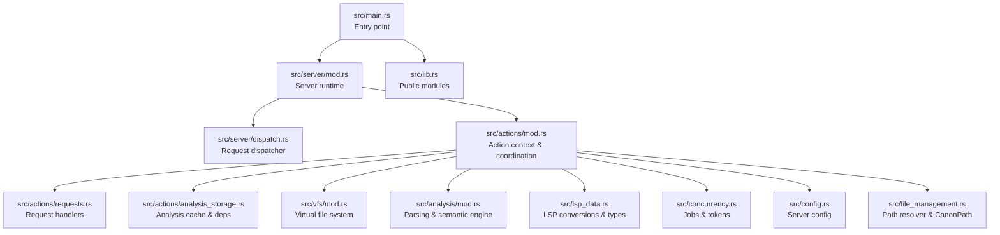
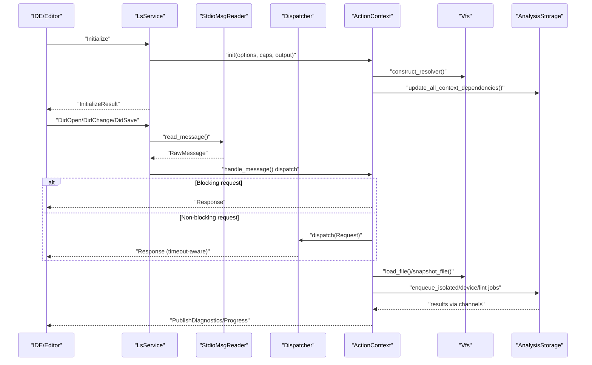
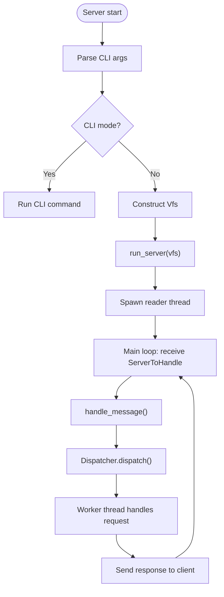
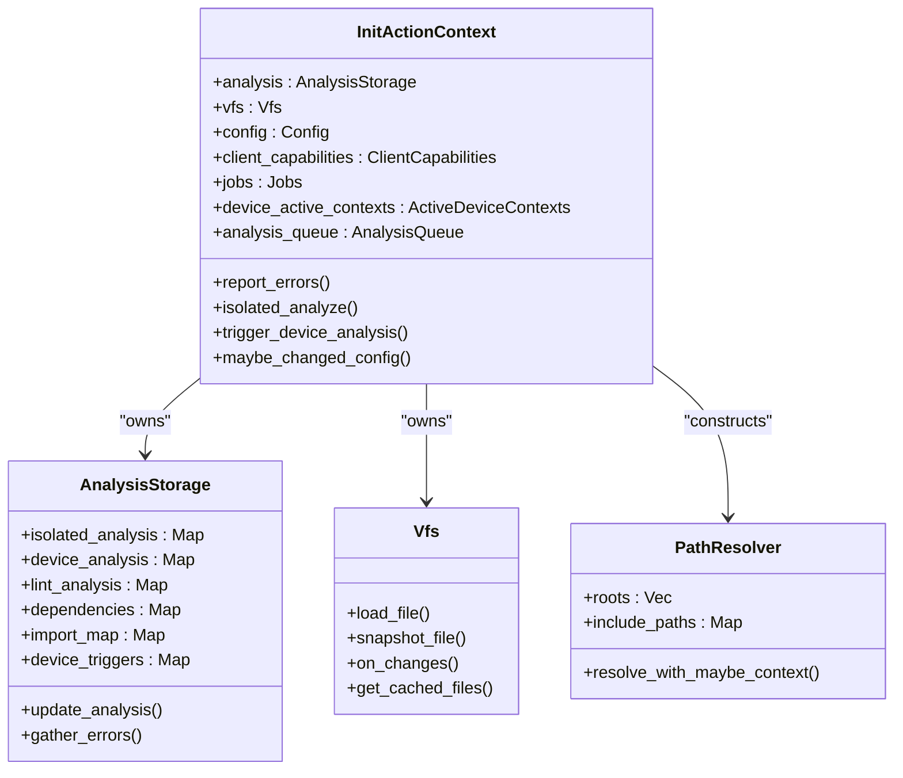
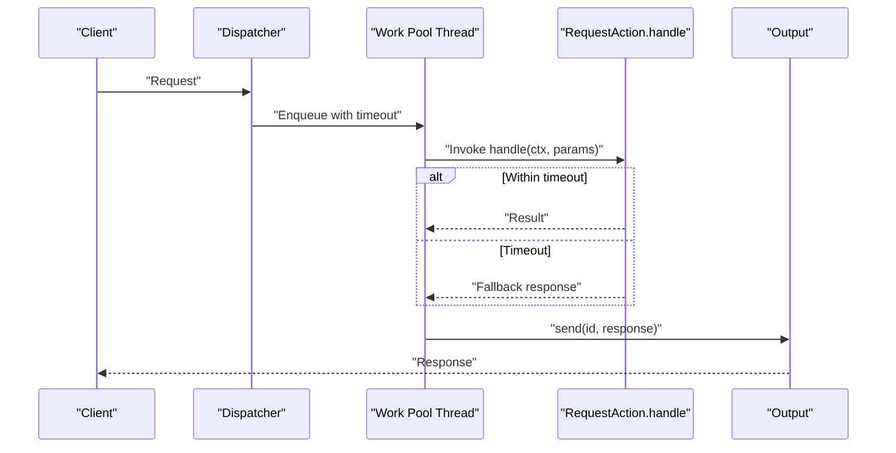
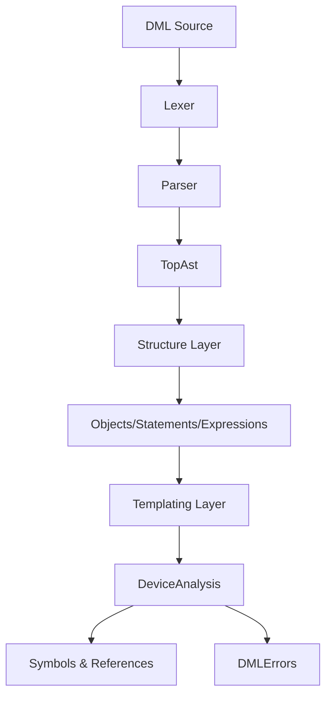
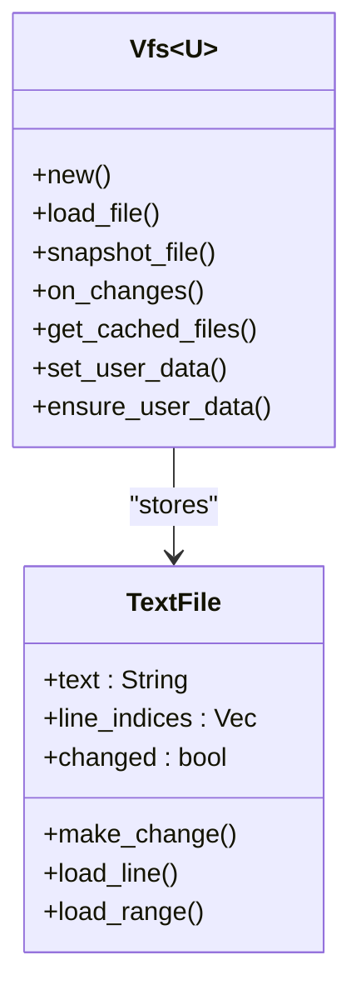
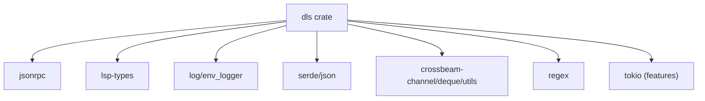

# Architecture and Design

<cite>
**Referenced Files in This Document**
- [src/main.rs](file://src/main.rs)
- [src/lib.rs](file://src/lib.rs)
- [Cargo.toml](file://Cargo.toml)
- [README.md](file://README.md)
- [src/server/mod.rs](file://src/server/mod.rs)
- [src/server/dispatch.rs](file://src/server/dispatch.rs)
- [src/actions/mod.rs](file://src/actions/mod.rs)
- [src/actions/requests.rs](file://src/actions/requests.rs)
- [src/actions/analysis_storage.rs](file://src/actions/analysis_storage.rs)
- [src/vfs/mod.rs](file://src/vfs/mod.rs)
- [src/analysis/mod.rs](file://src/analysis/mod.rs)
- [src/lsp_data.rs](file://src/lsp_data.rs)
- [src/concurrency.rs](file://src/concurrency.rs)
- [src/config.rs](file://src/config.rs)
- [src/file_management.rs](file://src/file_management.rs)
</cite>

## Table of Contents
1. [Introduction](#introduction)
2. [Project Structure](#project-structure)
3. [Core Components](#core-components)
4. [Architecture Overview](#architecture-overview)
5. [Detailed Component Analysis](#detailed-component-analysis)
6. [Dependency Analysis](#dependency-analysis)
7. [Performance Considerations](#performance-considerations)
8. [Troubleshooting Guide](#troubleshooting-guide)
9. [Conclusion](#conclusion)

## Introduction
This document describes the architecture and design of the DML Language Server (DLS), a background server that provides IDEs and editors with syntactic and semantic analysis of DML 1.4 device and common code. The system implements the Language Server Protocol (LSP) over stdin/stdout, with a modular design separating concerns among a server core, analysis engine, virtual file system (VFS), and action coordination subsystems. It emphasizes event-driven processing, asynchronous work distribution, and layered parsing and semantic analysis. Cross-cutting concerns include robust error handling, structured logging, and performance optimization through concurrency primitives and caching.

## Project Structure
The repository is organized around a Rust crate with a clear separation of modules:
- Entry point and library exports
- Server runtime and LSP message handling
- Action coordination and request dispatch
- Analysis engine for parsing, structure, templating, and semantic analysis
- Virtual file system abstraction
- LSP data conversion and utilities
- Concurrency primitives and job tracking
- Configuration and file path resolution

**Diagram sources**
- [src/main.rs](file://src/main.rs#L15-L59)
- [src/server/mod.rs](file://src/server/mod.rs#L68-L84)
- [src/server/dispatch.rs](file://src/server/dispatch.rs#L113-L147)
- [src/actions/mod.rs](file://src/actions/mod.rs#L70-L150)
- [src/actions/requests.rs](file://src/actions/requests.rs#L1-L120)
- [src/actions/analysis_storage.rs](file://src/actions/analysis_storage.rs#L103-L129)
- [src/vfs/mod.rs](file://src/vfs/mod.rs#L29-L288)
- [src/analysis/mod.rs](file://src/analysis/mod.rs#L1-L80)
- [src/lsp_data.rs](file://src/lsp_data.rs#L1-L120)
- [src/concurrency.rs](file://src/concurrency.rs#L22-L86)
- [src/config.rs](file://src/config.rs#L120-L139)
- [src/file_management.rs](file://src/file_management.rs#L62-L182)

**Section sources**
- [src/main.rs](file://src/main.rs#L15-L59)
- [src/lib.rs](file://src/lib.rs#L31-L47)

## Core Components
- Server Core
  - Initializes logging, parses CLI arguments, constructs VFS, and starts the LSP server loop.
  - Implements LSP initialization, shutdown, and capability negotiation.
  - Drives message parsing, dispatching, and response emission.
- Action Coordination
  - Maintains ActionContext (initialized vs uninitialized) and orchestrates analysis, diagnostics, and progress reporting.
  - Manages queues, waits, and device context activation policies.
- Analysis Engine
  - Provides parsing (lexer, parser, AST), structural representation, templating, and semantic analysis.
  - Produces isolated and device analyses with error collections and symbol/reference maps.
- Virtual File System (VFS)
  - In-memory text file cache with change coalescing, line index maintenance, and user data attachment.
  - Supports file snapshots, reads, writes, and change recording.
- Request Dispatch and Concurrency
  - Non-blocking dispatcher with timeouts and worker pool for LSP requests.
  - Job tokens and a centralized Jobs registry to coordinate long-running tasks and graceful shutdown.

**Section sources**
- [src/server/mod.rs](file://src/server/mod.rs#L68-L84)
- [src/actions/mod.rs](file://src/actions/mod.rs#L70-L150)
- [src/analysis/mod.rs](file://src/analysis/mod.rs#L29-L80)
- [src/vfs/mod.rs](file://src/vfs/mod.rs#L29-L288)
- [src/server/dispatch.rs](file://src/server/dispatch.rs#L113-L147)
- [src/concurrency.rs](file://src/concurrency.rs#L22-L86)

## Architecture Overview
The DLS follows an event-driven, request-response architecture over LSP:
- The server loop reads raw messages from stdin, parses them, and routes to either immediate handling (notifications/shutdown/init) or deferred handling via a dispatcher thread.
- ActionContext coordinates analysis lifecycle, including isolated analysis, device analysis, and linting, with dependency tracking and progress reporting.
- The VFS mediates file reads/writes and change propagation, feeding the analysis engine.
- The analysis engine performs layered parsing and semantic analysis, caching results keyed by canonical paths and device contexts.

**Diagram sources**
- [src/server/mod.rs](file://src/server/mod.rs#L322-L470)
- [src/server/dispatch.rs](file://src/server/dispatch.rs#L113-L147)
- [src/actions/mod.rs](file://src/actions/mod.rs#L336-L370)
- [src/actions/analysis_storage.rs](file://src/actions/analysis_storage.rs#L195-L200)
- [src/vfs/mod.rs](file://src/vfs/mod.rs#L457-L466)

## Detailed Component Analysis

### Server Core and LSP Integration
- Entry point parses CLI flags and either runs in CLI mode or initializes the server with a VFS.
- The server loop spawns a dedicated reader thread to continuously read LSP messages from stdin, parse them, and forward to the main loop via a channel.
- Immediate handling includes Initialize (capability negotiation, initial analysis) and Shutdown (with pending job synchronization).
- Non-blocking requests are dispatched to a worker thread with timeouts; responses are sent back to the client.

**Diagram sources**
- [src/main.rs](file://src/main.rs#L44-L59)
- [src/server/mod.rs](file://src/server/mod.rs#L322-L470)
- [src/server/dispatch.rs](file://src/server/dispatch.rs#L113-L147)

**Section sources**
- [src/main.rs](file://src/main.rs#L15-L59)
- [src/server/mod.rs](file://src/server/mod.rs#L68-L84)
- [src/server/mod.rs](file://src/server/mod.rs#L322-L470)
- [src/server/dispatch.rs](file://src/server/dispatch.rs#L113-L147)

### Action Coordination and Analysis Lifecycle
- ActionContext encapsulates persistent state across requests: VFS, analysis storage, configuration, device contexts, and job tracking.
- After initialization, the server updates compilation info and linter configuration, constructs a PathResolver, and triggers initial analysis of implicit imports.
- AnalysisStorage maintains isolated, device, and lint results with dependency maps and import resolution caches. It reports diagnostics and manages progress notifications.
- The context coordinates waits for analysis readiness, device context activation, and selective re-analysis on configuration changes.

**Diagram sources**
- [src/actions/mod.rs](file://src/actions/mod.rs#L224-L266)
- [src/actions/analysis_storage.rs](file://src/actions/analysis_storage.rs#L103-L129)
- [src/vfs/mod.rs](file://src/vfs/mod.rs#L29-L288)
- [src/file_management.rs](file://src/file_management.rs#L62-L182)

**Section sources**
- [src/actions/mod.rs](file://src/actions/mod.rs#L70-L150)
- [src/actions/mod.rs](file://src/actions/mod.rs#L336-L370)
- [src/actions/analysis_storage.rs](file://src/actions/analysis_storage.rs#L103-L129)
- [src/file_management.rs](file://src/file_management.rs#L62-L182)

### Request Dispatch and Concurrency Model
- The dispatcher wraps request handling in a worker pool with a timeout mechanism. It checks elapsed time before starting expensive work to avoid unnecessary computation.
- ConcurrentJob and JobToken provide a lightweight synchronization primitive to track long-running tasks and enable coordinated shutdown.
- Requests include goto-definition, references, hover, document symbols, workspace symbols, and more, each with tailored timeouts and fallback responses.

**Diagram sources**
- [src/server/dispatch.rs](file://src/server/dispatch.rs#L50-L84)
- [src/server/dispatch.rs](file://src/server/dispatch.rs#L113-L147)
- [src/concurrency.rs](file://src/concurrency.rs#L22-L86)

**Section sources**
- [src/server/dispatch.rs](file://src/server/dispatch.rs#L113-L147)
- [src/concurrency.rs](file://src/concurrency.rs#L22-L86)

### Analysis Engine: Parsing, Structure, and Templating
- Parsing layer builds tokens and an AST from DML source, with support for missing tokens/content modeling.
- Structure layer converts AST into a typed, hierarchical representation of top-level constructs, statements, expressions, and objects.
- Templating layer resolves device templates, ranks traits, and creates object hierarchies for semantic queries.
- The engine produces IsolatedAnalysis and DeviceAnalysis artifacts, including symbol and reference maps, and error collections.

**Diagram sources**
- [src/analysis/mod.rs](file://src/analysis/mod.rs#L29-L80)

**Section sources**
- [src/analysis/mod.rs](file://src/analysis/mod.rs#L29-L80)

### Virtual File System (VFS)
- Vfs maintains an in-memory cache of text files, line indices, and optional user data. It supports incremental changes, file snapshots, and batched change coalescing.
- It ensures thread-safe access via internal locking and parking/unparking mechanisms during file operations.
- Vfs integrates with the analysis pipeline by providing file contents and change notifications.

**Diagram sources**
- [src/vfs/mod.rs](file://src/vfs/mod.rs#L29-L288)

**Section sources**
- [src/vfs/mod.rs](file://src/vfs/mod.rs#L29-L288)

### LSP Data Conversion and Utilities
- lsp_data provides conversions between DLS spans/positions and LSP types, URI parsing/serialization, and workspace edit construction.
- It also defines InitializationOptions and ClientCapabilities consumed by the server.

**Section sources**
- [src/lsp_data.rs](file://src/lsp_data.rs#L1-L120)
- [src/lsp_data.rs](file://src/lsp_data.rs#L282-L333)

### Configuration and Path Resolution
- Config encapsulates server behavior toggles (linting, imports, device context modes) and resource paths (compile info, lint config).
- PathResolver resolves relative imports against workspace roots and per-device include paths, supporting context-aware resolution.

**Section sources**
- [src/config.rs](file://src/config.rs#L120-L139)
- [src/file_management.rs](file://src/file_management.rs#L62-L182)

## Dependency Analysis
External dependencies include JSON-RPC, LSP types, logging, regex, serde, and concurrency primitives. The server leverages crossbeam channels for inter-thread communication and a worker pool for request handling. Tokio is present but not used for the LSP runtime in the shown modules.

**Diagram sources**
- [Cargo.toml](file://Cargo.toml#L33-L61)

**Section sources**
- [Cargo.toml](file://Cargo.toml#L33-L61)

## Performance Considerations
- Concurrency and Job Tracking: Centralized Jobs registry and JobToken ensure long-running tasks are tracked and can be awaited during shutdown, preventing orphaned threads and enabling deterministic teardown.
- Work Pool and Timeouts: Non-blocking request handling with timeout checks avoids wasted work on stale requests and reduces latency under load.
- Caching and Incremental Updates: AnalysisStorage caches results keyed by canonical paths and device contexts, with dependency maps and import resolution caches minimizing repeated work.
- VFS Efficiency: Coalesced changes and line index maintenance reduce overhead for frequent edits and range queries.
- Parallelism: The analysis engine uses parallel iterators where applicable to accelerate bulk operations.

[No sources needed since this section provides general guidance]

## Troubleshooting Guide
- Initialization and Capabilities
  - The server responds to Initialize with negotiated capabilities and sends warnings for unknown or deprecated configuration keys.
- Diagnostics Reporting
  - Errors from isolated, device, and lint analyses are aggregated and published as diagnostics per file; filtering respects direct-open files and lint settings.
- Shutdown Behavior
  - Shutdown waits for pending jobs and sets a shutdown flag; subsequent messages are ignored except Exit.
- Logging and Error Messaging
  - Structured logging via env_logger aids in diagnosing parsing failures, VFS errors, and dispatcher issues. Error messages are surfaced to the client for visibility.

**Section sources**
- [src/server/mod.rs](file://src/server/mod.rs#L207-L289)
- [src/actions/mod.rs](file://src/actions/mod.rs#L463-L518)
- [src/server/mod.rs](file://src/server/mod.rs#L86-L107)
- [src/vfs/mod.rs](file://src/vfs/mod.rs#L109-L172)

## Conclusion
The DML Language Server employs a clean, modular architecture centered on the Language Server Protocol. Its event-driven server loop, robust action coordination, layered analysis engine, and efficient VFS provide a responsive and extensible foundation for DML 1.4 development. The design balances performance with maintainability through concurrency primitives, caching, and clear separation of concerns, while integrating seamlessly with IDE clients via LSP.