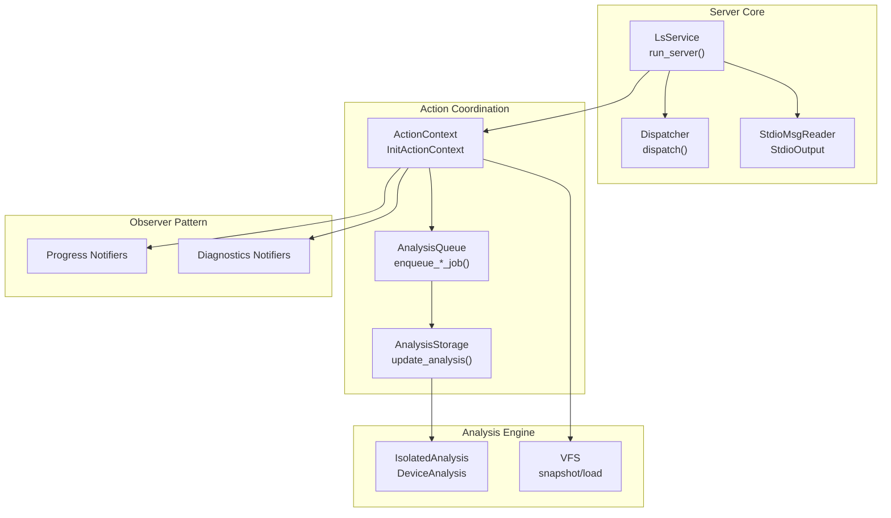
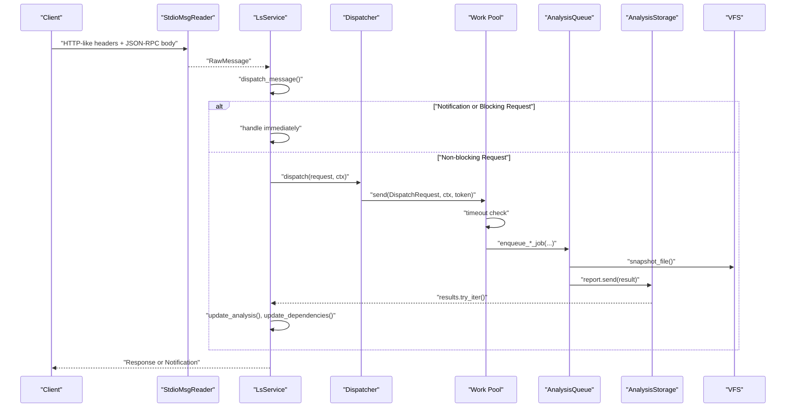
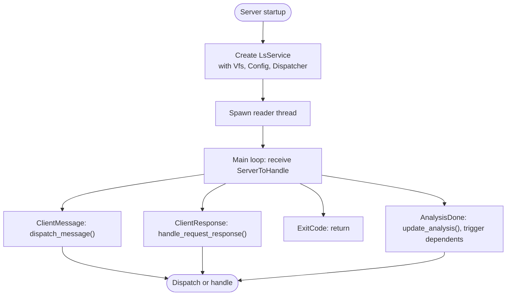
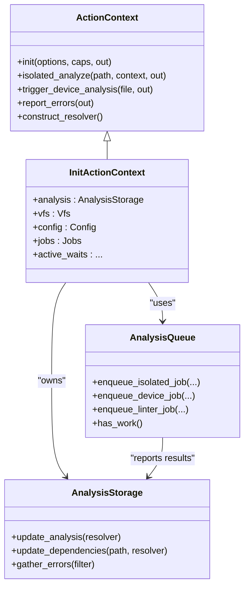
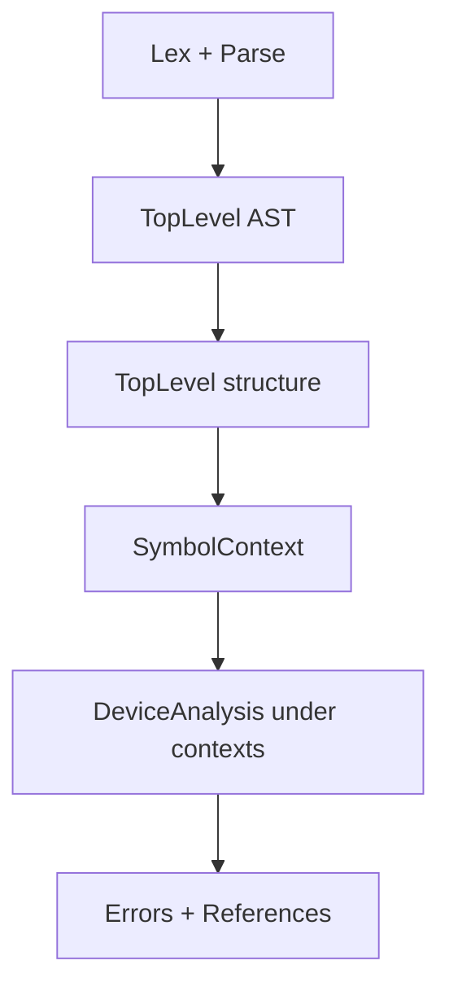
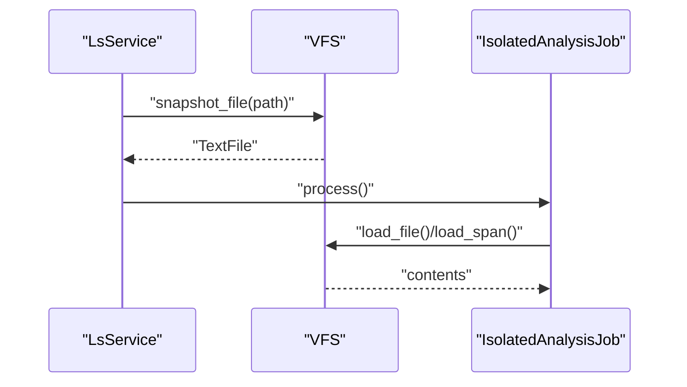
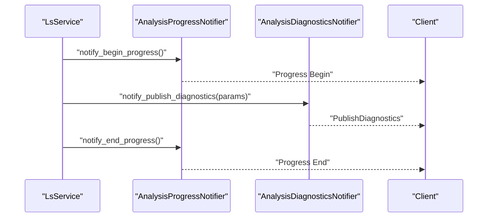
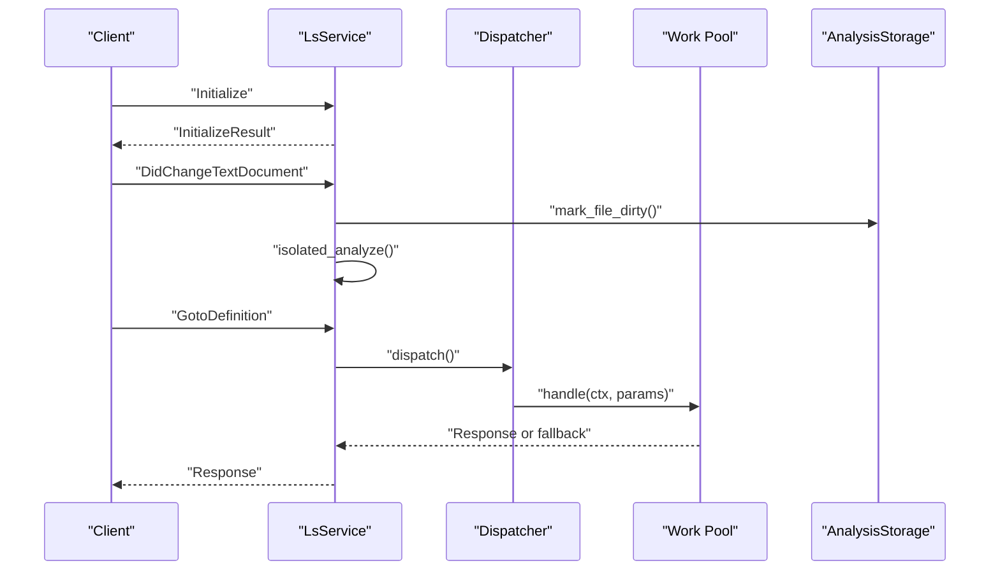
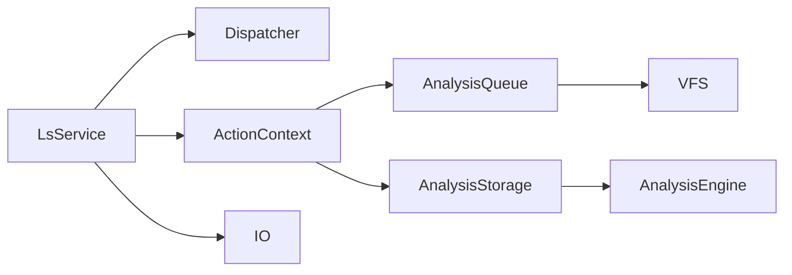

# Component Interactions

<cite>
**Referenced Files in This Document**
- [src/main.rs](file://src/main.rs)
- [src/lib.rs](file://src/lib.rs)
- [src/server/mod.rs](file://src/server/mod.rs)
- [src/server/dispatch.rs](file://src/server/dispatch.rs)
- [src/server/io.rs](file://src/server/io.rs)
- [src/actions/mod.rs](file://src/actions/mod.rs)
- [src/actions/analysis_queue.rs](file://src/actions/analysis_queue.rs)
- [src/actions/analysis_storage.rs](file://src/actions/analysis_storage.rs)
- [src/actions/notifications.rs](file://src/actions/notifications.rs)
- [src/actions/requests.rs](file://src/actions/requests.rs)
- [src/actions/progress.rs](file://src/actions/progress.rs)
- [src/vfs/mod.rs](file://src/vfs/mod.rs)
- [src/analysis/mod.rs](file://src/analysis/mod.rs)
</cite>

## Table of Contents
1. [Introduction](#introduction)
2. [Project Structure](#project-structure)
3. [Core Components](#core-components)
4. [Architecture Overview](#architecture-overview)
5. [Detailed Component Analysis](#detailed-component-analysis)
6. [Dependency Analysis](#dependency-analysis)
7. [Performance Considerations](#performance-considerations)
8. [Troubleshooting Guide](#troubleshooting-guide)
9. [Conclusion](#conclusion)

## Introduction
This document explains the component interactions within the DML Language Server (DLS) architecture. It focuses on how requests flow from LSP message reception to final response generation, how the action coordination system orchestrates analysis tasks, how the virtual file system (VFS) integrates with the rest of the system, and how shared state and synchronization points are managed. It also documents the role of the action context in coordinating analysis tasks and managing component lifecycles, and the observer pattern implementation for real-time notifications and change propagation.

## Project Structure
The DLS is organized into cohesive modules:
- Server core: message parsing, dispatching, and output handling
- Action coordination: request/response handling, analysis queues, storage, and progress
- Analysis engine: parsing, symbol resolution, device analysis, and linting
- Virtual file system: in-memory file cache and change tracking
- Observability: progress and diagnostics notifiers

**Diagram sources**
- [src/server/mod.rs](file://src/server/mod.rs#L68-L84)
- [src/server/dispatch.rs](file://src/server/dispatch.rs#L113-L147)
- [src/server/io.rs](file://src/server/io.rs#L19-L40)
- [src/actions/mod.rs](file://src/actions/mod.rs#L71-L150)
- [src/actions/analysis_queue.rs](file://src/actions/analysis_queue.rs#L49-L163)
- [src/actions/analysis_storage.rs](file://src/actions/analysis_storage.rs#L103-L212)
- [src/vfs/mod.rs](file://src/vfs/mod.rs#L180-L288)
- [src/actions/progress.rs](file://src/actions/progress.rs#L17-L45)

**Section sources**
- [src/main.rs](file://src/main.rs#L15-L59)
- [src/lib.rs](file://src/lib.rs#L31-L47)

## Core Components
- Server core
  - LsService: main server loop, message routing, and lifecycle management
  - Dispatcher: non-blocking request dispatch to worker threads
  - IO: message reader/writer over stdin/stdout
- Action coordination
  - ActionContext: shared state across requests; transitions from Uninit to Init
  - AnalysisQueue: serial worker thread for analysis jobs with deduplication and trackers
  - AnalysisStorage: stores and updates analysis results, manages dependencies and triggers
- Analysis engine
  - IsolatedAnalysis and DeviceAnalysis: syntactic and semantic analyses
  - Built-in implicit imports support
- Virtual file system
  - Vfs: in-memory cache of files, change coalescing, and snapshotting
- Observer pattern
  - Progress and diagnostics notifiers for client updates

**Section sources**
- [src/server/mod.rs](file://src/server/mod.rs#L291-L470)
- [src/server/dispatch.rs](file://src/server/dispatch.rs#L113-L147)
- [src/server/io.rs](file://src/server/io.rs#L19-L40)
- [src/actions/mod.rs](file://src/actions/mod.rs#L71-L150)
- [src/actions/analysis_queue.rs](file://src/actions/analysis_queue.rs#L49-L163)
- [src/actions/analysis_storage.rs](file://src/actions/analysis_storage.rs#L103-L212)
- [src/vfs/mod.rs](file://src/vfs/mod.rs#L180-L288)
- [src/actions/progress.rs](file://src/actions/progress.rs#L17-L45)

## Architecture Overview
The DLS follows a message-driven architecture:
- A dedicated thread reads LSP messages from stdin and forwards parsed messages to the main server loop via a channel
- The server routes notifications and blocking requests immediately; non-blocking requests are dispatched to a worker thread pool
- Analysis tasks are queued and processed by a single worker thread to avoid redundant work and coordinate state updates
- Results are published back to the server loop, which updates AnalysisStorage and triggers dependent analyses and diagnostics

**Diagram sources**
- [src/server/mod.rs](file://src/server/mod.rs#L322-L470)
- [src/server/dispatch.rs](file://src/server/dispatch.rs#L50-L84)
- [src/actions/analysis_queue.rs](file://src/actions/analysis_queue.rs#L165-L236)
- [src/actions/analysis_storage.rs](file://src/actions/analysis_storage.rs#L486-L584)
- [src/vfs/mod.rs](file://src/vfs/mod.rs#L225-L231)

## Detailed Component Analysis

### Server Core: LsService and IO
- LsService
  - Initializes Vfs, Config, and creates a Dispatcher and channel to communicate with the analysis subsystem
  - Runs a dedicated reader thread that parses messages and forwards them to the main loop
  - Handles ServerToHandle events: client messages, responses, exit codes, and analysis completion notifications
  - Implements Initialize and Shutdown request handlers; routes other LSP requests via dispatch_message
- IO
  - StdioMsgReader reads Content-Length-prefixed JSON-RPC messages from stdin
  - StdioOutput writes responses and notifications to stdout with proper framing

**Diagram sources**
- [src/server/mod.rs](file://src/server/mod.rs#L68-L84)
- [src/server/mod.rs](file://src/server/mod.rs#L322-L470)
- [src/server/io.rs](file://src/server/io.rs#L28-L40)

**Section sources**
- [src/server/mod.rs](file://src/server/mod.rs#L68-L84)
- [src/server/mod.rs](file://src/server/mod.rs#L322-L470)
- [src/server/io.rs](file://src/server/io.rs#L19-L40)

### Action Coordination: ActionContext, AnalysisQueue, AnalysisStorage
- ActionContext
  - Holds shared mutable state: Vfs, AnalysisStorage, Config, device active contexts, outstanding requests, jobs, and client capabilities
  - Transitions from Uninit to Init during Initialize; exposes helpers for analysis orchestration
- AnalysisQueue
  - Single-threaded worker that deduplicates and prunes overlapping jobs, tracks in-flight work, and spawns lightweight threads for heavy tasks
  - Enqueues IsolatedAnalysisJob, DeviceAnalysisJob, and LinterJob; notifies server loop on completion
- AnalysisStorage
  - Stores IsolatedAnalysis, DeviceAnalysis, and LinterAnalysis with timestamps
  - Maintains dependency graphs, import maps, device triggers, and invalidation timestamps
  - Updates analysis results, resolves dependencies, and discards stale entries

**Diagram sources**
- [src/actions/mod.rs](file://src/actions/mod.rs#L71-L150)
- [src/actions/mod.rs](file://src/actions/mod.rs#L224-L266)
- [src/actions/analysis_queue.rs](file://src/actions/analysis_queue.rs#L49-L163)
- [src/actions/analysis_storage.rs](file://src/actions/analysis_storage.rs#L103-L212)

**Section sources**
- [src/actions/mod.rs](file://src/actions/mod.rs#L71-L150)
- [src/actions/analysis_queue.rs](file://src/actions/analysis_queue.rs#L49-L163)
- [src/actions/analysis_storage.rs](file://src/actions/analysis_storage.rs#L103-L212)

### Analysis Engine: Parsing, Symbol Resolution, Device Analysis
- IsolatedAnalysis: syntactic parsing and top-level structure
- DeviceAnalysis: semantic analysis under device contexts, symbol and reference maps
- Implicit imports: built-in files loaded during initialization to enable semantic analysis

**Diagram sources**
- [src/analysis/mod.rs](file://src/analysis/mod.rs#L294-L315)
- [src/analysis/mod.rs](file://src/analysis/mod.rs#L394-L409)
- [src/server/mod.rs](file://src/server/mod.rs#L275-L282)

**Section sources**
- [src/analysis/mod.rs](file://src/analysis/mod.rs#L294-L315)
- [src/analysis/mod.rs](file://src/analysis/mod.rs#L394-L409)
- [src/server/mod.rs](file://src/server/mod.rs#L275-L282)

### Virtual File System: VFS Integration
- Vfs caches file contents, applies edits atomically, and snapshots files for analysis
- Supports line/byte indexing, change coalescing, and ensures thread-safe access
- Analysis jobs snapshot files to capture consistent content for parsing

**Diagram sources**
- [src/vfs/mod.rs](file://src/vfs/mod.rs#L225-L231)
- [src/actions/analysis_queue.rs](file://src/actions/analysis_queue.rs#L415-L441)
- [src/vfs/mod.rs](file://src/vfs/mod.rs#L457-L466)

**Section sources**
- [src/vfs/mod.rs](file://src/vfs/mod.rs#L180-L288)
- [src/actions/analysis_queue.rs](file://src/actions/analysis_queue.rs#L415-L441)

### Observer Pattern: Progress and Diagnostics
- ProgressNotifier and AnalysisProgressNotifier: emit WorkDone progress notifications
- DiagnosticsNotifier and AnalysisDiagnosticsNotifier: publish diagnostics and show messages
- Integration: ActionContext uses notifiers to inform the client about indexing progress and errors

**Diagram sources**
- [src/actions/progress.rs](file://src/actions/progress.rs#L124-L147)
- [src/actions/progress.rs](file://src/actions/progress.rs#L162-L189)

**Section sources**
- [src/actions/progress.rs](file://src/actions/progress.rs#L17-L45)
- [src/actions/progress.rs](file://src/actions/progress.rs#L124-L147)
- [src/actions/progress.rs](file://src/actions/progress.rs#L162-L189)

### Request Flow and Error Handling
- Blocking requests (e.g., Initialize, Shutdown) are handled synchronously in the main loop
- Non-blocking requests are dispatched to a worker thread with timeouts; fallback responses are returned on timeout
- Notifications (e.g., DidChangeTextDocument) update VFS and trigger analysis; errors are reported via diagnostics

**Diagram sources**
- [src/server/mod.rs](file://src/server/mod.rs#L207-L288)
- [src/server/dispatch.rs](file://src/server/dispatch.rs#L50-L84)
- [src/actions/requests.rs](file://src/actions/requests.rs#L604-L660)

**Section sources**
- [src/server/mod.rs](file://src/server/mod.rs#L562-L598)
- [src/server/dispatch.rs](file://src/server/dispatch.rs#L113-L147)
- [src/actions/requests.rs](file://src/actions/requests.rs#L604-L660)

## Dependency Analysis
- Coupling and cohesion
  - LsService is the central coordinator; it depends on Vfs, Config, Dispatcher, and ActionContext
  - ActionContext encapsulates shared mutable state and delegates to AnalysisQueue and AnalysisStorage
  - AnalysisQueue depends on Vfs and AnalysisStorage; AnalysisStorage depends on analysis results and file paths
- External dependencies
  - JSON-RPC for LSP transport
  - crossbeam channels for inter-thread communication
  - rayon for parallelizable analysis segments (used in analysis module)
- Synchronization
  - Mutex protects shared structures (Config, AnalysisStorage, Vfs internals)
  - Atomic flags control shutdown and quiescence
  - Channels decouple message reading from analysis execution

**Diagram sources**
- [src/server/mod.rs](file://src/server/mod.rs#L291-L320)
- [src/actions/mod.rs](file://src/actions/mod.rs#L224-L266)
- [src/actions/analysis_queue.rs](file://src/actions/analysis_queue.rs#L49-L67)
- [src/actions/analysis_storage.rs](file://src/actions/analysis_storage.rs#L103-L130)
- [src/vfs/mod.rs](file://src/vfs/mod.rs#L293-L297)

**Section sources**
- [src/server/mod.rs](file://src/server/mod.rs#L291-L320)
- [src/actions/mod.rs](file://src/actions/mod.rs#L224-L266)
- [src/actions/analysis_queue.rs](file://src/actions/analysis_queue.rs#L49-L67)
- [src/actions/analysis_storage.rs](file://src/actions/analysis_storage.rs#L103-L130)
- [src/vfs/mod.rs](file://src/vfs/mod.rs#L293-L297)

## Performance Considerations
- Serialization and deserialization overhead is minimized by batching diagnostics and using efficient channels
- Deduplication and pruning in AnalysisQueue reduce redundant analysis work
- Last-use eviction and invalidation timestamps help manage memory and keep results fresh
- Parallelizable segments in analysis leverage rayon where applicable

## Troubleshooting Guide
- Initialization failures
  - Initialize returns an error if called twice or if the server is not ready; ensure Initialize precedes other requests
- Unknown or deprecated configuration keys
  - The server emits warnings for unknown or deprecated keys and duplicates; review client settings
- Out-of-order or duplicate file changes
  - The server validates change versions and warns on out-of-order edits; ensure clients send changes in order
- Missing built-in files
  - The server warns if required built-in files are not found; ensure implicit imports are resolvable
- Timeout handling
  - Non-blocking requests may return fallback responses if they exceed the timeout; retry or adjust expectations

**Section sources**
- [src/server/mod.rs](file://src/server/mod.rs#L207-L288)
- [src/server/mod.rs](file://src/server/mod.rs#L109-L205)
- [src/actions/notifications.rs](file://src/actions/notifications.rs#L123-L133)
- [src/actions/mod.rs](file://src/actions/mod.rs#L731-L743)
- [src/server/dispatch.rs](file://src/server/dispatch.rs#L24-L29)

## Conclusion
The DML Language Server coordinates LSP message handling, analysis orchestration, and client notifications through a clear separation of concerns. The server core handles transport and dispatch, the action coordination system manages shared state and queues, the analysis engine performs parsing and semantic analysis, and the VFS provides a consistent file model. The observer pattern enables real-time progress and diagnostics updates. Together, these components deliver responsive and accurate language server functionality.