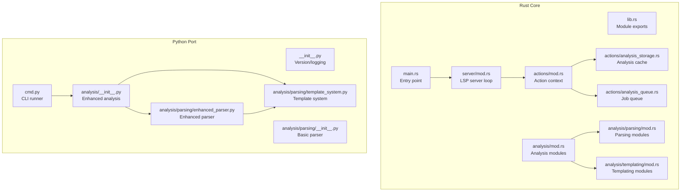
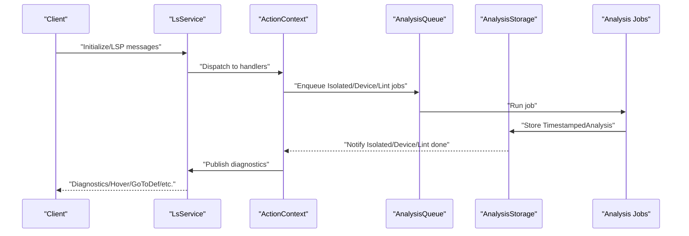
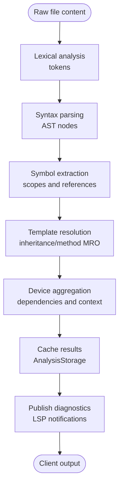
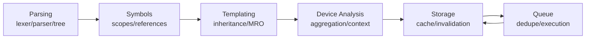

# Data Flow and Processing Pipeline

<cite>
**Referenced Files in This Document**
- [lib.rs](file://src/lib.rs)
- [main.rs](file://src/main.rs)
- [analysis/mod.rs](file://src/analysis/mod.rs)
- [analysis/parsing/mod.rs](file://src/analysis/parsing/mod.rs)
- [analysis/templating/mod.rs](file://src/analysis/templating/mod.rs)
- [actions/mod.rs](file://src/actions/mod.rs)
- [actions/analysis_storage.rs](file://src/actions/analysis_storage.rs)
- [actions/analysis_queue.rs](file://src/actions/analysis_queue.rs)
- [analysis/symbols.rs](file://src/analysis/symbols.rs)
- [analysis/reference.rs](file://src/analysis/reference.rs)
- [server/mod.rs](file://src/server/mod.rs)
- [python-port/dml_language_server/__init__.py](file://python-port/dml_language_server/__init__.py)
- [python-port/dml_language_server/cmd.py](file://python-port/dml_language_server/cmd.py)
- [python-port/dml_language_server/analysis/__init__.py](file://python-port/dml_language_server/analysis/__init__.py)
- [python-port/dml_language_server/analysis/parsing/__init__.py](file://python-port/dml_language_server/analysis/parsing/__init__.py)
- [python-port/dml_language_server/analysis/parsing/enhanced_parser.py](file://python-port/dml_language_server/analysis/parsing/enhanced_parser.py)
- [python-port/dml_language_server/analysis/parsing/template_system.py](file://python-port/dml_language_server/analysis/parsing/template_system.py)
- [README.md](file://README.md)
</cite>

## Table of Contents
1. [Introduction](#introduction)
2. [Project Structure](#project-structure)
3. [Core Components](#core-components)
4. [Architecture Overview](#architecture-overview)
5. [Detailed Component Analysis](#detailed-component-analysis)
6. [Dependency Analysis](#dependency-analysis)
7. [Performance Considerations](#performance-considerations)
8. [Troubleshooting Guide](#troubleshooting-guide)
9. [Conclusion](#conclusion)

## Introduction
This document explains the complete data flow and processing pipeline of the DML Language Server (DLS), from raw file content through lexical analysis, syntax parsing, semantic analysis, and template processing to final output generation. It documents the layered approach where parsing builds syntax trees, structure extraction creates symbol tables, and templating resolves device hierarchies. The incremental analysis approach and propagation of changes are covered, along with caching strategies, performance optimizations, memory management, and error handling/recovery mechanisms.

## Project Structure
The DLS consists of:
- A Rust core implementing the language server, analysis, and infrastructure
- A Python port providing a compatible implementation for CLI and testing
- A server runtime communicating over the Language Server Protocol (LSP)
- An analysis subsystem supporting parsing, symbol resolution, and templating
- A storage and queue system enabling incremental updates and caching

**Diagram sources**
- [lib.rs](file://src/lib.rs#L31-L47)
- [main.rs](file://src/main.rs#L15-L59)
- [server/mod.rs](file://src/server/mod.rs#L68-L84)
- [actions/mod.rs](file://src/actions/mod.rs#L70-L76)
- [actions/analysis_storage.rs](file://src/actions/analysis_storage.rs#L103-L129)
- [actions/analysis_queue.rs](file://src/actions/analysis_queue.rs#L38-L47)
- [analysis/mod.rs](file://src/analysis/mod.rs#L4-L12)
- [analysis/parsing/mod.rs](file://src/analysis/parsing/mod.rs#L4-L15)
- [analysis/templating/mod.rs](file://src/analysis/templating/mod.rs#L3-L7)
- [python-port/dml_language_server/__init__.py](file://python-port/dml_language_server/__init__.py#L29-L48)
- [python-port/dml_language_server/cmd.py](file://python-port/dml_language_server/cmd.py#L21-L114)
- [python-port/dml_language_server/analysis/__init__.py](file://python-port/dml_language_server/analysis/__init__.py#L372-L547)
- [python-port/dml_language_server/analysis/parsing/__init__.py](file://python-port/dml_language_server/analysis/parsing/__init__.py#L327-L677)
- [python-port/dml_language_server/analysis/parsing/enhanced_parser.py](file://python-port/dml_language_server/analysis/parsing/enhanced_parser.py#L238-L735)
- [python-port/dml_language_server/analysis/parsing/template_system.py](file://python-port/dml_language_server/analysis/parsing/template_system.py#L348-L448)

**Section sources**
- [lib.rs](file://src/lib.rs#L3-L54)
- [main.rs](file://src/main.rs#L15-L59)
- [README.md](file://README.md#L5-L57)

## Core Components
- Parsing and Lexical Analysis: Converts raw DML text into tokens and AST nodes, with both basic and enhanced parsers.
- Symbol Resolution and Scoping: Builds symbol tables and tracks references across files and contexts.
- Templating: Applies templates to device declarations, resolving inheritance and method resolution order.
- Incremental Analysis: Queues and executes analysis jobs, caches results, and invalidates stale entries.
- LSP Server: Manages client communication, progress reporting, and diagnostics publishing.

Key Rust types and roles:
- IsolatedAnalysis: Per-file parsing and symbol extraction results.
- DeviceAnalysis: Aggregates isolated analyses into device-level structures and templates.
- AnalysisStorage: Caches results and manages dependencies and invalidation.
- AnalysisQueue: Serializes and deduplicates analysis jobs.
- Symbol and Reference models: Represent definitions, references, and their kinds.

**Section sources**
- [analysis/mod.rs](file://src/analysis/mod.rs#L294-L409)
- [analysis/symbols.rs](file://src/analysis/symbols.rs#L18-L192)
- [analysis/reference.rs](file://src/analysis/reference.rs#L8-L200)
- [actions/analysis_storage.rs](file://src/actions/analysis_storage.rs#L103-L129)
- [actions/analysis_queue.rs](file://src/actions/analysis_queue.rs#L38-L47)

## Architecture Overview
The DLS follows a layered pipeline:
1. Raw content enters via VFS and LSP notifications.
2. Isolated analysis parses and extracts symbols.
3. Device analysis aggregates dependencies and applies templates.
4. Results are cached and published as diagnostics and hover/definition responses.

**Diagram sources**
- [server/mod.rs](file://src/server/mod.rs#L322-L470)
- [actions/mod.rs](file://src/actions/mod.rs#L336-L800)
- [actions/analysis_queue.rs](file://src/actions/analysis_queue.rs#L415-L537)
- [actions/analysis_storage.rs](file://src/actions/analysis_storage.rs#L486-L584)

## Detailed Component Analysis

### Data Flow: From Raw Content to Final Output
- Entry points:
  - Rust: [main.rs](file://src/main.rs#L15-L59) initializes CLI or LSP server.
  - Python: [cmd.py](file://python-port/dml_language_server/cmd.py#L21-L114) runs CLI analysis.
- Server loop:
  - [server/mod.rs](file://src/server/mod.rs#L322-L470) handles LSP messages, progress, and notifications.
- Analysis orchestration:
  - [actions/mod.rs](file://src/actions/mod.rs#L336-L800) coordinates device analysis triggers and diagnostics reporting.
- Incremental updates:
  - [actions/analysis_storage.rs](file://src/actions/analysis_storage.rs#L486-L584) updates dependencies and invalidates stale results.
  - [actions/analysis_queue.rs](file://src/actions/analysis_queue.rs#L165-L236) serializes and deduplicates jobs.

**Diagram sources**
- [analysis/parsing/mod.rs](file://src/analysis/parsing/mod.rs#L4-L15)
- [analysis/templating/mod.rs](file://src/analysis/templating/mod.rs#L3-L7)
- [actions/analysis_storage.rs](file://src/actions/analysis_storage.rs#L486-L584)
- [server/mod.rs](file://src/server/mod.rs#L418-L442)

**Section sources**
- [main.rs](file://src/main.rs#L15-L59)
- [server/mod.rs](file://src/server/mod.rs#L322-L470)
- [actions/analysis_storage.rs](file://src/actions/analysis_storage.rs#L486-L584)
- [actions/analysis_queue.rs](file://src/actions/analysis_queue.rs#L165-L236)

### Parsing Layer
- Rust parsing modules:
  - [analysis/parsing/mod.rs](file://src/analysis/parsing/mod.rs#L4-L15) exposes lexer, parser, and tree structures.
- Python parsing:
  - [analysis/parsing/__init__.py](file://python-port/dml_language_server/analysis/parsing/__init__.py#L83-L325) provides a DMLLexer and DMLParser for basic grammar.
  - [analysis/parsing/enhanced_parser.py](file://python-port/dml_language_server/analysis/parsing/enhanced_parser.py#L238-L735) defines enhanced tokens, AST nodes, and expressions for full DML grammar.

Processing stages:
- Tokenization: [DMLLexer](file://python-port/dml_language_server/analysis/parsing/__init__.py#L109-L134) and [DMLLexer](file://python-port/dml_language_server/analysis/parsing/enhanced_parser.py#L401-L426) produce tokens with spans.
- Parsing: [DMLParser](file://python-port/dml_language_server/analysis/parsing/__init__.py#L327-L677) and [Enhanced DML Parser](file://python-port/dml_language_server/analysis/parsing/enhanced_parser.py#L737-L800) build symbol tables and ASTs.
- Error reporting: Tokens and parse errors carry spans for precise diagnostics.

**Section sources**
- [analysis/parsing/mod.rs](file://src/analysis/parsing/mod.rs#L4-L15)
- [python-port/dml_language_server/analysis/parsing/__init__.py](file://python-port/dml_language_server/analysis/parsing/__init__.py#L83-L325)
- [python-port/dml_language_server/analysis/parsing/enhanced_parser.py](file://python-port/dml_language_server/analysis/parsing/enhanced_parser.py#L238-L735)

### Symbol Resolution and Scoping
- Symbol model:
  - [symbols.rs](file://src/analysis/symbols.rs#L18-L192) defines symbol kinds and sources.
- References:
  - [reference.rs](file://src/analysis/reference.rs#L8-L200) models NodeRef, VariableReference, and GlobalReference.
- Scope and context:
  - [analysis/mod.rs](file://src/analysis/mod.rs#L394-L409) holds DeviceAnalysis with symbol_info and reference_info caches.
  - [analysis/mod.rs](file://src/analysis/mod.rs#L436-L483) implements a reference cache keyed by context and flattened reference chains.

Processing stages:
- Extract symbols during parsing.
- Build symbol tables per file and cross-file.
- Resolve references using scoped lookups and caches.

**Section sources**
- [analysis/symbols.rs](file://src/analysis/symbols.rs#L18-L192)
- [analysis/reference.rs](file://src/analysis/reference.rs#L8-L200)
- [analysis/mod.rs](file://src/analysis/mod.rs#L394-L409)
- [analysis/mod.rs](file://src/analysis/mod.rs#L436-L483)

### Templating and Device Hierarchies
- Template system (Python port):
  - [template_system.py](file://python-port/dml_language_server/analysis/parsing/template_system.py#L348-L448) resolves template inheritance, merges parameters/methods, and computes method resolution order.
- Rust templating modules:
  - [templating/mod.rs](file://src/analysis/templating/mod.rs#L3-L31) defines declarations and resolved types used in device analysis.

Processing stages:
- Collect template declarations and parameters.
- Resolve inheritance and compute MRO.
- Merge template contributions into device declarations.
- Update symbol tables with template-derived symbols.

**Section sources**
- [python-port/dml_language_server/analysis/parsing/template_system.py](file://python-port/dml_language_server/analysis/parsing/template_system.py#L348-L448)
- [analysis/templating/mod.rs](file://src/analysis/templating/mod.rs#L3-L31)

### Incremental Analysis and Change Propagation
- Job queue:
  - [analysis_queue.rs](file://src/actions/analysis_queue.rs#L38-L47) serializes isolated, device, and linter jobs.
  - Deduplication and pruning prevent redundant work.
- Storage and invalidation:
  - [analysis_storage.rs](file://src/actions/analysis_storage.rs#L103-L129) stores timestamped results and tracks dependencies.
  - [analysis_storage.rs](file://src/actions/analysis_storage.rs#L598-L661) discards old analysis and marks files dirty.
- Dependency graph:
  - [analysis_storage.rs](file://src/actions/analysis_storage.rs#L294-L381) updates dependencies and device triggers.
  - [analysis_storage.rs](file://src/actions/analysis_storage.rs#L663-L698) checks if device analysis is newer than dependencies.

Propagation flow:
- On file change, mark dirty and invalidate dependent device analyses.
- Re-enqueue isolated analysis; on completion, re-resolve imports and dependencies.
- Trigger device analysis if dependencies are satisfied and device is outdated.

**Section sources**
- [actions/analysis_queue.rs](file://src/actions/analysis_queue.rs#L38-L47)
- [actions/analysis_storage.rs](file://src/actions/analysis_storage.rs#L103-L129)
- [actions/analysis_storage.rs](file://src/actions/analysis_storage.rs#L294-L381)
- [actions/analysis_storage.rs](file://src/actions/analysis_storage.rs#L598-L661)
- [actions/analysis_storage.rs](file://src/actions/analysis_storage.rs#L663-L698)

### Error Handling and Recovery
- Error representation:
  - [analysis/mod.rs](file://src/analysis/mod.rs#L210-L265) defines DMLError and LocalDMLError with spans and severity.
- LSP diagnostics:
  - [actions/mod.rs](file://src/actions/mod.rs#L463-L518) publishes diagnostics grouped by file and severity.
- Internal logging:
  - [lib.rs](file://src/lib.rs#L22-L29) provides internal_error macro for logging.
  - [python-port/dml_language_server/__init__.py](file://python-port/dml_language_server/__init__.py#L33-L39) mirrors internal_error in Python.
- Recovery:
  - Stale analysis is discarded and re-triggered when dependencies change.
  - Missing built-in files produce targeted diagnostics.

**Section sources**
- [analysis/mod.rs](file://src/analysis/mod.rs#L210-L265)
- [actions/mod.rs](file://src/actions/mod.rs#L463-L518)
- [lib.rs](file://src/lib.rs#L22-L29)
- [python-port/dml_language_server/__init__.py](file://python-port/dml_language_server/__init__.py#L33-L39)

## Dependency Analysis
The analysis subsystem composes parsing, symbol resolution, and templating into a cohesive pipeline. Dependencies are tracked per file and context, enabling efficient invalidation and re-analysis.

**Diagram sources**
- [analysis/parsing/mod.rs](file://src/analysis/parsing/mod.rs#L4-L15)
- [analysis/symbols.rs](file://src/analysis/symbols.rs#L18-L192)
- [analysis/templating/mod.rs](file://src/analysis/templating/mod.rs#L3-L31)
- [actions/analysis_storage.rs](file://src/actions/analysis_storage.rs#L103-L129)
- [actions/analysis_queue.rs](file://src/actions/analysis_queue.rs#L38-L47)

**Section sources**
- [actions/analysis_storage.rs](file://src/actions/analysis_storage.rs#L103-L129)
- [actions/analysis_queue.rs](file://src/actions/analysis_queue.rs#L38-L47)

## Performance Considerations
- Concurrency and parallelism:
  - Rust uses crossbeam channels and parking threads for job execution.
  - Python port uses ThreadPoolExecutor for parallel analysis.
- Caching:
  - Timestamped storage prevents recomputation of unchanged results.
  - Reference cache reduces repeated symbol resolution across contexts.
- Memory management:
  - Shared ownership via Arc<Mutex<T>> for symbol and reference maps.
  - Discard old analysis after idle retention thresholds.
- I/O efficiency:
  - VFS snapshots minimize filesystem reads during analysis.
  - Incremental updates avoid full re-parsing.

[No sources needed since this section provides general guidance]

## Troubleshooting Guide
Common issues and remedies:
- Missing built-in files: The server warns when required built-ins are absent and device analysis may be incomplete.
- Outdated device analysis: If dependencies are newer than device analysis, the server skips publishing outdated results until refreshed.
- CLI vs LSP differences: The Python CLI prints diagnostics to stdout; LSP publishes diagnostics via notifications.

**Section sources**
- [actions/analysis_storage.rs](file://src/actions/analysis_storage.rs#L731-L742)
- [actions/analysis_storage.rs](file://src/actions/analysis_storage.rs#L672-L698)
- [python-port/dml_language_server/cmd.py](file://python-port/dml_language_server/cmd.py#L21-L114)

## Conclusion
The DML Language Server implements a robust, incremental analysis pipeline spanning lexical analysis, syntax parsing, symbol resolution, templating, and device aggregation. Its caching and queueing mechanisms ensure efficient updates as files change, while comprehensive error reporting and diagnostics improve developer productivity. The dual Rust and Python implementations demonstrate portability and compatibility across environments.