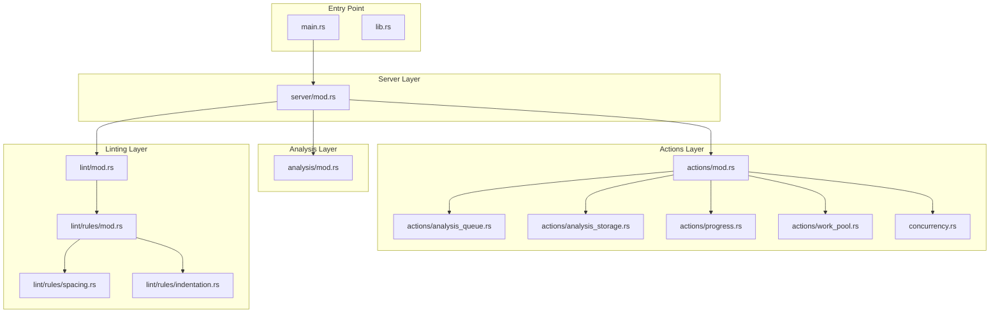
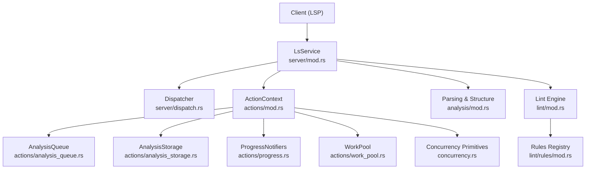
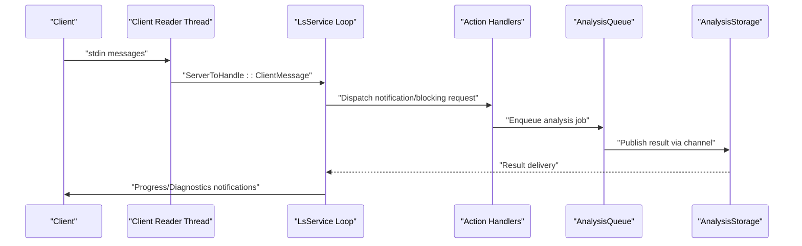
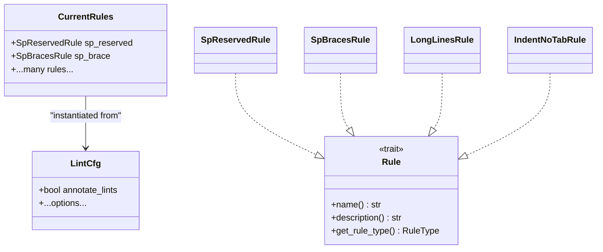
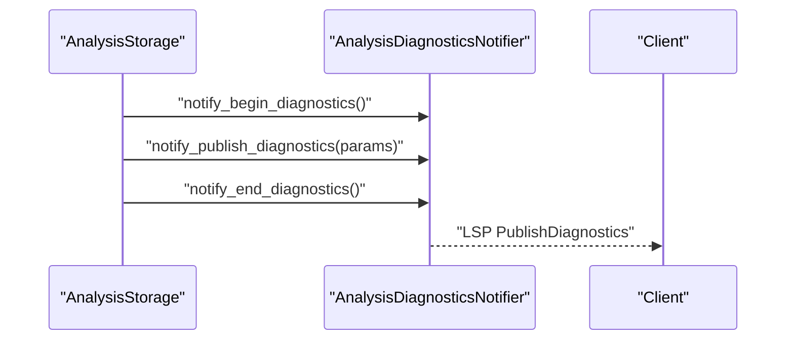
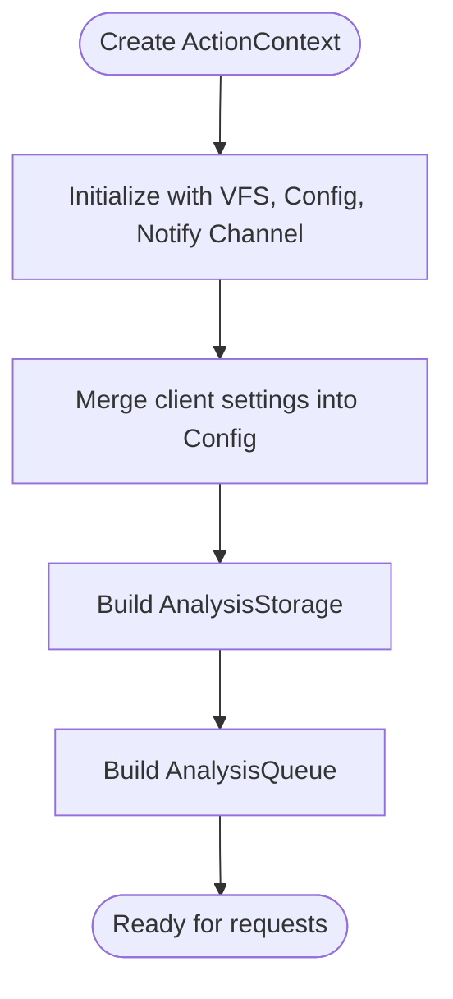
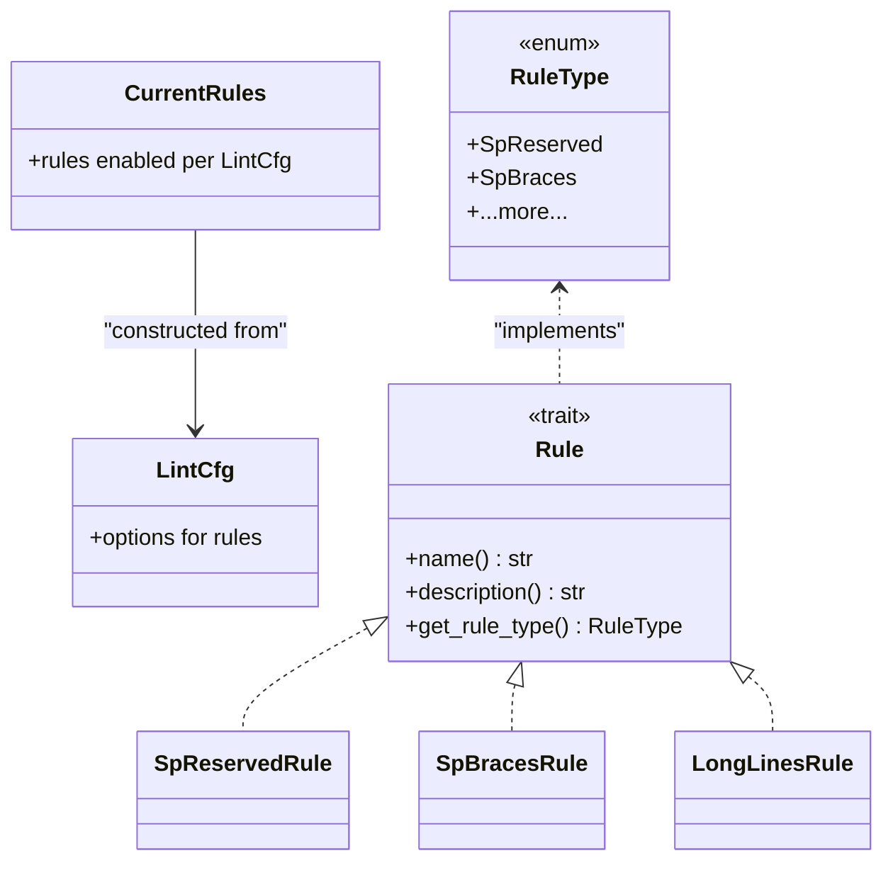
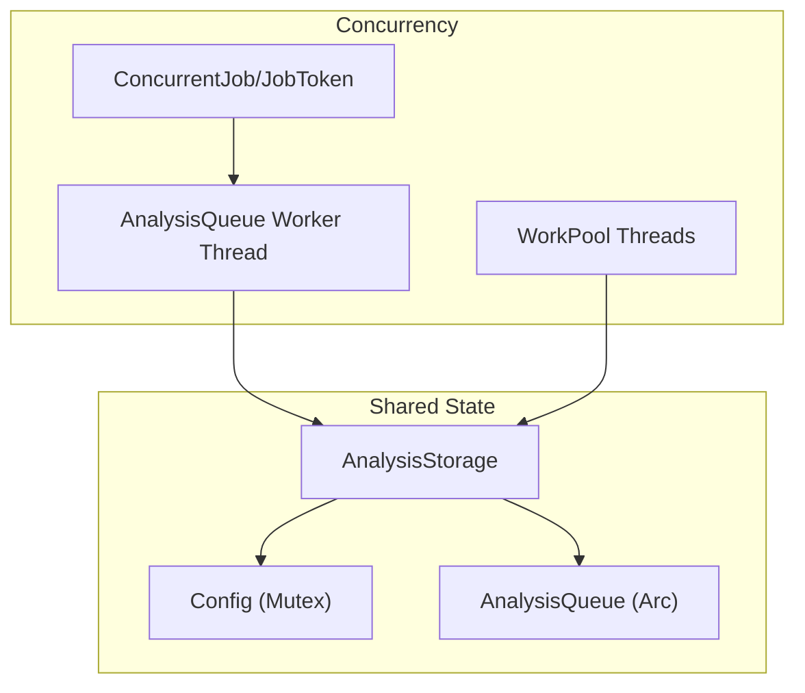
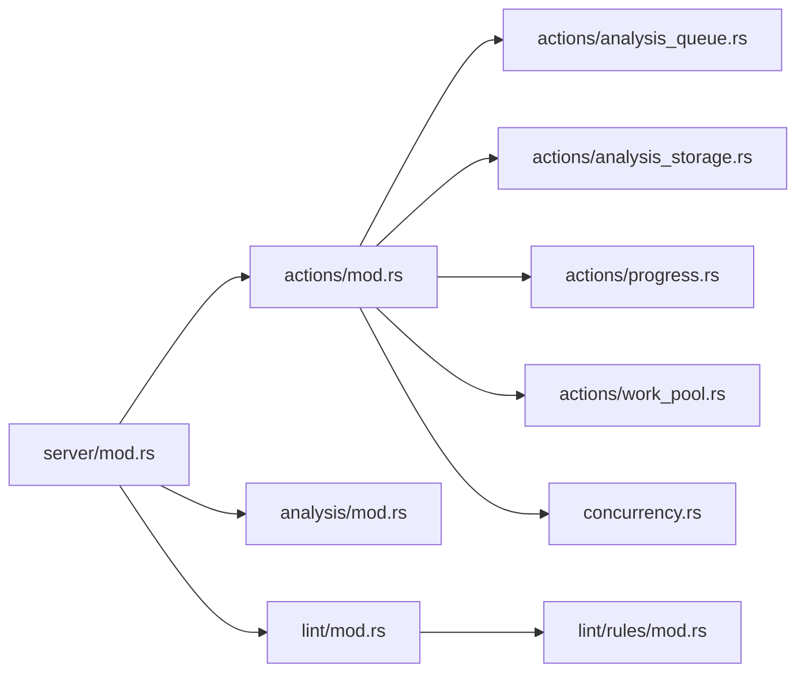

# Design Patterns and Architectural Principles

<cite>
**Referenced Files in This Document**
- [lib.rs](file://src/lib.rs)
- [main.rs](file://src/main.rs)
- [server/mod.rs](file://src/server/mod.rs)
- [actions/mod.rs](file://src/actions/mod.rs)
- [actions/analysis_queue.rs](file://src/actions/analysis_queue.rs)
- [actions/analysis_storage.rs](file://src/actions/analysis_storage.rs)
- [actions/progress.rs](file://src/actions/progress.rs)
- [actions/work_pool.rs](file://src/actions/work_pool.rs)
- [concurrency.rs](file://src/concurrency.rs)
- [analysis/mod.rs](file://src/analysis/mod.rs)
- [lint/mod.rs](file://src/lint/mod.rs)
- [lint/rules/mod.rs](file://src/lint/rules/mod.rs)
- [lint/rules/spacing.rs](file://src/lint/rules/spacing.rs)
- [lint/rules/indentation.rs](file://src/lint/rules/indentation.rs)
</cite>

## Table of Contents
1. [Introduction](#introduction)
2. [Project Structure](#project-structure)
3. [Core Components](#core-components)
4. [Architecture Overview](#architecture-overview)
5. [Detailed Component Analysis](#detailed-component-analysis)
6. [Dependency Analysis](#dependency-analysis)
7. [Performance Considerations](#performance-considerations)
8. [Troubleshooting Guide](#troubleshooting-guide)
9. [Conclusion](#conclusion)

## Introduction
This document explains the design patterns and architectural principles that underpin the DML Language Server. It focuses on how the system achieves event-driven processing, pluggable analysis, and change notifications; how layered architecture separates parsing, analysis, and presentation; how factory-like patterns dynamically create analysis contexts; and how the plugin-style linting architecture enables extensible rule sets. Concurrency is managed through coordinated queues, thread pools, and safe shared-state constructs to ensure responsiveness and correctness.

## Project Structure
The DML Language Server is organized into cohesive modules that reflect a layered architecture:
- Entry point and server orchestration
- Action coordination (event-driven handlers, queues, progress)
- Analysis subsystem (parsing, structure, templating, device analysis)
- Linting subsystem (pluggable rules, configuration)
- Concurrency primitives and work pools

**Diagram sources**
- [main.rs](file://src/main.rs#L1-L60)
- [lib.rs](file://src/lib.rs#L31-L47)
- [server/mod.rs](file://src/server/mod.rs#L68-L84)
- [actions/mod.rs](file://src/actions/mod.rs#L71-L275)
- [actions/analysis_queue.rs](file://src/actions/analysis_queue.rs#L38-L67)
- [actions/analysis_storage.rs](file://src/actions/analysis_storage.rs#L103-L129)
- [actions/progress.rs](file://src/actions/progress.rs#L48-L56)
- [actions/work_pool.rs](file://src/actions/work_pool.rs#L22-L39)
- [concurrency.rs](file://src/concurrency.rs#L22-L29)
- [analysis/mod.rs](file://src/analysis/mod.rs#L1-L28)
- [lint/mod.rs](file://src/lint/mod.rs#L37-L49)
- [lint/rules/mod.rs](file://src/lint/rules/mod.rs#L22-L41)
- [lint/rules/spacing.rs](file://src/lint/rules/spacing.rs#L24-L28)
- [lint/rules/indentation.rs](file://src/lint/rules/indentation.rs#L39-L47)

**Section sources**
- [lib.rs](file://src/lib.rs#L31-L47)
- [main.rs](file://src/main.rs#L15-L59)
- [server/mod.rs](file://src/server/mod.rs#L68-L84)

## Core Components
- ActionContext: Central persistent context that coordinates initialization, configuration, and runtime state for all requests and notifications. It encapsulates shared resources like VFS, configuration, analysis storage, and device context tracking.
- AnalysisQueue: A dedicated worker thread that serializes and executes analysis jobs (isolated, device, linter) while pruning redundant work and tracking in-flight jobs.
- AnalysisStorage: A cache of analysis results keyed by file and timestamp, with dependency graphs, import maps, and invalidation logic to keep results fresh.
- ProgressNotifiers: Traits and implementations that publish progress and diagnostics to the client via LSP notifications.
- WorkPool: A controlled thread pool for concurrent request processing with capacity limits and timeouts.
- Concurrency primitives: A lightweight job tracking mechanism using channels to coordinate long-running tasks safely.

These components collectively implement event-driven processing, layered separation, and safe concurrency.

**Section sources**
- [actions/mod.rs](file://src/actions/mod.rs#L71-L275)
- [actions/analysis_queue.rs](file://src/actions/analysis_queue.rs#L38-L67)
- [actions/analysis_storage.rs](file://src/actions/analysis_storage.rs#L103-L129)
- [actions/progress.rs](file://src/actions/progress.rs#L17-L45)
- [actions/work_pool.rs](file://src/actions/work_pool.rs#L22-L39)
- [concurrency.rs](file://src/concurrency.rs#L22-L29)

## Architecture Overview
The system follows a layered architecture:
- Presentation/LSP layer: Handles client messages, capabilities, and responses.
- Actions layer: Event-driven handlers, queues, progress, and concurrency controls.
- Analysis layer: Parsing, structure building, device analysis, and symbol/reference tracking.
- Linting layer: Pluggable rules and configuration-driven enforcement.

**Diagram sources**
- [server/mod.rs](file://src/server/mod.rs#L291-L320)
- [actions/mod.rs](file://src/actions/mod.rs#L71-L275)
- [actions/analysis_queue.rs](file://src/actions/analysis_queue.rs#L38-L67)
- [actions/analysis_storage.rs](file://src/actions/analysis_storage.rs#L103-L129)
- [actions/progress.rs](file://src/actions/progress.rs#L48-L56)
- [actions/work_pool.rs](file://src/actions/work_pool.rs#L22-L39)
- [concurrency.rs](file://src/concurrency.rs#L22-L29)
- [analysis/mod.rs](file://src/analysis/mod.rs#L1-L28)
- [lint/mod.rs](file://src/lint/mod.rs#L37-L49)
- [lint/rules/mod.rs](file://src/lint/rules/mod.rs#L22-L41)

## Detailed Component Analysis

### Actor Model Patterns: Event-Driven Processing
The server implements an event-driven loop that receives LSP messages and dispatches them to handlers. Dedicated channels carry events from the client reader thread into the main server loop, which then coordinates actions and analysis.

- Client reader thread reads messages and forwards them via a channel to the server loop.
- The server loop handles notifications synchronously, blocking requests with explicit waiting, and forwards non-blocking requests to workers.
- Analysis results are published back through channels to the server loop, which triggers progress and diagnostics notifiers.

Benefits:
- Decouples I/O from processing, enabling responsive handling of concurrent events.
- Channels provide backpressure and prevent race conditions across threads.

**Diagram sources**
- [server/mod.rs](file://src/server/mod.rs#L327-L367)
- [server/mod.rs](file://src/server/mod.rs#L382-L469)
- [actions/analysis_queue.rs](file://src/actions/analysis_queue.rs#L165-L236)
- [actions/analysis_storage.rs](file://src/actions/analysis_storage.rs#L486-L584)

**Section sources**
- [server/mod.rs](file://src/server/mod.rs#L327-L367)
- [server/mod.rs](file://src/server/mod.rs#L382-L469)
- [actions/analysis_queue.rs](file://src/actions/analysis_queue.rs#L165-L236)
- [actions/analysis_storage.rs](file://src/actions/analysis_storage.rs#L486-L584)

### Strategy Pattern: Pluggable Analysis Approaches
The system employs a strategy-like registry to select and configure analysis behaviors:
- The lint engine builds a CurrentRules structure from a LintCfg, enabling selective activation of spacing, indentation, and other rules.
- Each rule implements a common Rule trait, exposing name, description, and type, allowing dynamic instantiation and filtering.

Benefits:
- Easy addition of new rules without changing core logic.
- Config-driven enablement and tuning of analysis behaviors.

**Diagram sources**
- [lint/mod.rs](file://src/lint/mod.rs#L68-L126)
- [lint/rules/mod.rs](file://src/lint/rules/mod.rs#L22-L41)
- [lint/rules/mod.rs](file://src/lint/rules/mod.rs#L66-L81)
- [lint/rules/spacing.rs](file://src/lint/rules/spacing.rs#L24-L28)
- [lint/rules/spacing.rs](file://src/lint/rules/spacing.rs#L118-L128)
- [lint/rules/indentation.rs](file://src/lint/rules/indentation.rs#L39-L47)
- [lint/rules/indentation.rs](file://src/lint/rules/indentation.rs#L73-L83)

**Section sources**
- [lint/mod.rs](file://src/lint/mod.rs#L182-L207)
- [lint/rules/mod.rs](file://src/lint/rules/mod.rs#L43-L64)
- [lint/rules/spacing.rs](file://src/lint/rules/spacing.rs#L90-L116)
- [lint/rules/indentation.rs](file://src/lint/rules/indentation.rs#L49-L72)

### Observer Pattern: Change Notifications
The system publishes diagnostics and progress updates to the client using observer-like notifications:
- AnalysisProgressNotifier and AnalysisDiagnosticsNotifier encapsulate progress lifecycle and diagnostics publishing.
- AnalysisStorage exposes channels to deliver results and trigger notifications upon completion.

Benefits:
- Clean separation between analysis and presentation.
- Consistent notification semantics for progress and diagnostics.

**Diagram sources**
- [actions/analysis_storage.rs](file://src/actions/analysis_storage.rs#L700-L746)
- [actions/progress.rs](file://src/actions/progress.rs#L149-L190)

**Section sources**
- [actions/progress.rs](file://src/actions/progress.rs#L17-L45)
- [actions/progress.rs](file://src/actions/progress.rs#L149-L190)
- [actions/analysis_storage.rs](file://src/actions/analysis_storage.rs#L700-L746)

### Factory Pattern: Dynamic Creation of Analysis Contexts
The ActionContext acts as a factory for initializing and configuring runtime contexts:
- New contexts are created with shared VFS and configuration.
- Initialization merges client-provided settings into the persisted configuration and initializes analysis storage and queues.

Benefits:
- Encapsulates construction of complex runtime state.
- Supports dynamic reconfiguration without restarting the server.

**Diagram sources**
- [actions/mod.rs](file://src/actions/mod.rs#L71-L150)
- [actions/mod.rs](file://src/actions/mod.rs#L336-L370)

**Section sources**
- [actions/mod.rs](file://src/actions/mod.rs#L71-L150)
- [actions/mod.rs](file://src/actions/mod.rs#L336-L370)

### Plugin Architecture: Extensible Linting Rules
The linting subsystem implements a plugin-like architecture:
- Rules are grouped in a CurrentRules struct instantiated from LintCfg.
- Each rule implements a common Rule trait, enabling uniform application and filtering.
- RuleType enumeration and FromStr support dynamic rule identification and configuration.

Benefits:
- Modular rule sets that can be independently enabled/disabled.
- Configurable rule parameters and consistent error reporting.

**Diagram sources**
- [lint/mod.rs](file://src/lint/mod.rs#L68-L126)
- [lint/rules/mod.rs](file://src/lint/rules/mod.rs#L22-L41)
- [lint/rules/mod.rs](file://src/lint/rules/mod.rs#L66-L81)
- [lint/rules/mod.rs](file://src/lint/rules/mod.rs#L83-L105)

**Section sources**
- [lint/mod.rs](file://src/lint/mod.rs#L182-L207)
- [lint/rules/mod.rs](file://src/lint/rules/mod.rs#L43-L64)
- [lint/rules/mod.rs](file://src/lint/rules/mod.rs#L107-L142)

### Concurrency Patterns: Thread Pools, Async Processing, Safe Shared State
The system combines multiple concurrency mechanisms:
- AnalysisQueue runs on a dedicated worker thread and serializes job execution, pruning redundant work and tracking in-flight jobs.
- WorkPool uses a fixed-size thread pool with capacity checks and warnings for overloaded workloads.
- Concurrency primitives provide a lightweight job tracking mechanism using channels to coordinate long-running tasks safely.
- Shared state is protected with mutexes and atomic flags to ensure thread-safe access.

Benefits:
- Controlled parallelism prevents resource exhaustion.
- Safe shared state management avoids data races.
- Explicit job tracking ensures determinism for testing and graceful shutdown.

**Diagram sources**
- [actions/analysis_queue.rs](file://src/actions/analysis_queue.rs#L49-L67)
- [actions/work_pool.rs](file://src/actions/work_pool.rs#L22-L39)
- [concurrency.rs](file://src/concurrency.rs#L22-L29)
- [actions/analysis_storage.rs](file://src/actions/analysis_storage.rs#L103-L129)
- [actions/mod.rs](file://src/actions/mod.rs#L224-L266)

**Section sources**
- [actions/analysis_queue.rs](file://src/actions/analysis_queue.rs#L49-L67)
- [actions/work_pool.rs](file://src/actions/work_pool.rs#L22-L39)
- [concurrency.rs](file://src/concurrency.rs#L22-L29)
- [actions/analysis_storage.rs](file://src/actions/analysis_storage.rs#L103-L129)
- [actions/mod.rs](file://src/actions/mod.rs#L224-L266)

## Dependency Analysis
The codebase exhibits low coupling and high cohesion:
- Server depends on actions for orchestration and on analysis/lint for domain logic.
- Actions depend on concurrency primitives and VFS for I/O and synchronization.
- Analysis and lint modules are largely self-contained and configurable.

**Diagram sources**
- [server/mod.rs](file://src/server/mod.rs#L68-L84)
- [actions/mod.rs](file://src/actions/mod.rs#L71-L275)
- [actions/analysis_queue.rs](file://src/actions/analysis_queue.rs#L38-L67)
- [actions/analysis_storage.rs](file://src/actions/analysis_storage.rs#L103-L129)
- [actions/progress.rs](file://src/actions/progress.rs#L48-L56)
- [actions/work_pool.rs](file://src/actions/work_pool.rs#L22-L39)
- [concurrency.rs](file://src/concurrency.rs#L22-L29)
- [analysis/mod.rs](file://src/analysis/mod.rs#L1-L28)
- [lint/mod.rs](file://src/lint/mod.rs#L37-L49)
- [lint/rules/mod.rs](file://src/lint/rules/mod.rs#L22-L41)

**Section sources**
- [server/mod.rs](file://src/server/mod.rs#L68-L84)
- [actions/mod.rs](file://src/actions/mod.rs#L71-L275)

## Performance Considerations
- Queue-based analysis serialization reduces contention and avoids redundant work by pruning identical jobs and tracking dependencies.
- WorkPool limits concurrent work to prevent overload and provides warnings for long-running tasks.
- Incremental invalidation and timestamp-based freshness ensure stale results are not served.
- Parallel traversal and caching minimize repeated computations across dependent files.

[No sources needed since this section provides general guidance]

## Troubleshooting Guide
Common issues and mitigations:
- Excessive work capacity: WorkPool warns when capacity is reached; consider reducing concurrent work or increasing thread count.
- Stalled analysis: AnalysisQueue tracks in-flight jobs and device/dependency graphs; inspect queue/device trackers to diagnose bottlenecks.
- Missing builtins: The server emits warnings when required builtin files are absent, affecting semantic analysis.
- Configuration errors: Unknown lint fields are reported to the client; verify lint configuration JSON.

**Section sources**
- [actions/work_pool.rs](file://src/actions/work_pool.rs#L60-L78)
- [actions/work_pool.rs](file://src/actions/work_pool.rs#L95-L101)
- [server/mod.rs](file://src/server/mod.rs#L167-L181)
- [actions/mod.rs](file://src/actions/mod.rs#L731-L743)
- [lint/mod.rs](file://src/lint/mod.rs#L51-L64)

## Conclusion
The DML Language Server applies robust design patterns and architectural principles:
- Event-driven processing with channels and a central server loop
- Strategy pattern for pluggable linting rules
- Observer pattern for diagnostics and progress
- Layered architecture separating parsing, analysis, and presentation
- Factory pattern for dynamic context initialization
- Concurrency patterns with queues, thread pools, and safe shared state

These patterns collectively improve maintainability, scalability, and responsiveness, enabling extensible linting and efficient analysis workflows.