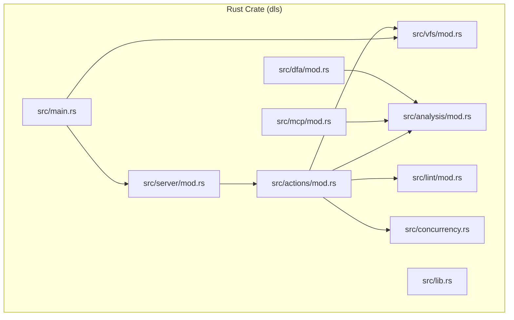
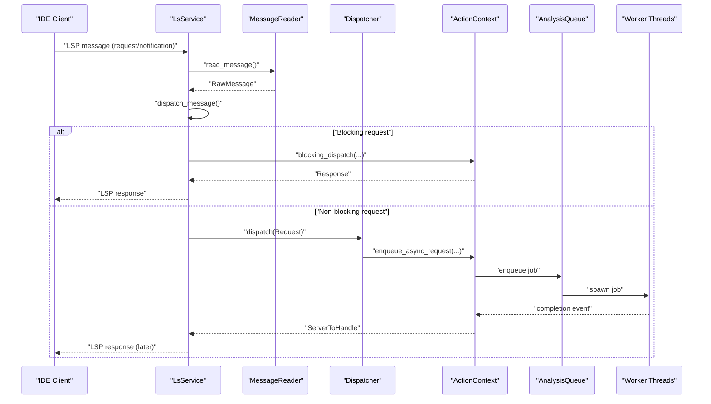
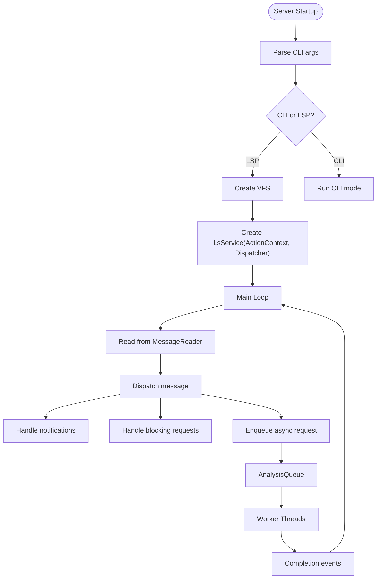
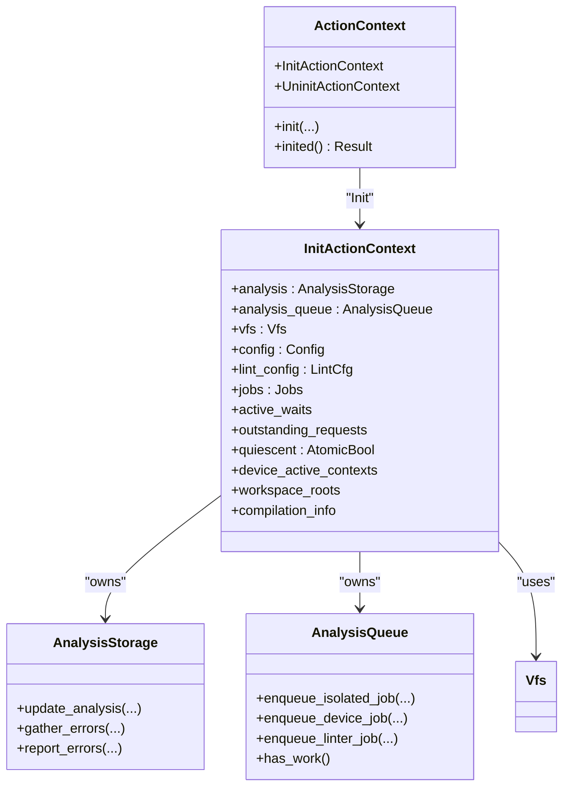
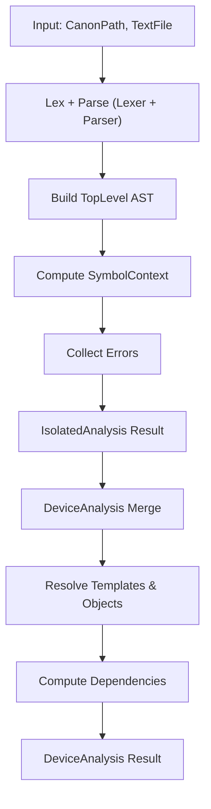
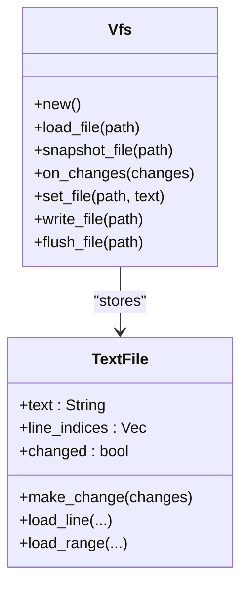
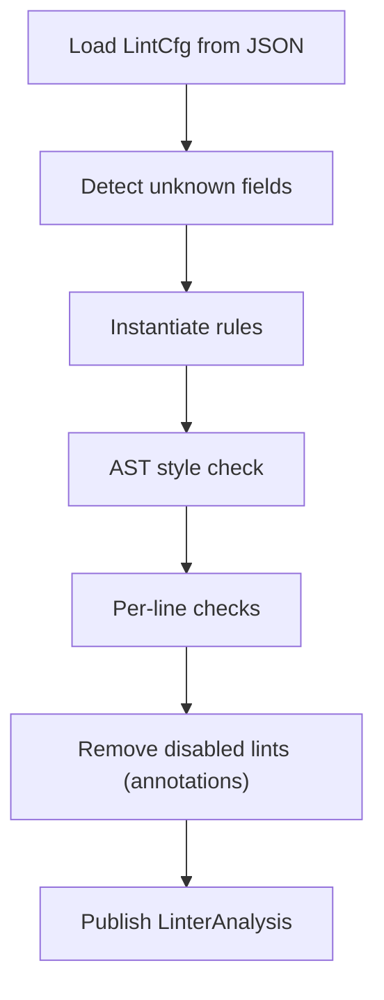
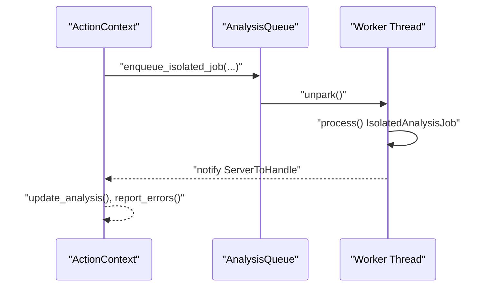
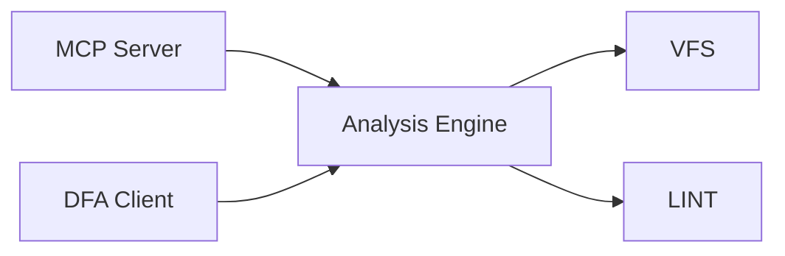
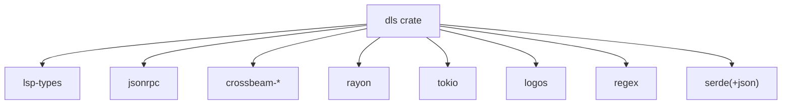

# System Overview

<cite>
**Referenced Files in This Document**
- [README.md](file://README.md)
- [Cargo.toml](file://Cargo.toml)
- [src/main.rs](file://src/main.rs)
- [src/lib.rs](file://src/lib.rs)
- [src/server/mod.rs](file://src/server/mod.rs)
- [src/actions/mod.rs](file://src/actions/mod.rs)
- [src/actions/analysis_queue.rs](file://src/actions/analysis_queue.rs)
- [src/actions/work_pool.rs](file://src/actions/work_pool.rs)
- [src/vfs/mod.rs](file://src/vfs/mod.rs)
- [src/analysis/mod.rs](file://src/analysis/mod.rs)
- [src/lint/mod.rs](file://src/lint/mod.rs)
- [src/concurrency.rs](file://src/concurrency.rs)
- [src/dfa/mod.rs](file://src/dfa/mod.rs)
- [src/mcp/mod.rs](file://src/mcp/mod.rs)
</cite>

## Table of Contents
1. [Introduction](#introduction)
2. [Project Structure](#project-structure)
3. [Core Components](#core-components)
4. [Architecture Overview](#architecture-overview)
5. [Detailed Component Analysis](#detailed-component-analysis)
6. [Dependency Analysis](#dependency-analysis)
7. [Performance Considerations](#performance-considerations)
8. [Troubleshooting Guide](#troubleshooting-guide)
9. [Conclusion](#conclusion)

## Introduction
This document provides a system overview of the DML Language Server (DLS), an IDE backend that delivers DML device modeling support via the Language Server Protocol (LSP). The system focuses on DML 1.4 and offers syntax and semantic analysis, symbol navigation (Go-to Definition, References, Implementation, Base), document symbols, workspace symbols, hover, and configurable linting. It is designed around an event-driven architecture with asynchronous processing to efficiently handle multiple concurrent requests and background analysis tasks.

The DLS is implemented in Rust and exposes:
- A language server binary for LSP communication
- A Model Context Protocol (MCP) server for code generation assistance
- A Device Context Analysis (DFA) client interface for device-specific analysis

## Project Structure
The repository is organized into a Rust library crate with multiple binaries and modules. The primary modules include the server, actions, analysis, VFS, linting, concurrency primitives, and MCP/DFAs. The structure emphasizes separation of concerns and modularity.

**Diagram sources**
- [src/main.rs](file://src/main.rs#L1-L60)
- [src/lib.rs](file://src/lib.rs#L31-L45)
- [src/server/mod.rs](file://src/server/mod.rs#L68-L84)
- [src/actions/mod.rs](file://src/actions/mod.rs#L70-L150)
- [src/vfs/mod.rs](file://src/vfs/mod.rs#L29-L184)
- [src/analysis/mod.rs](file://src/analysis/mod.rs#L1-L100)
- [src/lint/mod.rs](file://src/lint/mod.rs#L1-L50)
- [src/concurrency.rs](file://src/concurrency.rs#L22-L86)
- [src/mcp/mod.rs](file://src/mcp/mod.rs#L1-L54)
- [src/dfa/mod.rs](file://src/dfa/mod.rs#L1-L6)

**Section sources**
- [Cargo.toml](file://Cargo.toml#L1-L62)
- [src/main.rs](file://src/main.rs#L1-L60)
- [src/lib.rs](file://src/lib.rs#L31-L45)

## Core Components
- Language Server Protocol (LSP) implementation: Handles LSP messages, initializes the server, manages capabilities, and routes requests and notifications.
- Action coordination system: Centralized context and queues for analysis, device context management, diagnostics publishing, and progress reporting.
- Analysis engine: Parses DML, builds ASTs, resolves symbols, scopes, references, and performs device-level analysis.
- Virtual File System (VFS): Manages in-memory snapshots of open files, supports incremental edits, and coordinates with analysis.
- Linting subsystem: Provides configurable style linting with rule sets and per-file annotations.
- Concurrency and work pools: Structured async execution for analysis jobs and request handling.
- MCP server: Offers model context protocol services for code generation and tooling.
- DFA client: Integrates device context analysis for DML device modeling.

**Section sources**
- [src/server/mod.rs](file://src/server/mod.rs#L68-L84)
- [src/actions/mod.rs](file://src/actions/mod.rs#L70-L150)
- [src/analysis/mod.rs](file://src/analysis/mod.rs#L292-L415)
- [src/vfs/mod.rs](file://src/vfs/mod.rs#L180-L288)
- [src/lint/mod.rs](file://src/lint/mod.rs#L37-L126)
- [src/concurrency.rs](file://src/concurrency.rs#L22-L86)
- [src/mcp/mod.rs](file://src/mcp/mod.rs#L1-L54)
- [src/dfa/mod.rs](file://src/dfa/mod.rs#L1-L6)

## Architecture Overview
The DLS follows an event-driven architecture:
- A dedicated server loop reads LSP messages from stdin/stdout, dispatches them to handlers, and coordinates asynchronous analysis via channels and queues.
- The ActionContext maintains persistent state across requests, including VFS, analysis storage, configuration, device contexts, and progress notifiers.
- AnalysisQueue serializes and executes analysis jobs (isolated, device, linter) on worker threads, emitting completion events back to the main loop.
- WorkPool provides a controlled thread pool for request-level computations with capacity limits and warnings for long-running tasks.
- VFS caches file contents and supports incremental edits, ensuring analysis operates on consistent snapshots.

**Diagram sources**
- [src/server/mod.rs](file://src/server/mod.rs#L322-L470)
- [src/server/mod.rs](file://src/server/mod.rs#L472-L598)
- [src/actions/analysis_queue.rs](file://src/actions/analysis_queue.rs#L165-L236)
- [src/actions/work_pool.rs](file://src/actions/work_pool.rs#L53-L103)

## Detailed Component Analysis

### Language Server Protocol Implementation
- Entry point initializes logging, parses CLI arguments, and starts either CLI mode or the LSP server with a shared VFS.
- The LsService constructs an ActionContext, a Dispatcher, and a bounded channel for inter-thread messaging.
- The server loop:
  - Reads messages on a background thread and forwards parsed messages to the main loop via a channel.
  - Dispatches notifications immediately, blocking requests synchronously, and non-blocking requests asynchronously.
  - Emits diagnostics, progress updates, and handles shutdown gracefully by awaiting concurrent jobs.

**Diagram sources**
- [src/main.rs](file://src/main.rs#L44-L59)
- [src/server/mod.rs](file://src/server/mod.rs#L68-L84)
- [src/server/mod.rs](file://src/server/mod.rs#L322-L470)

**Section sources**
- [src/main.rs](file://src/main.rs#L15-L59)
- [src/server/mod.rs](file://src/server/mod.rs#L68-L84)
- [src/server/mod.rs](file://src/server/mod.rs#L322-L470)

### Action Coordination System
- ActionContext encapsulates:
  - AnalysisStorage and AnalysisQueue for managing isolated/device/linter analyses.
  - VFS for file snapshots and edits.
  - Configuration and lint configuration.
  - Device active contexts and workspace roots.
  - Outstanding requests and waits for analysis state.
  - Progress and diagnostics notifiers.
- Methods orchestrate:
  - Isolated analysis scheduling and dependency resolution.
  - Device analysis triggering based on dependency freshness.
  - Lint analysis scheduling and re-reporting based on configuration changes.
  - Reporting diagnostics to the client and progress notifications.

**Diagram sources**
- [src/actions/mod.rs](file://src/actions/mod.rs#L70-L150)
- [src/actions/mod.rs](file://src/actions/mod.rs#L224-L266)
- [src/actions/analysis_queue.rs](file://src/actions/analysis_queue.rs#L38-L67)

**Section sources**
- [src/actions/mod.rs](file://src/actions/mod.rs#L70-L150)
- [src/actions/mod.rs](file://src/actions/mod.rs#L224-L266)

### Analysis Engine
- IsolatedAnalysis: Builds AST and toplevel structure for a single file, captures errors, and stores client path for accurate diagnostics.
- DeviceAnalysis: Aggregates multiple isolated analyses, resolves device objects, templates, and references, and computes dependent files.
- Symbol and scope management: Tracks template, parameter, object, method, and variable symbols with contextual disambiguation.
- Reference resolution: Resolves references to symbols with cache keys derived from context and reference chains.

**Diagram sources**
- [src/analysis/mod.rs](file://src/analysis/mod.rs#L292-L315)
- [src/analysis/mod.rs](file://src/analysis/mod.rs#L393-L409)

**Section sources**
- [src/analysis/mod.rs](file://src/analysis/mod.rs#L292-L415)

### Virtual File System (VFS)
- Provides in-memory snapshots of files, supports incremental edits (add, replace text), and ensures thread-safe access.
- Maintains line indices for fast line-based operations and tracks whether files are changed vs. synced.
- Coordinates with analysis by providing consistent snapshots for parsing and linting.

**Diagram sources**
- [src/vfs/mod.rs](file://src/vfs/mod.rs#L180-L288)
- [src/vfs/mod.rs](file://src/vfs/mod.rs#L655-L661)

**Section sources**
- [src/vfs/mod.rs](file://src/vfs/mod.rs#L180-L288)

### Linting Subsystem
- Parses lint configuration from JSON, detects unknown fields, and applies defaults.
- Performs style checks against AST and per-line rules, supports per-line and per-file annotations to selectively disable rules.
- Produces lint errors enriched with optional rule identifiers and integrates with analysis storage.

**Diagram sources**
- [src/lint/mod.rs](file://src/lint/mod.rs#L37-L64)
- [src/lint/mod.rs](file://src/lint/mod.rs#L181-L207)

**Section sources**
- [src/lint/mod.rs](file://src/lint/mod.rs#L37-L126)
- [src/lint/mod.rs](file://src/lint/mod.rs#L181-L229)

### Concurrency and Work Pools
- ConcurrentJob and Jobs provide structured lifecycle management for long-running tasks with channel-based completion signaling.
- AnalysisQueue serializes analysis work, avoids redundant jobs, and unparks worker threads on new tasks.
- WorkPool controls concurrency for request-level computations, tracks active work types, and warns on long-running tasks.

**Diagram sources**
- [src/concurrency.rs](file://src/concurrency.rs#L22-L86)
- [src/actions/analysis_queue.rs](file://src/actions/analysis_queue.rs#L165-L236)

**Section sources**
- [src/concurrency.rs](file://src/concurrency.rs#L22-L86)
- [src/actions/analysis_queue.rs](file://src/actions/analysis_queue.rs#L38-L67)
- [src/actions/work_pool.rs](file://src/actions/work_pool.rs#L22-L103)

### MCP and DFA Integration
- MCP server: Exposes capabilities for tools/resources/prompts/logging and integrates with analysis for code generation.
- DFA client: Provides a client interface for device context analysis, enabling device-specific modeling workflows.

**Diagram sources**
- [src/mcp/mod.rs](file://src/mcp/mod.rs#L1-L54)
- [src/dfa/mod.rs](file://src/dfa/mod.rs#L1-L6)
- [src/analysis/mod.rs](file://src/analysis/mod.rs#L1-L100)

**Section sources**
- [src/mcp/mod.rs](file://src/mcp/mod.rs#L1-L54)
- [src/dfa/mod.rs](file://src/dfa/mod.rs#L1-L6)

## Dependency Analysis
The DLS relies on several key libraries and patterns:
- LSP and JSON-RPC for protocol handling.
- Crossbeam channels for thread-safe message passing.
- Rayon for controlled parallelism in request work pool.
- Tokio for async runtime features.
- Logos for lexical analysis and regex for lint annotations.

**Diagram sources**
- [Cargo.toml](file://Cargo.toml#L33-L62)

**Section sources**
- [Cargo.toml](file://Cargo.toml#L33-L62)

## Performance Considerations
- Asynchronous analysis: AnalysisQueue serializes work to avoid redundant computations and to coordinate expensive device analysis based on dependency freshness.
- Controlled concurrency: WorkPool caps simultaneous work items and warns on long-running tasks to maintain responsiveness.
- Incremental VFS: Snapshots and line indices enable efficient parsing and linting without touching disk.
- Progress reporting: Begin/end progress notifications keep the client informed during long operations.

[No sources needed since this section provides general guidance]

## Troubleshooting Guide
- Unknown or deprecated configuration keys: The server emits warnings for unknown keys and deprecations, and duplicates are reported with a warning message.
- Unknown lint configuration fields: Unknown fields are detected and reported as errors to guide configuration correction.
- Missing built-in files: If essential built-in templates are not found, the server warns that semantic analysis may be impaired.
- Parsing and read errors: On malformed messages or read failures, the server responds with standardized JSON-RPC errors and may signal an exit code.

**Section sources**
- [src/server/mod.rs](file://src/server/mod.rs#L109-L205)
- [src/lint/mod.rs](file://src/lint/mod.rs#L37-L64)
- [src/actions/mod.rs](file://src/actions/mod.rs#L731-L743)

## Conclusion
The DML Language Server is a modular, event-driven system that combines LSP, asynchronous analysis, and structured concurrency to deliver robust IDE support for DML device modeling. Its layered architecture—server, actions, analysis, VFS, linting, and MCP/DFAs—enables independent development and maintenance while ensuring efficient handling of concurrent requests and background tasks. The design emphasizes correctness, configurability, and scalability for evolving DML modeling needs.