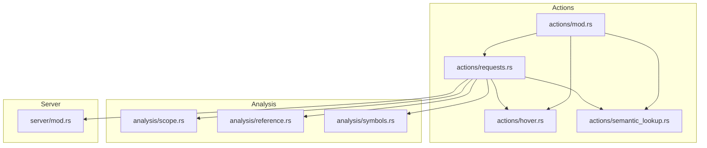
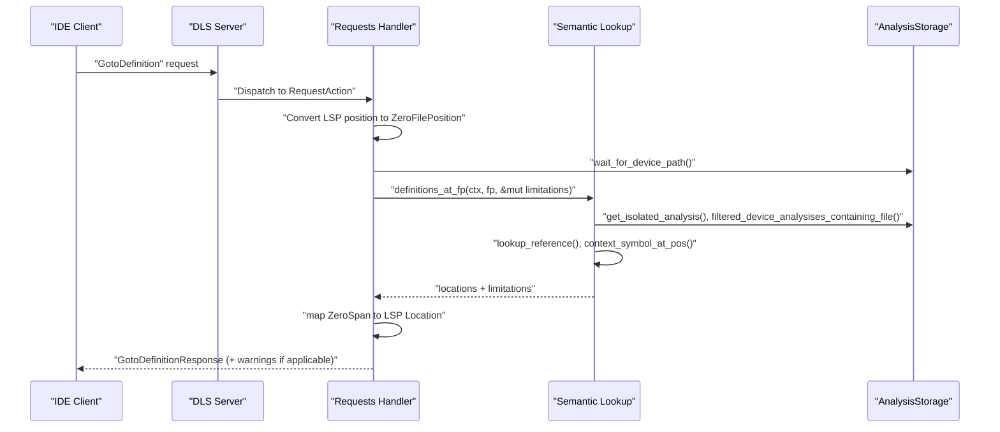
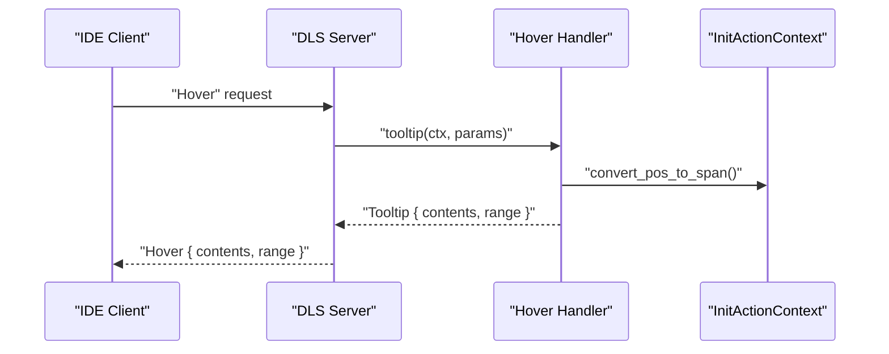
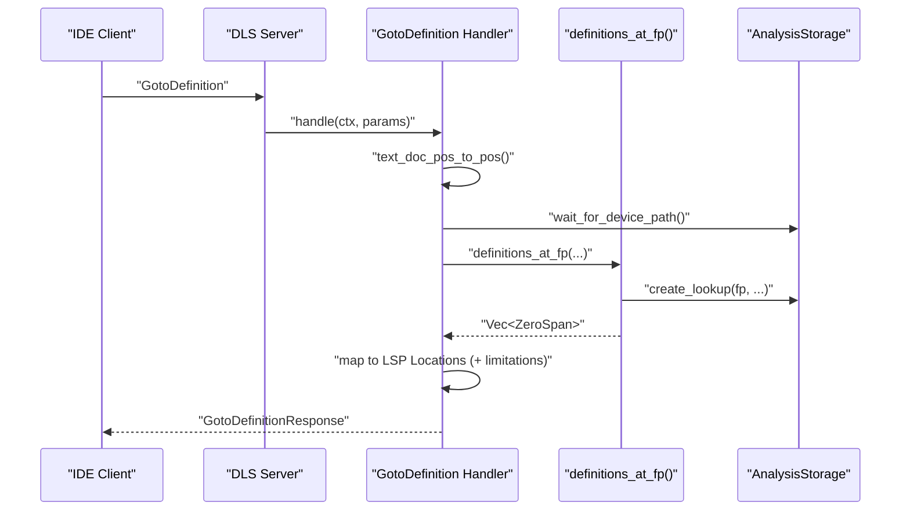
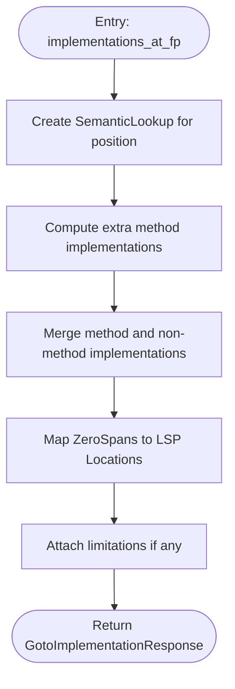
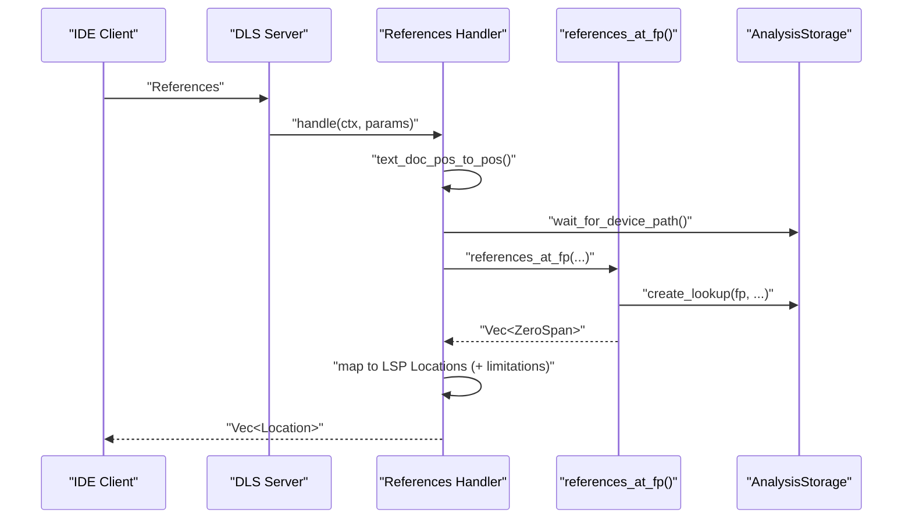
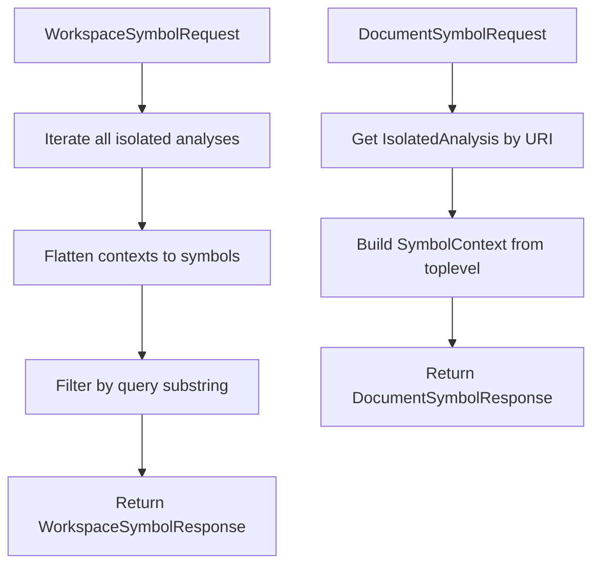
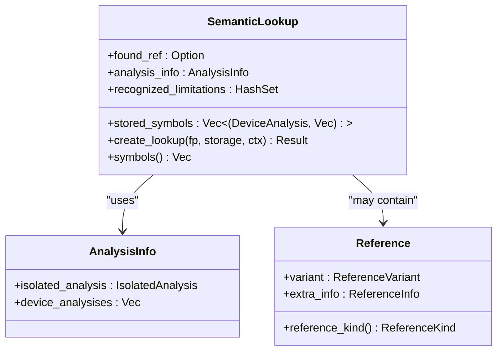
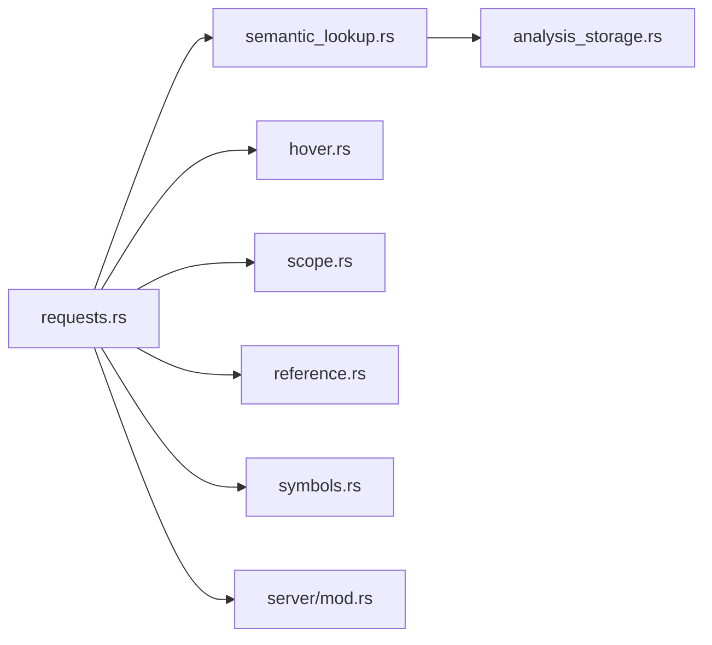

# Code Intelligence Features

<cite>
**Referenced Files in This Document**
- [hover.rs](file://src/actions/hover.rs)
- [semantic_lookup.rs](file://src/actions/semantic_lookup.rs)
- [requests.rs](file://src/actions/requests.rs)
- [scope.rs](file://src/analysis/scope.rs)
- [reference.rs](file://src/analysis/reference.rs)
- [symbols.rs](file://src/analysis/symbols.rs)
- [analysis_storage.rs](file://src/actions/analysis_storage.rs)
- [mod.rs](file://src/actions/mod.rs)
- [server/mod.rs](file://src/server/mod.rs)
</cite>

## Table of Contents
1. [Introduction](#introduction)
2. [Project Structure](#project-structure)
3. [Core Components](#core-components)
4. [Architecture Overview](#architecture-overview)
5. [Detailed Component Analysis](#detailed-component-analysis)
6. [Dependency Analysis](#dependency-analysis)
7. [Performance Considerations](#performance-considerations)
8. [Troubleshooting Guide](#troubleshooting-guide)
9. [Conclusion](#conclusion)

## Introduction
This document explains the code intelligence features of the DML Language Server (DLS), focusing on hover information, go-to-definition/navigation, symbol search, and semantic lookup. It details how the server resolves references, maps positions to symbols, and computes navigational targets such as definitions, declarations, implementations, and references. It also covers limitations, caching, update propagation, and integration with IDE features.

## Project Structure
The code intelligence features are implemented across several modules:
- Actions: request handlers and semantic lookup orchestration
- Analysis: symbol and reference models, scoping, and lookup
- Server: LSP integration and capability advertisement

**Diagram sources**
- [mod.rs](file://src/actions/mod.rs#L88-L96)
- [hover.rs](file://src/actions/hover.rs#L1-L30)
- [semantic_lookup.rs](file://src/actions/semantic_lookup.rs#L1-L399)
- [requests.rs](file://src/actions/requests.rs#L1-L998)
- [scope.rs](file://src/analysis/scope.rs#L1-L200)
- [reference.rs](file://src/analysis/reference.rs#L1-L220)
- [symbols.rs](file://src/analysis/symbols.rs#L1-L331)
- [server/mod.rs](file://src/server/mod.rs#L1-L200)

**Section sources**
- [mod.rs](file://src/actions/mod.rs#L88-L96)
- [server/mod.rs](file://src/server/mod.rs#L33-L45)

## Core Components
- Hover tooltip builder: constructs hover content and selection range for a given cursor position.
- Semantic lookup: resolves symbols and references at a position across isolated and device analyses, aggregates limitations, and maps references to symbols.
- Navigation handlers: GotoDefinition, GotoDeclaration, GotoImplementation, and FindReferences.
- Symbol and reference models: typed symbol kinds, symbol containers, and reference kinds.
- Scoping: context-aware symbol lookup and nested symbol trees.
- Storage and update propagation: analysis storage with invalidation, dependencies, and device triggers.

**Section sources**
- [hover.rs](file://src/actions/hover.rs#L12-L29)
- [semantic_lookup.rs](file://src/actions/semantic_lookup.rs#L80-L129)
- [requests.rs](file://src/actions/requests.rs#L354-L612)
- [symbols.rs](file://src/analysis/symbols.rs#L19-L34)
- [scope.rs](file://src/analysis/scope.rs#L13-L62)
- [analysis_storage.rs](file://src/actions/analysis_storage.rs#L102-L128)

## Architecture Overview
The DLS integrates with the LSP by registering capabilities and handling requests. Navigation requests resolve a zero-indexed file position to a set of locations, optionally augmented with warnings when internal limitations apply.

**Diagram sources**
- [requests.rs](file://src/actions/requests.rs#L500-L554)
- [semantic_lookup.rs](file://src/actions/semantic_lookup.rs#L131-L147)
- [analysis_storage.rs](file://src/actions/analysis_storage.rs#L173-L187)

## Detailed Component Analysis

### Hover Information System
- Purpose: Provide contextual information on hover.
- Behavior: Converts LSP position to internal span, builds a tooltip with content and range, and returns an LSP hover response.
- Current state: Content list is empty; future enhancements can populate content from symbol metadata or reference context.

**Diagram sources**
- [hover.rs](file://src/actions/hover.rs#L19-L29)
- [requests.rs](file://src/actions/requests.rs#L354-L380)

**Section sources**
- [hover.rs](file://src/actions/hover.rs#L12-L29)
- [requests.rs](file://src/actions/requests.rs#L354-L380)

### Go-To Definition and Declaration
- Definition resolution: Finds symbol definitions for the located symbol or reference. For methods, may prefer implementations or definitions depending on context.
- Declaration resolution: Returns base declarations for methods/parameters; otherwise declarations.

**Diagram sources**
- [requests.rs](file://src/actions/requests.rs#L500-L554)
- [semantic_lookup.rs](file://src/actions/semantic_lookup.rs#L347-L361)

**Section sources**
- [requests.rs](file://src/actions/requests.rs#L500-L554)
- [semantic_lookup.rs](file://src/actions/semantic_lookup.rs#L319-L361)

### Go-To Implementation
- Implementation resolution: Aggregates direct implementations and recursively expands method overrides to include indirect overrides. Also returns implementations for non-method symbols.

**Diagram sources**
- [semantic_lookup.rs](file://src/actions/semantic_lookup.rs#L287-L317)
- [semantic_lookup.rs](file://src/actions/semantic_lookup.rs#L235-L281)

**Section sources**
- [semantic_lookup.rs](file://src/actions/semantic_lookup.rs#L287-L317)
- [semantic_lookup.rs](file://src/actions/semantic_lookup.rs#L235-L281)

### Find References
- Reference resolution: Maps a position to symbols and returns all referenced locations across device analyses.

**Diagram sources**
- [requests.rs](file://src/actions/requests.rs#L556-L612)
- [semantic_lookup.rs](file://src/actions/semantic_lookup.rs#L385-L399)

**Section sources**
- [requests.rs](file://src/actions/requests.rs#L556-L612)
- [semantic_lookup.rs](file://src/actions/semantic_lookup.rs#L385-L399)

### Symbol Search and Document Symbols
- Workspace symbol search: Flattens isolated analysis contexts into workspace symbols with kind mapping and location.
- Document symbols: Builds nested document symbols from the top-level context.

**Diagram sources**
- [requests.rs](file://src/actions/requests.rs#L276-L303)
- [requests.rs](file://src/actions/requests.rs#L305-L342)

**Section sources**
- [requests.rs](file://src/actions/requests.rs#L276-L342)

### Semantic Lookup Mechanisms and Cross-Reference Resolution
- Position to symbol/reference: Uses isolated analysis to locate a reference or contexted symbol at the given position.
- Device filtering: Restricts device analyses to active contexts to avoid irrelevant results.
- Reference mapping: Converts a reference to symbols across device analyses, handling template instantiation and limitations.
- Limitations: Records known limitations (e.g., type semantics, uninstantiated templates) and surfaces them conditionally.

**Diagram sources**
- [semantic_lookup.rs](file://src/actions/semantic_lookup.rs#L75-L129)
- [semantic_lookup.rs](file://src/actions/semantic_lookup.rs#L131-L147)
- [reference.rs](file://src/analysis/reference.rs#L118-L122)

**Section sources**
- [semantic_lookup.rs](file://src/actions/semantic_lookup.rs#L88-L129)
- [semantic_lookup.rs](file://src/actions/semantic_lookup.rs#L149-L223)
- [reference.rs](file://src/analysis/reference.rs#L96-L102)

### Handling Overloaded Symbols and Large Codebases
- Overloads: The system resolves to all matching symbols at a position; IDE clients typically present a picker. Limitations may apply for template and type references.
- Large codebases: Device analysis is filtered by active contexts and triggered only when dependencies are outdated. Storage tracks dependencies and invalidators to minimize recomputation.

**Section sources**
- [semantic_lookup.rs](file://src/actions/semantic_lookup.rs#L68-L73)
- [analysis_storage.rs](file://src/actions/analysis_storage.rs#L102-L128)
- [analysis_storage.rs](file://src/actions/analysis_storage.rs#L173-L187)

### IDE Integration and Capabilities
- Capability advertisement: The server declares hover, implementation, and workspace/document symbol capabilities.
- Request timeouts: Navigation requests use extended timeouts to accommodate device analysis.
- Limitation warnings: Responses can include warnings when partial results are returned due to internal limitations.

**Section sources**
- [server/mod.rs](file://src/server/mod.rs#L33-L45)
- [requests.rs](file://src/actions/requests.rs#L387-L389)
- [requests.rs](file://src/actions/requests.rs#L446-L448)
- [requests.rs](file://src/actions/requests.rs#L503-L505)
- [requests.rs](file://src/actions/requests.rs#L559-L561)

## Dependency Analysis
The navigation and hover features depend on:
- Request handlers for LSP requests
- Semantic lookup for position-to-symbol/reference resolution
- Analysis storage for isolated/device/lint analyses
- Scope and symbol/reference models for symbol trees and reference kinds

**Diagram sources**
- [requests.rs](file://src/actions/requests.rs#L12-L56)
- [semantic_lookup.rs](file://src/actions/semantic_lookup.rs#L11-L22)
- [hover.rs](file://src/actions/hover.rs#L8-L10)
- [scope.rs](file://src/analysis/scope.rs#L3-L7)
- [reference.rs](file://src/analysis/reference.rs#L3-L6)
- [symbols.rs](file://src/analysis/symbols.rs#L3-L8)
- [analysis_storage.rs](file://src/actions/analysis_storage.rs#L16-L27)
- [server/mod.rs](file://src/server/mod.rs#L33-L45)

**Section sources**
- [requests.rs](file://src/actions/requests.rs#L12-L56)
- [semantic_lookup.rs](file://src/actions/semantic_lookup.rs#L11-L22)
- [analysis_storage.rs](file://src/actions/analysis_storage.rs#L16-L27)

## Performance Considerations
- Extended timeouts for navigation requests to allow device analysis to complete.
- Device analysis is triggered only when dependencies are outdated and device files require re-analysis.
- Storage maintains last-use timestamps and invalidators to prune stale results.
- Limitations reduce redundant computation by surfacing known constraints early.

Recommendations:
- Cache symbol and reference sets per-file to avoid repeated traversal.
- Use incremental updates for device analysis when only subsets of files change.
- Surface limitations promptly to prevent unnecessary client-side retries.

**Section sources**
- [requests.rs](file://src/actions/requests.rs#L387-L389)
- [requests.rs](file://src/actions/requests.rs#L446-L448)
- [requests.rs](file://src/actions/requests.rs#L503-L505)
- [requests.rs](file://src/actions/requests.rs#L559-L561)
- [analysis_storage.rs](file://src/actions/analysis_storage.rs#L108-L110)
- [analysis_storage.rs](file://src/actions/analysis_storage.rs#L502-L508)

## Troubleshooting Guide
Common scenarios and handling:
- Missing device analysis: The server warns that semantic analysis requires a device file and suggests opening one that imports the target file.
- Missing isolated analysis: Indicates parsing or indexing is incomplete; the handler falls back gracefully.
- Type semantics limitation: Certain type-related references cannot be resolved; the server attaches a warning with a link to the issue.
- Uninstantiated templates: References inside templates without an instantiating object yield a limitation; the server suggests opening a device file that uses the template.

Mitigation steps:
- Ensure a device file is open that imports the target file.
- Verify workspace roots and compilation info paths.
- Review limitation warnings and adjust expectations accordingly.

**Section sources**
- [requests.rs](file://src/actions/requests.rs#L60-L87)
- [semantic_lookup.rs](file://src/actions/semantic_lookup.rs#L44-L62)
- [semantic_lookup.rs](file://src/actions/semantic_lookup.rs#L214-L221)

## Conclusion
The DLS provides robust code intelligence through precise semantic lookup, navigation handlers, and capability-driven LSP responses. While some features remain under development (e.g., hover content), the foundation supports efficient navigation, symbol search, and scalable handling of large codebases via targeted device analysis and storage invalidation.