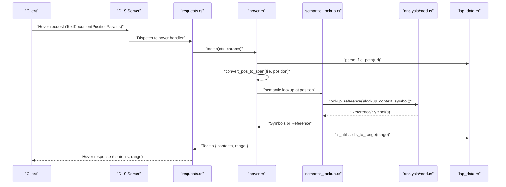
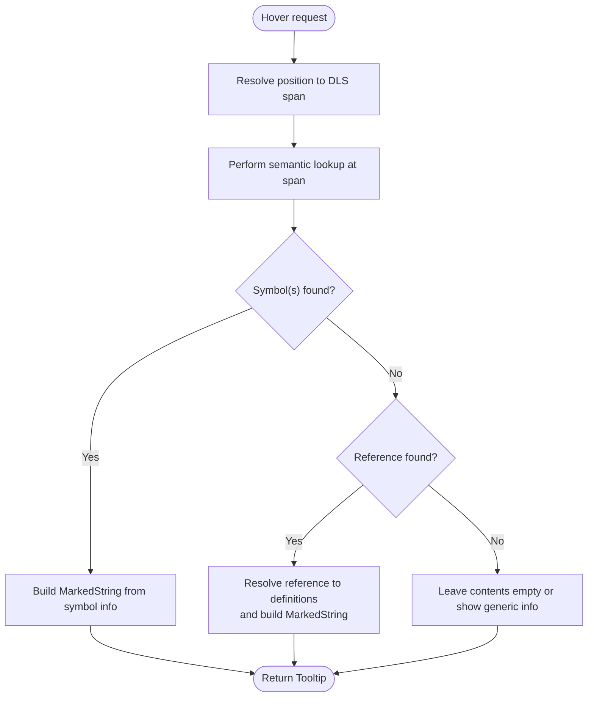
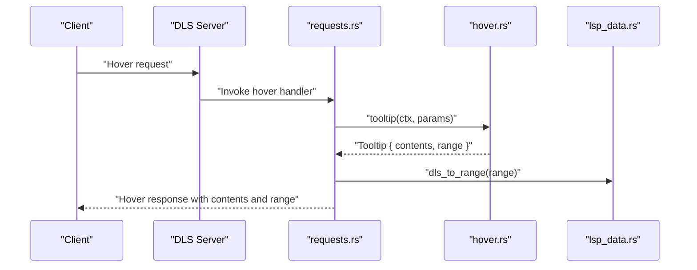
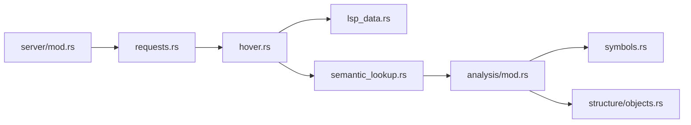

# Hover Information System

<cite>
**Referenced Files in This Document**
- [hover.rs](file://src/actions/hover.rs)
- [requests.rs](file://src/actions/requests.rs)
- [lsp_data.rs](file://src/lsp_data.rs)
- [semantic_lookup.rs](file://src/actions/semantic_lookup.rs)
- [mod.rs](file://src/actions/mod.rs)
- [objects.rs](file://src/analysis/structure/objects.rs)
- [symbols.rs](file://src/analysis/symbols.rs)
- [mod.rs](file://src/analysis/mod.rs)
- [server.rs](file://src/server/mod.rs)
</cite>

## Table of Contents
1. [Introduction](#introduction)
2. [Project Structure](#project-structure)
3. [Core Components](#core-components)
4. [Architecture Overview](#architecture-overview)
5. [Detailed Component Analysis](#detailed-component-analysis)
6. [Dependency Analysis](#dependency-analysis)
7. [Performance Considerations](#performance-considerations)
8. [Troubleshooting Guide](#troubleshooting-guide)
9. [Conclusion](#conclusion)

## Introduction
This document describes the hover information system for the DML language server. It explains how hover tooltips are constructed, how MarkedString content is formatted, and how range-based hover positioning is implemented. It also documents how hover tooltips surface contextual information such as type information, documentation strings, and symbol descriptions, and how the tooltip structure maps to the LSP specification. Finally, it outlines performance considerations for real-time hover queries, caching strategies, and integration with the semantic analysis engine.

## Project Structure
The hover system spans several modules:
- Action-level hover construction and LSP request handling
- LSP data conversion utilities
- Semantic lookup and symbol resolution
- Analysis structures and symbol metadata
- Server capability configuration

```mermaid
graph TB
subgraph "Actions"
HOVER["hover.rs<br/>Tooltip struct, tooltip()"]
REQ["requests.rs<br/>Hover request handler"]
SEM["semantic_lookup.rs<br/>SemanticLookup, symbols/references"]
end
subgraph "Analysis"
SYM["symbols.rs<br/>DMLSymbolKind, SymbolSource"]
OBJ["structure/objects.rs<br/>DML objects, declarations"]
ANA["analysis/mod.rs<br/>DeviceAnalysis, IsolatedAnalysis"]
end
subgraph "LSP"
LSP["lsp_data.rs<br/>ls_util conversions, URI/path helpers"]
SRV["server/mod.rs<br/>Server capabilities"]
end
REQ --> HOVER
HOVER --> LSP
HOVER --> SEM
SEM --> ANA
ANA --> SYM
ANA --> OBJ
SRV --> REQ
```

**Diagram sources**
- [hover.rs](file://src/actions/hover.rs#L12-L29)
- [requests.rs](file://src/actions/requests.rs#L370-L376)
- [lsp_data.rs](file://src/lsp_data.rs#L127-L216)
- [semantic_lookup.rs](file://src/actions/semantic_lookup.rs#L88-L129)
- [symbols.rs](file://src/analysis/symbols.rs#L19-L34)
- [objects.rs](file://src/analysis/structure/objects.rs#L86-L118)
- [mod.rs](file://src/analysis/mod.rs#L246-L269)
- [server.rs](file://src/server/mod.rs#L700-L700)

**Section sources**
- [hover.rs](file://src/actions/hover.rs#L1-L29)
- [requests.rs](file://src/actions/requests.rs#L370-L376)
- [lsp_data.rs](file://src/lsp_data.rs#L127-L216)
- [semantic_lookup.rs](file://src/actions/semantic_lookup.rs#L88-L129)
- [symbols.rs](file://src/analysis/symbols.rs#L19-L34)
- [objects.rs](file://src/analysis/structure/objects.rs#L86-L118)
- [mod.rs](file://src/analysis/mod.rs#L246-L269)
- [server.rs](file://src/server/mod.rs#L700-L700)

## Core Components
- Tooltip structure: A hover response with a contents array of MarkedString entries and a range covering the hovered symbol or token.
- Hover request handler: Bridges LSP hover requests to the action-level tooltip builder.
- Tooltip builder: Resolves the hovered position to a file span and prepares the tooltip payload.
- Semantic lookup: Resolves the hovered position to symbols or references, enabling richer hover content.
- LSP conversion utilities: Convert between DLS spans and LSP ranges/locations.

Key responsibilities:
- Extract hovered position from LSP TextDocumentPositionParams
- Convert to DLS span and range
- Resolve semantic context (symbols/references) at the position
- Populate Tooltip.contents with MarkedString entries
- Return Tooltip with contents and range

**Section sources**
- [hover.rs](file://src/actions/hover.rs#L12-L29)
- [requests.rs](file://src/actions/requests.rs#L370-L376)
- [lsp_data.rs](file://src/lsp_data.rs#L127-L216)
- [semantic_lookup.rs](file://src/actions/semantic_lookup.rs#L88-L129)

## Architecture Overview
The hover pipeline integrates LSP request handling, action-level tooltip construction, and semantic analysis.



**Diagram sources**
- [requests.rs](file://src/actions/requests.rs#L370-L376)
- [hover.rs](file://src/actions/hover.rs#L19-L29)
- [semantic_lookup.rs](file://src/actions/semantic_lookup.rs#L149-L180)
- [mod.rs](file://src/analysis/mod.rs#L246-L269)
- [lsp_data.rs](file://src/lsp_data.rs#L47-L63)

## Detailed Component Analysis

### Tooltip Structure and MarkedString Formatting
- Tooltip fields:
  - contents: Array of MarkedString entries. Each entry represents a single content block suitable for rendering in the editor’s hover UI.
  - range: LSP Range indicating the extent of the hovered symbol or token.
- MarkedString: A union-like type used by LSP to represent either plain text or fenced code blocks. The hover builder can populate contents with one or more MarkedString entries to present:
  - Type information
  - Documentation strings
  - Symbol descriptions
  - Formatted code snippets

Implementation notes:
- The Tooltip struct is defined with a contents array and a range field.
- The hover request handler converts the DLS range to an LSP Range for the response.

Practical guidance:
- Prefer fenced code blocks for type signatures and examples.
- Use plain text for brief descriptions and summaries.
- Keep entries concise; defer to the semantic lookup to select the most relevant information.

**Section sources**
- [hover.rs](file://src/actions/hover.rs#L12-L16)
- [requests.rs](file://src/actions/requests.rs#L375-L376)

### Range-Based Hover Positioning
- Position resolution:
  - Convert LSP TextDocumentPositionParams to a DLS FilePosition.
  - Obtain a DLS ZeroSpan for the hovered position.
- Range selection:
  - The tooltip exposes a range covering the hovered symbol or token.
  - The LSP handler converts the DLS range to an LSP Range for the response.

Integration points:
- parse_file_path(uri) ensures the file path is valid.
- convert_pos_to_span(file, position) yields the span for the hovered location.

**Section sources**
- [hover.rs](file://src/actions/hover.rs#L22-L28)
- [lsp_data.rs](file://src/lsp_data.rs#L47-L63)
- [lsp_data.rs](file://src/lsp_data.rs#L134-L144)

### Tooltip Construction and Content Population
Current behavior:
- The tooltip builder resolves the hovered position and creates an empty contents array.
- The range is set to the hovered span.
- A TODO indicates future work to populate contents with contextual information.

Recommended content population strategy:
- Use semantic_lookup to resolve symbols or references at the hovered position.
- For symbols, extract kind, type, documentation, and definitions/decorations.
- For references, resolve to definitions and include relevant context.
- Format content as MarkedString entries (plain text or fenced code).



**Diagram sources**
- [hover.rs](file://src/actions/hover.rs#L19-L29)
- [semantic_lookup.rs](file://src/actions/semantic_lookup.rs#L149-L180)

**Section sources**
- [hover.rs](file://src/actions/hover.rs#L19-L29)
- [semantic_lookup.rs](file://src/actions/semantic_lookup.rs#L149-L180)

### Hover Responses for DML Constructs
Hover content can vary by symbol kind. The following examples illustrate typical hover responses for different constructs. These are conceptual descriptions; actual content is populated via semantic lookup and symbol metadata.

- Device
  - Type: Composite object (device)
  - Content: Device name, version, and brief description
  - Range: Device declaration span

- Register
  - Type: Composite object (register)
  - Content: Register identity, address, width, and documentation
  - Range: Register declaration span

- Method
  - Type: Method
  - Content: Method signature, parameters, return type, and documentation
  - Range: Method declaration span

- Variable (session, saved, constant)
  - Type: Variable
  - Content: Variable name, type, default value, and documentation
  - Range: Variable declaration span

- Parameter
  - Type: Parameter
  - Content: Parameter name, type, and documentation
  - Range: Parameter declaration span

- Hook
  - Type: Hook
  - Content: Hook name, arguments, and documentation
  - Range: Hook declaration span

- Template
  - Type: Template
  - Content: Template name, parameters, and documentation
  - Range: Template declaration span

These hover responses leverage symbol kinds and metadata from the analysis layer to tailor the presentation.

**Section sources**
- [symbols.rs](file://src/analysis/symbols.rs#L19-L34)
- [objects.rs](file://src/analysis/structure/objects.rs#L86-L118)
- [objects.rs](file://src/analysis/structure/objects.rs#L285-L289)
- [objects.rs](file://src/analysis/structure/objects.rs#L444-L448)
- [objects.rs](file://src/analysis/structure/objects.rs#L658-L662)

### Tooltip Rendering and LSP Integration
- Server capability: The server declares hover provider support.
- Request handling: The hover request handler invokes the tooltip builder and converts the DLS range to an LSP Range for the response.
- Content delivery: The response includes contents as an array of MarkedString entries and an optional range.



**Diagram sources**
- [server.rs](file://src/server/mod.rs#L700-L700)
- [requests.rs](file://src/actions/requests.rs#L370-L376)
- [lsp_data.rs](file://src/lsp_data.rs#L178-L181)

**Section sources**
- [server.rs](file://src/server/mod.rs#L700-L700)
- [requests.rs](file://src/actions/requests.rs#L370-L376)
- [lsp_data.rs](file://src/lsp_data.rs#L178-L181)

## Dependency Analysis
Hover depends on:
- LSP data conversions for URI/path and range transformations
- Semantic lookup to resolve symbols and references
- Analysis structures for symbol kinds and metadata
- Server capabilities to enable hover



**Diagram sources**
- [hover.rs](file://src/actions/hover.rs#L5-L10)
- [lsp_data.rs](file://src/lsp_data.rs#L127-L216)
- [semantic_lookup.rs](file://src/actions/semantic_lookup.rs#L88-L129)
- [mod.rs](file://src/analysis/mod.rs#L246-L269)
- [symbols.rs](file://src/analysis/symbols.rs#L19-L34)
- [objects.rs](file://src/analysis/structure/objects.rs#L86-L118)
- [requests.rs](file://src/actions/requests.rs#L370-L376)
- [server.rs](file://src/server/mod.rs#L700-L700)

**Section sources**
- [hover.rs](file://src/actions/hover.rs#L5-L10)
- [lsp_data.rs](file://src/lsp_data.rs#L127-L216)
- [semantic_lookup.rs](file://src/actions/semantic_lookup.rs#L88-L129)
- [mod.rs](file://src/analysis/mod.rs#L246-L269)
- [symbols.rs](file://src/analysis/symbols.rs#L19-L34)
- [objects.rs](file://src/analysis/structure/objects.rs#L86-L118)
- [requests.rs](file://src/actions/requests.rs#L370-L376)
- [server.rs](file://src/server/mod.rs#L700-L700)

## Performance Considerations
- Real-time responsiveness:
  - Keep hover computations minimal; avoid heavy operations on the hot path.
  - Defer expensive tasks to background analysis queues.
- Caching strategies:
  - Cache symbol and reference lookups keyed by position spans to avoid repeated work.
  - Cache resolved definitions and documentation strings for frequently hovered symbols.
  - Invalidate caches on file changes or configuration updates.
- Concurrency:
  - Use the analysis queue and worker pool to parallelize analysis and reduce latency.
  - Ensure thread-safe access to shared analysis storage.
- Limitations:
  - Some semantic features (e.g., type analysis) are marked as limitations; avoid attempting to compute unsupported features in hover.
- UI feedback:
  - Provide quick placeholder responses while resolving richer content asynchronously.

[No sources needed since this section provides general guidance]

## Troubleshooting Guide
- Hover returns empty contents:
  - Verify that the hovered position resolves to a valid span and that semantic lookup finds symbols or references.
  - Check that the file URI is a “file” scheme and decodable.
- Incorrect range:
  - Ensure convert_pos_to_span produces the intended span for the hovered position.
  - Confirm the LSP range conversion preserves row/column indices.
- Missing hover capability:
  - Confirm the server declares hover provider support.
- Limitations:
  - Some references or types may be intentionally limited; consult recognized limitations returned by semantic lookup.

**Section sources**
- [hover.rs](file://src/actions/hover.rs#L22-L28)
- [lsp_data.rs](file://src/lsp_data.rs#L47-L63)
- [semantic_lookup.rs](file://src/actions/semantic_lookup.rs#L169-L173)
- [server.rs](file://src/server/mod.rs#L700-L700)

## Conclusion
The hover information system provides a foundation for delivering contextual information in the editor. While the current implementation initializes an empty contents array, the architecture supports enriching hover tooltips with type information, documentation strings, and symbol descriptions by integrating semantic lookup and symbol metadata. By applying caching, limiting heavy computations, and leveraging the analysis engine, the system can deliver responsive and informative hover experiences across DML constructs such as devices, registers, methods, variables, parameters, hooks, and templates.