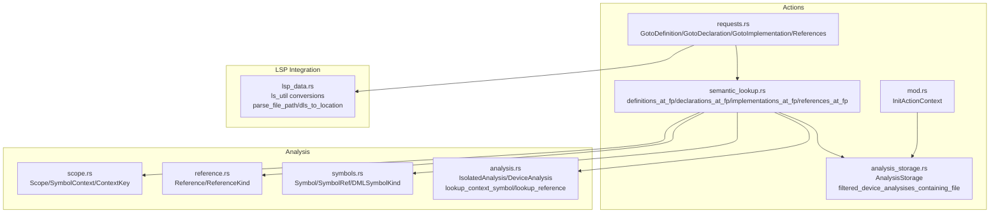
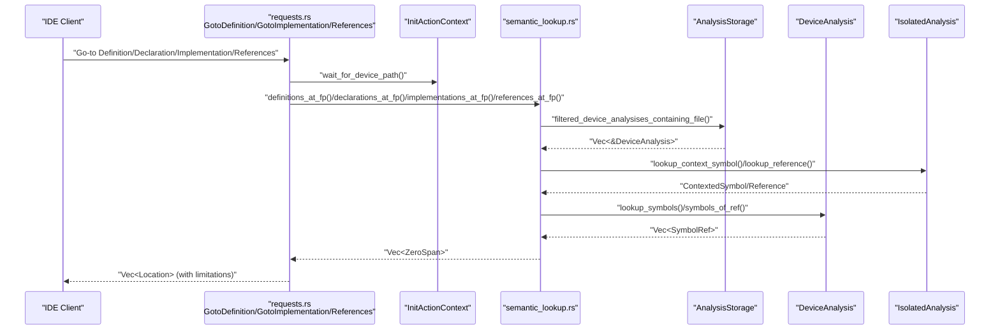
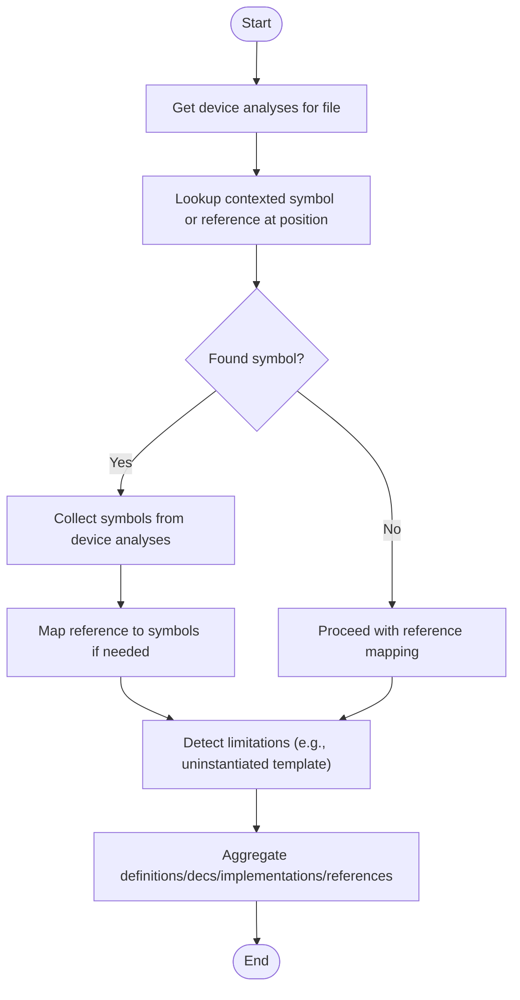
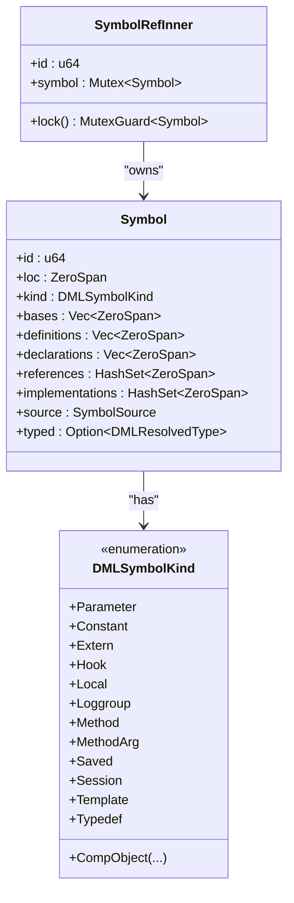
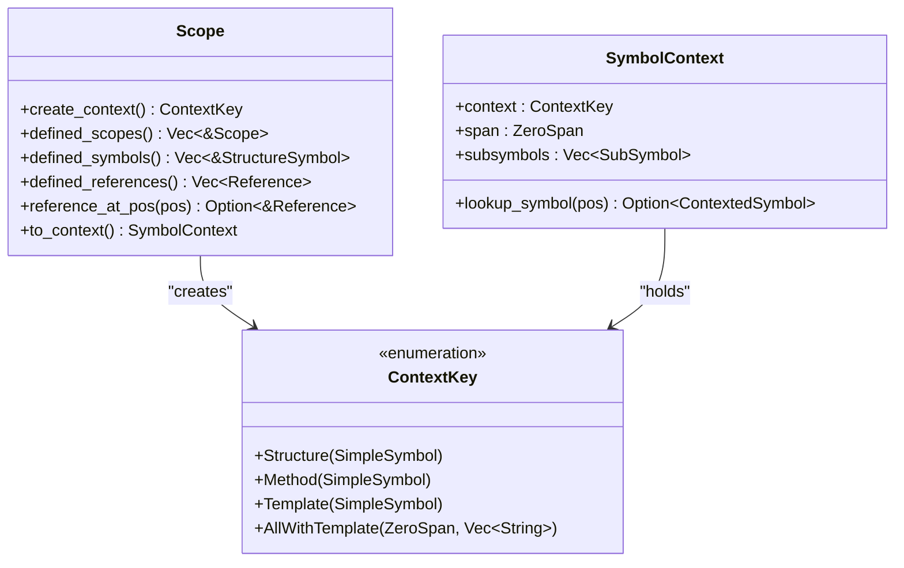
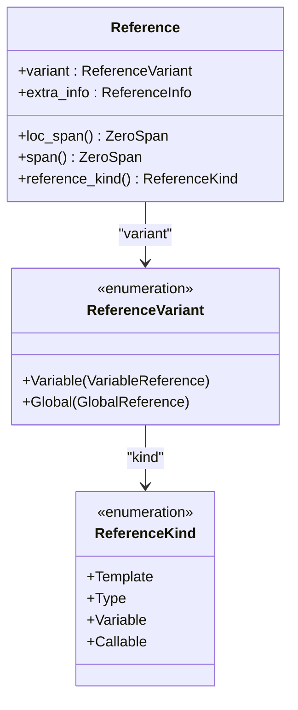
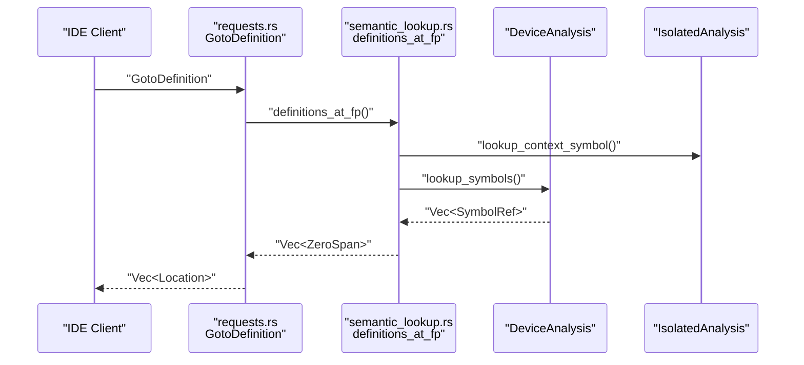
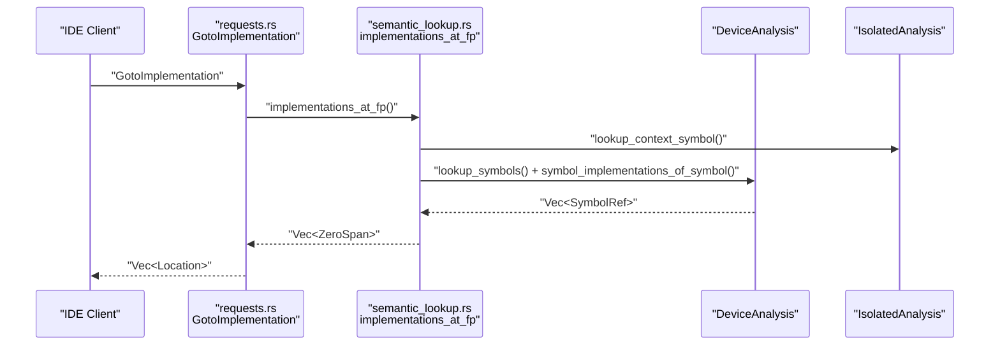
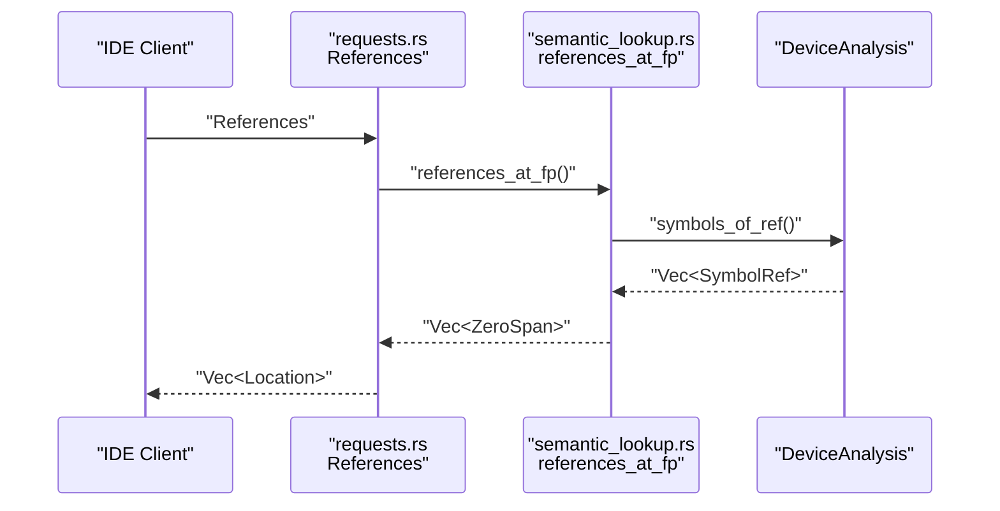
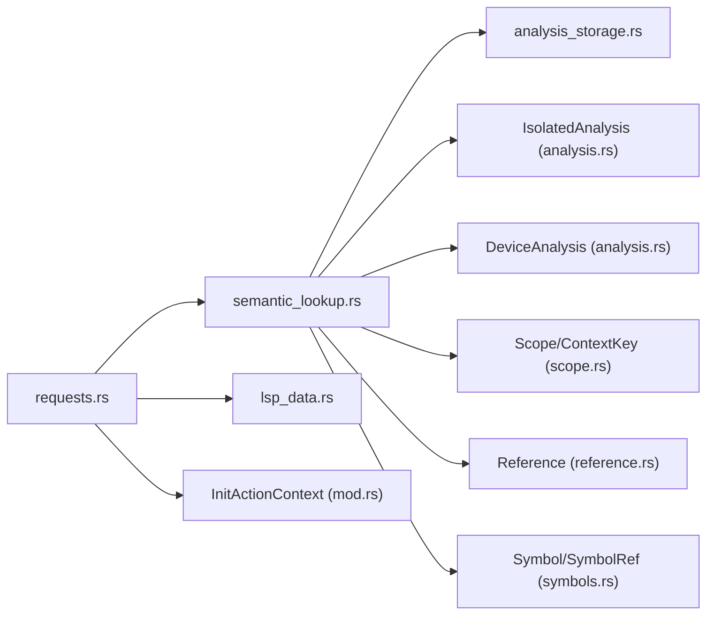

# Navigation and Go-To Features

<cite>
**Referenced Files in This Document**
- [semantic_lookup.rs](file://src/actions/semantic_lookup.rs)
- [requests.rs](file://src/actions/requests.rs)
- [analysis_storage.rs](file://src/actions/analysis_storage.rs)
- [scope.rs](file://src/analysis/scope.rs)
- [reference.rs](file://src/analysis/reference.rs)
- [symbols.rs](file://src/analysis/symbols.rs)
- [analysis.rs](file://src/analysis/mod.rs)
- [lsp_data.rs](file://src/lsp_data.rs)
- [mod.rs](file://src/actions/mod.rs)
</cite>

## Table of Contents
1. [Introduction](#introduction)
2. [Project Structure](#project-structure)
3. [Core Components](#core-components)
4. [Architecture Overview](#architecture-overview)
5. [Detailed Component Analysis](#detailed-component-analysis)
6. [Dependency Analysis](#dependency-analysis)
7. [Performance Considerations](#performance-considerations)
8. [Troubleshooting Guide](#troubleshooting-guide)
9. [Conclusion](#conclusion)

## Introduction
This document explains the navigation and go-to features of the DML language server, focusing on how the server resolves symbol locations and cross-references for IDE integration. It covers go-to-definition, go-to-implementation, and go-to-references, detailing the semantic lookup pipeline, symbol model, and reference resolution. It also addresses handling of overloaded symbols, template instantiations, hierarchical references, performance optimization, caching strategies, and integration with IDE navigation features.

## Project Structure
The navigation features are implemented across several modules:
- Actions layer: request handlers for LSP go-to requests and semantic lookup orchestration
- Analysis layer: symbol model, scopes, references, and device/isolated analysis storage
- LSP integration: conversion utilities and request/response handling

**Diagram sources**
- [requests.rs](file://src/actions/requests.rs#L384-L612)
- [semantic_lookup.rs](file://src/actions/semantic_lookup.rs#L88-L399)
- [analysis_storage.rs](file://src/actions/analysis_storage.rs#L173-L187)
- [scope.rs](file://src/analysis/scope.rs#L13-L62)
- [reference.rs](file://src/analysis/reference.rs#L8-L220)
- [symbols.rs](file://src/analysis/symbols.rs#L19-L331)
- [analysis.rs](file://src/analysis/mod.rs#L246-L269)
- [lsp_data.rs](file://src/lsp_data.rs#L127-L200)
- [mod.rs](file://src/actions/mod.rs#L251-L295)

**Section sources**
- [requests.rs](file://src/actions/requests.rs#L384-L612)
- [semantic_lookup.rs](file://src/actions/semantic_lookup.rs#L88-L399)
- [analysis_storage.rs](file://src/actions/analysis_storage.rs#L173-L187)
- [scope.rs](file://src/analysis/scope.rs#L13-L62)
- [reference.rs](file://src/analysis/reference.rs#L8-L220)
- [symbols.rs](file://src/analysis/symbols.rs#L19-L331)
- [analysis.rs](file://src/analysis/mod.rs#L246-L269)
- [lsp_data.rs](file://src/lsp_data.rs#L127-L200)
- [mod.rs](file://src/actions/mod.rs#L251-L295)

## Core Components
- Semantic lookup orchestrator: resolves symbols and references at a cursor position, aggregates results across device analyses, and handles limitations (e.g., uninstantiated templates).
- Symbol model: stores definitions, declarations, references, implementations, and typed metadata for each symbol.
- Scope and context: maps positions to nested scopes and context keys to narrow symbol sets.
- Reference model: captures variable/global references with kind and location spans.
- Request handlers: translate LSP requests into navigation actions and return LSP-compatible locations.

Key responsibilities:
- definitions_at_fp: collects definition spans for symbols at a position
- declarations_at_fp: collects declaration spans, with special handling for method/parameter bases
- implementations_at_fp: collects implementation spans, including recursive method overrides
- references_at_fp: collects all reference spans for symbols at a position

**Section sources**
- [semantic_lookup.rs](file://src/actions/semantic_lookup.rs#L88-L399)
- [symbols.rs](file://src/analysis/symbols.rs#L180-L331)
- [scope.rs](file://src/analysis/scope.rs#L98-L246)
- [reference.rs](file://src/analysis/reference.rs#L8-L220)
- [requests.rs](file://src/actions/requests.rs#L384-L612)

## Architecture Overview
The navigation workflow begins when the client sends a go-to request. The server converts the LSP position to an internal zero-indexed position, waits for device analysis readiness, performs semantic lookup, and returns LSP locations.

**Diagram sources**
- [requests.rs](file://src/actions/requests.rs#L400-L612)
- [semantic_lookup.rs](file://src/actions/semantic_lookup.rs#L88-L399)
- [analysis_storage.rs](file://src/actions/analysis_storage.rs#L173-L187)
- [analysis.rs](file://src/analysis/mod.rs#L1730-L1746)

## Detailed Component Analysis

### Semantic Lookup Pipeline
The semantic lookup pipeline coordinates position-based symbol discovery across isolated and device analyses:
- Determine active device contexts and fetch device analyses containing the file
- Find a contexted symbol at the position or a reference
- Map references to symbols across device analyses
- Aggregate definitions, declarations, implementations, and references
- Detect and report limitations (e.g., uninstantiated templates)

**Diagram sources**
- [semantic_lookup.rs](file://src/actions/semantic_lookup.rs#L88-L223)
- [analysis_storage.rs](file://src/actions/analysis_storage.rs#L173-L187)
- [analysis.rs](file://src/analysis/mod.rs#L1730-L1746)

**Section sources**
- [semantic_lookup.rs](file://src/actions/semantic_lookup.rs#L88-L223)
- [analysis_storage.rs](file://src/actions/analysis_storage.rs#L173-L187)
- [analysis.rs](file://src/analysis/mod.rs#L1730-L1746)

### Symbol Model and Implementation Resolution
Symbols carry definitions, declarations, references, and implementations. Method implementations are resolved recursively to include all overrides.

**Diagram sources**
- [symbols.rs](file://src/analysis/symbols.rs#L180-L331)

**Section sources**
- [symbols.rs](file://src/analysis/symbols.rs#L180-L331)

### Scope and Context Keys
Scopes provide nested symbol contexts. Context keys identify structure, method, template, or “all-with-template” contexts. Position queries traverse scopes to find the matching contexted symbol.

**Diagram sources**
- [scope.rs](file://src/analysis/scope.rs#L13-L246)

**Section sources**
- [scope.rs](file://src/analysis/scope.rs#L13-L246)

### Reference Model and Kinds
References capture variable and global references with kind and location spans. Reference kinds include template, type, variable, and callable.

**Diagram sources**
- [reference.rs](file://src/analysis/reference.rs#L8-L220)

**Section sources**
- [reference.rs](file://src/analysis/reference.rs#L8-L220)

### Go-To Definition Workflow
- Convert LSP position to internal zero-indexed position
- Wait for device analysis readiness
- Run definitions_at_fp to collect definition spans
- Convert spans to LSP locations and return

**Diagram sources**
- [requests.rs](file://src/actions/requests.rs#L500-L553)
- [semantic_lookup.rs](file://src/actions/semantic_lookup.rs#L347-L361)
- [analysis.rs](file://src/analysis/mod.rs#L1730-L1746)

**Section sources**
- [requests.rs](file://src/actions/requests.rs#L500-L553)
- [semantic_lookup.rs](file://src/actions/semantic_lookup.rs#L347-L361)
- [analysis.rs](file://src/analysis/mod.rs#L1730-L1746)

### Go-To Implementation Workflow
- Convert LSP position to internal position
- Wait for device analysis readiness
- Run implementations_at_fp to collect implementation spans
- Convert spans to LSP locations and return

**Diagram sources**
- [requests.rs](file://src/actions/requests.rs#L384-L441)
- [semantic_lookup.rs](file://src/actions/semantic_lookup.rs#L299-L317)
- [analysis.rs](file://src/analysis/mod.rs#L1730-L1746)

**Section sources**
- [requests.rs](file://src/actions/requests.rs#L384-L441)
- [semantic_lookup.rs](file://src/actions/semantic_lookup.rs#L299-L317)
- [analysis.rs](file://src/analysis/mod.rs#L1730-L1746)

### Go-To References Workflow
- Convert LSP position to internal position
- Wait for device analysis readiness
- Run references_at_fp to collect all reference spans
- Convert spans to LSP locations and return

**Diagram sources**
- [requests.rs](file://src/actions/requests.rs#L556-L612)
- [semantic_lookup.rs](file://src/actions/semantic_lookup.rs#L385-L399)

**Section sources**
- [requests.rs](file://src/actions/requests.rs#L556-L612)
- [semantic_lookup.rs](file://src/actions/semantic_lookup.rs#L385-L399)

### Handling Overloaded Symbols and Templates
- Overloaded methods: declarations_at_fp returns bases for methods/parameters; definitions_at_fp prioritizes definitions for non-methods and implementations for methods
- Template instantiations: when a reference resides in a template without instantiation, limitations are detected and surfaced to the client

**Section sources**
- [semantic_lookup.rs](file://src/actions/semantic_lookup.rs#L319-L345)
- [semantic_lookup.rs](file://src/actions/semantic_lookup.rs#L52-L62)
- [analysis.rs](file://src/analysis/mod.rs#L756-L798)

### Hierarchical References
- Context chains map positions to nested objects and methods
- DeviceAnalysis.context_to_objs traverses context chains to locate applicable objects for reference matching

**Section sources**
- [analysis.rs](file://src/analysis/mod.rs#L670-L800)
- [scope.rs](file://src/analysis/scope.rs#L98-L138)

### Examples of Navigation Scenarios
- Device definitions: go-to-definition resolves to device-level declarations/definitions
- Register declarations: declarations_at_fp returns declaration spans for registers
- Method implementations: implementations_at_fp returns all overrides for a method
- Trait definitions: definitions_at_fp resolves trait definitions and declarations

**Section sources**
- [semantic_lookup.rs](file://src/actions/semantic_lookup.rs#L347-L361)
- [semantic_lookup.rs](file://src/actions/semantic_lookup.rs#L363-L383)
- [semantic_lookup.rs](file://src/actions/semantic_lookup.rs#L299-L317)

## Dependency Analysis
The navigation pipeline depends on:
- Request handlers to validate and route requests
- Analysis storage to select relevant device analyses
- Isolated/device analyses to resolve symbols and references
- Scope/context to narrow symbol sets
- LSP utilities to convert internal spans to LSP locations

**Diagram sources**
- [requests.rs](file://src/actions/requests.rs#L384-L612)
- [semantic_lookup.rs](file://src/actions/semantic_lookup.rs#L88-L399)
- [analysis_storage.rs](file://src/actions/analysis_storage.rs#L173-L187)
- [analysis.rs](file://src/analysis/mod.rs#L246-L269)
- [scope.rs](file://src/analysis/scope.rs#L13-L62)
- [reference.rs](file://src/analysis/reference.rs#L8-L220)
- [symbols.rs](file://src/analysis/symbols.rs#L180-L331)
- [lsp_data.rs](file://src/lsp_data.rs#L127-L200)
- [mod.rs](file://src/actions/mod.rs#L251-L295)

**Section sources**
- [requests.rs](file://src/actions/requests.rs#L384-L612)
- [semantic_lookup.rs](file://src/actions/semantic_lookup.rs#L88-L399)
- [analysis_storage.rs](file://src/actions/analysis_storage.rs#L173-L187)
- [analysis.rs](file://src/analysis/mod.rs#L246-L269)
- [scope.rs](file://src/analysis/scope.rs#L13-L62)
- [reference.rs](file://src/analysis/reference.rs#L8-L220)
- [symbols.rs](file://src/analysis/symbols.rs#L180-L331)
- [lsp_data.rs](file://src/lsp_data.rs#L127-L200)
- [mod.rs](file://src/actions/mod.rs#L251-L295)

## Performance Considerations
- Concurrency and batching: reference matching leverages parallel chunks to improve throughput
- Caching: reference cache keys are derived from object path, flattened reference, and method scope to avoid recomputation
- Incremental updates: analysis storage tracks timestamps and invalidators to avoid unnecessary recomputations
- Waiting for device analysis: requests wait for device analysis readiness to prevent partial results

Recommendations:
- Keep reference cache keys minimal and deterministic
- Use parallel processing for large symbol sets
- Invalidate caches on file changes and template updates
- Limit scope traversal depth for deeply nested hierarchies

**Section sources**
- [analysis.rs](file://src/analysis/mod.rs#L513-L549)
- [analysis_storage.rs](file://src/actions/analysis_storage.rs#L482-L565)
- [requests.rs](file://src/actions/requests.rs#L416-L416)

## Troubleshooting Guide
Common issues and handling:
- No device analysis available: requests return fallback responses and log warnings
- No isolated analysis available: lookup errors are surfaced with contextual messages
- Limitations: when templates are uninstantiated, limitations are reported to the client
- Non-file URI schemes: ignored to prevent crashes; ensure file URIs are used

Mitigation steps:
- Verify that the file is included under a device context
- Ensure required built-in files are resolvable
- Confirm that template instantiations exist for referenced templates
- Check workspace roots and include paths for proper resolution

**Section sources**
- [requests.rs](file://src/actions/requests.rs#L59-L87)
- [requests.rs](file://src/actions/requests.rs#L434-L438)
- [requests.rs](file://src/actions/requests.rs#L490-L496)
- [analysis_storage.rs](file://src/actions/analysis_storage.rs#L592-L633)

## Conclusion
The DML language server’s navigation and go-to features are built on a robust semantic lookup pipeline that integrates LSP requests with symbol and reference models. The system supports definitions, declarations, implementations, and references, with careful handling of templates, method overrides, and hierarchical contexts. Performance is addressed through caching, parallelization, and incremental updates, while IDE integration is achieved via LSP-compatible responses and location conversions.