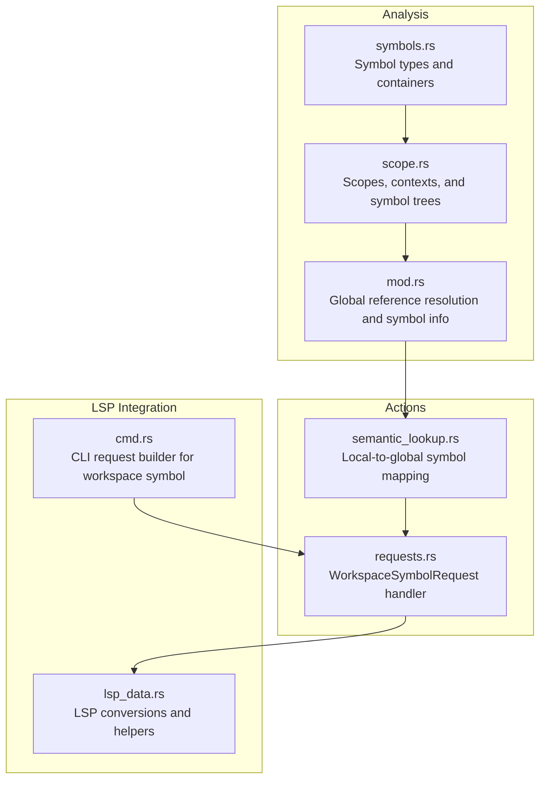
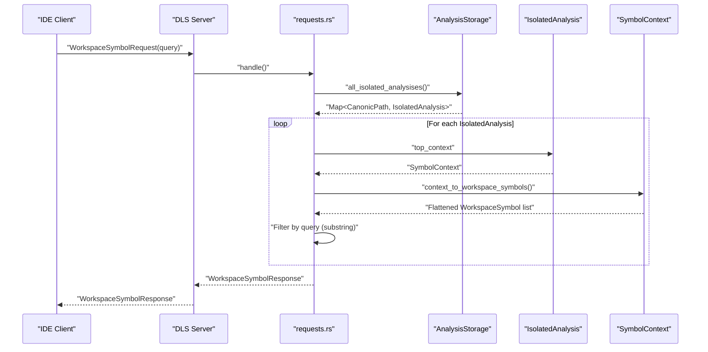
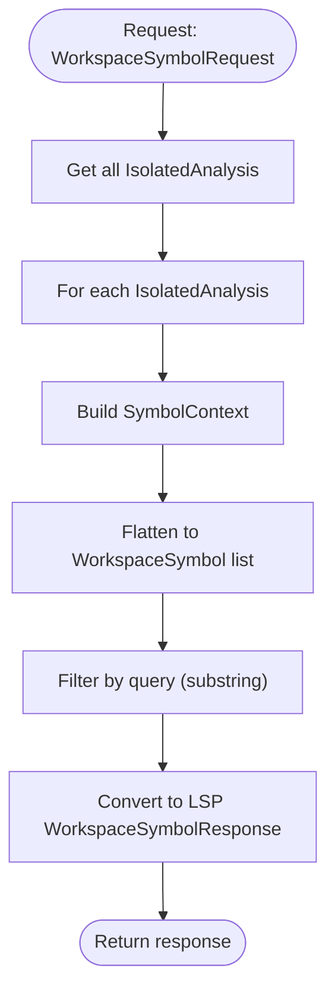
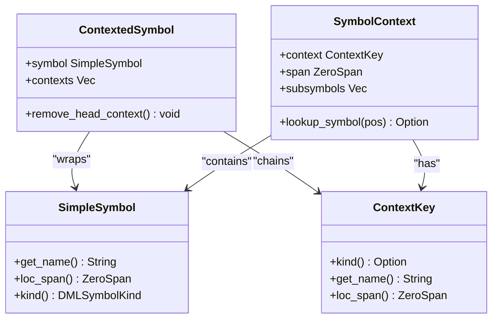
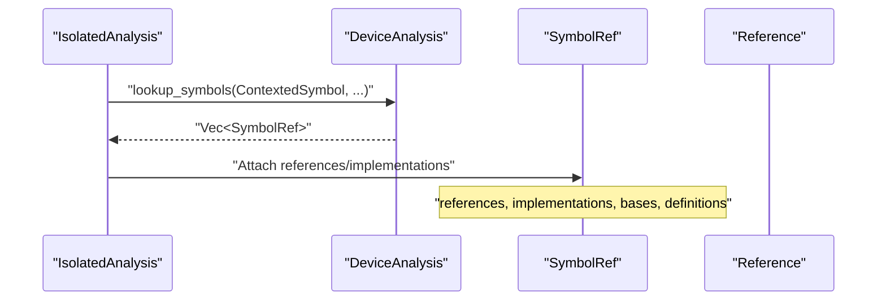
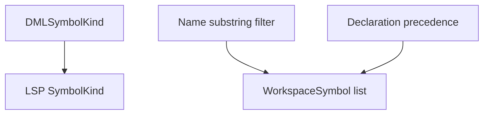
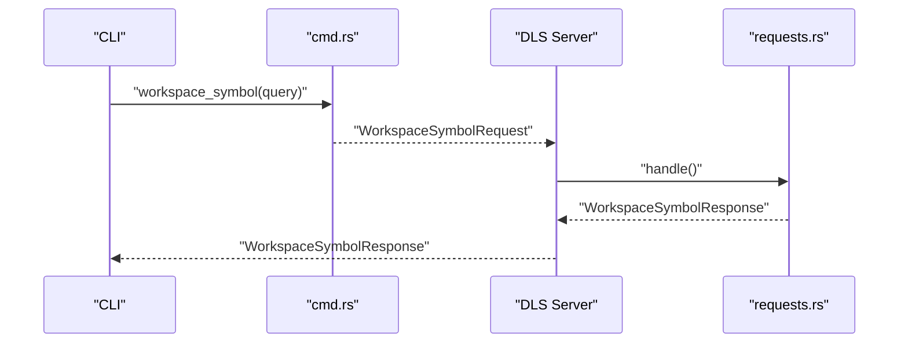
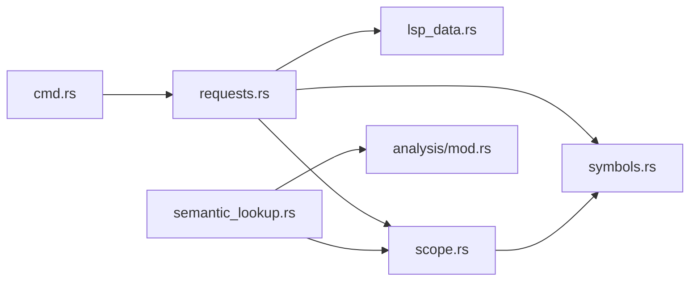

# Symbol Search and Workspace Navigation

<cite>
**Referenced Files in This Document**
- [symbols.rs](file://src/analysis/symbols.rs)
- [scope.rs](file://src/analysis/scope.rs)
- [semantic_lookup.rs](file://src/actions/semantic_lookup.rs)
- [requests.rs](file://src/actions/requests.rs)
- [mod.rs](file://src/analysis/mod.rs)
- [lsp_data.rs](file://src/lsp_data.rs)
- [cmd.rs](file://src/cmd.rs)
</cite>

## Table of Contents
1. [Introduction](#introduction)
2. [Project Structure](#project-structure)
3. [Core Components](#core-components)
4. [Architecture Overview](#architecture-overview)
5. [Detailed Component Analysis](#detailed-component-analysis)
6. [Dependency Analysis](#dependency-analysis)
7. [Performance Considerations](#performance-considerations)
8. [Troubleshooting Guide](#troubleshooting-guide)
9. [Conclusion](#conclusion)
10. [Appendices](#appendices)

## Introduction
This document explains the workspace-wide symbol lookup system and workspace navigation capabilities of the DML Language Server. It focuses on how the server builds and exposes global symbol tables, performs scope-aware symbol discovery, and integrates with IDE search panels via the Language Server Protocol (LSP). It also documents filtering by symbol type, ranking heuristics, and the relationship between local symbol resolution and global workspace search.

## Project Structure
The symbol search and navigation features span several modules:
- Analysis core: symbol definitions, symbol containers, and scoping constructs
- Actions: request handlers for LSP requests (including Workspace Symbol)
- LSP data: LSP type conversions and helpers
- Command interface: programmatic access to workspace symbol queries

**Diagram sources**
- [symbols.rs](file://src/analysis/symbols.rs#L1-L331)
- [scope.rs](file://src/analysis/scope.rs#L1-L247)
- [mod.rs](file://src/analysis/mod.rs#L1-L200)
- [semantic_lookup.rs](file://src/actions/semantic_lookup.rs#L1-L399)
- [requests.rs](file://src/actions/requests.rs#L200-L303)
- [lsp_data.rs](file://src/lsp_data.rs#L127-L200)
- [cmd.rs](file://src/cmd.rs#L162-L173)

**Section sources**
- [symbols.rs](file://src/analysis/symbols.rs#L1-L331)
- [scope.rs](file://src/analysis/scope.rs#L1-L247)
- [semantic_lookup.rs](file://src/actions/semantic_lookup.rs#L1-L399)
- [requests.rs](file://src/actions/requests.rs#L200-L303)
- [lsp_data.rs](file://src/lsp_data.rs#L127-L200)
- [cmd.rs](file://src/cmd.rs#L162-L173)

## Core Components
- Symbol model and containers
  - DMLSymbolKind enumerates symbol categories (devices, registers, methods, traits, etc.)
  - SymbolSource ties a symbol to its origin (object, method, type, template)
  - SymbolRef provides thread-safe access to symbol metadata (locations, references, implementations)
- Scoping and context
  - Scope defines a region with declared symbols, nested scopes, and references
  - SymbolContext and ContextKey form a hierarchical symbol tree
  - ContextedSymbol captures a symbol plus its context chain
- Global symbol exposure
  - WorkspaceSymbolRequest traverses all isolated analyses and flattens SymbolContext into WorkspaceSymbol entries
  - Filtering is applied by substring match against symbol names

**Section sources**
- [symbols.rs](file://src/analysis/symbols.rs#L19-L124)
- [symbols.rs](file://src/analysis/symbols.rs#L182-L235)
- [scope.rs](file://src/analysis/scope.rs#L98-L187)
- [scope.rs](file://src/analysis/scope.rs#L190-L246)
- [requests.rs](file://src/actions/requests.rs#L276-L303)

## Architecture Overview
The workspace symbol pipeline combines static analysis with LSP request handling:

**Diagram sources**
- [requests.rs](file://src/actions/requests.rs#L276-L303)
- [scope.rs](file://src/analysis/scope.rs#L47-L61)
- [lsp_data.rs](file://src/lsp_data.rs#L127-L200)

## Detailed Component Analysis

### Workspace Symbol Lookup
- Traversal: The handler iterates over all isolated analyses and collects SymbolContext instances
- Flattening: context_to_workspace_symbols converts nested contexts into a flat list of WorkspaceSymbol items
- Filtering: The result is filtered by substring containment of the query
- LSP conversion: WorkspaceSymbol entries are mapped to LSP types using location helpers

**Diagram sources**
- [requests.rs](file://src/actions/requests.rs#L276-L303)
- [scope.rs](file://src/analysis/scope.rs#L47-L61)
- [lsp_data.rs](file://src/lsp_data.rs#L163-L186)

**Section sources**
- [requests.rs](file://src/actions/requests.rs#L276-L303)
- [lsp_data.rs](file://src/lsp_data.rs#L163-L186)

### Local Symbol Resolution and Context-Aware Discovery
- ContextedSymbol: Captures a symbol and its context chain, enabling scope-aware lookups
- ContextKey: Encodes the current context (structure, method, template) and supports kind inference
- Lookup: SymbolContext.lookup_symbol traverses nested contexts to find the symbol at a position

**Diagram sources**
- [scope.rs](file://src/analysis/scope.rs#L98-L187)
- [scope.rs](file://src/analysis/scope.rs#L190-L246)

**Section sources**
- [scope.rs](file://src/analysis/scope.rs#L98-L187)
- [scope.rs](file://src/analysis/scope.rs#L190-L246)

### Global Symbol Tables and Reference Resolution
- Symbol containers: Vec and Option wrappers implement SymbolContainer to aggregate symbols from nested structures
- Global reference resolution: The analysis module resolves references globally and attaches symbol references to SymbolRef
- Implementation tracking: For methods, implementations are tracked and expanded transitively

**Diagram sources**
- [semantic_lookup.rs](file://src/actions/semantic_lookup.rs#L88-L129)
- [semantic_lookup.rs](file://src/actions/semantic_lookup.rs#L235-L281)
- [mod.rs](file://src/analysis/mod.rs#L1441-L1448)

**Section sources**
- [semantic_lookup.rs](file://src/actions/semantic_lookup.rs#L88-L129)
- [semantic_lookup.rs](file://src/actions/semantic_lookup.rs#L235-L281)
- [mod.rs](file://src/analysis/mod.rs#L1441-L1448)

### Filtering by Symbol Type and Ranking
- Symbol type mapping: structure_to_symbolkind maps DMLSymbolKind to LSP SymbolKind
- Workspace filtering: WorkspaceSymbolRequest filters by substring match on symbol names
- Ranking: The analysis module establishes a precedence order for ambiguous declarations, which influences symbol selection and presentation

**Diagram sources**
- [requests.rs](file://src/actions/requests.rs#L143-L180)
- [requests.rs](file://src/actions/requests.rs#L276-L303)
- [mod.rs](file://src/analysis/mod.rs#L1544-L1555)

**Section sources**
- [requests.rs](file://src/actions/requests.rs#L143-L180)
- [requests.rs](file://src/actions/requests.rs#L276-L303)
- [mod.rs](file://src/analysis/mod.rs#L1544-L1555)

### Integration with IDE Search Panels
- LSP request: WorkspaceSymbolRequest is handled by requests.rs
- CLI usage: workspace_symbol(query) builds a request programmatically
- LSP conversions: ls_util provides helpers to convert between DLS spans and LSP locations

**Diagram sources**
- [cmd.rs](file://src/cmd.rs#L162-L173)
- [requests.rs](file://src/actions/requests.rs#L276-L303)
- [lsp_data.rs](file://src/lsp_data.rs#L163-L186)

**Section sources**
- [cmd.rs](file://src/cmd.rs#L162-L173)
- [requests.rs](file://src/actions/requests.rs#L276-L303)
- [lsp_data.rs](file://src/lsp_data.rs#L163-L186)

## Dependency Analysis
The symbol search pipeline depends on:
- Analysis core for symbol definitions and scoping
- Action handlers for request orchestration
- LSP data for type conversions
- Command interface for programmatic access

**Diagram sources**
- [requests.rs](file://src/actions/requests.rs#L200-L303)
- [lsp_data.rs](file://src/lsp_data.rs#L127-L200)
- [scope.rs](file://src/analysis/scope.rs#L1-L247)
- [symbols.rs](file://src/analysis/symbols.rs#L1-L331)
- [semantic_lookup.rs](file://src/actions/semantic_lookup.rs#L1-L399)
- [mod.rs](file://src/analysis/mod.rs#L1-L200)
- [cmd.rs](file://src/cmd.rs#L162-L173)

**Section sources**
- [requests.rs](file://src/actions/requests.rs#L200-L303)
- [lsp_data.rs](file://src/lsp_data.rs#L127-L200)
- [scope.rs](file://src/analysis/scope.rs#L1-L247)
- [symbols.rs](file://src/analysis/symbols.rs#L1-L331)
- [semantic_lookup.rs](file://src/actions/semantic_lookup.rs#L1-L399)
- [mod.rs](file://src/analysis/mod.rs#L1-L200)
- [cmd.rs](file://src/cmd.rs#L162-L173)

## Performance Considerations
- Workspace traversal cost: Flattening all SymbolContext instances scales with total symbols across all files
- Filtering cost: Substring filtering is linear in the number of flattened symbols
- Incremental updates: The design relies on rebuilding SymbolContext from isolated analyses; incremental invalidation strategies are not shown in the analyzed files
- Parallelism: The analysis module imports rayon, indicating potential for parallel processing elsewhere; no explicit parallelization is observed in the workspace symbol path

Recommendations:
- Index symbols by name and kind for faster filtering
- Cache flattened symbol lists per file and invalidate on edits
- Use bounded result sets and early termination when query specificity increases
- Consider prefix/fuzzy filters for large workspaces

[No sources needed since this section provides general guidance]

## Troubleshooting Guide
Common issues and mitigations:
- No semantic analysis available: The handler warns when no device analysis is available for the requested file
- Partial results due to limitations: Limitations (e.g., template instantiation) are surfaced to the client with warnings
- Position conversion errors: Ensure positions are converted correctly between LSP and DLS formats

**Section sources**
- [requests.rs](file://src/actions/requests.rs#L60-L87)
- [semantic_lookup.rs](file://src/actions/semantic_lookup.rs#L32-L62)
- [lsp_data.rs](file://src/lsp_data.rs#L127-L200)

## Conclusion
The DML Language Server provides a robust workspace symbol lookup mechanism by combining a hierarchical symbol context with LSP-compatible responses. While the current implementation uses substring filtering and a flat traversal, the underlying symbol model and scoping infrastructure support advanced features such as type-aware filtering, ranking, and fuzzy search. Integrating incremental updates and indexing strategies would further improve performance for large projects.

[No sources needed since this section summarizes without analyzing specific files]

## Appendices

### Example Queries and Navigation Patterns
- Workspace-wide symbol search: Use WorkspaceSymbolRequest with a query string; the server returns WorkspaceSymbol entries filtered by substring match
- Navigate to definitions/declarations/implementations: Use GotoDefinition/GotoDeclaration/GotoImplementation requests; the server maps positions to symbol references and returns locations
- Programmatic access: Use workspace_symbol(query) to build a request for CLI or testing scenarios

**Section sources**
- [requests.rs](file://src/actions/requests.rs#L276-L303)
- [semantic_lookup.rs](file://src/actions/semantic_lookup.rs#L299-L399)
- [cmd.rs](file://src/cmd.rs#L162-L173)