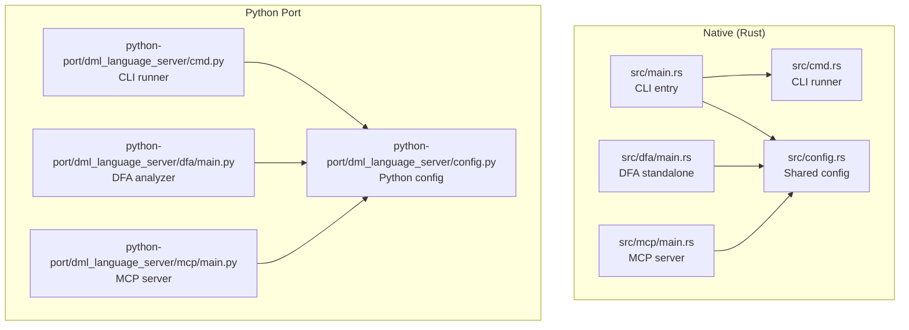
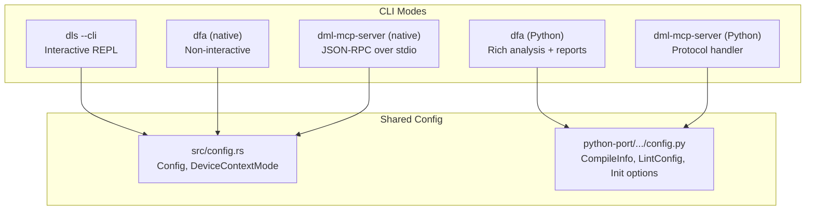
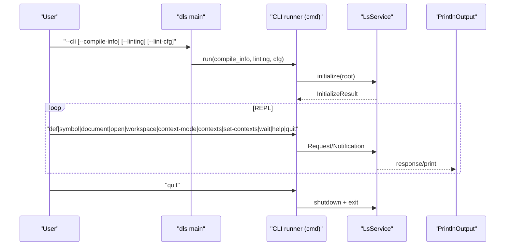
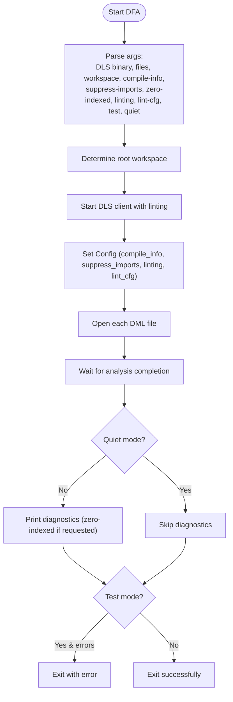
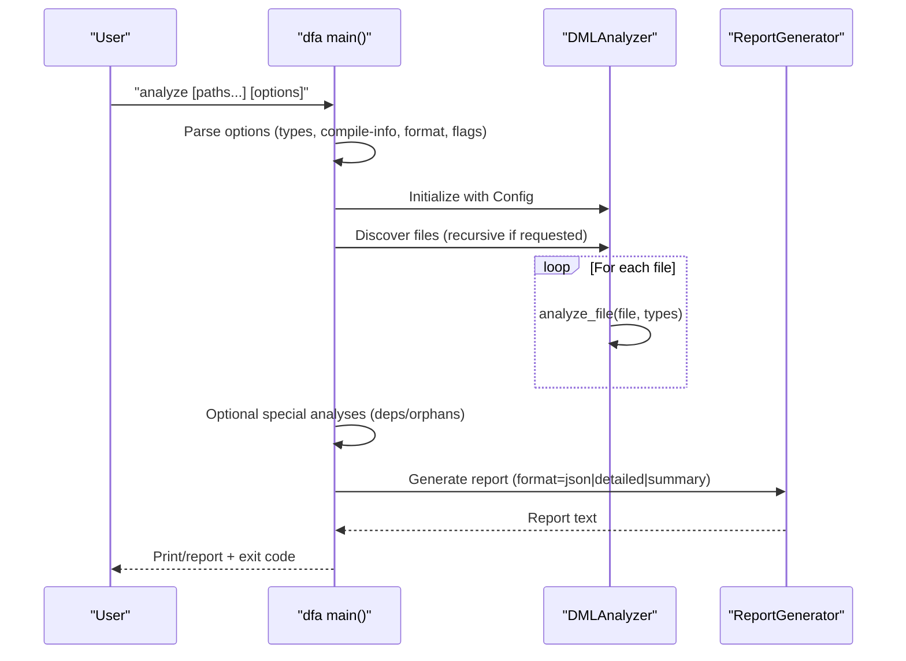
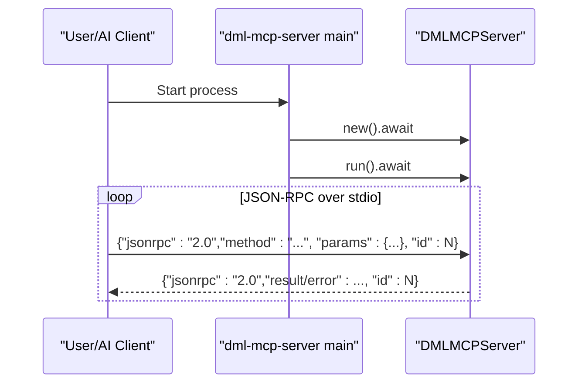
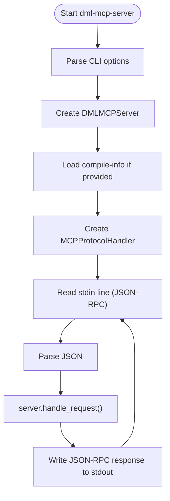
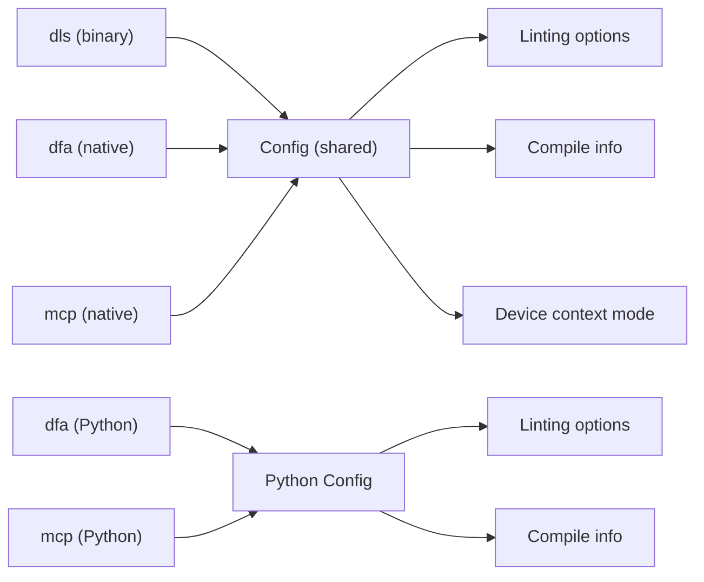

# Command Line Tools

<cite>
**Referenced Files in This Document**
- [src/main.rs](file://src/main.rs)
- [src/cmd.rs](file://src/cmd.rs)
- [src/config.rs](file://src/config.rs)
- [src/dfa/main.rs](file://src/dfa/main.rs)
- [src/mcp/main.rs](file://src/mcp/main.rs)
- [python-port/dml_language_server/cmd.py](file://python-port/dml_language_server/cmd.py)
- [python-port/dml_language_server/dfa/main.py](file://python-port/dml_language_server/dfa/main.py)
- [python-port/dml_language_server/mcp/main.py](file://python-port/dml_language_server/mcp/main.py)
- [python-port/dml_language_server/config.py](file://python-port/dml_language_server/config.py)
- [Cargo.toml](file://Cargo.toml)
- [README.md](file://README.md)
- [USAGE.md](file://USAGE.md)
- [MCP_SERVER_GUIDE.md](file://MCP_SERVER_GUIDE.md)
</cite>

## Table of Contents
1. [Introduction](#introduction)
2. [Project Structure](#project-structure)
3. [Core Components](#core-components)
4. [Architecture Overview](#architecture-overview)
5. [Detailed Component Analysis](#detailed-component-analysis)
6. [Dependency Analysis](#dependency-analysis)
7. [Performance Considerations](#performance-considerations)
8. [Troubleshooting Guide](#troubleshooting-guide)
9. [Conclusion](#conclusion)
10. [Appendices](#appendices)

## Introduction
This document explains the command-line interface tools provided by the DML Language Server project. It covers:
- The main dls binary and its CLI mode for interactive analysis
- The DFA (Device File Analyzer) tool for standalone device analysis, dependency tracking, and report generation
- The MCP server command-line interface for AI-assisted development workflows
- Practical usage patterns, automation scripts, and CI/CD integration
- Performance optimization, memory usage considerations, and debugging techniques
- Shared configuration options between CLI tools and the language server, and migration paths between analysis modes

## Project Structure
The CLI tools are implemented across two layers:
- A native Rust implementation with a language server and supporting utilities
- A Python port that mirrors the Rust functionality for environments where Python is preferred

Key binaries and entry points:
- dls: Native language server with optional CLI mode
- dfa: Standalone device file analyzer
- dml-mcp-server: MCP server for AI-assisted development

**Diagram sources**
- [src/main.rs](file://src/main.rs#L15-L59)
- [src/cmd.rs](file://src/cmd.rs#L46-L140)
- [src/config.rs](file://src/config.rs#L120-L139)
- [src/dfa/main.rs](file://src/dfa/main.rs#L21-L192)
- [src/mcp/main.rs](file://src/mcp/main.rs#L11-L23)
- [python-port/dml_language_server/cmd.py](file://python-port/dml_language_server/cmd.py#L21-L162)
- [python-port/dml_language_server/dfa/main.py](file://python-port/dml_language_server/dfa/main.py#L78-L280)
- [python-port/dml_language_server/mcp/main.py](file://python-port/dml_language_server/mcp/main.py#L98-L166)
- [python-port/dml_language_server/config.py](file://python-port/dml_language_server/config.py#L89-L311)

**Section sources**
- [Cargo.toml](file://Cargo.toml#L18-L31)
- [README.md](file://README.md#L22-L34)

## Core Components
- dls (native): Supports both server mode and CLI mode. In CLI mode, it exposes a REPL-like interface for interactive queries and analysis.
- dfa (native): Non-interactive analyzer that runs the DLS against one or more DML files and prints diagnostics.
- dfa (Python): Feature-rich analyzer with multiple analysis types, dependency checks, orphans detection, and report generation in multiple formats.
- dml-mcp-server (native): MCP server that integrates with AI assistants via JSON-RPC over stdin/stdout.
- dml-mcp-server (Python): Python-side MCP server with protocol handler and CLI options.

**Section sources**
- [src/main.rs](file://src/main.rs#L21-L59)
- [src/cmd.rs](file://src/cmd.rs#L46-L140)
- [src/dfa/main.rs](file://src/dfa/main.rs#L44-L122)
- [src/mcp/main.rs](file://src/mcp/main.rs#L11-L23)
- [python-port/dml_language_server/cmd.py](file://python-port/dml_language_server/cmd.py#L21-L162)
- [python-port/dml_language_server/dfa/main.py](file://python-port/dml_language_server/dfa/main.py#L78-L280)
- [python-port/dml_language_server/mcp/main.py](file://python-port/dml_language_server/mcp/main.py#L98-L166)

## Architecture Overview
The CLI tools share a common configuration model and can either run as standalone binaries or integrate with the language server.

**Diagram sources**
- [src/config.rs](file://src/config.rs#L120-L139)
- [python-port/dml_language_server/config.py](file://python-port/dml_language_server/config.py#L89-L311)
- [src/main.rs](file://src/main.rs#L44-L59)
- [src/dfa/main.rs](file://src/dfa/main.rs#L124-L192)
- [src/mcp/main.rs](file://src/mcp/main.rs#L11-L23)
- [python-port/dml_language_server/cmd.py](file://python-port/dml_language_server/cmd.py#L21-L162)
- [python-port/dml_language_server/dfa/main.py](file://python-port/dml_language_server/dfa/main.py#L78-L280)
- [python-port/dml_language_server/mcp/main.py](file://python-port/dml_language_server/mcp/main.py#L98-L166)

## Detailed Component Analysis

### dls Binary (CLI Mode)
The dls binary supports a CLI mode that runs the language server in-process and exposes a simple command-driven interface. It initializes the server, accepts commands, and prints results.

Key behaviors:
- Parses CLI flags for enabling CLI mode, compile-info path, and linting options
- Initializes the server with VFS and configuration
- Provides a REPL with commands for definition lookup, symbol queries, document symbols, workspace management, and context configuration
- Uses a channel-based message passing mechanism to communicate with the server

**Diagram sources**
- [src/main.rs](file://src/main.rs#L44-L59)
- [src/cmd.rs](file://src/cmd.rs#L46-L140)
- [src/cmd.rs](file://src/cmd.rs#L189-L195)
- [src/cmd.rs](file://src/cmd.rs#L197-L228)
- [src/cmd.rs](file://src/cmd.rs#L230-L246)
- [src/cmd.rs](file://src/cmd.rs#L248-L274)
- [src/cmd.rs](file://src/cmd.rs#L276-L297)
- [src/cmd.rs](file://src/cmd.rs#L299-L323)
- [src/cmd.rs](file://src/cmd.rs#L334-L347)

Configuration options exposed by CLI mode:
- --cli: Enables CLI mode
- --compile-info: Path to compile-commands file
- --linting: Enable/disable linting
- --lint-cfg: Path to lint configuration file

Output formatting:
- JSON responses from the server are printed to stdout
- The CLI runner prints human-friendly messages for certain operations

Practical usage patterns:
- Interactive exploration: Use commands like def, symbol, document, open, workspace
- Batch-style analysis: Use wait to allow analysis to complete, then capture stdout
- Context management: Use context-mode and contexts/set-contexts to control device context behavior

**Section sources**
- [src/main.rs](file://src/main.rs#L21-L59)
- [src/cmd.rs](file://src/cmd.rs#L46-L140)
- [src/cmd.rs](file://src/cmd.rs#L405-L443)
- [src/config.rs](file://src/config.rs#L120-L139)

### DFA (Device File Analyzer) Tool
There are two DFA implementations: a native standalone analyzer and a Python-rich analyzer.

#### Native DFA (src/dfa/main.rs)
- Accepts a DLS binary path and one or more DML files
- Optional workspace roots, compile-info, linting enablement, lint-cfg, zero-indexed diagnostics, and quiet mode
- Starts a client that communicates with the DLS binary, opens files, waits for analysis, and optionally prints diagnostics
- Supports suppressing imports and test mode (exits with error if diagnostics are present)

**Diagram sources**
- [src/dfa/main.rs](file://src/dfa/main.rs#L44-L122)
- [src/dfa/main.rs](file://src/dfa/main.rs#L124-L192)

Usage examples:
- Analyze multiple files with linting enabled and suppress imports
- Use test mode to fail builds on diagnostics
- Provide compile-info to resolve includes and flags

#### Python DFA (python-port/dml_language_server/dfa/main.py)
- Provides a CLI group with analyze and deps subcommands
- Supports recursive directory scanning, multiple analysis types (syntax, semantic, dependencies, symbols, metrics, all), compile-info loading, output formats (summary, detailed, json), verbosity, quiet mode, circular dependency checks, orphans detection, and errors-only filtering
- Generates structured reports and exits with non-zero status if errors are found

**Diagram sources**
- [python-port/dml_language_server/dfa/main.py](file://python-port/dml_language_server/dfa/main.py#L78-L280)
- [python-port/dml_language_server/dfa/main.py](file://python-port/dml_language_server/dfa/main.py#L282-L334)

Usage examples:
- Analyze all files in a directory recursively with detailed report
- Generate JSON report for CI consumption
- Show dependencies for a specific file in text, dot, or JSON formats

**Section sources**
- [src/dfa/main.rs](file://src/dfa/main.rs#L44-L122)
- [src/dfa/main.rs](file://src/dfa/main.rs#L124-L192)
- [python-port/dml_language_server/dfa/main.py](file://python-port/dml_language_server/dfa/main.py#L78-L280)
- [python-port/dml_language_server/dfa/main.py](file://python-port/dml_language_server/dfa/main.py#L282-L334)

### MCP Server CLI (AI-Assisted Development)
The MCP server provides AI-assisted DML code generation and analysis via the Model Context Protocol over stdin/stdout.

#### Native MCP Server (src/mcp/main.rs)
- Entry point initializes logging and starts the DMLMCPServer
- Runs asynchronously using Tokio runtime

**Diagram sources**
- [src/mcp/main.rs](file://src/mcp/main.rs#L11-L23)

#### Python MCP Server (python-port/dml_language_server/mcp/main.py)
- Provides a CLI with options for verbose logging, compile-info loading, and log file redirection
- Implements a protocol handler that reads JSON-RPC messages from stdin, handles requests, and writes responses to stdout
- Uses asyncio.StreamReader/Writer over stdio

**Diagram sources**
- [python-port/dml_language_server/mcp/main.py](file://python-port/dml_language_server/mcp/main.py#L98-L166)
- [python-port/dml_language_server/mcp/main.py](file://python-port/dml_language_server/mcp/main.py#L22-L96)

Usage examples:
- Build and run the native MCP server
- Pipe JSON-RPC messages to the server for tool discovery and code generation
- Configure AI desktop clients to connect to the MCP server

**Section sources**
- [src/mcp/main.rs](file://src/mcp/main.rs#L11-L23)
- [python-port/dml_language_server/mcp/main.py](file://python-port/dml_language_server/mcp/main.py#L98-L166)
- [MCP_SERVER_GUIDE.md](file://MCP_SERVER_GUIDE.md#L9-L33)
- [MCP_SERVER_GUIDE.md](file://MCP_SERVER_GUIDE.md#L163-L170)

### Shared Configuration Options and Migration Paths
Both CLI tools and the language server share configuration concepts:
- Compile commands: Provide include paths and compiler flags per device
- Linting: Enable/disable linting and supply lint configuration
- Device context modes: Control when new device contexts are activated
- Zero-indexed diagnostics: Toggle diagnostic index origin

Migration paths:
- From native dls CLI mode to native DFA for non-interactive batch analysis
- From Python DFA analyze to native DFA for performance-sensitive scenarios
- From Python MCP server to native MCP server for production deployments
- Use compile-info consistently across tools to ensure uniform resolution of imports and flags

**Section sources**
- [src/config.rs](file://src/config.rs#L120-L139)
- [src/config.rs](file://src/config.rs#L100-L118)
- [python-port/dml_language_server/config.py](file://python-port/dml_language_server/config.py#L131-L224)
- [README.md](file://README.md#L36-L57)
- [USAGE.md](file://USAGE.md#L15-L48)

## Dependency Analysis
The CLI tools depend on shared configuration and analysis components. The native and Python implementations expose similar options and behaviors, enabling interoperability and migration.

**Diagram sources**
- [src/config.rs](file://src/config.rs#L120-L139)
- [python-port/dml_language_server/config.py](file://python-port/dml_language_server/config.py#L89-L311)
- [src/dfa/main.rs](file://src/dfa/main.rs#L143-L158)
- [src/mcp/main.rs](file://src/mcp/main.rs#L11-L23)
- [python-port/dml_language_server/mcp/main.py](file://python-port/dml_language_server/mcp/main.py#L142-L156)

**Section sources**
- [src/config.rs](file://src/config.rs#L120-L139)
- [python-port/dml_language_server/config.py](file://python-port/dml_language_server/config.py#L89-L311)
- [src/dfa/main.rs](file://src/dfa/main.rs#L143-L158)
- [python-port/dml_language_server/dfa/main.py](file://python-port/dml_language_server/dfa/main.py#L134-L140)

## Performance Considerations
- Large-scale analysis: Prefer native binaries (dls, dfa, dml-mcp-server) for speed and lower overhead compared to Python implementations
- Memory usage: Use suppress-imports in DFA to reduce analysis scope; disable linting when not needed; limit concurrent analysis in CI
- Batch operations: Use DFA test mode to fail fast on errors; leverage compile-info to avoid redundant include scanning
- Device context modes: Choose appropriate DeviceContextMode to minimize unnecessary context activation and improve responsiveness
- Output control: Use quiet mode in DFA to reduce I/O overhead; generate JSON reports for downstream processing

[No sources needed since this section provides general guidance]

## Troubleshooting Guide
Common issues and remedies:
- CLI hangs or slow responses: Use wait in dls CLI mode to allow analysis to complete; increase wait duration for large workspaces
- Missing imports or incorrect includes: Provide compile-info to resolve include paths and flags
- Excessive diagnostics: Disable linting or tune lint configuration; use errors-only filtering in Python DFA
- MCP server not responding: Verify JSON-RPC messages are valid; check protocol handler logs; redirect logs to a file when stdout is reserved for protocol traffic
- Permission or path issues: Ensure DLS binary path is correct; normalize paths to avoid UNC issues; validate file permissions

**Section sources**
- [src/cmd.rs](file://src/cmd.rs#L445-L456)
- [python-port/dml_language_server/mcp/main.py](file://python-port/dml_language_server/mcp/main.py#L122-L138)

## Conclusion
The DML Language Server project provides a comprehensive suite of CLI tools for interactive analysis, batch processing, dependency tracking, and AI-assisted development. By leveraging shared configuration and consistent options across native and Python implementations, users can choose the most suitable tool for their workflow, scale analysis to large projects, and integrate seamlessly with CI/CD and AI assistants.

[No sources needed since this section summarizes without analyzing specific files]

## Appendices

### Practical Usage Patterns and Automation Scripts
- Interactive exploration with dls CLI mode:
  - Start dls in CLI mode and issue commands like def, symbol, document, open, workspace, context-mode, contexts, set-contexts, wait, help, quit
- Batch analysis with native DFA:
  - Run dfa with a DLS binary, target files, and options like --compile-info, --linting-enabled, --suppress-imports, --test, --quiet
- Rich reporting with Python DFA:
  - Use analyze with --recursive, --analysis-type, --compile-info, --output, --format, --errors-only, --check-deps, --find-orphans
- CI/CD integration:
  - Use DFA test mode to gate PRs on diagnostics
  - Generate JSON reports for artifact storage and downstream analysis
- MCP server integration:
  - Build and run dml-mcp-server; configure AI desktop clients to connect via the MCP configuration
  - Use tools/list and generate_device/generate_register/etc. for automated code generation

**Section sources**
- [src/cmd.rs](file://src/cmd.rs#L405-L443)
- [src/dfa/main.rs](file://src/dfa/main.rs#L44-L122)
- [python-port/dml_language_server/dfa/main.py](file://python-port/dml_language_server/dfa/main.py#L78-L280)
- [MCP_SERVER_GUIDE.md](file://MCP_SERVER_GUIDE.md#L9-L33)
- [MCP_SERVER_GUIDE.md](file://MCP_SERVER_GUIDE.md#L163-L170)