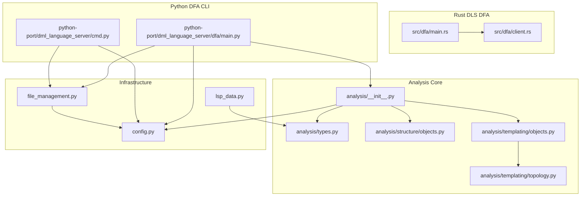
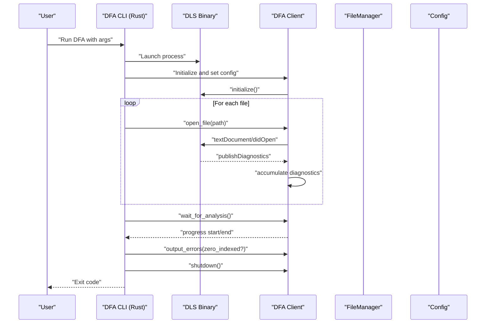
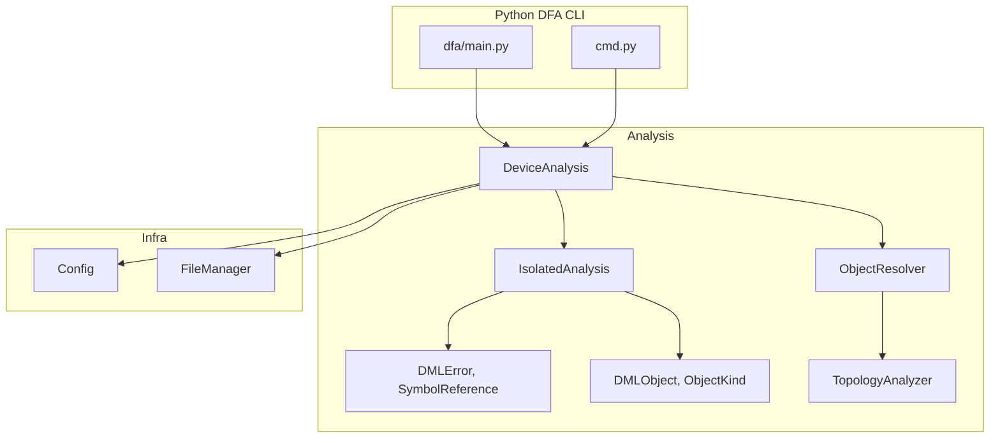
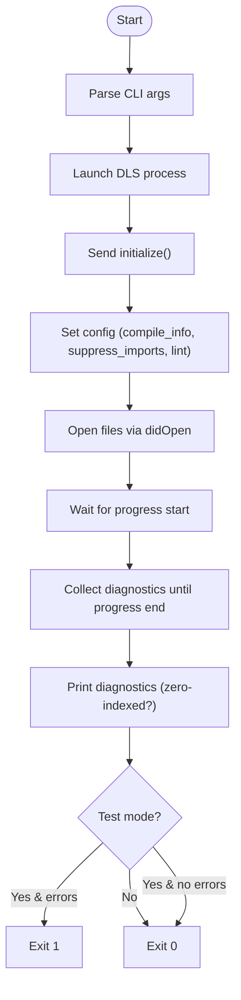
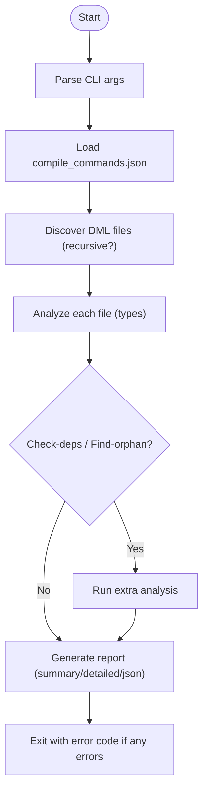
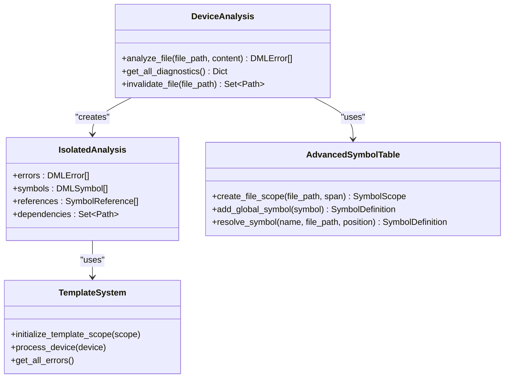
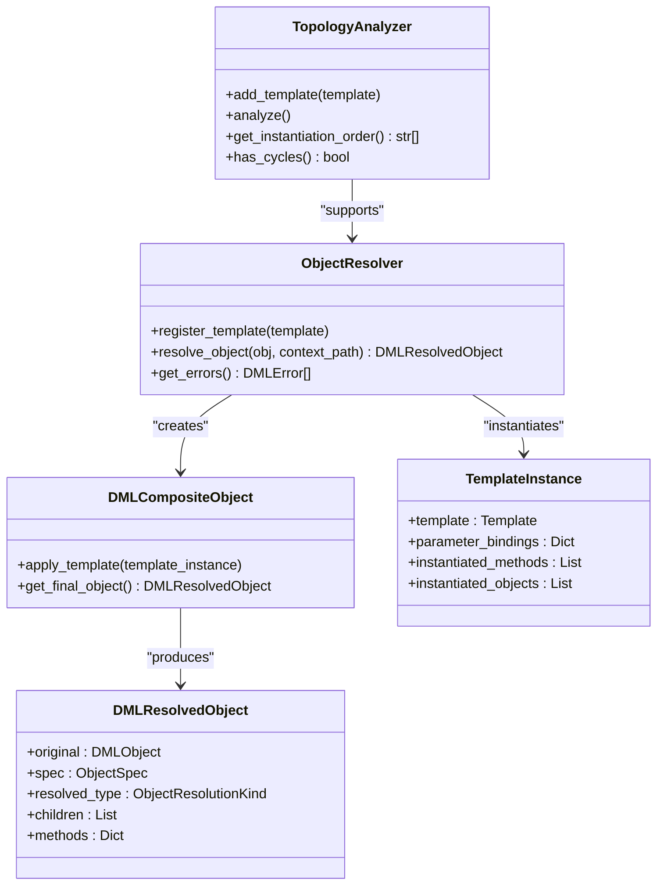
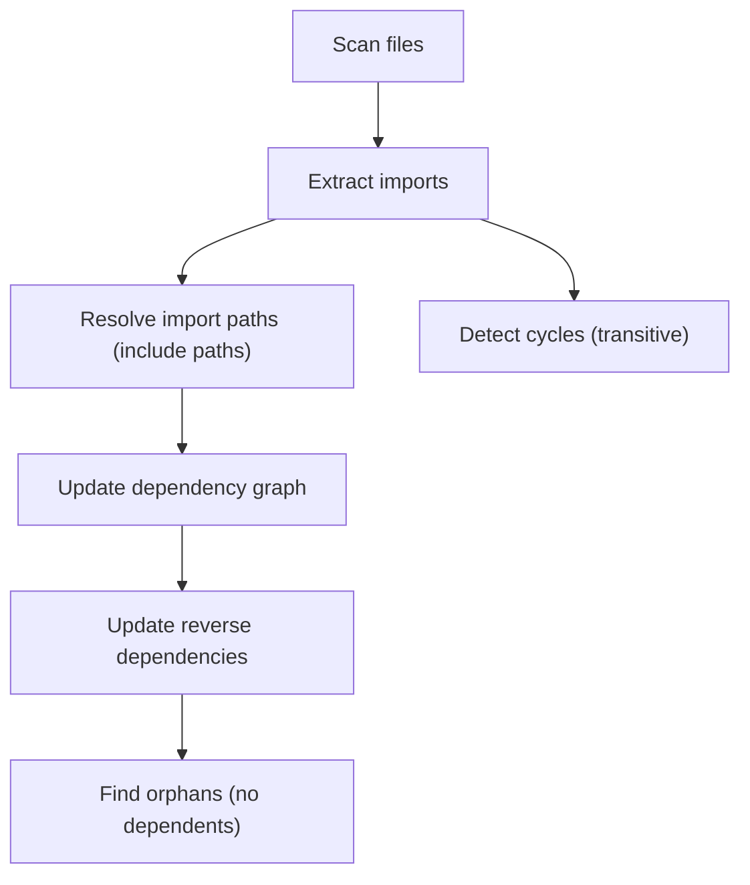
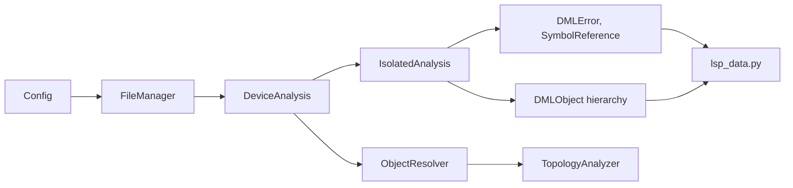

# DFA (Device File Analyzer)

<cite>
**Referenced Files in This Document**
- [src/dfa/main.rs](file://src/dfa/main.rs)
- [src/dfa/client.rs](file://src/dfa/client.rs)
- [python-port/dml_language_server/dfa/main.py](file://python-port/dml_language_server/dfa/main.py)
- [python-port/dml_language_server/cmd.py](file://python-port/dml_language_server/cmd.py)
- [python-port/dml_language_server/analysis/__init__.py](file://python-port/dml_language_server/analysis/__init__.py)
- [python-port/dml_language_server/analysis/types.py](file://python-port/dml_language_server/analysis/types.py)
- [python-port/dml_language_server/analysis/structure/objects.py](file://python-port/dml_language_server/analysis/structure/objects.py)
- [python-port/dml_language_server/analysis/templating/objects.py](file://python-port/dml_language_server/analysis/templating/objects.py)
- [python-port/dml_language_server/analysis/templating/topology.py](file://python-port/dml_language_server/analysis/templating/topology.py)
- [python-port/dml_language_server/config.py](file://python-port/dml_language_server/config.py)
- [python-port/dml_language_server/file_management.py](file://python-port/dml_language_server/file_management.py)
- [python-port/dml_language_server/lsp_data.py](file://python-port/dml_language_server/lsp_data.py)
- [README.md](file://README.md)
- [python-port/README.md](file://python-port/README.md)
</cite>

## Table of Contents
1. [Introduction](#introduction)
2. [Project Structure](#project-structure)
3. [Core Components](#core-components)
4. [Architecture Overview](#architecture-overview)
5. [Detailed Component Analysis](#detailed-component-analysis)
6. [Dependency Analysis](#dependency-analysis)
7. [Performance Considerations](#performance-considerations)
8. [Troubleshooting Guide](#troubleshooting-guide)
9. [Conclusion](#conclusion)
10. [Appendices](#appendices)

## Introduction
This document describes the DFA (Device File Analyzer) toolchain for DML device files. DFA provides:
- Standalone analysis of DML device files outside of an editor
- Dependency tracking and circular dependency detection
- Device graph analysis and template instantiation
- Cross-reference and symbol resolution across files
- Report generation in multiple formats
- Integration with the DLS (DML Language Server) for shared configuration and workflows

DFA is available in two forms:
- A Rust-based DFA client that communicates with the DLS via the Language Server Protocol
- A Python-based DFA CLI that performs analysis locally and can generate reports

## Project Structure
The DFA functionality spans both the Rust DLS and the Python port:
- Rust DLS DFA client: a small CLI that launches the DLS and streams diagnostics
- Python DFA CLI: a full-featured analyzer with dependency and topology analysis
- Shared analysis modules: parsing, templating, structure, and reporting logic
- Configuration and file management utilities for include paths, compile info, and dependency graphs

**Diagram sources**
- [src/dfa/main.rs](file://src/dfa/main.rs#L21-L192)
- [src/dfa/client.rs](file://src/dfa/client.rs#L112-L418)
- [python-port/dml_language_server/dfa/main.py](file://python-port/dml_language_server/dfa/main.py#L22-L337)
- [python-port/dml_language_server/cmd.py](file://python-port/dml_language_server/cmd.py#L21-L162)
- [python-port/dml_language_server/analysis/__init__.py](file://python-port/dml_language_server/analysis/__init__.py#L31-L565)
- [python-port/dml_language_server/analysis/types.py](file://python-port/dml_language_server/analysis/types.py#L16-L84)
- [python-port/dml_language_server/analysis/structure/objects.py](file://python-port/dml_language_server/analysis/structure/objects.py#L67-L672)
- [python-port/dml_language_server/analysis/templating/objects.py](file://python-port/dml_language_server/analysis/templating/objects.py#L217-L407)
- [python-port/dml_language_server/analysis/templating/topology.py](file://python-port/dml_language_server/analysis/templating/topology.py#L78-L450)
- [python-port/dml_language_server/config.py](file://python-port/dml_language_server/config.py#L89-L311)
- [python-port/dml_language_server/file_management.py](file://python-port/dml_language_server/file_management.py#L33-L387)
- [python-port/dml_language_server/lsp_data.py](file://python-port/dml_language_server/lsp_data.py#L42-L358)

**Section sources**
- [README.md](file://README.md#L1-L57)
- [python-port/README.md](file://python-port/README.md#L1-L243)

## Core Components
- DFA Rust client: parses CLI arguments, starts the DLS, sets configuration, opens files, waits for analysis, prints diagnostics, and exits with appropriate status.
- DFA Python CLI: discovers DML files, performs analysis (syntax, semantic, dependencies, symbols, metrics), detects circular dependencies and orphans, and generates reports.
- Analysis engine: enhanced parsing, symbol tables, scope resolution, template instantiation, and object composition.
- Templating subsystem: template topology analysis, dependency ranking, and instantiation ordering.
- Infrastructure: configuration loader (compile_commands.json), file manager (dependency graph), and LSP data conversions.

Key capabilities:
- Input formats: DML device files (.dml) and compile_commands.json for include paths and flags
- Output formats: summary, detailed, JSON (Python DFA CLI)
- Analysis types: syntax, semantic, dependencies, symbols, metrics (Python DFA CLI)
- Shared configuration: linting enablement, lint config path, zero-indexed diagnostics (Rust DFA), and compile info (both)

**Section sources**
- [src/dfa/main.rs](file://src/dfa/main.rs#L44-L122)
- [src/dfa/client.rs](file://src/dfa/client.rs#L112-L209)
- [python-port/dml_language_server/dfa/main.py](file://python-port/dml_language_server/dfa/main.py#L22-L90)
- [python-port/dml_language_server/analysis/__init__.py](file://python-port/dml_language_server/analysis/__init__.py#L372-L547)
- [python-port/dml_language_server/analysis/templating/topology.py](file://python-port/dml_language_server/analysis/templating/topology.py#L270-L398)
- [python-port/dml_language_server/config.py](file://python-port/dml_language_server/config.py#L131-L224)
- [python-port/dml_language_server/file_management.py](file://python-port/dml_language_server/file_management.py#L42-L74)

## Architecture Overview
The DFA architecture integrates a Rust DLS client and a Python DFA CLI, both sharing analysis and infrastructure modules.

**Diagram sources**
- [src/dfa/main.rs](file://src/dfa/main.rs#L124-L191)
- [src/dfa/client.rs](file://src/dfa/client.rs#L112-L154)
- [src/dfa/client.rs](file://src/dfa/client.rs#L172-L194)
- [src/dfa/client.rs](file://src/dfa/client.rs#L338-L380)
- [src/dfa/client.rs](file://src/dfa/client.rs#L388-L416)

**Diagram sources**
- [python-port/dml_language_server/dfa/main.py](file://python-port/dml_language_server/dfa/main.py#L78-L280)
- [python-port/dml_language_server/cmd.py](file://python-port/dml_language_server/cmd.py#L21-L115)
- [python-port/dml_language_server/analysis/__init__.py](file://python-port/dml_language_server/analysis/__init__.py#L372-L547)
- [python-port/dml_language_server/analysis/types.py](file://python-port/dml_language_server/analysis/types.py#L40-L84)
- [python-port/dml_language_server/analysis/structure/objects.py](file://python-port/dml_language_server/analysis/structure/objects.py#L67-L672)
- [python-port/dml_language_server/analysis/templating/objects.py](file://python-port/dml_language_server/analysis/templating/objects.py#L217-L407)
- [python-port/dml_language_server/analysis/templating/topology.py](file://python-port/dml_language_server/analysis/templating/topology.py#L270-L450)
- [python-port/dml_language_server/config.py](file://python-port/dml_language_server/config.py#L89-L311)
- [python-port/dml_language_server/file_management.py](file://python-port/dml_language_server/file_management.py#L33-L387)

## Detailed Component Analysis

### DFA Rust Client (Standalone DLS Runner)
Responsibilities:
- Parse CLI arguments (DLS binary, workspace roots, compile info, linting, zero-indexed, test mode, quiet)
- Launch DLS process and establish JSON-RPC communication
- Send initialize, add workspaces, update config, didOpen events
- Wait for progress start/end and collect diagnostics
- Output diagnostics and exit with error code if test mode is enabled and errors exist

Key behaviors:
- Uses a background thread to read server messages and a channel for synchronization
- Tracks waiting for diagnostics and lints per file
- Converts LSP diagnostics to internal diagnostics and prints with optional zero-based line index

**Diagram sources**
- [src/dfa/main.rs](file://src/dfa/main.rs#L124-L191)
- [src/dfa/client.rs](file://src/dfa/client.rs#L112-L154)
- [src/dfa/client.rs](file://src/dfa/client.rs#L172-L194)
- [src/dfa/client.rs](file://src/dfa/client.rs#L338-L380)
- [src/dfa/client.rs](file://src/dfa/client.rs#L388-L416)

**Section sources**
- [src/dfa/main.rs](file://src/dfa/main.rs#L44-L122)
- [src/dfa/main.rs](file://src/dfa/main.rs#L124-L191)
- [src/dfa/client.rs](file://src/dfa/client.rs#L112-L209)
- [src/dfa/client.rs](file://src/dfa/client.rs#L215-L325)
- [src/dfa/client.rs](file://src/dfa/client.rs#L338-L416)

### DFA Python CLI (Local Analysis)
Responsibilities:
- Discover DML files (single or recursive directory traversal)
- Perform analysis types: syntax, semantic, dependencies, symbols, metrics
- Detect circular dependencies and orphans
- Generate reports in summary, detailed, or JSON formats
- Support compile info loading and linting configuration

Processing pipeline:
- Argument parsing and validation
- Load compile commands and initialize Config
- Build file list (files or directories)
- Analyze each file and collect results
- Optional special analysis: circular dependencies, orphans
- Generate report and exit with error code if any errors

**Diagram sources**
- [python-port/dml_language_server/dfa/main.py](file://python-port/dml_language_server/dfa/main.py#L78-L280)

**Section sources**
- [python-port/dml_language_server/dfa/main.py](file://python-port/dml_language_server/dfa/main.py#L22-L90)
- [python-port/dml_language_server/dfa/main.py](file://python-port/dml_language_server/dfa/main.py#L118-L184)
- [python-port/dml_language_server/dfa/main.py](file://python-port/dml_language_server/dfa/main.py#L185-L280)

### Analysis Engine: Parsing, Symbols, and References
Highlights:
- Enhanced parsing with fallback to basic parser
- Symbol table with scopes and cross-file references
- Isolated analysis per file with template system integration
- DeviceAnalysis orchestrates dependency analysis and cross-file symbol resolution

**Diagram sources**
- [python-port/dml_language_server/analysis/__init__.py](file://python-port/dml_language_server/analysis/__init__.py#L372-L547)
- [python-port/dml_language_server/analysis/__init__.py](file://python-port/dml_language_server/analysis/__init__.py#L181-L370)

**Section sources**
- [python-port/dml_language_server/analysis/__init__.py](file://python-port/dml_language_server/analysis/__init__.py#L181-L370)
- [python-port/dml_language_server/analysis/__init__.py](file://python-port/dml_language_server/analysis/__init__.py#L372-L547)

### Template Instantiation and Inheritance Resolution
Highlights:
- ObjectResolver composes objects from templates and resolves methods and parameters
- DMLCompositeObject merges template contributions and tracks composition errors
- ObjectSpec captures template applications and parameter bindings
- TopologyAnalyzer computes ranks and detects cycles in template dependencies

**Diagram sources**
- [python-port/dml_language_server/analysis/templating/objects.py](file://python-port/dml_language_server/analysis/templating/objects.py#L217-L407)
- [python-port/dml_language_server/analysis/templating/topology.py](file://python-port/dml_language_server/analysis/templating/topology.py#L270-L450)

**Section sources**
- [python-port/dml_language_server/analysis/templating/objects.py](file://python-port/dml_language_server/analysis/templating/objects.py#L217-L407)
- [python-port/dml_language_server/analysis/templating/topology.py](file://python-port/dml_language_server/analysis/templating/topology.py#L78-L450)

### Dependency Tracking and Graph Analysis
Highlights:
- FileManager builds dependency and reverse-dependency graphs
- Supports recursive discovery, import resolution, and transitive closure
- Provides helpers to find orphans and circular dependencies

**Diagram sources**
- [python-port/dml_language_server/file_management.py](file://python-port/dml_language_server/file_management.py#L42-L74)
- [python-port/dml_language_server/file_management.py](file://python-port/dml_language_server/file_management.py#L163-L215)
- [python-port/dml_language_server/file_management.py](file://python-port/dml_language_server/file_management.py#L242-L303)

**Section sources**
- [python-port/dml_language_server/file_management.py](file://python-port/dml_language_server/file_management.py#L163-L215)
- [python-port/dml_language_server/file_management.py](file://python-port/dml_language_server/file_management.py#L242-L303)

### Command-Line Options and Usage
Rust DFA (DLS client):
- Required: DLS binary path
- Optional: workspace (-w), test mode (-t), quiet (-q), compile-info (-c), suppress-imports (-s), zero-indexed (-z), linting-enabled (-l), lint-cfg-path (-p)
- Multiple files accepted; prints diagnostics and exits with error if test mode is enabled and errors exist

Python DFA CLI:
- Subcommands: analyze, deps
- analyze options: --recursive/-r, --analysis-type/-t (syntax, semantic, dependencies, symbols, metrics, all), --compile-info, --output/-o, --format/-f (summary, detailed, json), --verbose/-v, --quiet/-q, --check-deps, --find-orphans, --errors-only
- deps options: --format (text, dot, json)

Integration with DLS:
- Both share configuration via compile_commands.json and lint configuration
- Rust DFA passes configuration to DLS via update_config RPC

**Section sources**
- [src/dfa/main.rs](file://src/dfa/main.rs#L44-L122)
- [python-port/dml_language_server/dfa/main.py](file://python-port/dml_language_server/dfa/main.py#L22-L90)
- [python-port/README.md](file://python-port/README.md#L49-L68)

### Input and Output Formats
Inputs:
- DML device files (.dml)
- compile_commands.json: per-device include paths and flags
- Optional lint configuration file for linting

Outputs:
- Rust DFA: human-readable diagnostics (optionally zero-indexed)
- Python DFA: summary, detailed, or JSON reports

**Section sources**
- [python-port/dml_language_server/config.py](file://python-port/dml_language_server/config.py#L131-L164)
- [python-port/dml_language_server/dfa/main.py](file://python-port/dml_language_server/dfa/main.py#L208-L275)
- [README.md](file://README.md#L36-L57)

### Practical Examples and Workflows
Common scenarios:
- Single-file analysis: run the DFA CLI on a .dml file to get syntax and semantic diagnostics
- Directory analysis: recursively scan a directory and generate a detailed or JSON report
- Circular dependency detection: enable --check-deps to identify template or file cycles
- Orphan detection: enable --find-orphans to list unreferenced files
- Integration with CI: use --test mode (Rust DFA) or exit code behavior (Python DFA) to fail builds on errors

Batch processing:
- Discover all .dml files in a directory
- Analyze in parallel (Python DFA uses a thread pool for analysis)
- Aggregate results and produce a consolidated report

**Section sources**
- [python-port/dml_language_server/dfa/main.py](file://python-port/dml_language_server/dfa/main.py#L146-L184)
- [python-port/dml_language_server/analysis/__init__.py](file://python-port/dml_language_server/analysis/__init__.py#L388-L391)

### Relationship to the DLS and Shared Configuration
- Both Rust DFA and Python DFA rely on compile_commands.json for include paths and flags
- Python DFA CLI can be used independently; Rust DFA launches the DLS and forwards configuration updates
- Linting can be configured via initialization options and lint config files for both

**Section sources**
- [python-port/dml_language_server/config.py](file://python-port/dml_language_server/config.py#L131-L224)
- [src/dfa/main.rs](file://src/dfa/main.rs#L151-L158)
- [src/dfa/client.rs](file://src/dfa/client.rs#L205-L209)

## Dependency Analysis
The Python DFA relies on several modules working together:
- Config loads compile_commands.json and manages include paths and flags
- FileManager discovers files, extracts imports, and maintains dependency graphs
- Analysis engine performs parsing, symbol resolution, and template processing
- TopologyAnalyzer ranks templates and detects cycles
- LSP data converters bridge internal structures to LSP types

**Diagram sources**
- [python-port/dml_language_server/config.py](file://python-port/dml_language_server/config.py#L89-L311)
- [python-port/dml_language_server/file_management.py](file://python-port/dml_language_server/file_management.py#L33-L387)
- [python-port/dml_language_server/analysis/__init__.py](file://python-port/dml_language_server/analysis/__init__.py#L372-L547)
- [python-port/dml_language_server/analysis/templating/objects.py](file://python-port/dml_language_server/analysis/templating/objects.py#L217-L407)
- [python-port/dml_language_server/analysis/templating/topology.py](file://python-port/dml_language_server/analysis/templating/topology.py#L270-L450)
- [python-port/dml_language_server/lsp_data.py](file://python-port/dml_language_server/lsp_data.py#L42-L358)

**Section sources**
- [python-port/dml_language_server/analysis/__init__.py](file://python-port/dml_language_server/analysis/__init__.py#L372-L547)
- [python-port/dml_language_server/analysis/templating/topology.py](file://python-port/dml_language_server/analysis/templating/topology.py#L318-L398)

## Performance Considerations
- Parallelism: Python DFA uses a thread pool for analysis; consider tuning worker count for large projects
- Memory: Python DFA maintains caches for file info and dependency graphs; clear caches when analyzing very large hierarchies
- I/O: Prefer compile_commands.json to avoid expensive filesystem scans for include paths
- Suppression: Use suppress-imports to limit analysis scope when only specific files are needed
- Reporting: Choose JSON output for machine processing and reduce verbosity to minimize overhead

[No sources needed since this section provides general guidance]

## Troubleshooting Guide
Common issues and remedies:
- Missing compile_commands.json: ensure the file exists and includes proper device paths and include directories
- Import resolution failures: verify include paths and relative imports; check that files exist
- Circular dependencies: use --check-deps or TopologyAnalyzer to locate cycles; refactor templates or device graphs
- Excessive diagnostics: adjust lint configuration or increase max diagnostics per file
- Zero-indexing confusion: use zero-indexed flag in Rust DFA or adjust reporting expectations

Debugging aids:
- Enable verbose logging in Python DFA CLI
- Use quiet mode to suppress noise and focus on errors
- Inspect JSON report for structured diagnostics

**Section sources**
- [python-port/dml_language_server/dfa/main.py](file://python-port/dml_language_server/dfa/main.py#L99-L111)
- [python-port/dml_language_server/dfa/main.py](file://python-port/dml_language_server/dfa/main.py#L266-L279)
- [python-port/dml_language_server/analysis/templating/topology.py](file://python-port/dml_language_server/analysis/templating/topology.py#L140-L183)

## Conclusion
DFA provides robust standalone analysis for DML device files, supporting dependency tracking, template instantiation, and comprehensive reporting. Users can choose between the Rust DLS client for integrated workflows and the Python CLI for local batch analysis. Shared configuration via compile_commands.json ensures consistent behavior across both tools.

[No sources needed since this section summarizes without analyzing specific files]

## Appendices

### Appendix A: Command Reference
Rust DFA (DLS client):
- Required: DLS binary path
- Options: -w/--workspace, -t/--test, -q/--quiet, -c/--compile-info, -s/--suppress-imports, -z/--zero-indexed, -l/--linting-enabled, -p/--lint-cfg-path
- Multiple files supported

Python DFA CLI:
- analyze: --recursive/-r, --analysis-type/-t, --compile-info, --output/-o, --format/-f, --verbose/-v, --quiet/-q, --check-deps, --find-orphans, --errors-only
- deps: --format (text, dot, json)

**Section sources**
- [src/dfa/main.rs](file://src/dfa/main.rs#L44-L122)
- [python-port/dml_language_server/dfa/main.py](file://python-port/dml_language_server/dfa/main.py#L22-L90)

### Appendix B: Configuration Reference
- compile_commands.json: per-device includes and dmlc_flags
- Lint configuration: enabled/disabled rules and rule-specific settings
- Initialization options: linting enablement, lint config file, max diagnostics per file, log level

**Section sources**
- [python-port/dml_language_server/config.py](file://python-port/dml_language_server/config.py#L131-L224)
- [python-port/dml_language_server/lsp_data.py](file://python-port/dml_language_server/lsp_data.py#L335-L358)