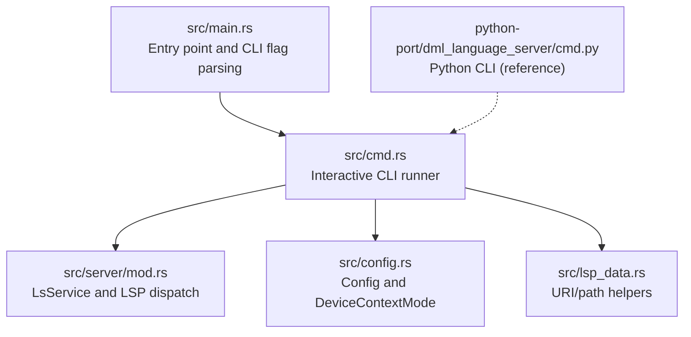
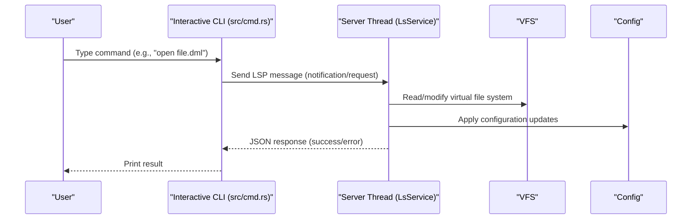
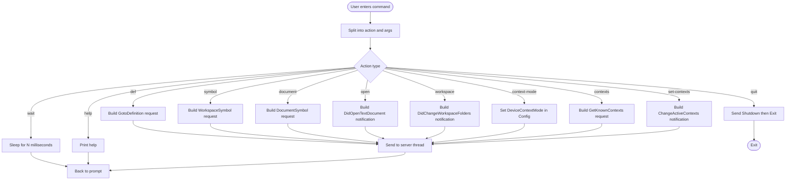
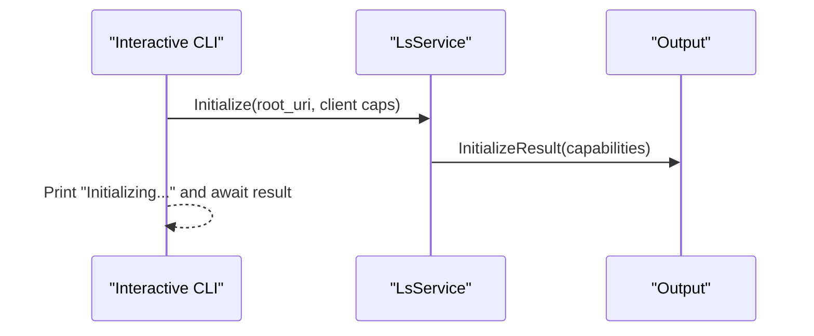
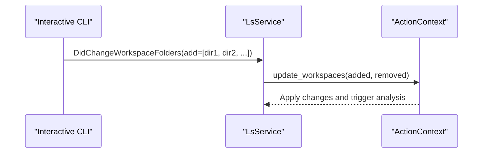
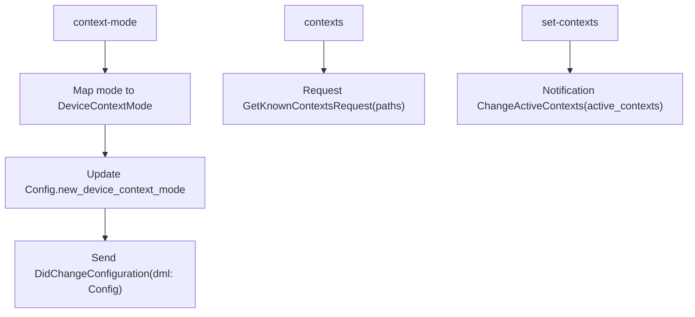
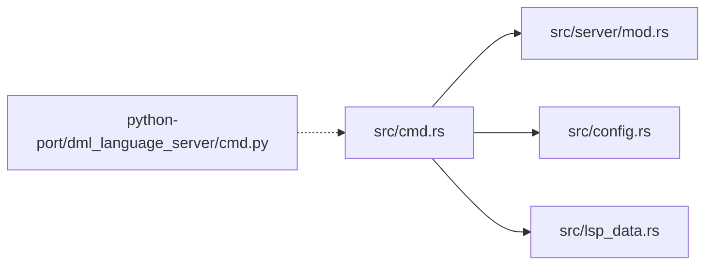

# DLS Binary

<cite>
**Referenced Files in This Document**
- [src/main.rs](file://src/main.rs)
- [src/cmd.rs](file://src/cmd.rs)
- [src/config.rs](file://src/config.rs)
- [src/server/mod.rs](file://src/server/mod.rs)
- [src/lsp_data.rs](file://src/lsp_data.rs)
- [python-port/dml_language_server/cmd.py](file://python-port/dml_language_server/cmd.py)
- [USAGE.md](file://USAGE.md)
</cite>

## Table of Contents
1. [Introduction](#introduction)
2. [Project Structure](#project-structure)
3. [Core Components](#core-components)
4. [Architecture Overview](#architecture-overview)
5. [Detailed Component Analysis](#detailed-component-analysis)
6. [Dependency Analysis](#dependency-analysis)
7. [Performance Considerations](#performance-considerations)
8. [Troubleshooting Guide](#troubleshooting-guide)
9. [Conclusion](#conclusion)
10. [Appendices](#appendices)

## Introduction
This document provides comprehensive documentation for the DLS (Device Language Server) binary. It explains the command-line interface, interactive mode usage, initialization and workspace management, device context configuration, and the relationship between CLI commands and underlying LSP operations. It also covers performance considerations, memory usage patterns, debugging techniques, and integration with external tools.

## Project Structure
The DLS binary is implemented primarily in Rust under the src/ directory. The CLI mode is implemented in the cmd module, which translates simple commands into LSP requests and notifications and runs a server instance on a dedicated thread. Configuration and device context modes are defined in config.rs. The server’s runtime and LSP dispatch are implemented in server/mod.rs. Utility functions for URI/path conversion are in lsp_data.rs. A Python port of the CLI exists under python-port/ for reference and testing.

**Diagram sources**
- [src/main.rs](file://src/main.rs#L15-L59)
- [src/cmd.rs](file://src/cmd.rs#L46-L140)
- [src/server/mod.rs](file://src/server/mod.rs#L68-L84)
- [src/config.rs](file://src/config.rs#L100-L139)
- [src/lsp_data.rs](file://src/lsp_data.rs#L46-L105)
- [python-port/dml_language_server/cmd.py](file://python-port/dml_language_server/cmd.py#L21-L115)

**Section sources**
- [src/main.rs](file://src/main.rs#L15-L59)
- [src/cmd.rs](file://src/cmd.rs#L46-L140)
- [src/server/mod.rs](file://src/server/mod.rs#L68-L84)
- [src/config.rs](file://src/config.rs#L100-L139)
- [src/lsp_data.rs](file://src/lsp_data.rs#L46-L105)
- [python-port/dml_language_server/cmd.py](file://python-port/dml_language_server/cmd.py#L21-L115)

## Core Components
- Command-line entry point and flags:
  - --cli starts the interactive CLI mode.
  - --compile-info path sets the DML compile-info file path.
  - -l/--linting toggles linting on/off.
  - --lint-cfg path sets the lint configuration file path.
- Interactive CLI:
  - Reads commands from stdin and converts them to LSP requests/notifications.
  - Uses a channel to communicate with a server thread.
  - Provides help, quit, wait, open, workspace, def, symbol, document, context-mode, contexts, set-contexts.
- Server runtime:
  - Initializes with a VFS and configuration.
  - Handles LSP Initialize, Shutdown, and various requests/notifications.
  - Manages workspace folders and device contexts.
- Configuration and device context modes:
  - DeviceContextMode controls when to activate device contexts during analysis.
  - Config holds linting, compile info, and other options.

**Section sources**
- [src/main.rs](file://src/main.rs#L21-L59)
- [src/cmd.rs](file://src/cmd.rs#L46-L140)
- [src/server/mod.rs](file://src/server/mod.rs#L68-L84)
- [src/config.rs](file://src/config.rs#L100-L139)

## Architecture Overview
The DLS binary supports two modes:
- Non-CLI mode: Runs a persistent LSP server over stdin/stdout.
- CLI mode: Runs an interactive shell that translates typed commands into LSP messages and prints JSON responses.

**Diagram sources**
- [src/cmd.rs](file://src/cmd.rs#L46-L140)
- [src/server/mod.rs](file://src/server/mod.rs#L322-L470)
- [src/config.rs](file://src/config.rs#L120-L139)

## Detailed Component Analysis

### Command-Line Interface and Interactive Mode
- Supported commands:
  - help: Display help.
  - quit: Shutdown and exit.
  - wait <milliseconds>: Sleep to allow background work to complete.
  - open <file_name>: Open a file to trigger initial analysis.
  - workspace <dir ...>: Add workspace directories.
  - def <file_name> <row> <col>: textDocument/definition.
  - symbol <query>: workspace/symbol.
  - document <file_name>: textDocument/documentSymbol.
  - context-mode <mode>: Set device context mode.
  - contexts <paths ...>: Query active device contexts for paths.
  - set-contexts <paths ...>: Set active device contexts.
- Parameter specifications:
  - Line and column indices are zero-based for def.
  - context-mode accepts: always, anynew, first, samemodule, never.
  - workspace and set-contexts accept one or more paths.
- Expected output formats:
  - Responses are printed as JSON. Success responses include a request ID and structured data. Errors are returned as JSONRPC error objects.

**Diagram sources**
- [src/cmd.rs](file://src/cmd.rs#L68-L140)
- [src/cmd.rs](file://src/cmd.rs#L142-L187)
- [src/cmd.rs](file://src/cmd.rs#L230-L246)
- [src/cmd.rs](file://src/cmd.rs#L248-L274)
- [src/cmd.rs](file://src/cmd.rs#L276-L297)
- [src/cmd.rs](file://src/cmd.rs#L299-L323)
- [src/cmd.rs](file://src/cmd.rs#L373-L402)

**Section sources**
- [src/cmd.rs](file://src/cmd.rs#L68-L140)
- [src/cmd.rs](file://src/cmd.rs#L142-L187)
- [src/cmd.rs](file://src/cmd.rs#L230-L246)
- [src/cmd.rs](file://src/cmd.rs#L248-L274)
- [src/cmd.rs](file://src/cmd.rs#L276-L297)
- [src/cmd.rs](file://src/cmd.rs#L299-L323)
- [src/cmd.rs](file://src/cmd.rs#L405-L443)

### Initialization Process
- On startup, the CLI initializes a server thread with a VFS and configuration.
- Sends an Initialize request with client capabilities and optional workspace folders.
- Prints an initialization message and waits for InitializeResult.

**Diagram sources**
- [src/cmd.rs](file://src/cmd.rs#L373-L402)
- [src/server/mod.rs](file://src/server/mod.rs#L207-L289)

**Section sources**
- [src/cmd.rs](file://src/cmd.rs#L373-L402)
- [src/server/mod.rs](file://src/server/mod.rs#L207-L289)

### Workspace Management
- Adding workspace folders:
  - The workspace command builds a DidChangeWorkspaceFolders notification with added folders.
  - The server applies the change and updates its resolver and analysis accordingly.
- Removing workspace folders:
  - The internal remove_workspaces function constructs a similar notification with removed folders.

**Diagram sources**
- [src/cmd.rs](file://src/cmd.rs#L248-L274)
- [src/server/mod.rs](file://src/server/mod.rs#L261-L285)

**Section sources**
- [src/cmd.rs](file://src/cmd.rs#L248-L274)
- [src/server/mod.rs](file://src/server/mod.rs#L261-L285)

### Device Context Configuration Options
- Device context modes:
  - always: Activate every encountered context.
  - anynew: Activate if a device imports a file not covered by existing contexts.
  - first: Activate only if all imports lack active contexts.
  - samemodule: Activate if device is in the same or child directory as an activated context.
  - never: Never auto-activate contexts.
- Setting context mode:
  - The context-mode command updates the active configuration and sends a DidChangeConfiguration notification.
- Querying and setting active contexts:
  - contexts: Requests known contexts for given paths.
  - set-contexts: Sets active contexts to provided device URIs.

**Diagram sources**
- [src/cmd.rs](file://src/cmd.rs#L276-L297)
- [src/cmd.rs](file://src/cmd.rs#L299-L323)
- [src/config.rs](file://src/config.rs#L100-L118)

**Section sources**
- [src/cmd.rs](file://src/cmd.rs#L276-L297)
- [src/cmd.rs](file://src/cmd.rs#L299-L323)
- [src/config.rs](file://src/config.rs#L100-L118)

### Relationship Between CLI Commands and LSP Operations
- def -> textDocument/definition
- symbol -> workspace/symbol
- document -> textDocument/documentSymbol
- open -> textDocument/didOpen
- workspace -> workspace/didChangeWorkspaceFolders
- context-mode -> workspace/didChangeConfiguration
- contexts -> dml/getKnownContexts
- set-contexts -> dml/changeActiveContexts

**Section sources**
- [src/cmd.rs](file://src/cmd.rs#L142-L187)
- [src/cmd.rs](file://src/cmd.rs#L230-L246)
- [src/cmd.rs](file://src/cmd.rs#L248-L274)
- [src/cmd.rs](file://src/cmd.rs#L276-L297)
- [src/cmd.rs](file://src/cmd.rs#L299-L323)

### Practical Workflows
- Open a file and analyze:
  - Use open <file_name> to load a DML file. The server reads the file and triggers analysis; a longer wait may be needed due to chained imports.
- Navigate to a definition:
  - Use def <file_name> <row> <col> to query the definition at a position.
- Search symbols:
  - Use symbol <query> to search workspace symbols.
- View document symbols:
  - Use document <file_name> to list document-level symbols.
- Manage workspaces:
  - Use workspace <dir1> <dir2> ... to add directories to the workspace.
- Configure device contexts:
  - Use context-mode <mode> to set the activation policy.
  - Use contexts <paths...> to query active contexts.
  - Use set-contexts <paths...> to set active contexts.

**Section sources**
- [src/cmd.rs](file://src/cmd.rs#L68-L140)
- [src/cmd.rs](file://src/cmd.rs#L405-L443)

## Dependency Analysis
- CLI depends on:
  - LSP request/notification builders in cmd.rs.
  - Server runtime in server/mod.rs.
  - Configuration in config.rs.
  - URI/path helpers in lsp_data.rs.
- The Python CLI (python-port/dml_language_server/cmd.py) provides a reference implementation for file discovery and analysis, distinct from the interactive LSP-based CLI.

**Diagram sources**
- [src/cmd.rs](file://src/cmd.rs#L46-L140)
- [src/server/mod.rs](file://src/server/mod.rs#L68-L84)
- [src/config.rs](file://src/config.rs#L120-L139)
- [src/lsp_data.rs](file://src/lsp_data.rs#L46-L105)
- [python-port/dml_language_server/cmd.py](file://python-port/dml_language_server/cmd.py#L21-L115)

**Section sources**
- [src/cmd.rs](file://src/cmd.rs#L46-L140)
- [src/server/mod.rs](file://src/server/mod.rs#L68-L84)
- [src/config.rs](file://src/config.rs#L120-L139)
- [src/lsp_data.rs](file://src/lsp_data.rs#L46-L105)
- [python-port/dml_language_server/cmd.py](file://python-port/dml_language_server/cmd.py#L21-L115)

## Performance Considerations
- Large projects:
  - Opening files may trigger analysis of multiple imported files. Use wait to allow background work to complete.
  - Workspace folder additions can trigger analysis across directories.
- Memory usage:
  - Analysis retains results for a configurable duration. Excessively short retention durations are rejected to avoid premature discards.
- Concurrency:
  - The server uses channels and threads to handle messages and background analysis. Requests may block while waiting for VFS or build operations.
- Linting:
  - Enabling/disabling linting affects analysis time and output volume. Inline lint directives can fine-tune per-file behavior.

**Section sources**
- [src/cmd.rs](file://src/cmd.rs#L83-L88)
- [src/server/mod.rs](file://src/server/mod.rs#L372-L381)
- [src/config.rs](file://src/config.rs#L298-L312)
- [USAGE.md](file://USAGE.md#L15-L48)

## Troubleshooting Guide
- Unknown action:
  - The CLI prints an error and continues prompting. Use help to list supported commands.
- Initialization issues:
  - Ensure the server has sent InitializeResult before issuing requests. The CLI prints an initialization message upon sending Initialize.
- Parsing and URI issues:
  - URI/path helpers normalize paths and handle UNC paths on Windows. Invalid schemes or malformed paths produce errors.
- Lint configuration:
  - Unknown lint fields are reported as warnings. Inline lint directives can override linting for specific lines or files.
- Exit and shutdown:
  - quit sends Shutdown followed by Exit. The CLI waits briefly to ensure clean termination.

**Section sources**
- [src/cmd.rs](file://src/cmd.rs#L126-L130)
- [src/cmd.rs](file://src/cmd.rs#L399-L402)
- [src/lsp_data.rs](file://src/lsp_data.rs#L46-L105)
- [USAGE.md](file://USAGE.md#L15-L48)
- [src/cmd.rs](file://src/cmd.rs#L119-L125)

## Conclusion
The DLS binary offers a robust interactive CLI that maps simple commands to LSP operations, enabling efficient navigation, symbol queries, and workspace/context management. Its server runtime integrates with a VFS and configuration subsystem to support large-scale DML projects. Proper use of wait, workspace management, and device context modes ensures accurate and timely results.

## Appendices

### Appendix A: Command Reference
- help: Display help.
- quit: Shutdown and exit.
- wait <milliseconds>: Sleep to allow background work to complete.
- open <file_name>: Open a file to perform initial analysis.
- workspace <dir ...>: Add workspace directories.
- def <file_name> <row> <col>: textDocument/definition.
- symbol <query>: workspace/symbol.
- document <file_name>: textDocument/documentSymbol.
- context-mode <mode>: Set device context mode (always, anynew, first, samemodule, never).
- contexts <paths ...>: Query active device contexts for paths.
- set-contexts <paths ...>: Set active device contexts to provided device URIs.

**Section sources**
- [src/cmd.rs](file://src/cmd.rs#L405-L443)

### Appendix B: Configuration Options
- linting_enabled: Enable or disable linting.
- lint_cfg_path: Path to lint configuration file.
- compile_info_path: Path to DML compile-info file.
- new_device_context_mode: Device context activation policy.

**Section sources**
- [src/main.rs](file://src/main.rs#L29-L42)
- [src/config.rs](file://src/config.rs#L120-L139)