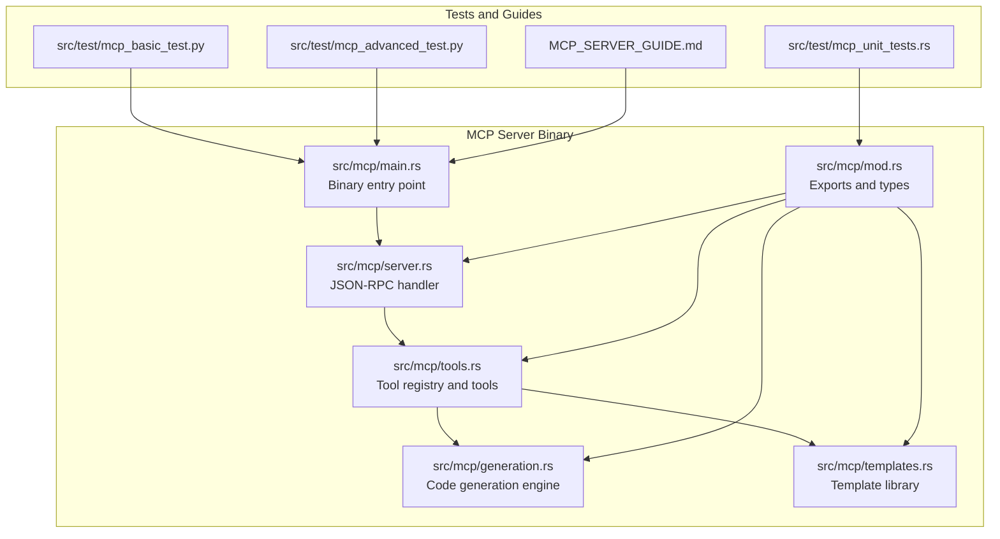
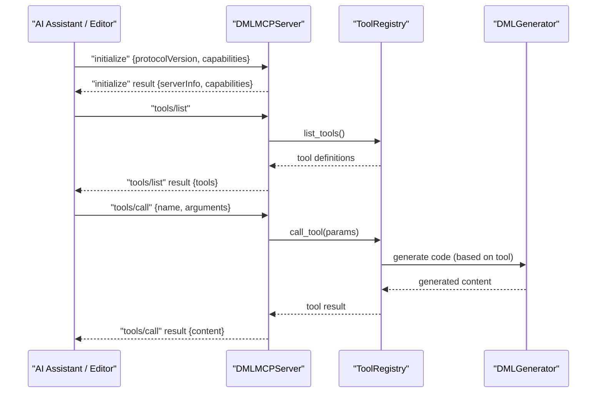
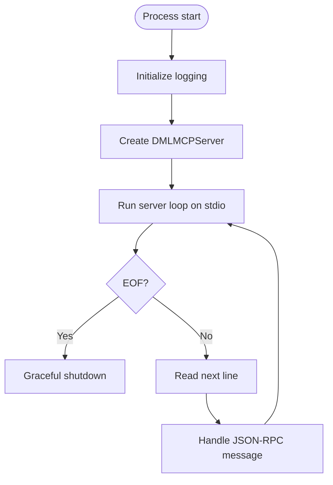
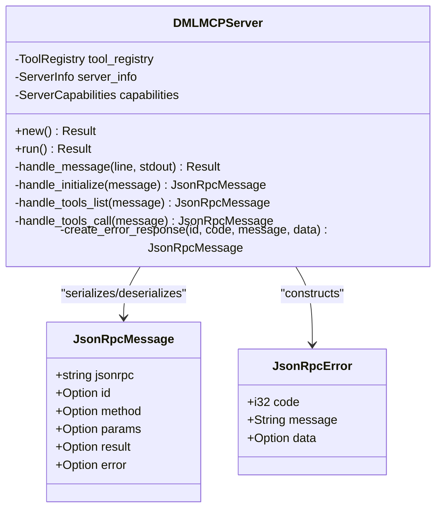
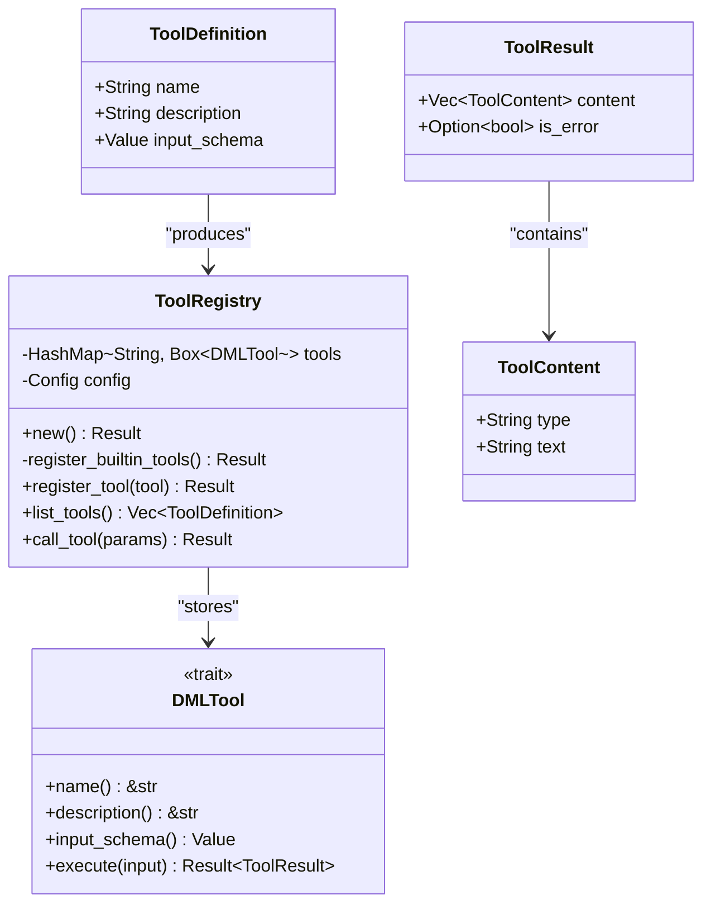
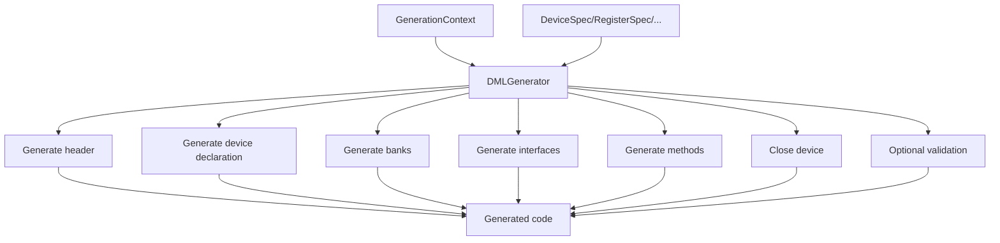
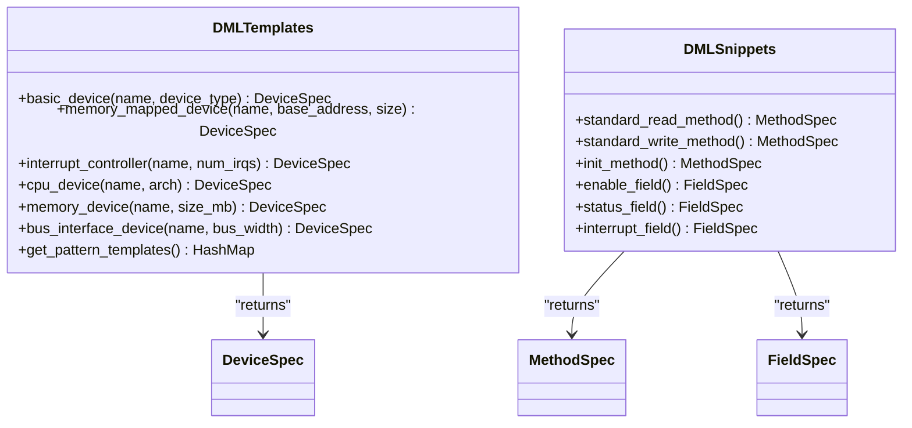
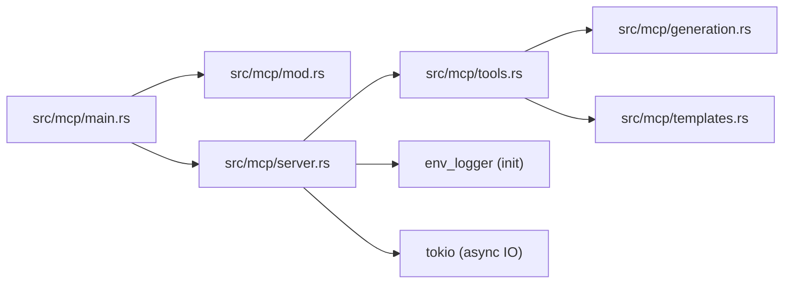

# MCP Server

<cite>
**Referenced Files in This Document**
- [MCP main entry](file://src/mcp/main.rs)
- [MCP module](file://src/mcp/mod.rs)
- [MCP server](file://src/mcp/server.rs)
- [MCP tools](file://src/mcp/tools.rs)
- [MCP templates](file://src/mcp/templates.rs)
- [MCP generation](file://src/mcp/generation.rs)
- [MCP guide](file://MCP_SERVER_GUIDE.md)
- [CLI command runner](file://src/cmd.rs)
- [Rust config](file://src/config.rs)
- [Python CLI](file://python-port/dml_language_server/cmd.py)
- [Python config](file://python-port/dml_language_server/config.py)
- [Basic MCP test](file://src/test/mcp_basic_test.py)
- [Advanced MCP test](file://src/test/mcp_advanced_test.py)
- [MCP unit tests](file://src/test/mcp_unit_tests.rs)
</cite>

## Table of Contents
1. [Introduction](#introduction)
2. [Project Structure](#project-structure)
3. [Core Components](#core-components)
4. [Architecture Overview](#architecture-overview)
5. [Detailed Component Analysis](#detailed-component-analysis)
6. [Dependency Analysis](#dependency-analysis)
7. [Performance Considerations](#performance-considerations)
8. [Troubleshooting Guide](#troubleshooting-guide)
9. [Conclusion](#conclusion)
10. [Appendices](#appendices)

## Introduction
This document provides comprehensive documentation for the MCP (Model Context Protocol) server command-line interface embedded in the DML Language Server. It explains how to start the MCP server, configure logging and capabilities, and leverage AI-assisted development workflows. The MCP server exposes tools for generating DML device models, registers, and applying design patterns, integrating with AI assistants and modern editors via the MCP protocol. It also covers practical examples, performance tuning, and operational guidance for production deployments.

## Project Structure
The MCP server is implemented as a dedicated binary within the DML Language Server codebase. It consists of:
- A main entry point that initializes logging and starts the server
- An MCP server that speaks JSON-RPC over stdin/stdout
- A tool registry that manages built-in DML generation tools
- A code generation engine and template library for device patterns
- Tests and integration examples demonstrating usage with AI assistants

**Diagram sources**
- [MCP main entry](file://src/mcp/main.rs#L1-L23)
- [MCP server](file://src/mcp/server.rs#L1-L229)
- [MCP tools](file://src/mcp/tools.rs#L1-L399)
- [MCP generation](file://src/mcp/generation.rs#L1-L411)
- [MCP templates](file://src/mcp/templates.rs#L1-L428)
- [MCP module](file://src/mcp/mod.rs#L1-L54)
- [Basic MCP test](file://src/test/mcp_basic_test.py#L1-L134)
- [Advanced MCP test](file://src/test/mcp_advanced_test.py#L1-L184)
- [MCP unit tests](file://src/test/mcp_unit_tests.rs#L1-L406)
- [MCP guide](file://MCP_SERVER_GUIDE.md#L1-L280)

**Section sources**
- [MCP main entry](file://src/mcp/main.rs#L1-L23)
- [MCP module](file://src/mcp/mod.rs#L1-L54)
- [MCP server](file://src/mcp/server.rs#L1-L229)
- [MCP tools](file://src/mcp/tools.rs#L1-L399)
- [MCP generation](file://src/mcp/generation.rs#L1-L411)
- [MCP templates](file://src/mcp/templates.rs#L1-L428)
- [MCP guide](file://MCP_SERVER_GUIDE.md#L1-L280)

## Core Components
- MCP server binary: Initializes logging and runs the MCP server on stdin/stdout
- JSON-RPC over stdio: Implements MCP 2024-11-05 protocol with initialize, tools/list, and tools/call
- Tool registry: Registers built-in tools and executes them asynchronously
- Code generation engine: Produces DML code from structured specifications with configurable formatting
- Template library: Provides pre-defined device patterns (CPU, memory, peripheral, bus interface) and design patterns

Key capabilities exposed by the server:
- Tools: true
- Resources: false
- Prompts: false
- Logging: true

**Section sources**
- [MCP main entry](file://src/mcp/main.rs#L11-L23)
- [MCP module](file://src/mcp/mod.rs#L17-L54)
- [MCP server](file://src/mcp/server.rs#L57-L132)
- [MCP tools](file://src/mcp/tools.rs#L45-L121)
- [MCP generation](file://src/mcp/generation.rs#L52-L111)
- [MCP templates](file://src/mcp/templates.rs#L8-L359)

## Architecture Overview
The MCP server follows a simple, robust architecture:
- Single-threaded JSON-RPC loop over stdin/stdout
- Asynchronous tool execution via a registry
- Structured code generation pipeline with templates
- Strict logging and error handling

**Diagram sources**
- [MCP server](file://src/mcp/server.rs#L104-L206)
- [MCP tools](file://src/mcp/tools.rs#L101-L120)
- [MCP generation](file://src/mcp/generation.rs#L66-L111)

## Detailed Component Analysis

### MCP Server Binary and Startup
- Initializes logging with a default filter
- Creates a DMLMCPServer instance and runs it
- Exits gracefully on EOF or errors

**Diagram sources**
- [MCP main entry](file://src/mcp/main.rs#L11-L23)
- [MCP server](file://src/mcp/server.rs#L57-L86)

**Section sources**
- [MCP main entry](file://src/mcp/main.rs#L11-L23)
- [MCP server](file://src/mcp/server.rs#L57-L86)

### MCP Server Implementation
- JSON-RPC message envelope with optional id, method, params, result, error
- Supported methods:
  - initialize: returns protocol version, server info, and capabilities
  - tools/list: lists registered tools with metadata
  - tools/call: executes a named tool with arguments
- Unknown methods return a standard JSON-RPC error
- Responses are flushed immediately to stdout

**Diagram sources**
- [MCP server](file://src/mcp/server.rs#L12-L132)
- [MCP module](file://src/mcp/mod.rs#L20-L54)

**Section sources**
- [MCP server](file://src/mcp/server.rs#L12-L132)
- [MCP module](file://src/mcp/mod.rs#L20-L54)

### Tool Registry and Built-in Tools
- ToolRegistry maintains a map of tool name to DMLTool trait object
- Built-in tools include device, register, method, analysis, validation, template, and pattern tools
- Tools expose a JSON schema for input validation and return structured content

**Diagram sources**
- [MCP tools](file://src/mcp/tools.rs#L45-L121)
- [MCP tools](file://src/mcp/tools.rs#L27-L43)

**Section sources**
- [MCP tools](file://src/mcp/tools.rs#L45-L121)
- [MCP tools](file://src/mcp/tools.rs#L124-L399)

### Code Generation Engine
- GenerationContext carries device name, namespace, imports, templates, and GenerationConfig
- DMLGenerator constructs DML code from DeviceSpec/RegisterSpec/FieldSpec/MethodSpec
- Supports configurable indentation, line endings, and documentation generation
- Validation hook exists for future integration with the DML parser

**Diagram sources**
- [MCP generation](file://src/mcp/generation.rs#L8-L111)
- [MCP generation](file://src/mcp/generation.rs#L158-L204)

**Section sources**
- [MCP generation](file://src/mcp/generation.rs#L8-L111)
- [MCP generation](file://src/mcp/generation.rs#L158-L204)

### Template Library and Patterns
- DMLTemplates provides built-in device templates (CPU, memory, peripheral, bus interface)
- Pattern templates encapsulate common designs (memory-mapped devices, interrupt controllers)
- Snippets define standard method and field patterns

**Diagram sources**
- [MCP templates](file://src/mcp/templates.rs#L8-L359)
- [MCP templates](file://src/mcp/templates.rs#L361-L428)

**Section sources**
- [MCP templates](file://src/mcp/templates.rs#L8-L359)
- [MCP templates](file://src/mcp/templates.rs#L361-L428)

### Command-Line Arguments and Configuration
- The MCP server binary does not accept command-line arguments; it reads from stdin and writes to stdout.
- Logging is configured via environment variables (default filter is applied).
- The MCP protocol version is fixed to 2024-11-05.

Practical usage:
- Build: cargo build --bin dml-mcp-server
- Run: ./target/debug/dml-mcp-server (communicates over stdin/stdout)
- Integration: Configure AI assistants or editors to launch the binary and exchange JSON-RPC messages

**Section sources**
- [MCP main entry](file://src/mcp/main.rs#L11-L23)
- [MCP module](file://src/mcp/mod.rs#L17-L18)
- [MCP guide](file://MCP_SERVER_GUIDE.md#L9-L20)

### AI-Assisted Development Workflows
- Tool registration: The server exposes tools via tools/list and executes them via tools/call
- Template-based generation: Use built-in templates to scaffold devices and registers quickly
- Integration with AI assistants: Clients can initialize the server, discover tools, and request code generation

Examples:
- Initialize the server and list tools
- Call generate_device with device_name, device_type, registers, interfaces
- Call generate_register with name, size, offset, fields, documentation

**Section sources**
- [MCP server](file://src/mcp/server.rs#L134-L206)
- [MCP tools](file://src/mcp/tools.rs#L66-L81)
- [MCP guide](file://MCP_SERVER_GUIDE.md#L35-L107)

### Practical Setup and Examples
- Build and run the MCP server
- Use the provided Python test scripts to exercise the server
- Integrate with Claude Desktop by adding the server command to MCP configuration

**Section sources**
- [MCP guide](file://MCP_SERVER_GUIDE.md#L9-L33)
- [Basic MCP test](file://src/test/mcp_basic_test.py#L42-L120)
- [Advanced MCP test](file://src/test/mcp_advanced_test.py#L38-L174)

## Dependency Analysis
The MCP server depends on:
- Internal MCP modules (server, tools, generation, templates)
- Logging and async runtime for IO handling
- Configuration structures for code generation

**Diagram sources**
- [MCP main entry](file://src/mcp/main.rs#L6-L14)
- [MCP server](file://src/mcp/server.rs#L3-L9)
- [MCP tools](file://src/mcp/tools.rs#L10-L11)
- [MCP generation](file://src/mcp/generation.rs#L3-L6)
- [MCP templates](file://src/mcp/templates.rs#L6)

**Section sources**
- [MCP main entry](file://src/mcp/main.rs#L6-L14)
- [MCP server](file://src/mcp/server.rs#L3-L9)
- [MCP tools](file://src/mcp/tools.rs#L10-L11)
- [MCP generation](file://src/mcp/generation.rs#L3-L6)
- [MCP templates](file://src/mcp/templates.rs#L6)

## Performance Considerations
- The server runs on a single-threaded JSON-RPC loop over stdio, ensuring low overhead
- Asynchronous tool execution avoids blocking the message loop
- Code generation is lightweight and configurable for formatting
- For production deployments, prefer the release build and monitor logs for errors

[No sources needed since this section provides general guidance]

## Troubleshooting Guide
Common issues and resolutions:
- Server exits on EOF: Ensure the client keeps stdin open while exchanging messages
- Unknown method errors: Verify the method name matches supported methods
- Tool execution failures: Check tool arguments against the tool’s input schema
- Logging: Adjust the default filter via environment variables for verbose output

**Section sources**
- [MCP server](file://src/mcp/server.rs#L68-L83)
- [MCP server](file://src/mcp/server.rs#L108-L122)
- [MCP server](file://src/mcp/server.rs#L188-L197)

## Conclusion
The DML MCP Server provides a standards-compliant, extensible foundation for AI-assisted DML development. It integrates cleanly with AI assistants and editors, offers a rich set of built-in tools, and supports scalable, template-driven code generation. With careful logging, testing, and production hardening, it can be deployed reliably in development and CI/CD environments.

[No sources needed since this section summarizes without analyzing specific files]

## Appendices

### MCP Protocol and Capabilities
- Protocol version: 2024-11-05
- Supported methods: initialize, tools/list, tools/call
- Capabilities: tools=true, resources=false, prompts=false, logging=true

**Section sources**
- [MCP module](file://src/mcp/mod.rs#L17-L54)
- [MCP server](file://src/mcp/server.rs#L134-L152)

### Logging and Environment
- Logging is initialized with a default filter; adjust via environment variables
- Logs include initialization, message handling, and error events

**Section sources**
- [MCP main entry](file://src/mcp/main.rs#L13-L14)
- [MCP server](file://src/mcp/server.rs#L45-L46)

### Relationship to Language Server and Shared Analysis
- The MCP server reuses the DML Language Server’s analysis capabilities for code generation
- CLI and configuration modules demonstrate how the language server is initialized and configured

**Section sources**
- [MCP guide](file://MCP_SERVER_GUIDE.md#L1-L5)
- [CLI command runner](file://src/cmd.rs#L46-L140)
- [Rust config](file://src/config.rs#L120-L225)
- [Python CLI](file://python-port/dml_language_server/cmd.py#L21-L115)
- [Python config](file://python-port/dml_language_server/config.py#L89-L311)

### Migration Paths for AI-Assisted Workflows
- Start with the MCP server binary and integrate with existing editors or AI assistants
- Extend the tool registry with custom tools for domain-specific generation
- Adopt the template library for rapid prototyping and maintainable device models

**Section sources**
- [MCP guide](file://MCP_SERVER_GUIDE.md#L246-L279)
- [MCP tools](file://src/mcp/tools.rs#L66-L81)
- [MCP templates](file://src/mcp/templates.rs#L327-L358)