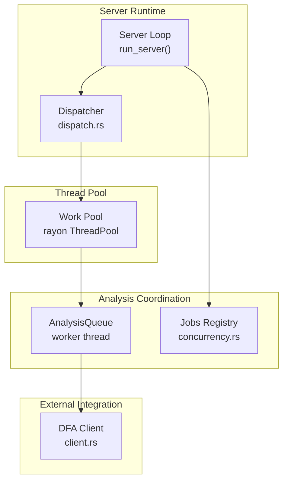
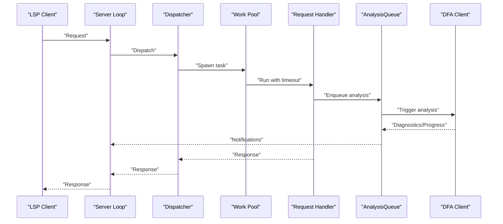
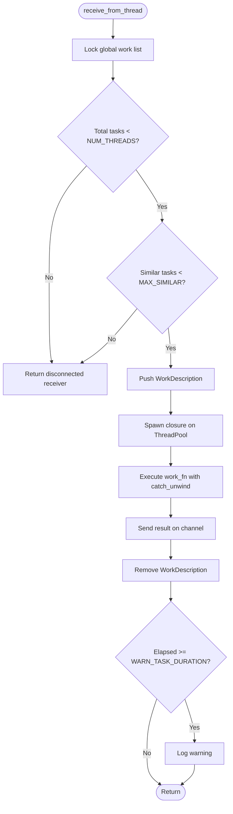
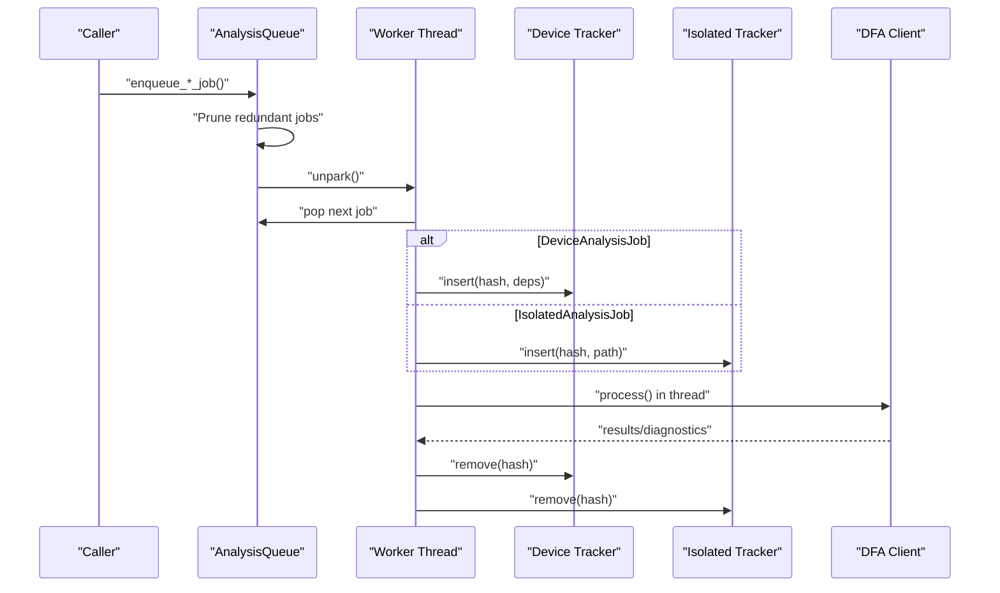
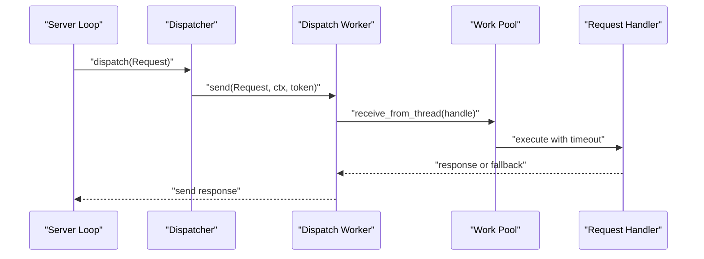
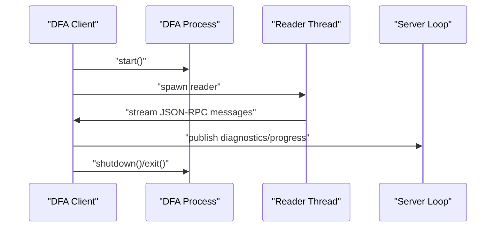
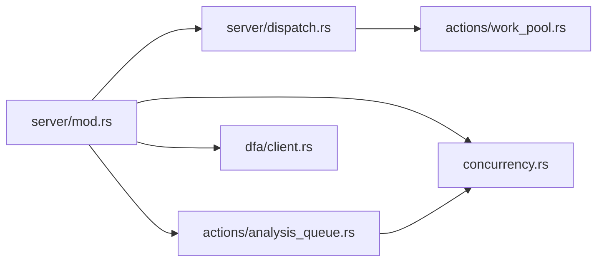

# Concurrency and Threading

<cite>
**Referenced Files in This Document**
- [concurrency.rs](file://src/concurrency.rs)
- [work_pool.rs](file://src/actions/work_pool.rs)
- [analysis_queue.rs](file://src/actions/analysis_queue.rs)
- [client.rs](file://src/dfa/client.rs)
- [dispatch.rs](file://src/server/dispatch.rs)
- [mod.rs (server)](file://src/server/mod.rs)
- [main.rs](file://src/main.rs)
- [lib.rs](file://src/lib.rs)
</cite>

## Table of Contents
1. [Introduction](#introduction)
2. [Project Structure](#project-structure)
3. [Core Components](#core-components)
4. [Architecture Overview](#architecture-overview)
5. [Detailed Component Analysis](#detailed-component-analysis)
6. [Dependency Analysis](#dependency-analysis)
7. [Performance Considerations](#performance-considerations)
8. [Troubleshooting Guide](#troubleshooting-guide)
9. [Conclusion](#conclusion)
10. [Appendices](#appendices)

## Introduction
This document explains the concurrency and threading model of the DML Language Server. It covers thread pool management, work queue orchestration, analysis coordination, and integration with the DFA client. It also details scheduling strategies, resource allocation, deadlock prevention, load balancing, server responsiveness, memory management in multi-threaded environments, debugging concurrent code, and testing approaches including performance profiling.

## Project Structure
The concurrency-related code spans several modules:
- Global concurrency primitives and job lifecycle management
- Request work pool using a thread pool
- Analysis queue with a dedicated worker thread and per-task trackers
- Server dispatcher that routes requests to the work pool
- DFA client integration for external analysis and diagnostics
- Server runtime that coordinates shutdown and job termination



**Diagram sources**
- [dispatch.rs](file://src/server/dispatch.rs#L122-L157)
- [work_pool.rs](file://src/actions/work_pool.rs#L34-L38)
- [analysis_queue.rs](file://src/actions/analysis_queue.rs#L50-L69)
- [concurrency.rs](file://src/concurrency.rs#L70-L122)
- [client.rs](file://src/dfa/client.rs#L112-L154)

**Section sources**
- [lib.rs](file://src/lib.rs#L32-L49)
- [main.rs](file://src/main.rs#L15-L59)

## Core Components
- ConcurrentJob and Jobs registry: manage long-running tasks, cancellation, and deterministic teardown for tests.
- Work pool: a fixed-size thread pool with capacity checks and per-work-type limits.
- AnalysisQueue: a single-threaded worker that serializes and executes analysis tasks, with in-flight trackers to avoid duplicates.
- Dispatcher: routes LSP requests to the work pool and ensures timeouts and graceful failure.
- DFA client: spawns an external process, reads diagnostics and progress events, and coordinates analysis lifecycle.

**Section sources**
- [concurrency.rs](file://src/concurrency.rs#L58-L153)
- [work_pool.rs](file://src/actions/work_pool.rs#L22-L103)
- [analysis_queue.rs](file://src/actions/analysis_queue.rs#L39-L351)
- [dispatch.rs](file://src/server/dispatch.rs#L122-L157)
- [client.rs](file://src/dfa/client.rs#L112-L417)

## Architecture Overview
The server’s concurrency model separates concerns:
- The main server loop handles LSP messages and orchestrates analysis.
- The Dispatcher forwards non-blocking requests to the work pool with timeouts.
- The work pool executes request handlers concurrently, respecting global and per-type concurrency caps.
- The AnalysisQueue runs a dedicated worker thread to serialize heavy analysis tasks, avoiding contention and redundant work.
- The DFA client runs an external process and streams diagnostics and progress updates back to the server.



**Diagram sources**
- [dispatch.rs](file://src/server/dispatch.rs#L60-L93)
- [work_pool.rs](file://src/actions/work_pool.rs#L53-L103)
- [analysis_queue.rs](file://src/actions/analysis_queue.rs#L174-L250)
- [client.rs](file://src/dfa/client.rs#L338-L380)

## Detailed Component Analysis

### ConcurrentJob and Jobs Registry
- ConcurrentJob wraps a crossbeam channel to signal completion and a JobStatusKeeper to support cooperative cancellation.
- JobToken is the worker-side companion; dropping it indicates completion.
- Jobs<T> maintains a registry keyed by identifiers, with GC and wait-for-all semantics to aid deterministic tests.

```mermaid
classDiagram
class ConcurrentJob {
-chan : Receiver<Never>
-keeper : JobStatusKeeper
+new() (ConcurrentJob, JobToken)
+kill() void
-is_completed() bool
-is_killed() bool
}
class JobToken {
-chan : Sender<Never>
+status : AliveStatus
+is_alive() bool
}
class JobStatusKeeper {
-arc : Option<Arc<()>>>
+new() (JobStatusKeeper, AliveStatus)
+kill() void
+is_killed() bool
}
class AliveStatus {
-weak : Weak<()>
+is_alive() bool
+assert_alive() void
}
class Jobs~T~ {
-jobs : HashMap<T, ConcurrentJob>
+add(ident : T, job : ConcurrentJob) void
+kill_all() void
+kill_ident(ident : &T) void
+wait_for_all() void
-gc() void
}
ConcurrentJob --> JobStatusKeeper : "owns"
JobToken --> AliveStatus : "holds"
Jobs --> ConcurrentJob : "stores"
```

**Diagram sources**
- [concurrency.rs](file://src/concurrency.rs#L26-L153)

**Section sources**
- [concurrency.rs](file://src/concurrency.rs#L26-L153)

### Work Pool Management and Task Scheduling
- Uses a rayon ThreadPool configured with a fixed number of threads.
- Tracks active work items globally and per WorkDescription to cap similar tasks.
- Enforces a per-request timeout and a warning threshold for long-running tasks.
- Fail-fast when capacity is reached to prevent overload.



**Diagram sources**
- [work_pool.rs](file://src/actions/work_pool.rs#L53-L103)

**Section sources**
- [work_pool.rs](file://src/actions/work_pool.rs#L22-L103)

### Analysis Queue and Coordination
- Single-threaded worker thread processes a queue of analysis jobs.
- Uses trackers to avoid duplicate device jobs and to track in-flight isolated/device work.
- Emplaces sentinels to ensure proper sequencing and avoids double-queuing.
- Integrates with the DFA client to stream diagnostics and progress.



**Diagram sources**
- [analysis_queue.rs](file://src/actions/analysis_queue.rs#L159-L250)

**Section sources**
- [analysis_queue.rs](file://src/actions/analysis_queue.rs#L39-L351)

### Dispatcher and Request Handling
- Non-blocking requests are dispatched to the work pool with a WorkDescription derived from the method name.
- The dispatcher spawns a dedicated worker thread that receives requests, creates a JobToken, registers the job, and executes the handler.
- Timeouts are enforced both at dispatch and inside the work pool to avoid wasted resources.



**Diagram sources**
- [dispatch.rs](file://src/server/dispatch.rs#L122-L157)
- [dispatch.rs](file://src/server/dispatch.rs#L60-L93)

**Section sources**
- [dispatch.rs](file://src/server/dispatch.rs#L122-L157)

### DFA Client Integration
- Spawns an external DFA process and reads messages asynchronously on a background thread.
- Parses diagnostics and progress notifications, tracks waiting sets, and coordinates shutdown.
- Supports waiting for analysis completion and collecting diagnostics.



**Diagram sources**
- [client.rs](file://src/dfa/client.rs#L112-L154)
- [client.rs](file://src/dfa/client.rs#L338-L380)

**Section sources**
- [client.rs](file://src/dfa/client.rs#L112-L417)

## Dependency Analysis
- The server module composes the dispatcher, which depends on the work pool and request traits.
- The work pool depends on rayon and uses a mutex-guarded work list.
- The analysis queue depends on the Jobs registry for tracking and integrates with the DFA client.
- The concurrency module provides foundational primitives used across the system.



**Diagram sources**
- [mod.rs (server)](file://src/server/mod.rs#L68-L84)
- [dispatch.rs](file://src/server/dispatch.rs#L122-L157)
- [work_pool.rs](file://src/actions/work_pool.rs#L34-L38)
- [analysis_queue.rs](file://src/actions/analysis_queue.rs#L50-L69)
- [concurrency.rs](file://src/concurrency.rs#L70-L122)
- [client.rs](file://src/dfa/client.rs#L112-L154)

**Section sources**
- [lib.rs](file://src/lib.rs#L32-L49)

## Performance Considerations
- Fixed-size thread pool: prevents oversubscription and controls memory footprint. Tune the number of threads to match CPU cores and I/O characteristics.
- Per-type concurrency cap: limits saturation of similar work (e.g., repeated requests) to maintain responsiveness.
- Dedicated analysis worker: reduces contention and avoids redundant analysis by pruning queues and tracking in-flight work.
- Timeouts: protect against long-running or stalled tasks and ensure timely responses.
- Logging thresholds: warnings for long-running tasks help identify hotspots.

[No sources needed since this section provides general guidance]

## Troubleshooting Guide
- Deadlock prevention
  - Use JobToken to signal completion cooperatively; dropping the token indicates completion.
  - Avoid holding locks across async boundaries; the work pool and dispatcher minimize blocking.
  - Use wait_for_all in tests to ensure deterministic teardown.

- Load balancing strategies
  - Prefer the work pool for CPU-bound tasks; keep the analysis queue single-threaded to avoid contention.
  - Limit similar tasks to prevent saturation; the per-type cap mitigates this.

- Server responsiveness
  - Non-blocking requests are routed to the work pool; timeouts ensure quick failure.
  - The server loop periodically ends progress and discards stale analysis to keep memory in check.

- Memory management in multi-threaded environments
  - Use Arc/Mutex for shared state; avoid sharing mutable structures across threads without synchronization.
  - Prefer message passing (channels) for inter-thread communication (e.g., AnalysisQueue, Dispatcher).

- Debugging concurrent code
  - Add structured logs around job creation, completion, and cancellation.
  - Use panic guards in the work pool to capture failures without crashing the entire system.
  - Leverage the Jobs registry to wait for all jobs during shutdown and tests.

**Section sources**
- [concurrency.rs](file://src/concurrency.rs#L98-L153)
- [work_pool.rs](file://src/actions/work_pool.rs#L80-L103)
- [dispatch.rs](file://src/server/dispatch.rs#L60-L93)
- [mod.rs (server)](file://src/server/mod.rs#L86-L107)

## Conclusion
The DML Language Server employs a layered concurrency model: a dispatcher feeds a bounded work pool for request handling, a single-threaded analysis queue coordinates heavy analysis work, and a Jobs registry provides lifecycle control and deterministic teardown. Integration with the DFA client is event-driven and robust, with timeouts and progress reporting. Together, these mechanisms balance throughput, responsiveness, and reliability while keeping memory usage predictable.

[No sources needed since this section summarizes without analyzing specific files]

## Appendices

### Examples of Concurrent Execution
- Concurrent analysis execution
  - Enqueue analysis jobs via the AnalysisQueue; the worker thread processes them sequentially, avoiding contention.
  - Track in-flight work to prevent duplicates and redundant processing.

- Deadlock prevention
  - Ensure every spawned task drops its JobToken upon completion.
  - Avoid long-held locks; release mutexes promptly.

- Load balancing
  - Keep the work pool size aligned with CPU cores and I/O characteristics.
  - Cap similar tasks to prevent hotspots.

[No sources needed since this section provides general guidance]

### Testing Approaches for Concurrent Systems
- Deterministic teardown
  - Use Jobs::wait_for_all to block until all registered jobs finish.
  - During shutdown, stop all jobs and wait for completion.

- Timeout-aware tests
  - The work pool uses timeouts; tests can rely on fallback responses when timeouts occur.

- Profiling and diagnostics
  - Enable warnings for long-running tasks to identify bottlenecks.
  - Monitor queue lengths and tracker states to detect saturation.

**Section sources**
- [concurrency.rs](file://src/concurrency.rs#L98-L117)
- [mod.rs (server)](file://src/server/mod.rs#L86-L107)
- [work_pool.rs](file://src/actions/work_pool.rs#L95-L101)